## Efficient Featurized Image Pyramid Network for Single Shot Detector

### Abstract

​		单阶段目标检测器由于其结合了高检测精度和实时速度的优点而近来得到普及。然而，这些检测器在标准化目标上已经取得了令人鼓舞的结果，但它们在小型目标上的性能却远远不能令人满意。为了检测非常小/大的目标，可以利用经典的金字塔表示，其中图像金字塔用于构建特征金字塔（特征化的图像金字塔：featurized image pyramid），其保证了跨越尺度范围的检测。由于已有的单阶段检测器的内存和时间复杂度，它们避免如此的特征化图像金字塔表示。本文中，我们介绍了一种轻量级的架构，可在单阶段检测框架中有效生成特征化的图像金字塔。然后，产生的多尺度特征使用注意力模块注入到检测器的预测层。我们检测器的性能在两个基准测试（PASCAL VOC 和 MS COCO）上验证。对于 $300 \times 300$ 的输入，我们的检测器在 Titan X GPU 上以每秒 111 帧的速度运行，其在 PASCAL VOC 2007 测试集上提供了最佳的检测准确率。在 MS COCO 测试集上，在单尺度推理的情况下，我们的检测器获得了超越所有现有单阶段方法的最新结果。

### 1. Introduction

​		通用目标检测器是计算机视觉中的基本问题之一，其在机器人、自动驾驶和视频监控中有着大量真实应用。通用目标检测中的最新进展很大程度上归功于在检测框架中成功部署了卷积神经网络（CNN）。通常，深度目标检测方法可以大致分为两个类别：两阶段 [13、14、16、29] 和单阶段检测器 [19、28、5] 。在两阶段方法中，首先生成目标提议，然后分类和回归。另一方面，单阶段方法通过对输入图像上的网格进行采样，将默认锚点直接回归到检测边界框中。单阶段检测器通常在计算上是高效的，但是与两阶段副本 [18] 相比，检测准确率较差。

​		在单阶段方法中，SSD [28] 提供了速度和检测准确率之间的最优平衡。标准的 SSD 使用 VGG-16 架构作为基网络，并且进一步添加卷积特征层到截断基网络的末尾。在 SSD 中，通过不同分辨率的层作出独立的预测，其中浅层或前面的层用于预测小型目标，而深层或后面的层致力于检测大型目标。尽管其获得成功，SSD 难以处理跨域目标实例的大尺度变化。特别地，SSD在小型目标上的检测性能难以让人满意 [18]，这可能是由于浅层或前面层中有限的信息。

​		文献中已经提出了多种解决方案，以减轻由尺度变化引起的问题。特征金字塔是许多识别系统中的关键组件，为标准解决方案奠定了基础 [1]。长期以来，人们一直追求从图像金字塔（特征化图像金字塔）中构建特征金字塔，并在许多经典的手工制作方法中使用它们 [11、9]。即使在现代深度目标检测方法中使用的 CNN对尺度变化是文件的，但是也通常采用相同形式的金字塔表示。

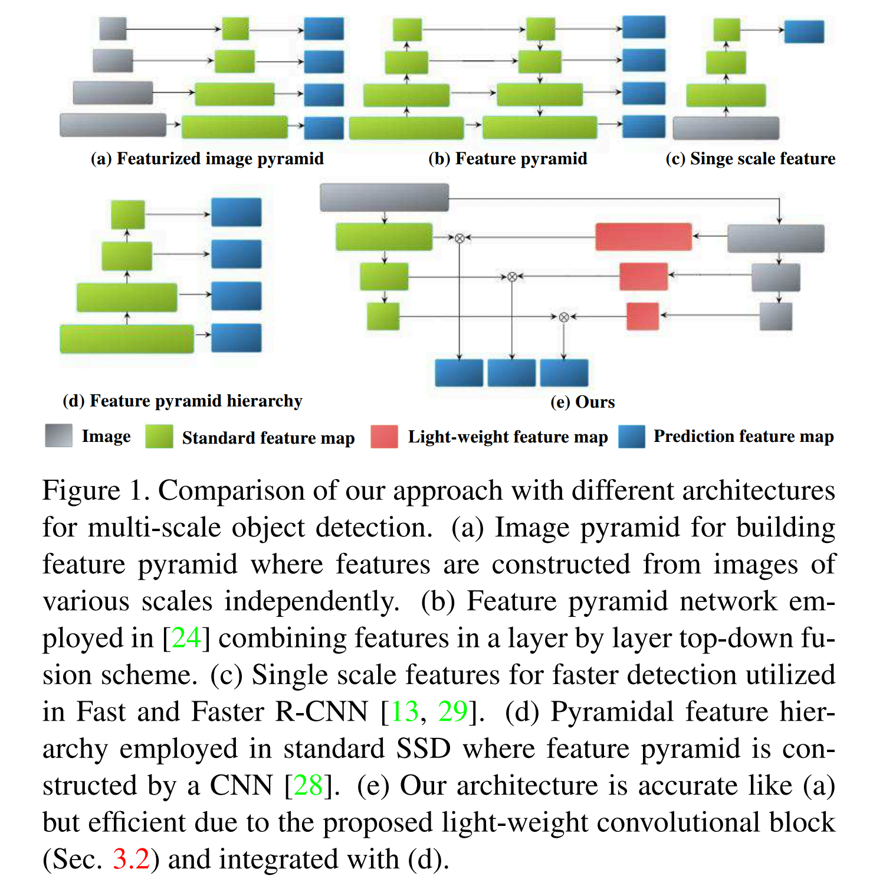

​		对于两阶段方法，早期工作 [29、13] 提倡使用单尺度特征（见图 1（c））。相比之下，最近的两阶段方法 [24] 已研究特征金字塔来获得更准确的检测（见图 1 （b））。这里，目标是通过上采样低分辨率的特征图来利用高级语义，并将它们与高分辨率特征图融合。然而，对于非常小和大尺寸的目标，如此的方法仍然不是最优的 [32] 。 对于非常小的目标，即使是较大的上采样因子也无法匹配预训练网络的典型分辨率（ $224 \times 224$ ）。因此，有特征金字塔网络生成的高级语义特征仍然对于非常小的目标检测是不合适的，反之亦然。此外，由于许多层的逐层融合，这种方法在计算上是昂贵的。

​		在单阶段方法的案例中，SSD 利用金字塔特征层级中的多个 CNN 层，产生不同空间分辨率的特征图（见图 1 （d））。但是，以高级语义信息为代价交换空间分辨率可能会影响性能。在这项工作中，我们旨在提高 SSD 的准确率，而不牺牲其标志性速度。我们回顾经典的图像金字塔方法（见图 1 （a）），其中通过在单阶段检测框架中分别对每个图像尺度应用 CNN 来生成不同尺度的特征图。但是，基于标准图像金字塔的特征表示（特征化图像金字塔）速度较慢，因为每个图像比例都经过深层的CNN来提取比例特定的特征图，从而使其不适用于高速 SSD。

**Contributions：**我们引入轻量的特征化金字塔（light-weight featurized image pyramid network：LFIP）来产生多尺度特征表示。在 LFIP网络（见图 1（e））中，首先对输入图像进行迭代下采样以构建图像金字塔层次结构，然后将其馈入浅层卷积块，生成一个特征金字塔，其中图像金字塔的每个级别都是特征化的。然后，在注意力模块中，特征金字塔的多尺度特征与标准 SSD 特征结合，以提升辨别性能力。此外，我们引入前馈融合块来集成前一层和当前层的特征。

​		我们在两个基准测试（PASCAL VOC 和 MS COCO）上执行大量实验。与现有的单阶段方法相比，我们的检测器在两个数据集上均提供了优异的结果。此外，与基线 SSD 相比，我们的方法可显着改善小型目标的检测结果，在 MS COCO 小型基上平均精度（AP）达到 7.4％ 的绝对增加。

### 2. Baseline Detector: SSD

​		我们的方法基于采用 VGG-16 架构作为骨干网的 SSD [28] 。给定大小为 $300 \times 300$ 的输入图像 $I$ ，SSD 使用原始 VGG-16 中的 特征大小为 $38 \times 38$ 的 $conv4\_3$ 层和特征大小为 $19 \times 19$ 的 $FC\_7$ （转换为卷积层）。截断了 VGG-16 网络最后的全连接层，并进一步添加一系列逐渐减小的 conv 层：$conv8\_2$、$con9v\_2$、$con10v\_2$ 和 $con11v\_2$ ，它们的特征大小分别为 $10 \times 10$、$5 \times 5$、 $3 \times 3$ 和  $1 \times 1$ 。检测器采用金字塔层次结构，其中浅层（ 即 $conv4\_3$ ）预测小型目标实例，而深层（即 $conv8\_2$ ）检测大型目标实例。以这种方式，在一组预定的边界框上，每个上述层都用于分数预测和偏移。得分预测是通过 $3 \times 3 \times N$ 滤波器维度执行的，其中 $N$ 是通道数。因此，使用 NMS 来获得最终的检测结果。更多细节参考 [28] 。

​		如上所述，标准的 SSD 通过利用多个 CNN 层以在金字塔层级中定位目标，每个层都指定用于检测特定尺度的目标。 这意味着使用具有小型感受野的前面层来检测小目标实例，而使用具有大型感受野的深层来定位大目标实例。然而，与深度层 [18] 相比，由于浅层中有限的信息，SSD 难以准确检测小型目标实例。Fu 等 [12] 提出使用反卷积层来引入大尺度上下文以及更好的特征提取网络（ResNet）来提高准确率。Cao 等 [4] 还研究了小型目标检测的问题，并将上下文信息引入到 SSD 。然而，这些方法改进了 SSD ，但是减小了速度。此外，额外的上下文信息可能引入没有必要的背景噪声，在某些情况下产生准确率的衰减。Zhang 等 [34] 通过集成语义分割分支扩展了标准的 SSD 。相反，我们回顾从图像金字塔构建特征金字塔的经典方法，而不牺牲 SSD 的标志性速度。

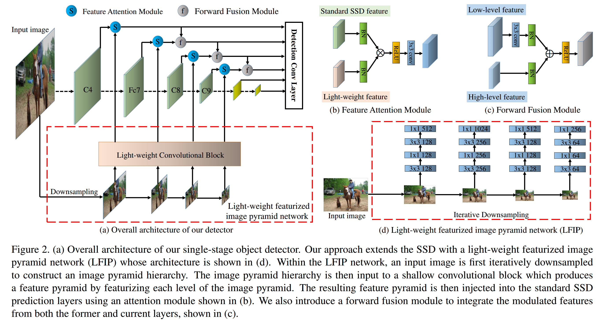

### 3. Method

​		这里，我们首先描述我们方法的整体架构，并引入替代的特征提取策略，用于我们的轻量的特征金字塔网络模块。此外，我们引入特征注意力和前馈融合模块。我们的检测器的整体架构（成为 LFIP-SSD）图 2（a）所示。LFIP-SSD 包含两个主要部分：标准的 SSD 网络和所提出的轻量特征化图像金字塔（light-weight featurized image pyramid network：LFIP）来产生特征金字塔表示。如 [28] ，我们采用 VGG-16 作为骨干网络，并添加一系列逐渐更小的卷积层。与标准的 SSD 不同，LFIP 包含一个迭代的下采样和轻量的卷积块。然后，使用注意力模块将 LFIP 的特征注入到标准 SSD 层。接着，在前向融合模块中，前层产生的特征与他们前一层的副本融合。

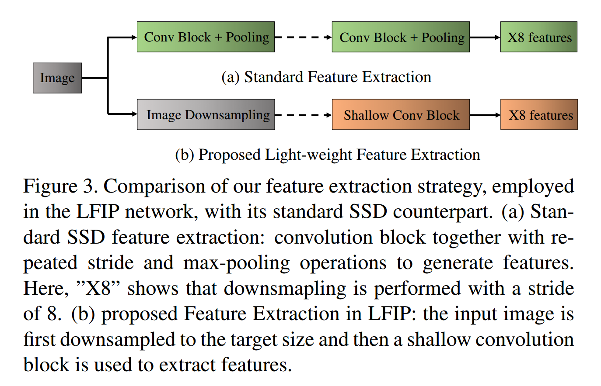

#### 3.1. Feature Extraction Strategy

​		传统目标检测框架通常在卷积块和最大池操作的重复堆栈中从VGG-16或ResNet-50中提取特征（见图3（a））。虽然产生的特征语义上是强壮的，但是它们往往会丢失可能有助于准确的目标分类的辨别性信息。作为一种替代方案，我们引入了高效的特征提取策略（见图 3（b））。在我们的策略中，首先，通过差值或池化操作下采样输入图像获得期望的不同 SSD 预测层的目标尺寸。然后，将这些下采样图像传入一个浅层卷积块。与传统图像金字塔网络中的深度 CNN 相比，我们的浅层卷积块提供了高速检测需要的效率，同时增强多尺度检测的辨别性信息。

#### 3.2. Light-weight Featurized Image Pyramid

​		如前面讨论的，标准的特征化图像金字塔效率低下，因为每个图像尺度都经过深度 CNN 来提取尺度特定的特征图。因此，高速单阶段检测器往往避免如此的特征化图像金字塔表示。这里，我们提出简单而有效的解决方案以高效地构建轻量特征化图像金字塔（LFIP）表示。如图 2（d）所示，LFIP 网络包含迭代的下采样部分和轻量化卷积块。给定输入图像 $I$ ，首先通过迭代的下采样构建图像金字塔 $I_p$ ：

$$I_p = \{i_1, i_2, \cdots, i_n\}, \tag{1}$$

其中 $n$ 表示图像金字塔级的数量。选择金字塔中的图像尺度来匹配标准 SSD 预测层特征图的大小，例如 $conv4\_3$ 。之后，将每个图像尺度传入浅层卷积块来生成多尺度轻量特征图：

$$S_p = \{s_1, s_2, \cdots, s_n\}, \tag{2}$$

其中 $s_1$ 表示标准 SSD 网络的 $conv4\_3$ 层的轻量特征，$s_n$ 表示为 SSD 网络的 $conv9 \_2$ 层生成的最后特征。浅层卷积块包含一个 $3 \times 3$ 卷积层和一个瓶颈块，如 [17] ，但是没有恒等快捷方式。由于我们的卷积块的浅层性质，不需要使用恒等快捷方式。我们浅层卷积块中的 conv 层的通道数量有所不同，以使最终的轻量级特征化图像金字塔与标准SSD特征图的金字塔相匹配。

#### 3.3. Feature Attention Module

​		这里，我们介绍 LFIP 网络生成的轻量特征图像金字塔是如何注入到标准的 SSD 预测层。我们引入特征注意力模块（feature attention module：FAM），如图 2（b）所示。首先，轻量特征化金字塔和标准的 SSD 特征图都传入 BatchNorm 层进行归一化。我们考虑不同的方式来融合归一化的特征集：concatenation、逐元素加法和逐元素乘法。我们发现逐元素乘法提供最佳的性能。因此，我们使用 ReLU 激活和 $3 \times 3$ 卷积层来生成 modulated 特征。对于输入图像 $I$ ，来自第 $k$ 个 SSD 预测层的标准 SSD 特征与相应的轻量 LFIP特征 $s_k$ 结合：

$$m_k = \varphi_k(\beta(f_k) \bigotimes \beta(s_k)), \tag{3}$$

其中 $m_k$ 为融合后的 modulated 特征，$\varphi(\cdot)$ 表示包含串型的 ReLU 和 $3 \times 3$ 卷积层，而 $\beta(\cdot)$ 表示 BN 运算。如图 4 所示，我们的 modulated 特征增强了标准 SSD 特征的辨别性能力。

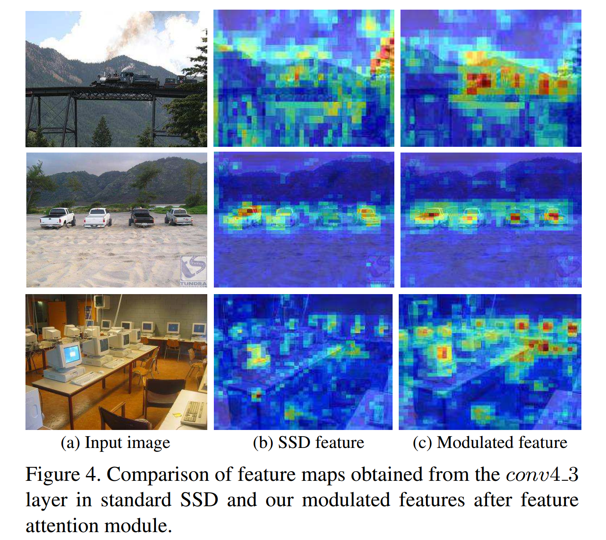

##### 3.4. Forward Fusion Module

​		为了进一步增强空间信息，我们引入简单的前向融合模块（forward fusion module）来集成前一层和当前层的 modulated 特征（图 2（c））。我们为 $FC\_7$ 到  $conv9\_2$ 层使用 FFM 模块。在 FFM 中，每个前层首先传入 $3 \times 3$ 卷积层以获得与当前层相同的尺寸。之后，将前一层 $m_{k-1}$ 和当前层 $m_k$ 的 modulated 特征穿过 BatchNorm，并使用逐元素加法操作结合它们。这后面是一个 ReLU 操作来产生最终的预测 $d_k$ ：

$$d_k = \gamma(\phi(m_{k-1}) \bigoplus \beta(m_k)), \tag{4}$$

其中 $\phi_k(\cdot)$ 表示包含串形 $3 \times 3$ 卷积和 BatchNorm 层，$\beta(\cdot)$ 是 BatchNorm，而 $\gamma$ 是 ReLU 激活。

### 4. Experiments

​		我们通过在两个数据集（PASCAL VOC 和 MS COCO）上进行实验验证我们的方法。我们首先介绍两个数据集，然后讨论我们所提出的检测器的实现细节。我们将我们的检测器与最佳的目标检测方法比较，并且还提供了对PASCAL VOC 2007数据集的全面消融研究。

#### 4.1. Datasets

**PASCAL VOC:**    PASCAL VOC 数据集包含 20 个不同的目标类。对于这个数据集，在包含 5K 张图像的 VOC 2007 trainval 和包含 11K 张图像的 VOC 2012 trainval 的并集上进行训练。在 5K 张图像的 PASCAL VOC 2007 测试集上评估。目标检测准确率使用 mAP 测量。

**MS COCO:**   MS COCO 数据集包含 80 个目标类的 160K 图像。数据集包含 80K 训练图像、40K 验证图像和 40K test-dev 图像。对于 MS COCO，对来自 trainval 集的 120k 图像进行训练，并在 test-dev 集上进行评估。我们遵循标准的 MS COCO 协议进行评估，其中的总体性能（平均精度 AP）是通过对多个 IOU 阈值（范围从 0.5 到 0.95）求平均值来测量的。

#### 4.2. Implementation Details

​		使用在 ImageNet 上预训练的 VGG-16 [31] 作为骨干进行实验。我们的完整训练和测试代码使用 PyTorch 模型实现。我们遵循与基线 SSD 相似的设置进行模型初始化和优化。在前 6 个周期中使用 warm-up 策略。首先将学习率设置为 $2 \times 10^{-3}$ ，对于 PASCAL VOC 数据集，在 150 和 200 个周期后将学习率减小到 $10^{-4}$ 和 $10^{-5}$ 。在 MS COCO 的情况下，在 90 和 120 个周期后将学习率减小到相同的值。遵循 [28] ，我们使用相同的损失函数、默认框的尺度和纵横比和数据增强方法。对于两个数据集，我们将 weight decay 设置为 32 。PASCAL VOC 和 MS COCO 数据集分别训练 250 和 160 个周期。VGG 骨干和 LFIP 的 FLOPs 分别为 1.6G 和 0.9G 。LFIP 的 FLOPs主要来自卷积运算及后面的逐元素乘法和加法。

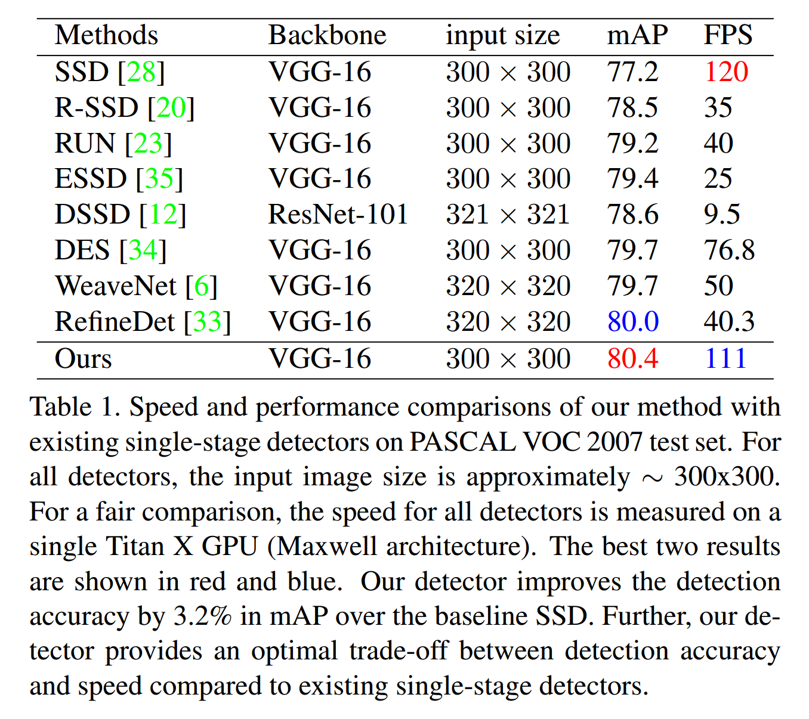

#### 4.3. Pascal VOC 2007

​		我们首先比较我们的检测器与基线 SSD 以及其他已有的单阶段检测器。为了公平比较，我们对我们的检测器和基线 SSD 都使用相同的设置。在速度和准确率方面，我们的检测器与基线和几个其他单阶段检测方法比较结果如表 1 所示。基线 SSD 获得 77.2 的 mAP 得分，同时以 120 FPS 的速度运行。在已有的单阶段检测器中，RefineDet 和 DES 分别给出了 80.0 和 79.7 的 mAP，同时分别以 40 和 77 FPS 的速度运行。我们的检测器在检测准确率和速度之间给出了最优的平衡，检测准确率为 80.4 mAP，速度为 111 FPS。

**State-of-the-art Comparison:**    

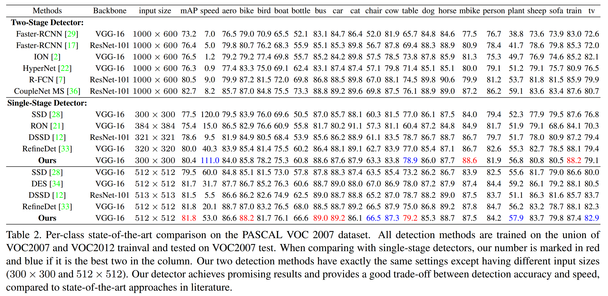

**Runtime Analysis:**

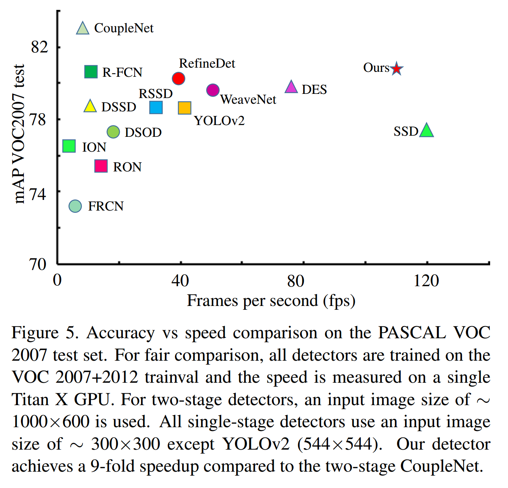

#### 4.4. Ablation Study on PASCAL VOC 2007

**Downsampling Strategies:**   见表 3 左边部分。

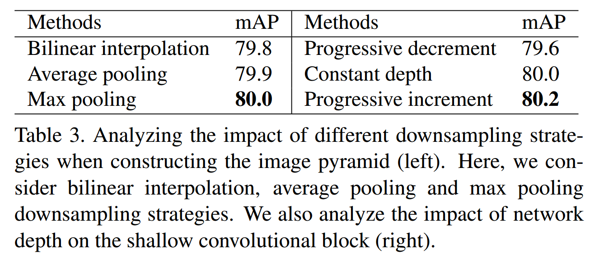

**Shallow Convolutional Block Depth: **  见表 3 右边部分。

**Impact of LFIP on SSD Prediction Layers:**

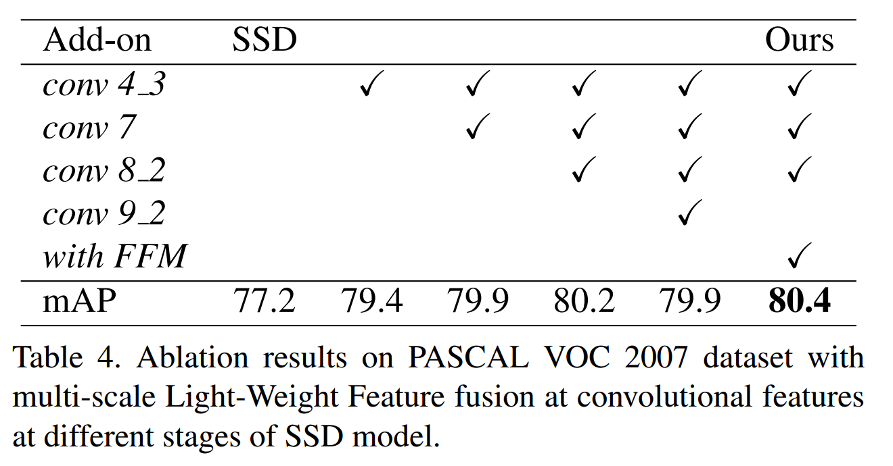

#### 4.5. MS COCO

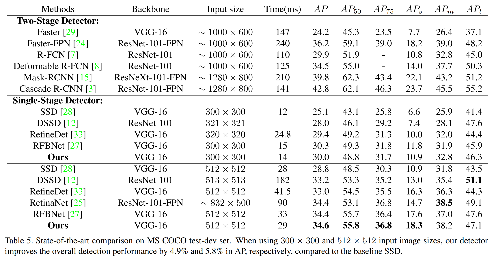

**Qualitative Analysis: **

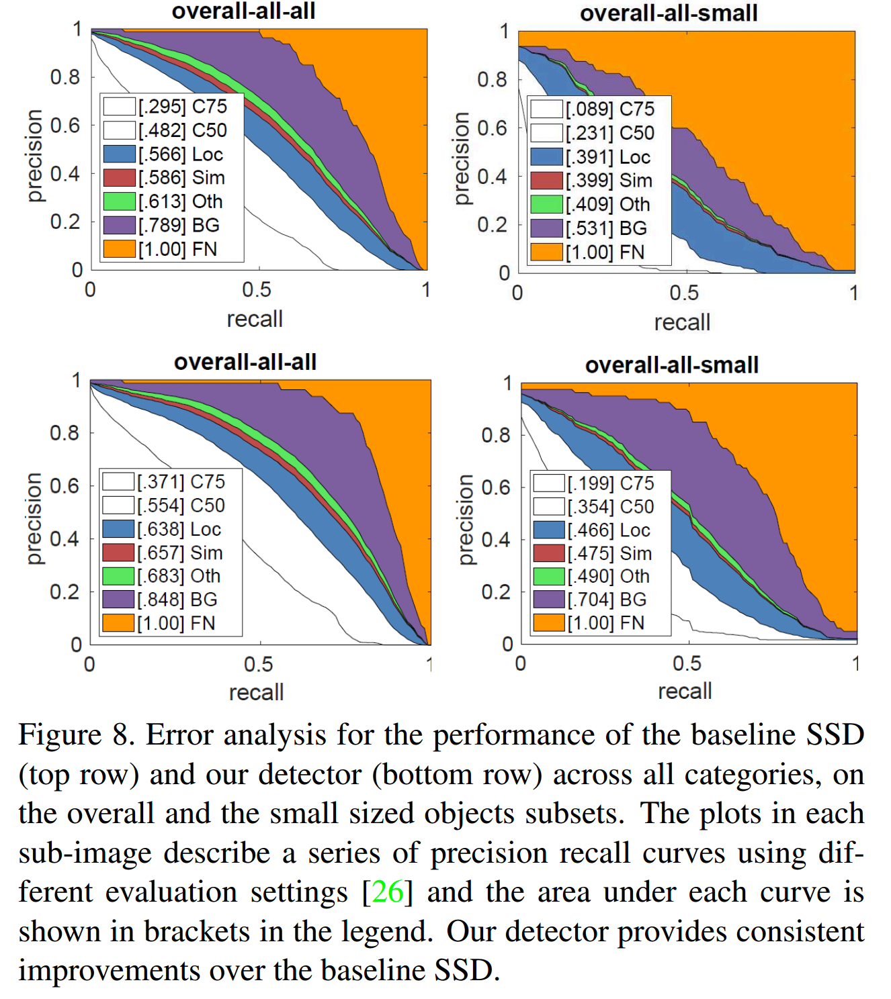