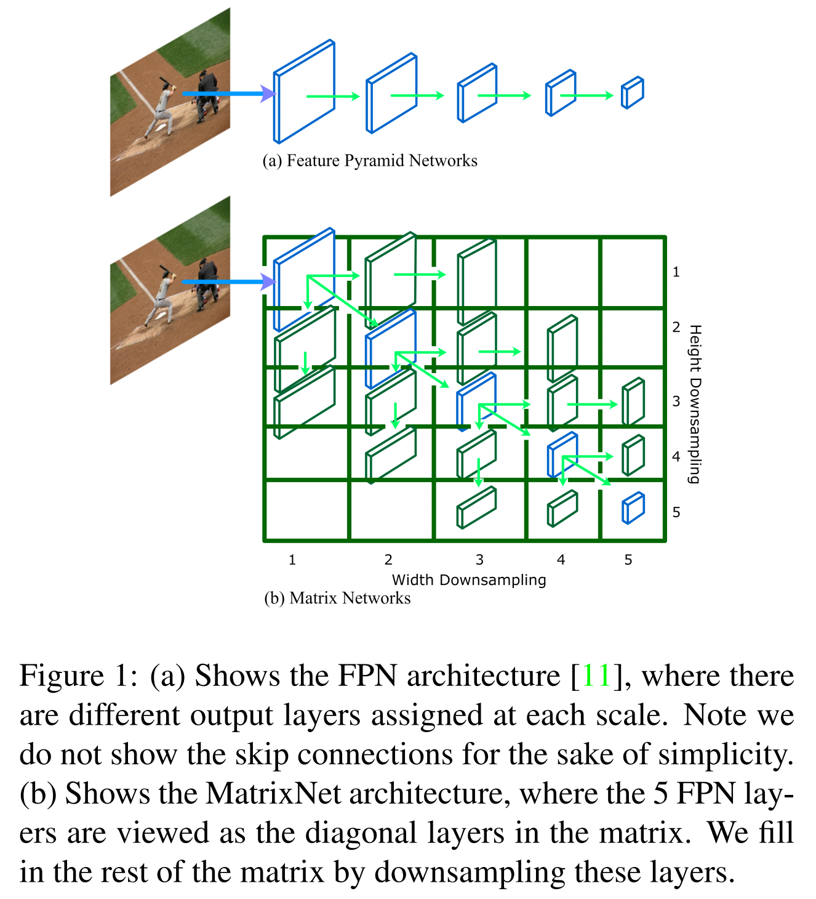
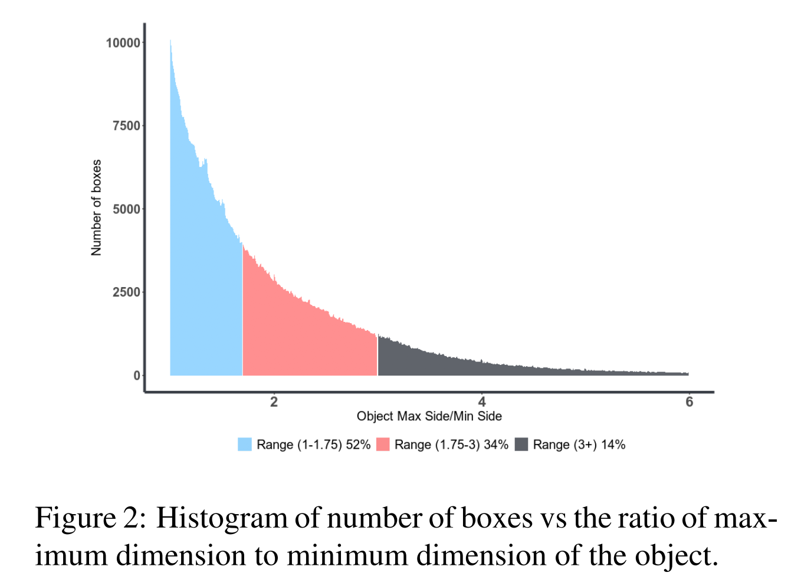
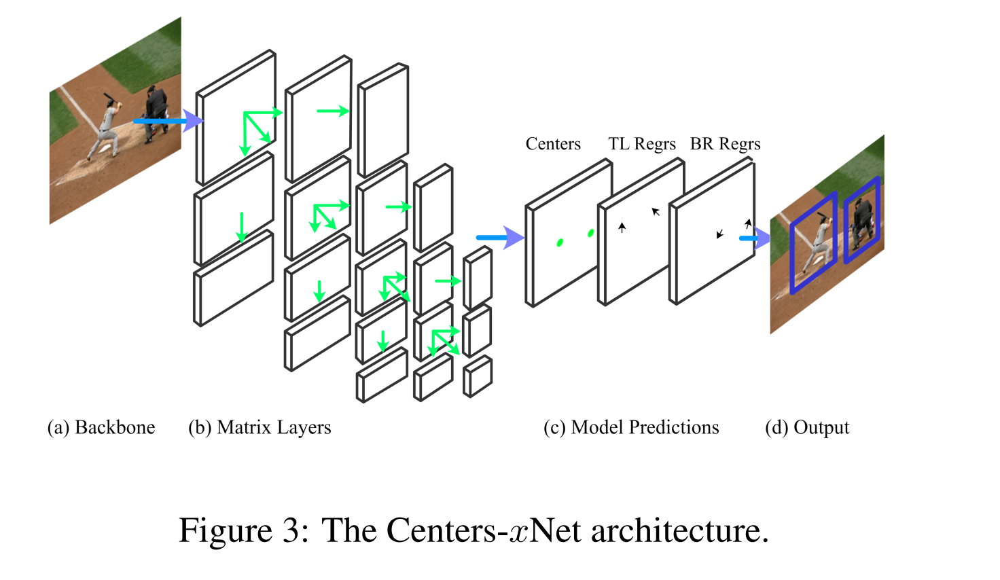
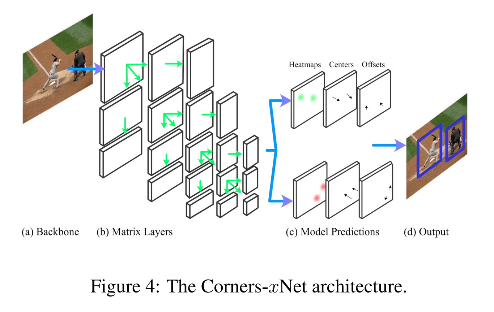
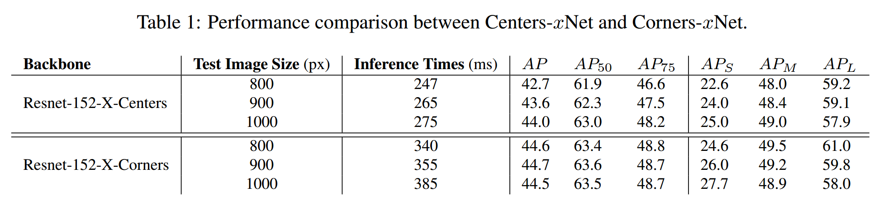
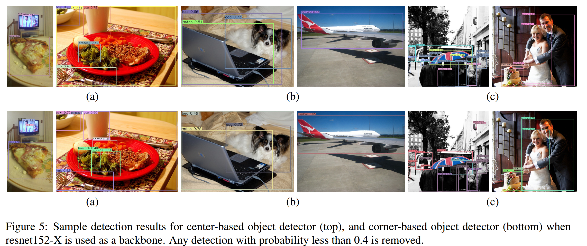
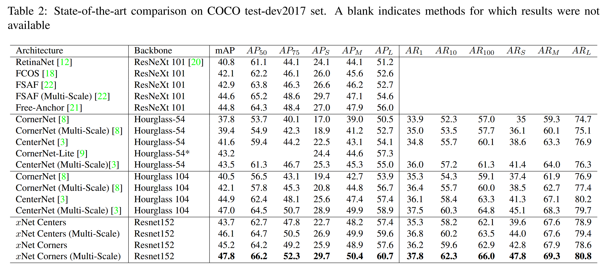
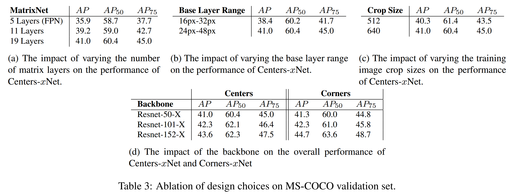

## MatrixNets: A New Scale and Aspect Ratio Aware Architecture for Object Detection
### Abstract

​		我们提出 MatrixNets（$xNets$），一种新的深度目标检测架构。$xNets$ 将相似大小和纵横比的目标映射到许多专门的特征，从而使 $xNets$ 可以提供可感知尺度和纵横比的架构。我们利用 $xNets$ 来增强一阶段目标检测框架。首先，我们在基于锚的目标检测上使用 $xNets$ ，为此我们可以预测目标中心并回归左上角和右下角。其次，我们通过预测左上角和右下角来使用 MatrixNets 进行基于角的目标检测。我们还通过替换嵌入层为中心回归来增强基于角点的检测。我们的最终架构在 MS COCO 上获得 47.8 的 mAP，这比 CornerNet 高 5.6 个 mAP，同时缩小了一阶段和两阶段检测器的差距。代码见 https://github.com/arashwan/matrixnet 。

### 1. Introduction

​		目标检测是计算机视觉中研究最广泛的任务之一，在目标跟踪、实例分割和图像字幕等任务中有许多应用。目标检测架构可以分为两个类别：两阶段检测器和一阶段检测器。两阶段检测器利用区域提议网络来找出固定数量的目标候选，然后，使用第二个网络来预测每个候选的得分，并精炼其边界框。此外，一阶段检测器还可以分为两类：基于锚的检测器 [12、22] 和基于角点（或者关键点）的检测器 [8、3] 。基于锚的检测器包含许多锚框，并且它们预测每个锚的偏移和类。另一方面，基于角点的检测器预测左上角和右下角的热图，并使用特征嵌入将它们匹配在一起。

​		在不同尺度检测目标是目标检测的主要挑战。尺度感知架构的最大进步是 Feature Pyramid Networks（FPS）[11]。FPN 利用不同感受野的多个层来获得尺度不变，使得目标可以映射到与感受野相关的层。小型目标映射到金字塔的早期层，而更大的目标映射到后面的层。因为目标的大小相对于该层的下采样在金字塔层之间几乎保持一致，因此可以在所有层之间共享单个输出子网。尽管 FPN 提供了处理不同大小的目标的优雅方式，但是它们没有提供处理不同纵横比的目标的解决方案。**诸如高塔、长颈鹿或小刀之类的目标会给 FPN 带来设计上的困难：是否会根据它们的宽度或高度将这些目标映射到层上 ？**根据目标的较大的维度将其分配给层会导致图像由于主动下采样而沿较小维度丢失信息，反之亦然。这个问题在像MSCOCO [13]这样的数据集中很普遍。图 2 展示了目标数与目标最大边除以最小边的直方图。我们发现 50% 的目标的 max/min 值大于 1.75，而 14% 的目标的 max/min 值大约 3 。因此，有效地对这些矩形目标建模对于良好的检测性能至关重要。本文中，我们引入 MatrixNets（ $xNets$ ），一种新的尺度和纵横比感知的 CNN 架构。$xNets$（如图 1 所示）有几个 matrix 层，每层处理特定大小和纵横比的目标。$xNets$ 将不同大小和纵横比的目标分配个不同层，使得它们所分配层中的目标大小接近统一。这种分配允许使用正方形输出卷积核来等价地聚合关于所有纵横比和尺度的目标的信息。$xNets$ 可以用于任意骨干，这与 FPN 相似。我们通过在骨干名称之后附加 “-X” 来表示这个骨干，即 ResNet50-X [7]。作为 $xNets$ 的一个应用，我们首先使用 $xNets$ 进行基于锚点的一阶段目标检测。我们决定考虑每个特征图一个锚框的情况，而不是使用每个特征图使用多个锚框，这使得它与无锚的架构相似。在第二个应用中，我们使用 $xNets$ 进行基于角点的目标检测。我们展示如何利用 $xNets$ 来提高 CornerNet 架构。在 MS-COCO 上，我们为人工设计的一阶段检测器设定了新的最佳性能（47.8 mAP）。

### 2. Related Work

​		**Two-Stage Detectors：**两阶段检测器通过首先提取 RoI 而生产最终的检测，然后，在第二个阶段中，分类和回归 RoI 。两阶段目标检测范式由 R-CNN [5] 第一次引入。R-CNN 使用选择性搜索 [19] 来提出 RoI ，然后使用 CNN 网络来评分和精炼 RoI 。Fast-RCNN [4] 和 SPP [6] 通过从特征图提取 RoI 来改进 R-CNN，而不是输入图像中提取 RoI 。Faster-RCNN [17] 引入了 RPN ，它是一种可训练的 CNN，可生成 RoI，从而可以对两阶段检测器进行端到端训练。自[2、11、10]开始，已经提出了对 Faster-RCNN 框架的一些改进。

​		**One-Stage Detectors：**基于锚的检测器是单阶段目标检测器最常用的框架。基于锚的检测器通过直接分类和回归预定义的锚来生成检测。YOLO [15，16] 是第一种一阶段检测器之一，因为它可以实时运行，因此仍被广泛使用。与两阶段检测器相比，一阶段检测器的速度往往更快，但性能却落后。RetinaNet [12] 是首次尝试缩小两种范式之间的差距。RetinaNet 提出 focal loss 来帮助纠正正负锚框的类不平衡。RetinaNet 使用手工启发式方法通过 IOU 将锚分配给 ground-truth 目标。最近，已经发现，改进分配给 ground-truth 的锚可以对性能产生重大影响[22、21] 。此外，Feature Selective Anchor-Free（FSAF）[22] 利用将基于锚的输出与无锚输出头部结合以提高性能。AnchorFree [21] 通过将问题表述为最大似然估计（MLE），改进了对 ground-truth 匹配过程的锚点。

​		一阶段检测的另一种框架是基于角点（或基于关键点）的检测器，其由 CornerNet [8] 第一次引入。CornerNet 预测左上角和右下角热图，并使用特征嵌入将它们匹配到一起。CenterNet [3] 通过预测目标中心点与角点改进了 CornetNet 架构。

### 3. MatrixNets

​		MatrixNets（ $xNets$ )（如图 1 所示）使用层的 matrix 建模不同大小和纵横比的目标，其中 matrix 中的每个实体 $i,j$  表示一个层 $l_{i,j}$ 。每层 $l_{i,j}$ 具有 $2^{i-1}$ 的宽度下采样和 $2^{j-1}$ 的高度下采样。左上角的层（base layer）是 matrix 中的 $l_{1, 1}$ 。对角层是不同大小的正方形层，等价于 FPN ，而对角两边的层是矩形层，为 $xNets$ 特有。层 $l_{1, 1}$ 在尺寸上最大的，向右的每一步都会将层的宽度减半，而向下的每一步都会将高度减半。例如，$Width(l_{3,4}) = 0.5 * Width(l_{3,3})$ 。对角层建模类似正方形的纵横比，而对角层两边的层建模更极端的纵横比。接近 matrix 的右上角或左上角的层建模非常高或非常低纵横比的目标。这些目标很少，因此可以将这些层修剪以提高效率。

#### 3.1. Layer Generation

​		生成 matrix 层是直观重要的一步，因为它们影响模型的参数量。参数越多，模型的表达性就越高，但是优化问题就越困难 。在我们的模型中，我们选择尽可能少的引入新的参数。对角层可以从骨干的不同阶段上获得，或者使用特征金字塔骨干获得。上三角层通过在对角层上应用一系列步长为 $1 \times 2$ 的共享卷积获得，相似地，使用步长为 $2 \times 1$ 的共享卷积获得左下角的层。这中共享有助于减小额外的有 matrix 层引入的参数量。

#### 3.2. Layer Ranges

​		我们定义 matrix 中分配给每一层的目标的宽度和高度范围，以使每一层都可以专门化。这个范围需要反映 matrix 层中特征向量的感受野。matrix 中向右的每一步有效地加倍累水平维度的感受野，而向下的每步加倍了垂直维度的感受野。因此，当我们在矩阵中向右或向下移动时，宽度或高度的范围需要加倍。一旦定义第一层  $l_{1,1}$ 的范围，我们便可以使用上述规则为余下的 matrix 层生成范围。例如，如果层 $l_{1, 1}$ （base layer）的范围为 $H \in [24px, 48px]$ ，$W \in [24px, 48px]$，那么层 $l_{1, 2}$ 的范围为 $H \in [24, 48], W \in [48, 96]$ 。我们在消融研究中给出多个层的范围。

​		**在这些范围的边界上的目标可能会破坏训练的稳定性**，因为如果目标大小略有变化，则层分配将会更改。为了避免这个问题，我们通过在两个方向上扩展它们来松弛层边界。**这种松弛是通过将范围的下限乘以小于1的数字，以及将上限乘以大于1的数字来实现的。 ** 在所有实验中，我们分别使用 0.8 和 1.3 。

#### 3.3. Advantages of MatrixNets

​		MatrixNets 的主要优势是，它们运行使用正方形的卷积核来准确地聚合不同纵横比的信息。在传统的目标检测模型（例如 RetinaNet）中，正方形卷积核需要输出不同纵横比和尺度的边界框。使用正方形卷积核是违反直觉的，因为不同纵横比和尺度的边界框需要不同的上下文。在 MatrixNets 中，由于上下文在每个 matrix 层中都发生变化，因此相同的正方形卷积核可用于检测不同尺度和纵横比的框。由于目标的大小在它们所分配的层中几乎是均匀的，因此，与如 FPN 的其他架构相比，宽度和高度的动态范围较小。因此，回归目标的高度和宽度成为一个更容易优化的问题。最后，MatrixNets 可以用作骨干，以进行任意的目标检测框架，包括基于锚或基于关键点、一阶段或两阶段检测器。

### 4. MatrixNets Applications

​		本节中，我们证明 MatrixNets 可以用作两阶段目标检测、基于中心和基于角的目标检测的骨干。在基于中心的目标检测中，我们预测目标的中心，同时回归左上角和右下角。在基于角点的目标检测中，我们预测目标的焦点和回归目标的中心。预测具有相同中心的角点可以匹配到一起组成检测。

#### 4.1. Center-based Object Detection

​		基于锚的目标检测是单阶段目标检测常用的框架。使用 MatrixNet 作为骨干自然地处理不同尺度和纵横比的目标。尽管使用不同尺度的多个锚可以潜在提高性能，但是我们通过使用每个位置一个锚来简化架构，使其是无锚的。因此，训练期间，ground-truth 目标可以分配给最近的中心位置。

##### 4.1.1 Center-based Object Detection Using MatrixNets

​		如图 3 所示，我们的 $\mbox{Centers}-x\mbox{Net}$ 架构包含 4 个阶段。（a-b）我们使用  第 3 节中定义的 $x\mbox{Net}$ 。（c）使用共享的输出子网络，对于每个 matrix 层，我们预测它们层中目标的中心热图、左上角回归和右下角回归 。（d）我们使用 soft-NMS 组合所有层的输出以获得最终的输出。

​		**Center Heatmaps**	训练期间，首先，根据其宽度和高度将 ground-truth 分配给矩阵中的各层。在层中，目标分配给最近的中心位置。为了处理不平衡的类，我们使用 focal loss [12] 。

​		**Corner Regression**	目标的大小由矩阵层约束，这使得回归目标的左上角和右下角是可行的。如图 3 所示，对于每个中心， $\mbox{Centers}-x\mbox{Net}$ 预测对应的左上角和右下角。训练期间，我们使用 smooth L1 loss 进行参数优化。

​		**Training**	所有实验中，我们使用 23 的 batch size 。训练期间，我们使用 $640 \times 640$ 的裁剪大小，并且我们使用 0.6-1.5 的标准尺度扰动。为了优化，我们使用 Adam 优化器，并将初始学习率设置为 $5e-5$ ，并且在 250K 迭代后降低 $1/10$ ，共计训练 350K 次迭代。对于 4 个 matrix 层的范围，我们设置 $l_{1, 1}$ 的范围为 $[24px-48px] \times [24px-48px]$ ，然后余下的尺度如第 3 节所述。

​		**Inference**	对于单尺度推理，我们将图像的最大边调整到 900 px。我们使用原始和水平翻转的图像作为网络的输入。对于网络中的每层，我们选择前 100 个中心检测。使用左上角和右下角的回归输出计算角点。然后，混合原始图像和翻转图像的边界框。Soft-NMS [1] 层用于减少冗余检测。最后，我们根据它们的得分选择前 100 个检测作为检测器的最终输出。

#### 4.2. Corner-based Object Detection

​		提出 CornerNet [8] 作为基于锚的检测器的替代，CornerNet 将边界框预测为一对角：左上角和右下角。对于每个角，CornerNet 预测热图、偏移和嵌入。从热图中提取左上角和右下角候选。嵌入用于分组属于相同目标的左上角和右下角。最后，偏移用于精炼边界框，从而产生更紧凑的边界框。这种方法有三个主要局限：

1. CornerNet 使用单个输出层处理不同大小和纵横比的目标。因此，预测大型目标的角点带来了挑战，因为关于角点位置处的目标的可用信息并不总是通过常规卷积获得。为了解决这个挑战，CornerNet 引入角池化层，其使用水平和垂直维度上的最大运算。左上角的角池化层扫描整个右下角的图像以检测任何角的存在。尽管实验上证明角池化稳定模型，但是我们知道最大运算损失信息。例如，如果顶部边界的两个目标共享相同的位置，那么仅具有最大特征的目标贡献梯度。因此，由于角池化层，我们可以预期会看到假阳性。
2. 左上角和右下角的匹配在特征嵌入中完成。在这种设置中，使用嵌入会引起两个问题。首先，逐对距离需要在训练期间优化，因此，随着图像中目标数量的增加，角点对的数量呈二次方增加，这在处理密集目标检测时影响训练的稳定性。第二个问题是学习嵌入自身。CornerNet 尝试学习以目标另一角的外观为条件的每个目标角的嵌入。现在，如果目标过大，两个角之间的距离会变大，那么两个角的外观可能非常不同。因此，每个角的嵌入可能也是不同的。同时，如果在图像中存在多个相似外观的角，它们的角的嵌入可能相似。这就是为什么我们会看到 CornerNet 融合人或交通灯的例子。
3. 作为前面两个问题的结果，CornerNet 被迫使用 Hourglass-104 骨干来获得最佳性能。Hourglass-104 有超过 200M 参数、非常慢和不稳定的训练，这需要 10 个 12 GB 内存的 GPU 来保证足够大的 batch size ，从而获得稳定收敛。

##### 4.2.1 Corner-based Object Detection Using MatrixNets

​		图 4 展示了我们所提出的基于角点的目标检测架构 $\mbox{Corners}-x\mbox{Net}$ 。 $\mbox{Corners}-x\mbox{Net}$ 包含 4 个阶段。（a-b）我们使用第 2 节中定义的 $x\mbox{Net}$ 骨干。（c）对于每个 matrix 层，使用共享的输出子网络，我们在相应层中预测目标的左上角和右下角的热图、角偏移和中心预测。（d）我们使用中心预测匹配角点到相同的层，然后利用 soft-nms 组合所有层的输出，从而获得最终输出。

​		**Corner Heatmaps**	使用 $x\mbox{Nets}$ 可以确保层内目标所需的上下文受该层中单个特征图的感受野限制。因此，不再需要角池化；规则的卷积层用于预测左上角和右下角的热图。与 CornerNet 相似，我们使用 focal loss 来处理不平衡的类。

​		**Corner Regression**	由于图像的下采样，精炼角对于具有更紧密的边界框很重要。将角按比例缩小到图层中的 $x,y$ 位置时，我们会预测偏移量，以便可以将角按比例缩放到原始图像大小而不会损失精度。我们保持偏移值在 $-0.5$ 和 $0.5$ 之间，并且我们使用 smooth L1 损失来优化参数。

​		**Center Regression**	因为匹配在每个 matrix 层中完成，所以能够保证目标的宽和高在一定范围内。因为目标的中心范围很小，所以目标的中心可以轻松地回归。在 CornerNet 中，中心的动态范围较大，尝试在单个输出层回归中心可能失败。一旦获得中心，通过比较两个角之间的回归中心和实际中心将角匹配到一起。训练期间，与学习嵌入情况下的二次增长相比，中心回归与图像中目标的数量成线性比例。为了优化参数，我们使用 smooth L1 损失。

​		**Corners Matching**	对于任意的角点对，正确的中心是它们 $x$ 和 $y$ 位置的平均。**如果两个角属于同一目标，则正确的中心与每个角之间的相对距离是两个角的中心回归的正确值。**因此，如果两个角都以 30％ 或更低的错误率预测中心，则我们会将这些角匹配在一起。

​		**Training**	我们的所有实验使用 23 个 batch size 。训练期间，我们使用大小为 $512 \times 512$ 的裁剪，摒弃使用 0.6-1.5 的标准缩放尺度。为了优化，我们使用 Adam 优化器，并将初始学习率设置为 5e-5 ，并且在 250K 迭代后降低 $1/10$ ，共计训练 350K 次跌倒。对于我们的 matrix 层的范围，我们将 $l_{1, 1}$ 的范围设置为 $[24 px - 48 px] \times [24 px - 48 px]$ ，然后按第 3 节所述的方法缩放余下的范围。

​		**Inference**	对于单尺度推理，我们将图像的最大边调整到 900px 。我们使用原始和水平翻转的图像作为网络的输入。对于网络中的每层，我们选择前 50 个左上角和右下角。角点位置使用角回归输出精炼，如我们上面讨论的。然后，混合原始图像和翻转图像的边界框。接着，使用 Soft-NMS [1] 来减少冗余检测。最后我们根据它们得分选择前 100 个检测作为检测器最终输出。

​		$\mbox{Corners}-x\mbox{Net}$ 解决 ConerNets 的问题（1）因为所有矩阵层都表示不同的尺度和纵横比，而不是将它们全部都放在一个单独的层中。所以，这也允许我们摆脱角池化操作。（2）得到解决，因为我们不再预测嵌入。相反，我们直接回归中心。通过解决 CornerNets 的前两个问题，我们将在实验中证明，我们可以获得明显比 CornerNet 高的结果。

### 5. Experiments

​		我们在 8 个 Titan XP GPU 的服务器上训练所有网络。我们的实验在 PyTorch 中完成，并且代码公开可用。对于评估，我们使用 MS COCO 检测数据集 [13] 。我们在 MS COCO “train-2017” 集上训练模型，在 “val-2017” 集上验证，并在 “test-dev2017” 上测试。为了模型之间的比较和消融研究，我们报告了“val-2017” 集上的数值。对于与其他检测器的比较，我们报告了“test-dev2017”上的数值。

​		在下一节中，我们比较 $\mbox{Centers}-x\mbox{Net}$ 和 $\mbox{Corners}-x\mbox{Net}$ 检测器。然后，我们将我们的检测器与其他检测器进行比较。最后，我们通过一组用于评估模型不同部分的实验来进行消融研究。

#### 5.1. $\mbox{Centers}-x\mbox{Net}$ vs $\mbox{Corners}-x\mbox{Net}$ 

​		在这个实验中，我们想要比较 $\mbox{Centers}-x\mbox{Net}$ 和 $\mbox{Corners}-x\mbox{Net}$  的性能。据我们所知，这是这两个框架之间的首次公平比较，因为两者共享相同的主干（Resnet-152-X）、训练和推理设置。

​		表 1 展示了不同测试图像下的两个架构的性能。在MS COCO “val-2017” 集上报告 mAP 值。 $\mbox{Centers}-x\mbox{Net}$ 在 1000 px 的测试图像大小下是最好的，而  $\mbox{Corners}-x\mbox{Net}$ 在 900px 的测试图像大小下是最好的。综合说来，$\mbox{Corners}-x\mbox{Net}$  在 mAP 方面比 $\mbox{Centers}-x\mbox{Net}$ 好。$\mbox{Corner}-x\mbox{Net}$  对于不同图像大小更具鲁棒性，当测试图像大小变化 $\pm 100 \mbox{px}$ 时，mAP 下降 $< 0.2$ mAP。另一方面，$\mbox{Centers}-x\mbox{Net}$ 对于测试图像大小非常敏感，并且当测试图像变化 $\pm 100 \mbox{px}$ 时，性能下降 $< 1.3$ mAP 。在 $\mbox{Centers}-x\mbox{Net}$ 情况下性能下降的原因是，如果同一目标的两个中心在同一位置碰撞，则可能会完全丢失该目标。因为 $\mbox{Centers}-x\mbox{Net}$ 等价于在每个位置使用一个锚，所以随着测试图像大小减小，碰撞的概率增加。因此，我们可以看出，随着我们减小图像大小，性能发生衰减。对于 $\mbox{Corners}-x\mbox{Net}$ ，如果在两个角发生碰撞，那么会丢失一个目标，这远远低于  $\mbox{Centers}-x\mbox{Net}$ 中发生的概率。

​		根据推断时间，在所有测试图像尺寸下，$\mbox{Centers}-x\mbox{Net}$ 架构都比$\mbox{Corners}-x\mbox{Net}$ 快 100 毫秒。$\mbox{Corners}-x\mbox{Net}$ 用了比 $\mbox{Centers}-x\mbox{Net}$ 更多的预测输出。同时，角匹配使用 GPU 和 CPU 时间。因此，使用 $\mbox{Corners}-x\mbox{Net}$  有 100ms 的开销。

​		表 1 的另一个观察，测试图像大小直接影响小型、中型和大型目标的 AP。此观察结果可用于调整我们主要感兴趣的一组目标上的 mAP 。为了保持一致性，从现在起到本文结束，我们将测试图像的大小固定为 900px 。

​		除了 mAP 值和推理时间，我们还研究了基于视觉检查的基于中心和基于角点的目标检测在性能上的差异。如图 5 所示，通过检查两个检测器的结果，我们观察到有三个主要差异。首先，基于角的检测器通常产生更好的结果，而基于中心的检测器有时会丢失图像中的可见目标。图 5a 展示了证明这些差异的一些例子。其次，与基于中心的检测器相比，基于角的检测器（如图 5b 所示）在目标周围产生具有更紧凑的边界框的精炼检测。最后，当检测目标被遮挡时，基于中心的检测器表现更好，而基于角的检测器倾向于将检测划分更小的边界框。例如，在图 5c 的第一幅图像，公交车被树遮挡，基于中心的检测器也能准确检测公交车。另一方面，基于角的检测器将检测划分为两个更小的边界框。

##### 5.2. Comparison To Other Detectors

​		我们将  $\mbox{Centers}-x\mbox{Net}$ 和 $\mbox{Corners}-x\mbox{Net}$ 的最佳检测器与其他一阶段检测器比较。我们报告 MS COCO “test-dev2017” 上的 mAP 值，比较结果见表 2 。

#### 5.3. Ablation Study

##### 5.3.1 MatrixNet Design

​		一个 5 层的 MatrixNet 等价于一个 FPN ，，因此我们将其用作评估向主干添加更多 matrix 层的基线。表 3a 展示了 matrix 层数量的不同选择的 mAP 值。与 FPN （5 层的 MatrixNet）相比，使用 19 层的 MatrixNet 将性能提高了 5.1 个点。在 19 层的 MatrixNet 中的额外层远比 FPN 层小，因为 matrix 中的每步向右或向下将宽或高减半。因此，19 层 MatrixNet 19 层中的锚的总数是 FPN 中的 2.5 倍。

​		我们还对两个检测器的检测结果进行视觉检查。图 6 显示了使用FPN（5层MatrixNet）与使用19层MatrixNet作为主干相比，基于中心的检测器的定性示例。通常，我们观察到使用 MatrixNet 可以更好地处理矩形目标。

##### 5.3.2 Layer Ranges

​		在这个实验中，我们想要测试 base layer（$l_{1,1}$）范围的选择对检测器性能的影响。我们使用 $\mbox{Centers}-x\mbox{Net}$ 架构来评估这个超参数的影响。表 3b 证明了 24px-48px 范围的更加有效。选择此范围的目的是为所有矩阵层分配平衡的目标。选择比 24px-48px 更大的范围（例如，32px-64px）要求使用更大的裁剪来保证足够的样本训练 matrix 的右下层。这需要更多的 GPU 和更长的训练时间。我们还发现层范围的选择对于 $\mbox{Corners}-x\mbox{Net}$ 架构如 $\mbox{Centers}-x\mbox{Net}$ 一样重要。

##### 5.3.3 Training Image Crop Sizes

​		训练期间，我们使用尺度扰动来随机缩放图像，然后使用固定大小的裁剪来训练模型。裁剪大小的选择主要影响 MatrixNet 的右下层。更小的裁剪尺寸将阻止这些层具有足够覆盖整个范围的目标。对于 $\mbox{Centers}-x\mbox{Net}$ ，训练的裁剪大小将影响角回归输出的性能以及检测器的综合性能。表 3c 展示了裁剪大小对 $\mbox{Centers}-x\mbox{Net}$ 架构综合性能的影响。对于 $\mbox{Corners}-x\mbox{Net}$ ，训练的裁剪大小将影响中心回归输出的性能，并且，因为我们允许 30% 的误差，我们发现图像裁剪的选择对 $\mbox{Corners}-x\mbox{Net}$ 的性能几乎没有影响。

##### 5.3.4 Backbones

​		骨干作为特征提取器。因此，更好和更大的骨干通常为架构带来更好的综合性能。表 3d 展示了使用 ResNet50、ResNet101 和 ResNet152 在  $\mbox{Centers}-x\mbox{Net}$ 和 $\mbox{Corners}-x\mbox{Net}$ 上的综合性能。