## OneNet: Towards End-to-End One-Stage Object Detection

### 摘要

​		到目前为止，端到端的一阶段目标检测已落后。本文发现，标签分配中样本与ground-truth之间缺乏分类成本（classification cost）是一阶段检测器去除非最大抑制（NMS）并达到端到端的主要障碍。已有的一阶段目标检测器进通过位置成本（例如边界框IoU或点距离）分配标签。没有分类成本，单独的定位成本导致推理中高置信度得分，是的NMS成为必须的后处理。

​		为了设计端到端的一阶段目标检测器，我们提出Minimu Cost Assignment。该成本是样本和ground-truth之间的分类成本与定位成本之和/对于每个目标ground-truth，仅将最低成本的一个样本分配为正样本； 其他都是负样本。为了评估我们的方法的有效性，我们设计一种极其简单的一阶段检测器（称为OneNet）。我们的结果表明，当利用Minimum Cost Assignment时，OneNet避免产生重复的边界框，并在512像素的图像大小上获得35.0AP/80FPS和37.7AP/50FPS。我们希望OneNet可以作为端到端的一阶段目标检测的有效极限。代码见https://github.com/PeizeSun/OneNet。

### 1. 引言

​		目标检测时计算机视觉领域以及保证下游应用的一项基础任务。它的目的是定位图像中一组目标，并识别它们的类别。当前目标检测器的一个主要主题是标签分配[11、10、28、1、26、21、19、33、41、40、2]。特别地，如何定义每个目标的正样本和背景的负样本已成为一个开放问题。

​		几十年来，目标检测中的正样本为与ground-truth边界框的IoU大于阈值的边界框候选。在经典计算机视觉中，在图像网格枚举的滑动窗口上使用分类器[4、9、36]。现代检测器在图像网格上预定义上千的锚框，并在这些候选上进行分类和回归[11、28、19、27]。我们将这些基于边界框的标签分配方法为“Box Assignment”，如图2a所示。

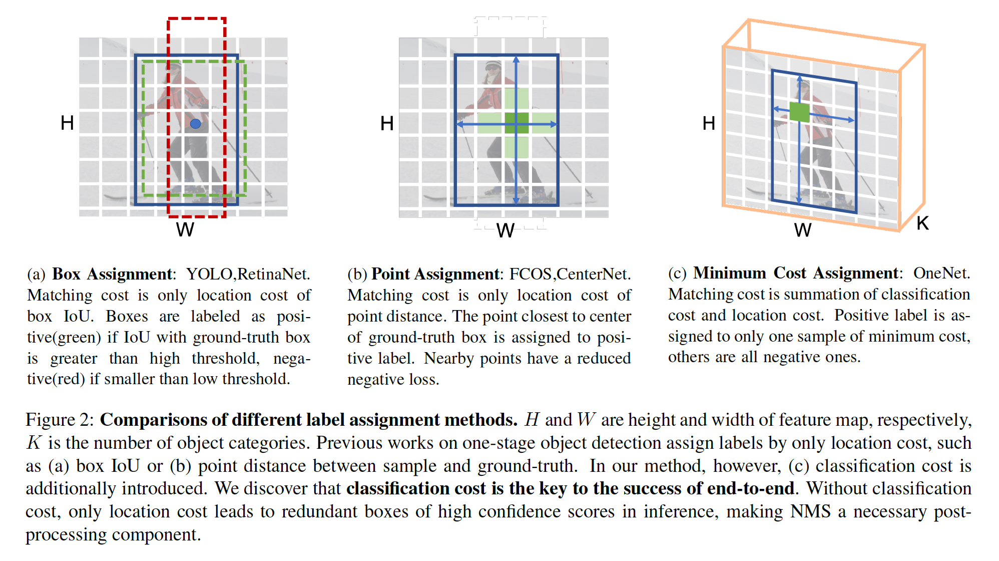

​		Box Assignment和Point Assignment遭受常见的多对一分配的困扰[1、39、40]。对于一个ground-truth边界框，存在超过一个正样本。检测行动对于分配过程的超参数很敏感。糟糕的事，产生冗余和几乎重复的结果，因此是的NMS成为必要的后处理。

​		最近，一对一分配在稀疏候选和多阶段精炼检测器[2、42、31]中获得巨大成功，其中一个ground-truth边界框仅分配一个正样本，其他样本全是负样本。然而，这将导致非常差的性能，如表1所示。推理期间，检测器仍输出一个目标的多个高置信度的冗余框，因此仍需要NMS。

​		在标签分配中，我们发现样本和ground-truth之间缺乏分类成本是一阶段检测器移除NMS以及达到端到端的主要障碍。通过回顾已有的一阶段目标检测器，我们确定他们仅根据位置成本[26、19、33、41]分配标签，例如框IoU（图2a）或点距（图2b），而完善的端到端检测器[2、42、31]通过位置成本和分类成本分配标签。我们的实验和视觉结果证明没有分类成本导致推理中的高置信度的冗余框，使NMS成为必要的后处理组件。

​		为了世界端到端的一阶段目标检测器，我们提出一种简单而有效的标签分配策略，成为Minimum Cost Assignment，其中成本是分类成本和定位成本之和。详细地说，对于ground-truth框，仅所有样本之中成本最小的一个样本被分配为正样本；所有其他样本被分配为负样本，如图2c所示。为了证明所提出的标签分配策略的有效性，我们设计一种检测器，称为OneNet，该检测器以其一阶段流水线（one-stage pipeline）和一个正样本（one positive sample）命名。我们的实验表明，当利用Minimum Cost Assignment训练时，OneNet避免产生重复框，并获得一个端到端检测器。OneNet展现出几项吸引人的优势：

- 整个网络时全卷机的，并且端到端地训练。管道中没有使用RoI操作或注意力交互。
- 标签分配是基于分类和定位的最小成本，而不是手工启发式规则或复杂的二分匹配。
- 推理中不涉及任何后处理，例如NMS或max-pooling，对工业界来说极其有效。

​    在COCO数据集上，使用ResNet-50，OneNet获得35.0AP/80FPS；使用ResNet-101，获得37.7AP/50FPS，输入图像的大小都为512像素。我们认为，更大的图像尺寸和更复杂的主干可以进一步提高检测精度，但是，推理速度因此被延迟，如表3和表5所示。我们的方法只在作为端到端的一阶段目标检测器的有效基线。因此，报告的性能是准确率和速度之间的平衡。

​		按位置成本分配标签在概念上很直观，并且到目前为止目标检测中也很普及。然而，我们发现，这种广泛使用的方法是端到端检测器的葬爱。我们解释，主要原因是 _misalignment between label assignment and network optimization objective_。目标检测是分类和定位的多任务问题。通过定位成本选择的样本可以对定位任务作出最大的贡献，但是不能保证最优的分类。最优的解决方法是一个目标有一个预测。但是，如果仅使用定位成本训练，分类分支会被迫输出相似的解，即一个目标有多个预测。我们希望我们的工作能够激发人们重新思考目标检测中的标签分配，并探索下一代目标检测器。

### 2. 相关工作

**目标检测**	目标检测是计算机视觉领域中最基本和挑战性的主题之一。受传统的特征提取技术[4、36]的限制，性能已经稳定了几十年，并且应用场景受到限制。随着深度学习的迅速发展[16、30、32、13、14]，目标检测获得强力性能[8、20]。现代目标检测主要包含一阶段和两阶段检测器。

**One-Stage detector**	一阶段检测器可以单发的方式直接预测不同空间位置和尺度上的密集锚框或点的类别和位置，例如YOLO [26]、SSD [21]和RetinaNet [19]。YOLO[26]将图像划分为$S \times S$的网格，并且如果目标中心落于网格单元，相应的单元负责检测此目标。SSD[21]在ConvNet内的多尺度特征图层上散布锚框，以直接预测目标类别和锚框偏移。基于FPN[18]，RetinaNet[19]利用focal loss来缓解正负样本之间的极端不平衡。最近，通过利用参考点替换手工设计的锚框而提出无锚算法[15、17、33、41、6、40]来使这种流水线更简单。上述的所有方法都构建密集点之上，并且直接分类和回归每个点。在训练时，基于预定义的规则，这些点被分配给目标框，例如锚框与其对应的ground-truth目标框是否有更高的IoU，或者参考点是否落于目标框之一中。CornerNet[17]通过热图生成大量关键点，并通过Associative Embedding[24]组合它们，CornerNet有令人影响深刻的性能，但是产生太多的假阳性。CenterNet[41]在单尺度上直接使用中心点来回归目标对象。FCOS[33]将不同大小和尺度的目标分配到多尺度特征图，利用FPN的能力，没有花里胡哨的操作，FCOS可以获得最佳性能。ATSS[40]认为基于锚和无锚检测之间的关键差异是如何定义正负样本，导致它们之间产生性能差异。尽管获得显著的性能，对于一阶段密集检测器，推理期间，需要NMS后处理来删除冗余预测。

**Two-Stage detector**	两阶段检测器是另一种出色的流水线，多年来在现代检测器中占据主导地位。这种范式可以视为一阶段检测器的一种扩展。它首先通过区域提议网络从密集的区域锚生成高质量的前景提议集，然后优化每个提议的位置并预测其特定类别。在这些两阶段方法中，区域提议算法起着关键角色。Fast R-CNN[10]使用Selective Search[34]来生成前景提议，并在R-CNN Head中精炼提议。Faster R-CNN[28]提出区域提议网络，其通过基于CNN的网络生成高质量的提议。级联RPN [37]通过系统解决传统RPN的局限性来提高区域提议质量和检测性能，传统RPN的启发式定义锚点并将特征与锚点对齐。最近的CPNDet[7]提出一种新的角提议网络，而不是区域提议网络。CPNDet使用[17]来生成更好的提议，并且它可以被视为一种两阶段的无锚目标检测流水线。在精炼阶段，针对前景和背景的预定义采样方法至关重要。Cascade R-CNN[1]迭代地使用具有不同标签分类阈值的多个R-CNN来获得高质量检测框。Libra R-CNN[25]尝试解决样本级、特征级和目标级的不平衡问题。Grid R-CNN[23]为了准确的目标检测而采用网格引导的定位机制，而不是传统的边界框回归。两阶段方法在目标检测中表现出极好的检测准确率。但是，引入太多的超参数和模块来设计区域提议阶段和目标识别阶段，因此，在工业上，不能轻松使用两阶段检测。

**End-to-End object detection**	完善的端到端目标检测器基于稀疏候选目标和多阶段优化。DETR[2]直接输出预测，而不是任何手工设计侧标签分配和后处理，获得非常好的性能。DETR可以视为第一种端到端的目标检测方法；DETR利用目标查询的系数集来与全局图像特征进行交互。受益于全局注意力机制[35]和预测与ground-truth目标之间的二分匹配，DETR可以丢弃NMS过程，同时获得显著的性能。引入了Deformable-DETR [42]，以将每个目标查询限制为参考点周围的一小部分关键采样点，而不是特征图中的所有点。Sparse R-CNN[31]从学习到的目标提议的一组固定稀疏集开始，并在目标识别头部中进行迭代地分类和定位。

### 3. Label Assignment

​		设计Minimum Cost Assignment来处理端到端的一阶段目标检测的标签分配。我们从以前的一阶段检测器的标签分配方法开始介绍，例如Box Assignment和Point Assignment。

#### 3.1. Matching Cost

​		先前的方法通过样本和ground-truth之间的边界框IoU或点距离来分配样本。我们将它们概括为按位置成本分配标签。位置成本定义如下：

$$\mathcal{C}_{loc} = \lambda_{iou} \cdot \mathcal{C}_{iou} + \lambda_{L1} \cdot \mathcal{C}_{L1} \tag{1}$$

其中$\mathcal{C}_{L1}$和$\mathcal{C}_{iou}$分别为样本和ground-truth框（中心）之间的$L1$损失和$IoU$损失。$\lambda_{L1}$和$\lambda_{iou}$为系数。在Box Assignment中，$\lambda_{L1}=0$。在Point Assignment中，$\lambda_{iou}=0$。

​		迄今为止，按位置成本分配标签概念上直观，并提供优秀的检测性能。然而，目标检测是定位和分类的多任务。仅位置成本引起次优的分类性能。具体而言，它产生高置信度的冗余框，使NM成为必需的后处理。更多细节见第5节。

​		为了达到端到端的一阶段目标检测，我们将分类成本引入匹配成本。该成本为样本和ground-truth之间的分类成本和位置成本之和，定义如下：

$$\mathcal{C} = \lambda_{cls} \cdot \mathcal{C}_{cls} + \mathcal{C}_{loc} \tag{2}$$

其中$\mathcal{C}_{cls}$为预测分类和ground-truth类标签之间的分类损失。在式（1）中定义了$\mathcal{C}_{loc}$。$\lambda_{cls}$为系数。在Box Assignment和Point Assignment中，$\lambda_{cls}=0$。

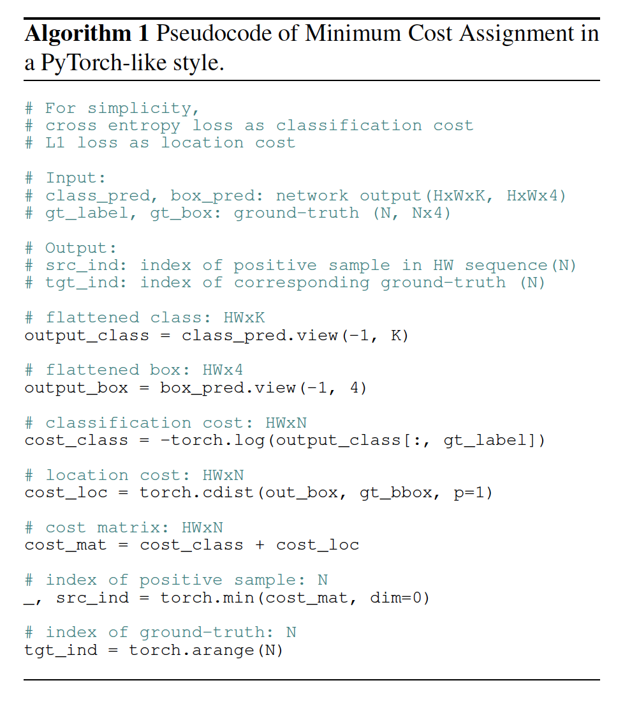

#### 3.2. Minimum Cost Assignment

​		Minimum Cost Assignment是一种直接的方法：对于每个ground-truth，仅选择所有样本中成本最小的一个样本作为正样本；其他样本都为负样本。不涉及手工设计的启发式规则或复杂的二分匹配。算法1给出Minimum Cost Assignment说明性示例：交叉熵损失作为分类成本，L1损失作为位置成本。

​		在密集检测器中，分类损失为Focal Loss[19]。遵循[2、42、31]，位置成本包含L1损失和GIoU损失。最后，成本定义如下：

$$\mathcal{C} = \lambda_{cls} \cdot \mathcal{C}_{cls} + \lambda_{L1} \cdot \mathcal{C}_{L1} + \lambda_{giou}\cdot \mathcal{C}_{giou} \tag{3}$$

其中$\mathcal{C}_{cls}$为预测类和ground-truth类标签之间的focal loss，$\mathcal{C}_{L1}$和$\mathcal{C}_{giou}$分别为预测框和ground-truth框的归一化中心坐标和高宽之间的L1损失和GIoU损失。$\lambda_{cls}$、$\lambda_{L1}$和$\lambda_{giou}$为每个组件的系数。

​		我们注意到[41]中，一个ground-truth也仅选择一个正样本，但是相邻的样本由高斯核标记：除了选择的正样本，其他样本都是负样本。

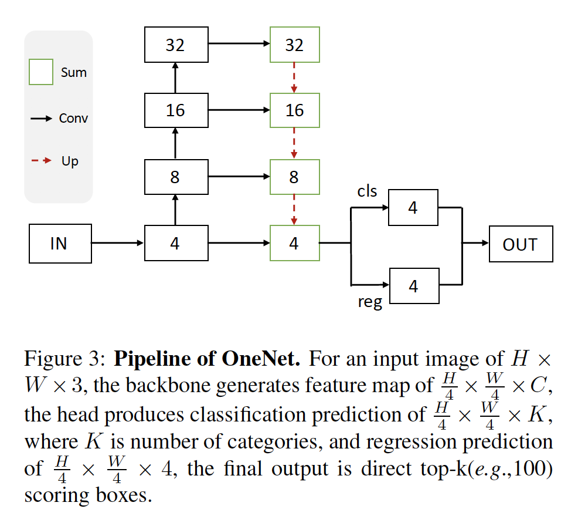

### 4. OneNet

​		OneNet是一种基本的全卷积一阶段检测器，而没有任何后处理，例如NMS。流水线如图3所示。

​		**Backbone**	骨干先是至下而上，然后是至上而上的结果。至下而上的组件是ResNet架构，其产生多尺度的特征图。开放具有侧连接的至上而下的架构（FPN）来生成目标识别的最终特征图。输出特征的形状为$H/4 \times W/4 \times C$，其中$H$和$W$为输入图像的高和宽。

​		**Head**	Head通过两个并行的卷积层在$H/4\times W/4$的特征图的每个网格点上进行分类和定位。分类层在每个网格点上预测$K$个目标类存在的概率。定位层预测每个网格点到ground-truth框4条边的偏移。

​		**Training**	标签分配为Minimum Cost Assignment。训练损失与匹配成本相似，包含Focal Loss、L1 Loss和GIoU Loss。

​		**Inference**	最终输出为top-k（例如100）得分框。没有任何后处理，例如NMS或max-pooling[26、19、33、41]。

#### 4.1. Multi-head Training

​		我们提出一种可选的Multi-head Training策略。它主要包含级联的预测头和权重共享机制。

**Cascading heads**	对于第一阶段，在通道维度上广播输入特征（表示为$F_0$）（$H/4 \times W/4 \times C \rarr H/4 \times W / 4 \times 2C$）。然后，它被馈入卷积层以输出形状为$H/4 \times W/4 \times C$的特征$F_1$。基于$F_1$，产生分类预测和回归预测。对于后面的阶段$j$，在通道维度，拼接形状为$H/4 \times W/4 \times C$的原始特征$F_0$和形状为$H/4 \times W/4 \times C$的前一阶段的特征$F_{j-1}$以产生形状为$H/4 \times W/4 \times 2C$的组合特征。然后，生成形状为$H/4 \times W/4 \times C$的特征图$F_j$以进行分类和回归。

**Weight-sharing**	每个头中的分类卷积和回归卷积分别共享相同的权重。

​		简单的应用Multi-head Training没有带来检测准确率上的改进，而且推理速度也被延迟。我们引入两种修改以确保最终从Multi-head Training中受益：Large learning rate和Single-head Inference。

**Large learning rate**	大学习率有可能带来准确率的提升。然而，直接增加单个预测头的学习率不能稳定训练，并会降低检测准确率。当装配级联头和权重共享时，可以增加训练学习率，并产生改进的学习率。

**Single-head Inference**	推理期间，仅使用第一个阶段来输出最终结果，而其他阶段被丢弃。与多头推理相比，仅产生略为的准确率下降。因此，推理中没有引入额外的计算成本，并提高准确率。Multi-head Training一种可选的训练策略。我们的实验表明，在COCO数据集上，三个阶段能提高大约1AP，如表2所示。

### 5. 实验

**Dataset**	我们在挑战性的MS COCO基准测试上进行实验。使用标准的度量进行目标检测。在COCO train2017（～118K图像）上训练，在val2017（5k图像）上评估。

**实现细节**	优化器为权重衰减为0.0001的AdamW[22]。在8张Nvidia V100 GPU上的批大小为64张图像。单头训练的初始学习率设置为$5 \times 10^{-5}$，多头训练的初始学习率设置为$1\times10^{-4}$。默认训练安排为270k次迭代，学习率在210k和250k迭代时，分别除以10。默认骨干为ResNet-50[13]。利用ImageNet上预训练的权重初始化骨干。遵循[2、42、31]，$\lambda_{cls} = 2$、$\lambda_{L1}=5$、$\lambda_{giou}=2$。数据增强包括随机水平翻转、调整输入图像使得图像的最短边至少为416像素，最长边最多为512像素。推理中默认的图像大小为512像素的最短边，和853像素的最长边。在推理中，选择前100个得分的边界框最为最终输出。

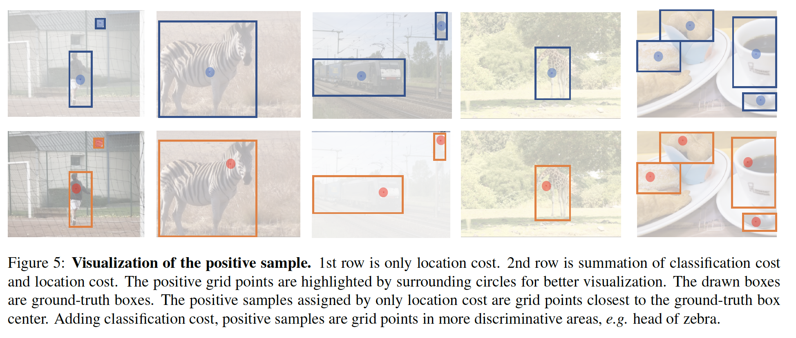

#### 5.1. 正样本的可视化

​		我们可视化CenterNet[41]和OneNet的正样本，如图5所示。这两种方法的主要差异是，CenterNet遵循位置成本的标签分配，而OneNet遵循具有分类成本和位置成本的最小成本分配。

​		对于CenterNet，正样本位于最接近目标ground-truth框中心的网格点。这种分配对于边界框回归有益，但是不是正负分类的实践选择。在第一幅图中，人的扭曲姿势使正样本成为人体边缘的点。它不是进行目标识别的最具辨别性的区域。

​		从OneNet，我们可以看出正样本位于目标的最具辨别性的区域内，例如人体内、斑马的头部。同时，它没有损害框回归，因为正样本位于目标边界框内。我们认为最小成本匹配的正样本同时考虑位置成本和分类成本，所以最终选择是整体上更好的选择。

#### 5.2. 消融研究

**Label assignment**	我们进行了一系列实验来研究标签分配的效果，如表1所示。预测框的位置成本和分类损失在第3节中定义。预定义的位置成本为特征图中网格点的固定位置与ground-truth边界中心位置之间的距离。没有分类损失，预定义的位置成本为CenterNet中使用的标签分配方法。从表1可知，分类成本是一次NMS的关键。没有分类成本，NMS显着提高了性能。而添加分类成本消除了NMS的必要。

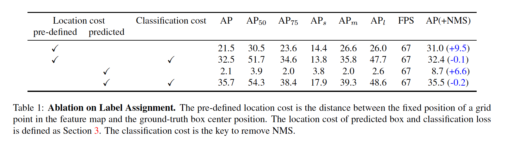

​		我们还在图6中可视化表1中的模型的预测结果。我们发现，不同模型的综合置信度得分变化很大，所以在不同模型中要调整可视化得分阈值。根据图6，通过没有分类成本的模型产生高置信度得分的冗余框，其使NMS后处理成为必要部分。相反，添加分类成本减少重复框，并导致端到端检测器的成功。

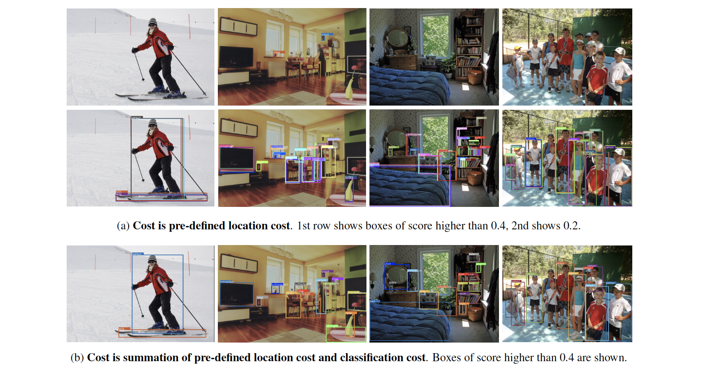

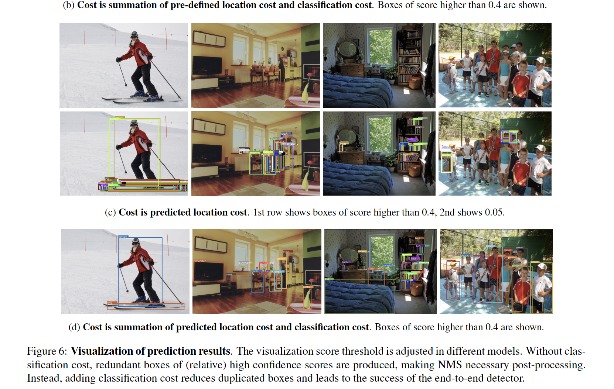

**Multiple-head Training**	简单地增加OneNet的学习率会衰减检测准确率，图表2的前部分所示。多头训练策略旨在保证模型受益于更大的学习率，如表2的下部分。多头增加最终的检测准确率，但是也放慢推理速度。令人吃惊的是，多头训练和单头推理获得更好的准确率和与基线相似的推理速度。因此，推理阶段没有引入额外的计算成本，并且有效提高检测准确率。

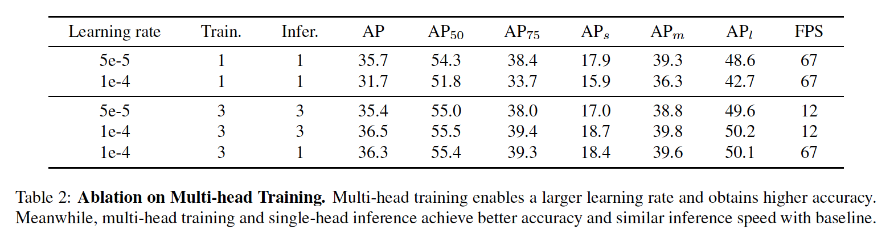

**Image size**	见表3。

**Training schedule**	见表4。

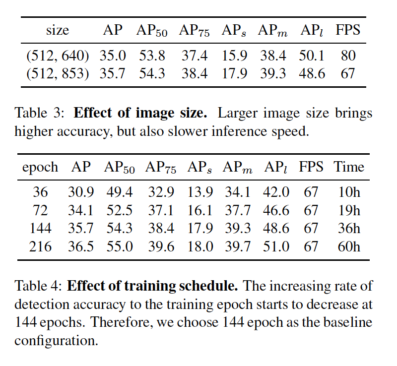

#### 5.3. 与CenterNet的比较

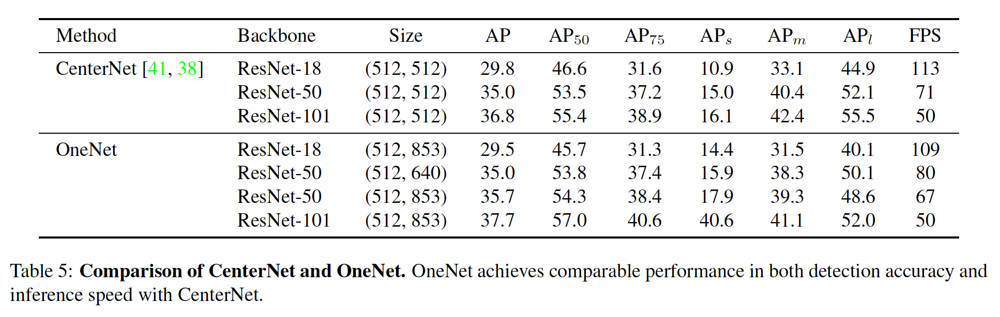

#### 5.4. 稀疏检测器中标签分配

​		由于分类成本是端到端密集检测器成功的关键，所以我们进一步进行实验来研究系数检测器中的分类成本的影响，稀疏检测器包含Deformable DETR和Sparse R-CNN。实现细节遵循原始论文，并且将分配成本的系数设置为0。

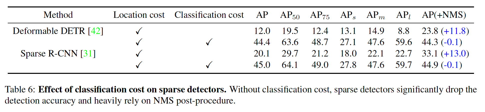

​		根据表6，分类成本也在移除系数检测器中起着关键作用。而添加分类成本消除了NMS的必要。

​		稀疏检测器的实验结果与密集检测相似。因此，我们确定分类成本是稀疏和密集检测器端到端目标检测的核心。