## Probabilistic Anchor Assignment with IoU Prediction for Object Detection

### 摘要

​		在目标检测中，确定将哪个锚分配为正类或负类样本（称为anchor assignment）已被公认为是可以显着影响模型性能的核心过程。本文中，我们提出新颖的锚分配策略，该策略根据模型的学习状态将锚点自适应地分（separate）为ground-truth边界框的正样本和负样本，使得它能够以概率形式推理出separation。为此，我们首先计算以模型为条件的锚的分数，并为这些分数拟合概率分布。然后，根据锚的概率将模型分为正样本和负样本，对模型进行训练。此外，我们研究训练和测试目标之间的差距，并提出预测检测边界框的IoU作为定位质量的衡量，从而减小差异。分类和定位质量的组合得分作为NMS中的边界框选择度量，与所提出的锚分配策略很好对齐，并产生明显的性能改进。所提出的方法仅添加一个卷积层到RetinaNet基线，并不需要每个位置的多个锚，因此是高效的。实验结果验证所提出方法的有效性。特别是，我们的模型在具有各种主干的MS COCO test-dev数据集上创下单级检测器新记录。 可以在https://github.com/kkhoot/PAA上找到代码。

### 1	引言

​		目标检测（其中给定图像中的目标被分类和定位）被视为计算机视觉中的基础问题之一。因为R-CNN的开创性工作，目标检测的最新进展展现出快速进步，其中包括许多创新的架构设计[21、28、41、43]、训练目标[3、7、22、29]后处理方案[2、13、15]以及强壮的CNN骨干[5、11、17、19、31、32、36]。对于大多数基于CNN的检测器，表示不同大小和形状的目标的主流范式在每个空间位置枚举多个尺度和纵横比的锚框。在这种范式中，需要执行将锚分配为正类和负类样本的锚分配过程。最常用的确定正样本的策略是使用anchor和ground-truth（GT）边界框之间的IoU。对于每个GT边界框，如果它与GT边界框的IoU超过某个特定阈值，那么将一个或更多这样的anchor分配为正样本。这些anchor的分类和定位（即回归偏移）的目标值有GT边界框的目标类别和空间坐标确定。

​		尽管这种启发式方法的简单性和直观性使其称为流行选项，但是它有明显的局限——忽略相交区域的实际_内容_，这可能包含噪声背景，相邻目标或少量有意义的目标部分被检测。几项最近的研究[16、20、34、40、42]识别这种局限，并提出不同的新的锚分配策略。这些工作包括根据检测的特定似然[42]、锚点IoU的统计数据[40]或锚点的清洁度（cleanness）得分[16、20]选择正类样本。所有这些方法表现出相对基线的改进，并验证了锚分配在目标检测中的重要性。

​		本文中，我们想进一步扩展其中的一些想法，并提出一种新颖的锚分配策略。为了使锚分配策略有效，不仅在锚和GT边界框之间的IoU上，而且还在模型可以对分配进行推理是何种可能性上将一定数量的锚分配为正类（或负类）。在这方面，模型需要参与分配过程，正样本需要根据模型而变化。对一个GT边界框，当不存在高IoU的锚，锚中的一些需要分配为正样本以减小不当锚设计的影响。在这种情况下，可以将模型找到有关目标对象的最有意义线索的锚（不一定是最高IoU的锚点）分配为正类。另一方面，当模型发现许多具有同等的质量和竞争力的锚时，则所有这些锚都应被视为正类，以免混淆训练过程。最重要的是，为了满足所有这些条件，需要评估锚的质量（作为正样本），以反映模型的当前学习状态，即其参数值。

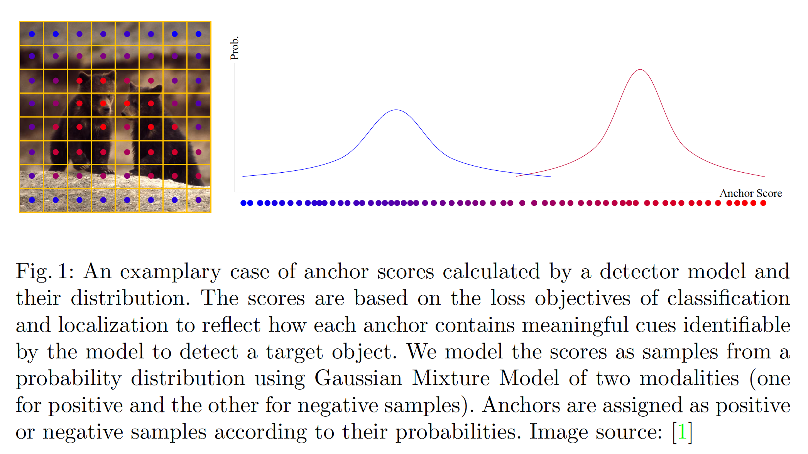

​		利用这种动机，我们提出probabilistic anchor assignment（PAA）策略，该策略根据与其关联的模型的学习状态将一组锚自适应地分为GT框的正样本和负样本。为此，我们首先定义检测到边界框的得分，其同时反应分类和定位质量。然后，我们这个得分与训练目标之间的连接，并将得分表示为两个损失目标的组合。利用这些锚得分，我们旨在找到两种模态的概率分布，以最佳方式将得分表示为正样本或负样本，如图1所示。在找到的概率分布下，具有来自正分量（positive component）的概率的锚较高，被选为正样本。这将锚分配问题转换为概率分布的极大似然估计，其中分布的参数由锚得分决定。**基于该模型计算的锚得分是从概率分布中抽取的样本这一假设，可以预期该模型可以以概率方式推断出样本分离，与其他非概率分配相比，可以更轻松地训练模型。此外，因为正样本基于锚得分自适应地选择，所以它不需要预定一正样本数或IoU阈值。**

​		最重要的是，我们发现在大多数现代目标检测器中，测试方案（仅在NMS期间根据分类得分选择框）和训练方案（使分类和定位损失最小化）之间存在不一致。理想上，检测边界框的质量不仅要基于分类还要基于定位测量。为了改进不完整的得分方案以及同时减小训练和测试过程目标的差异，我们提出预测检测边界框的IoU作为定位质量，并将分类得分乘以IoU得分作为度量来对检测边界框排序。这种评分是直观的，并且不仅与训练过程中使用的目标有相同的基础，而且与提议的锚分配策略（考虑了分类和定位）具有相同的基础，如图2所示。与所提出的PAA结合，这种简单的扩展有利于检测性能。我们还比较IoU预测与centerness预测，并证明所提出的方法的优越性。

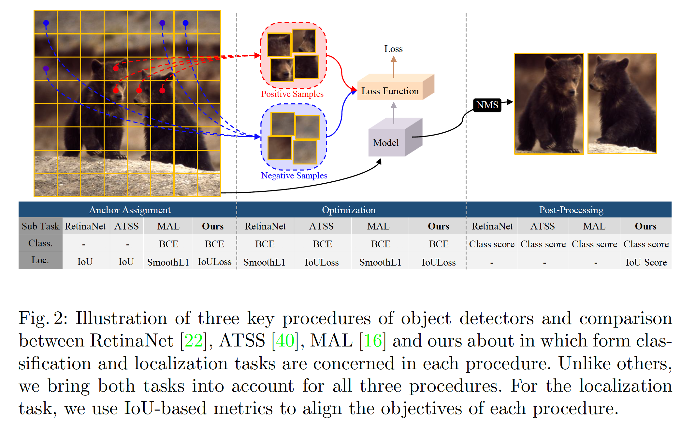

​		利用后处理中称为score voting的额外改进，我们的方法中的每一个都表现出如消融研究中的反应的明显改进。特别地，在COCO test-dev集上，我们的所有方法获得新的具有明显边界的最先进性能。我们的方法仅需要添加单个卷积层，并在每个位置使用一个锚，这与[40]相似，与RetinaNet[22]相比，导致更少的参数。所提出的锚分配可以使用GPU并行，并不需要测试时的额外计算。所有这种证据验证了我们所提出的方法的效率。本文的贡献总结如下：

1. 我们通过从检测器模型计算锚分数并为概率分布最大化这些得分的似然，将锚分配建模为概率过程。这允许模型以概率化的形式推断分配，并自适应地决定正样本。
2. 为了对齐锚分配、优化和后处理过程的目标，我们提出预测检测边界框的IoU，并使用统一的分类和定位得分作为NMS的排序指标。最重要的是，我们提出score voting方法作为额外的后处理，其使用统一得分来进一步提升性能。
3. 我们执行广泛的消融实验，并验证所提出方法的有效性。我们利用五个骨干在MS COCO数据集上的实验为所有测试配置取得新的AP记录。

### 2    相关工作

#### 2.1	Recent Advances in Object Detection

​		自Region-CNN[8]及其改进[7、28]起，锚、锚与ground-truth（GT）边界框之间的偏移回归以及目标类别分类的概念已被广泛采用。在许多案例中，将不同尺度和纵横比的锚分配给每个空间位置以覆盖不同的目标大小和形状。与一个GT框的IoU值大于预测的锚被视为正样本，一些系统使用两阶段检测器[7、8、21、28]，其在RPN中为类无关的提议使用锚机制。第二阶段的检测头部在每个提议的对齐特征上运行。一些系统使用单阶段检测器[22、24-26、41、43]，其没有RPN，并直接预测每个空间位置的目标类别以及回归偏移。最近，引入了不依赖锚的无锚模型来定义正样本和负样本以及回归偏移。这些方法预测不同的关键点，例如角[18]、极点[44]、中心点[6、33]或可变形卷积[5]推导的任意特征点[38]。[45]（FSAF）通过添加额外的无锚回归分支，将基于锚的检测器与无锚检测器结合。[40]（ATSS）发现，当基于锚和无锚方法使用相同的锚分配策略时，它们有相似的性能。

#### 2.2	Anchor Assignment in Object Detection

​		最近，选择将哪个锚（或者无锚方法的位置）指定为正类或负类样本已被识别为极大影响模型性能[37、40、42]的关键因素。在这方面，提出几种方法来克服基于IoU的硬锚分配的局限。MetaAnchor[37]动态预测锚函数（检测头部的最后一层）的参数，并将锚形状作为参数（argument），这提供改变训练和测试中的锚的能力。与其枚举空间位置预定义的锚，GuidedAnchoring[34]将锚在GT中心附近的位置定义为正类，并预测其形状。FreeAnchor[42]提出检测自定义的似然，其将同时考虑样本的召回率和精确率，并基于估计的似然决定正类锚。ATSS[40]提出自适应锚分配，其计算一组接近每个GT的锚的IoU的均值和标准差。他将IoU值大于均值和标准差之和的锚分配为正类。尽管这些工作展现出提高，但是它们要么需要额外的层以及计算结构[34、37]，要么强制仅一个锚具有完整的分类得分，这在多个锚具有高质量和竞争力的情况下是不希望的[42]，或者依靠预定义锚与GT之间的IoU，而既不考虑相交区域的实际内容，也不考虑模型的学习状态[40]。

​		与我们的工作相似，MultipleAnchorLearning（MAL）[16]和NoisyAnchor[20]基于分类和定位损失定义锚得分。但是，它们没有将锚选择过程建模为概率分布似然的最大化；它们选择固定数量的最大评分锚。如此机制妨碍模型根据学习状态和输入选择灵活数量的正样本。MAL使用线性调度，其随着训练过程减小正类的数量，并且需要启发式特征扰动来减轻它。NoisyAnchor会在整个训练过程中确定阳性样本的数量。同样，他们或者错过了NMS中锚评分方案和边界框选择目标之间的关系[16]，或者仅仅使用软标签间接地将它们联系起来[20]。

#### 2.3	Predicting Localization Quality in Object Detection

​		预测的IOU作为检测边界框的定位质量不是最新的。YOLO和YOLOv2[25、26预测“objectness score”，其为检测边界框与其对应GT边界框之间的IoU，并且在推理期间将其与分类得分相乘。但是，它们没有研究与仅使用分类得分的方法的比较，它们的最新版本[27]移除了这种预测。IoU-Net[15]也预测检测边界框的IoU，并提出使用预测IoU而不是分类作为关键词的“IoU-guided NMS”，并调整选择的边界框得分作为重叠边界框最大得分。尽管这种方法可以有效，但是它们没有将分类得分和IoU关联为一个统一的得分，也没有关联NMS过程和锚分类过程。与预测IoU相比，一些工作[4、12]添加额外的头部来预测定位质量的方差以正则化训练[12]或者惩罚测试中的分类得分[4]。

### 3	所提出的方法

#### 3.1	Probabilistic Anchor Assignment Algorithm

​		这里，我们的目标是设计锚分类策略，其考虑三个关键因素：首先，它应基于与其关联的模型找到证据来识别具有该锚的目标对象的可能性，从而测量给定锚的质量。其次，锚分离为正负样本应当是自适应的，使得不需要诸如IoU阈值的超参数。最后，应将分配策略表述为概率分布的似然最大化，以便模型能够以概率方式推理分配。在这方面，我们实际锚评分方案，并提出考虑评分方案的锚分配。

​		具体而言，让我们定义一个锚的得分，该得分反映了最接近的ground-truth（GT）$g$的边界框预测的质量。一种直观的方式是计算分类得分（与GT类兼容）和定位得分（与GT边界框兼容），并将它们相乘：

$$S(f_\theta(a,x),g)=S_{cls}(f_\theta(a,x),g) \times S_{loc}(f_\theta(a,x),g)^\lambda, \tag{1}$$

其中$S_{cls}$、$S_{loc}$和$\lambda$分别为给定$g$的锚锚$a$的分类和定位得分，以及控制两个得分相对权重的标量。注意，这个评分函数依赖模型参数。我们可以定义并从分类头部的输出获得$S_{cls}$。如何定义$S_{loc}$缺乏显然性，因为定位头部的输出编码偏移值，而不是得分。这里，我们使用预测边界框与其GT框的IoU作为$S_{loc}$，因为它的范围符合分类得分的范围，并且它的值自然对应定位质量：

$$S_{loc}(f_\theta(a,x), g) = IoU(f_\theta(a,x), g), \tag{2}$$

​		采用得分函数$S$的负对数，我们有：

$$\begin{align}-\log S(f_\theta(a,x), g) &= -\log S_{cls}(f_\theta(a,x),g) - \lambda S_{loc}(f_\theta(a,x),g) \\ &=\mathcal{L}_{cls}(f_\theta(a,x), g) + \lambda \mathcal{L}_{IoU}(f_\theta(a,x),g) \end{align} \tag{3}$$

其中$\mathcal{L}_{cls}$和$\mathcal{L}_{IoU}$分别表示二值交叉熵损失和IoU损失。可以利用更先进的目标（例如Focal Loss或GIoU损失）替换任意损失。这是合理的，在给定GT边界框的情况下，两个损失的负数之和可以充当锚的得分函数。

​		为了运行模型能够推理是否应当以概率化的形式将锚预测为正样本，我们将某个GT的锚定得分建模为从概率分布中抽取的样本，并通过该分布的参数最大化锚得分的似然。然后，根据每个锚为正类或负类的概率将锚分离为正负样本。因为我们的目标是将锚集分为两组（正类和负类），所以可以使用能够建模样本多模态的任何概率分布。这里，我们选择两个模态的Gaussian Mixture Model（GMM）来建模锚得分分布：

$$P(a|x,g,\theta) = w_1 \mathcal{N}_1(a;m_1,p_1) + w_2 \mathcal{N}_2(a;m_2,p_2), \tag{4}$$

其中$w_1$、$m_1$、$p_1$和$w_2$、$m_2$、$p_2$分别表示两个高斯的权重、均值和精确率。给定锚得分的集合，可以使用Expectations-Maximization（EM）算法优化这个GMM的似然。

​		利用由EM估计的GMM参数，可以确定每个锚的概率为正样本或负样本。利用这些概率值，可以使用不同技术来将锚分为两组。图3展示基于锚概率的分离边界的不同样本。程序1中介绍了使用这些边界方案之一提出的算法。为了计算锚得分，首先，锚被分配给最高IoU的GT（第3行）。为了使EM有效，我们从每个金字塔层选择前$K$个锚（第5-11行），并执行EM（第12行）。非前$K$个锚被分配为负样本（第16行）。

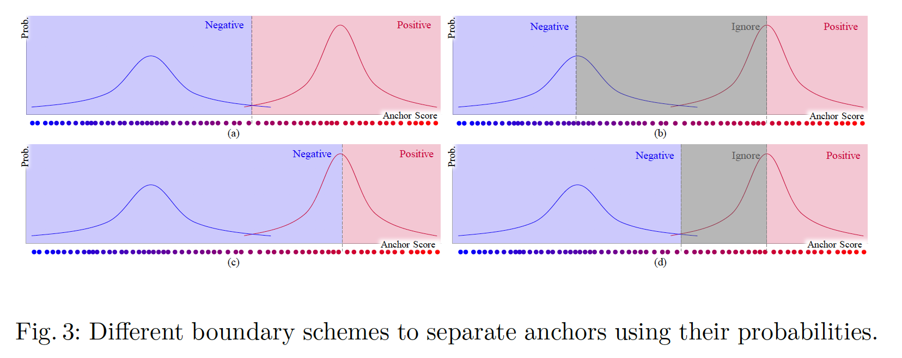

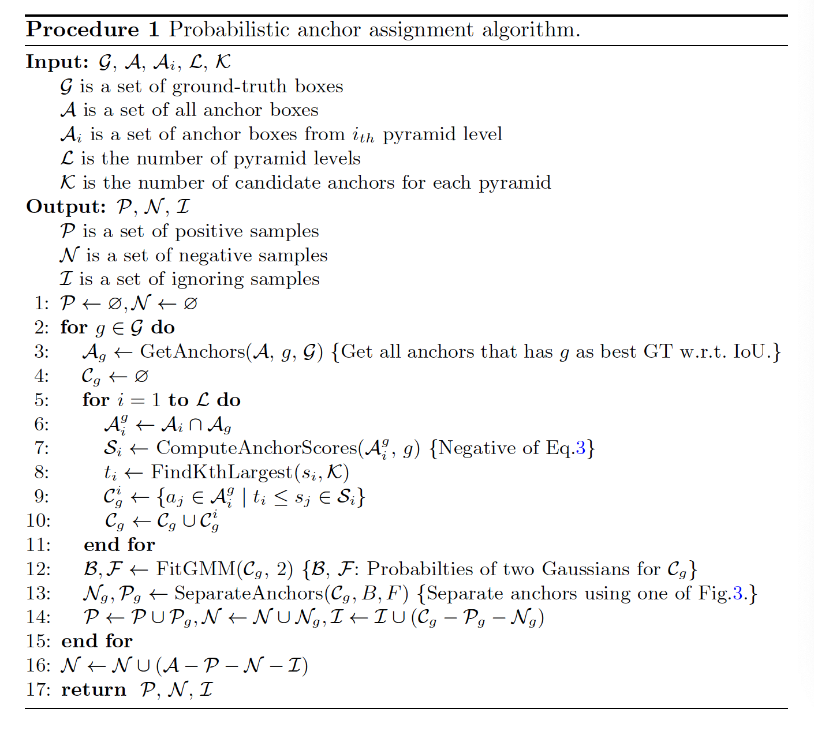

​		注意，正样本的数量依赖模型参数条件下估计的概率分布。这与忽略模型[40]或启发式地将样本数量确定为超参数[16，20]而没有将锚分配建模为概率分布的似然最大化的先前方法形成对比。FreeAnchor[42]定义检测自定义的似然，并将召回率和精确率的乘积建模为训练目标。但是，他们的方法与我们的方法截然不同，因为我们没有分别设计召回率和准确性的似然，也没有将具有完整分类得分的锚的数量限制为1。相反，我们的似然是基于模型参数的两个模态的简单一维GMM，这使得模型可以轻松识别锚分配策略。与其他需要复杂子例程的锚分配方法相比，这使得学习更容易（例如，均值-最大值函数以稳定训练[42]或锚沉入过程避免局部最小值[16]），从而导致如实验中展示的更好性能。

​		为了总结我们的方法并将其插入目标检测器的训练过程中，我们为输入图像$x$制定最终的训练目标（为简洁起见，我们省略$x$）：

$$\arg\max_{\theta}\prod_g\prod_{a\in\mathcal{A}_g}P_{pos}(a,\theta,g)S_{pos}(a,\theta,g) + P_{neg}(a,\theta, g)S_{neg}(a,\theta), \tag{5}$$

$$\begin{align}S_{pos}(a,\theta,g) &= S(f_{\theta}(a),g) \\ &=\exp(-\mathcal{L}_{cls}(f_\theta(a), g) - \lambda\mathcal{L}_{IoU}(f_\theta(a)), g)\end{align} \tag{6}$$

$$S_{neg}(a,\theta) = \exp(-\mathcal{L}_{cls}(f_\theta(a), \varnothing)), \tag{7}$$

其中$P_{pos}(a,\theta,g)$和$P_{neg}(a,\theta,g)$为锚为正类和负类的概率，并可以通过所提出的PAA获得。$\varnothing$表示背景类。我们的PAA算法可以视为计算$P_{pos}$和$P_{neg}$的过程，并将它们近似为二值（即将锚分为两组）以简化优化。在每次训练迭代中，在估计$P_{pos}$和$P_{neg}$之后，与$\theta$对应的损失目标的梯度可以计算，并进行随机梯度下降。

#### 3.2	IoU Prediction as Localization Quality

​		所提出的锚分配中的锚评分函数根据训练目标（即两个任务的组合损失）推导，因此锚分配过程与损失优化被很好地对齐。但是，对于仅对分类得分执行非极大抑制（NMS）的测试过程，情况并非如此。为了解决这个问题，可以将定位质量合并到NMS程序中，以便可以使用相同的评分函数（公式1）。但是，GT信息仅在训练期间有用，因此检测边界框与其相应的GT框之间的IoU不能在测试计算。

​		这里，我们提出简单的解决方案来解决这个问题：我们将我们的模型扩展到预测预测边界框与其对应GT边界框之间的IoU。这种扩展是直接的，因为它需要单个卷积层作为额外的预测头部，该头部输出为每个锚输出一个标量值。我们在输出上使用Sigmoid激活以获得有效的IoU值。然后，训练目标变为（为了简便，省略$x$）：

$$\mathcal{L}(f_\theta(a),g) = \mathcal{L}_{cls}(f_\theta(a), g) + \lambda_1\mathcal{L}_{IoU}(f_\theta(a),g) + \lambda_2\mathcal{L}_{IoUP}(f_\theta(a),g), \tag{8}$$

其中$\mathcal{L}_{IoUP}$为IoU预测损失，定义为预测IoU与真IoU之间的二值交叉熵。利用预测IoU，我们使用公式1计算检测边界框的统一得分，并使用它作为NMS过程的排序指标。如实验中所展示的，将IoU预测加入NMS明显提高性能，特别是当结合所提出的概率锚分配时。综合网络架构与FCOS[33]和ATSS[40]完全相同，架构为具有修改特征塔的RetinaNet以及一个辅助预测头部。注意，这种结构仅在每个位置使用单个锚，因此比使用9个锚的RetinaNet的参数和FLOPs少。

#### 3.3	Score Voting

​		作为本文的另一种改进方法，我们提出了一种简单而有效的后处理方案。所提出的score voting方法适用于NMS过程之后的剩余边界框中每个边界框$b$，如下所示：

$$p_i = e^{-(1-IoU(b,b_i))^2/\sigma_t}, \tag{9}$$

$$\hat{b} = \frac{\sum_i p_is_ib_i}{\sum_ip_is_i} \mbox{ subject to } IoU(b,b_i) > 0, \tag{10}$$

其中$\hat{b}$、$s_i$和$\sigma_t$分别为更新的边界框、公式1计算的得分和调整相邻边界框$b_i$的超参数。值得注意的是，这种投票算法受[12]中描述的“variance voting”的启发，$p_i$以相同的方式定义。但是，我们没有使用variance预测来计算每个相邻边界框的权重。相反，我们使用分类和定位的统一得分$s_i$与$p_i$作为权重。

​		我们发现，单独使用$p_i$作为边界框权重产生性能改进，将其乘以$s_i$进一步提升性能。与variance voting相比，没有方差预测的检测器仅通过对$p_i$加权即可使用得分投票。与我们的相似，具有IoU预测头部的检测器可以将其乘以$s_i$以得到更好的准确率。与仅使用分类得分不同，$s_i$可以充当可靠的权重，因为它不会为分类得分高且定位质量差的边界框分配大的权重。

### 4	实验

​		本节中，我们进行广泛实验来验证所提出方法在MS COCO基准测试[23]上的性能。我们遵循将“ trainval35k”用作所有实验的训练数据（约118k图像）的常规做法。对于消融研究，我们在5k张图像的“minival”上测量准确率，并在大约20k图像的“test-dev”上完成与先前方法的比较。所有精度数字都是使用官方COCO评估代码计算得出的。

#### 4.1	训练细节

​		我们使用COCO训练设置，在批次大小、冻结Batch Normalization，学习率等方面与[40]相同。确切的设置见补充材料。对于消融研究，我们使用ResNet50骨干，并运行135k训练迭代。对于与先前方法的比较，我们使用不同骨干运行180k迭代。与最近的工作[33、40]相比，我们在检测特征塔中使用GroupNorm[35]，Focal Loss[22]作为分类损失、GIoU损失[29]作为定位损失，并添加可训练的标量到回归头部。$\lambda_1$设置为1以计算锚得分，当计算公式3时，使用1.3。$\lambda_2$设为0.5以平衡每个损失项的尺度。如果使用score voting，$\sigma_t$设置为0.0025。注意，我们没有使用“centerness”预测或“center sampling”[33、40]。尽管我们的方法对$\mathcal{K}$值不敏感，这与[40]相似，我们将$\mathcal{K}$设置为9。对于GMM优化，我们将候选锚的最小和最大得分设置为两个Gaussian的均值，并将精确率值设置为1，作为EM的初始值。

#### 4.2	消融研究

**不同锚分离点的比较**	这里，我们比较图3中描述的锚分离边界。表1中的左表展示选择任意分离方案都能起作用。这表明所提出的锚分配方法的稳定性，因为它对小型边界变化不敏感。我们比较将我们的方法与两种更简单的方法（即fixed numbers of positives (FNP) 和 fixed positive score ranges (FSR)）进行比较，FNP将预定义数量的得分最高的样本定义为正类，而FSR将分数超过特定阈值的所有锚定为正类。如表1右的结果所示，两种方法的性能都比PAA低。FSR（>0.3）失败，因为模型无法在早期迭代中找到分数在范围内的锚。这显示了PAA的优势，它可以自适应地确定分离边界，而无需超参数，而这些参数需要仔细的手动调整，因此很难对每个数据进行自适应。

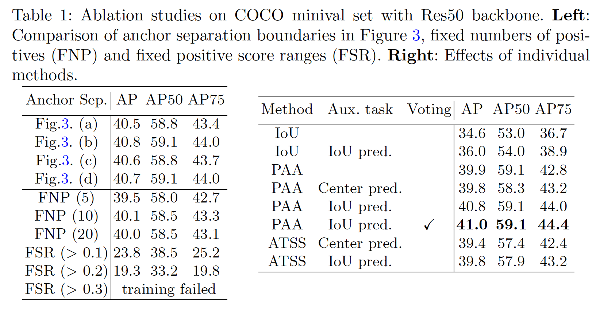

**单个模块的影响**	本节中，我们验证所提出方法中单个模块的有效性。不组合的准确值见表1。将锚分配从基于IoU的硬分配变为所提出的PAA将AP得分提高5.3%。添加IoU预测头部以及在NMS中应用统一得分函数将性能提升到40.8%。为了进一步验证IoU预测影响，我们将它与[33、40]中使用的centerness预测进行比较。正如结果中所看到的，centerness没有给PAA带来改进。这是可以预期的，因为根据检测框的centerness，检测框的加权分数可能会妨害偏心或倾斜物体的检测。这表明基于centerness的评分不能很好泛化，并且所提出的基于IoU的评分可能克服这种限制。我们还验证了IoU预测比ATSS的centerness预测更有效[40]（39.8％ vs 39.4％）。最后，使用score voting将性能提升到41.0%，大幅领先表2左中具有Res50骨干的方法。

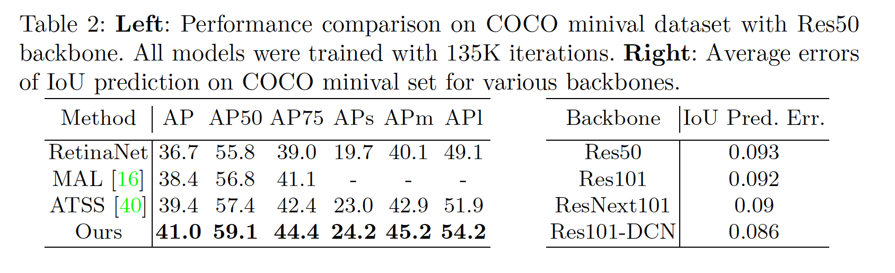

**Accuracy of IoU prediction**	我们在表2中计算了各种骨干的IoU预测的平均误差。所有主干都显示出小于0.1的错误，这表明IoU预测与附加的卷积头是合理的。

**锚分配的可视化**	在图4a中，我们可视化由PAA分离的正负样本。随着训练的进行，正样本和负样本之间的区别变得更加清晰。注意，在目标边界框上，正锚不一定要比负锚具有更大的IoU值。同时，许多负锚在迭代30k和50k迭代时仍有较高的IoU值。具有固定数量的正样本[16、20]的方法可以将这些锚指定为正类，并且模型可以在推断过程中以较高的分数预测这些锚点。最后，随着训练的进行，许多正锚有更准确的定位。与我们的方法相比，如FreeAnchor[42]的方法惩罚所有这些锚，但最好的锚点除外，后者会混淆训练。

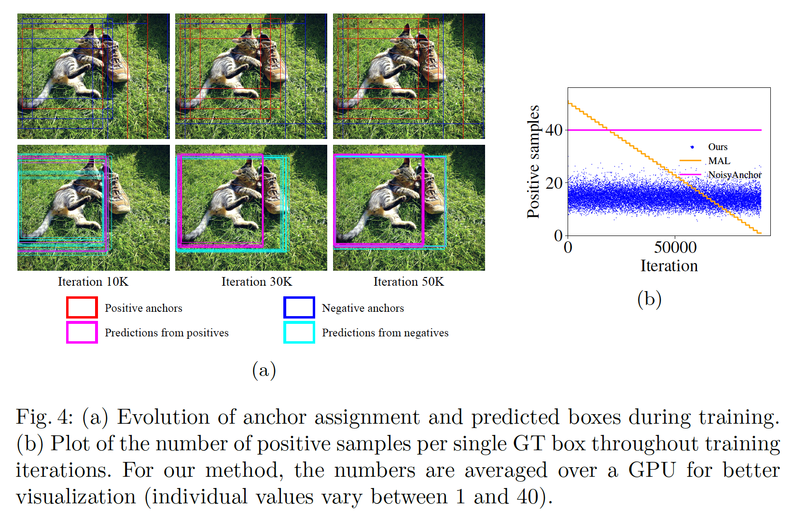

**正样本的统计量**	为了比较我们的方法和最近的工作，这些工作也通过对锚评分来选择正样本，我们根据图4b中的训练迭代绘制了正样本的数量。与固定样本数量[20]或使用线性衰减[16]的方法不同，我们的每次迭代选择不同数量的样本，这表明了该方法的适应性。

#### 4.3	与最先进方法的比较

​		为了用以前的最新方法验证我们的方法，我们用五种骨干进行了实验，如表3所示。我们首先比较使用Res101训练的模型和使用相同主干训练的先前模型。我们的Res101模型获得44.8%的准确率，比先前43.6%的最佳模型好。我们具有ResNeXt101的模型提高到46.6%(单尺度测试)和49.4%（多尺度测试），其也打败了45.9%和47.0%的最佳模型。然后，我们通过将可变形卷积用于骨干以及特征塔的最后一层（与[40]相同）来扩展我们的方法。这些模型还比ATSS的副本好，表现出1.1%和1.3%的改进。最后，具有可变形ResNeXt152骨干，我们的方法设置新的单尺度（50.8%）和多尺度测试（53.5%）记录。

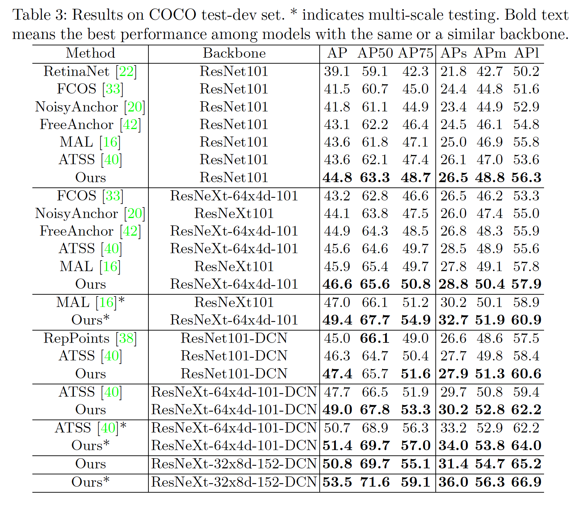

### A	附录

#### A.1	训练细节

​		训练期间，我们使用8张GPU，每张GPU保持两张图像。BN层的参数被冻结。所有骨干利用ImageNet数据集预训练。我们将出事学习率设置为0.01，对于135k设置，在90K和120K迭代时衰减10倍，对于180k设置，在120k和160k迭代时衰减10倍。对于180k设置，采用多尺度训练策略（将输入图像的短边调整到640到800中随机选择的尺度）。动量和权重衰减分别设置为0.9和$1e-4$。遵循[9]，我们在前500迭代中使用学习率热启动。值得注意的是，将单个定位损失乘以辅助任务的得分（在我们的案例中，这是使用相应的GT框的预测IoU，以及使用[33、40]中的centerness预测时的中心度分数），这也用于以前的工作中[33、40]，可以帮助更快地训练并获得更好的性能。

#### A.2	网络架构

​		这里，我们提供图5来展示我们的网络架构。它是RetinaNet架构，每个空间位置只有一个锚，这与FCOS [33]和ATSS [40]中使用的模型完全相同。唯一的区别是，我们模型中的其他头部可以预测预测框的IoU，而FCOS和ATTS模型可以预测centerness得分。

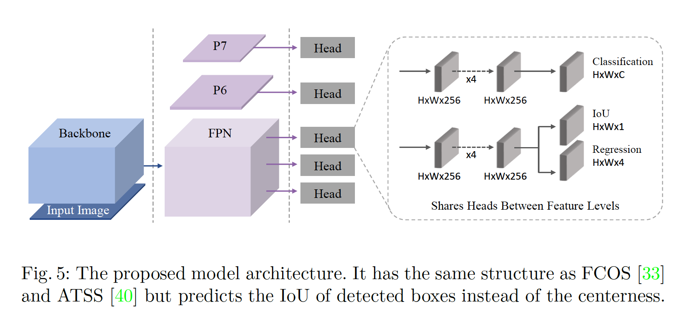

#### A.3	更多消融研究

​		我们进行了有关topk $\mathcal{K}$和默认锚尺度影响的其他消融研究。主论文中的所有实验都是在$\mathcal{K} = 9$且默认锚尺度为8的情况下进行的。每个金字塔层的锚大小由其步长与默认锚尺度的乘积决定。表4展示不同默认尺度上的结果。它证明所提出的概率化锚分配对$\mathcal{K}$和锚大小都有鲁棒性。

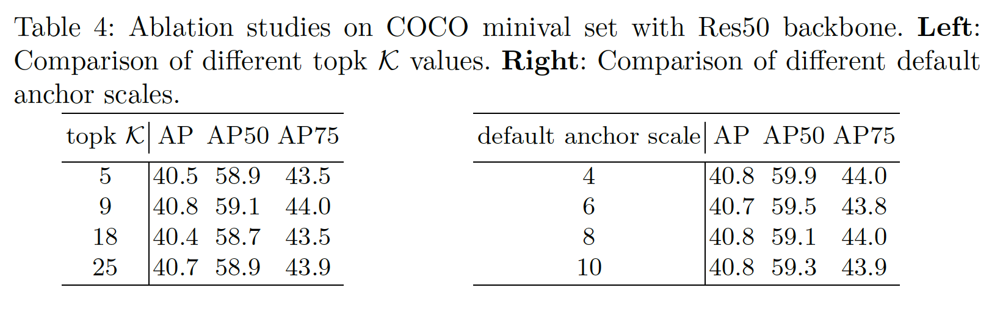

#### A.4	锚分配的更多可视化

​		训练期间，我们可视化所提出的锚分配。图6展示COCO训练集上的锚分配结果。图7展示非COCO图像上的锚分配结果。

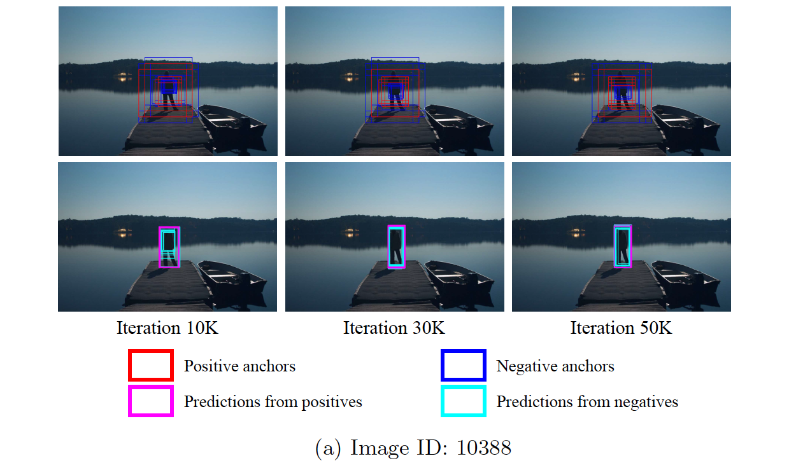

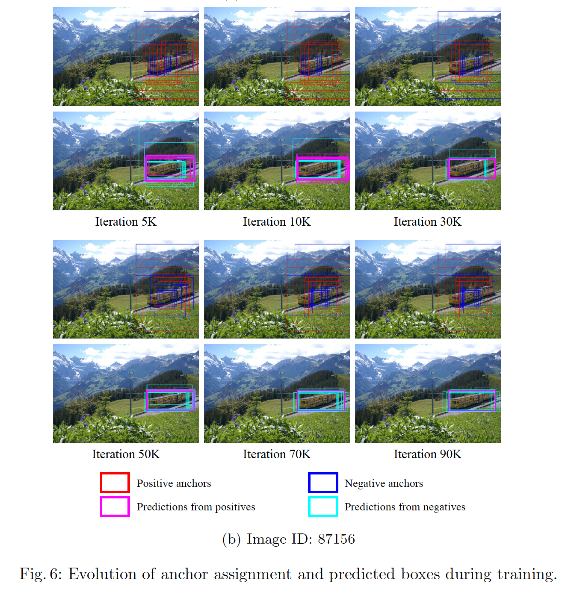

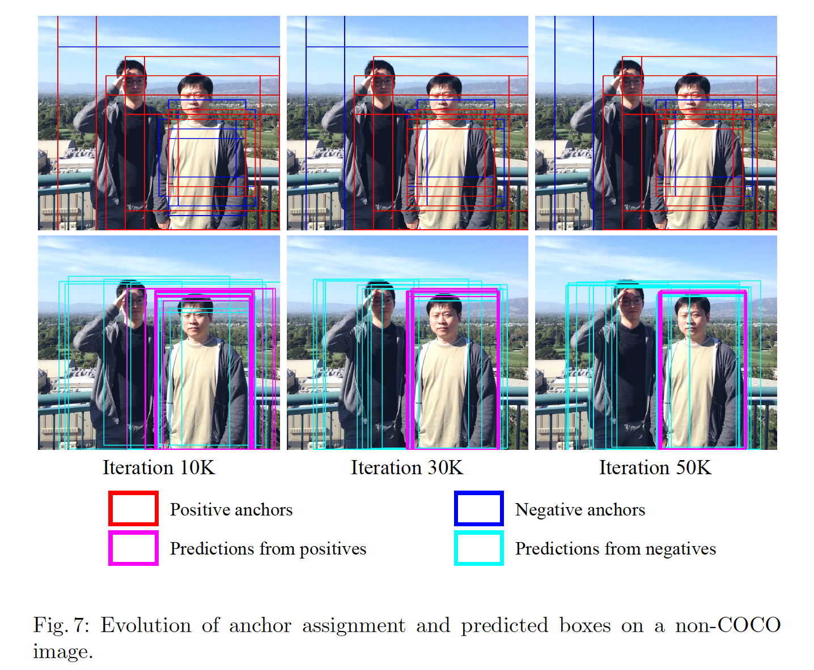

#### A.5	检测结果的可视化

​		在COCO minival集上的可视化检测结果见图8。

