### Prime Sample Attetion in Object Detection

#### Abstract
在目标检测框架中，平等地对待所有样本和将最大化平均性能作为目标是一个常用的惯例。本文中，作者通过仔细研究不同样本对以mAP衡量的综合性能的贡献来回顾这种惯例。研究结果认为每个mini-batch中的样本既不相互独立也不同等重要，因此平均上一个更好的分类器并不意味着更高的mAP。受此启发，作者提出Prime Sample的概念，它对于驱动检测性能起着关键作用。作者进一步开发了一种简单而高效的采样和学习策略，称为 _PrIme Sample Attetion(PISA)_ ，其将训练的重点指向这些样本。实验结果表明，训练检测器时，更关注主要样本比困难样本更有效。特别地，在MS-COCO数据集上，PISA优于随机采样基线和难挖掘方法（例如OHEM和FocalLoss），即使使用强壮的骨干ResNeXt-101，一阶段和两阶段方法都取得大约2%的增加。

# 1 Introduction
一阶段和两阶段检测器都是基于区域的方法，检测器训练用于分类和定位采样区域。因此，不能简单地将所有区域样本或随机的子集输入网络并优化平均损失。所以，出现了OHEM和FocalLoss等代表性方法，前者显示地选择难样本（高损失样本），后者重新加权样本，二者都强调困难的样本。

尽管简单采样并被广泛采用，但是就训练有效的检测器而言，随机采样或硬挖掘不一定是最佳采样策略。特别是，一个问题仍然悬而未决——_训练目标检测器最重要的样本是什么？_ 在这项工作中，我们对这个问题进行了研究，目的是找到一种更有效的采样/加权区域方法。

本文的研究表明，在设计采样策略时，需要考虑两个明显的方面：（1）_采样不应当被视为是独立的和同等重要的。_ 基于区域的目标检测是选择大量候选区域中的小部分边界框以覆盖图像中的所有目标。因此，对不同样本的决策彼此竞争，而不是相互独立（例如在分类任务中）。
一般而言，**更建议检测器在每个对象周围的一个边界框上产生高分，同时确保所有感兴趣的对象都被充分覆盖，而不是尝试对所有正样本（即那些与对象基本重叠的样本）产生高分**。特别地，本文的研究表明关注与ground-truth目标有最高IoU的正类样本是达到这个目标的有效方式。（2）_分类和回归的目标是相关的。_ ground-truth目标周围准确定位的那些样本特征重要的观察有很强的意义，即分类的目标函数与定位的目标函数紧密相关。特别是，**良好的定位需要高自信度的分类**。

受这项研究的启发，我们提出了PrIme Sample Attention（PISA），这是一种简单但有效的方法来对区域进行采样并学习目标检测器，在这里，本文将那些在实现高检测性能中起更重要作用的样本称为主要样本（Prime Samples）。本文定义了 _Hierachical Local Rank(HLR)_ 作为中重要性的度量。具体而言，在每个mini-batch中，**使用IoU-HLR来最正类样本排序，使用Score-HLR对负类样本进行排序**。这种排序策略**将具有最高IoU的正类样本置于每个目标周围，将每个簇中具有最高得分的负类样本置于排序列表的顶部，并通过简单的重新加权方案将训练重点放在它们身上**。本文还设计了分类感知的回归损失来联合优化分类和回归分支。该损失会抑制具有大回归损失的样本，因此迫使其关注主要样本。

本文的主要贡献是：（1）本文的研究产生了对训练检测器时，哪种样本是重要样本的新洞察，因此确立了主要样本的观点。（2）本文设计了 _Hierachical Local Rank(HLR)_ 来对样本的重要性排序，并在此基础之上基于重要性进行加权的方案。（3）引入新的称为 _classification-aware regression loss_ 来联合优化分类和回归分支，其进一步强化其关注主要样本。

#### 3 Prime Samples
本节主要介绍Prime Samples的概念，即对目标检测性能有更大影响的样本。

**mAP的回顾：** mAP是为评估目标检测性能而广泛采用的度量方式，其计算如下。给定具有标注ground-truth的图像，当出现以下情况时，将每个框标记为真阳性（True Positive:TP）：（1）该边界框与最近的ground-truth之间的IoU大于阈值 $\theta$ ，（2）不存在其他更高分数的边界框，这个框也是相同ground-truth的TP。然后，召回率定义为被TP覆盖的ground-truth的比例，准确率定义为产生的边界框中TP的比例。在测试数据集中，可以通过改变阈值 $\theta$ （通常从0.5到0.95）得到召回率和准确率的曲线，平均准确（average precision: AP）由曲线下的面积计算。然后，mAP定义为所有类别的AP值的均值。

mAP工作的方式反应了正类样本对于目标检测器更重要的两个准则：**（1）在所有与ground-truth目标重叠的边界框中，由于IoU值直接影响召回率，所以具有最高IoU的边界框最重要；（2）在不同目标的所有最高IoU边界框中，具有更高IoU的边界框更加重要，因为随着 $\theta$ 的增加，最后的边界框处于IoU阈值 $\theta$ 之下，因此极大影响整体准确率。**

**假阳性的回顾：** 假阳性的主要来源是将负样本错误地分类为正样本，它们对准确率有害并会降低mAP。然而，并不是所有误分类的样本都对最终结果有直接影响。在推理期间，如果存在多个负样本相互之间严重重叠，那么仅有最高得分一个会保留下来，而其他的样本子啊NMS之后被丢弃。因此，如果一个负样本接近具有更高分类的另一个负样本，即使它本身具有较高的分数，但因为不会保留到最终结果中，它也会变得不重要。可以学习哪些负样本是重要的：**（1）局部区域的所有负样本中，具有最高分数的负样本是最重要的；（2）不同区域的所有最高分数的负样本中，具有更高分数的负样本更重要，因为它们是减小准确率的第一个样本。**

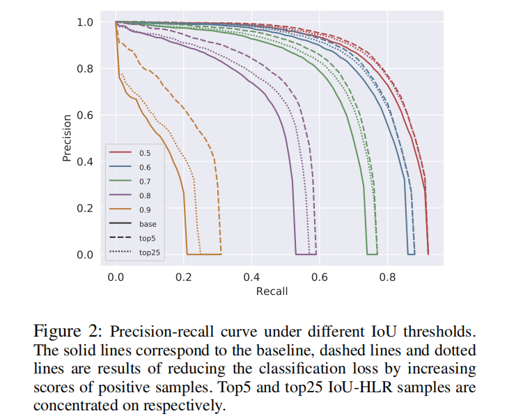

**Hierarchy Local Rank(HLR)：** 根据上述分析，提出 _IoU Hierarchy Local Rank(IoU-HLR)_ 和 _Score Hierarchy Local Rank(Score-HLR)_ 来对mini-batch中正类样本和负类样本进行排序。这种排序以层次的方式计算，其反应局部（每个ground-truth目标或一些局部区域）和全局（整个图像或mini-batch）之间的关系。注意，本文基于最终样本的定位位置计算IoU-HLR和Score-HLR，而不是回归之前的边界框坐标，这是因为基于回归样本评估mAP。

如图3所示，为了计算IoU-HLR，**首先基于它们最近的ground-truth目标，将所有样本划分到不同的组。接着，根据它们与ground-truth的IoU以降序排列每组中的所有样本，并得到IoU的局部排名（IoU Local Rank：IoU-LR）。依次选取具有相同IoU-LR的样本，并以降序排列。具体而言，收集所有的top-1 IoU-LR的样本，并将它们排序，然后是top-2、top-3等待。** 这两步产生所有样本中的排序，即IoU-HLR。IoU-HLR遵循前面提到的两个标准。第一，将具有更高局部排名的证类样本放在前面，其为每个局部组中对于每个ground-truth目标来说是最重要的样本。第二，在每个局部组中，它根据IoU重新排序样本，这与第二个准则对齐。注意，排序列表中靠前的样本也足以确保高准确率，因为它们直接影响准确率和召回率，特别是当IoU阈值高时。如图2所示，实线是不同IoU阈值下的准确率-召回率曲线。我们通过增加样本的分数来模拟一些实验。在相同的负担下（例如减小总损失的10%），我们增加top-5和top-25 IoU-HLR样本的分数，并分别以虚线和点线绘制结果。实验结果认为仅关注top样本比同等关注更多的样本好。
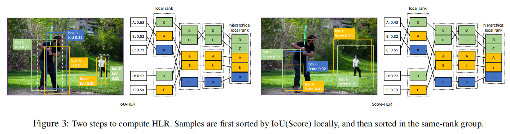

我们以与IoU-HLR相似的方式计算负样本的Score-HLR。与正样本自然地通过每个ground-truth目标分组不同，负样本还可能出现在背景区域，因此 **首先利用NMS将它们分到不同的簇。将所有前景类的最高分数作为负样本的分数，然后按照计算IoU-HLR的相同步骤排序，如图3所示。**

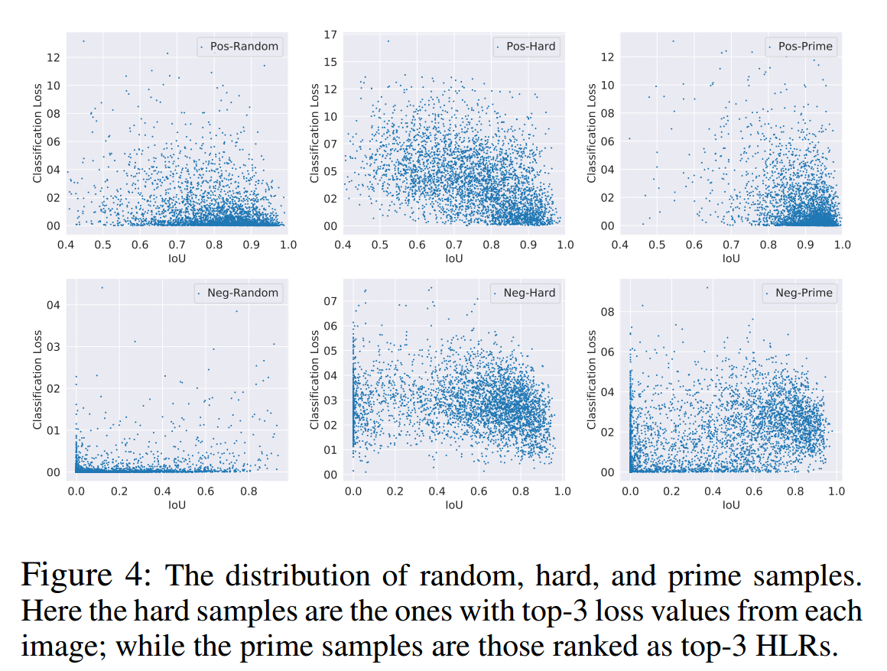

作者在图4中绘制随机、难和主要样本分布下IoU vs. 分类损失图。可以观察到难正类样本倾向具有高分类损失，并且沿这IoU轴分散在较宽的范围，而主要正类样本倾向有高IoU以及低分类损失。难负样本倾向具有高分类损失和高IoU，而主要负样本也覆盖一些低损失样本，以及有更离散的IoU分布。这表明这两类样品具有本质上不同的特征。

#### 4 Learn Detectors via Prime Sample Attention
目标检测不仅要活的更好的平均分类准确率，还要获得数据集中的主要岩本上尽可能好的性能，如第3节讨论的。本文提出Prime Sample Attention，它是一种简单而有效的采样和学习策略，其更关注主要样本。PISA包含两个部分：Importance-based Sample Reweighting（ISR）和Classification Aware Regression Loss（CARL）。利用所提出的方法，训练过程偏向主要样本而不是均匀地对待所有样本。首先，主要样本的损失权重大于其他样本，使得在这些样本中分类器倾向于更准确。其次，分类器和回归器利用联合目标函数学习，因此正类主要样本的分数现对不重要的样本得到提高。

##### 4.1 Importance-based Sample Reweighting
给定相同的分类器，性能的分布通常于训练样本的分布相匹配。如果部分样本在训练数据中出现更频繁，那么可以实现对这些样本更好的分类精度。硬采样和软采样是改变训练数据分布的两种不同方式。硬采样选择来自所有候选样本的一个子集来训练模型，而软采样给所有样本分配不同的权重。硬采样可以看作是软采样的一个特例，其中每个样本分配的损失权重要么为0要么为1。

为了作出更少的修改并适合已有的框架，本文提出一种软采样策略（称为Importance-based Sample Reweighting：ISR），其根据它们的重要性将不同的损失权重分配给样本。ISR包含正样本重加权和负样本重加权，分别表示为ISR-P和ISR-N。本文采用IoU-HLR作为正类样本的重要性衡量，使用Score-HLR作为负样本重要性的衡量。给定重要性衡量，余下的问题是如何将重要性映射到合适的损失权重。

本文首先利用线性映射将排名转换为实数值。根据它们的定义，HLR在每个类中单独计算（$N$个前景类和1个背景类）。对于类 $j$ ，假设共计存在 $n_j$ 个HLR为 $\{r_1, r_2, \cdots, r_{n_j}\}$ 的样本，其中 $0 \le r_i \le n_j-1$ ，作者使用公式1的线性函数将每个 $r_i$ 转换为 $u_i$ 。这里， $u_i$ 表示类 $j$ 中第 $i$ 个样本的重要性值。$n_{max}$ 表示所有类别上最大的 $n_j$ 值，其确保不同类别的同一排名的样本会分配到相同的 $u_i$ 。
$$u_i = \frac{n_{max} - r_i}{n_{max}} \tag{1}$$
需要一个单调递增的函数将样本的重要性 $u_i$ 转换为损失权重 $w_i$ 。这里采用公式2的指数形式，其中 $\gamma$ 是表示重要样本将被优先考虑的程度因子，$\beta$ 是决定最小样本权重的偏置项。
$$w_i = ((1-\beta)u_i + \beta)^{\gamma} \tag{2}$$
利用所提出的重加权方案，交叉熵分类损失可以重写为公式3，其中 $n$ 和 $m$ 分别表示正负样本的数量。注意，**简单的加上损失权重会改变损失的全部值和正负样本损失之间的比例，因此为了保持全部损失不变，作者将 $w$ 归一化到 $w'$** 。
$$
\begin{alignat}{2}
L_{cls} &= \sum_{i=1}^{n}w_i'CE(s_i, \hat{s}_i) + \sum_{j=1}^{m}CE(s_j,\hat{s}_j) \\
w_i' &= w_i \frac{\sum_{i=1}^nCE(s_i,\hat{s}_i)}{\sum_{i=1}^nw_iCE(s_i,\hat{s}_i)} \\
w_j' &= w_j \frac{\sum_{j=1}^mCE(s_j,\hat{s}_j)}{\sum_{j=1}^nw_jCE(s_j,\hat{s}_j)} \\
\tag{3}
\end{alignat}
$$

##### 4.2 Classification-Aware Regression Loss
重新加权分类损失值重点关注主要样本的一种直接方式。此外，作者还开发了另一种方法来突出主要样本，受前面分类和定位是相关的讨论的启发，作者提出利用CARL来联合优化这两个分支。CARL可以提高主要样本的得分，同时抑制其他样本的分数。**回归的质量决定了样本的重要性，而人们希望分类器为重要样本输出更高的分数。** 两个分支的优化应当是相关的，而不是独立的。

作者的解决方案是添加分类感知的回归损失，使得梯度可以从回归分支传递到分类分支。本文所提出的CARL如公式5， $p_i$ 表示对应的ground-truth类的预测概率，$d_i$ 表示输出的回归偏移。作者使用一个指数函数将 $p_i$ 转换为 $v_i$ ，然后根据所有样本的平均值来缩放它。 $\cal{L}$ 为常用的smooth L1 Loss。
$$
\begin{alignat}{2}
L_{carl} &= \sum_{i=1}^{n}c_i\cal{L}(d_i,\hat{d}_i) \\
c_i &= \frac{v_i}{\frac{1}{n}\sum_{i=1}^n}v_i \\
v_i &= ((1-b)p_i + b)^k \\ \tag{4}
\end{alignat}
$$

可以清楚地看出，$c_i$ 的梯度与原始的回归损失 $\cal{L}(d_i, \hat{d}_i)$ 成比例。补充材料中，作者证明了 $\cal{L}(d_i, \hat{d}_i)$ 与 $p_i$ 梯度之间是成正相关的。即，**具有更大回归损失的样本将获得较大的分类分数梯度，这意味着对分类分数的抑制作用更大**。另一张视角看，$\cal{L}(d_i, \hat{d}_i)$ 反应了样本 $i$ 的定位质量，因此可以将它视为是IoU的估计，进一步可看做是IoU-HLR的估计。排名靠前的样本大约具有较低的回归损失，因此分类得分的梯度较小。利用CARL。分类分支得到回归损失的监督。极大地抑制了不重要的样本的分数，同时增强主要样本的关注度。

#### 5 Experiments
##### 5.1 Experimental Setting
MS COCO 2017数据集及其评估方法。采用ResNet-50、ResNeXt-101-32x4d和VGG16作为骨干网络。8个Tesla V100 GPU。对于SSD，以64的批大小（每个GPU8张图像）训练120个epoch。初始学习率为0.001，在80和100个epoch后分别乘以0.1。对于其他方法，采用ResNet-50或ResNeXt-101-32x4d作为骨干。默认使用FPN，皮大小为16（每个GPU2张图像）。使用初始学习率0.02训练12个epoch，在8和11个epoch后分别乘以0.1。从2000个提议中采样512个RoI，正负样本的比例为1:3。PISA包含ISR（ISR-P和ISR-N），并且CARL具有一个不同，**即ISR-N不用于一阶段模型，因为一阶段模型中负样本的数量远大于两阶段模型，其将引入明显的训练时间上的开销。**

##### 5.2 Results
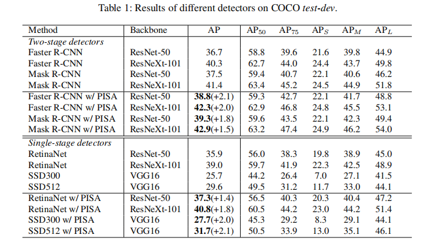

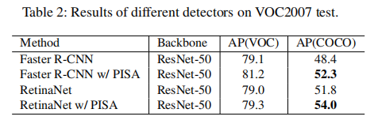

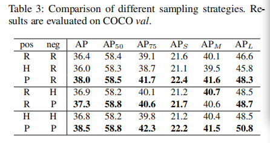

##### 5.3 Analysis
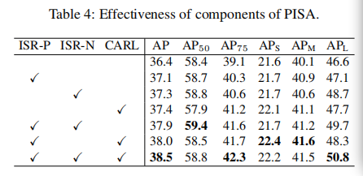

**超参数消融实验：**
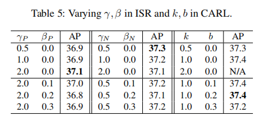

**通过比较ISR选取 $\gamma_P = 2.0$, $\gamma_N=0.5$, $\beta_P=\beta_N=0$ ，CARL选取 $k=1.0$, $b=0.2$** 。

**不同的抽样策略更喜欢哪些样本？**
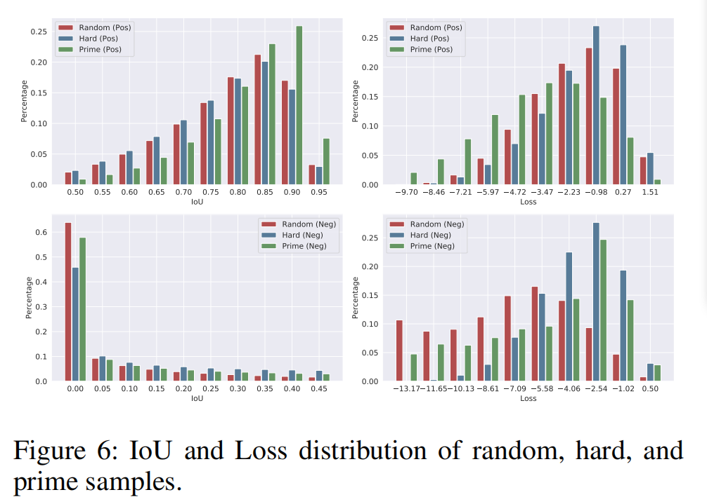

**ISR如何影响分类分数？**
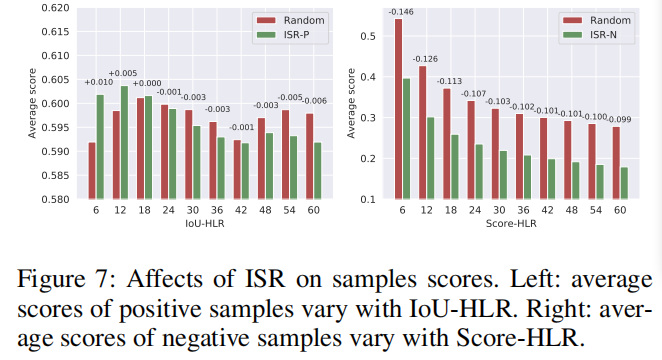

**CARL如何影响分类分数？**
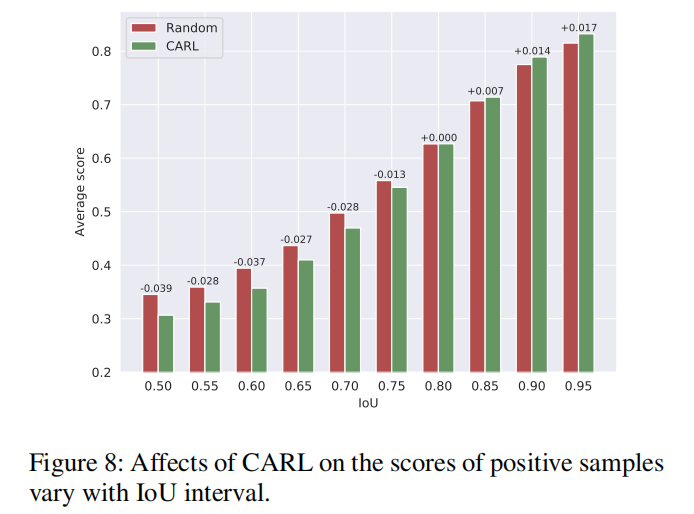

#### 附录A
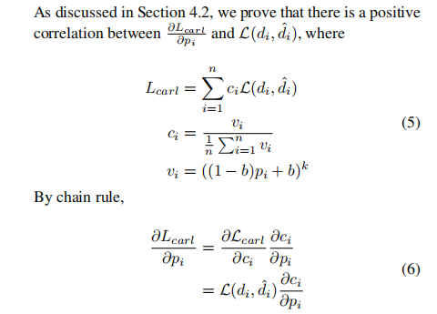
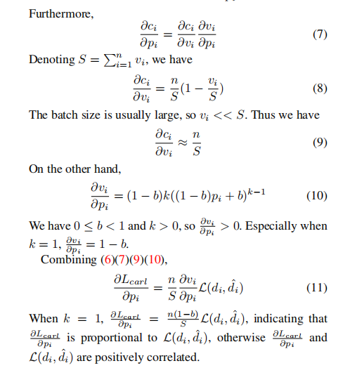
