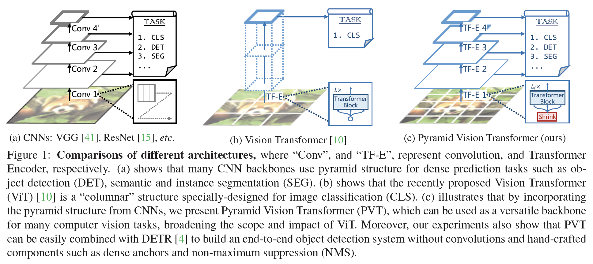
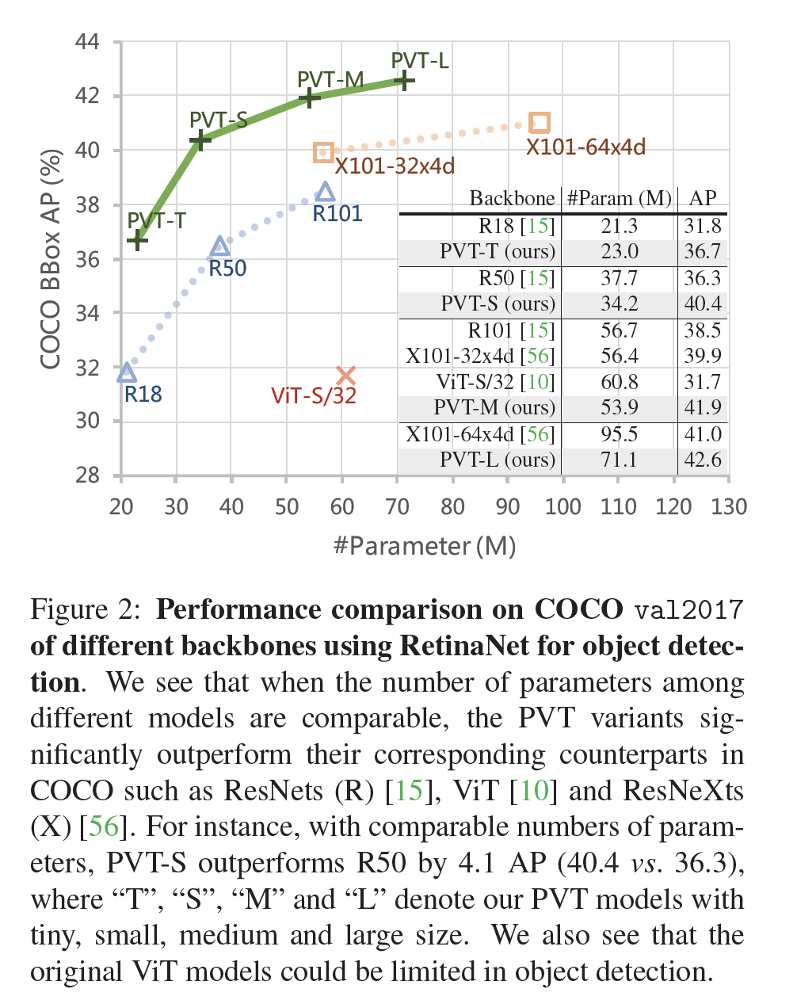

## Pyramid Vision Transformer: A Versatile Backbone for Dense Prediction without Convolutions

### 摘要

​		在计算机视觉中，尽管CNN作为骨干获得极大成功，这项工作研究了一个简单的骨干网络，该网络可用于许多无卷积的密集预测任务。与最近提出的专用于图像分类的Transformer模型（例如ViT）不同，我们提出Pyramid Vision Transformer（PVT），其克服了将Transformer移植到各种密集的预测任务上的困难。与现有技术相比，PVT有几个优点。（1）与通常具有低分辨率输出以及高计算和存储成本的ViT不同，PVT不仅可以在图像的密集分区上进行训练以获得高输出分辨率，其对于密集预测很重要，还可以使用渐进式收缩金字塔来减少大型特征图的计算。（2）PVT继承CNN和Transformer的优势，只需替换CNN主干即可使其在各种视觉任务中成为统一的主干，而不会卷积。（3）我们通过进行广泛的实验来验证PVT，表明PVT可以提高许多下游任务的性能，例如目标检测、语义和实例分割。例如，在相当参数量下，RetinaNet+PVT在COCO数据集上获得40.4AP，比RetinaNet+ResNet50（36.3AP）好4.1AP（见图2）。我们希望PVT可以作为像素级预测替代和有用的主干，并促进研究。代码见https://github.com/whai362/PVT。

### 1. 引言

​		卷积神经网络（CNN）在计算机视觉方面取得了非凡的成就，并成为计算机视觉几乎所有任务中一种通用且占主导地位的方法[9、28、11、63、41、15、56、36、14、27、7， 21]。然而，这项工作尝试探索一种新的没有卷积的通用主干网络。我们研究了CNN以外的替代模型，用于除图像分类之外的密集预测任务，例如目标检测，语义和实例分割。

​		受NLP中Transformer成功的启发，许多研究人员尝试探索在计算机视觉中探索Transformer的应用。例如，一些工作[4、64、55、43、17]将视觉任务建模为具有可学习查询的字典查找问题，并将Transformer解码器用作CNN骨干（例如VGG和ResNet）之上的任务特定的头部。尽管一些现有技术已将注意力模块[53、35、61]整合到CNN中，但据我们所知，很少研究探索干净且无卷积的Transformer主干来解决计算机视觉中的密集预测任务。

​		最近，Dosovitskiy等[10]将Transformer用于图像分类。这是通过无卷积模型替换CNN主干的有趣且有意义的尝试。如图1（b）所示，ViT具有柱状结构，具有粗糙的图像块（即，以较大的块大小分割图像）作为输入。尽管ViT适用于图像分类，但直接适应像素级的密集预测（例如目标检测和分割）仍是一项挑战，因为（1）它的输出特征图仅有一个尺度，且分辨率低，（2）即使对于普通的输入图像大小（例如，COCO检测基准中800像素的较短边），其计算和存储成本也相对较高。

​		我们补偿上述局限，这项工作提出一种使用Transformer模型的无卷积骨干网络，称为Pyramid Vision Transformer（PVT），其可以视为许多下游任务中的通用主干，这些下游任务包含图像级预测以及像素级密集预测。具体而言，如图1（c）所示，与ViT不同，PVT通过如下三个方面来克服传统Transformer的困难（1）采用细粒度图像块（例如每块$4\times4$）作为输入来学习高分辨率表示，其是密集预测的关键，（2）在网络深度增加时，引入渐进缩小金字塔来减少Transformer的长度，显著减小计算开销，以及（3）采用Spatial-Reduction Attention（SRA）层来进一步降低学习高分辨率特征图的资源成本。

​		整体上，所提出的PVT有如下优点。首先，与传统的随着深度增加感受野野增加的CNN主干相比，PVT始终产生全局感受野（通过所有小补丁上的注意力完成），其比CNN的局部感受野更适合检测和分割。其次，与ViT（见图1（b））相比，由于金字塔结构的进步，我们的方法更易于插入到许多代表性密集预测流水线，例如RetinaNet和Mask-RCNN。接着，利用PVT，我们可以通过将PVT与其他用于不同任务的Transformer解码器（例如用于目标检测的PVT+DETR）结合来构建无卷积流水线。例如，据我们所知，我们的实验提出了第一个端到端目标检测流水线（PVT+DETR），其完全是无卷积的。它在COCO val2017上获得34.7，比基于ResNet50的原始DETR好。

​		这项工作的主要贡献如下：

- 我们提出Pyramid Vision Transformer（PVT），其为第一个设计用于各种无卷积像素级密集预测任务的主干。结合PVT和DETR，我们可以构建没有卷积和手工组件（如密集锚和NMS）的端到端的目标检测系统。
- 通过设计渐进式缩小金字塔（progressive shrinking pyramid）和空间缩减注意（spatial-reduction attention：SRA），我们克服了将Transformer移植到密集像素级预测时遇到的许多困难，这些问题可以减少使用Transformer的资源消耗，使PVT灵活地学习多尺度和高分辨率特征图。
- 我们通过将PVT应用于许多不同的任务来验证PVT，例如图像分类、目标检测和语义分割，并将其与精心设计的ResNets [15]和ResNeXts [56]进行比较。如图2所示，我们看出，与先前的方法相比，具有不同参数量的PVT可以始终提到性能。例如，RetinaNet+PVT-Small在COCO val2017上获得40.4AP，比RetinaNet-ResNet50好4.1AP（40.4 vs. 36.3）。此外，RetinaNet+PVT-Large获得42.6AP，其比RetinaNet+ResNeXt101-64x4d好1.6AP，以及将参数量减少30%。

### 2. 相关工作

#### 2.1. 计算机视觉中卷积主干

​		卷积块是视觉识别中深层神经网络的主力军。标准卷积块和基本卷积块在[23]中首次引入，以区分手写数字。该块包含卷积核，该卷积核具有一定的感受野，可以捕获有利的视觉上下文。为了引入平移不变性，卷积核的权重在整个图像空间共享。随着计算资源（例如GPU）的逐渐改善，在大规模图像分类数据集（例如ImageNet）上成功训练几个卷积块[22、41]的堆栈成为可能。GoogLeNet[46]证明包含过个核路径的卷积算子可以获得非常具有竞争性的性能。多路径卷积块的有效性在Inception系列[47、45]、ResNeXt、DPN[8]、MixNet和SKNet[24]得到进一步验证。此外，ResNet[15]在卷积块中提出skip连接，其使非常深的网络称为可能，并且在计算机视觉领域中获得令人影响深刻的影响。DenseNet[18]引入密集连接拓扑结构，其将每个卷积块连接到它前一个卷积块。最新的进步可以在最新的综述论文[20、40]中发现。

#### 2.2. 密集预测任务

**Preliminary**	密集预测任务旨在在特征图上进行像素级分类或回归。目标检测和语义分割是两种代表性密集预测任务。

**Object Detection**	在深度学习时代，CNN已成为目标检测的主导框架，其包含单阶段检测器（例如SSD、RetinaNet、FCOS、GFL、PolarMask和OneNet）和多阶段检测器（Faster RCNN、Mask RCNN、Cascade RCNN和Sparse R-CNN）。