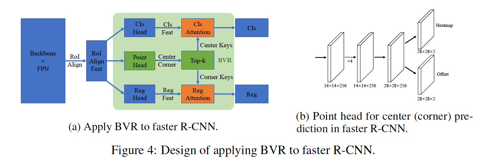

## RelationNet++: Bridging Visual Representations for Object Detection via Transformer Decoder

### 摘要

​		现有的物体检测框架通常建立在目标/部件表示的单一形式上，即RetinaNet和Faster R-CNN中的锚点/提议矩形框、FCOS和RepPoints中的中心点以及Corner-Net中的角点。尽管这些不同的表示形式通常会驱动框架在不同方面表现良好，例如更好的分类或更好的本地化，但是由于采用不同的表示方法进行了异质或非网格特征提取，通常很难将这些表示形式组合到单个框架中以充分利用每种优势。本文提出了一种基于注意力的解码器模块，与Transformer [31]中的模块类似，以端到端的方式将其他表示形式桥接到基于单个表示形式格式的典型目标检测器中。其他表示作为_key_实例的集合来强化朴素检测器中的主_query_表示特征。提出了针对解码器模块的有效计算的新颖技术，包括_key_采样方法和共享位置嵌入方法。所提出的模块称为_bridging visual representations(BVR)_。它可以就地执行，并且我们证明了它在将其他表示形式桥接到流行的目标检测框架（包括RetinaNet、Faster R-CNN、FCOS和ATSS）中的广泛有效性，其中实现了大约1.5~3.0 AP的改进。特别地，我们利用强力的骨干将最佳框架提高2.0AP，在COCO test-dev上达到52.7AP。产生的网络称为RelationNet++。代码见https://github.com/microsoft/RelationNet2。

### 1	引言

​		在许多视觉应用程序所基于的计算机视觉中，目标检测是一个至关重要的问题。尽管有许多解决此问题的方法，但它们通常利用单一的视觉表示形式。例如，大多数目标检测框架[9、8、24、18]利用矩形框来表示所有中间阶段的目标假设。最近，还有一些框架采用点来表示目标假设，例如CenterNet[38]和FCOS[29]的中心点、RepPoints[35、36、3]和PSN[34]中的点集。与整个目标表示相比，一些基于关键点（例如CornerNet[15]）利用角点的部分表示来组合目标。一般而言，不同的表示方法通常会引导检测器在不同方面表现良好。例如，边界框表示能够更好地与目标检测的标注格式对齐。中心点表示避免锚设计的需要，并且通常对小型目标友好。角点表示通常对更精细的定位更准确。

​		自然而言地提出一个问题：_是否能够将这些表示组合到单个框架以充分利用每种优势？_注意不同的表示和它们的特征提取通常是异构的，组合起来非常困难。为了处理这个问题，我们提出一种与Transformer中相似的_attention based decoder module_，其可以高效地建模异构特征之间的依赖。将目标检测器中的主要表示设置为query-input，其他视觉表示作为辅助_key_来增强由某种交互的_query_特征，其中同时考虑外观和几何关系。

​		一般而言，所有特征图点可以作为corner/center _key_实例，对于实际的注意力计算来所，这通常太多。此外，成对的几何项是需要大量计算和内存。为了处理这个问题，提出两种新颖的技术，包括_key sampling_和_shared location embedding_来进行几何项的高效计算。所提出的模块称为_bridging visual representation（BVR）_。

​		表1（a）说明了此模块在将中心和角落表示桥接到基于锚的目标检测器中的应用。中心和角点表示作为_key_实例来增强猫框特征，然后增强的特征被用于类分类和边界框表示来产生检测结果。该模块可以就地工作。与原始的目标检测器相比，主要变化是分类和回归的输入特征用增强的特征代替，因此增强的检测器在很大程度上保持了其使用便利性。

​		所提出的BVR模块是通用的。它用于不同的流行目标检测器框架，包括RetinaNet、Faster R-CNN、FCOS和ATSS。COCO数据集上的大量实验表明BVR模块将这些不同检测器的AP提高1.5～3.0。特别地，我们利用较小开销将ATSS检测器提高2.0AP，在COCO test-dev达到52.7AP。产生的网络称为RelationNet++，其增强[12]中从bbox到bbox到跨异构目标/部件表示的关系建模。

​		这项工作的主要贡献为：

- 一个称为BVR的通用模块来桥接多种异构的视觉表示，并组合各自的优势。所提出的模块可以即插即用，并且不会破坏主要表示的整体推理过程。
- 使提议的桥接模块高效的新颖技术，包括key采样方法和共享位置嵌入方法。
- 所提出的模块对四个流行的目标检测器具有广泛的有效性：RetinaNet、Faster R-CNN、FCOS和ATSS。

### 2	A Representation View for Object Detection

#### 2.1	Object/Part Representations

​		目标检测旨在查找场景中所有目标，这些目标的位置由矩形边界框描述。为了从背景中辨别目标边界框和分类目标，需要将中间几何目标/部件候选与特征关联。我们将关联_geometric description_和_feature extraction_为_representation_，其中目标检测中使用的典型表示如图1（b）所示，并终结如下。

​		**Object bounding box representation**	目标检测使用边界框作为最终输出。可能因为如此，现在，边界框是最主流的表示。几何上，边界框可以由4维向量（要么为中心-大小$(x_c,y_c,w,h)$，要么为相反的角点$(x_{\mbox{tl}},y_{\mbox{tl}}, x_{\mbox{br}},y_{\mbox{br}})$）描述。除了最终输出，这种表示也常用作初始化和中间目标表示，例如锚[24、20、22、23、18]和提议[9、4、17、11]。对于边界框表示，特征通常由图像特征图中边界框区域内的池化算子提取。常用的池化算子包括RoIPool[8]、RoIAlign[11]和Deformable RoIPool[5、40]。还有简化特征提取的方法，例如通常在锚框表示中使用框中心特征[24、18]。

​		**Object center representation**	对于分辨率为$H\times W$的图像，边界框表示形式的4维向量空间的大小为$\mathcal{O}(H^2 \times W^2)$，该图像太大而无法完全处理。为了减少表示空间，一些最近框架[29、35、38、14、32]使用中心点作为简化表示。几何上，中心点由2维向量$(x_c,y_c)$描述，其中假设空间的大小为$\mathcal{O}(H \times W)$，这更容易处理。对于中心点表示，中心点上的图像特征通常被用作目标特征。

​		**Corner representation**	边界框可由两点确定，例如左上角和右下角。一些方法[30、15、16、7、21、39、26]首先检测这些单个点，然后从这些点中组合边界框。我们称这些表示为_corner representation_。角点位置的图像特征可以被用作部分特征。

​		**Summary and comparison**	不同表示方法通常在不同方面有它的优势。例如，基于目标的表示（边界框和中心）在类别分类中更好，而在定位方面，通常比基于部分（角点）的表示更差。基于目标的表示对有利于端到端学习，因为它们不需要后处理步骤来从基于部件中组合角点的目标。与不同的基于目标的表示相比，虽然边界框表示保证更复杂的特征提取和多阶段处理，由于简化的系统设计，中心表示更吸引人。

#### 2.2	Object Detection Frameworks in a Representation View

​		目标检测方法可以视为不断发展的中间目标/部件表示，直到最终的边界框输出为止。表示流很大程度上塑造了不同目标检测器。目标检测器的几种主要类别是基于如此的表示流，例如_top-down_（基于目标的表示）vs _bottom-up_（基于部件的表示）、基于锚（基于边界框） vs 无锚（基于中心点）和单阶段（一次表示流）vs 多阶段（多次表示流）。图2给出几种典型目标检测的表示流，下面将详细描述。

​		**Faster R-CNN[24]**采用边界框作为所有阶段中的中间目标表示。开始时，每个特征图位置有多个锚定框，以粗略地覆盖图像中的4维边界框空间，即3个具有不同长宽比的锚定框。提取中心点的图像特征向量来表示每个锚框，其然后用于前景/北京分类和定位精炼。在锚框选择和定位精炼之后，目标表示发展为提议框集合，其中在每个边界框区域中，通常通过RoIAlign算子提取目标特征。最终的边界框输出是通过针对提议特征上的小型网络通过定位精炼优化来获得的。

​		**RetinaNet[18]**是一阶段目标检测器，其还采用边界框作为其中间表示。由于它的一阶段本质，它通常需要密集的锚假设，即在每个特征图位置上设置9个锚。最终也通过使用定位精炼头网络来获得最终边界框输出。

​		**FCOS**也是一阶段目标检测器，但使用目标中心点作为其中间目标表示。它直接回归中心点到四条边的距离来构成最终的边界框输出。已有相当部分的工作，例如[38、14、35]。尽管可以将中心点视为边界框的退化几何表示，但这些基于中心点的方法在基准上显示出竞争甚至更好的性能。

​		与上述采用目标表示法的框架相反，**CornerNet [15]**建立在焦点的中间部分表示法上。根据它们嵌入的相似性来分组预测到的角点（左上角和右下角），从而组成最终的边界框输出。基于角点表示的检测器通常表现出比基于目标级表示的检测更好的目标定位。

### 3	Bridging Visual Representations

​		对于2.2节中典型的框架，主要采用一种表示方法。虽然在某些方面有优势，但是它们可能还在其他方面存在短处。但是，通常难以在单个框架中结合它们，这是由于异构或不同表示的非严格特征提取引起的。本节中，我们首先提出桥接不通表示的通用方法。然后，我们演示其在各种框架中的应用，包括RetinaNet [18]、Faster R-CNN [24]、FCOS [29]和ATSS [37]。

#### 3.1	A General Attention Module to Bridge Visual Representations

​		不失一般性，对于目标检测器，它利用的表示称为主（master）表示，而通用模块旨在桥接其他表示以增强此主（master）表示。如此的其他表示称之为辅助（auxiliary）表示。

​		受用于神经机器翻译的解码器模块成功的启发，在该模块中，注意力模块被用于在不同语言（例如Transformer [31]）之间桥接信息，我们采用了这种机制来桥接不同的视觉表示。具体而言，主表示作为查询（query）输入，辅助（auxiliary）表示作为键（key）输入。注意力模块为主表示（queries）输出强化后的特征，其已桥接辅助表示（keys）的信息。我们使用通用注意力形式为：

$$\mathbf{f}_i^{'q} = \mathbf{f}_i^q + \sum_jS(\mathbf{f}_i^q, \mathbf{f}_j^k, \mathbf{g}_i^q,\mathbf{g}_j^k)\cdot T_v(\mathbf{f}_j^k), \tag{1}$$

其中$\mathbf{f}_i^q,\mathbf{f}_i^{'q},\mathbf{g}_i^q$为查询（query）实例$i$的输入特征、输出特征和几何向量；$\mathbf{f}_j^k,\mathbf{g}_j^k$为键（key）实例$j$的输入特征和几何向量；$T_v(\cdot)$为线性的值（value）转换函数；$S(\cdot)$为$i$和$j$之间的相似性函数；实例化为[12]：

$$S(\mathbf{f}_i^q,\mathbf{f}_j^k,\mathbf{g}_i^q,\mathbf{g}_j^k) = \mbox{softmax}_j(S^A(\mathbf{f}_i^q,\mathbf{f}_j^k) + S^G(\mathbf{g}_i^q,\mathbf{g}_j^k)),\tag{2}$$

其中$S^A(\mathbf{f}_i^q,\mathbf{f}_j^k)$表示通过查询和键特征之间的伸缩点积（scaled dot product）计算的外观相似度[31、12]，$S^G(\mathbf{g}_i^q,\mathbf{g}_j^k)$表示通过对$i$和$j$之间的相对位置应用小网络（即余弦/正弦位置嵌入[31、12]加上2层MLP）计算出的几何项。在查询几何向量和键几何向量之间维度不通的情况（4位边界框 vs 2维点），我们首先提取边界框上的2维点，即中心或角点，这样，对于减法运算，这两种表示在几何描述中是相同的。这与[31、12]中使用的相同，采用多头注意力，其比使用单头注意力更好。默认情况下，我们使用注意力头的数量为8。

​		上述模块称为_bridging visual representations（BVR）_，其采用任意维度的query和key表示作为输入，考虑到查询的外观和几何关系，生成增强的query特征。模块可以轻松地插入流行的检测器，如3.2和3.3节所述。

#### 3.2	BVR for RetinaNet

​		我们以RetinaNet为例来展示我们是如何将BVR模块用于已有的目标检测器。如2.2节提到的，RetinaNet采用锚边界框作为其主（master）表示，其中9个边界框固定在每个特征图位置。$H \times W$分辨率的特征图上共有$9 \times H \times W$个边界框实例。BVR以这$C \times 9 \times H \times W$的特征图（$C$为特征图通道）作为查询（query）输入，并生成相同维度的强化查询（query）特征。

​		我们使用两种key（auxiliary）表示来强化query（master）特征。一种是目标中心，而另一种是角点。如图3（a）所示，通过在backbone的输出特征图上使用小型的点头网络中心/角点预测中心/角点。然后，从预测中选择一小组key点集，并将该点集馈入注意力模块来分别强化分类和回归特征。接下来，我们提供这些模块的详情和关键设计。

​		**Auxiliary（key）representation learning**	Point Head Network包含两个共享的$3 \times 3$卷积层，接着是两个独立的子网络（$3 \times 3$卷积和sigmoid层）来分别预测中心点和角点的得分和亚像素偏移[15]。得分表示特征图bin上的中心/角点的概率。亚像素偏移$\Delta x,\Delta y$表示其精确位置与每个特征bin的左上角（整数坐标）之间的位移，这说明了通过特征图的下采样造成的分辨率损失。

​		在学习中，对于具有FPN结构的目标检测框架，我们将所有ground-truth中心/角点分配到所有特征层。我们发现它的效果比将目标分配到特定层[17、18、29、15、35]的常规做法要好，这可能是因为由于每个级别都采用了更多的正样本，它可以加快中心/角表示的学习 。为center/corner得分和亚像素偏移学习采用Focal Loss[18]和smooth L1损失，损失的权重分别为0.05和0.2。

​		**Key selection**	由于中心点表示的原理相同，因此我们使用角点来演示辅助表示选择的处理。我们将每个特征图位置视为一个目标角点候选。如果在key集中使用所有候选，那么BVR模块的计算是负担不起的。此外，过多背景候选可能抑制真实的角点。为了处理这些问题，我们提出前$k$（默认$k=50$）个key选择策略。具体地说，在角点的粪土上使用步长为1的$3 \times 3$ MaxPool，并根据它们的corner-ness得分选择top-k个角点候选。对于FPN骨干，我们从所有特征层上选择前$k$个_key_，并且所有金字塔层上共享$key$集。这种_shared key_集比不同层上使用独立的_key_集好，如表1所示。

​		**Shared relative location embedding**	几何项的直接计算的计算复杂度和内存复杂度分别为$\mathcal{O}(\mbox{time})=(d_0 + d_0d_1 + d_1G)KHW$和$\mathcal{O}(\mbox{memory})=(2 + d_0 + d_1 + G)KHW$，其中$d_0,d_1,G,K$分别为cosine/sine嵌入的维度、MLP网络的内部维度、多头注意力模块的头数量和选择的_key_实例数量。如表3所示，默认设置（$d0 = 512, d1 = 512,G = 8,K = 50$）既费时又费空间。

​		注意，相对位置的范围是有限的，即$[-H + 1, H-1] \times [-W + 1, W - 1]$，我们使用cosine/sine嵌入以及在固定的二维相对位置图上生成2层MLP网络，以生成$G$通道几何图，然后通过该几何图上的双线性采样计算key/query对的几何项。为了进一步减小计算，我们使用单元长度$U$大于1的2维相对位置图，例如$U=4$，其中每个位置bin表示原始图像中$U$的长度。在我们的实现中，我们采用$U = \frac{1}{2}S$（$S$表示金字塔层的步长），得分图的分辨率为$400 \times 400$，代表步幅$\mathbf{S}$为金字塔等级的原始图像上的$[-100S，100S)\times [-100S，100S)$范围。图3（b）给出示例。计算复杂度和内存复杂度被减少到$\mathcal{O}(\mbox{time})=(d_0 + d_0d_1+d_1G)\cdot400^2 + GKHW$和$\mathcal{O}(\mbox{memory})=(2 + d_0 + d_1 +G)\cdot400^2 + GKHW$，这明显少于直接计算，如表3所示。

​		**Separate BVR modules for classification and regression**	目标中心表示可以提供目标类别的丰富上下文，而角点表示可以促进定位。因此，我们使用单独的BVR模块来分别增强分类和回归特征，如表3（a）所示。如此单独的设计是有好处的，如表5所示。

#### 3.3	BVR for Other Frameworks

​		BVR模块是通用的，并可以用于其他目标检测框架。

​		**ATSS[37]**使用几种无锚检测器的技术来改进基于锚的检测器（例如RetinaNet）。BVR可以直接用于RetinaNet。

​		**FCOS[29]**是一种无锚检测器，其使用中心点作为目标表示。因为这种表示中没有角点新鲜，所以我们始终使用中心点位置和相应的特征来表示BVR模块中_query_实例。其他设置与RetinaNet相同。

​		**Faster R-CNN[24]**是一种两阶段检测器，其采用边界框作为所有阶段的inter-mediate目标表示。我们采用BVR来增强边界框提议的特征，如图4a。在每个提议中，RoIAlign特征都用于预测中心和角点表示。图4b展示点（center/corner）头的网络结构，其与Mask R-CNN[11]中的掩膜头相似。_key_的选择与RetinaNet的处理一样，其在3.2节中陈述。我们使用从点头插值的特征作为key特征，还分别使用中心和角点特征来增强分类和回归。由于_query_的数量远小于RetinaNet的数量，所以我们直接计算几何项，而不是使用共享几何图。

#### 3.4	Relation to Other Attention Mechanisms in Object Detection

​		**Non-Local Networks（NL）[33] and RelationNet[12]**是利用注意力模块来增强检测性能的两种先驱工作。但是，它们都设计用于增强单个表示形式的实例：non-local networks使用自注意力来融合其他像素的特征，从而增强像素特征；RelationNet[12]通过融合其他边界框特征来增强边界框特征。

​		相比之下，BVR旨在桥接不通形式的表示以组合各自的优势。除了这种概念上的差异，在建模方面还有新技术。例如，提出实现异构表示之间的均质差异/相似度计算的技术，即4维边界框 vs 2维corner/center点。同时，还提出高效建模不同种类表示之间关系和加速计算的技术，例如_key_表示的选择和共享的相对位置嵌入方法。所提出的BVR实际上与其他先驱工作相互补充，如表7和表8所示。

​		**Learning Region Features（LRF）[10]和DeTr[1]**使用注意力模块来从图像特征中计算目标提议[10]或query的特征。BVR与他们有相似的形式，但是不同之处是在桥接不通形式的目标表示。

### 4	实验

​		在4.1节中，我们首先使用RetinaNet基础检测器来消融研究所提出的BVR的每个组件。然后，我们介绍BVR用于四种代表性（包括两阶段（即faster R-CNN）、一阶段（即RetinaNet和ATSS）和无锚（即FCOS））检测器。最后，我们比较我们的方法与最佳方法。

​		我们的实验走在MMDetection中实现。所有实验在MS COCO数据集上进行。80k训练图像和35k验证图像的子集用于训练。主要的消融实验在验证集的未使用的5k子集（表示为minival）上进行。除非其他说明，所有训练和推理细节与MMDetection中的默认设置相同，即使用ImageNet预训练的backbone，调整输入图像使其短边为800像素，长边小于等于1333，使用动量为0.9的SGD算法优化整个网络，权重衰减设置为0.0001，将初始学习率设置为0.02，在8个epoch和11个epoch时分别乘以0.1。在大模型实验中（表10和表11），我们训练20个epoch，并在16个epoch和19个epoch时减小学习率。在大模型实验中也采用多尺度训练，对于每个mini-batch，从$[400,1200]$中随机选择短边。

#### 4.1	Method Analysis using RetinaNet

​		我们的消融研究构建在使用ResNet50的RetinaNet检测器上，该检测器在COCO minival（1倍设置）上获得35.6AP。使用这个基础检测器分析BVR模块中的组件。

​		**Key selection**	如表1所示，跨特征层的比较独立的key，对于20和50个key，共享的key可以分别带来+1.6和+1.5AP增益。使用50个key获得最佳准确率，可能是因为太少的key不能充分覆盖代表性关键点，同时过多的key包含大量低质量候选。

​		整体上，BVR将RetinaNet的性能增加2.9AP，这明显好于原始的RetinaNet，证明桥接相互之间的表示的巨大好处。

​		**Sub-pixel corner/center**	表2介绍了中心点和角点使用亚像素表示的好处。虽然亚像素表示既有利于分类又有利于回归，但对于定位任务而言，它更为关键。

​		**Shared relative location embedding**	如表3所示，与位置嵌入的直接计算相比，所提出的位置嵌入方法在几何项计算上节约42倍的内存开销（134M vs. 5690M）和102倍的FLOPs（2G vs. 204G），同时获得略为好的性能（38.5AP vs. 38.3AP）。

​		表4中的单元长度和共享位置图的大小的消融研究表现出稳定的性能。默认情况下，我们采用的单元长度为$[4,8,16,32,64]$和位置图大小$400 \times 400$。

​		**Separate BVR modules for classification and regression**	表5消融研究使用单独的BVR模块进行分类和回归的影响，表明中心表示是更适合分类的辅助，而角点表示是更适合回归的辅助。

​		**Effect of appearance and geometry terms**	表6消融研究外观和几何项的影响。一起使用两项比单独使用外观项好1.1AP，并且比单独使用几何项好0.9AP。一般而言，几何项在较大的IoU标准下受益更多，而在较低的IoU标准下受益更少。

​		**Compare with multi-task learning**	仅包括一个辅助点头而不使用它，可以使RetinaNet基线提高0.8 AP（从35.6增至36.4）。注意，BVR在相同设置下带来2.9AP的改进，主要的改进不是来自多任务学习。

​		**复杂度分析**	表9给出FLOPs的分析。输入图像被调整到$800 \times 1333$。所日出的BVR模糊大约引入3%的参数（39M vs 38M）、大约10%的计算（266G vs 239G）。我们还使用较重的头部网络进行RetinaNet，以使其具有与我们的方法相似的参数和计算。再增加一层，则精度可能会稍微降低至35.2，这可能是由于优化难度越来越大。我们在每个head卷积层后引入GN层来缓解这个问题和一个额外的卷积层将准确率提高0.3AP。这些结果表明BVR带来的改进并非主要由于参数和计算。

​		表11中显示了使用V100 GPU（使用fp32模式）的不同模型的实际推断速度。通过使用ResNet-50主干，BVR模块通常只需不到10％的开销。 通过使用更大的ResNeXt-101-DCN主干，BVR模块通常只需不到3％的开销。		

#### 4.2	BVR is Complementary to Other Attention Mechanisms

​		与Non-Local模块[33]和relation模块[12]的先驱作品相比，BVR模块的行为有所不同，后者也对表示之间的依赖性进行建模。虽然BVR模块建模不同表示之间的关系，而后一个模块建模相同表示（像素[33]和提议边界框[12]）中关系。为了与object relation（ORM）比较，我们首先将BVR用于增强具有corner/center表示的RoIAlign特征，这一过程与图4a相同。然后，增强的特征被用于建模提议之间的目标关系。与[12]不同，采样Key以使模块更有效。表8给出BVR模块和Relation模块很大程度上互补的。在Faster R-CNN基线的基础上，ORM可以使AP改善+1.0，而我们的BVR可以使AP改善1.9。在ORM的基础上应用BVR可以将AP持续提高2.0。 表7和8显示了BVR模块主要与Non-Local和object relation module互补。

#### 4.3	Generally Applicable to Representative Detectors

​		我们将所提出的BVR用于四种代表性框架，即RetinaNet、Faster R-CNN、FCOS和ATSS，如表10所示。ResNeXt-64x4d-101-DCN骨干、多尺度和更长训练（20个epoch）被用于测试我们的方法是否在强基线上有影响。BVR模块将这些强检测器提高1.5～2.0AP。

#### 4.2	Comparison with State-of-the-Arts

​		我们通过在ATSS强检测器上使用BVR模块来构建我们的检测器，该检测器基于ResNeXt-64x4d-101-DCN骨干，使用多尺度测试，在COCO test-dev上获得50.7AP。我们的方法将它的性能提高2.0AP，达到52.7AP。表12给出与最佳方法的比较。

