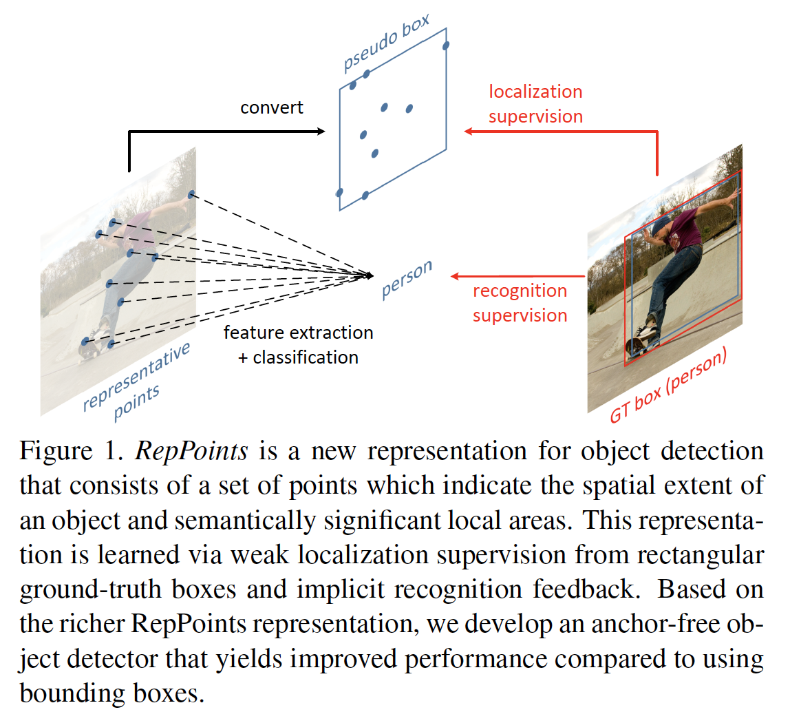
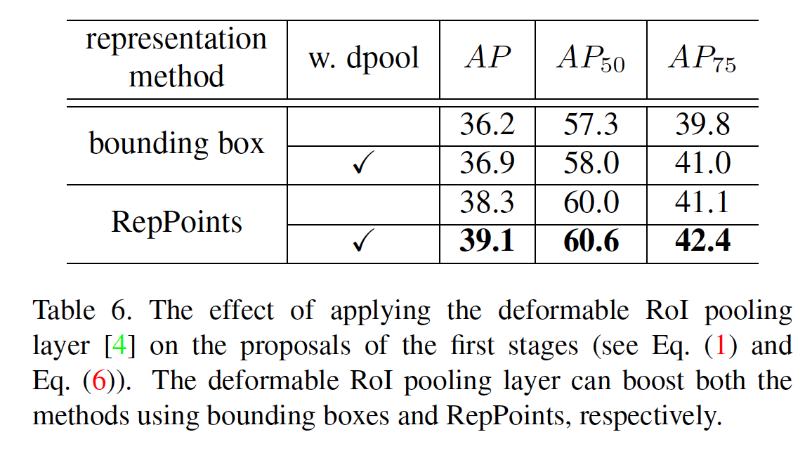
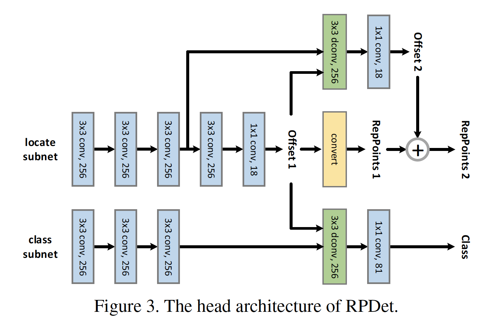
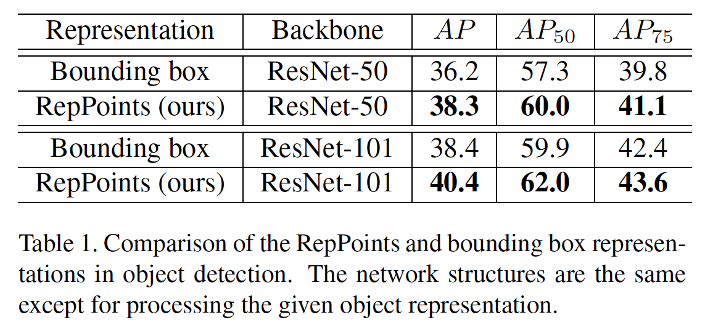
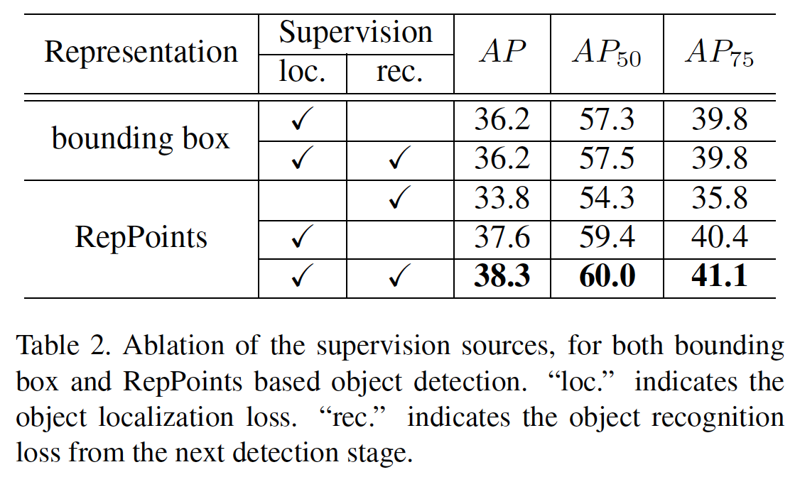
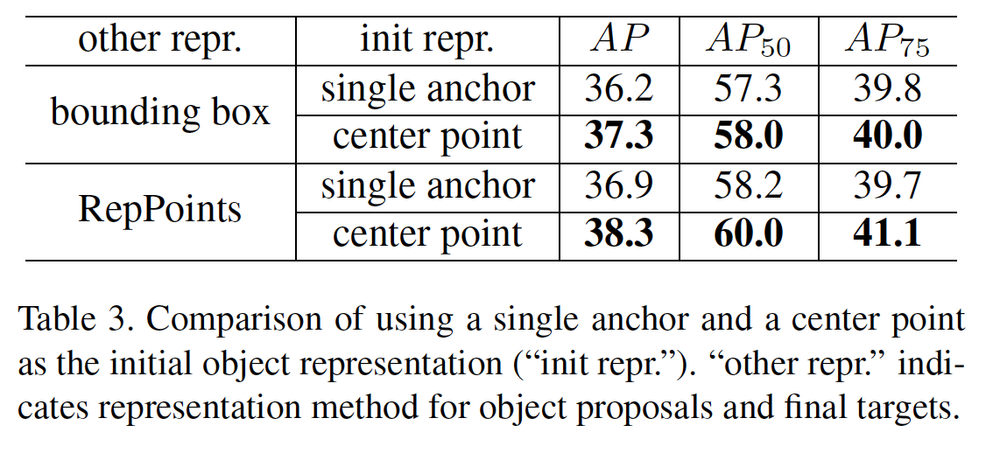
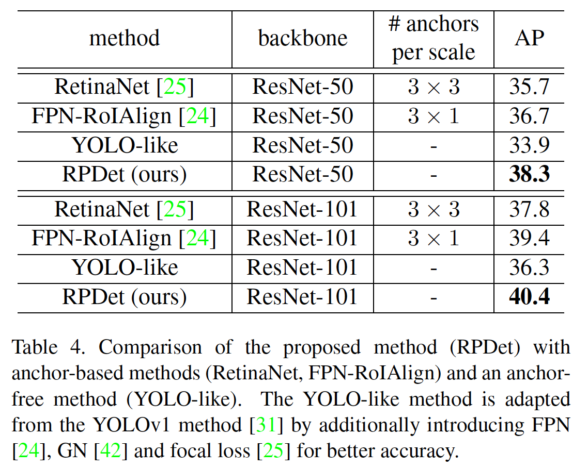
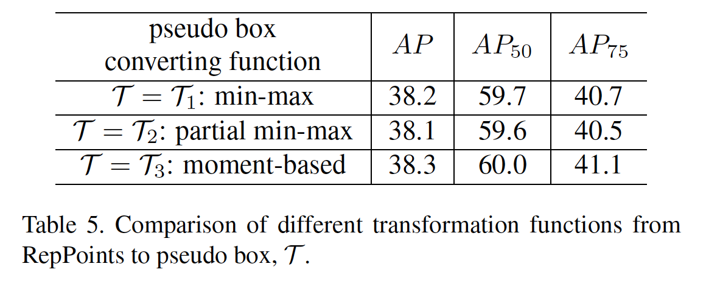
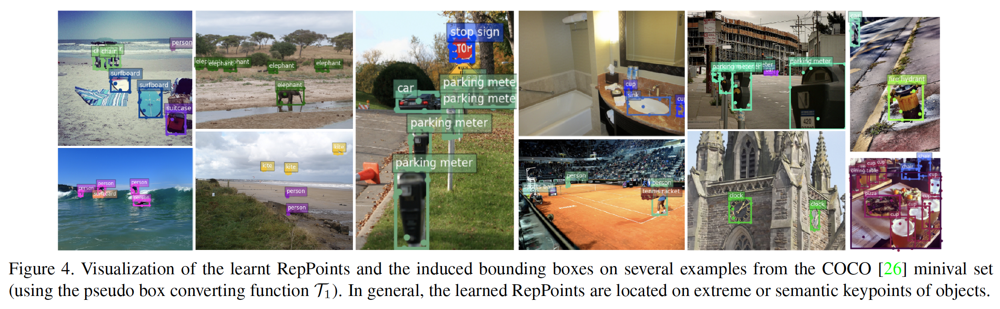
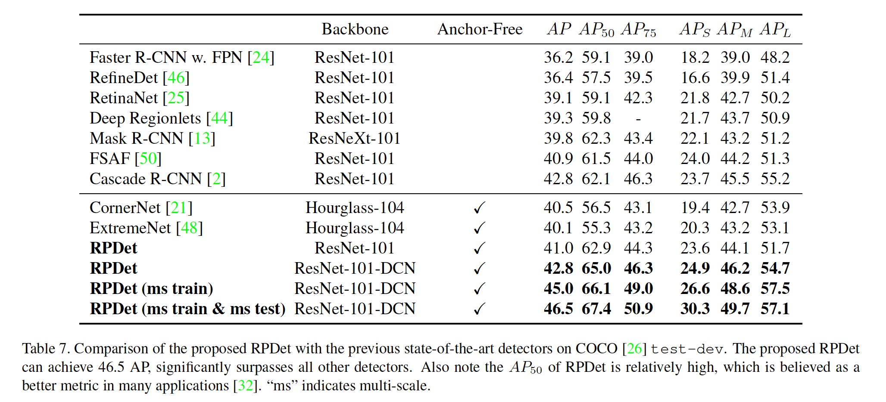

## RepPoints: Point Set Representation for Object Detection

### 摘要

​		现代目标检测器严重依赖矩形边界框，例如锚、提议和最终预测，来表示不同识别阶段的目标。边界框便于使用，但是仅提供目标的粗糙位置，并导致相对粗糙的目标特征提取。本文中，我们提出**RepPoints**（representative points），一种新的更精细的目标表示形式，即一组对定位和识别都有用的采样点。给定用于训练的ground-truth位置和识别目标，RepPoints学会以限制目标空间范围并指示语义上重要的局部区域的方式自动安排它自己。此外，它们不需要使用锚来采样边界框的空间。我们展示了基于RepPoints的无锚目标检测器可以与基于锚的最新检测方法一样有效，使用ResNet-101的模型在COCO test-dev 检测基准上获得46.5 AP和67.4 $AP_{50}$ 。可从https://github.com/microsoft/RepPoints获得代码。

### 1. 引言

​		目标检测旨在定位图像中的目标，并提供它们的类标签。作为计算机视觉中最基础的任务之一，它作为许多视觉应用（实例分割、人体姿态分析和视觉推理）中的关键组件。目标检测问题的重要性以及深度神经网络的迅速发展，近年来已经取得了实质性进展[7、11、10、33、14、3]。

​		在目标检测流水线中，包围图像矩形区域的边界框作为处理的基本元素。它们描述了目标检测器整个阶段（从锚和提议到最终预测）的目标位置。基于这些边界框，提取特征以及用于诸如目标分类和位置精炼的目标。边界框表示形式的普遍性可以部分归因于用于目标检测性能的通用指标，该指标解释了目标的估计边界框与ground-truth边界框之间的重叠。另一个原因在于它的规则形状以及将矩形窗口细分为池化单元矩阵的便利性，它便于在深度网络中进行特征提取。

​		虽然边界框促进计算，但是它们仅提供了与目标的形状和姿势不符的目标的粗略位置。从边界框的常规单元格中提取的特征可能会受到背景内容或包含少量语义信息的无信息前景区域的严重影响。这可能导致更低的特征质量，其衰减目标检测中的分类性能。

​		本文中，我们提出一种新的表示，称为_RepPoints_，其提供细粒度的位置并促进分类。如图1所示，RepPoints为一组点，这些点以外接目标空间范围以及指示语义上显著的局部区域的形式自适应地学习目标自身。RepPoints的训练受目标位置和识别任务的联合驱动，使得RepPoints受ground-truth的紧凑约束，并引导检测器向正确的目标分类。可以在现代目标检测器的不同阶段上连贯地使用这种自适应和可区分的表示形式，并且不需要使用锚在边界框的空间上进行采样。

​		RepPoints与已有的目标的非矩形表示不同，后者全部以自下向上的方式构建[38、21、48]。这些自下而上的表示识别单个点（例如边界框角或目标极点），并依靠手工制作的聚类将它们分组为目标模型。此外，它们的表示还是像边界框一样[38、21]还是与轴对齐的，或者需要ground-truth目标掩膜作为附加监督[48]。相比之下，RepPoints从输入图像/目标特征上以自上而下的形式学习，运行进行端到端的训练，并产生细粒度定位，而无需额外监督。

​		利用RepPoints替换两阶段目标检测器中所有传统边界框表示，包括锚、提议和最终的定位目标，我们开发出一种干净而有效的_无锚_目标检测器，其在COCO基准测试上，使用ResNet-101模型，在没有多尺度训练和测试的情况下，获得42.8AP以及65.0$AP_{50}$；在多尺度测试下，获得获得46.5AP以及67.4$AP_{50}$。所提出的目标检测器不仅比所有已有的无锚检测器好，还比部分基于锚的最先进基线好。

### 2. 相关工作

**Bounding boxes for the object detection problem**	边界框一直是目标检测领域中目标表示的主要形式。它流行的一个理由是，边界框便于标注而几乎没有歧义，同时为后续的识别过程提供了足够准确的定位。这可能解释为什么主要的基准测试都使用基于边界框的标注和评估[8、26、20]。相反，这些基准测试激励目标检测方法使用边界框作为它们的基本表示以与评估协议对齐。

​		边界框占主导的另一个原因是，在深度学习之前[39、5]以及深度学习时代[19、34、36、15]，几乎所有的图像特征提取器都是基于规则网格形式的输入补丁。因此使用边界框表示便于促进特征提取[11、10、33]。

​		尽管所提出的_RepPoints_具有非规则的形式，但是我们证明它可以方便地进行特征提取。我们的系统将RepPoints与可变形卷积[4]结合使用，它与RepPoints自然对齐，因为它可以聚合多个采样点上输入特征的信息。此外，ResPoints可以稳定生成矩形_伪边界框（pseudo box）_，它允许将新的表示用于目标检测基准测试。

**Bounding boxes in modern object detectors**	迄今为止，性能最好的目标检测器通常遵循多阶段识别范例[24、4、13、23、2、35、27]，并且边界框表示几乎出现在所有阶段：1）作为预定义[33、25]或学习的锚[40、45、47]，它们作为边界框空间上的假设；2）作为精炼的目标提议连接后续识别阶段[33、2]；以及3）作为最终的定位目标。

​		RepPoints可以用于替换目标检测器的所有阶段的边界框表示，产生更有效的新的目标检测器。具体而言，通过中心点替换锚，其为RepPoints的特例。边界框提议和最终定位目标由RepPoints提议和最终目标代替。注意，由于使用中心点表示初始目标，产生的目标检测器是无锚的。因此，它比基于边界框的方法更加方便使用。

**Other representations for object detection**	为了解决矩形边界框的局限，已有几种尝试开发更灵活的目标表示。这些包括用于行人检测的椭圆表示[22]和更好地处理旋转变化[16，49]的旋转边界框。

​		其他工作旨在自下而上的形式表示目标。早期的自下而上的表示包括DPM[9]和Poselet[1]。最近，自下而上的目标检测方法已通过深度网络进行了探索[21、48]。CornerNet[21]首先预测左上角和右下角，然后采用特殊的分组方法[28]获得目标的边界框。两个相对的角点仍基本上是对矩形边界框建模。ExtremeNet[48]利用来自ground-truth掩膜标注的监督定位x和y方向的目标极点。一般而言，自下而上的检测器受益于小型假设空间（例如，CornerNet和ExtremeNet都检测2D点，而不是直接检测4D边界框）以及潜在地更精细的位置。但是，它们有局限，例如依赖手工聚类或后处理步骤来组成整个目标。

​		与这些自下而上的工作相似，_RepPoints_也是一种灵活的目标表示。但是，表示以自上而下的形式构建，而不虚手工聚类步骤。RepPoints可以自动学习极点和关键语义点，而不需超越ground-truth边界框的监督，这与需要额外掩膜监督的ExtremNet[48]不同。

**Deformation modeling in object recognition**	视觉识别的最基础挑战之一是识别不同几何变化的目标。为了有效地对这种变化建模，一种可能的解决方案是利用自下而上的低级组件组成。沿着这方向的代表性检测器包括DPM和Poselet。一种代替方案是以自下而上的方式隐式地建模这种变换，其中将轻量神经网络块要么全局地，要么局部地用于输入特征。

​		_RepPoints_受这些工作的启发，特别是自上而下的可变形建模方法[4]。主要区别在于，除了语义特征提取之外，我们还旨在开发一种灵活的目标表示形式，以进行精确的几何定位。相比之下，可变卷积和可变形RoI池化仅设计用于改善特征提取。第4节和附录检查了变形RoI池无法学习精确的几何定位的能力。在这种场景中，我们在以前的几何建模方法[18、4]中扩展了自适应采样点的用法，以包括目标的更精细定位。

### 3. The RepPoints Representation

​		我们首先回顾边界框表示，及其在多阶段目标检测器中的使用。接着是RepPoints的描述及其与边界框的差异。

#### 3.1. Bounding Box Representation

​		边界框是编码目标空间位置的4d表示，$\mathcal{B} = (x, y, w, h)$，$x, y$表示中心点，$w,h$表示宽和高。由于其使用简单且方便，现代目标检测器很大程度上依赖于边界框来表示检测流水线各个阶段的目标。

**Review of Multi-Stage Object Detectors**	最佳表现的目标检测器通常遵循多阶段识别范式，其中目标位置逐阶段精炼。通过该管道的步骤，目标表示的作用如下：

$$\begin{align}\mbox{bbox anchors} &\stackrel{\mbox{bbox reg.}}{\longrightarrow} \mbox{bbox proposals (S1)} \\ &\stackrel{\mbox{bbox reg.}}{\longrightarrow} \mbox{bbox proposals (S2)} \\ &\cdots \\&\stackrel{\mbox{bbox reg.}}{\longrightarrow} \mbox{ bbox object targets} \end{align} \tag{1}$$

​		最初，假设使用多个锚来覆盖一定范围的边界框尺度和纵横比。一般而言，通过在较大的4-d假设空间上的密集锚点获得高覆盖率。例如，RetinaNet[25]中使用每个位置45个锚。

​		对于一个锚，采用其中心位置的图像特征作为其目标特征，然后，将其用于生成关于锚是否是目标的置信度得分，以及通过边界框回归过程精炼边界框。精炼的边界框表示为“bbox proposals（S1）”。

​		在第二个阶段，从精炼的边界框提议中提取精炼的目标特征，通常使用RoI池化[10]或RoI-Align[13]。对于两阶段框架[33]，精炼特征通过边界框回归产生边界框目标。对于对阶段方法[2]，精炼特征也通过边界框回归生成中间的精炼边界框提议（S2）。这个步骤可以在生成最终边界框目标之前经过多次迭代。

​		在此框架中，边界框回归在逐步完善目标定位和目标特征方面起着核心作用。 我们在以下段落中阐述边界框回归的过程。

**Bounding Box Regression**	通常，预测4d回归向量$(\Delta x_p, \Delta y_p, \Delta w_p, \Delta h_p)$以将当前的边界框提议$\mathcal{B}_p = (x_p, y_p, w_p, h_p)$映射到精炼边界框$\mathcal{B}_r$，其中

$$\mathcal{B}_r = (x_p + w_p \Delta x_p, y_p + h_p \Delta y_p, w_p e^{\Delta w_p}, h_p e^{\Delta h_p}). \tag{2}$$

​		给定目标的ground-truth边界框$\mathcal{B}_t = (x_t, y_t, w_t, h_t)$，边界框回归的目标是使$\mathcal{B}_r$和$\mathcal{B}_t$尽可能接近。具体而言，在目标检测器的训练中，我们使用预测的4d回归向量与期望的4d回归向量$\hat{\mathcal{F}}(\mathcal{B}_p, \mathcal{B}_t)$之间的距离作为学习目标，使用 smooth $l_1$损失：

$$\hat{\mathcal{F}}(\mathcal{B}_p, \mathcal{B}_t) = (\frac{x_t - x_p}{w_p}, \frac{y_t - y_p}{h_p}, \log\frac{w_t}{w_p}, \log\frac{h_t}{h_p}). \tag{3}$$

​		边界框回归过程广泛用于现有的目标检测方法。**在实践中，当所需的精炼很小时，效果很好；但是，当初始表示与目标之间的距离较大时，它的性能往往很差。另一个问题是$\Delta x$、$\Delta y$和$\Delta w$、$\Delta h$之间的尺度差异，这需要调整其损失权重以获得最佳性能。**

#### 3.2. RepPoints

​		如前面讨论的，4d边界框是目标位置的粗糙表示。边界框表示仅考虑目标矩形空间域，而没有考虑形状与姿态以及语义上重要的局部区域的位置，可将该位置用于更精细的定位和更好的目标特征提取。

​		为了解决上述局限，_RepPoints_建模自适应采样点的集合：

$$\mathcal{R} =\{(x_k, y_k)\}_{k=1}^n,\tag{4}$$

其中$n$为表示中使用的采样点的总数。在我们的工作中，默认情况下，$n$设置为9。

**RepPoints refinement**	渐进精炼的边界框位置和特征提取对多阶段目标检测方法很重要。对于RepPoints，精炼可以简单表示为：

$$\mathcal{R}_r = \{(x_k+\Delta x_k, y_k + \Delta y_k)\}_{k=1}^n,\tag{5}$$

其中$\{(\Delta x_k, \Delta y_k)\}_{k=1}^n$为新采样点相对于旧采样点的预测偏移。我们注意到，这种精炼没有面对边界框回归参数之间的尺度差异问题，因为_RepPoints_在精炼过程中偏移量的尺度相同。

**Converting RepPoints to bounding box**	为了在RepPoints训练中利用边界框标注，以及评估基于RepPoints的目标检测器，需要将RepPoints转换为边界框的方法。我们使用预定义的函数$\mathcal{T}: \mathcal{R}_P \rarr \mathcal{B}_P$，其中$\mathcal{R}_P$表示目标$P$的RepPoints，而$\mathcal{T}(\mathcal{R}_P)$表示_pseudo box_。

​		为这个目的考虑三种转换函数：

- **$\mathcal{T} = \mathcal{T}_1$：Min-max function**	在RepPoints的两个轴上进行min-max操作以确定$\mathcal{B}_P$，等价于采样点上的边界框。
- **$\mathcal{T} = \mathcal{T}_2$:  Partial min-max function**    在采样点子集的两个轴上进行min-max操作以获得$\mathcal{B}_P$的矩形边界框。
- **$\mathcal{T} = \mathcal{T}_3$：Moment-based function**    RepPoints上的均值和标准差用于计算矩形边界框$\mathcal{B}_P$的中心点和尺度，其中尺度乘以全局共享的可学习乘子$\lambda_x$和$\lambda_y$。

这些函数都是可微的，当插入目标检测系统时，能够保证端到端学习。在我们的实验中，我们发现它们效果相当。

**Learning RepPoints**	RepPoints的学习受目标定位损失和目标识别损失驱动。为了计算目标定位损失，我们首先使用先前讨论的变换函数$\mathcal{T}$将RepPoints转换为_pseudo box_。然后计算转换的_pseudo box_与ground-truth框之差。在我们的系统中，我们使用左上角和右下角之间的smooth $l_1$距离来表示定位损失。smooth $l_1$距离不需要如计算边界框回归向量之间距离（即$\Delta x, \Delta y$和$\Delta w, \Delta h$）那样不同损失权重的调整。图4表示，当通过目标定位和目标识别损失的这种组合来驱动训练时，将自动学习目标的极点和语义关键点（$\mathcal{T}_1$用于将RepPoints转换为pseudo box）。

### 4. RPDet: an Anchor Free Detector

​		我们设计一种无锚目标检测器，其利用RepPoints替换边界框作为目标的基本表示。在一个多阶段流水线中，目标表示涉及如下：

$$\begin{align}\mbox{object centers} &\stackrel{\mbox{RP refine}}{\longrightarrow} \mbox{RepPoints proposals (S1)} \\ &\stackrel{\mbox{RP refine}}{\longrightarrow} \mbox{RepPoints proposals (S2)} \\ &\cdots \\&\stackrel{\mbox{RP refine}}{\longrightarrow} \mbox{ RepPoints object targets} \end{align} \tag{6}$$

​		我们的RepPoints Detector（RPDet）基于可变形卷积具有两个识别阶段，如图2所示。可变形卷积与RepPoints很好地结合，因为它的卷积是在不规则分布的样本点集合上计算的，相反，其识别反馈可以指导这些点的位置的训练。本节中，我们介绍RPDet的设计，并讨论其与现有目标检测器的关系和区别。

**Center point based initial object representation**	尽管预定义的锚在目标检测的初始阶段主导了目标的表示，但是我们遵循YOLO [31]和DenseBox [17]中使用的中心点作为目标的初始表示，这导产生无锚目标检测器。

​		中心点表示的一个重要好处是与基于锚的对应点相比，其假设空间更紧密。虽然基于锚点的方法通常依赖于大量的多个纵横比和多个尺度的锚来确保对大量4维边界框假设空间的密集覆盖，但基于中心点的方法却可以更轻松地覆盖其2维空间。事实上，所有目标都有位于图像中的中心点。

​		但是，基于中心点的方法还面临识别目标模糊的问题，这是由位于特征图中相同位置的两个不同目标引起的，其限制了它在现代目标检测器中的流行。在以前的方法[31]中，这主要是通过在每个位置产生多个目标来解决的，这又面临归属歧义的另一个问题。在PRDet中，我们证明这个问题可以使用FPN结构[24]的到极大地缓解，有如下原因：第一，不同尺度的目标将被分配到不同的图像特征层，这解决了不同尺度和相同中心点位置的目标。事实上，在COCO数据集中，当使用FPN时，我们观察到仅1.1%的目标遭遇中心点位于相同位置的问题。

​		值得注意的是，中心点表示可以视为特殊的RepPoints配置，其中仅使用单个固定的采样点，因此在整个提议的检测框架中保持一致的表示。

**Utilization of RepPoints**	如图2所示，RepPoints作为我们检测系统的基本目标表示。从中心点开始，通过回归中心点上的偏移获得第一个_RepPoints_集。**这些_RepPoints_的学习受两个目标驱动：1）推导的_pseudo box_与ground-truth边界框之间的左上角和右下角的距离损失；2）后续阶段的目标识别损失。**如图4所示，自动学习极点和关键点。第二个_RepPoints_集表示最终的目标位置，其通过公式（5）精炼第一个_RepPoints_集。仅由点距离损失驱动，第二个_RepPoints_集旨在学习更好的目标位置。

**Relation to deformable RoI pooling [4]**	正如第2节所述，与所提出的RepPoints相比，可变形RoI池化在目标检测中扮演着不同的角色。基本上，_RepPoints_是目标的几何表示，其反应更准确的语义位置，而可变形RoI池化旨在学习更强的目标外观特征。事实上，可变形RoI池化不能学习表示目标准确位置的样本点（见附录给出证明）。

​		我们还注意到，可变形RoI池化能与RepPoints相互补充，见表6。

**Backbone and head architecture**	我们的FPN骨干遵循[25]，我们生成从stage3（下采样率为8）到stage7（下采样率为128）的5个特征金字塔层。

​		头部的架构如图3所示。有两个非共享的子网络，其目标分别是定位（RepPoints生成）和分类。定位子网络首先使用3个256-d的$3 \times 3$卷积层，接着是两个连续的小型网络来计算两组_RepPoints_的偏移。分类子网络也使用3个256-d的$3 \times 3$卷积层，接着是256-d的$3 \times 3$的可变形卷积层，这个可变形卷积与定位子网络中共享输入偏移。在两个子网络的前3个256-d的$3\times3$卷积层之后使用组归一化层。

​		注意，尽管我们的方法利用两阶段的定位，但是它比一阶段的RetinaNet [25]检测器（使用ResNet-50骨干有210.9 vs. 234.5 GFLOPS）效率更高。由于层共享，额外的定位阶段几乎没有引入开销。无锚设计减小最终分类层的负担，从而导致计算量略有减少。

**localization/class target assignment**	**有两个定位阶段：通过从目标中心点假设（特征图bins）精炼生成第一组RepPoints；通过从第一组RepPoints精炼生成第二组RepPoints。**对于两个阶段，在训练中，仅将正类目标假设与定位（RepPoints）目标相关联。对于第一个定位阶段，如果1）这个特征图bin（feature map bin）的金字塔层等于ground-truth目标的对数尺度$s(B)=\lfloor\log_2(\sqrt{w_Bh_B}/4)\rfloor$；2）该ground-truth目标中心点的投影位于此特征图bin内，那么这个特征图bin为正类。对于第二个定位阶段，如果RepPoints推导的pseudo box与ground-truth目标有足够的重叠（它们的IoU大于0.5），那么第一个RepPoints为正类。

​		分类仅在第一组RepPoints上进行。分类分配标准遵循[25]pseudo box与ground-truth边界框之间的IoU大于0.5为正，小于0.4位背景，其他情况则忽略。对于分类训练，采用Focal Loss。

### 5. 实验

#### 5.1. 实验设置

​		我们在MS-COCO [26]检测基准上展示了我们提出的RPDet框架的实验结果，其中包含118k图像进行训练，5k图像进行验证（minval）和20k图像进行测试（test-dev）。如果没有特别指出，在minival上，利用ResNet-50进行所有消融实验。在test-dev上报告的与最先进结果的比较，见表7。

​		我们的检测器经过4个GPU上的同步随机梯度下降（SGD）训练，每个minibatch共计8张图像（每个GPU有2张图像）。使用ImageNet预训练的模型进行初始化。我们的学习率调度遵循“1x”设置[12]。在训练中，使用随机水平翻转。在推理阶段，采用NMS（$\sigma = 0.5$）来后处理这些结果，这遵循[25]。

#### 5.2. 消融研究

**RepPoints vs. bounding box**	为了证明所提出的RepPoints的作用，我们比较所提出的RPDet与基线检测器（其中用规则的边界框表示替换RepPoints）。

_Baseline detector based on bounding box representations. 初始目标表示采用尺度为4且纵横比为$1:1$的单个锚，如果与ground-truth目标的IoU大于0.5，则锚框为正。使用边界框表示替换两组RepPoints，其中通过标准的边界框回归方法获得几何精炼，并通过使用$3 \times 3$网格点的RoIAlign方法替换特征提取。其他设置与所提出的RPDet相同。

​		表1给出了两种检测器的比较。

**Supervision source for RepPoints learning**	RPDet使用两种目标定位损失和一个目标识别损失（后来的识别产生的梯度）来驱动第一组RepPoint的学习，这代表了第一阶段的目标提议。表2给出在学习目标表示中使用这两个监督源的情况。如前面提到的，描述目标的几何定位是表示方法的重要职责。没有目标定位损失，表示方法很难完成此任务，因为这会导致目标检测器的性能显着下降。对于RepPoints，我们观察到移除目标定位监督，有4.5mAP的巨大衰减，这表明描述目标表示方法的几何定位的重要性。

​		表2还证明在学习RepPoints中包含目标识别损失的好处。目标识别损失的使用可以驱动RepPoints在目标的语义上有意义的位置定位它们自己，这产生细粒度的定位，并改善后续识别阶段目标特征提取。请注意，使用边界框表示法，目标识别反馈无法使目标检测受益（请参阅表2中的第一个方块），进一步证明，在灵活目标表示方面，RepPoints的优势。

**Anchor-free vs. anchor-based**	我们首先比较基于中心点的方法（特殊的RepPoints配置）与流行的基于锚的方法，见表3。对于使用边界框和RepPoints的两种表示，基于中心点的方法比基于锚的方法分别好1.1mAP和1.4mAP，可能是它更好地覆盖ground-truth目标。

​		我们还将所提出的基于RepPoints的无锚检测器与RetinaNet [25]（一种流行的基于锚的一级方法），FPN [24]和RoIAlign（一种基于两锚的流行方法）[13]以及一种类似YOLO的检测器（该检测器采用了YOLOv1 [31]的无锚方法）进行了比较， 见表4。所提出的方法比RetinaNet和FPN方法都好，后两者每尺度使用多个锚和复杂的锚配置（FPN）。所提出的方法还可以通过RepPoints灵活的表示及其有效的改进，分别以+4.4 mAP和+4.1 mAP远远超过另一种无锚的方法（类似YOLO的检测器）。

**Converting RepPoints to pseudo box**	表5给出第3.2节中介绍的变换函数$\mathcal{T}$的不同实例具有相当的性能。

**RepPoints act complementary to deformable RoI pooling** 表6给出将可变形RoI池化层用于边界框提议和RepPoints提议的影响。尽管将可变形RoI池化用于边界框提议带来0.7的mAP，但是将其用于RepPoints也带来0.8的mAP，意味着可变形RoI池化和所提出的RepPoints是互补的。

#### 5.3. RepPoints Visualization

#### 5.4. State-of-the-art Comparison

