## RepPoints v2: Verification Meets Regression for Object Detection

### 摘要

​		验证和回归是神经网络中用于预测的两种通用方法。每一个都它们自己的优势：验证可以更容易准确地推断出来，而回归更高效、更适合连续目标变量。因此，仔细组合它们以利用它们的好处通常是有益的。本文中，我们利用这种哲理来改善最先进的目标检测，特别是通过RepPoints。尽管RepPoints提供高性能，但是我们法相它严重依赖目标位置的回归，因此仍有改进空间。我们将验证任务引入RepPoints的位置预测中，从而生成RepPoints v2，它使用不同的主干和训练方法，在COCO对象检测基准上比原始RepPoints一致地提高了约2.0 mAP。RepPoints v2还可以通过单个模型在COCO test-dev 上实现 52.1 mAP。此外，我们表明，提出的方法可以更普遍地提升其他目标检测框架以及诸如实例分割之类的应用。代码见 https://github.com/Scalsol/RepPointsV2。

### 1	引言

​		神经网络预测的两种常用方法是验证和识别。尽管两者都可以驱动网络特征以适应最终任务目标，但它们各自具有不同的优势。对于目标定位问题，由于每个特征在空间上都与要验证的目标对齐，因此可以更容易推断出验证。另一方面，回归通常更有效，并且它还可以预测连续的目标变量，从而实现细微的位置优化。

​		为了利用所有这些好处，较早的目标定位方法[7、18、16]通过先验证几个锚框假设来执行粗略定位，然后通过回归框偏移来完善定位，从而将验证和回归结合起来。这种组合方法被证明是有效的，并同时产生最陷阱的性能。然而，当将代表性的回归方法RepPoints与RetinaNet进行比较时，仅基于回归的直接从每个特征图位置直接回归目标范围的最新方法[30、27、32]可能具有竞争性甚至更好。

​		在这项工作中，我们研究是否可以通过包含验证方法来增强基于纯回归的方法。我们观察到，以某些方式使用验证已证明是有利的。在CornerNet[13]中，与在RetinaNet中验证粗略假设定位的锚框相比，是否将特征图点验证为边界框角[16]。验证的使用导致明显更好的定位性能，如表1所示。差异可归因于代表ground-truth目标框的确切空间范围的角点，而锚点框仅给出粗略的假设。此外，角点中的每个特征与相应点很好地对齐，而在锚点验证中，用于验证的中心特征远离边界区域。

​		为了提高基于回归的方法（特别是RepPoints [30]）的性能，我们寻求纳入有效且兼容的验证形式。但是，通过两种方法处理不同粒度的目标表示，即RepPoints中的整个目标和角验证中的部分目标（角），都会带来障碍。为了解决此问题，我们建议通过辅助分支来对验证任务建模，这些辅助分支仅在特征级别和结果级别上添加到主要回归分支中，而不会影响中间表示。通过这些辅助分支，可以将验证融入回归以提供如下好处：通过多任务学习的更好特征、通过包含验证线索的特征增强以及通过两种方法的更好推理。这种融合简单、直观、通用，足以利用任何种类的验证线索，并且不会破坏RepPoints算法的流程。

​		通过利用验证的不同技术，RepPoints的定位和分类能力得到了显着提高。产生的检测器（称为RepPointsV2），在COCO基准上，与具有不同主干的原始RepPoint相比，展现出约2.0 mAP的一致改进。利用单一的ResNeXt-101-DCN模型，它在COCO目标检测test-dev集上获得52.1mAP。

​		所提出的选择恰当的验证任务并将其作为辅助分支引入到回归框架中的方法既灵活又通用。它可以应用于RepPoints以外的目标检测框架，例如FCOS [27]。使用ResNet-50模型在COCO test-dev上表明额外的角验证和within-box验证任务，可将原始FCOS检测器提高1.3 mAP。这个方法还可以用于目标检测之外的任务，例如利用Dense RepPoints[31]的实例分割，其中，在COCO实例分割test-dev集上，利用ResNet-50模型，额外的轮廓和掩膜验证任务将性能提高1.3mAP，达到38.9掩膜mAP。

### 2	相关工作

​		**Verification based object detection**	基于深度学习的早期目标检测方法[26、24]采用多尺度的滑动窗口机制来验证每个窗口是否为目标。还提出基于Corner/extreme点的验证[28、13、35、4]，其中将4维假设的验证分解为验证2维角点的子问题，使得假设空间可以被更完美地覆盖。这些方法中通常包含一个子像素偏移分支，以通过回归预测连续的角坐标。但是，因为，由于与输入图像相比更低的特征图分辨率，这主要处理量化误差，所以我们将这些方法视为纯粹基于分类法的验证。

​		**Regression based object detection**	通过纯回归方法获得目标检测可以追溯到YOLO[20]和DenseBox[10]，其中在每个特征图位置回归4条边界框边界。尽管他们的简单性吸引人，但是，由于回归目标较大的位移、多个目标同时位于特镇骨头bin中的问题以及正负样本之间的极端不平衡，它们的准确率通常收到限制。最近，在通过FPN结构以及Focal Loss缓解这个问题之后，基于回归的目标检测重新得到关注[27、12、34、30]，其性能与其他验证或混合方法相当甚至更好。通过将验证方法应用于基于回归的检测器而不破坏其流程，并在很大程度上保持原始检测器的便利性，我们的工作朝着这个方向前进。我们主要基于RepPoints检测器的研究，但是方法可以用于其他基于回归的检测器。

​		**Hybrid approaches**	大多数检测器是混合的，例如那些构建在锚或提议上的方法[6、5、21、16、1、19]。依次采用验证和回归方法，首先对提供粗框定位的锚点和建议进行验证，然后通过回归进行精炼以产生检测结果。回归目标通常具有相对较小的位移，可以轻松推断。我们的工作展示不同的混合方法，其中验证和回归步骤不是串型运行，而是并行运行，从而更好的结合它们的优势。此外，本文利用更准确的角验证任务以补偿基于回归的方法。

### 3	Verification Meets Regression for Object Detection

#### 3.1	简要回归纯回归方法：RepPoints

​		RepPoints[30]采用纯回归来获得目标位置。从特征图位置$\mathbf{p}=(x,y)$开始，它直接回归一组点$\mathcal{R}' = \{\mathbf{p}_i'=(x_i',y_i')\}_{i=1}^n$来表示目标的空间范围，它使用两个连续的步骤：

$$\mathbf{p}_i = \mathbf{p} + \Delta \mathbf{p}_i = \mathbf{p} + \mathbf{g}_i(F_\mathbf{p}), \mathbf{p}_i' = \mathbf{p}_i + \Delta \mathbf{p}_i' = \mathbf{p}_i + \mathbf{g}_i'(\mbox{concat}(\{F_\mathbf{p}\}_{i=1}^n)),\tag{1}$$

其中$\mathcal{R} = \{\mathbf{p}_i = (x_i,y_i)\}_{i=1}^n$为中间点集表示；$F_{\mathbf{p}}$表示位置$\mathbf{p}$的特征向量；$\mathbf{g}_i$和$\mathbf{g}_i'$维通过线性层实现的2d回归函数。通过在点集$\mathcal{R}$和$\mathcal{R}'$上使用一个转换函数$\mathcal{T}$获得目标边界框，其中$\mathcal{T}$为min-max、partial min-max或moment函数。

​		RepPoints中的直接回归使其成为没有锚的简单框架。尽管采用无锚的验证步骤，但是不比基于锚的检测器（即RetinaNet）差，如表1中的定位准确率。然而，我们受到回归与验证之间潜在协同作用的激励而考虑以下问题：什么样的验证任务可以使基于回归的RepPoints受益[30]？是否可以在不损害原始检测器的情况下方便地将各种验证任务融合到RepPoints框架中？

#### 3.2	验证任务

​		我们首先讨论一对验证任务，它们可能有助与基于回归的定位方法。

#### 3.2.1	Corner Point Verification

​		两个角点（例如左上角和右下角）可以确定边界框的空间范围，其可以代替常用的包含边界框中心和大小的4维描述子。这已被用于几种自下而上的目标检测方法[13、25、28]，这些方法通常在分类上比其他类型的检测器要差，但在目标定位方面要好得多。在后面的部分中，我们将证明此验证任务可以补充基于回归的方法以获得更准确的目标定位。

​		角点验证通过将分数与特征图中的每个点相关联来进行操作，以表示其成为角点的概率。预测额外的偏移以为角点产生连续坐标，这些角点由于与输入图像相比特征图的分辨率较低（例如8下采样）而最初被量化。遵循最初的实现[13]，在头部计算角池化，利用Focal Loss来训练角得分预测，smooth L1进行亚像素偏移预测。在标签分配中，如果ground-truth角点位于其特征bin中，那么将该特征图点标记为正类，其他点标记为负类。在计算损失时，通过相对于ground-truth角点的距离的反高斯函数对每个ground-truth角点附近的负样本分配相对较低的权重。更多详细描述见附录A。

​		与CornerNet[13]不同，其采用特殊的Hourglass结构的骨干架构，以及单层高分辨率特征图（原始图像的$4\times$下采样），大多数其他最近的目标检测器采用具有多层特征图的FPN骨干。我们采用角验证以利用多层特征图，例如RepPoints中的C3-C7设置。

​		具体而言，将所有ground-truth角点分配给每个特征层，这与基于FPN的根据目标大小进行分配的目标检测的常规做法相反。我们发现，尽管忽略了尺度标准化问题，但以这种方式进行的分配表现略好一些，这可能是由于训练中每层的正样本较多。它也比在最高分辨率的单个特征图层（即C3）上训练，然后将预测的得分/偏移图复制/调整到其他层要好得多。

#### 3.2.2	Within-box foreground verification

​		另一种对基于回归目标检测优异的验证任务是验证特征图点是否位于目标边界框中。与关注框极点的角点相反，此框内前景验证任务均匀地在目标框内提供定位信息。因此，它不能像角点一样描述目标边界，但是在给定粗略定位标准的情况下可能会使目标检测器受益。

​		我们还通过使用非二进制类感知的前景热图来区分不同的目标类别。具体而言，对于$C$个目标类别，有一个$C$通道输出，每个通道表示特征点为相应目标类别中的概率。与角点验证相同，每个ground-truth目标都分配给FPN主干的每层。

​		**Normalized focal loss**	在训练时，原始的焦点损失使较大的目标比较小的目标贡献更大，从而导致较小目标的学习前景得分变差。为了解决这个问题，提出normalized focal loss，其通过特征图中同一每一步框中的正样本点总数将每个正类特征图点标准化。对于负类点，标准化的损失使用正类点数作为分母。更多详细描述见附录A。

#### 3.3	A General Fusion Method

​		在本节中，我们涉及这些形式的验证，以提高基于回归的方法的性能。通常，基于回归的方法以自上而下的形式检测目标，其中所有中间表示建模整个目标。因为两种验证任务都处理目标的部分，例如角或前景点，因此其目标表示的不同粒度会使两种方法的融合变得复杂。

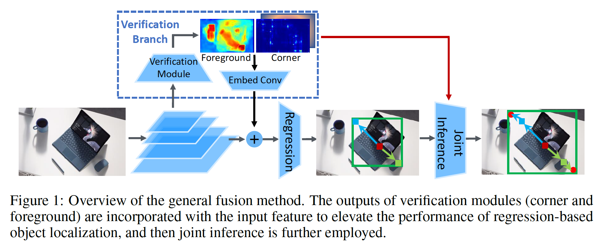

​		为了处理解决这个问题，我们提出通过辅助分支建模验证任务，这个辅助分支以不影响中间表示的方式与主要回归分支融合，如图1所示。融合仅在特征层和结果层发生。利用辅助分支，检测器可以获得几种好处：

​		**Better features by multi-task learning**	辅助验证任务在学习中提供更丰富的监督，产生增加检测准确率的更强特征，如表4所示。注意，这个多任务学习与Mask R-CNN[8]不同。在Mask R-CNN中，边界框目标检测受益于目标掩膜预测任务，但是它需要额外的目标掩膜标注。相比之下，我们的附加任务仅从边界框标注中自动生成，运行它们用于仅边界框标注可用的场景。

​		**Feature enhancement for better regression**	验证输出包括有关焦点位置和前景区域的强壮线索，这将有利于回归任务。因为这些验证任务的预测输出每个FPN层中使用的特征图的分辨率相同，我们通过在原始要素图上与从一个$1\times1$卷积层的验证输出中生成的嵌入特征图相加（plus）而直接将它们融合在一起。嵌入旨在将任意验证输出映射到与原始特征图相同的维度，并在特征图层之间共享。注意，对于验证输出，将从反向传播分离的副本输入到嵌入卷积层中，以避免影响该验证任务的学习。

​		**Joint inference by both methodologies**	特征级融合隐式地帮助目标定位。我们还显式地利用角点预测的验证输出以及基于回归的定位方法，这在利用两者的优势的联合推理方法中完成。 具体而言，通过角点验证，小邻域中的亚像素角点定位通常比主回归分支更准确，但由于它缺少目标的完整图片，因此在判断其是否为真实角点时效果更差。相反，主回归分支对后者更好，而在精确的亚像素定位方面较差。为了结合它们的优势，我们通过如下方法精炼主回归分支预测的边界框的角点$\mathbf{p}_t$：

$$\mbox{refine}(\mathbf{p}^t) = \arg\max_{\{\mathbf{q}^t | \Vert\mathbf{q}^t - \mathbf{p}^t\Vert \le r\}}s(\mathbf{q}^t),\tag{2}$$

其中$t$表示角点类型（左上角或有效角）；$\mathbf{q}^t$为特征图为的角点预测分支产生亚像素角点；$s(\mathbf{q}^t)$为验证得分；$t$为领域阈值，默认情况下设置为1。注意，此结果级别融合仅设计用于角点验证任务。

​		这种融合方法是灵活通用的，利用任何种类的验证线索，因为它避免与主分支中的中间表示的交互，因此对验证目标的类型几乎没有要求。它没有干扰主分支的整体流程，并极大位置构建主分支上原始检测器的便利。

#### 3.4	RepPoints v2: Fusing Verification into RepPoints

​		RepPoints是纯基于回归的目标检测器。现在，我们利用不同形式的验证分支补充它，特别针对角和within-box中的前景。为了提高RepPoints与辅助验证任务的兼容性，我们首先对其作出小型修改，使得RepPoints的前两个点显示地表示左上角和右下角点。我们称这为_explicit-corners_变体。这些角点替换原始RepPoints中使用的转换函数，使得通过这两个角点定义边界框，而不是通过点集上的_min-max_或_momentum操作_。利用角点，转换函数变为：

$$\mathcal{T(R)}=\Big(\frac{x_1+x_2}{2}, \frac{y_1+y_2}{2}, x_2 - x_1, y_2 -y_1\Big).\tag{3}$$

其中四个数值分别表示$x$-center、$y$-center、宽度和高度。为了RepPoints的_explicit-corners_变体，我们为验证添加辅助副分支。具体而言，我们以定位头部的第3个卷积层之后的特征图为输入，以重用现有的头部以节省计算量。如图2所示，将一个$3 \times 3$卷积层用于这个特征图，接着是两个用于验证任务的小型子网络。角点子网络包含角池化层，接着是预测热图得分和亚像素偏移的$1 \times 1$卷积层。在训练中，我们采用多任务损失：

$$L = L_{\mbox{RepPoints}} + \lambda_1 L_{\mbox{corner}} + \lambda_2 L_{\mbox{foreground}}, \tag{4}$$

其中$\lambda_1 = 0.25$，$\lambda_2 = 0.1$。更多细节见附录A。

​		自定义第3.3节的通用融合方法到RepPoints，我们将角点验证用于多任务学习、特征增强和联合推理。相反，前景验证仅用于多任务学习和特征增强。 生成的检测器称为RepPointsV2。

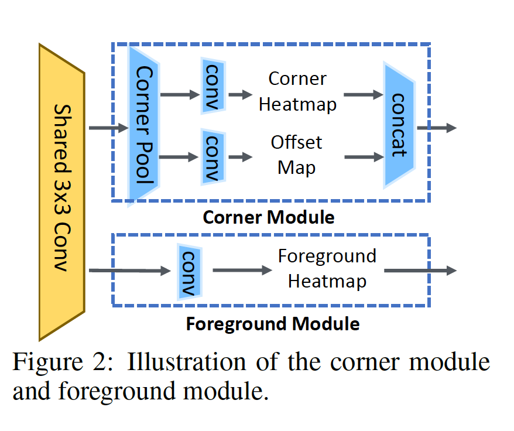

#### 3.5	Extension to Other Detectors and Problems

​		用于RepPoints的融合方法可以改善其他检测器，例如FCOS[27]。因为FCOS与RepPoints有相似的分类和定位头部，所以RepPointsV2的融合可以直接用于它。具体来说，将角和前景验证用于第3个卷积层后的特征图。将验证输出图融合到主分支，并且通过3.3节中描述的联合推理获得最终的回归结果。

​		融合方法也可以扩展到其他任务，例如通过基于回归的方法Dense RepPoints [31]进行实例分割。因为存在额外的目标掩膜标注，可以使用更细粒度的验证形式，例如目标轮廓验证和类感知的语义分割。如表8所示，在COCO test-dev集上，额外的验证方法给Dense RepPoints带来1.3的mask AP增加。

### 4	实验

​		我们在MS COCO2017基准测试上进行实验，其将数据分别划分为115K图像的训练集、5K图像的验证集和20K图像的测试开发集。我们使用训练集训练所有模型，并在验证集上进行消融研究。与其方法的系统级比较实用测试开发集。

#### 4.1	实验细节

​		我们使用mmdetection代码库进行实验。所有实验利用SGD在8个GPU上进行训练，每个GPU有两张图像，初始学习率为0.01，权重衰减为0.0001，动量为0.9。在消融实验中，大多数实验遵循1倍的设置，其中使用$[800, 1333]$的单尺度训练12个周期，学习率在周期8和11后衰减10倍。大多数消融实验使用ImageNet上与训练的ResNet-50骨干。我们还在更强的骨干上使用多尺度$[480,960]$以及更长训练（总共24个周期的2倍设置，学习率在16和22周期时衰减）以了解所提出的方法所获得的收益是否在这些更强的基线上保持不变。

​		在推理时，除非特别指出，我们采用与单尺度训练有相同图像大小的单尺度测试。我们在最强骨干上还进行了多尺度测试，从而与先前的方法进行比较。使用0.6的IoU阈值的NMS来删除重复边界框。

​		对于RepPoints，我们使用一种改进的实现，将IoU分配器替换为ATSS分配器，在COCO验证集上，使用ResNet-50模型和1倍设置，产生39.1mAP，比最初论文报告的结果高0.9mAP。

#### 4.2	消融研究

​		**Explicit-corners variant**	我们首先验证3.4节中描述的RepPoints的_explicit-corners_变体的有效性，如表2所示。该变体的性能与原始RepPoint中使用的三个变体的性能相当，但是添加验证模块后，其变体的性能比其他变体高0.2-0.3 mAP。在此显式角变体中，这可能有助于验证和回归任务之间更有效的交互。

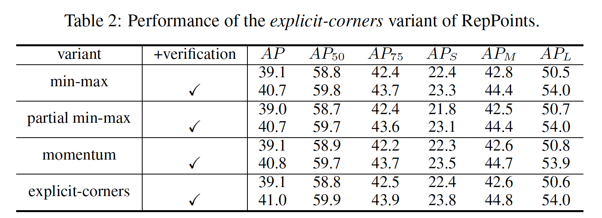

​		**Forms of verification**	单独的角验证任务给RepPoints基线带来1.4mAP。这种好处主要针对更高IoU的标准，即$\mbox{AP}_{90}$提高4.0mAP，而$\mbox{AP}_{50}$仅增加0.2mAP。额外的前景验证带来另外0.5mAP的增益，但是主要是在较低IoU标准上，例如$\mbox{AP}_{50}$增加0.9AP，而$\mbox{AP}_{90}$仍大概相同。

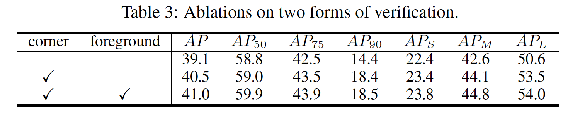

​		**Types of fusion**	表4消融分析融合的类型，特别是多任务学习，用于回归的功能增强和联合推理。 多任务学习使RepPoints基准提高了0.4 mAP。注意，与Mask R-CNN相比，多任务学习不依赖超越边界框的标注。额外的特征增强操作带来另外0.7mAP。通过联合推理进行的显式融合使mAP增加了0.8，从而使完整方法比没有验证模块的同类方法提高了1.9 mAP。

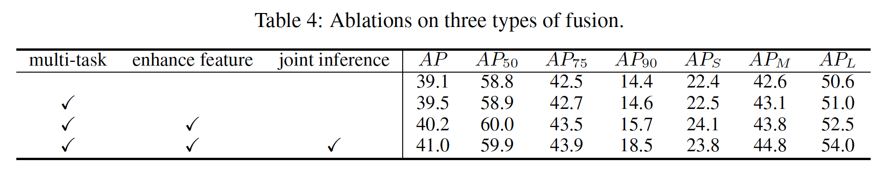

​		**复杂性分析**	我们的方法的参数比原始RepPoints略多（38.3M vs 37.0M），计算量略为增加（244.2G vs 211.0G）。这个开销主要发生在产生验证得分/偏移图的附加头部。我们还通过在头部上再增加一个卷积层来进行RepPoints的计算，从而获得与我们的方法（38M / 235.8G与38.3M / 244.2G）相似的参数和计算结果。增强的极限模型比朴素的RepPoints好0.2mAP，表明这种改进不主要源自更多参数和计算。

​		**更强的极限**	我们使用更长/多尺度训练（2倍设置）和更强的骨干，在更强的RepPoints基线上验证我们的模型，如表5所示。可以看出，在这些更强的RepPoints基线上，增益得到很好的保持，即大约为2.0mAP。这表明，与许多技术相比，相对于更强的基准而言，所显示的收益有所减少，因此，所提出的方法在很大程度上是对改进的基准架构的补充。

​	**可视化**	可视化结果见附录C。

#### 4.3	与最佳方法的比较

​		在COCO2017 test-dev集上，我们将所提出的方法与其他最先进目标检测进行比较，如表6所示。在回归分支中，我们使用GIoU损失而不是Smooth L1损失。以ResNet-101作为骨干，我们的方法获得46.0mAP。使用更强的ResNeXt-101[29]和DCN[3]模型，准确率上升到49.4mAP。利用如[32]中的额外的多尺度测试，所提出的方法获得52.1mAP。

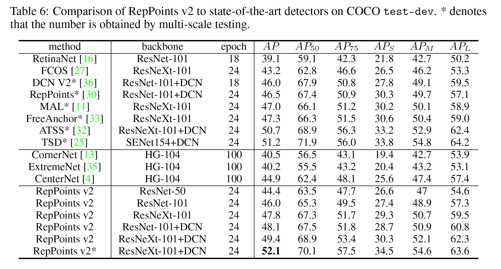

#### 4.4	扩展到其他检测器和应用

​		**Direct application to FCOS**	

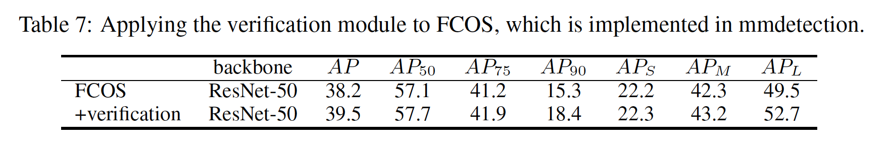

​		**Extension to instance segmentation**

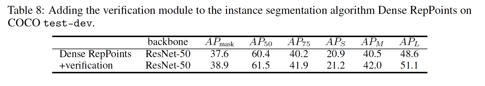

### A. Details  of Verification Tasks

#### A.1	Corner Point Verification

​		**Ground-truth assignment**	我们遵循CornerNet来分配ground-truth角。对于每个角，仅角点本身为正类位置，而所有其他位置为负类。此外，减少在正位置的半径内给予负位置的惩罚。具体而言，对于给定原始图像上的角点$p = (p_x,p_y)$，$s\times$下采样后的ground-truth热图$Y$的大小为$\frac{H}{s} \times \frac{W}{s}$，$p$在$Y$上对应的位置为$\hat{p} = \lfloor\frac{p}{s}\rfloor$。负位置的惩罚权重定义为inverse Gaussian function：

$$Y_{xy} = \exp\Big(-\frac{(x-\hat{p}_x)^2 + (y - \hat{p}_y)^2}{2\sigma_p^2}\Big) \tag{5}$$

其中$\sigma_p$为目标大小自适应的标准差，$x$和$y$表示负类点的位置。注意，对于不同正类点，负类点的惩罚权重可能不同。因此，最大的一个作为负类点的惩罚权重。

​		对于额外的偏移预测，我们遵循[13]（CornerNet），其仅监督正类位置。对于给定的角点$p$以及其对应的下采样位置$\hat{p}$，训练目标为：

$$o(\hat{p}) = \big(\frac{p_x}{s} - \lfloor\frac{p_x}{s}\rfloor, \frac{p_y}{s} - \lfloor\frac{p_y}{s}\rfloor\big) \tag{6}$$

​		**损失**	遵循CornerNet[13]，我们使用修改的Focal Loss[16]来学习角热图。损失定义为

$$L_{\mbox{heatmap}} = \frac{-1}{N}\sum_{i=1}^H\sum_{j=1}^W\begin{cases}(1 - p_{ij})^\alpha\log(p_{ij}) &\mbox{ if } y_{ij}=1 \\(1-y_{ij})^\beta(p_{ij})^\alpha\log(1-p_{ij}) &\mbox{ otherwise}\end{cases} \tag{7}$$

其中$N$为图像中目标的数量，$p_{ij}$和$y_{ij}$为预测热图中位置$(i,j)$的得分和标签。遵循[13]，我们设置$\alpha=2$，$\beta=4$。

​		此外，学习偏移的损失定义为：

$$L_{\mbox{offset}} = \frac{1}{N}\sum_{k=1}^N \mbox{SmoothL1Loss}(o(\hat{p}_k), \hat{o}(\hat{p}_k))\tag{8}$$

其中$o$为ground-truth偏移，$\hat{o}$为预测偏移。最后，角分支的综合损失简单定义为$L_{\mbox{heatmap}}$和$L_{\mbox{offset}}$之和。

#### A.2	Within-box Foreground Verification

​		**Normalized focal loss**定义为：

$$\mathcal{L}_{fg} = \sum_{c=1}^C\sum_{i=1}^H\sum_{j=1}^W\begin{cases}\frac{-1}{N_W}w_{cij} \cdot \alpha(1-p_{cij})^\gamma\log(p_{cij}) &\mbox{ if } y_{cij} = 1\\\frac{-1}{N}(1-\alpha)(p_{cij})^\gamma\log(1-p_{cij}) &\mbox{otherwise}\end{cases}\tag{9}$$

其中$y_{cij}$为ground-truth前景热图上的值，$p_{cij}$为位置$(i,j)$上第$c$个类的得分，$w_{cij}$为标准化因子，其定义为：

$$w_{cij} = \begin{cases}\frac{1}{S_{cij}} &\mbox{ if } y_{cij} = 1 \\ 0 &\mbox{otherwise}\end{cases} \tag{10}$$

其中$S_{cij}$为位于$(i,j)$的目标的面积。如果相同类的多个目标位于相同位置，我们取尺寸最小的一个。$N_W$定义为$\sum_{c=1}^C\sum_{i=1}^H\sum_{j=1}^W w_{cij}$，为所有位置的归一化因子之和。$N$为正类点数。$\alpha$和$\gamma$分别设置为0.25和2。

#### A.3	Overall Loss

​		综合损失定义为：

$$L = L_{\mbox{RepPoints}} + \lambda_1 L_{\mbox{corner}} + \lambda_2 L_{fg} \tag{11}$$

其中$\lambda_1=0.25$，$\lambda_2=0.1$。

### B	扩展到实例分割

**训练设置**	我们基于Dense RepPoints[31]来验证我们的方法有效性，由于Dense RepPoints是最先进的基于回归的实例分割方法。因为轮廓点没有类型，仅使用一个热图预测所有轮廓点。其他参数、网络架构和训练细节与目标检测相同。

**联合推理**	仅需少量修改，联合推理也可以用于实例分割。对于预测的代表性点，如果它接近轮廓点，那么我们通过将相邻的轮廓点添加到集合来精炼预测的代表性点。更具体地说，如果轮廓热图中的代表点的得分大于0.5，那么将所有距离小于1的点中轮廓分数最高的点添加到集合中。

**实验结果**	结果见表9。使用ResNet-50骨干和$3\times$调度计划。通过添加验证模块，性能提高1.0mAP，进一步使用联合推理，提高0.3mAP。这表明我们的方法的灵活性。

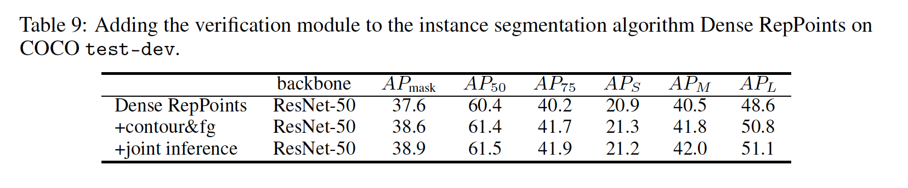

### C	可视化

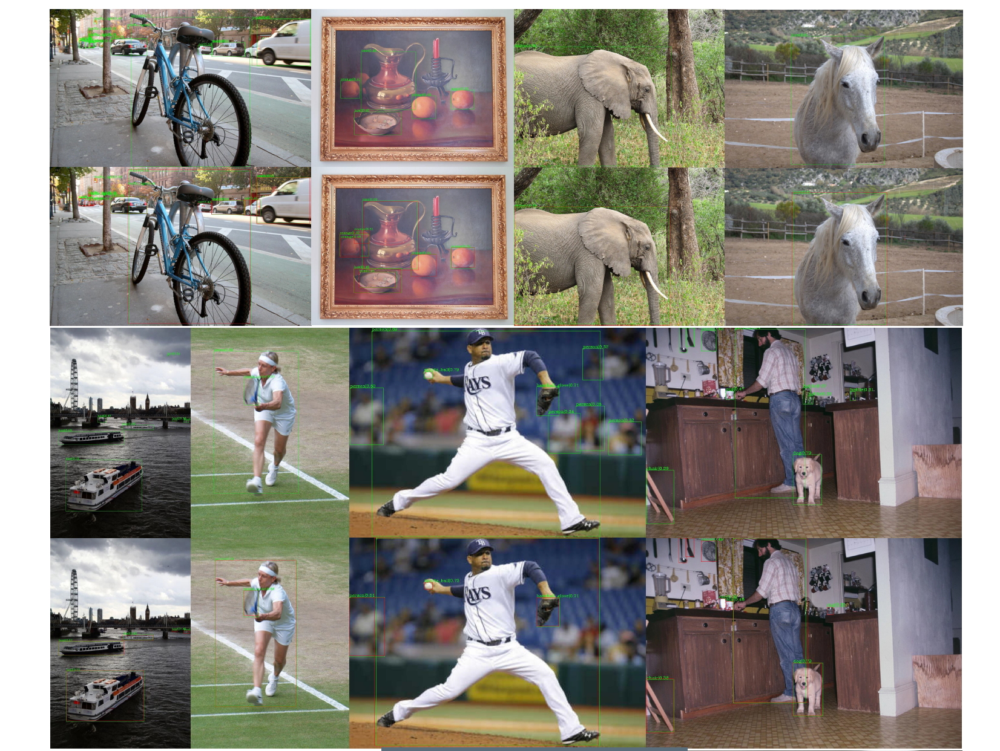

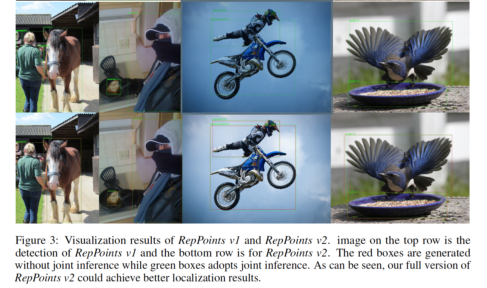

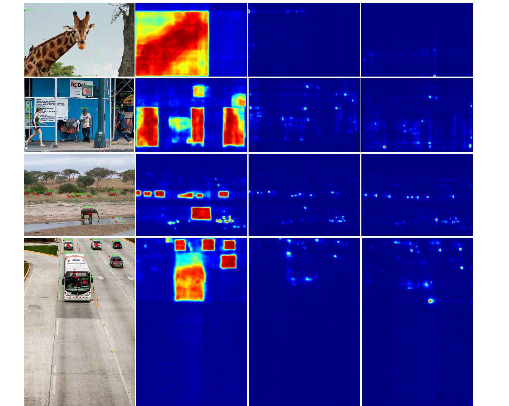

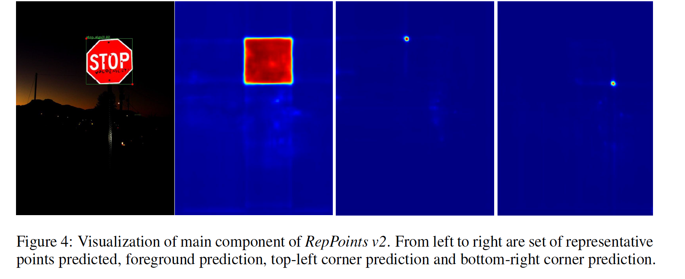

