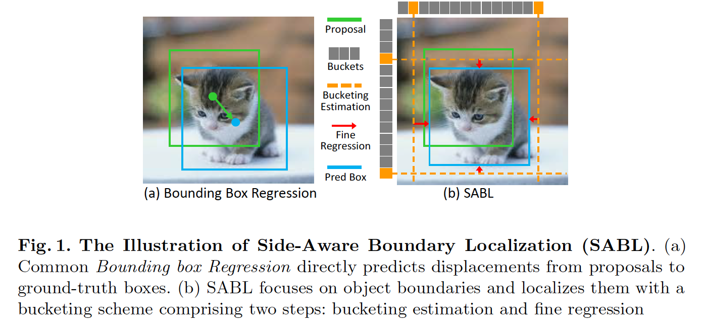
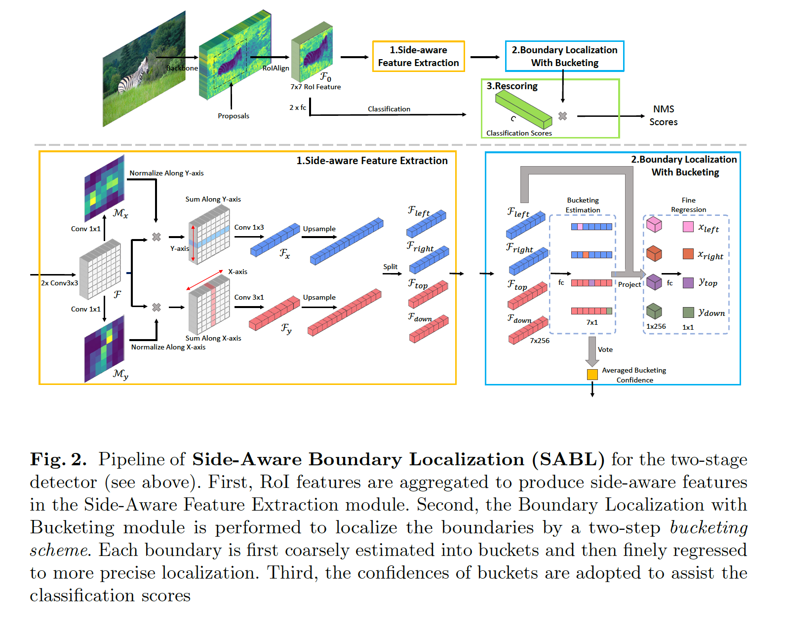

## Side-Aware Boundary Localization for More Precise Object Detection

### 摘要

​		当前的目标检测框架主要依赖边界框回归来定位目标。尽管今年来取得明显进步，但是边界框回归的准确率仍不令人满意，因此限制了目标检测的性能。我们观察到精确的定位要求仔细放置边界框的每一侧。但是，关注预测中心和大小的主流方法不是完成这个任务的有效方式，特别是当锚点和目标点之间存在较大差异的位移时。本文中，我们提出一种替代方法（称为**Side-Aware Boundary Localization（SABL）**），其中边界中的每条边分别利用专门的网络分支定位。为了解决在存在大方差的位移的情况下进行精确定位的难题，我们进一步提出了两步定位方案，该方案首先通过bucket预测来预测运动范围，然后在预测的bucker内精确定位。我们在两阶段和单阶段检测框架中测试所提出的方法。用所提出的设计替换标准边界框回归分支可以显着改善Faster R-CNN、RetinaNet和Cascade R-CNN，分别提高3.0％、1.7％和0.9％。代码见https://github.com/open-mmlab/mmdetection。

### 1	引言

​		目标检测新框架（例如Faster R-CNN、RetinaNet和Cascade R-CNN）的开发实质上推动最先进结果。尽管所有这些框架在技术设计上存在差异，但是有通用的组件，即用于目标定位的_边界框回归_。

​		一般而言，训练边界框回归来对齐相邻提议与目标对象。在常用设计中，边界回归分支基于RoI特征预测中心偏移$(\delta x,\delta y)$以及相关缩放倍数$(\delta w, \delta h)$。尽管在以前的工作中已经证明这种设计非常有效，但是当锚点和目标之间存在较大差异的位移时，仍然很难精确地预测对象的位置。这种难题也限制综合检测性能。

​		在最近几年，作出多种努力来改善定位准确率，例如级联定位过程[1、12、20、41]，以及将定位视为分割网格点[29]的过程。尽管在提升定位准确率方面有效，但是采用这些方法会使检测流水线复杂化，从而导致大量的计算开销。

​		在这项工作中，我们旨在探索一种新的对象定位方法，该方法可以有效地解决开销较低的精确定位问题。经验上，我们观察到，当我们手动标准一个对象的边界框时，将框的各边与对象边界对齐通常比在调整尺寸时整体移动框要容易得多。受这种观察的启发，我们提出一种新的设计，称为**Side-Aware Boundary Localization （SABL）**，其中边界框的每条边分别基于它周围的上下文定位。如图1所示，我们设计一种_bucketing_方案来提高定位精度。对于边界框的每条边，这种方案将目标空间划分为几个bucket，然后通过两个步骤确定边界框。具体而言，首先研究_correct_ bucket，即边界所在的那个bucket。利用选择的bucket的中心线作为粗糙估计，然后通过预测偏移进行精细回归。即使在存在较大差异的位移的情况下，该方案也可以实现非常精确的定位。此外，为了在非极大值抑制过程中保持精确的定位边界框，我们还提出基于bucket置信度调整分类得分，这产生进一步的性能增加。

​		我们在多种检测框架基础之上评价所提出的SABL，包括两阶段[37]、单阶段[25]和级联[1]检测器。通过利用所提出的设计替换已有的边界框回归，我们在COCO test-dev[26]上获得明显的改进，而不会造成高昂的计算成本，即Faster R-CNN为41.8% vs. 38.8% AP，而仅有大约增加10%的额外推理时间，RetinaNet为40.5% vs. 38.8%，没有增加额外推理时间。此外，将SABL进程到Cascade R-CNN，SABL在这个强基线上获得一致的性能增益，即43.3% vs. 42.4% AP。

### 2	相关工作

​		**目标检测**	目标检测是计算机视觉应用中的基础任务之一。最近几年见证目标检测的巨大进步。两阶段管道已成为这一领域的领导范式。第一阶段生成一组区域提议，然后第二阶段通过边界框回归分类和细化这些提议的坐标。这种设计在后来的两阶段方法中被广泛采用。与两阶段方法相比，单阶段检测流水线之间预测边界框。尽管省略了提议生成过程，但单阶段方法[25、28、49]要求由滑动窗口生成的密集分布的锚。最近，一些工作尝试使用无锚方法进行目标检测。直觉上，迭代地进行分类和回归过程可能有效地提高检测性能。因此，许多尝试将级联架构应用于迭代边界框以逐步改进。

​		**目标定位**	目标定位是目标检测中的关键和基本模块之一。目标定位的常用方法是回归边界框的中心坐标和大小。这种方法被广泛采用，而由于回归目标的较大方差，精确率不令人满意。为了更准确的定位，一些方法[1、20、41、31、47、3]直接多次重复边界框回归以进一步提高准确率。但是，如此级联的流水线话费更多计算开销。一些方法尝试重构目标定位过程。Grid R-CNN[29]采用网格定位机制来编码准确目标检测的更多线索。它将定位处理分割网格点的过程，其设计繁重的掩膜预测过程。CenterNet[51]结合分类和回归以定位目标中心。它在关键点热图上预测可能的目标中心，然后通过回归调整中心。3D目标检测[38]也采用相似的思想。但是，它们仍陷于传统的中心定位为和大小估计范式，并且定位准确仍不能令人满意。LocNet[12]预测目标边界或目标边界框内的位置的概率。但是，RoI特征的分辨率限制LocNet的性能，因为它需要将像素概率迁移到目标边界框。相反，我们的方法关注目标边界框的边界，并为bucket方案中的每条边界分解定位过程。我们还利用bucketing估计置信度来改进分类结果。在一次传递进行定位，SABL在两阶段和单阶段流水线上获得实质增益，同时维持它们的效率。

### 3	Side-Aware Boundary Localization

​		准确的目标定位是目标检测关键。大多数当前方法直接回归提议和ground-truth之间的归一化位移。但是，这种范式在一次传递中不可能提供令人满意的定位结果。一些方法[1、20、41]尝试利用级联流水线来改进定位性能，但在花费相当大的计算成本。因此，越来越需要轻量和有效的方法。

​		我们提出Side-Aware Boundary Localization（SABL）作为传统边界框回归的替代，以更准确地定位目标。如图2所示，它首先通过沿X轴和Y轴聚合RoI特征$\mathcal{F}$来提取水平和垂直特征$\mathcal{F}_x$和$\mathcal{F}_y$，然后将$\mathcal{F}_x$和$\mathcal{F}_y$分为边感知的特征$\mathcal{F}_{right}$、$\mathcal{F}_{top}$、$\mathcal{F}_{left}$和$\mathcal{F}_{down}$（3.1节）。然后，对于边界框的每条边，SABL首先将目标空间划分为多个bucket（如图1所示），并

​		