## Scale-Equalizing Pyramid Convolution for Object Detection

### 摘要

​		特征金字塔已成为提取不同尺度特征的有效方法。该方法的开发主要集中在聚合不同级别的上下文信息，而很少涉及特征金字塔中的层间关系。早期的计算机视觉方法通过在空间和尺度维度上定位特征极值来提取尺度不变特征。受此启发，这项研究中，提出跨越金字塔级别的卷积，其称为金字塔卷积，是一种改进的3-D卷积。堆叠的金字塔卷积直接提取3-D（尺度和空间）特征，并优于其他精心设计的特征融合目标。基于3-D卷积的视角，整个特征金字塔上收集统计量的集成批归一化自然地插入到金字塔卷积之后。此外，我们还证明朴素的金字塔卷积以及RetinaNet head的设计实际上最适用于从高斯金字塔中提取特征，而高斯金字塔的特性很难被特征金字塔所满足。为了缓解这种差异，我们构建scale-equalizing pyramid convolution（SEPC），其仅在高级特征图上对齐共享金字塔卷积核。SEPC模块具有高效的计算能力，并且与大多数单级目标检测器的头部设计兼容，SEPC在最先进的单级目标检测器带来了显着的性能提升（在MSCOCO2017数据集上增加了>4AP以上），轻量版本的SEPC也有大约3.5AP的增益，推理时间仅增加7％左右。金字塔卷积在两阶段目标检测器中还可以作为独立模块很好地发挥作用，并且能够得到大约2AP的性能改善。源码见 https://github.com/jshilong/SEPC。

### 1. 引言

​		一个物体在自然图像中可能以不同的尺度出现，但应该被认为是相同的。在自然图像中，尺度很容易变化1个数量级以上[33]，这在各种计算机视觉任务（例如目标检测）中是一项具有挑战性的任务。大量研究关注这一问题。多尺度训练[4]是通过让网络存储不同尺度的模式来直接解决尺度变化的方法。多尺度推理[27]与传统的图像金字塔方法[27]思想相同。然而，由于需要输入多个输入，图像金字塔方法非常耗时。CNN中不同阶段的固有特征金字塔[24]提供了图像金字塔的有效替代方案。下采样的卷积特征的每个级别对应于原始图像中的特定尺度。然而，特征金字塔的每两层之间存在语义差距。为了缓解这种差异，提出不同的特征融合策略，包括自上而下的信息流[19、7]、额外的自下而上的信息流路径[23、41、14]、多个沙漏结构[28、47]、拼接不同层的特征[18、36、10]、使用非局部注意力模块的特征精炼[29]、渐进的多阶段局部信息融合[45、35]。但是，特征融合的设计是直观的，方法是将特征图的大小调整为相同的分辨率后直接对其进行相加。特征金字塔的固有属性并没有得到探索，从而使所有特征图相等地做出贡献而没有区别。

​		在传统计算机视觉中已研究尺度空间理论数十年。通过检测金字塔中的尺度空间极值，提出了有效的特征点检测方法[22]。受此启发，我们提出通过在相同尺度维度的显示卷积捕获尺度间的交互，构成特征金字塔中的3-D卷积，成为金字塔卷积（pyramid convolution：PConv）。

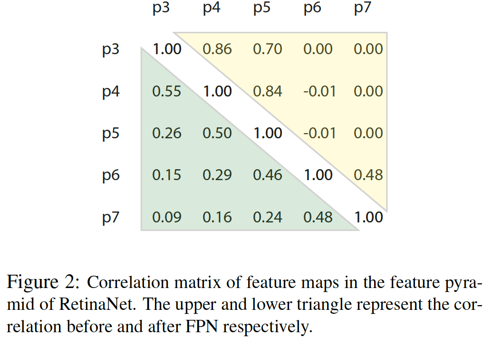

​		与直接相加所有特征图相比，尺度维度的卷积是自然选择。例如，特征金字塔上相邻尺度的特征图应当是最相关的，然而，其在先前的方法中被忽略。通过在特征提取网络（主干）（例如VGG [32]、ResNet [13]和ResNext [43]）的每个下采样操作之后提取中间输出来构建特征金字塔。图2展示了RetinaNet中从FPN之前和之后的主干提取的特征图之间的相关矩阵。 接近对角线的值大于远端的值。这类似于使用空间卷积来处理自然图像的先验，即图像上的相邻像素比远远距离对的关联更强。但是，在先前的特征融合设计[29、36]不能直接捕获这种属性。

​		此外，我们还证明RetinaNet的头部设计是尺度核为1的PConv的特例，并且其最适合用于从高斯金字塔上提取特征。**高斯金字塔是通过使用高斯核对图像进行连续模糊处理，然后进行二次采样而生成的。高斯模糊的核大小应与下采样率成正比，以便在下采样期间消除高频噪声，而其大小又不足以消除很多细节。在高斯金字塔上进行PConv有助于提取尺度不变特征。**

​		但是，由深层骨干网络构建的特征金字塔通常离高斯金字塔很远。**第一，两个特征金字塔层之间的多个卷积层造就了更大的有效高斯核；第二，由于诸如ReLU之类的非线性运算在获取下一个金字塔特征时，有效高斯核的理论值应因像素而异。**因此，我们探索了通过设计尺度均衡模块来缓解这两个差异的可能性。使用可变性卷积[5]的思想，底部金字塔的内核大小是固定的，并且随着共享核在尺度维度上的扩展而变形。现在，对PConv的这种修改使它能够在卷积更高层时，通过对齐其卷积核来均衡不同的金字塔等级（尺度），因此被称为尺度均衡金字塔卷积（scale-equalizing pyramid convolution：SEPC）。它可以显示为从特征金字塔中提取尺度不变特征，并且由于可变形卷积核仅应用于高级特征，因此只会带来适度的计算成本增加。配备SEPC模块，各种模型的检测性能均得到提高。例如，在最先进的单级检测器中，例如FreeAnchor [46]、FSAF [48]、Reppoints [44]和FCOS [38]，SEPC模块的增加高达4.3AP，比大多数两级检测器好。SEPC的轻量版（SEPC-lite）还可以到达大约3.5AP的性能增加，而计算成本上仅有大约7%的增加。

​		这项研究主要贡献如下：

​		（1）我们提出轻量的金字塔卷积（PConv），以在特征金字塔内部进行3-D卷积，从而满足尺度间的相关性。

​		（2）我们开发尺度均衡特征金字塔（scale-equalizing pyramid convolution：SEPC），以通过仅在高级特征图上对齐共享的PConv核来缓解特征金字塔和高斯金字塔之间的差异。

​		（3）该模块以可忽略的推理速度提高了性能（在最先进的单阶段目标检测器上提高了3.5AP）。

### 2. 相关工作

#### 2.1. 目标检测

​		现代目标检测架构通常划分为两阶段方法和一阶段方法。两阶段检测的代表性工作（例如SPP[12]、Fast R-CNN、Faster RCNN）首先提取区域提议，然后将它们中的每一分类。在两阶段检测器中，尺度变化问题有所缓解，其中在ROI池化过程中，将不同大小的目标重新缩放为相同的大小。一方面，单阶段目标检测直接利用卷积的内在滑动窗口特征来构建特征金字塔，并基于每个像素直接预测目标。尽管单阶段检测器由于其快速的推理而在实时任务中获得了优势，但在性能方面却一直落后于两阶段检测器。RetinaNet[20]是里程碑式的单阶段检测器，因为它通过采用focal loss和新设计的检测头部提升检测性能。接下来的工作通过将目标检测视为关键点定位任务，从而进一步加速了模型并同时提高了其性能，从而消除了每个特征图上对多个锚的依赖[44、38]。但是FPN和头部的设计仍与RetinaNet相同。

#### 2.2. 特征融合

​		在深度网络中，低级特征通常被认为缺乏语义信息，但是在保留几何细节细节方面，这与高级特征相反。因此，特征融合在结合语义和几何信息方面起着关键作用。几种骨干结构（例如Inception网络[37]和ScaleNet [17]）具有融合来自不同尺度的信息的设计。FPN [19]及其衍生作品在检测小物体时会利用高级特征图。后续工作进一步从不同方面提高特征融合效率。如图4所示，PA-Net [23]直接为低级特征图创建一条短路径，因为检测大目标还需要位置敏感的特征图的帮助。遵循相同的哲理，[28、47]也提出了多个双向信息融合路径。除了直接求和的常规方法外，其他一些方法还采用级联将所有特征图投影到公共空间，然后进行反向分布。Pang等[29] 通过添加非局部块来微调组合的特征图，进一步提高了特征扩散的水平。

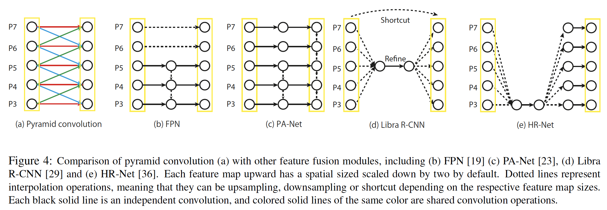

#### 2.3. Cross-scale correlation

​		在传统和最近的研究中，还有其他几种考虑跨尺度相关性的方法。跨尺度差异以近似SIFT中的拉普拉斯算子[25]的形式计算，从而提取尺度不变特征。Worral & Welling[42]还使用膨胀卷积将分组卷积扩展到深度神经网络。Wang等[40] 将所有特征图转移到与最大尺度的特征图相同的大小后，融合具有相邻尺度的特征图以捕获尺度间相关性。在这些工作中，要么需要对输入图像的不同变换进行重复计算[42]，要么在高分辨率特征图上进行尺度相关[40]，这两者都会导致计算资源的增加。在这项研究中，在跨不同尺度进行卷积时，维持特征图的金字塔结构，这在计算更有效率。实际上，RetinaNet及其后续模型的头部结构的原始设计还可以视为尺度核为1的PConv。因此，我们的PConv的设计与最佳的单阶段检测器兼容，并且有着最小的计算成本增加。

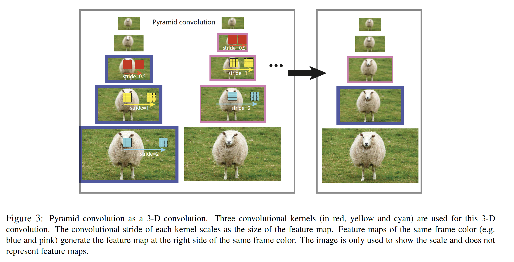

### 3. 金字塔卷积

​		金字塔卷积（PConv）是跨越尺度和空间维度的3-D卷积。如果我们将每层中特征表示图4a中圆点，PConv可以表示为$N$个不同的2-D卷积核。然而，如图3所示，不同金字塔层存在尺寸不匹配问题。随着金字塔级别的提高，空间大小将随尺度缩小。为了解决不匹配问题，我们在卷积不同层时为$K$个不同的核设置了不同的步长。例如，对于$N=3$的PConv，第一个核的步长应当为2，而最后一个的步长应当为0.5。然后，PConv的输出为

$$y^l = w_1 \ast_{s0.5} x^{l+1} + w_0 \ast x^l + w_{-1}\ast_{s2}x^{l-1},\tag{1}$$

其中$l$表示金字塔层，$w_1$、$w_0$ 和 $w_{-1}$为三个独立的2-D卷积核，$x$为输出特征图，$\ast_{s2}$表示步长为2的卷积。步长为0.5的卷积进一步替换为步长为1的标准卷积和一个连续的双线性上采样层。即，

$$y^l = \mbox{Upsample}(w_1 \ast x^{l+1}) + w_0 \ast x^l + w_{-1}\ast_{s2} x^{l-1} \tag{2}$$

与传统的卷积相似，PConv也使用零填充。至于底部的金字塔层（$l=1$），式（2）的最后一项式不必要的，而对于最高层（$l=L$），忽略第一项。尽管每层中有三个卷积操作，PConv的全部FLOPs实际上仅为原始头部的1.5倍（见附录1）。

#### 3.1. Pipeline

​		除了提取尺度相关的特征外，PConv还得益于与RetinaNet及其后代的头部设计的兼容性。正如图5a所示，RetinaNet实际上还是尺度核为1的PConv。因此，这四个卷积头部可以直接替换为尺度核为3的PConv模块。堆叠的PConv与3-D深度网络中的堆叠的卷积模块相呼应[39]，以便在不增加计算负担的情况下逐渐增加相关距离。

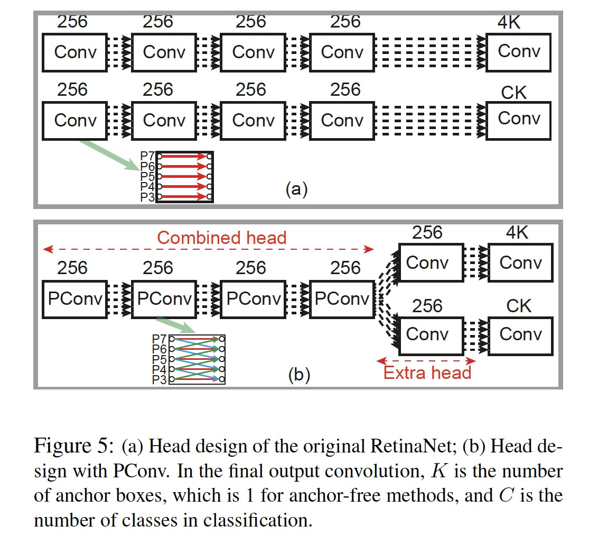

​		然而，每个PConv仍带来一些额外计算。作为替代，分类和定位分支贡献4个PConv模块，构成如图5b所示的组合头部结构。为了满足分类和定位任务的差异，在共享的4个PConv模块之后还添加了一个额外的常规卷积。可以计算出，这种设计的FLOP比原始RetinaNet头部还要少（请参阅附录1）。

#### 3.2.  Integrated batch normalization（BN） in the head

​		在这项研究中，我们调查了检测头部BN的使用。共享的BN在PConv模块之后，并收集特征金字塔内部所有特征图的统计量，而不是单层的统计量。当我们将PConv视为3-D卷积时，这种设计自然而然地出现了。因为在金字塔内部收集所有特征图的统计量，所以方差更小，特别是具有较小特征图大小的高级特征图。这使我们即使在小批量大小（约为4）中也能在训练头部中的BN，并获得更好的性能。

### 4. Scale-equalizing pyramid convolution

​		在金字塔卷积设计中，我们使用了朴素的实现。即使特征图的尺寸缩小，当核沿尺度维度进行步长操作时，PConv中使用的每个2-D卷积的核尺寸也会保持恒定。当在高斯金字塔（高斯金字塔是通过连续高斯模糊图像然后进行下采样来构建的）上执行PConv时，这是合理的，因为

**Remark 1	金字塔卷积能够在高斯金字塔上提取尺度不变的特征。**

详细的数学证明见附录3。它直观地展示在图6a中。当$N=1$的PConv从金字塔上提取特征时，通过不同层的相同核可以捕获不同尺度的目标。此外，高斯模糊在生成金字塔时也是必要的，以避免在提取下采样图像中的特征时产生高频噪声。另一方面，太强的模糊会掩盖细节。**高斯金字塔中的最佳模糊核大约在两个金字塔等级之间的下采样比的大小**。

​		在PConv的普通实现和RetinaNet头部设计中，这样的方式直接用于处理特征金字塔。但是，**特征金字塔很难满足最佳模糊核**。图6b中，我们看到，高级特征中的特征图模糊效果比图像金字塔中的模糊效果严重得多。这是由于特征金字塔中两个特征图之间的主干中存在许多卷积和非线性运算。

​		为了折衷更强的模糊效果并提取尺度不变特征，一些研究提倡使用膨胀卷积[42]。即，随着PConv模块在规模维度上的步长操作，核也应大于最底层特征中使用的核。但是，由于骨干中的非线性操作，不同像素的膨胀率也不相同，使其难以直接使用常量的膨胀率。

​		相反，**我们借鉴了可变形卷积的思想，以直接预测卷积核的偏移量，因为共享核在尺度维度上向上扩展**。如图6b所示，底部特征图卷积的核被固定为正常的 $3\times3$ 卷积。因为它处理特征金字塔中的高级特征图，所以基于特征图的当前层预测变形偏移。以这种方式，每个金字塔层（尺度）中的特征通过变形偏移均衡，并准备好通过共享的PConv核进行卷积。因此，它称为scale-equalizing pyramid convolution（SEPC）。PConv和SEPC的伪代码见附录2。

​		SEPC有多个好处。1）由于其具有可变形卷积核的扩张能力，因此考虑了两层特征金字塔之间较大的模糊效果；2）特征金字塔与高斯金字塔的差异得到缓解；3）由于卷积的计算成本从一层降低到其较高的特征金字塔级别减少了4倍，因此仅将可变形卷积添加到高级特征图会导致最少的计算。在本研究中，我们研究了图5b中将SEPC应用于组合头和额外头的SEPC-full的效果，以及仅将SEPC应用于头的SEPC-lite的效果。

### 5. 实验

​		这项研究中的实验在80个类的MS-COCO2017检测数据上进行。训练集包含大约118k张图像，验证集包含5k张图像（minival）。默认在minival上报告检测度量。还报告这项研究中几个模型才test-dev上的结果。与实验设置相关的更多细节见附录4。

#### 5.1. 单阶段目标检测器

​		本研究中的单阶段目标检测器大多是最新的和最先进的模型，使用基于锚的方法（例如RetinaNet[20]和FreeAnchor [46]）或使用无锚的方法（例如FSAF [48]和Reppoints[44]） 。所提出的SEPC和它们原始基线之间的结果见表1。发现SEPC-full可以将性能提高4AP以上，但由于涉及可变形操作，因此会导致不必要的推理时间增加。每个网络中SEPC-lite的改进也非常可观，增加了3.1 3.8AP，仅增加了7％的延迟。在更多检测上的SEPC-lite的直接比较，如图1所示。值得注意的是，我们自己实现的FSAF基线（见附录6）获得36.9AP，比原始的结果高1.1AP。通过SEPC-lite将FSAF的性能进一步提高到40.9，其甚至比Cascade 和 Deformable Faster-RCNN高0.5AP，同时快了20%。FreeAnchor（最好的单级检测器之一）上的SEPC-lite的改进也令人惊讶，使其达到41.7，并且无痛地将现有技术提高了3.2。

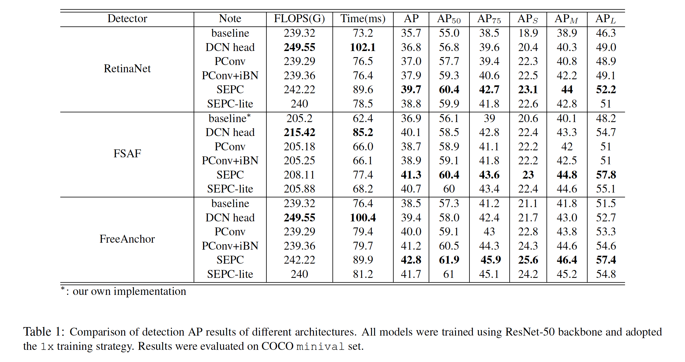

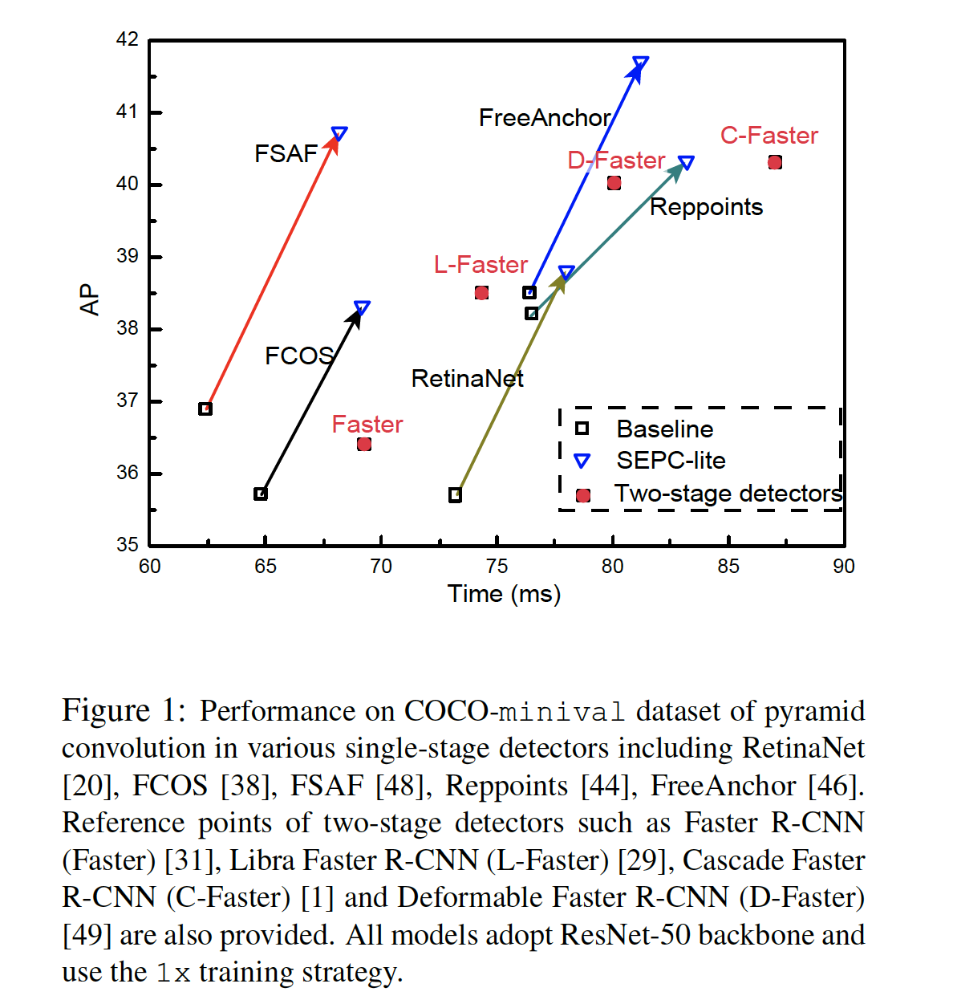

##### 5.1.1 消融研究

##### 5.1.2 每个组件的影响

​		用PConv替换头部中的正常卷积会在各种模型中带来1.5AP的增长。对于PConv的速度，PConv的全部FLOPs实际上少于原始头部，由于涉及更多的卷积核，延迟仍增加大约3%。

​		在头部插入integrated BN（iBN）为不同架构带来0.2～1.2AP的收益。在训练检测网络时，几项其他研究倡导使用组归一化（GN）。但是，GN中缺少的BN的一个特性是，在进行推理时，BN不需要计算现场统计信息，并且可以在以前的卷积层中合并。正如iBN的相同前向延迟所揭示的那样，这在推断速度上带来了显着优势。性能的提高是BN更快的优化和更好的泛化的自然结果。 （见附录5）

​		对于尺度均衡模块的影响，我们还比较SEPC和PConv+iBN的结果，并发现明显的改进（增肌1.6～2.5AP），这表明尺度均衡模块可以帮助对其不同层的特征，并可以在各种目标检测器中正常运行。

##### 5.1.3 与DCN头部的比较

​		如果将RetinaNet类模型（RetinaNet、FSAF、FCOS、FreeAnchor等）的原始头部中的所有卷积替换为可变性卷积核（DCN），AP得到不同增加。见表1。

##### 5.1.4 头部中不同BN实现的比较

​		在处理特征金字塔时，有不同的BN实现，如图7a所示。每个BN模块后的输出为$y=\gamma\frac{x-\mu}{\sigma} + \beta$，其中$\gamma$和$\beta$为参数，$\mu$和$\sigma$为归一化的批统计量。单个BN在每个特征金字塔层之后添加一个BN模块，并在整个金字塔中使用共享参数$\gamma$和$\beta$。但是，训练期间，每个特征图在其自身上收集统计量。Independent BN在特征层中使BN的参数和统计信息独占其自身，并在[8]中使用。Integrated BN（如3.2节所讨论）在特征金字塔网络的所有特征图上收集批统计量。

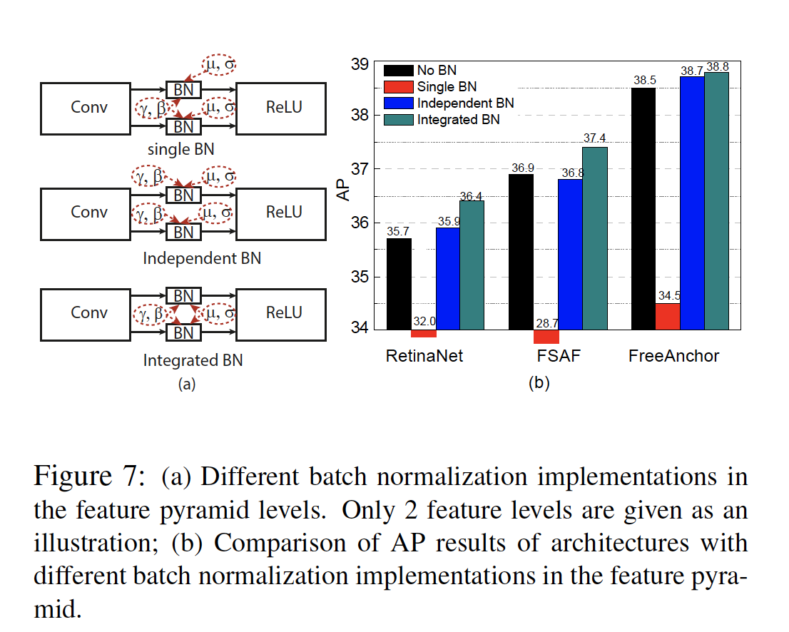

​		这四个BN设计的影响见图7。由于共享参数和非共享统计信息之间的不匹配，仅使用单个BN会导致检测器性能的灾难性下降。Integrated BN和independent BN都增加AP，而由于integrated BN训练期间更稳定的统计量，integrated BN比independent BN好。

##### 5.1.5 与其他特征融合模块的比较

​		关于不同的特征融合方法，表2展示了我们将PConv与FreeAnchor上其他最新的特征融合模块进行的比较。与常用的特征金字塔网络（包括NAS-FPN和Libra）相比，PConv明显能提供更剧烈的性能增加。此外，在特征融合模块中，设计的PConv堆叠栈头还获得了最小的FLOP增加。本节的结果验证PConv在特征融合中的有效性。

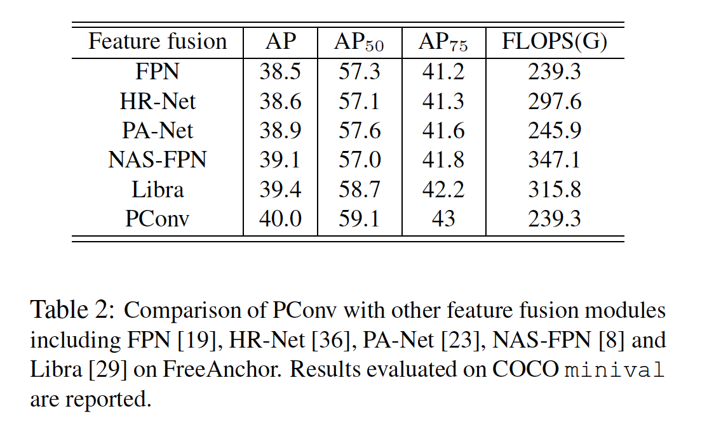

#### 5.2. 与最佳目标检测器的比较

​		本节中，在COCO2017基准测试数据集上，我们将我们的方法与其他最佳目标检测比较。除非另有说明，否则训练策略遵循640-800尺度抖动的2倍，并且结果仅以单个尺度获得。细节见附录4。我们仅报告FreeAnchor配备SEPC-lite和SEPC的实际潜在用途，因为SEPC会为诸如ResNext-101之类的大型骨干网带来无形的计算成本。可以看出，SEPC使用ResNext-101骨干大大提高了原始基线，并达到了最新水平的47.7AP，而没有花里胡哨的操作下（例如，多尺度测试、同步BN、可变形骨干），超过了甚至大多数具有可变形主干和多尺度测试的两阶段检测器。如果使用DCN骨干和更强的训练尺度扰动（480-960），AP性能达到50.1，这是在具有单尺度测试的单阶段模型上报告的最佳检测结果。

#### 5.3. 扩展到两阶段目标检测器

​		我们还介绍了PConv（不带尺度均衡模块）在将其应用于两阶段目标检测器时仍然可以有效。如表4所示，PConv在不同的两阶段检测器上显着改善了AP。PConv为Mask-RCNN提供最多的AP增加，从而将AP提高2.3。

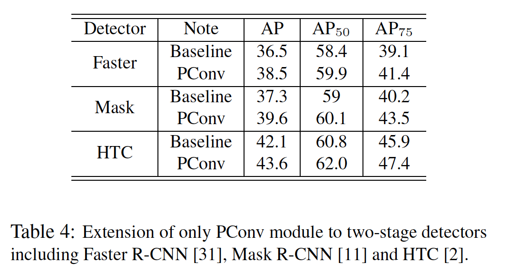

### 6. 总结

​		在这项研究中，我们探索通过金字塔卷积（PConv）考虑尺度间相关性，该金字塔卷积在特征金字塔的尺度和空间维度上都进行了3-D卷积。在空间和尺度维度上的PConv的步长模式与传统的步长模式不同。**第一，由于金字塔中不同的空间尺寸，PConv核的空间切片的步长与金字塔层的卷积特征图大小成正比。PConv核的这种类似的步长模式有助于对齐相邻特征图的空间位置，因为它们涉及到一个PConv中。第二，当PConv在尺度维度上增加步长时，核也应调整其空间变形，这又称为尺度平衡的金字塔卷积（SEPC）。实际上，具有固定空间核大小的普通步长模式最适合用于提取高斯金字塔中的特征，该高斯金字塔与深度网络生成的特征金字塔相去甚远。SEPC有助于缓解这种差异并提取出更强大的特征。 SEPC权重轻且与大多数目标探测器兼容，因此能够以最小的计算成本增加来显着提高检测性能。

### 附录1.  头部中的FLOPs

​		所有的模型的输入图像大小为$3 \times 1280 \times 1280$。我们mmdetection[1]中标准卷积的FLOPs计算，其中一个乘法-加法对计算一次。产生

$$\mbox{FLOPs} = C_{in} \times K_h \times K_w \times H \times W \times C_{out}, \tag{1}$$

这针对单个卷积操作，其中$C_{in}$和$C_{out}$是卷积的输入和输出通道数，在这项研究中将所有通道固定为256，$K_h$和$K_w$是卷积核尺寸，设置为3，$H$和$W$是特征图的宽和高。

​		PConv通过步长为0.5（对于上层）和2（对于下层）的3-D卷积将相邻层的特征融合到工作层。对于步长为0.5的卷积，我们通过执行步长为1的常规卷积集上采样操作来实现，这可以表示为：

$$y^l = \mbox{Upsample}(w_1 \ast x^{l+1}) + w_0 \ast x^l + w_{-1}\ast_{s2} x^{l-1}, \tag{2}$$

其中$x^l$为层$l$的特征图，$w_1,w_0,w_{-1}$为独立的卷积核。因为$x^{l+1}$的特征图大小是$x^l$的一半，而$x^{l-1}$的大小是$x^l$的两倍，式（2）中第一项的的计算成本是第二项的四分之一，而最后两项的计算成本相同。注意，在最上的层（P7），消除第一项；在最底部的层（P3），消除最后一项。我们简化了上采样操作的分析，因为与该位置的卷积相比，其成本相对较小。因此，将PConv与特征变量金字塔中的原始卷积进行比较后，自上而下的FLOPs比例$c_i$为的2、2.25、2.25、2.25、1.25。此外，与每层关联的FLOPs与$H \times W$成正比。每个特征图的空间尺寸和全部空间尺寸之比可以表示为$r_i =\frac{H_i \times W_i}{\sum_{j=3}^7 H_j \times W_j}$。这些比例的数值按自上而下的顺序计算为：0.0029、0.0117、0.0469、0.1877、0.7507。因此，使用4个堆叠的PConv的全部计算量为常规设置中使用4个堆叠卷积的$C = \sum_{i=3}^u c_i \times r_i = 1.4985$倍。

​		当分类和回归子集使用每一个子集具有一个额外的非组合子集组合的PConv结构时，总计算量为使用默认头部设计的$\frac{(4×C + 2×1)}{2×4×1} = 0.99925$倍。

​		当使用SEPC或SEPC-Lite时，我们讨论如何计算deformable conv的FLOPs。可变形卷积的一个前馈包括一个普通卷积，该卷积具有$2 \times K_h \times K_w$的输出通道用于偏移量预测，每个采样点的双线性插值（涉及8个乘法和7个加法），以及另一个普通卷积。因此，我们有：

$$FLOPS \approx (1 + \frac{8 + 2 \times K_h \times K_w}{C_{out}}) \times C_{in} \times K_h \times K_w \times H \times W \times C_{out}$$

​		在SEPC-Lite中，我们在P3上使用常规Conv2D，P4-P7使用可变性卷积。注意$\frac{\sum_{i=4}^y H_i \times W_i}{\sum_{i=3}^7 H_i \times W_i} \approx 0.249$，与在金字塔特征中使用常规卷积相比，使用每个可变性卷积仅引入$0.249 \times \frac{26}{256} = 0.025$倍计算。对于SEPC，由于P3和P7，评估计算成本的实际方法与SEPC-Lite中的计算略有不同，但是，按照类似的轨迹，可以轻松地证明额外的计算成本仍然是微不足道的。

### 2. PConv和SEPC的实现伪代码

​		PConv的伪代码如下，其也对应于正文中的图3和图4（a）。 请注意，pconv中仅使用普通的Conv2D模块。

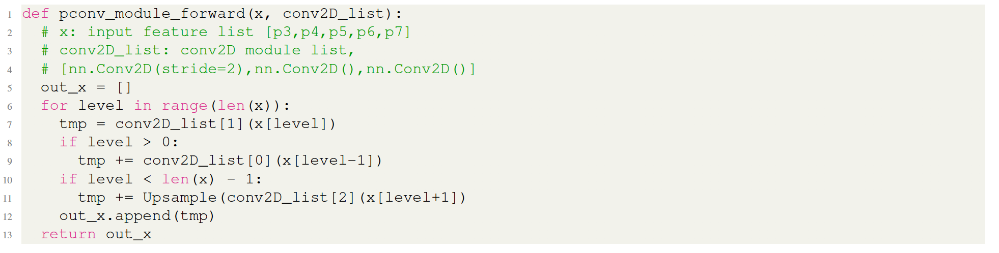

​		至于SEPC，伪代码的for训练中，仅当$\mbox{level}>0$时，$\mbox{conv2d_list}$变为$\mbox{DeformableConv(conv2d_list[i].weight)}$，其中$i \in \{0, 1, 2\}$。这种思想见正文的图6。注意，当在最底层（P3）上卷积时，使用常规的Conv2D，其权重由较高层中使用的可变形卷积共享。

​		因此，SEPC时PConv的改进版，可以通过将较高层的特征图与最低层对齐来缓解特征金字塔与高斯金字塔的差异。换句话说，PConv仅使用朴素的Conv2D模块，而SEPC以高效的方式利用可变性卷积。与头部中可变性卷积的普通实现不同，当在更高层卷积时，SEPC仅变形卷积核，这是由尺度空间理论的观点所推动的，并且比计算成本收益要有效得多。

### 3. Discussion about remark 1

**Remark 1.**	PConv能够从高斯金字塔上提取尺度不变特征。

​		**Gaussian scale space**	考虑一副图像$f:\mathbb{Z}^2 \rarr \mathbb{R}^2$，其中输入域表示像素坐标，$f(\mathbb{x})$是像素强度，通过使用可变宽度$\sqrt{t}$和空间位置$\mathbb{x}$的各向同性二维高斯-魏斯特拉斯内核$G(\mathbb{x}，t) =(4 \pi t)^{-1}\exp(||\mathbb{x}||^2/4t)$连续模糊初始图像$f_0$，以生成高斯尺度空间（Gaussian scale space：GSS） ：

$$f(t, \mathbb{x}) = [G(\cdot,t) \ast f_0](\mathbb{x}), t\ge0, \tag{3}$$

其中更高的 $t$ 表示更大的模糊。

​		**Gaussian pyramid**	利用上述引入的GSS，高斯金字塔表示为：

$$p(a,\mathbb{x}) = f(t(a,s_0), a^{-1}\mathbb{x}) \tag{4}$$

其中$s_0$为初始尺度，$a$为缩小尺寸比例$0 < a \le 1$，而

$$t = \frac{s_0}{a^2} - s_0 \tag{5}$$

为对应于缩小率 $a$ 的高斯核方差，以便在缩小后保持相同的频率极限[4]。实际上，$a$ 选择为 $2^{-l}$，其中 $l$ 是高斯金字塔层， $l = 0$ 表示原始图像上没有任何二次采样。然后，高斯金字塔还写为:

$$p_l(\mathbb{x})=f(t(2^{-l}, s_0), 2^l \mathbb{x}) \tag{6}$$

​		事实上，我们还可以定义一个行为 $S_n$，其从原始层迁移到另一层：

$$[S_n[p]](\mathbb{x}) = p_n(\mathbb{x})[G(\cdot,t(2^{-n}, s_0)) \ast p_0](2^n\mathbb{x})\tag{7}$$

...

### 4. 实验细节

#### 4.1. 训练细节

​		我们利用骨干ResNet-50和ResNet-101和16的mini-batch在8个Nvidia Titan XP GPU上训练。$1\times$的策略的训练预算为12个周期。初始学习率为0.01，并且在8和11个周期时乘以0.1。具有ResNeXt101-64-4d骨干的所有模型在相同设置下，在Nvidia V100 GPU上训练。当在所有实验中使用BN时，我们将每gpu设置4张图像，并且批量大小相同，以获取更准确的统计信息。

​		在评估其他特征融合模块的实验中，所有模型使用具有 $1\times$ 调度的相同骨干ResNet50。我们在具有一个额外头部的组合方式中使用4个PConv，从而得到更好的平衡。在HRNet、PANet和Libra中，并且仅将原始FPN替换为原始文件中的特征融合模块。 在NAS-FPN中，我们使用了7个合并单元并保留了256个通道。

#### 4.2. 速度测试细节

​		我们比较我们的方面（包括前处理、前馈和nms）与其他一阶段检测器的速度。在一张Nvidia 1080Ti GPU和i7-7700K@4.2GHz上进行所有评估。我们将batch size设置为8，并且timer在第100次迭代时开始，以确保I/O稳定。然后，在速度计算中，我们使用接下来的200次迭代的均值。

### 5. 补充消融实验

#### 5.1. PConv堆叠的数量的影响

​		PConv的数量从2调整到6。不同检测器的AP记录如图2所示。该图说明，由于PConv堆栈从上到下的逐步信息流，所有这三个检测器都受益于PConv的数量从2增加到4。在头部中使用四个堆叠的PConv是合理的，因为它可提供下降的平均精度，而不会引起过多的冗余。

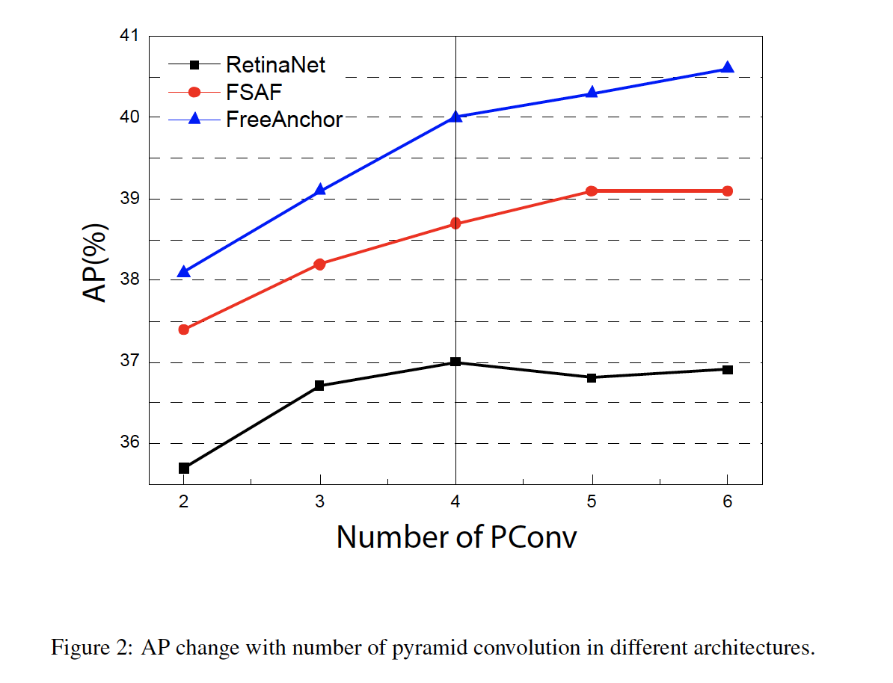

#### 5.2. 使用iBN的训练曲线

​		图3（a-c）展示不同模型的训练损失，图3（d-f）表示AP是如何随训练改变。

​		当使用iBN时，通常，在训练的早期阶段，损失减少得更快，尤其是对于FreeaAchor和RetinaNet。但是，在训练结束时，具有iBN的模型产生略为更高的训练损失，而mAP比没有iBN的模型高。此观察结果遵循批处理规范化的更好的泛化。

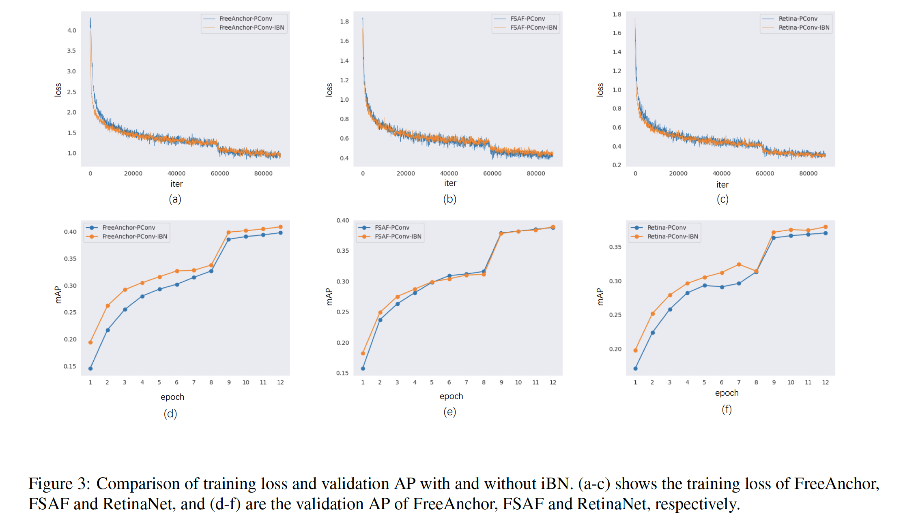