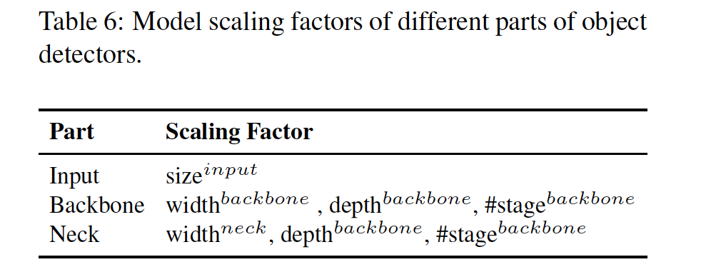

## Scaled-YOLOv4: Scaling Cross Stage Partial Netork

### 摘要

​		我们证明基于CSP方法的YOLOv4目标检测神经网络具有上下伸缩性，适用于小型和大型网络，同时保持最优的优化速度和准确率。我们提出一种新的网络伸缩方法，其不仅修改深度、宽度、分辨率，还修改网络结构。YOLOv4-large模型获得最佳结果：在Tesla V100上，以15FPS的速度，对于MS COCO数据集获得55.4%的AP（73.3% AP50），而利用测试时增强（test time augmentation），YOLOv4-large获得55.8% AP（73.2 AP50）。据我们所知，在COCO数据集上，这是当前所有公开工作中的最高准确率。在RTX 2080Ti上，YOLOv4-tiny模型获得22.0% AP（42.0% AP50），速度约为443FPS，而通过使用TensorRT、batch size = 4和FP16精度，YOLOv4-tiny获得1774FPS。

### 1. 引言

​		基于深度学习的目标检测技术在我们的日常生活中有许多应用。例如，医疗图像分析、自动驾驶汽车、商业分析和人脸识别都依赖目标检测。上述应用需要的计算机设施可能需要云计算设施、一般GPU、IoT集群或单嵌入式设备。为了设计高效的目标检测器，模型伸缩计算非常重要，因为它可以使目标检测器在不同类型的设备上获得高准确率和实时推理。

​		大多数模型伸缩技术改变骨干的深度（CNN卷积层的数量）和宽度（卷积层中滤波器的数量），然后为不同设备适当地训练CNN。例如，在ResNet系列之中，ResNet-152和ResNet-101通常用于云服务器GPU，ResNet-50和ResNet-34通常用于个人计算机GPU，ResNet-18和ResNet-10可以用于低端潜入系统。在[20]中，Cai等尝试利用一次训练开发可以用于不同设备网络架构的技术。他们使用诸如解藕训练与搜索以及知识蒸馏来解藕，并训练子网络，使得整个网络和子网络适合处理目标任务。Tan等[30]提出使用NAS技术来进行复合伸缩，包括EfficientNet-B0对待宽度、深度和分辨率。他们使用这种初始网络来搜索给定计算量的最佳CNN架构，并将它设置为EfficientNet-B1，然后使用线性放大技术来获得诸如EfficientNet-B2到EfficientNet-B7的架构。Radosavovic等[23]总结并添加不同参数搜索空间AnyNet的限制，然后设计RegNet。在RegNet中，他们发现当将瓶颈率设置为1，并将cross-stage的宽度增加率设置为1将获得最佳性能。此外，最近，有专门提出用于目标检测的NAS和模型伸缩方法，例如SpineNet[5]和EfficientDet[31]。

​		通过最佳目标检测器[1、3、5、22、31、36、40]的分析，我们发现CSPDarknet53（YOLOv4[1]的骨干）匹配几乎所有通过网络架构搜索技术获得最优架构特征。CSPDarknet53的深度、瓶颈率、阶段之间的宽度增长率分别为65、1和2。因此，我们基于YOLOv4开发模型伸缩技术，并提出Scaled-YOLOv4。所提出的Scaled-YOLOv4表现出令人兴奋的性能，如图1所示。Scaled-YOLOv4的设计过程图像。第一，我们重新设计YOLOv4，并提出YOLOv4-CSP，然后基于YOLOv4-CSP，我们开发Scaled-YOLOv4。在所提出的Scaled-YOLOv4中，我们讨论线性放大/缩小模型的上界和下界，并分别分析小型模型和大型模型的模型伸缩中需要关注的问题。因此，我们能够系统开发YOLOv4-large和YOLOv4-tiny模型。Scaled-YOLOv4可以获得最佳的速度和准确率的平衡，并且能够以15fps、30fps和60fps以及潜入式设备上进行实时目标检测。

​		本文的贡献为：（1）为小模型设计一种强力的模型伸缩方法，其可以系统地平衡计算成本和浅层CNN的内存带宽；（2）为伸缩大型目标检测器设计简单而有效的策略；（3）分析所有模型缩放因子之间的关系，然后基于主要的有利组划分（group partition）进行模型伸缩；（4）实验确认FPN结构本质上是一种once-for-all结构；（5）我们利用高上述方法来开发YOLOv4-tiny和YOLOv4-large。

### 2. 相关工作

#### 2.1. 实时目标检测

​		目标检测器主要分为一阶段目标检测器[24、25、26、18、16、20]和两阶段目标检测器[9、8、27]。一阶段目标检测器的输出仅在CNN操作后获得。至于两阶段目标检测器，它通常将第一阶段CNN获得的高得分区域提议馈入第二阶段的CNN以得到最终预测。一阶段目标检测器和两阶段目标检测器的推理时间可以表示为$T_{one} = T_{1^{st}}$和$T_{two} = T_{1^{st}} + mT_2^{nd}$，$m$为置信度得分大于阈值的目标提议的数量时。换句话说，一阶段目标检测器要求的推理时间是常量，而两阶段目标检测器的推理时间不是固定的。因此，如果需要实时目标检测器，它们几乎是必须的一阶段目标检测器。今天，流行的一阶段目标检测器主要有两类：基于锚[26、16]和无锚[6、12、13、32]。在所有无锚方法中，因为它不需要复杂的后处理（例如非极大值抑制（NM）），CenterNet[42]非常流行。现在，更准确的实时一阶段目标检测器为基于锚的EfficientDet[31]、YOLOv4[1]和PP-YOLO[19]。本文中，我们基于YOLOv4[1]开发模型伸缩方法。

#### 2.2. 模型伸缩

​		传统模型伸缩方法改变模型的深度，即添加更多卷积层。例如，Simonyan等设计的VGGNet[28]在不同阶段堆叠传统卷积层，还使用这种概念来设计VGG-11、VGG-13、VGG-16和VGG-19架构。后续方法一般遵循相同的方法论进行模型缩放。对于He等提出的ResNet[10]，深度伸缩可以构建非常深的网络，例如ResNet-50、ResNet-101和ResNet-152。后来，Zagoruyko等[39]考虑网络的宽度，并且它们改变卷积核的数量来实现伸缩。因此，他们设计wide ResNet（WRN），同时维持相同的准确率。尽管WRN的参数量比ResNet高，但是推理速度更快。后来的DenseNet[11]和ResNeXt[37]还设计一种复杂的伸缩版，其同时考虑深度和宽度。至于图像金字塔推理，它是进行运行时增强的常用方式。它获取输入图像，并作出不同分辨率的缩放，然后将这些金字塔组合输入到训练好的CNN。最后，网络集成多组输出作为它的终结输出。Redmon等使用上述概念执行输入图像大小缩放。他们使用更高输入图像分辨率来进行在训练好的Darknet53上的微调，并且执行这一步骤的目的是获得更高准确率。

​		最近几年，已开发NAS相关的研究，以及研究NAS-FPN[7]搜索特征金字塔的组合路径。我们可以将NAS-FPN作为模型伸缩技术，其主要在阶段层执行。至于EfficientNet[30]，它基于深度、宽度和输入大小使用复合伸缩搜索。EfficientDet[31]的主要设计概念是拆解目标检测器的不同功能模块，然后在图像大小、宽度、BiFPN层数和box/class层数上进行伸缩。另一种使用NAS概念的设计是SpineNet[5]，其主要目标是网络架构搜索的鱼形目标检测器的整体架构。这种设计概念可以最终生成scale-permuted结构。另一种利用NAS设计的网络是RegNet[23]，其主要固定阶段和输入分辨的数量，并集成诸如深度、宽度、瓶颈比例和每个阶段组宽度的所有参数到深度、初始宽度、斜率、量化、瓶颈比例和组宽度。最后，他们使用六个参数来进行复合模型伸缩搜索。上述方法都是极大的工作，但是它们很少分析不同参数之间的关系。本文中，我们基于目标检测的设计需求，尝试找出一种进行协同复合伸缩的方法。

### 3. 模型伸缩的原则

​		在为所提出的目标检测器进行模型伸缩后，接下来的步骤是处理将要改变的量化因子，包括具有定性因子的参数量。这些因子包含推理时间、平均准确率等。定性因子依靠使用的装备或数据库将会有获得不同的影响。在3.1节中，我们分析和设计量化因子。3.2和3.3节中，我们设计与在低端设备和高端GPU上运行的微型目标检测相关的定性因子。

#### 3.1. 模型伸缩的一般原则

​		当设计有效的模型伸缩方法时，我们的主要原则是，当尺度放大/缩小时，我们想要增加/减少的量化成本越低/越高，则更好。本节中，我们将证明并分析不同的通用CNN模型，并且，在面对（1）图像大小、（2）层数量和（3）通道数量时，尝试理解他们的定量成本。我们选择的CNN为ResNet、ResNeXt和Darknet。

​		对于具有$b$个基本层通道的$k$层CNN，ResNet层的计算为$k \ast \{\mbox{conv} 1 \times 1, b/4 - \mbox{conv} 3 \times 3, b/4 - \mbox{conv} 1\times 1, b\}$，ResNeXt层的计算为$k \ast \{\mbox{conv} 1\times 1, b/2-\mbox{gconv} 3\times 3/32,b/2-\mbox{conv} 1\times 1,b\}$。至于Darknet，计算量为$k\ast\{\mbox{conv} 1\times 1,b/2-\mbox{conv}3\times3,b\}$。令用于调整图像大小、层数量和通道数量的伸缩因子分别为$\alpha$、$\beta$和$\gamma$。当这些伸缩因子变化时，FLOPs的相应变化如表1。

​		从表1可以看出大小、深度和宽度引起计算成本增加。它们分别表现出平方、线性和平方增加。

​		由Wang等提出的CSPNet[33]可以用于不同的CNN架构，同时减少参数和计算量。此外，它还提高了准确率以及降低推理时间。我们将其用于ResNet、ResNeXT和Darknet，并观察计算量的改变，如图2所示。

​		从表2可以看出，我们观察到，将上述CNN转换为CSPNet后，新的架构可以有效地将ResNet、ResNeXt和Darknet计算量（FLOPs）分别减少23.5%、46.7%和50.0%。因此，我们使用CSP-ized模型作为进行模型伸缩的最佳模型。

#### 3.2. Scaling Tiny Models for Low-End Devices

​		对于低端设备，设计的模型的推理速度不仅受计算量和模型大小的影响，更重要的是要考虑外围硬件资源的限制。因此，当进行微型模型伸缩时，我们必须还要考虑诸如内存带宽、内存访问成本（memory access cost：MACs）和DRAM通信。为了考虑到上述因素，我们的设计必须遵循如下的原则：

**使计算量小于$O(whkb^2)$:** 轻量化模型与大型模型的不同之处在于，它们的参数利用效率必须更高，从而在少量计算量的情况获得需要的准确率。当进行模型伸缩时，我们希望计算量可以尽可能低。表3中，我们分析具有高效参数利用的网络，例如DenseNet和OSANet的计算加载。

​		对于一般CNN，$g$、$b$和$k$的关系如表3：$k \ll g < b$。因此，DenseNet的计算复杂度为$O(whgbk)$，OSANet的计算复杂度为$O(\max(whbg,whkg^2))$。上述两个方法的计算复杂度小于ResNet系列的$O(whkb^2)$。因此，我们在OSANet的帮助下设计微型模型，其计算复杂度更小。

**Minimize/balance size of feature map：** 为了获得计算速度方面的最佳平衡，我们提出新的概念，其进行CSPOSANet计算块之间的梯度截断。如果我们将原始的CSPNet设计用于DenseNet或ResNet架构，由于这两个架构的第$j$层输出时第1层到第$(j-1)$层的输出，我们必须将整个计算块视为一个整体。因为OSANet的计算块属于PlainNet架构，使来自计算块任何层的CSPNet可以获得梯度截断的影响。我们使用这种特征来重新规划基础层的$b$个通道，并通过计算块生成$kg$个通道，并将它们划分为具有相等通道数的两条路径，如表4所示。

​		当通道数为$b+kg$，如果想要将这些通道分为两条路径，最佳的划分时将它分为两个相等的部分，即$(b+kg)/2$。当我们实际上考虑硬件的带宽$\tau$时，如果不考虑软件优化，最佳值为$ceil((b+kg)/2\tau)\times\tau$。我们设计的CSPOSANet可以动态调整通道分配。

**Maintain the same number of channels after convolution：** 为了评估低端设备上的计算成本，我们还须考虑电力消耗，影响电力消耗的最大因素为内存访问成本（memory access cost：MAC）。卷积操作的MAC的计算方法如下：

$$MAC = hw(C_{in} + C_{out}) + KC_{in}C_{out} \tag{1}$$

其中$h$、$w$、$C_{in}$、$C_{out}$和$K$分别表示特征图的高和宽、输入和输出通道数以及卷积滤波器的核大小。通过计算几何不等式，我们可以推导出，当$C_{in} = C_{out}$时，MAC最小。

**Minimize Convolutional Input/Output（CIO）：**CIO为衡量DRAM IO状态的指示器。表5列出OSA、CSP和我们设计的CSPOSANet的CIO。当$kg>b/2$时，所提出的CSPOSANet可以获得最佳的CIO。

#### 3.3. Scaling Large Models for High-End GPUs

​		由于在放大CNN模型后，我们希望提高准确率，并维持实时推理速度，在进行复合伸缩时，我们必须找出目标检测器的大量伸缩因子中的最佳组合。通常，我们可以调整目标检测器的输入、骨干和颈部的伸缩因子。潜在的伸缩因子的调整如表6。

​		图像分类和目标检测之间的最大差异是，前者仅需要识别图像中最大部分的类别，而后者需要预测图像每个目标的位置和大小。在一阶段目标检测器中，与每个位置相关的特征向量用于预测该位置目标的类别和大小。更好预测目标大小的能力基本上依赖特征向量的感受野。在CNN架构中，与感受野最相关的事物是stage，FPN架构告诉我们，更高阶段更适合预测大型目标。在表7中，我们展示感受野和几个参数的相关性。

​		根据表7，很明显，宽度伸缩可以独立运行。当输入图像的大小增加时，如果想要更好的大目标预测效果，必须增加网络的深度或阶段数。在表7列出的参数中，$\{\mbox{size}^{\mbox{input}},\#\mbox{stage}\}$的复合具有最佳的影响。因此，当进行放大时，我们首先在$\mbox{size}^{\mbox{input}}$、$\#\mbox{stage}$上进行伸缩，然后根据实时要求，我们分别在深度和宽度上进行伸缩。

### 4. Scaled-YOLOv4

​		本节中，我们关注为一般GPU、低端GPU和高端GPU设计Scaled-YOLOv4。

#### 4.1. CSP-ized YOLOv4

​		YOLOv4设计用于在一般GPU上的实时目标检测。本小节中，我们将YOLOv4重设计为YOLOv4-CSP来获得最佳的速度/准确率平衡。

​		**Backbone：**在CSPDarknet53的设计中，cross-stage过程的下采样卷积的计算没有包含在残差块中。因此，我们可以推断每个CSPDarknet阶段的计算量为$whb^2(9/4 + 3/4 + 5k/2)$。根据上述公式推导，当满足$k>1$时，我们知道CSPDarknet阶段比Darknet阶段有更好的计算优势。CSPDarknet53中的每个阶段拥有的残差层的数量分别为1-2-8-8-4。为了获得更好的速度/准确率平衡，我们将第一个CSP阶段转换为最初的Darknet残差层。

​		**Neck：**为了有效地减少计算量，我们CSP-ize YOLOv4中的PAN架构。PAN架构的计算过程如图2（a）。它主要集成来自不同特征金字塔的特征，然后将它们传入逆Darknet残差层（没有shortcut连接）。在CSP-ization之后，新的计算列表的架构如图2（b）所示。这种新更新将计算减小40%。

​		**SPP：**SPP最初插入颈部第一个计算组的中间位置。因此，我们还将SPP模块插入到CSPPAN的第一个计算组的中间位置。

#### 4.2. YOLOv4-tiny

​		YOLOv4-tiny设计用于低端GPU设备，这种设计遵循3.2节中的原则。

​		我们将使用具有PCB架构的CSPOSANet来构成YOLOv4的骨干。我们设置$g=b/2$作为增长率，在结束时，使其增长到$b/2 + kg = 2b$。通过计算，我们推导出$k=3$，并且它的架构如图3所示。至于每个阶段和颈部的通道数，我们遵循YOLOv3-tiny。

#### 4.3. YOLOv4-Large

​		YOLOv4-large设计用于云GPU，主要目的是获得目标检测的高准确率。我们设计一种完整的CSP-ized模型YOLOv4-P5，并将它放大到YOLOv4-P6和YOLOv4-P7。

​		图4给出YOLOv4-P5、YOLOv4-P6和YOLOv4-P7的结构。我们设计在$\mbox{size}^{\mbox{input}}$、$\#\mbox{stage}$上进行复合伸缩。我们将每个阶段的深度尺度设置为$2^{d_{s_i}}$，并将$d_s$设置为$[1,3,15,15,7,7,7]$。最后，我们进一步使用推理时间作为约束以进行额外的宽度伸缩。我们的实验表明，当宽度伸缩因子等于1时，YOLOv4-P6可以在30FPS视频上达到实时性能。对于YOLOv4-P7，当宽度伸缩因子等于1.25时，它可以在15FPS的视频上达到实时性能。

### 5. 实验

​		我们使用MSCOCO 2017目标检测数据集来验证所提出的Scaled-YOLOv4。我们没有使用ImageNet预训练模型，所有Scaled-YOLOv4模型从头训练，并采用SGD优化器。用于训练YOLOv4-tiny的时间为600epoch，用于训练YOLOv4-CSP的时间为300epoch。至于YOLOv4-large，我们首先训练300epoch，然后遵循使用更强的数据集增强方法来训练150epoch。至于超参数的拉格朗日乘子，例如学习率的锚点、不同数据增强方法的程度，我们使用k-means和遗传算法来确定。与超参数相关的所有细节见附录。

#### 5.1. CSP-ized模型上的消融研究

​		在本小节中，我们见CSP化不同的模型，并行CSP化在参数量、计算量、吞吐量和平均精确率方面的影响。我们使用Darknet53（D53）作为骨干，并选择具有SPP的FPN（FPNSPP）以及具有SPP的PAN（PANSPP）作为颈部来设计消融研究。在表8中，我们列出CSP化不同DNN模型后的$\mbox{AP}^{val}$结果。我们分别使用LeakyReLU（Leaky）和Mish激活函数来比较使用的参数量、计算和吞吐量。在COCO minival数据集上进行实验，产生的AP见表8的最后一列。

​		根据表8列出的数据，可以看出CSP化的模型将参数量和计算减少32%，并带来Batch 8吞吐量和AP上的改进。如果希望维持相同的帧率，可以添加更多层或更先进激活到CSP化的模型。根据表8指出的，我们可以看出CD53s-CFPNSPP-Mish和CD53s-CPANSPP-Leaky都与D53-FPNSPP-Leaky有相同的批量8的吞吐量，但是它们在更低计算资源的情况下，分别将AP提高1%和1.6%。根据上述改进，我们可以看出模型CSP化带来大量优势。因此，我们决定使用CD53s-CPANSPP-Mish，这导致表8中AP最高，成为YOLOv4 CSP的主干。

#### 5.2. YOLOv4-tiny上的消融研究

​		在这一小节中，我们设计了一个实验来展示如果在计算块中使用带有部分函数的CSPNet可以有多灵活。我们海域CSPDarknet53比较，其中我们在宽度和深度上进行先行伸缩。结果见表9。

​		据表9所示，我们可以看出设计的PCB技术可以是模型更灵活，因为这样的设计可以根据实际需要调整。根据上述结果，我们还可以确定线性缩小有它的局限。当在有限的运算条件下，tinyCD53s的残差加法将成为推理速度的瓶颈，因为它的帧率远低于具有相同计算量的COSA架构。同时，我们还可以看出所提出的COSA可以等到更高的AP。因此，我们最终选择COSA-2x2x，其在我们的实验中获得最佳速度/准确率平衡，因此作为YOLOv4-tiny架构。

#### 5.2. YOLOv4-large上的消融研究

​		在表10中，我们给出从头训练和微调阶段上获得YOLOv4模型。

#### 5.4. Scaled-YOLOv4 for object detection

​		我们比较其他实时目标检测器，并且结果如表11所示。加粗的[AP, AP50, AP75, APS, APM, APL]值表示对应项上的最佳。我们可以看出所有scaled YOLOv4模型，包括YOLOv4-CSP、YOLOv4-P5、YOLOv4-P6、YOLOv4-P7，是所有指示器上的Pareto最优。当我们将YOLOv4-CSP与具有相同准确率EfficientDet-D3（47.5% vs 47.5%）时，推理速度时EfficientDet-D3的1.9倍。当YOLOv4-P5与相似准确率的EfficientDet-D5（51.4% vs 51.5%）比较时，推理速度是EfficientDet-D5的2.9倍。YOLOv4-P6 vs EfficientDet-D7 （54.3% vs 53.7%）和 YOLOv4-P7 vs EfficientDet-D7x （55.4% vs 55.1%）比较时，都有相似的结果。在推理速度方面，YOLOv4-P6和YOLOv4-P7分别是3.7倍和2.3倍。所有Scaled-YOLOv4模型达到最佳结果。

​		YOLOv4-Large模型的测试时增强（test-time augmentation：TTA）结果如表12所示。在使用TTA后，YOLOv4-P5、YOLOv5-P6和YOLOv6-P7分别增加1.1%、0.6%和0.4%的AP。

​		然后，我们比较YOLOv4-tiny与其他tiny目标检测器的性能，结果如表13。

​		最后，我们将YOLOv4-tiny放到不同的嵌入式GPU（Xavier AGX、Xavier NX、Jetson TX2、Jetson NANO）上进行测试。我们还使用TensorRT FP32（如果有FP16支持，使用FP16）进行测试。不同模型的帧率见表14。

#### ScaledYOLOv4 as naive once-for-all model

​		在本节中，我们设计实验来证明FPN类的架构是朴素的once-for-all模型。这里我们移除YOLOv4-P7的一些top-down阶段和检测分支。YOLOv4-P7\P7和YOLOv4-P7\P7\P6表示从训练好的YOLOv4-P7上移除{P7}和{P7，P6}阶段后的模型。表5给出不同剪枝模型和不同输入分辨率的原始YOLOv4-P7。

​		我们可以发现，YOLOv4-P7在高分辨率下有最佳AP，同时YOLOv4-P7、P7 和 YOLOv4-P7\P7\P6在中低分辨率下分别有最佳AP。这意味着，我们可以使用FPN类的子网络来很好地执行目标检测任务。此外，我们可以对目标检测器的模型结构和输入大小进行复合缩小，以获得最佳性能。