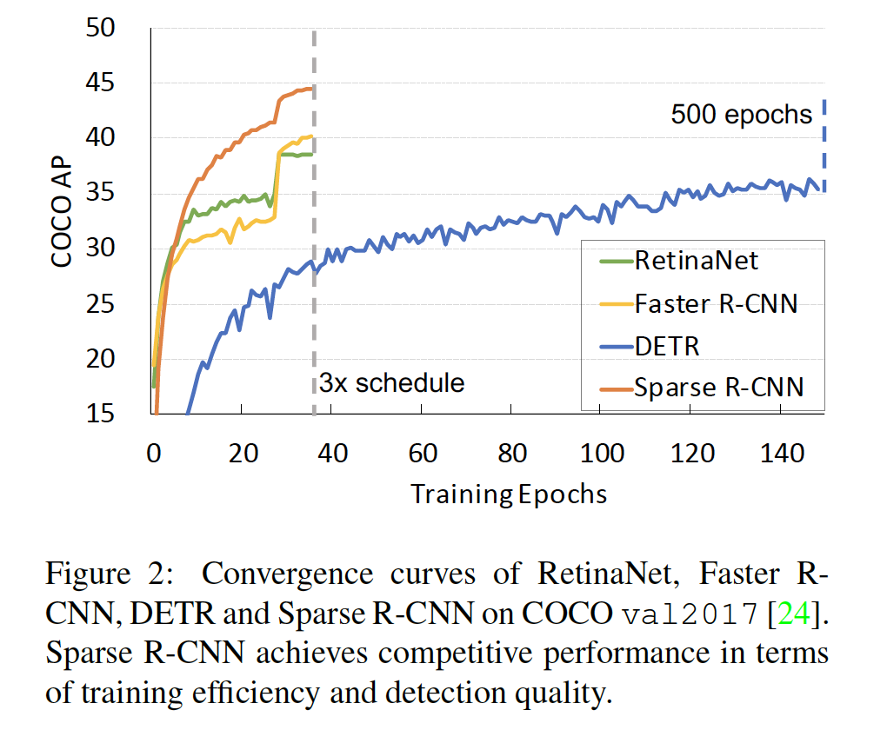

## Sparse R-CNN: End-to-End Object Detection with Learnable Proposals

### 摘要

​		我们提出Sparse R-CNN，它是用于图像中目标检测的纯稀疏方法。目标检测上的已有工作严重依赖密集目标候选，例如在大小为$H\times W$的图像特征图网格上预定义的$k$个锚。然而，在我们的方法中，目标识别头提供学习的目标提议的稀疏集（共$N$个提议）来进行分类和定位。通过将$HWk$（多达数十万个）手工设计的候选目标消除为$N$个（例如100个）可学习的建议，Sparse R-CNN完全避免了与候选目标设计和多对一标签分配相关的所有工作。更重要的是，直接输出最终的预测，而没有非极大值抑制过程。Sparse R-CNN与具有挑战性的COCO数据集上公认的检测器基准具有同等的准确性、运行时间和训练收敛性能，例如使用ResNet-50 FPN模型，在标准的3倍训练调度下，以22FPS的速度获得44.5AP。我们希望我们的工作能够激发人们重新思考目标检测器中密集先验的惯例。代码见https://github.com/PeizeSun/SparseR-CNN。

### 1. 引言

​		目标检测旨在定位图像中的目标集合，并识别出它们的类别。密集的先验一直是检测器成功的基石。在经典计算机视觉中，滑动窗口（其中在密集图像网格上使用分类器）是近十年来的主流检测方法。现代主流的一阶段检测器在密集特征图网格上预定义标记，例如锚框[23、29]（如图1所示）或参考点，并预测与目标边界的相对缩放和偏移，以及对应的类别。尽管提议边界框上的稀疏集上工作的两阶段流水线，但是他们的提议生成算法仍构建在密集候选之上，如图1b所示。

​		这种完善的方法概念上是直观的，并提供鲁棒性的性能[8、24]，以及快速的训练和推理时间[40]。除了它们的极大成功，值得注意的是，密集先验检测器遭遇一些限制：1）如此的流水线通常产生冗余和几乎重复的结果，因此使NMS[1、39]称为必要组件。2）训练中多对一的标签分配问题[2、42、43]使网络对启发式分配规则敏感。3）锚框的大小、纵横比和数量、参考点的密度以及提议生成算法严重影响最终性能。

​		尽管密集约定在目标检测器中得到了广泛认可，但是自然而然的提出一个问题：_是否可能设计一个稀疏检测器？_最近，DETR建议将目标检测重新表述为直接和稀疏集预测问题[3]，其输入仅为100个学习过的目标查询[37]。直接输出最终的预测集，而没有任何手工设计的后处理。尽管DETR具有简单而出色的框架，但它要求每个目标查询与全局图像上下文进行交互。这种密集的属性不仅减慢了其训练收敛性[45]，而且阻止了它建立用于目标检测的完全稀疏流水线。

​		我们相信稀疏属性应当在两个方面：_sparse boxes_和_sparse features_。Sparse boxes意味着少量开始边界框（例如100）足以预测图像中所有目标。稀疏特征表示每个框的特征不需要与整个图像上的所有其他特征交互。根据这种观点，DETR不是纯粹的稀疏方法，因为每个目标查询必须与完整图像上的密集特征交互。

​		本文中，我们提出Sparse R-CNN（一种纯粹的稀疏方法），无需在所有（密集）图像网格上枚举目标位置候选对象，也无需与全局（密集）图像特征进行交互的目标查询。如图1（c）所示，给定一组由4维坐标表示的可学习边界框的固定目标候选，而不是RPN中成千上万候选的预测边界框。这些稀疏候选用作提议边界框以通过RoIPool和RoIAlign提取RoI。

​		可学习的提议框是图像中潜在目标位置的统计信息。而4d坐标仅是目标的粗糙表示，并且缺少很多信息，例如姿势和形状。这里，我们引入另一种概念（称为_proposal feature_），其为高维（例如256）隐向量。与粗糙边界框相比，它期望编码丰富的实例特征。具体而言，提议特征为其专用的目标识别头部生成一系列自定义参数。我们称其为Dynamic Instance Interactive Head，因为它与最近的动态方案有相似之处[18、34]。与[30]中共享的2个fc层相比，我们的头部更灵活，并在准确性方面占据重要地位。在我们的实验中，我们证明以稀疏的提议而不是固定参数为前提的头部设计实际上是Sparse R-CNN成功的关键。随机初始化_proposal boxes_和_proposal features_，并与网络中的其他参数一起优化。

​		在我们的Sparse R-CNN中，最引人注目的特性是始终具有sparse-in spars-out模式。这种初始输入是提议边界框和提议特征稀疏集，以及一对一的动态实例交互。流水线中既没有密集候选[23、30]，也没有与全局（密集）特征的交互。这种纯粹的稀疏性使Sparse R-CNN称为R-CNN家族的全新成员。

​		Sparse R-CNN在具有挑战性的COCO数据集[24]上证明了其准确度、运行时间和训练收敛性能与成熟的检测器[2、30、35]相当，例如，在标准3倍训练时间表以及使用ResNet-50 FPN模型以22 fps运行，获得44.5AP。据我们所知，所提出的Sparse R-CNN是证明相当稀疏的设计合格的第一项工作。我们希望我们的工作能够激发人们重新思考在物体检测中进行密集先验的必要性，并探索下一代目标检测器。

### 2. 相关工作

**密集方法**	滑动窗口范式在目标检测中已流行许多年。受经典特征提取技术[6、38]的启发，性能几十年来一直处于平稳状态，应用场景有限。深度卷积神经网络（CNN）的发展[14、17、20]培养了性能显着提高的通用目标检测[8、24]。主流的流水线之一是一阶段检测器，它可以一次性预测密集覆盖空间位置、尺度和纵横比的锚框的类别和位置，例如OverFeat [32]、YOLO [29]、SSD [25]和RetinaNet [23]。最近，提出无锚算法[16、12、35、44]，该方法通过用参考点替换手工制作的锚框来使该管道更加简单。以上所有方法均基于密集的候选目标，并且每个候选目标都直接分类并回归。这些训练目标会根据预先定义的原则在训练时间内分配给ground-truth目标框，例如，锚点是否与ground-truth有较高的交并比（IoU）阈值，或者参考点是否落入一个目标框中。此外，推理时，必须使用NMS后处理[1、39]来移除冗余预测。

**Dense-to-sparse method**	两阶段检测器是另一种主流流水线，并主导目标检测多年[2、4、10、11、13、30]。这种凡事可以视为密集检测器的扩展。它首先从密集区域候选中获取稀疏的前景提议框，然后精炼每个提议的位置，并预测其特定的类。在这些两阶段方法中，区域提议算法扮演着重要角色，例如R-CNN中的Selective Search[36]和Faster R-CNN中的RPN。与密集流水线相似，它还是需要NMS后处理和手工的标签分配。来自成千上万个候选者的前景提案很少，因此可以将这些检测器归为密集-稀疏（dense-to-sparse）方法。

​		最近，提出DETR[3]来直接输出预测，而没有任何手工组件，并获得非常相似的性能。DETR利用稀疏的目标查询集以与全局（密集）图像特征交互，在这种情况下，可以将其视为另一种从密集到稀疏的表述。

**Sparse method**	稀疏目标检测有可能消除设计密集候选的努力，但落后于上述检测器的准确性。G-CNN[27]可以视为这类算法的先驱。它以图像上的多尺度规则网格开始，并迭代地更新边界框以覆盖以及分配目标。这种手工设计的规则先验显然是次优的，并且不能获得顶级性能。相反，我们的Sparse R-CNN使用可学习的提议，并获得更好的性能。同时，引入Deformable-DETR[45]来限制每个查询以关注参考点周围的小型关键采样点集，而不是特征图中的所有点。我们希望稀疏方法可以作为坚实的基线，并有助于简化目标检测社区中的未来研究。

### 3. Sparse R-CNN

​		Sparse R-CNN的中心思想是利用小型的提议框（例如100）集替换来自RPN的成千上万候选。本节中，我们首先简要地介绍所提出的方法的综合架构。然后，我们详细描述每个组件。

#### 3.1. Pipeline

​		Sparse R-CNN是一种简单、统一的网络，其有骨干网络、动态实例交互头部和两个任务特定的预测层组成（见图3）。总共有三个输入：图像、提议框集和提议特征。后两者可以学习，并可以与网络中其他参数一起优化。

#### 3.2 Module

**Backbone**	基于ResNet架构[14、22]的FPN用作骨干网络以从输入图像产生多尺度特征图。遵循[22]，我们构建具有层$P_2$到$P_5$的金字塔，其中$l$表示金字塔层，输入图像的分辨率为$P_l$的$2^l$倍。所有金字塔层有$C=256$个通道。更多细节，参见[22]。实际上，Sparse R-CNN有潜力得益于更复杂的设计，从而提高它的性能，例如堆叠的编码器层[2]和可变形卷积网络。然而，我们与Faster R-CNN对齐以证明我们的方法的简单性和有效性。

**可学习的提议边界框**	固定的可学习提议边界框$(N \times 4)$集合用作区域提议，而不是来自RPN的预测。这些提议框由范围为0到1的4d参数表示，其表示归一化的中心坐标、高和宽。训练期间，利用反向传播算法更新提议框的参数。由于可学习的特性，在实验中，我们发现初始化的影响是最小的，因此使框架更灵活。

​		概念上，这些学习到的提议框是训练集中潜在目标位置的统计信息，并可以看作是最有可能包围图像中目标的区域的初始猜测，而与输入无关。鉴于RPN的提议与当前图像紧密相关，并提供了粗略的目标位置。我们重新考虑，第一阶段的定位在后期阶段的存在下是豪华的，以完善框的位置。相反，合理的统计数据可能已经是合格的候选。在此视图中，Sparse R-CNN可归类为目标检测器范式的扩展，从完全密集[23、25、28、35]到dense-to-sparse[2、4、11、30]再到完全稀疏，如图1所示。

**可学习的提议特征**	尽管4d提议框是描述目标的简要表达，但它提供了目标的粗糙定位，并且丢失了很多信息，例如目标的姿势和形状。这里，我们介绍另一种概念（称为_proposal feature_$N \times d$），它是高维（例如256）隐向量，并期望编码丰富的实例特征。提议特征的数量与提议框相同，接下来，我们讨论如下使用它。

**Dynamic instance interactive head**	给定$N$个提议，Sparse R-CNN首先利用RoIAlign操作来提取每个边界框的特征。然后，使用我们的预测头部，每个边界框特征将用于生成最终预测。

​		图4给出预测头部，称为Dynamic Instance Interactive Module，其受[18、34]启发。每个RoI特征被馈入其专有的头部进行目标检测和分类，其中每个头部以特定的提议特征为前提。在我们的设计中，提议特征和提议框为一对一对应的。对于$N$个提议框，采用$N$个提议特征。每个RoI特征$f_i(S \times S \times C)$将与对应的提议特征$p_i(C)$以过滤掉无效的bins，并输出最终目标特征（$C$）。由具有ReLU激活函数和隐藏维度为$C$的3层感知机计算最终回归预测，分类预测由一个线性映射层计算。

​		对于轻量设计，我们使用连续的具有ReLU激活函数的$1 \times 1$卷积来实现交互过程。每个提议特征$p_i$与RoI特征进行卷积以获得更具辨别性的特征。更多细节见代码。我们注意到，交互式头的实现细节并不关键，只要支持并行操作以提高效率即可。

​		我们的提议特征可以视为注意力机制的一种实现，用于关注大小为$S \times S$的RoI中的bin。提议特征生成卷积核参数，然后由生成的卷积处理RoI特征以获得最终特征。以这种方式，那些最具前景信息的bin影响最终的目标定位和分类。

​		我们还采用迭代结构来进一步提高性能。新生成的目标边界框和目标特征将作为迭代过程下一阶段的提议边界框和提议特征。由于稀疏性和轻量的动态头部，它仅引入少量的计算开销。自注意力模块被嵌入到动态头部以推理目标之间的关系。我们注意到，Relation Network[15]也shying注意力模块。然而，除了目标特征外，它需要几何特性和复杂的排名特征。我们的模块更加简单，并且仅以目标特征作为输入。

​		DETR [3]中提出的目标查询与提议特征具有相似的设计。然而，目标查询学习位置编码。当与目标查询交互时，特征图需要加上空间位置编码，否则会导致显着下降。我们的提议特征与位置无关，并且我们证明了我们的框架无需位置编码就能很好地工作。在实验中，我们提供进一步的比较。

**Set prediction loss**	Sparse R-CNN在分类和固定的边界框位置集上应用集合预测损失[3、33、41]。基于几何的损失产生预测和ground-truth目标之间的最优二分匹配。匹配成本定义如下：

$$\mathcal{L} = \lambda_{cls} \cdot \mathcal{L}_{cls} + \lambda_{L1} \cdot \mathcal{L}_{L1} + \lambda_{giou} \cdot \mathcal{L}_{giou}\tag{1}$$

这里，$\mathcal{L}_{cls}$为预测分配和ground-truth类标签之间的focal loss[23]，$\mathcal{L}_{L1}$和$\mathcal{L}_{giou}$分别为预测边界框和ground-truth框的归一化中心坐标、宽高之间的L1损失和GIoU损失。$\lambda_{cls}$、$\lambda_{L1}$和$\lambda_{giou}$为每个组件的系数。训练损失与匹配成本相同，只不过对匹配的配对执行。最终的损失为由训练批中目标数量归一化的所有对之和。

​		R-CNN系列[2，43]一直受标签分配问题困扰，因为仍然存在多对一匹配。这里我们提供新的可能，即直接跳过多对一匹配，并引入具有基于集合损失的一对一匹配。这是倾向探索一对一目标检测的尝试。

### 4. 实验

**Dataset**	我们的实验在挑战性的MS COCO基准上进行，其使用标准的目标检测度量。所有模型在COCO train2018（～118k张图像）上训练，并在val2017（5k张图像）上评估。

**Training details**	除非其他说明，将ResNet50用作骨干网络。优化器为权重衰减为0.0001的AdamW[26]。mini-batch为16张图像，所有模型利用8张GPU训练。默认训练表为36个epoch，并且初始学习率设置为$2.5 \times 10^{-5}$，在27个epoch和33个epoch时，分别除以10。骨干利用ImageNet上预训练的权重初始化，其他新添加的层用于Xavier[12]初始化。数据增强包含随机水平翻转、调整输入图像的尺度扰动，使输入图像的最短边至少为480，最长为800，最长边最多的1333。遵循[3、45]，$\lambda_{cls} = 2$、$\lambda_{L1}=5$、$\lambda_{giou}=2$。默认的提议框、提议特征和迭代数分别为100、100和6。

**Inference details**	Sparse R-CNN中的推理过程非常简单。给定输入图像，Sparse R-CNN直接预测与他们的得分相关的100个边界框。得分表示框包含目标的概率。对于评估，我们直接使用这100个框，而没有任何后处理。

#### 4.1. Main Result

​		我们提供两个版本的Sparse R-CNN与不同检测器比较。第一使用100个可学习的提议框，而没有随机裁剪数据增强，并用于与主流目标检测器（例如Faster R-CNN和RetinaNet）进行比较。第二个利用具有随机裁剪数据增强的300个可学习提议框，并用于与DETR系列方法比较[3、45]。

​		如表1所示，Sparse R-CNN大幅领先完善的主流检测器，例如RetinaNet和Faster R-CNN。令人吃惊的是，基于ResNet50的Sparse R-CNN获得42.3AP，在准确率方面，已可与基于ResNet-101的Faster R-CNN比较。

​		我们注意到DETR和Deformable DETR通常采用更强的特征提取方法，例如堆叠的编码器层和可变形卷积。Sparse R-CNN的更强实现用于给出与这些检测器的更公平比较。即使使用简单的FPN作为特征提取方法，Sparse R-CNN得到更高的准确率。此外，与DETR相比，在小型目标上，Sparse R-CNN获得更好的检测性能（26.9AP vs. 22.5AP）。

​		Sparse R-CNN的训练收敛速度是DETR的10倍，如图2所示。自从提出以来，DETR一直在缓慢收敛，这激发了Deformable DETR的动机。与Deformable DETR相比，Sparse R-CNN在准确率方面表现出更好的性能（44.5AP vs. 43.8AP）、更短的运行时（22FPS vs. 19FPS），以及更短的训练表（36epoch vs. 50epoch）。

​		Sparse R-CNN的推理时间与其他检测器相当。我们注意到，由于动态实例交互头的轻量设计，具有100个提议的模型以23FPS运行，而300个提议的模型仅减少至22FPS。

#### 4.2. 模块分析

​		本节中，我们分析Sparse R-CNN中的每个组件。除非其他说明，所有模型基于ResNet50-FPN骨干、100个提议、3倍训练表。

**Learnable proposal box**	与Faster R-CNN开始，我们利用稀疏的可学习提议框集替换RPN。性能从40.2AP（表1的第三行）下降到18.5（表2）。我们发现，即使堆叠更多的全连接层，也没明显的改进。

**Iterative architecture**	迭代地更新边界框是提高其性能的直观想法。但是，我们发现，简单级联架构并没有太大的区别，如表3所示。我们分析原因是，与[2]中精炼的提议框（主要定位目标周围）相比，我们的候选更加粗糙，使得它难以优化。我们观察到，在整个迭代过程中，一个提议框的目标对象通常是一致的。因此，前一阶段的目标特征可以被重用以作为下一阶段的强壮线索。目标特征编码丰富的信息，例如目标姿态和位置。在原始级联架构的基础上，特征重用的微小变化产生11.7 AP的巨大收益。最后，迭代架构带来13.8AP的改进，如表2的第二行。

**Dynamic head**	动态头与上述迭代体系结构以不同的方式使用前一阶段的目标特征。前一阶段的目标特征首先通过自注意力模块处理，然后用作提议特征以实现当前阶段的实例交互。自注意力模块用于目标特征特征集医进行目标之间的关系推理。表4给出自注意力和动态实例交互的好处。最后，Sparse R-CNN获得42.3AP的准确率性能。

**提议框初始化**	密集检测器始终严重依赖目标候选的设计，然而，Sparse R-CNN中的目标候选是可学习的，因此所有与设计手痛锚相关的努力都可避免。但是，人们可能关心提议框的初始化在Sparse R-CNN中起着关键作用。这里，我们研究用于初始化提议的不同方法影响。

- “Center”表示，开始时，在图像的中心位置的所有提议框，高和宽设置为图像大小的0.1。
- “Image”表示，所有提议框初始化为整个图像大小。
- “Grid”表示，提议框初始化为图像中的规则网格，其正式G-CNN[27]中的初始框。
- “Random”表示利用高斯分布随机初始化的提议框的中心、高和宽。

   从表5中我们可以看出，Sparse R-CNN的最终性能对于提议框的初始化而言是相对可靠的。

**提议的数量**	提议的数量极大地影响密集和稀疏检测器的性能。原始的Faster R-CNN使用300个提议[30]。后来，增加到2000[40]，并获得更好的性能。表6中，我们研究Sparse R-CNN中提议数的影响。将提议数从100增加到500导致持续改进，这表明我们的框架很容易在各种情况下使用。 鉴于500个提议需要花费更多的训练时间，因此我们选择100和300作为主要配置。

**迭代架构中的阶段数量**	迭代架构是广泛用于提高目标检测性能的技术，尤其是Sparse R-CNN。表7给出迭代架构中阶段数的影响。没有迭代架构，性能仅为21.7 AP。考虑到第一阶段输入的提议是可能的目标位置的猜测，这种结果不令人惊讶。增加到3哥阶段带来14.5AP的增益，达到竞争性的36.2AP。逐渐增加阶段数量，性能在6个阶段时达到饱和。我们选择6个阶段作为默认配置。

**Dynamic head vs. Multi-head Attention**	如第3节中讨论的，动态头部使用提议特征来过滤RoI特征，最终输出目标特征。我们发现，多头注意力模块提供另一种实例交互的可能实现。我们在表8中进行了比较实验，其性能低于6.6 AP。与线性多头注意力相比，我们的动态头更加灵活，其参数取决于其特定的提议特征，并且可以轻松引入更多的非线性容量。与线性多头注意力相比，我们的动态头更加灵活，其参数取决于其特定提议特征，并且可以轻松引入更多的非线性容量。

**Proposal feature vs. Object query**	这里，我们比较DETR中提出的目标查询与我们提议特征。如[3]中讨论的，目标查询是学习到的位置编码，指导解码器与图像特征图和空间位置编码之和交互。仅使用图像特征图导致明显的性能下降。然而，我们的提议特征可以视为一种特征滤波器，其与位置无关。比较见表9，如果移除空间位置编码，DETR的性能下降7.8AP。相反，Sparse R-CNN中。位置编码没有带来性能增加。

#### 4.3. 提议框的行为

