## SpineNet: Learning Scale-Permuted Backbone for Recognition and Localization

### 摘要

​		卷积神经网络通畅将输入图像编码为一系列具有递减分辨率的中间特征。虽然这种结构适合分类任务，但是它不能很好的进行需要同时识别和定位的任务（例如目标检测）。提出encoder-decoder架构，以通过将解码器网络应用于为分类任务而设计的骨干模型上来解决此问题。本文中，我们认为，由于尺度递减的主干，encoder-decoder架构在生成强壮的多尺度特征方面不是有效的。我们提出SpineNet，通过神经架构搜索在目标检测任务中学习具有scale-permuted的中间特征和跨尺度连接的主干。使用类似的构建块，SpineNet模型在各种尺度上的性能比ResNet-FPN模型高3％+ AP，同时使用的FLOP减少了10-20％。特别地，在COCO上，在没有测试时增强时，具有 SpineNet-190 的单模型获得52.1%的AP，这明显比之前的最佳检测器好。SpineNet可以迁移到分类任务，在具有挑战性的iNaturalist细粒度数据集上实现了5％的top-1精度提高。代码见 https://github.com/tensorflow/tpu/tree/master/models/official/detection 。

### 1. 引言

​		在过去几年，我们见深度卷积神经网络设计的显著进步。尽管通过增加深度和宽度 [10、43]，网络获得更强的能力，但是自从卷积神经网络的方面起，元架构设计仍未改变。大多数网络都遵循将输入图像编码为具有单调降低分辨率的中间特征的设计。网络架构设计的大多数改进是在特征分辨率组[19、10、14、45]中增加了网络深度和连接。LeCun等 [19] 解释这种尺度递减架构设计背后的动机：**“可能需要高分辨率才能检测特征的存在，而无需以同样高的精度确定其确切位置”**。

​		但是，尺度减小的模型可能无法为识别和定位都很重要的多尺度视觉识别任务提供强大的特征（例如，目标检测和分割）。Lin等 [21] 证明，由于低特征分辨率，直接使用尺度递减模型的顶层特征不能很好地检测小型目标。[21、1] 提出多尺度encoder-decoder架构来解决这个问题。将尺度递减网络作为encoder，其通常称为 backbone 模型。然后，将decoder网络用于backbone，以恢复特征分辨率。decoder网络的设计与backbone模型完全不同。典型的decoder网络包含一系列跨尺度的连接，其结合backbone的低层和高层特征，从而生成强壮的多尺度特征图。通常，backbone模型有更多的参数和计算（例如特征金字塔），而保持decoder相同时获得更强encoder-decoder模型的常用策略。

​		在本文中，我们旨在回答这个问题：**尺度递减模型是否是用于同时识别和定位的良好骨干架构设计？**直觉上，尺度递减骨干通过下采样丢弃空间信息，这使解码器网络难以恢复。有鉴于此，我们提出了一种称为scale-permuted（scale-permuted）模型的元架构，对骨干架构设计进行了两项重大改进。**第一，中间特征图的尺度应当能够随时增加或减少，以便模型可以随着深度的增加而保留空间信息。第二，特征图之间的连接应当能够跨越特征尺度，从而促进多尺度特征融合。**图 3 证明尺度递减和scale-permuted网络之间的差异。

​		尽管我们想到的是简单的元架构设计，但可能的实例化随着模型深度的增加而组合增长。为了避免手动筛选大量的设计选择，我们利用神经架构搜索（NAS）[44] 来学习架构。骨干模型在COCO数据集的目标检测任务上学习，该任务需要同时识别和定位。受最近NAS-FPN [6] 的启发，我们在实验中使用简单的一阶段 RetinaNet 检测器。与 NAS-FPN 学习特征金字塔相比，我们学习骨干模型架构，并将其直接连接到后面的分类和边界框回归网络。整个骨干模型都可以看作并用作特征金字塔网络。

​		将 ResNet-50 骨干作为基线，我们使用ResNet-50中的瓶颈块作为搜索空间中的候选特征块。我们学习（1）特征块的置换（permutation）和（2）每个特征块的两个输入连接。搜索空间中的所有候选模型与ResNet-50有大致相同的计算，因为我们仅置换特征可的顺序以获得候选模型。在目标检测任务中，学习到的scale-permuted模型比ResNet-50-FPN好+2.9%AP。通过添加搜索选项调整尺度和每个候选类型（例如残差馈或瓶颈块）可以进一步提高效率（-10%FLOPs）。我们称学习到的scale-permuted骨干架构为 SpineNet。大量实验证明scale-permuted和跨尺度连接对于构建强壮的骨干模型进行目标检测至关重要。图1显示了SpineNet与最新的目标检测工作的全面比较。

​		我们进一步在ImageNet和iNaturalist分类数据集上评估SpineNet。即使通过目标检测学习SpineNet架构，它也可以很好地迁移到分类任务中。特别地，在iNaturalist细粒度分类数据集上，SpineNet的top-1精度比ResNet高出5％，其中iNaturalist需要通过细微的视觉差异和局部特征来区分类别。直接将 SpineNet 用于分类任务的能力证明，scale-permuted骨干是通用的，并且有可能成为许多视觉识别任务的统一模型架构。

### 2. 相关工作

#### 2.1. 骨干模型

​		卷积神经网络的开发进展主要在ImageNet分类数据集中得到证明 [4] 。研究人员已通过增加网络深度 [18]、新颖的网络连接 [10、35、36、34、14、13]、增强模型能力 [43、17]和效率 [3、23、12、38] 来改进模型。多项工作表明，使用具有更高ImageNet精度的模型作为主干模型可以在其他视觉预测任务中实现更高的精度 [16、21、1]。

​		但是，即使与诸如 [21、1] 的 decoder 结合。为 ImageNet 开发的骨干可能对于定位任务不是有效的。DetNet [20]认为下采样特征会损害其定位能力。HRNet [40]尝试通过添加并行的多尺度互连分支来解决该问题。Stacked Hourglass [27] 和 FishNet [33] 提出具有skip连接的循环下采样和上采样架构。与为ImageNet开发的骨干不同，为ImageNet开发的骨干主要是尺度递减的，上述几种工作考虑在上采样和下采样上构建的骨干。在5.5节中，我们比较scale-permuted模型与Hourglass和Fish形状架构。

#### 2.2. 神经架构搜索 （NAS）

​		在过去的几年中，神经架构搜索（NAS）在图像分类方面已显示出优于手工模型的改进[45、25、26、41、29、38] 。与手工设计的网络不同，NAS通过优化特定的奖励，以在搜索空间中学习架构。最近的工作已将NAS用于分类之外的视觉任务。NAS-FPN [6] 和 Auto-FPN [42] 是将NAS用于目标检测的先驱工作，并关注学习多层特征金字塔网络。DetNAS [2] 学习骨干模型，并将它与标准的FPN结合 [21] 。除了目标检测外，Auto-DeepLab [24] 学习骨干模型，并将它与DeepLabV3 [1] 中的解码器结合进行语义分割。除Auto-DeepLab以外的所有上述作品都学习或使用尺度递减的主干模型进行视觉识别。

### 3. 方法

​		所提出的骨干模型的架构包含固定的stem网络，接着是学习到的scale-permuted网络。stem的设计采用规模递减的架构。stem网络的块可以是接下来的scale-permuted网络的候选输入。

​		scale-permuted 网络利用一组构建块 $\{\mathbf{B}_1,\mathbf{B}_2,\cdots, \mathbf{B}_N\}$ 构建。每个块 $\mathbf{B}_k$ 与特征层 $L_i$ 相关。$L_i$ 块中的特征图的分辨率为输入分辨率的 $\frac{1}{2^i}$ 。相同水平中的块有相同的架构。受 NAS-FPN [6] 的启发，我们定义从 $L_3$ 到 $L_7$ 的5个输出块，以及将 $1 \times 1$ 卷积附加到每个输出块，以产生从 $P_3$ 到 $P_7$ 的具有相同特征维度的多尺度特征。其余的构建块用作输出块之前的中间块。在神经架构搜索中，我们首先搜索中间块和输出块的scale permutation，然后确定块之间的跨尺度连接。我们通过在搜索空间中添加块调整以改进模型。

#### 3.1. 搜索空间

​		**Scale permutations：**块的顺序很重要，因为一个块只能连接到其顺序较低的父块。我们通过分别排列中间和输出块来定义scale permutation的搜索空间，产生 $(N-5)!5!$ 的搜索空间大小。在搜索架构的其余部分之前，首先确定scale permutations 。

​		**Cross-scale connections：**我们搜索空间中的每个块定义两个输入连接。父块可以是具有更低顺序或stem网络中块的任意块。连接不同特征水平的块时，需要重新采样空间和特征尺寸。搜索空间的大小为 $\prod_{i=m}^{N+m-1}C_2^i$ ，其中 $m$ 为stem网络中候选块的数量。

​		**Block adjustments：**我们运行块来调整它的尺度水平和类型。中间块可以通过 $\{-1,0,1,2\}$ 来调整水平，产生 $4^{N-5}$ 的搜索空间大小。允许所有块在 [10] 中所述的两个选项 $\{bottleneck \mbox{ } block, residual \mbox{ } block\} $中选择一个，从而使搜索空间大小为 $2^N$ 。

#### 3.2. Resampling in Cross-scale Connections

​		跨尺度特征融合的一个挑战是，分辨率和特征维度在父块和目标块之中可能不同。在这种情况下，我们将执行空间和特征重采样，以将分辨率和特征尺寸与目标块相匹配，如图5所示。这里，$C$ 为残差块或瓶颈块中 $3 \times 3$ 卷积的维度。我们使用 $C^{in}$ 和 $C^{out}$ 来表示块中的输入和输出维度。对于瓶颈块，$C^{in} = C^{out} = 4C$ ；对于残差块，$C^{in} = C^{out} = C$ 。因为在冲采样中保持计算成本较低很重要，我们引入scale factor $\alpha$ （默认值为 0.5）来将父块中的输出特征维度 $C^{out}$ 调整为 $\alpha C$ 。然后，我们使用最近邻差值进行上采样或者为下采样特征图使用步长为2的 $3 \times 3$ 卷积（如果有必要，后面跟一个步长为2的最大池化层）来匹配目标分辨率。最后，将 $1 \times 1$ 卷积用于将特征维度 $\alpha C$ 匹配到目标特征维度 $C^{in}$ 。遵循 FPN [21] ，我们利用逐像素加法融合两种重采样特征图。

#### 3.3. Scale-Permuted Model by Permuting ResNet

​		这里，我们通过排列ResNet架构中的特征块来构建scale-permuted模型。当使用相同的构建块时，我们的想法是在scale-permuted模型和尺度递减模型之间进行合理的比较。通过将ResNet中的 $L_5$ 块替换为 $L_6$ 和 $L_7$ 块，并将 $L_5$、$L_6$ 和 $L_7$ 块的特征尺寸设置为256，我们对scale-permuted模型进行了小调整以生成多尺度输出。除了比较完全的尺度递减和scale-permuted模型外，我们创建一系列模型，这些模型逐渐将模型从尺度递减的主干网络转移到 scale-permuted 网络。表1概述了该系列中模型的块分配。我们使用R[N]-Sp[M]来表示手工制作的stem网络中的 $N$ 个特征层，以及表示在学习到的scale-permuted网络中 $M$ 个特征层。

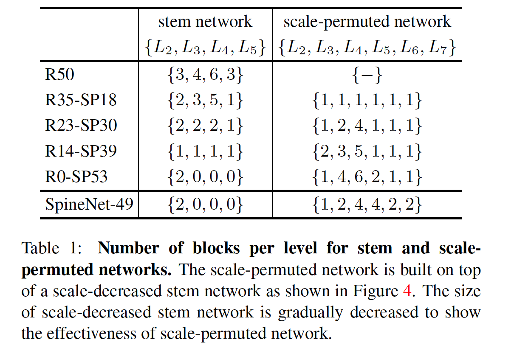

​		为了公平比较，我们将搜索空间限制到仅包含scale permutation和cross-scale connection。然后，我们使用强化学习来训练控制器，从而生成模型架构。与 [6] 相似，对于生成的架构中没有连接到任何更高顺序的块的中间块，我们将它们连接到相应水平的输出块。注意，cross-scale连接仅引入很小的计算开销，这在3.2节中讨论。因此，该系列中的所有模型都具有与ResNet-50类似的计算。图4显示了该系列中一系列已学习的模型架构。

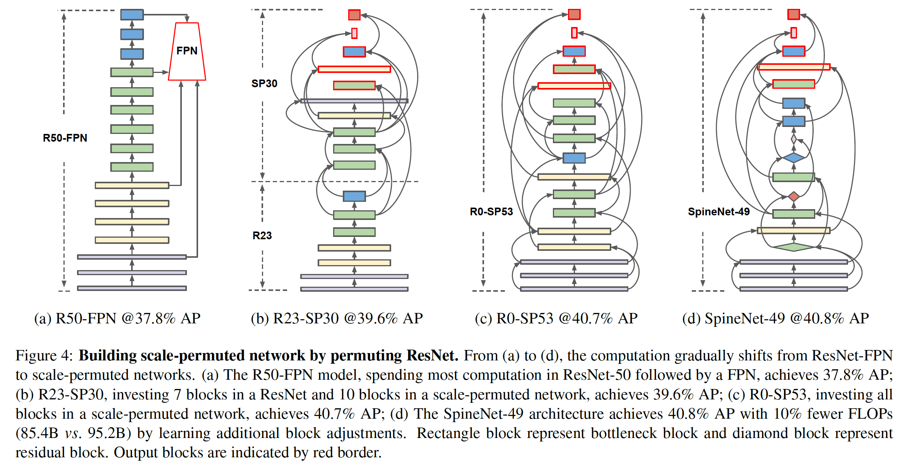

#### 3.4. SpineNet Architecture

​		为此，我们设计scale-permuted模型，并与ResNet进行了比较。但是，使用ResNet-50的构建块可能不是构建scale-permuted模型的最优选择。我们怀疑最佳模型可能与ResNet具有不同的特征分辨率和块类型分布。因此，我们还将在3.1节中提出在搜索空间中进行其他块调整。学习到的模型架构称为 SpineNet-49，其中架构如图4d所示，每个水平中块的数量见表1。

​		基于SpineNet，我们在SpineNet系列中构建了四个架构，这些模型在各种延迟性能平衡方案中均能很好地发挥性能。模型表示为 SpineNet-49S/96/143/190：SpineNet-49S与SpineNet-49有相同的架构，但是整个网络中的特征维度均匀地缩小0.65倍。SpineNet-96通过重复每个块 $\mathbf{B}_k$ 两倍来加倍SpineNet-96。构建块 $\mathbf{B}_k$ 重复为 $\mathbf{B}_k^1$ 和 $\mathbf{B}_k^2$，然后依次连接它们。第一个块 $\mathbf{B}_k^1$ 连接到输入父块，后一个块 $\mathbf{B}_k^2$ 连接到输出目标块。SpineNet-143和SpineNet-190重复每个块3次和4次，从而增长模型深度，并将重采样操作中的 $\alpha$ 调整到 1.0 。图6展示通过重复块增长模型的示例。

​		注意，在新的构建块（例如DetNAS中使用的ShuffleNetV2块）或 efficient model scaling [38] 中的最新工作用于SpineNet。这些改进可能与这项工作正交。

### 4. 应用

#### 4.1. 目标检测

​		通过简单地替换默认的ResNet-FPN主干模型，即可使用RetinaNet检测器学习SpineNet架构。我们遵循 [22]（RetinaNet） 中的类和边界框子分支的架构设计：对于SpineNet-49S，我们使用在特征维度128上使用4个共享卷积层；对于SpineNet-49/96/143，我们在特征维度256上使用4个共享卷积层；对于SpineNet-190，我们通过在特征维度512上使用7个共享卷积层来放大子网络。我们证明SpineNet也可以用作Mask R-CNN检测器的骨干，并能改善边界框检测和实例分割。

#### 4.2. 图像分类

​		为了证明SpineNet有潜力泛化到其他视觉识别任务，我们将SpineNet用于图像分类。我们利用相同的 $P_3$ 到 $P_7$ 的特征金字塔来构建分类网络。具体而言，通过上采样和平均特征图生成最终的特征图 $P = \frac{1}{5}\sum_{i=3}^i \mathcal{U}(P_i)$ ，其中 $\mathcal{U}(\cdot)$ 是最近邻上采样以确保所有特征图的尺度与最大的特征图 $P_3$ 有相同的尺度。在 $P$ 上应用标准的全局平均池化来产生256维的特征向量，接着是一个具有softmax的先行分类器进行分类。

### 5. 实验

​		对于目标检测，我们在COCO数据集上评估SpineNet。所有模型在train2017上训练。我们在test-dev上报告主要结构COCO AP，在val2017上报告其他结果。对于图像分类，我们在ImageNet ILSVRC-2012和iNaturalist-2017上训练SpineNet，并报告Top-1和Top-5验证准确率。

#### 5.1. 实验设置

​		**训练数据预处理：**对于物体检测，我们将较大的图像（从640到896、1024、1280）馈送到较大的SpineNet。图像的长边调整到目标大小，然后在短边填充零以构成正方形图像。对于图像分类，我们使用 $224 \times 224$ 的标准输入尺寸。训练期间，我们采用标准的数据增强（尺度和纵横比增强、最急裁剪和水平翻转）。

​		**训练细节：**对于目标检测，我们通常遵循 [22、6] 以采用相同的训练协议（表示为 protocol A）来训练SpineNet和ResNet-FPN模型以进行图4中描述的受控实验。简而言之，我们使用具有4e-5权重衰减和0.9动量的随机梯度下降法在Cloud TPU v3设备上进行训练。所有模型在COCO train2017上以256的batch-size从头训练250个周期。初始学习率设置为0.28，并在前5个周期中使用线性warmup。学习率在接下来的30和10个周期分别乘以0.1和0.01。我们遵循 [8] 以应用动量为0.99的SyncBatchNorm，接着是ReLU和用于正则化的DropBlock。我们应用具有如 [6] 中的 $[0.8,1.2]$ 之间的随机尺度的多尺度训练。在RetinaNet实现中，对于SpineNet-96或者更小的模型，将base anchor size设置为3，对于SpineNet-143或更大的模型，base anchor size设置为4。对于我们的报告结果，我们采用改进的训练协议，将其表示为 protocol B。为了简单起见，protocol B移除DropBlock，并利用 $[0.5,2.0]$之间的随机尺度进行更强的多尺度训练350个周期。为了最具竞争性的结果，我们添加随机深度 [15] 进行更强的正则化，并将ReLU替换为swish激活 [28] 以训练所有模型 500 个周期，表示为protocol C。对于图像分类，所有模型利用4096的batch-size训练200个周期。我们使用余弦学习速率衰减[11]以及学习速率的线性缩放和前5个阶段的逐步预热[7]。

​		**NAS 细节：**我们实现[44]中给予RNN的控制器进行架构搜索，因为它是我们知道的唯一支持搜索permutation的方法。我们从train2017保留7392张图像作为搜索的验证集。为了加速搜索过程，我们将SpineNet-49的特征维度统一缩小0.25倍，在采样中，将 $\alpha$ 设置为 0.25 ，并在边界框和类分支中使用特征维度64。为了防止搜索空间呈指数增长，我们限制中间块以在已构建的最后5个块中搜索父块，并允许输出块从所有现有块中搜索。在每次采样中，在512的图像分辨率上训练proxy task五个周期。收集proxy task在留下的验证集上的AP作为奖励。控制器并行地使用 100 个 Cloud TPUv3以采样子模型（child model）。在采样6k、10k、13k、13k和14k架构之后，发现R35-SP18、R23-SP30、R14-SP39、R0-SP53和SpineNet-49的最佳架构。

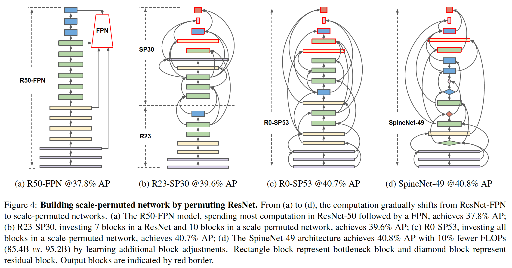

#### 5.2. Learned Scale-Permuted Architectures

​		在图4中，我们观察到scale-permuted的模型具有permutations，使得中间特征经历了不断上采样和下采样特征图的变换，与尺度递减的主干相比显示出很大的差异。连接两个相邻的中间块以构成“deep”路径是非常常见的。输出块表现出不同的行为，希望使用更长距离的连接。在5.5节中，我们执行消融研究来证明学习到的scale-permutation和connection的重要性。

#### 5.3. ResNet-FPN vs. SpineNet

​		我们首先介绍第3.3节中讨论的4个scale-permuted模型的目标检测结果，并将其与ResNet50-FPN基线进行比较。表3中的结果支持我们的主张：（1）尺度递减主干模型不是目标检测主干模型的好设计；（2）在所提出的scale-permuted模型上分配的计算产生更高的性能。

​		与R50-FPN基线相比，R0-SP53使用相似的构建块，并利用学习到的scale-permutation和cross-scale connection获得2.9%的AP增加。SpineNet-49模型通过将FLOPs减小10%而进一步提高效率，同时通过添加尺度和块类型调整来达到与R0-SP53相同的精度。

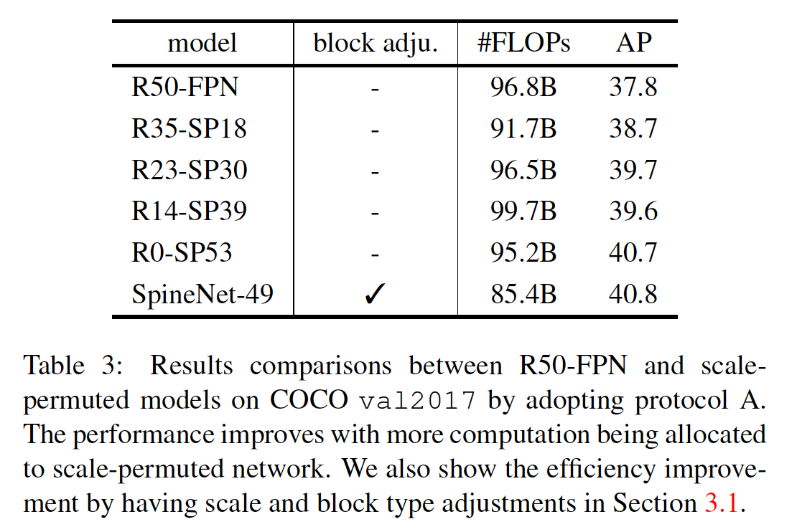

#### 5.4. 目标检测结果

​		**RetinaNet：**我们在COCO便即可检测任务上利用RetinaNet检测器评估SpineNet架构。结果见表2。SpineNet模型在各种诸如YOLO，ResNet-FPN和NAS-FPN模型大小上的准确性和效率方面都比其他流行的检测器好得多。最大的SpineNet-190在单模型目标检测（没有测试时增强）上获得52.1%的AP。我们还展示采用protocol A和B的SpineNet、ResNet-FPN和NAS-FPN的性能比较，见表4。

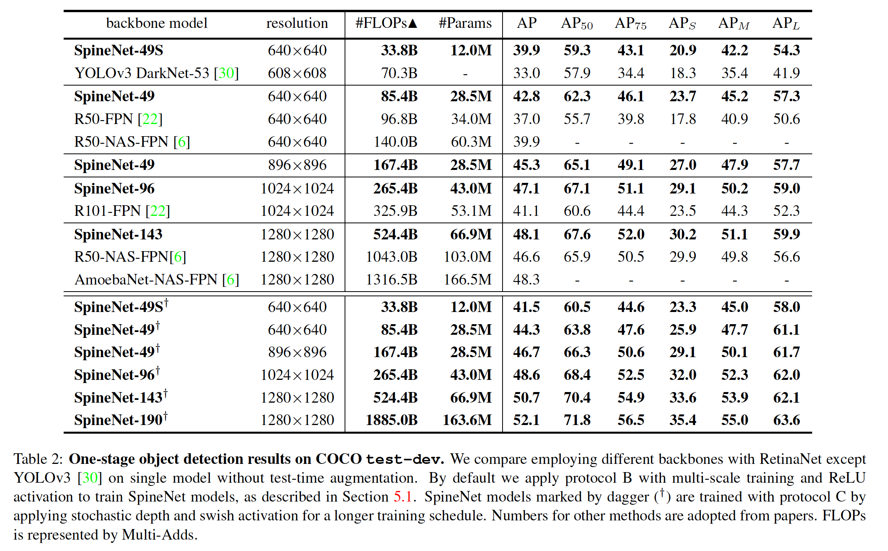

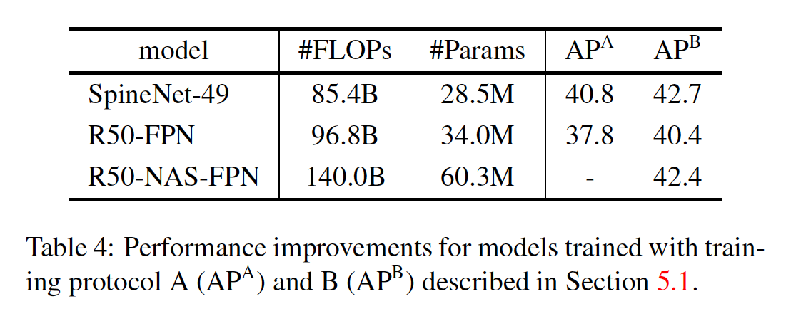

​		**Mask R-CNN：**在这里，我们介绍SpineNet在边界框检测和实例分割中使用Mask R-CNN实现了强大的性能。表6给出在val2017上SpineNet与其他主干（例如ResNet-FPN和HRNet）的性能比较。我们衡量Mask R-CNN实现中评估SpineNet的性能。HRNet性能采用开源实现。与RetinaNet结果一致，SpineNet能够使用较少的FLOP和参数，但在各种模型尺寸下都可以实现更好的AP和Mask AP。注意，SpineNet是使用RetinaNet进行边界框检测的学习方法，但可与Mask R-CNN很好地配合使用。

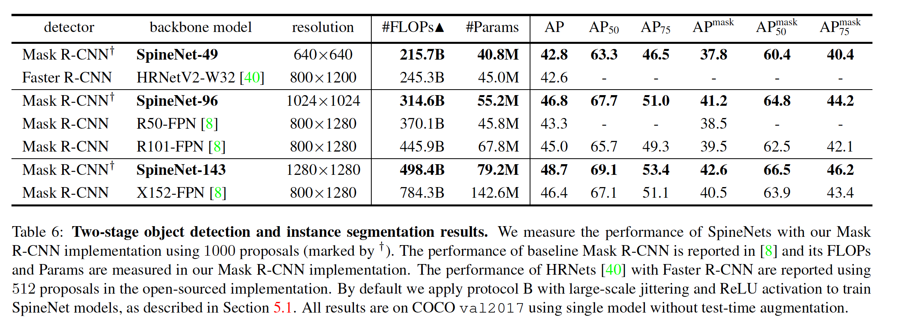

​		**实时目标检测：**我们的带有RetinaNet的SpineNet-49S和SpineNet-49在利用NVIDIA TensorRT的V100 GPU上一起以30+ fps的速度运行。我们使用端到端的流水线（包括预处理、边界框和类得分生成和具有NMS的后处理）来测量延迟，见表5。

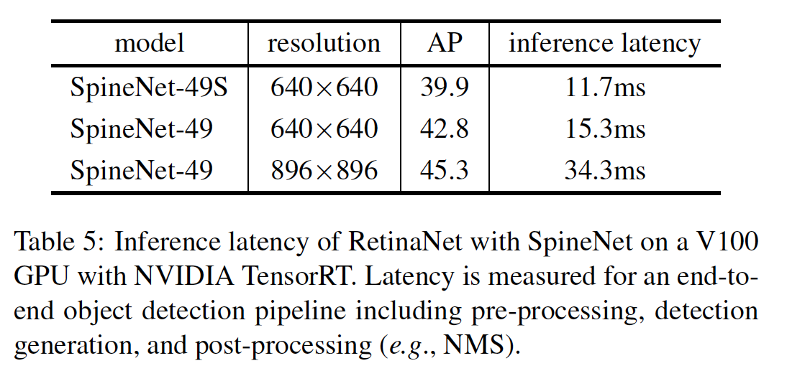

#### 5.5. 消融研究

​		**Scale Permutation的重要性：**我们通过比较学习scale permutation与固定顺序的特征尺度来研究学习到的scale permutation的重要性。我们在编码器-解码器网络中选择两种流行的架构形状：（1）受 [27、21] 启发的Hourglass形状；（2）受 [33] 启发的Fish形状。表8展示了Hourglass形状和Fish形状架构中特征块的顺序。然后，我们使用3.1节中描述的相同搜索空间学习cross-scale connection。该性能表明，联合学习scale permutation和cross-scale连接比仅学习具有固定架构形状的连接要好。注意，可能存在一些架构变体，以使Hourglass和Fish形状模型的性能更好，但是我们仅尝试使用最简单的固定尺度顺序之一。

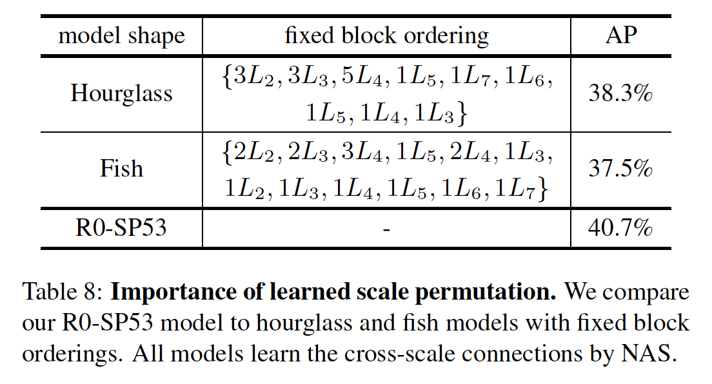

​		**Cross-scale Connections的重要性：在scale-permuted网络中，Cross-scale connection在融合不同分辨率的特征方面起着重要作用。对于R0-SP53的scale-permuted网络中的每个块，cross-scale 在三个方面被损坏：（1）删除短范围连接；（2）删除长范围连接；（3）删除两种连接，然后通过顺序连接将一个块连接到其先前的块。在三种情况下，一个块仅连接到另一个块。在表9中，我们证明scale-permuted网络对此处提出的任何边删除技术均敏感。（2）和（3）产生的损坏比（1）严重，这可能是应为短范围连接或顺序连接不能有效地处理频繁的分辨率变化。

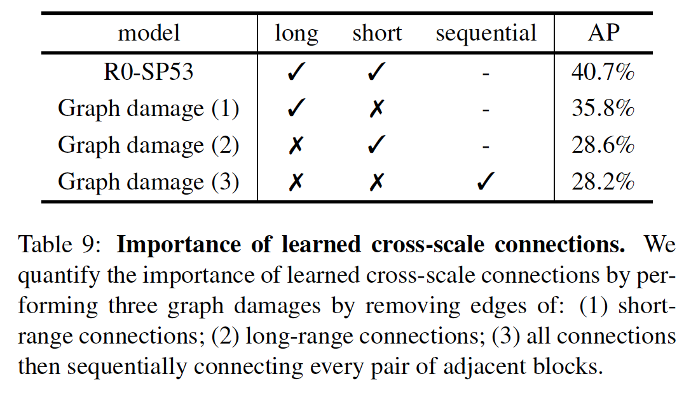

#### 5.6. Image Classification with SpineNet

​		表7给出图像分类的结果。在相同设置下，SpineNet在ImageNet上的性能与ResNet相当，但是FLOPs远低于ResNet。在iNaturalist上，SpineNet比ResNet高大约5%。注意，iNaturalist-2017是来自5089个类的579184张训练图像和95986验证图像的挑战性细粒度分类数据集。

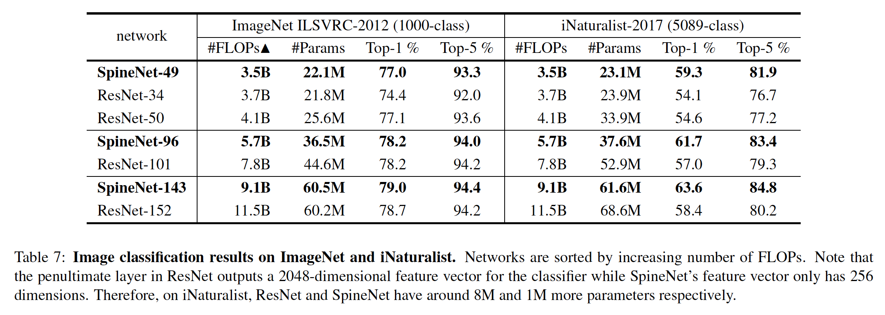

​		为了更好地理解在iNaturalist上的改进，我们创建了iNaturalist-bbox，其中的目标由在[39]中收集的ground-truth边界框裁剪而成。这个想法是创建一个位于每幅图像中的标志性的单尺度目标的Naturalist版本，以便更好地了解性能改进。具体而言，我们裁剪所有有用的边界框（将裁剪区域扩大到边界框宽高的1.5倍，从而包含目标周围的上下文），产生来自2854个类的496164张训练图像和48736张验证图像。在iNaturalist-bbox中，SpineNet-49的top-1/top-5准确率为63.9%/86.9%，ResNet50的top-1/top-5准确率为59.6%/83.3%，SpineNet-49的准确率提高4.3%。在原始iNaturalist数据集上，SpineNet-49的Top-1准确率相对于ResNet-50的改进为4.7％。基于这种实验，我们相信iNaturalist的改进不是由于捕获不同尺度的目标，而是如下2个原因：**1）借助SpineNet的多尺度特征来捕获细微的局部差异； 2）更紧凑的特征表示（256维），不太可能过拟合。**

#### Appendix A:  Mobile-size Object Detection

​			对于mobile-size目标检测，我们使用[37]中提出的参数化方法探索使用MBConv块构建SpineNet，MBConv是带有SE模块[13]的倒置瓶颈块[32]。遵循[37]，我们将 $L_1$ 到 $L_7$ 的MBConv块的特征维度设置为 $\{16,24,40,80,112,112,112\}$、扩展比例设置为6和核大小为 $3 \times 3$ 。与[37]相似，我们分别用特征维度为 8 的 $3\times3$ 卷积和 $L_1$ MBConv块替换stem中的第一个卷积和maxpooling，并将第一个$L_2$块的步长设置为2。重采样中用于调整特征尺寸的第一个 $1\times1$ 卷积已删除。重采样操作和box/class网络中的所有卷积层替换为separable convolution，从而有与MBConv块相当的计算。将box/class网络中的特征维度减小到48。我们将SpineNet-49的特征维度缩小0.6倍和0.65倍，进一步构建SpineNet-49XS和SpineNet-49S，并将box/class网络的特征维度分别设置为24和40。我们采用具有Swish激活的protocol B来训练具有RetinaNet的所有模型600个周期，其中SpineNet-49XS的分辨率为256，其他模型的分辨率为384。表10给出了结果，图2绘制了FLOPs vs. AP 曲线。SpineNet-49XS/49S/49使用MBConv块构建，使用的计算较少，但性能比MnasNet、MobileNetV2和MobileNetV3高出2-4％。

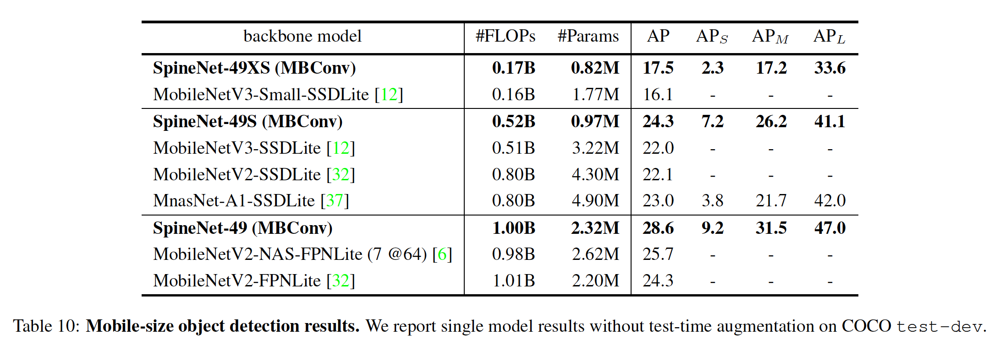

​		注意，由于本节中的所有模型都使用手工设计的MBConv块，因此性能不应比与NAS联合搜索的SpineNet和MBConv块更好。

### Appendix B:  Image Classification

​		受protocol C启发，我们使用如下训练协议进行SpineNet分类实验：1）添加随机深度，2）将ReLU替换为Swish激活以及3）使用0.1的label smoothing。见表11，我们可以看出，在ImageNet上，改进的训练协议产生大约1%的top-1增加，而iNaturalist-2017上产生3-4%的top-1增加。