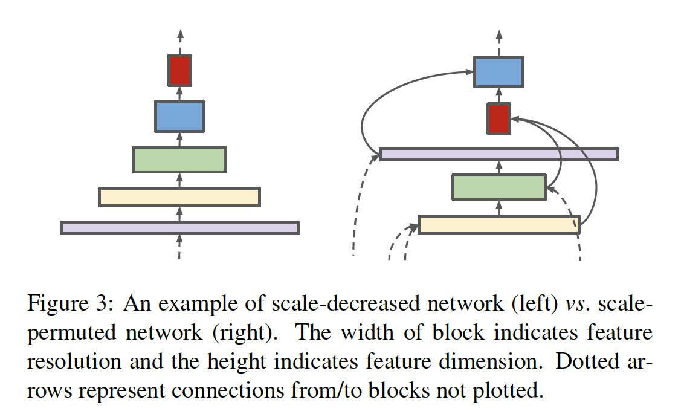
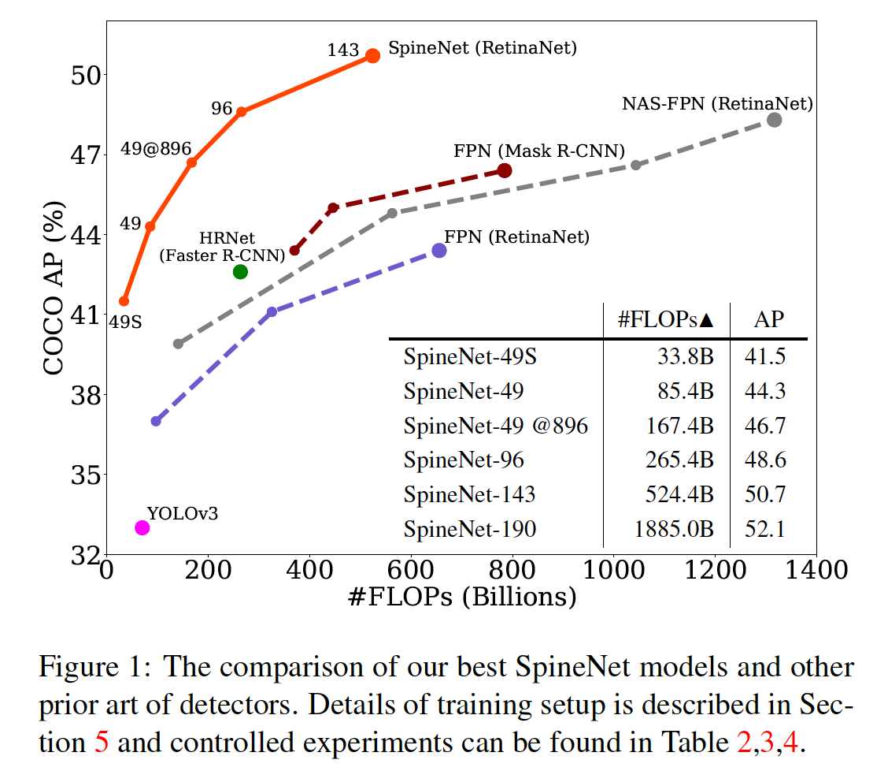

## SpineNet: Learning Scale-Permuted Backbone for Recognition and Localization

### 摘要

​		卷积神经网络通畅将输入图像编码为一系列具有递减分辨率的中间特征。虽然这种结构适合分类任务，但是它不能很好的进行需要同时识别和定位的任务（例如目标检测）。提出encoder-decoder架构，以通过将解码器网络应用于为分类任务而设计的骨干模型上来解决此问题。本文中，我们认为，由于尺度递减的主干，encoder-decoder架构在生成强壮的多尺度特征方面不是有效的。我们提出SpineNet，通过神经架构搜索在目标检测任务中学习具有尺度排列的中间特征和跨尺度连接的主干。使用类似的构建块，SpineNet模型在各种尺度上的性能比ResNet-FPN模型高3％+ AP，同时使用的FLOP减少了10-20％。特别地，在COCO上，在没有测试时增强时，具有 SpineNet-190 的单模型获得52.1%的AP，这明显比之前的最佳检测器好。SpineNet可以迁移到分类任务，在具有挑战性的iNaturalist细粒度数据集上实现了5％的top-1精度提高。代码见 https://github.com/tensorflow/tpu/tree/master/models/official/detection 。

### 1. 引言

​		在过去几年，我们见深度卷积神经网络设计的显著进步。尽管通过增加深度和宽度 [10、43]，网络获得更强的能力，但是自从卷积神经网络的方面起，元架构设计仍未改变。大多数网络都遵循将输入图像编码为具有单调降低分辨率的中间特征的设计。网络架构设计的大多数改进是在特征分辨率组[19、10、14、45]中增加了网络深度和连接。LeCun等 [19] 解释这种尺度递减架构设计背后的动机：**“可能需要高分辨率才能检测特征的存在，而无需以同样高的精度确定其确切位置”**。

​		但是，尺度减小的模型可能无法为识别和定位都很重要的多尺度视觉识别任务提供强大的特征（例如，目标检测和分割）。Lin等 [21] 证明，由于低特征分辨率，直接使用尺度递减模型的顶层特征不能很好地检测小型目标。[21、1] 提出多尺度encoder-decoder架构来解决这个问题。将尺度递减网络作为encoder，其通常称为 backbone 模型。然后，将decoder网络用于backbone，以恢复特征分辨率。decoder网络的设计与backbone模型完全不同。典型的decoder网络包含一系列跨尺度的连接，其结合backbone的低层和高层特征，从而生成强壮的多尺度特征图。通常，backbone模型有更多的参数和计算（例如特征金字塔），而保持decoder相同时获得更强encoder-decoder模型的常用策略。

​		在本文中，我们旨在回答这个问题：**尺度递减模型是否是用于同时识别和定位的良好骨干架构设计？**直觉上，尺度递减骨干通过下采样丢弃空间信息，这使解码器网络难以恢复。有鉴于此，我们提出了一种称为尺度置换（scale-permuted）模型的元架构，对骨干架构设计进行了两项重大改进。**第一，中间特征图的尺度应当能够随时增加或减少，以便模型可以随着深度的增加而保留空间信息。第二，特征图之间的连接应当能够跨越特征尺度，从而促进多尺度特征融合。**图 3 证明尺度递减和尺度置换网络之间的差异。

​		尽管我们想到的是简单的元架构设计，但可能的实例化随着模型深度的增加而组合增长。为了避免手动筛选大量的设计选择，我们利用神经架构搜索（NAS）[44] 来学习架构。骨干模型在COCO数据集的目标检测任务上学习，该任务需要同时识别和定位。受最近NAS-FPN [6] 的启发，我们在实验中使用简单的一阶段 RetinaNet 检测器。与 NAS-FPN 学习特征金字塔相比，我们学习骨干模型架构，并将其直接连接到后面的分类和边界框回归网络。整个骨干模型都可以看作并用作特征金字塔网络。

​		将 ResNet-50 骨干作为基线，我们使用ResNet-50中的瓶颈块作为搜索空间中的候选特征块。我们学习（1）特征块的置换（permutation）和（2）每个特征块的两个输入连接。搜索空间中的所有候选模型与ResNet-50有大致相同的计算，因为我们仅置换特征可的顺序以获得候选模型。在目标检测任务中，学习到的尺度置换模型比ResNet-50-FPN好+2.9%AP。通过添加搜索选项调整尺度和每个候选类型（例如残差馈或瓶颈块）可以进一步提高效率（-10%FLOPs）。我们称学习到的尺度置换骨干架构为 SpineNet。大量实验证明尺度置换和跨尺度连接对于构建强壮的骨干模型进行目标检测至关重要。图1显示了SpineNet与最新的目标检测工作的全面比较。

​		我们进一步在ImageNet和iNaturalist分类数据集上评估SpineNet。即使通过目标检测学习SpineNet架构，它也可以很好地迁移到分类任务中。特别地，在iNaturalist细粒度分类数据集上，SpineNet的top-1精度比ResNet高出5％，其中iNaturalist需要通过细微的视觉差异和局部特征来区分类别。直接将 SpineNet 用于分类任务的能力证明，尺度置换骨干是通用的，并且有可能成为许多视觉识别任务的统一模型架构。

### 2. 相关工作

#### 2.1. 骨干模型

​		卷积神经网络的开发进展主要在ImageNet分类数据集中得到证明 [4] 。研究人员已通过增加网络深度 [18]、新颖的网络连接 [10、35、36、34、14、13]、增强模型能力 [43、17]和效率 [3、23、12、38] 来改进模型。多项工作表明，使用具有更高ImageNet精度的模型作为主干模型可以在其他视觉预测任务中实现更高的精度 [16、21、1]。

​		但是，即使与诸如 [21、1] 的 decoder 结合。为 ImageNet 开发的骨干可能对于定位任务不是有效的。DetNet [20]认为下采样特征会损害其定位能力。HRNet [40]尝试通过添加并行的多尺度互连分支来解决该问题。Stacked Hourglass [27] 和 FishNet [33] 提出具有skip连接的循环下采样和上采样架构。与为ImageNet开发的骨干不同，为ImageNet开发的骨干主要是尺度递减的，上述几种工作考虑在上采样和下采样上构建的骨干。在5.5节中，我们比较尺度置换模型与Hourglass和Fish形状架构。

#### 2.2. 神经架构搜索

