## Revisiting the Sibling Head in Object Detector

**摘要**

​		“分类和定位的共享头部”（sibling head）最早是在Fast RCNN [9]中使用的，在过去五年中一直引领着目标检测社区的潮流。本文提供的观察结果是，sibling head中两个目标函数之间的空间不对齐会严重损害训练过程，但是这种不对齐可以通过称为任务感知空间解藕（Task-aware Spatial Disentanglement：TSD）的非常简单操作来解决。考虑到分类和回归，TSD通过为它们生成两个解藕的提议将它们与空间维度解耦，这些提议由共享提议估计。这是受自然洞察力启发的，例如，某个显着区域中的特征可能具有丰富的分类信息，而边界附近的特征可能擅长于边界框回归。令人惊讶的是，这种简单的设计可以将MS COCO和Google OpenImage上的所有骨干和模型始终提高3％mAP。此外，我们提出了一个渐进约束（progressive constraint），以扩大解藕和共享提议之间的性能边界，并提高1％的mAP。我们证明TSD大幅突破了当今单模检测器的上限（ResNet-101的mAP为 49.4，SENet154的mAP为51.2），并且是我们在Google OpenImage Challenge 2019上排名第一的解决方案的核心模型。

### 1.	引言

​		由于开创性的R-CNN系列[10、9、30]和强大的FPN [21]实现了目标检测性能的突破，因此该任务的后续性能增强似乎受到某些隐藏瓶颈的阻碍。即使已经研究了AutoML [8，38]支持的高级算法，性能提升仍然限于易于达到的改进范围。作为与通用目标分类任务最明显的区别，用于分类和定位的专用sibling head成为焦点，并广泛用于大多数高级检测器中，包括单阶段系列[25、33、12]、两阶段系列[ 5、18、40、26、19]和无锚系列[17]。考虑到不同的任务共享几乎相同的参数，一些工作开始意识到sibling head中两个目标函数之间的冲突，并试图找到一种折衷的方法。

​		IoU-Net[15]是第一个反应这个问题的方法。它们发现生成良好分类得分的特征始终预测粗糙的边界框。为了处理这个问题，它们首先引入一个额外的头部来预测IoU，作为定位置信度，然后将定位置信度和分类置信度聚合到一起作为最终的分类得分。这个方法减小了不对齐问题，但是是以一种折衷的方式——其背后的基本原理是相对提高紧凑边界框的置信度，并降低不良框的置信度。这种不对齐仍存在于每个空间点。沿着这个方向，提出Double-Head R-CNN[35]来将sibling head解藕到两个特定的分支以分别进行分类和定位。尽管每个分支都经过精心设计，但是可以认为通过添加新分支来消除信息纠缠，实质上减少了两个任务的共享参数。**尽管通过这种检测头部的解藕可以获得令人满意的性能，但是由于馈送给两个分支的特征是由同一提议的ROI 池化产生的，因此两个任务之间仍然存在冲突。**

​		在本文中，我们认真地重新审视了基于锚的目标检测器中的sibling head，以寻找任务未对齐的本质。我们在FPN的特征金字塔的每一层的输出特征图上探索分类和定位的空间敏感性。基于常用的sibling head（全连接的头部$2-fc$），我们在图1中展示空间敏感热图。第一列是分类空间敏感热图，而第二列为位置空间敏感热图。越温暖的颜色越好。我们还在第三列展示它们的3D可视化。很明显，在某些情况下，某些显着区域中的特征可能具有丰富的分类信息，而边界附近的特征可能擅长于边界框回归。无论是发展骨干网络还是增强检测头部，这种在空间维度上的根本任务不对齐都极大地限制了性能提升。换句话说，如果检测器尝试从同一空间位置/颜色推理分类得分和回归结果，那么它总是会得到不完美的平衡结果。

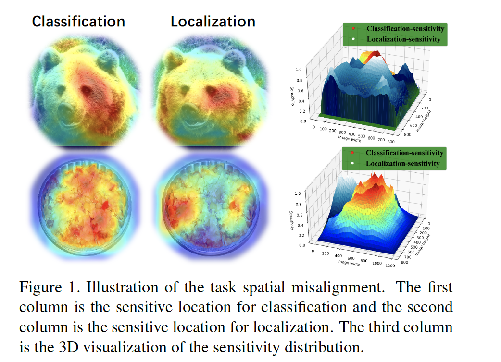

​		这种明显的观察结果启发我们重新思考sibling head的架构。不对齐问题的最优解决方案应当通过空间解藕来探索。基于此，我们提出新颖的操作（称为*task-aware spatial disentanglement*（TSD））来解决这个障碍。TSD的目的是**在空间上解藕分类和定位的梯度流动**。为了达到这一目标，TSD基于分类sibling head中的原始提议，为这两个任务生成两个解藕提议。它允许两个任务自适应地搜索空间上的最优位置，而不会相互影响。利用这种设计，MS COCO和Google OpenImage上的所有骨干和模型的性能提升大约3%的mAP。此外，我们提出*progressive constraint（PC）*来扩大TSD和经典的sibling head之间的性能边界。它引入了超参数*margin*，以提倡更加自信的分类和精确的回归。在TSD的基础上，可提高约1％的mAP。无论是用于不同的主干网络还是用于不同的检测框架，集成算法都可以将性能稳定地提高4％，甚至对于轻量级MobileNetV2而言也有大约6％的提高。在突出的性能增加之后，仅增少量的参数，这对于繁重的骨干来说是可忽略的。

​		总之，本文的贡献如下：

​		1）我们深入研究了基于RoI的检测器中复杂任务背后的主要障碍，并揭示了限制检测性能上限的瓶颈。

​		2）我们提出简单的操作（称为task-aware spatial disentanglement（TSD））来处理复杂的任务冲突。通过任务感知的提议估计和检测头部，可以生成任务特定的特征表示来消除分类和检测之间的折衷。

​		3）我们进一步提出*progressive constraint（PC）*来扩大TSD和经典sibling head之间的性能边界。

​		4）我们通过彻底的消融研究，验证了我们的方法在标准COCO基准和大规模OpenImage数据集上的有效性。与最佳的方法相比，我们所提出的方法使用单模型的ResNet-101骨干获得49.4的mAP，而使用SENet154的模型获得51.2的mAP。

### 2.	方法

​		本节中，我们首先描述TSD的整体框架，然后在2.2节和2.3节中详细介绍各个子模块。最后，我们研究了sibling head的固有问题，并展示了TSD的优势。

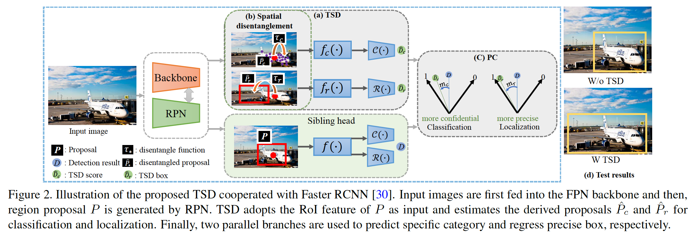

#### 2.1. TSD

​		如图2（a）所示，将矩形边界框提议表示为$P$，具有类 $y$ 的ground-truth边界框表示为$\mathcal{B}$，经典的Faster RCNN旨在基于共享的$P$，最小化分类损失和定位损失：

$$\mathcal{L}=\mathcal{L}_{cls}(\mathcal{H}_1(F_l, P), y) + \mathcal{L}_{loc}(\mathcal{H}_2(F_l, P), \mathcal{B}) \tag{1}$$

其中$\mathcal{H}_1(\cdot) = \{f(\cdot), \mathcal{C}(\cdot)\}$，$\mathcal{H}_2(\cdot) = \{f(\cdot), \mathcal{R}(\cdot)\}$。$f(\cdot)$是特征提取器，而$\mathcal{C}(\cdot)$和$\mathcal{R}(\cdot)$是将特征变换到预测特定类别和目标位置的函数。开创性工作[35]（Rethinking classification

and localization in r-cnn）认为，用于分类和定位的共享$f$不是最优的，他们分别将其分解为用于分类和回归的$f_c$和$f_r$。尽管适当的头部解藕带来可观的改善，但是由纠缠的任务在空间维度上引起的固有冲突仍在存在。

​		对于潜在的问题，我们的目标是通过从空间维度解藕任务来缓解sibling head的固有冲突。我们提出新颖的TSD head，如图2所示。在TSD中，式（1）可以写为：

$$\mathcal{L}=\mathcal{L}_{cls}^D(\mathcal{H}_1^D(F_l, \hat{P}_c), y) + \mathcal{L}_{loc}^D(\mathcal{H}_2^D(F_l, \hat{P}_r), \mathcal{B}) \tag{2}$$

其中从共享的$P$上解藕的提议$\hat{P}_c = \tau_c(P, \Delta C)$和$\hat{P}_r=\tau_r(P, \Delta R)$。$\Delta C$是$P$的逐点变形（deformation），而$\Delta R$是逐提议的平移。在TSD中，$\mathcal{H}_1^D(\cdot) = \{f_c(\cdot), \mathcal{C}(\cdot)\}$，$\mathcal{H}_2^D(\cdot) = \{f_c(\cdot), \mathcal{R}(\cdot)\}$。

​		特别地，TSD要求将$P$的RoI特征作为输入，然后为分类和定位分别生成解藕提议$\hat{P}_c$和$\hat{P}_r$。可以通过单独的提议将不同的任务从空间维度上解藕。通过并行的分支生产分类特定的特征图$\hat{F}_c$和位置特定的特征图$\hat{F}_r$。在第一个分支中，$\hat{F}_c$馈入三层全连接网络进行分类。在第二个分支中，与提取的提案$\hat{P}_r$相对应的RoI特征$\hat{F}_r$将被提取并馈入与第一个分支相似的架构中，以执行定位任务。通过解藕分类和定位的共享提议，TSD可以自适应的学习任务感知的特征表示。TSD适用于大多数现有的基于RoI的检测器。由于训练过程采用端到端的方式与精心设计的渐进约束（progressive constraint：PC）配合使用，因此对于骨干和输入分布的更改（例如使用不同的数据集进行训练）具有鲁棒性。

#### 2.2. Taskaware spatial disentanglement learning

​		受图1启发，我们引入task-aware spatial disentanglement学习来缓解共享空间线索引起的不对齐。如图2（b）所示，将$P$的RoI特征定义为$F$，我们将deformation-learning形式嵌入到TSD以达到这个目标。对于定位，设计三层全连接网络$\mathcal{F}_r$来生成$P$上的逐提议平移，从而产生新的推导提议$\hat{P}_r$。这一过程形式化为：

$$\Delta R = \gamma \mathcal{F}_r(F;\theta_r)\cdot(w,h)\tag{3}$$

其中$\Delta R \in \mathbb{R}^{1\times1\times2}$，每层的$\mathcal{F}_r$的输出为$\{256, 256, 2\}$。$\gamma$预定义的用于修正$\Delta R$幅度的标量，而$(w,h)$是$P$的宽和高。用于生成$\hat{P}_r$的派生函数$\tau_r(\cdot)$为：

$$\hat{P}_r = P + \Delta R \tag{4}$$

式（4）表明逐提议的平移，其中$P$中每个像素坐标将利用相同的$\Delta R$平移到新的坐标。派生提议$\hat{P}_r$仅关注定位任务，并且在池化函数中，我们采用与[5]中相同的双线性插值来使$\Delta R$可微。

​		对于分类，给定共享的$P$，生成规则网格$k \times k$上的pointwise deformation来估计具有规则形状派生提议$\hat{P}_c$。对于第$(x,y)$个格子，在这个格子中的采样点上执行平移$\Delta C(x, y, \ast)$，从而获得$\hat{P}_c$的新采样点。这个过程可以形式化为：

$$\Delta C = \gamma \mathcal{F}_c(F;\theta_c) \cdot (w, h) \tag{5}$$

其中$\Delta C \in \mathbb{R}^{k \times k \times 2}$。$\mathcal{F}_c$是具有输出$\{256,256,k \times k \times 2\}$三层的全连接网络，$\theta_c$使可学习的参数。$\mathcal{F}_r$和$\mathcal{F}_c$中的第一层是共享的，从而减少参数。为了通过不规则的$\hat{P}_c$生成特征图$\hat{F}_c$，我们采用与可变性RoI池化[5]相同的操作：

$$\hat{F}_c(x,y) = \sum_{p \in G(x,y)}\frac{\mathcal{F}_B(p_0, \Delta C(x, y, 1), p_1 + \Delta C(x,y,2))}{|G(x,y)|} \tag{6}$$

其中$G(x,y)$是第$(x,y)$个格子，$|G(x,y)|$是该格子中样本点的数量。$(p_x,p_y)$是网格$G(x,y)$中的样本点的坐标，而$\mathcal{F}_B(\cdot)$是双线性插值[5]，从而使$\Delta C$可微。

#### 2.3.	Progressive constraint

​		在训练阶段，式（1）中定义的TSD和sibling detection head可以由$\mathcal{L}_{cls}$和$\mathcal{L}_{loc}$联合优化。除此之外，我们进一步设计*progressive constraint*（PC）来改善TSD的性能，如图2（c）所示。对于分类分支，PC公式化为：

$$\mathcal{M}_{cls}=|\mathcal{H}_1(y|F_l,p) - \mathcal{H}_1^D(y|F_l,\tau_c(P,\Delta C)) + m_c|_+\tag{7}$$

其中$\mathcal{H}(y|\cdot)$表示第$y$个类的置信度得分，$m_c$为预定义的边界。$|\cdot|_+$与ReLU函数相同

。相似地，对于定位，有：

$$\mathcal{M}_{loc}=|IoU(\hat{\mathcal{B}}, \mathcal{B}) - IoU(\hat{\mathcal{B}}_D, \mathcal{B}) + m_r|_+ \tag{8}$$

如果$P$是负提议，忽略$\mathcal{M}_{loc}$。根据这种设计，Faster RCNN的TSD整个损失函数可以定义为：

$$\mathcal{L} = \underbrace{\mathcal{L}_{rpn} + \mathcal{L}_{cls} + \mathcal{L}_{loc}}_{classical \mbox{ } loss} + \underbrace{\mathcal{L}_{cls}^D + \mathcal{L}_{loc}^D + \mathcal{M}_{cls} + \mathcal{M}_{loc}}_{TSD \mbox{ } loss} \tag{9}$$

我们直接设置损失权重为1，没有仔细调整它。在$\mathcal{L}$的优化之下，TSD可以自适应地分别学习分类和定位的任务特定的特征表示。第3节中的广泛实验表明从空间维度解藕纠缠的任务可以明显改善性能。

#### 2.4. Discussion in context of related works

​		本节中，我们深入研究纠缠任务的固有冲突。我们的工作与以前的工作在各个方面都有关系。 我们将详细讨论关系和差异。

##### 2.4.1	Conflict in sibling head with tangled tasks

​		经典Faster RCNN中的两个核心设计是预测给定提议的类别并学习回归函数。由于优化方面的本质差异，分类任务需要平移不变（translation-agnostic）属性，相反，定位任务需要平移可变（translation-aware）属性。分类和定位的特定平移敏感属性可以公式化为：

$$\begin{align}\mathcal{C}(f(F_l, P)) &= \mathcal{C}(f(F_l, P + \varepsilon)), \\ \mathcal{R}(f(F_l,P)) &\ne \mathcal{R}(f(F_l, P+\varepsilon)) \end{align} \tag{10}$$

其中$\forall\varepsilon$，$IoU(P+\varepsilon, \mathcal{B}) \ge T$。$\mathcal{C}$ 用于预测类概率，$\mathcal{R}$ 为回归函数，它的输出为 $(\Delta \hat{x}, \Delta \hat{y}, \Delta \hat{w}, \Delta \hat{h})$。$f(\cdot)$为经典的sibling head中的共享特征提取器，而$T$为确定$P$是否为正样本的阈值。在这两个任务是完全不同的属性。$F_l$中的共享空间线索和这两个任务的特征提取器成为妨碍学习的障碍。与设计进化的骨干或特征提取器的[35、15、5、43]不同，TSD通过单独的 $\hat{P}_\ast$ 和 $f_\ast(\cdot)$ 将分类和回归从空间维度解耦。

##### 2.4.2	Different from other methods

​		IoU-Net[15]首先展示分类和回归之间的不对齐。为了缓解这一问题，它通过额外的分支直接预测IoU来调整分类置信度。不幸的是，这种方法没有解决纠缠任务之间的固有冲突。对于这个相同的问题，Double-Head R-CNN[35]探索最优的架构进行分类和定位。为了学习更有效的特征表示，提出具有可变性RoI的DCN来从不规则区域提取语义信息。无论是发展骨干网络还是调整检测头部，都可以提高性能，但增长空间有限。

​		在本文中，我们观察到性能受限的根本问题是分类和定位之间空间维度上的不对齐敏感性。设计更好的特征提取方法或搜索最佳架构都无法解决此问题。在这个难题中，提出了TSD来将分类和定位从空间维度和特征提取器上分离。TSD首先通过分离的提议和特征提取器执行空间解藕，以进行分类和定位，从而打破这种困境。利用精心设计的PC，它可以分别学习分类和定位的最优敏感位置。此外，TSD仍然适用于DCN [5]，尽管DCN中的可变形RoI池化用于协助估计$\hat{F}_c$ 。通过 *task-aware spatial disentanglement* ，简单的TSD可以轻松地为不同骨干网实现出色的性能。

### 3.	实验

​		我们对80类MS-COCO数据集[23]（目标检测和实例分割）和500类OpenImageV5挑战数据集[16]进行了各种实验。对于COCO数据集，遵循标准的协议[27]，训练在80K训练图像和25K验证图像的子集上训练，并在余下的5K的验证图像（minival）上测试。我们还报告的20K test-dev上的结果。对于OpenImage数据集，遵循官方协议[16]，模型在1674979张训练图像上训练，并在34917张验证图像上评估。还在公开排行榜上报告了$\mbox{AP}_{.5}$。

#### 3.1. 实现细节

​		我们从ImageNet预训练的权重上初始化权重，并遵循已有的Faster R-CNN[30]的超参数配置。调整图像，使得图像的更短边为800像素。锚尺度和纵横比分别设置为8和$\{0.5, 1, 2\}$。我们在16个GPU上训练模型（有效mini-batch大型为32）32个周期，并且在第一个周期中，使用0.00125到0.04的学习率热启动策略。我们在第8个周期和第11个周期时减小10倍。在所有实验中，采用RoIAlign[13]，并且$\mathcal{H}_1^\ast$和$\mathcal{H}_2^\ast$中的池化大小都为7。我们使用SGD来优化训练损失，SGD的动量为0.9，权重衰减为0.001。除了使用标准的水平翻转外，不适用其他数据增强。使用Synchronized BatchNorm机制[29、11]使多GPU训练更加稳定。在推理阶段，使用具有0.5IoU阈值的NMS来移除复杂的边界框。对于OpenImage数据上的实验，使用类感知的采样。

#### 3.2. 消融研究

​		本节中，我们在COCO minival上进行详细的笑容研究来评估每个模块的有效性，并展示所提出的TSD的先进性和泛化能力。在这些实验中，$m_c$ 和 $m_r$ 设置为0.2。

​		**Task-aware disentanglement**	当处理纠缠的任务与sibling detection head发生冲突时，自然会考虑解藕不同的任务与主干或检测头部。为了评估这种思想，我们进行几个实验来展示它们之间的比较。如图3所示，我们设计不同的解藕选项，包括骨干解藕和头部解藕。详细的性能如表1所示。从骨干上解藕分类和定位极大地衰减了性能。它清楚地证明，骨干中的语义信息应当在不同任务中共享。正如期望的，任务特定的头部可以明显改善性能。与$D_{head}$相比，即使对于$\mbox{AP}_{.75}$，TSD w/o PC 也可以进一步增强AP，仅略为增加了参数量。当面对繁重的骨干时，略为增加的参数是平凡的，但是仍能显著改善性能。这也证实了 2.4.1节中的讨论，将任务从空间维度上解藕可以有效缓解sibling head中的固有冲突。

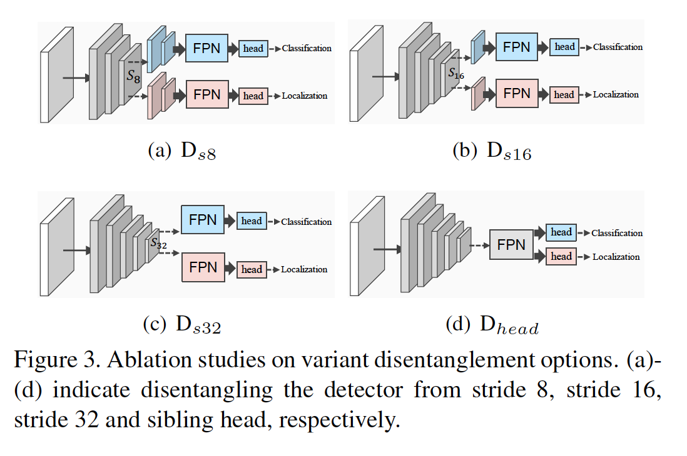	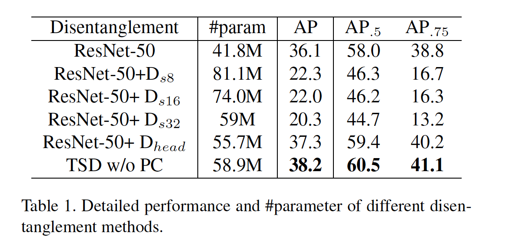

​		**Joint training with sibling head $\mathcal{H}_\ast$**	在TSD中，共享提议$P$还可在额外的sibling head中进行分类和回归。我们从经验上观察到，silbing head的训练与TSD的训练是互补的，结果在表2中得到了证明。这表明，派生$\hat{P}_c$和$\hat{P}_r$与原始提议$P$不冲突。在推理阶段，仅保留TSD 头部。

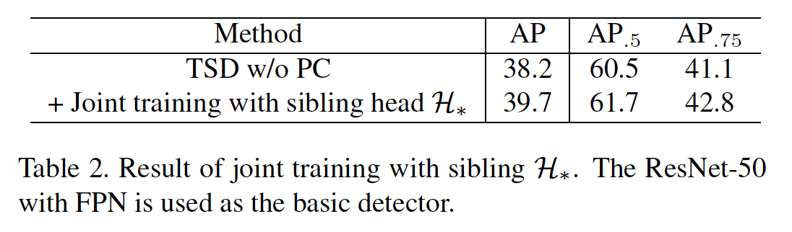

​		**PC的有效性**	在2.3节中，我们进一步提出PC来增强TSD的性能。表3报告详细PC的消融研究。我们发现PC将$\mbox{AP}_{.75}$提高1.5，而$\mbox{AP}_{.5}$几乎没有影响。这表明PC旨在提倡对准确边界进行更置信的分类和精确的回归。即使在严格的测试标准AP（IoU从$0.5:0.95$），也可以获得1.3 AP增益。

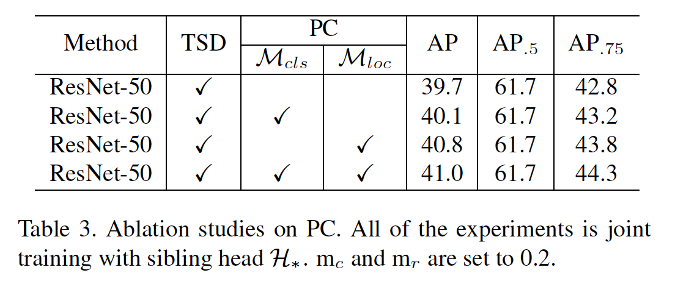

​		**Derived proposal learning manner for $\mathcal{H}_\ast^D$**	有不同的可编程策略来生成派生的提议 $\hat{P}_r$ 和 $\hat{P}_c$，包括等式（4）中的逐提议平移（proposal-wise translation）（$Prop.w$），逐点变形（point-wise deformation）（$Point.w$），例如可变形的RoI池化[5]或它们的复杂组合。为了探索这些学习方式的差异，我们使用ResNet-50对COCO minival进行了广泛的实验。表4展示了比较结果。这种结果表明，$Point.w$有利于分类任务，并与PC协同；$Prop.w$在定位上略有优势。对于生成派生提议，分类需要最优的局部特征，而不需要规则的形状限制，而回归需要维护全局几何形状信息。

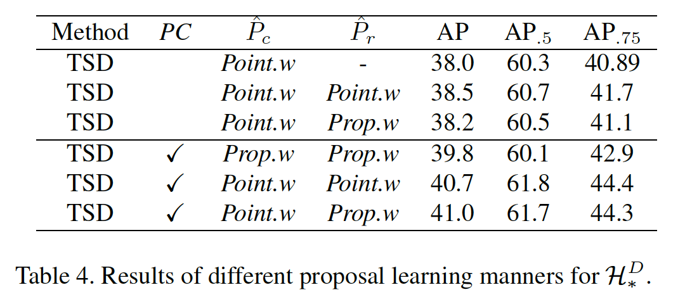

​		**Delving to the effective PC**	PC证明其在回归更准确边界框的优越性。超参数 $m_c$ 和 $m_r$ 在TSD的训练中起着重要作用，为了更好地了解它们对性能的影响，我们对它们进行了详细的消融研究。图4报告了结果，并注意到$\mathcal{M}_{loc}$ 和 $\mathcal{M}_{cls}$ 都可以进一步提高性能。

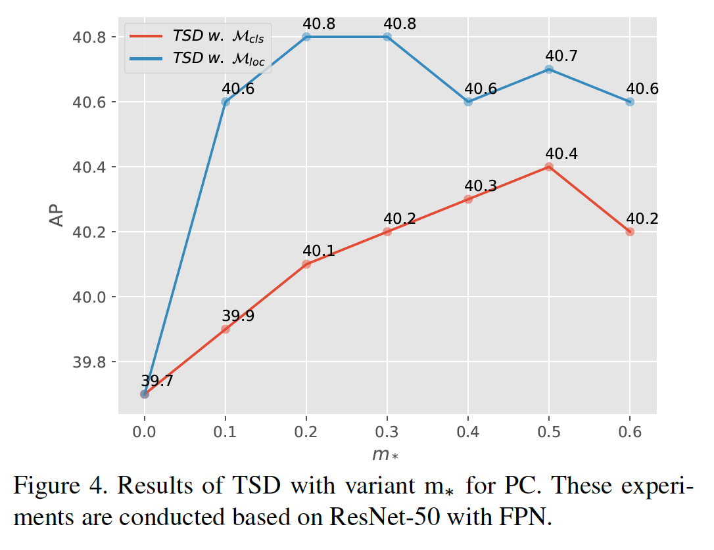

#### 3.3. Applicable to variant backbones

​		由于TSD和PC在带有FPN的ResNet-50上展示了其出色的性能，因此我们进一步研究了对变体骨干网络的适应。基于Faster R-CNN，我们直接进行具有不同骨干的实验，表5总结COCO minival上详细性能。TSD可以将性能稳定地提高3％5％，而额外的时间成本为10％。注意，具有58.9M参数的ResNet-152甚至优于有76.39M参数的ResNet-152。基于ResNet家族，与增加主干以提高性能相比，TSD是更可取的选择。如果未指定，则所有后续的TSD均表示TSD + PC。

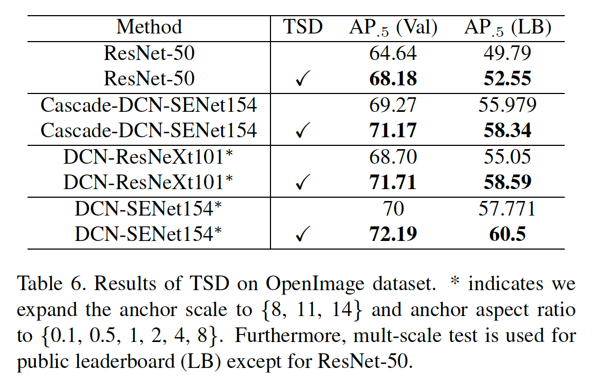

#### 3.4. Applicable to Mask R-CNN

​		所提出的算法在很大程度上超越了Faster R-CNN中的经典 sibling head。它的固有属性决定了它对其他R-CNN系列的适用性，例如Mask R-CNN的实例分割。为了验证这一结论，我们利用Mask R-CNN[13]进行实验。表7展示了性能，Mask R-CNN的训练配置与Faster R-CNN的实验相同。很明显，TSD仍然能够适应Mask R-CNN中的检测分支。 实例分割掩码AP也可以获得提升。

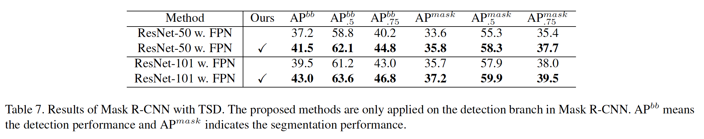

#### 3.5. Generalization on large-scale OpenImage

​		除了在COCO数据上评估外，在大型OpenImage数据集上，我们进一步验证了所提出的方法。作为具有大尺度边界框和层次结构属性的公共数据集，它给检测算法的泛化带来了新的挑战。为了充分研究所提出算法的有效性，我们进行了多次消融来分析TSD。表6展示了比较，并指出，即使对于重型骨干网络，TSD仍然可以提供令人满意的改进。TSD是Cascade R-CNN [2]的补充，将其嵌入此框架也可以以令人满意的幅度提高性能。

#### 3.6. 与最佳方法的比较

​		在本节中，我们评估了在COCO测试开发集上提出的方法，并将其与其他最新方法进行了比较。$m_c$ 和 $m_r$ 分别为0.5和0.2。为了公平比较，我们在表8上报告了我们的方法在不同设置下的结果。为了与Grid R-CNN[27]比较，我们将ResNet-101的训练周期扩展到与Grid R-CNN一致。为了与最佳的单模型$\mbox{TridentNet}^\ast$，在$\mathbf{\mbox{TSD}}^\ast$中，我们使用与$\mbox{TridentNet}^\ast$相同的配置，包括多尺度训练、soft-NMs、可变性卷积和在ResNet-101上的$3\times$训练计划。最佳的单模型ResNet-101-DCN给出了49.4的AP，已经超越具有相同骨干的所有其他模型。据我们所知，对于具有ResNet-101骨干的单模型，我们的结果是最先进的实体。TSD证明其在推动精确定位和可信分类的优势，特别是更高IoU阈值（$\mbox{AP}_{0.75}$）。此外，我们探索具有繁重骨干的TSD的上界。令人吃惊的是，单模型的SENet153-DCN在COCO测试开发集上获得51.2的AP。在这次评估中，没有使用Soft-NMS。

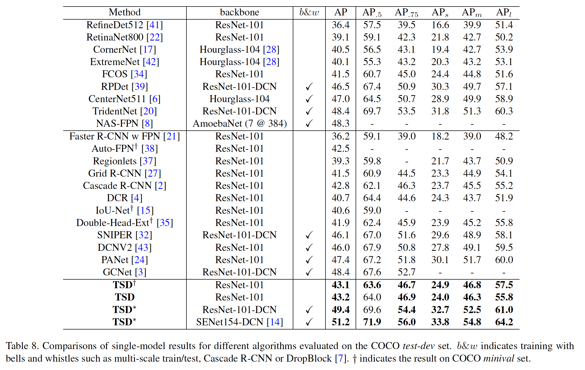

#### 3.7.  分析和讨论

​		**不同IoU标准上的性能**	因为TSD在回归精确位置和预测可信分类上的优越能力，我们在COCO $minival$ 上进行几项更严格IoU标准的评估。图6展示了基于TSD的Faster R-CNN和具有相同ResNet-50骨干的基线Faster R-CNN之间的比较，IoU阈值从0.5到0.9。显然，随着IoU阈值的增加，TSD带来的赶紧也增加。

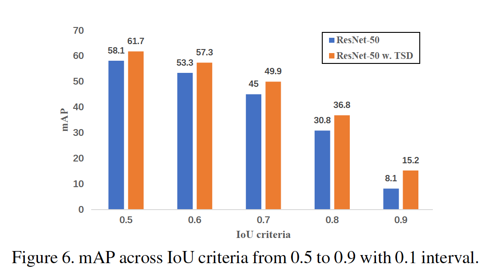

​		**不同尺度标准下的性能**	我们分析在不同IoU标准下的TSD有效性。为了更好的探索特定改进，我们进一步测试不同尺度目标下的mAP。表9报告了性能，TSD显示了具有可变尺度目标的成功，特别是对于中型和大型目标。

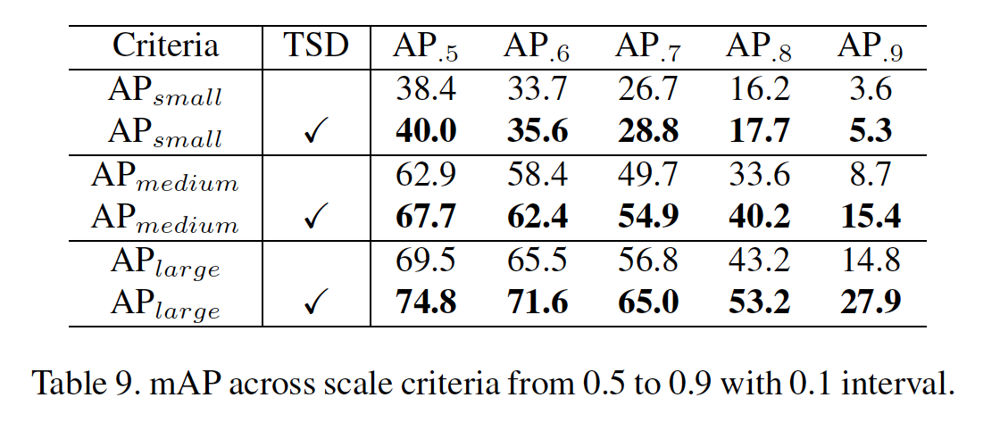

​		**TSD学习到什么 ？** 借助任务感知的空间解藕（TSD）和渐进约束（PC），无论是对于变体骨干还是变体数据集，都可以轻松实现稳定的改进。除了定量推广之外，我们想知道TSD与Faster R-CNN的sibling head相比学到了什么。为了更好的解释，我们给出了图5中的TSD与sibling head的比较展示。正如期望的，通过TSD，它可以消除许多误报，并回归更精确的框边界。对于$\hat{P}_r$，它倾向于平移不易回归的边界。对于$\hat{P}_c$，它倾向于集中在局部外观和目标上下文信息上，就像在具有可变形RoI池的sibling head中所做的那样[5]。

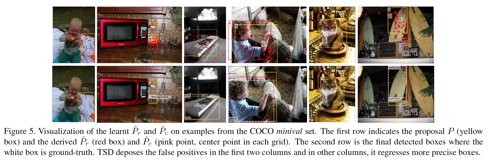