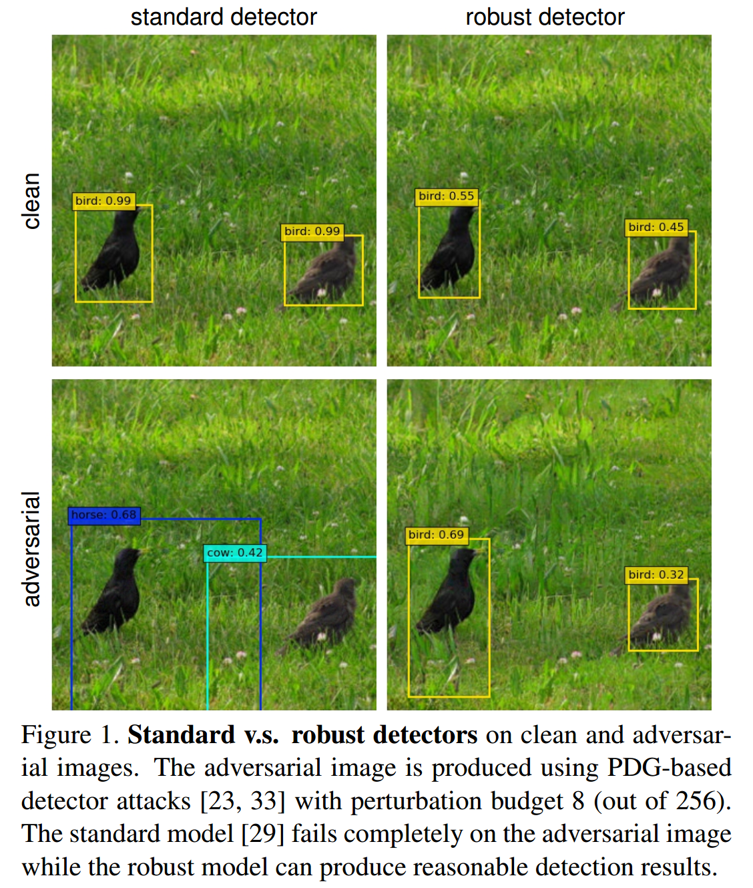

### Towards Adversarially Robust Object Detection

#### 摘要
目标检测是一项重要的视觉任务，并且也成为众多视觉系统中必不可少的组建，使得其鲁棒性成为实际应用中日益重要的性能因素。虽然大量最新的工作已证明目标检测面对对抗攻击时是非常脆弱的，但是鲜有工作致力于提高它们的鲁棒性。本文中，作者朝着这个方向作出了初步的尝试。作者首先从模型鲁棒性角度回顾并系统分析目标检测器和大量最近开发的攻击。然后提出目标检测的多任务学习的观点，并确立的任务损失的不对称作用。作者进一步开发了对抗训练方法，其可以利用攻击的多源以提高检测模型的鲁棒性。并在PASCAL-VOC和MS-COCO上进行广泛实验验证论文所提出方法的有效性。

#### 1. Introduction
目标检测器也容易受恶意手工输入攻击（如图1）。鉴于目标检测在如监控和自动驾驶上的关键角色，研究防范针对目标检测的不同对抗攻击是非常重要的。
