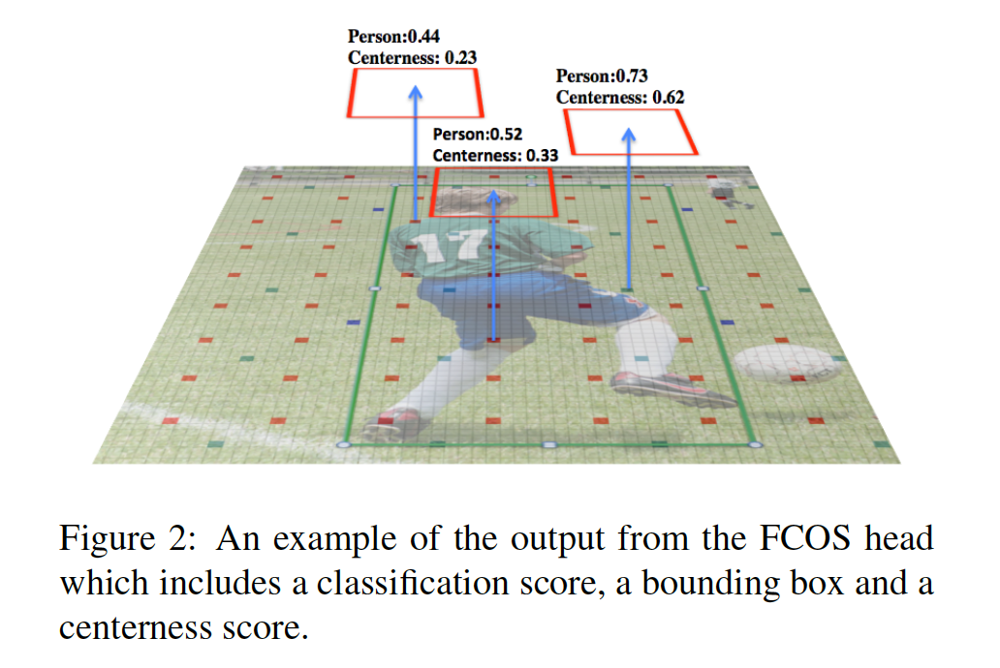

## VarifocalNet: An IoU-aware Dense Object Detector

### 摘要

​		准确排序大量候选检测器时高性能密集目标检测器的关键。虽然先前的工作使用分类得分或它与基于IoU的定位得分的组合作为排序的基础，但是它们都不能可靠地表示排序，并且这会损害检测性能。本文中，我们提出学习IoU感知（IoU-aware）的分类得分（IACS），其同时表示目标存在的置信度和定位准确率，从而在密集目标检测器中产生更准确的检测排序。特别地，我们设计一种新的损失函数（称为Varifocal Loss）来训练密集检测器以预测IACS，并且利用一种新的高效star-shaped边界框表示来估计IACS，并精炼粗糙的边界框。结合这两部分和边界框精炼分支，我们在FCOS架构之上构建一种新的密集目标检测器，我们称为VarifocalNet，或者简称VFNet。MS COCO基准上的广泛实验表明，使用不同的骨干，我们的VFNet始终比强基线好约2.0AP，并且具有Res2Net-101-DCN的最佳模型在COCO test-dev上达到51.3AP，获得不同目标检测器中的SOTA。代码见https://github.com/hyz-xmaster/VarifocalNet。

### 1. 引言

​		现代目标检测器，无论是两阶段方法或者一阶段方法，通常是首先生成具有分类得分冗余边界框集合，然后部署NMS来删除相同目标的重复边界框。一般而言，将分类得分用于NMS中的排序，如果更低排名的边界框与更高排名边界框的IoU大于某个阈值（例如0.5），那么将更低排名的边界删除。但是，这样做会损害检测性能。因为分类得分始终不是边界框定位准确度的完美估计，并且地分类得分的准确率定位的检测可能在NMS被删除。

​		为了解决这个问题，已有的密集目标检测器要么预测额外的IoU得分，要么预测centerness得分作为定位准确率的估计，并且将它们与分类得分相乘，从而在NMS对检测进行排名。这些方法可以避免分类得分和目标定位准确度之间的不对齐。但是，因为将两个不完美的预测相乘会导致更差的排序，所以它们是次优的，我们在第3节中证明这类方法的性能上界非常有限。此外，将额外的网络分支添加到预测定位得分不是优雅的解决方案，并且产生额外的计算负担。

​		为了克服这些缺点，我们自然地想问：_我们是否可以将定位准确度融入分类得分，而不是预测一个额外的定位准确得分？_即，预测一个定位感知或IoU感知的分类得分（IACS），其同时表示某个目标类的存在性和生成的边界框的定位准确度。

​		本文中，我们回答上述问题，并作出如下贡献。（1）我们生成用于准确排名大量候选检测的恰当得分是高性能密集目标检测器的关键，并且IACS是顶级旋转（第3节）。（2）我们提出一种新的Varifocal Loss来训练目标检测器以回归IACS。（3）我们设计一种新的高效的星形（star-shaped）边界框特征表示来估计IACS，并且精炼边界框。（4）我们基于FCOS架构开发一种新的密集目标检测器，并提出称为VarifocalNet（或简称VFNet）的组件来充分利用IACS。我们的方法如图1所示。

​		特别地，varifocal loss（受focal loss启发）也是动态缩放的交叉熵损失。但是，它监督密集目标检测器来回归连续值，并且更明显的是，它采用了一种非对称（asymmetrical）训练样本加权方法，正如其名称所隐含的那样。它仅降低负样本的权重以处理训练期间的类不平衡问题，并且也对生成主要检测的高质量正样本进行加权，着对于获得高检测性能非常重要。

​		星形边界框特征表示设计用于高效地编码边界框。它使用9个固定采样点的特征（图1中的黄色圆圈）来表示具有可变形卷积的边界框[12]。与大多数已有目标检测器中使用的点特征相比，这种特征表示可以捕获边界框的集合信息，以及它相邻的纹理信息，这对于预测准确的IACS至关重要。它还确保我们有效的精炼初始生成的粗糙边界框，而没有损失效率。

​		为了验证我们提出的模块的有效性，我们基于FCOS构建VFNet，并在MS COCO基准测试上评估它。实验结果表明，不同骨干的VFNet始终比强基线好约2.0AP，具有Res2Net-101-DCN骨干的最佳模型在COCO test-dev上的单模型、单尺度检测准确率为51.3AP，取得SOTA。

### 2. 相关工作

**目标检测：**随着目标检测的进步，当前流行的目标检测器可以根据它们是否使用锚框来分类。虽然流行的两阶段方法和多阶段方法通常采用锚框来生成提议以进行下游的分类和回归，基于锚框的一阶段方法直接分类和细化锚框，而没有目标提议生成。

​		最近，由于无锚检测器的新颖和简明性，它已吸引大量关注。它们中的一类将目标检测器问题形式化为语义-点检测问题，包括CornerNet、CenterNet、ExtremeNet、ObjectsAsPoints和RepPoints。另一类无锚检测器与基于锚的一阶段方法相似，但是它们删除锚框的使用。相反，它们将特征金字塔上的每个点分类为前景类或背景，并直接预测前景点到ground-truth边界框四条边的距离，从而产生检测。流行的方法包括DenseBox、FASF、FoveaBox、FCOS、ATSS和SPAD。由于FCOS的ATSS版的简单、高性能和令人兴奋的性能，我们基于FCOS的ATSS版构建VFNet。

**Detection Ranking Measures：**除了分类得分，已提出其他检测排名测量。IoU- Net使用额外的网络来预测IoU，并使用它对NMS中的边界框进行排名，但是它仍选择分类得分作为最终检测得分。Fitness NMS、IoU-aware RetinaNet和[29]本质上与IoU-Net相似，除了它们将预测的IoU或基于IoU排名得分乘以分类得分作为排名的基础。FCOS预测centerness得分以抑制低质量检测，而不是预测基于IoU得分。

​		通过对比，我们仅预测IACS，其混合目标存在的置信度和定位准确率作为排名得分。这避免额外网络的使用，以及通过将不完美的定位得分与分类得分相乘而得到更糟糕的排名基础。

**编码边界框：**提取辨别性特征来表示边界框对于目标检测中的下游分类和回归很重要。在两阶段和多阶段方法中，广泛采用RoI Pooling或RoIAlign来提取特征以描述边界框。但是如果将它们用于密集目标检测器，将会非常耗时。但是，这些局部特征不能捕获边界框的几何特性和关键的纹理信息。

​		作为替代，HSD [30]和RepPoints [22]使用可变形卷积在学习的语义点处提取特征，以对边界框进行编码。但是，由于缺乏强有力的监督和预测，学习定位语义点非常具有挑战性，并且语义点的预测也加重计算负担。

​		相比之下，我们所提出的星形边界框表示使用9个采样点的特征来描述边界框。它简单、有效，并且还能捕获边界框的几何信息以及其周围的上下文线索。

**Generalized Focal Loss：**与我们工作最相似的同时期的工作，Generalized Focal Loss（GFL）。GFL将focal loss扩展到连续版本，并且训练检测器来预测定位质量和分类的联合表示。

​		我们首先强调我们的varifocal loss与GFL的不同功能。Varifocal Loss非对称地对政府样本加权，而GFL同等地处理它们，并且实验结果表明，我们的varifocal loss比GFL表现好。此外，我们提出一种有效的星形边界框特征表示来促进IACS的预测，并且进一步通过边界框精炼步骤提高边界框定位准确率，这是GFL中没有考虑到的。

### 3. 动机

​		本节中，我们研究流行的无锚密集目标检测器FCOS的性能上界，确定了主要的性能障碍，并显示了产生IoU感知分类得分作为排名基础的重要性。

​		我们首先简要回顾FCOS。FCOS构建在FPN之上，并且它的头部有三个分支。一个预测特征图中每个点的分类得分，一个回归从采样图像位置到边界框四条边的距离，另一个预测centerness得分，centerness乘以分类得分以对NMS中的边界框进行排序。图2证明FCOS头部输出的示例。本文中，我们实际上研究FCOS的ATSS版（FCOS+ATSS），其中，在训练起降，将Adaptive Training Sample Selection（ATSS）机制用于定义特征金字塔的前景和背景点。关于ATSS的详情，请参考[26]。

​		为了研究FCOS+ATSS（在COCO train2017上训练）的性能上界，在NMS之前，我们交替替换与前景点对应的ground-truth值的预测分类得分、距离偏移和centerness得分，并且在COCO val2017上评估检测性能。对于分类概率向量，我们实现两个选项，即将其在ground-truth标签位置的元素替换为1.0或在预测的边界框和ground-truth标签之间的IoU（称为gt_IoU）。除了真实值外，我们还考虑利用gt_IoU替换centerness得分。

​		结果见表1。我们可以看出原始的FCOS+ATSS获得39.2AP。当在推理中使用ground-truth centerness（gt_ctr）时，不料，仅增加2.0AP。相似地，利用gt_IoU替换预测centerness得分仅将AP提高到43.5。这表明使用预测IoU得分和分类得分来对检测进行排名当然不能带来明显的性能提高。

​		通过对比，在推理中，即使没有centerness得分（no w/ctr），具有ground-truth边界框（gt_bbox）的FCOS+ATSS获得56.1AP。但是，如果将ground-truth标签位置（gt_cls）的分类得分设置为1.，是否使用centerness得分变得重要（43.1AP vs 58.1AP）。因为centerness得分可以在一定程度上区分准确和不准确的边界框。

​		最令人惊讶的结果是通过用gt_IoU（gt_cls_iou）代替ground_truth类的分类得分而获得的结果，其实际上是IACS。 没有在推理中使用centerness得分，此案例将获得高达74.7的AP，这比其他案例要高得多。鉴于上述结果，这实际上表明，对于大多数ground-truth目标，在大型候选池中已经存在精确定位的边界框。实现出色的检测性能的关键是从池中准确选择那些高质量的检测结果，这些结果表明IACS是最有前途的选择措施。

### 4. VarifocalNet

​		基于上述发现，我们提出学习IoU-aware classification score（IACS）来对检测进行排名。为此，我们构建新的密集目标检测器，称为VarifocalNet或VFNet，其基于删除centerness分支的FCOS+ATSS。与FCOS+ATSS相比，它有三个新的组件：varifocal loss、星形边界框特征表示和边界框精炼。

#### 4.1. Varifocal Loss

​		我们设计_Varifocal Loss_来训练密集目标检测器以预测IACS。由于它受_Focal Loss_的启发，所以我首先简要回顾focal loss。

​		在密集目标检测器的训练中，已提出Focal Loss来处理前景和背景的极端不平衡问题，其中大量的容易负样本可以抵消交叉熵的损失，并主导梯度。它被定义为：

$$FL(p,y)=\begin{cases}-\alpha(1-p)^{\gamma}\log(p) &\mbox{ if  } y = 1\\-(1-\alpha)p^{\gamma}\log(1-p) &\mbox{other},\end{cases}\tag{1}$$

其中$y \in \{\pm1\}$表示ground-truth类，$p \in [0,1]$为前景类的预测概率。如式（1）所示，focal loss将权重因子（$\alpha$针对前景类，$1-\alpha$针对背景类）和调节因子$(1-p)^\gamma,p^\gamma$添加到交叉熵损失。而$\alpha$用于平衡正负样本之间的重要性，调节因子减小容易样本的损失贡献，并相对增加误分类样本的重要性。因此，focal loss可防止大量容易负样本在训练期间主导检测器，并使检测器聚焦在稀疏的困难样本集上。

​		在训练密集目标检测器来回归连续的IACS，我们借助focal loss的样本权重思想来处理类不平衡问题。但是与同等地处理正负样本不同，我们非对称地对待它们。我们的八日focal loss定义为：

$$VFL(p,q) = \begin{cases}-q(q\log(p) + (1-q)\log(1-p)) & q>0 \\ -\alpha p^\gamma\log(1-p) &q=0,\end{cases}\tag{2}$$

其中$p$为预测的IACS，$q$为目标IoU得分。对于正类训练样本，$q$设置为生成的边界框和ground-truth边界框之间的IoU（gt_IoU），而对于负训练样本，所有类的训练目标$q$为0。见图1。

​		如式（2）所示，varifocal loss仅通过利用$p^\gamma$缩放它们的损失来减小负样本的损失贡献，而不会以相同的方式对正样本降权。这是因为，相对负样本，正类样本极其稀少，我们应当保留它们的精确学习信号。另一方面，受PISA和IoU平衡损失的启发，我们利用学习目标$q$来对正样本加权。如果正样本有高gt_IoU，因此，它对损失的贡献相对较大。这将训练聚焦在这些高质量的正样本上，其对于获得比这些低质量样本更高AP的更重要。

​		为了平衡正样本和负样本之间的损失，我们将可调整的缩放因子$\alpha$添加到负损失项。

#### 4.2. Star-Shaped Box Feature Representation

​		我们设计一种高效的星形边界特征表示来估计IACS。它使用九个固定采样点（图1的黄色圆圈）的特征来表示具有可变形卷积的边界框。这种新表示可以捕获边界框的几何信息和它相临的纹理信息，其对于编码预测边界框和ground-truth边界框之间的不对齐。

​		具体而言，给定图像平面上的采样位置$(x,y)$，我们首先利用$3 \times 3$卷积从该位置回归初始边界框。遵循FCOS，使用4D向量$(l', t', r', b')$编码边界框，该向量分别表示位置$(x,y)$到边界框左、上、下、右四条边的距离。利用距离向量，我们启发式地选择9个采样点：$(x,y)$、$(x-l',y)$、$(x,y-t')$、$(x+r',y)$、$(x,y+b')$、$(x-l',y-t')$、$(x+l',y-t')$、$(x-l',y+b')$和$(x+r',y+b')$。然后将这九个位置映射到特征图上，并且通过可变形卷积卷积特征点上的特征以表示边界框。由于手工选择这些点没有额外的预测负担，所以我们的新表示是计算高效的。

#### 4.3. 边界框精炼

​		我们进一步通过边界框精炼步骤提高目标定位准确率。边界框精炼是目标检测中的常用技术，但是，由于缺乏高效而具辨别性的目标描述子，它没有在密集检测器中被广泛采用。利用我们的高效星形表示，现在，我们可以在密集目标检测器中使用它，而没有损失效率。

​		我们将边界框精炼建模为残差学习问题。对于初始回归的边界框$(l',t',r',b')$，我们首先提取星形表示来编码它。然后，我们学习四条边的缩放因子$(\Delta l,\Delta r,\Delta r, \Delta b)$来缩放距离向量，使得由$(l,t,r,b)=(\Delta l \times l', \Delta t \times t', \Delta r \times r', \Delta b \times b')$表示的精炼边界框更接近ground-truth。

#### 4.4. VarifocalNet

​		在FCOS网络架构上附加三个组件，并且删除与那时的centerness分支，我们得到_VarifocalNet_。

​		图3展示VFNet的网络架构。VFNet的骨干和FPN网络与FCOS相同。差异为检测器的头部结构。VFNet头部包含两个子网络。定位子网络进行边界框回归和后续精炼。它以FPN的没层上的特征图作为输入，并且首先使用具有ReLU激活的3个$3 \times 3$卷积层。这产生256个通道的特征图定位子网络的一个分支再次卷积特征图，然后在每个空间位置输出4D距离向量$(l',t',r',b')$，其表示初始边界框。给定初始边界框和特征图，其他分支将星形可变形卷积用于9个特征采样点，并产生距离缩放因子$(\Delta l,\Delta t,\Delta r,\Delta b)$，其乘以距离向量以生成精炼边界框$(l,t,r,b)$。

​		另一个子网负责预测IACS。它具有与定位子网（精炼分支）相似的架构，不同之处在于它在每个空间位置输出带有$C$（类数量）元素的向量。每个元素的值联合表示目标存在置信度和定位准确率。

​		注意，通过星形可变形卷积，我们将定位网络和IACS网络关联，正如RepPoints [22]所验证的那样，这有助于学习两种任务的更好表示。

#### 4.5. Loss Function and Inference

**Loss Function**	VFNet的训练受如下损失函数的监督：

$$\begin{align}\mbox{Loss}&=\frac{1}{N_{\mbox{pos}}} \sum_{i} VFL(p_i, q_o) \\ &+ \frac{\lambda_0}{N_{\mbox{pos}}}\sum_{i} q_i L_{\mbox{bbox}}(\mbox{bbox}_i',\mbox{bbox}_i^\ast) \\ &+ \frac{\lambda_1}{N_{\mbox{pos}}}\sum_i q_i L_{\mbox{bbox}}(\mbox{bbox}_i,\mbox{bbox}_i^\ast)\end{align}\tag{3}$$

其中$p_i$和$q_i$分别表示PFN的没层特征图上位置$i$处的预测和ground-truth IACS。$L_{\mbox{bbox}}$为GIoU损失，$bbox_i'$、$bbox_i$和$bbox_i^\ast$分别表示初始、精炼和ground-truth边界框。我们利用训练目标$q_i$对$L_{\mbox{bbox}}$加权，对于正样本，$q_i$的值位于$(0,1]$中，对于负样本，$q_i$为0，这遵循FCOs中的实践。$\lambda_0$和$\lambda_1$为平衡三个损失的权重，经验上分别设置为1.5和2.0。$N_{\mbox{pos}}$表示正样本的数量，其用于规范总损失。如第3节提到的，我们采用ATSS来定义正负训练样本。

**推理**	VFNet的推理是直接的。它们涉及简单地将图像穿过网络，然后使用NMS删除冗余检测。

### 5. 实验

**数据集和评估度量**	在MS COCO 2017基准上评估VFNet。

**实现和训练细节**	我们利用MMDetection v2.3实现VFNet。除非特别说明，我们采用MMDetection中的默认超参数。初始学习率设置为0.01，我们采用线性warming up策略来开始学习率，其中warm-up比例设置为0.1。在消融研究和性能比较中，我们使用8张V100 GPU来训练，总batchsize为16（每张GPU处理2张图像）。

​		对于val2017上的消融研究，使用ResNet-50作为骨干网络，采用1倍训练时间表（12个周期）。将输入图像调整为$1333 \times 800$的最大尺度，并保存纵横比。仅使用随机水平翻转图像作为数据增强。

​		为了与test-dev上SOTA进行性能比较，我们利用不同的骨干网络训练VFNet，包括插入可变形卷积层[12、38]（表示为DCN）的骨干。请注意，当在主干中使用DCN时，我们还将其插入VFNet Head中可星形变形卷积之前的最后一层。采用2倍（24epoch）训练时间表和多尺度训练，其中从尺度范围中随机选择一个最大图像尺度。事实上，我们在实验中使用两种图像尺度范围。为了与基线公平比较，我们使用尺度范围$1333 \times [640:800]$，出于好奇，我们还利用更宽的尺度范围$1333 \times [480:960]$进行实验。注意，即使采用MSTrain，我们在推理时将最大图像尺度保持为$1333 \times 800$，尽管更大尺度表现略好（$1333 \times 900$获得大约0.4AP增益）。

**推理细节**	推理时，我们通过网络前向图像，图像被调整为最大大小为$1333\times800$，并获得带有相应IACS的估计边界框。我们首先过滤掉$p_i \le 0.05$的边界框，然后每个FPN层最多选择前1k得分的检测。然后，合并所有级别的选定检测，并通过阈值0.6的NMS删除多余的检测，以产生最终结果。

#### 5.1. 消融研究

##### 5.1.1	Varifocal Loss

​		我们首先研究了varifocal loss的超参数对检测性能的影响。有两个超参数：$\alpha$用于平衡正负样本之间的损失，$\gamma$用于降低简单的负样本的损失的权重。表2中，我们展示$\alpha$从0.5到1.5和$\gamma$从1.0到3.0变化时的VFNet的性能（仅显示以最佳$\alpha$获得的结果）。结果表明，在41.0 AP以上获得了类似的结果，并且我们的varifocal loss对于$(\alpha, \gamma)$的不同集合都非常可靠。其中，$\alpha=0.75$和$\gamma=2.0$表现最好（41.6AP），并且对于接下来的实验，我们采用这两个值。

​		我们还研究利用学习目标$q$加权正样本损失的影响，称为_q weighting_。表2的第四行展示没有_q weighting_的$(\alpha, \gamma)$的最优集的影响，并且性能衰减0.4AP（41.2PA vs. 41.6AP）。这确认了q 加权的积极影响。

##### 5.1.2	Individual Component Contribution

​		我们研究我们的方法中的单个组件的影响，结果如表3所示。第一行展示利用focal loss训练的VFNet的性能，获得39.0AP。利用varifocal loss替换focal loss，性能增加到40.1AP。通过添加星形表示和边界框精炼模块，性能分别进一步提升到40.7AP和41.6AP。这些结果验证了我们的VFNet中三个模块的有效性。

#### 5.2. 与SOTA的比较

#### 5.3. Generality and Superiority of Varifocal Loss

