## You Only Look One-level Feature

### 摘要

​		本文回顾用于一阶段检测器的特征金字塔网络（FPN），并指出由于采用分治法解决了目标检测中的优化问题，而不是多尺度特征融合。从优化的角度，我们引入一种替代方式来处理这个问题，而不是采用复杂的特征金字塔——仅利用一层特征进行检测。基于简单而高效的解决方案，我们提出You Only Look One-level Feature（YOLOF）。在我们的方法中，提出两种关键组件（Dilated Encoder和Uniform Matching），并带来可观的提高。COCO基准测试上的大量实验证明所提出的模型的有效性。我们的YOLOF获得与其特征金字塔副本RetinaNet相当的性能，同时快了2.5倍。没有transformer层，以单层特征的形式，YOLOF可以匹配DETR的性能，同时少7倍的训练epoch。利用$608 \times 608$的图像大小，YOLOF在2080Ti上以60FPS的速度获得44.3mAP，其比YOLOv4快13%。代码见https://github.com/megvii-model/YOLOF。

### 1. 引言

​		在最佳的两阶段检测器和一阶段检测器中，特征金字塔称为关键的组件。构建特征金字塔的最流行方式时特征金字塔网络（FPN），其主要有两个好处：（1）多尺度特征融合：将多个低分辨率和高分辨率输入融合以获得更好的表示；（2）分而治之：根据目标尺度，在不同层上检测目标。FPN的普遍信念是，其成功取决于多层次特征的融合，引发了一系列有关手工设计复杂融合方法的研究[25、17、28]或通过神经架构搜索（NAS）算法[9、37 ]。但是，这种信念忽略FPN中的分治功能。关于这两项好处如何有助于FPN成功并可能阻碍新进展的研究较少。

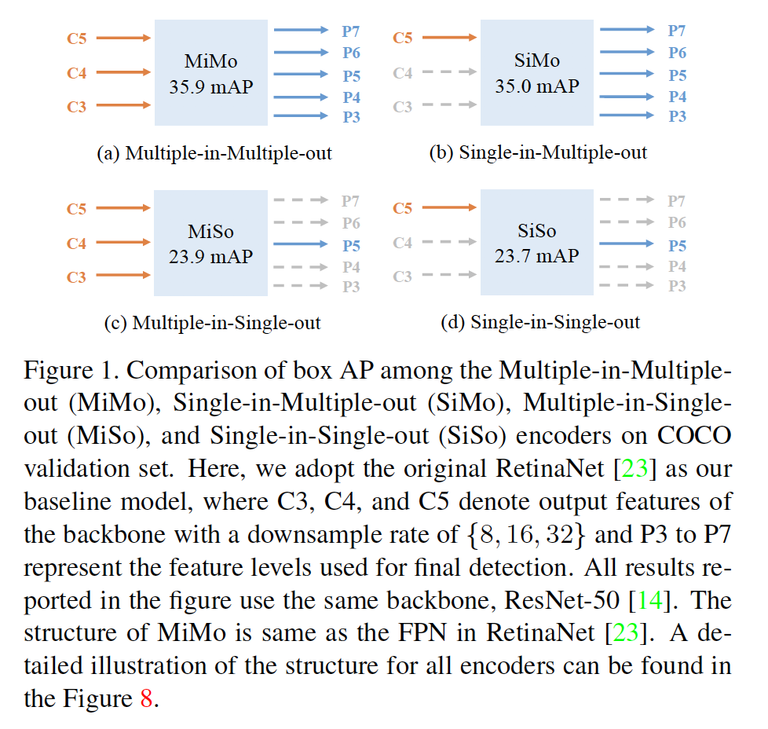

​		本文研究一阶段检测器中FPN的两种好处的影响。我们通过使用RetinaNet解耦多尺度特征融合和分治功能来设计实验[23]。详细地说，我们将FPN视为Multiple-in-Multiple-out（MiMo）编码器，其同古范编码多尺度特征，并给解码器（检测头部）提供特征表示。我们在表1中比较Multiple-in-Multiple-out（MiMo）、Single-in-Mulitple-out（SiMo）、Multiple-in-Single-out（MiSo）和Single-in-Single-out（SiSo）。令人吃惊的是，仅有一个输入特征的$C5$和没有进行特征融合的SiMo编码器可以获得与MiMo编码器（即FPN）相当的性能。性能差距小于1mAP。相比之下，MiSO和SiSo编码器中性能下降严重（$\ge12$mAP）。这种现象认为有两个因素：（1）$C5$特征携带足够的上下文来检测不同尺度的目标，其确保SiMo编码器获得相当的结果；（2）多尺度特征融合的好处远没有分治法那么重要，因此多尺度特征融合可能不是FPN的最显著的好处，其也由语义分割中的ExFuse[50]证明。更深入地思考，分治法与目标检测的优化问题相关。它通过目标尺度将复杂的检测问题划分为几个子问题，从而促进优化过程。

​		上述分析认为FPN成功的关键因素是其对于目标检测中优化问题的解决方案。分治法是一种很好的方式。但是它带来内存负担，减慢检测速度，以及使如RetinaNet的一阶段检测器的结构复杂。给定携带足够上下文的C5特征，我们展示一种处理优化问题的简单方式。

​		我们提出_You Only Look One-level Feature_（YOLOF），其仅使用单个C5特征（下采样率为32）进行检测。为了弥补SiSo编码器和MiMo编码器之间的差距，我们首先适当地设计编码器的结构，以提取各种尺度目标的多尺度上下文，以弥补缺乏多层次特征的不足；然后我们使用均匀匹配机制来解决由单个特征中稀疏锚引起的正负锚的不平衡问题。

​		没有花里胡哨的操作，YOLOF获得与其特征金字塔副本RetinaNet相当的结果，但是快了2.5倍。以单特征方式，YOLOF匹配最近所提出的DETR的性能，并且收敛速度更快（7倍）。利用$608 \times 608$的图像大小和其他技术[1、47]，YOLOF在2080Ti上以60FPS的速度获得44.3mAP，其比YOLOv4快13%。简而言之，本文的贡献是：

- 我们证明FPN的最显着优势是其针对密集目标检测中的优化问题的分而治之解决方案，而不是多尺度特征融合。
- 我们提出YOLOF，其为简单而有效的基线，没有使用FPN。在YOLOF中，我们提出两个关键组件，Dilated Encoder和Uniform Matching，其弥补SiSo编码其和MiMo编码器之间的差距。
- COCO基准测试上的大量实验表明每个组件的重要性。此外，我们与RetinaNet、DETR和YOLOv4进行比较。我们在GPU上以更快的速度获得相当的结果。

### 2. 相关工作

**Multi-level feature detectors**	采用多尺度特征进行目标检测是传统技术。构建多个特征的典型方法可以分为图像金字塔方法和特征金字塔方法。基于图像金字塔的检测器（例如DPM）主导前深度学习时代的检测。在基于CNN的检测器中，图像金字塔方法也赢得一些研究人员的[34、35]的赞誉，因为它可以获得更高的性能。但是，图像金字塔方法不是获得多个特征仅有方法；在CNN模型中，利用特征金字塔的能力更有效和自然。SSD[26]首先利用多尺度特征，并针对不同尺度目标在每个尺度上进行目标检测。FPN[22]遵循SSD和UNet，并通过结合浅层特征和深层特征构建语义丰富的特征金字塔。之后，几项工作[17、25、9、37]遵循FPN，并关注如何获得更好的表示。FPN成为一种关键组件，并且主导现代检测器。它还拥有流行的一阶段检测器，例如RetinaNet、FCOS以及它们的变体。另一种获得特征金字塔的方法是使用多分支和膨胀卷积[20]。与上述工作不同，我们的方法是单层的特征检测器。

**Single-level feature detectors**	早期，RCNN系列[11、10、31]和R-FCN[6]仅在单个特征上提取RoI特征，而它们的性能落后它们的多特征副本[22]。同时，在一阶段检测器中，YOLO和YOLOv2仅使用骨干的最后输出特征。它们可以是超快的，但必须承受检测性能的下降。CornerNet[19]和CenterNet[51、7]遵循这种形式，并获得竞争性结果，同时使用小采样率为4的单特征来检测所有目标。使用高分辨率特征图进行检测带来大量内存开销，并且对于部署不友好。最近，DETR将transformer引入检测，并表明仅使用C5特征可以获得SOTA结果。由于完全无锚机制和transformer学习阶段，DETR需要长训练时间表才能收敛。长训练时间表的特点是进一步提高的障碍。与这些文章不同，我们研究多层检测的工作机制。从优化角度，我们为广泛使用的FPN提供替代解决方案。此外，YOLOF收敛更快，并获得有前途的性能；因此，YOLOF可以作为快速而准确检测器的简单基线。

### 3. Cost Analysis of MiMo Encoders

​		如第1节提到的，密集目标检测中FPN的成功是由于其针对优化问题的解决方案。但是，多层特征范式不可避免地使检测器更复杂，其带来内存负担，并且减慢检测器的速度。本节中，我们将对MiMo编码器的成本进行定量研究。

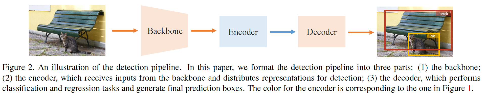

​		我们基于具有ResNet-50[14]的RetinaNet设计实验。详细地说，我们将检测任务的流水线形式化为三个关键部分的结合：骨干、编码器和解码器（图2）。以这种观点，我们图3中给出每个组件的FLOP。与SiSo编码器相比，MiMo编码器给编码器和解码器带来大量内存负担（134G vs. 6G）（图3）。此外，具有MiMo的解码器运行速度远慢于具有SiSo编码器的检测器（13FPS vs. 34 FPS）（图3）。为了证明速度是由在具有MiMo编码器的检测器中的高分辨率特征图（例如下采样率为8的C3特征）上检测目标引起的。鉴于MiMo编码器的上述缺点，我们旨在找出一种解决优化问题的替代方案，同时保持检测器简单、准确和快速。

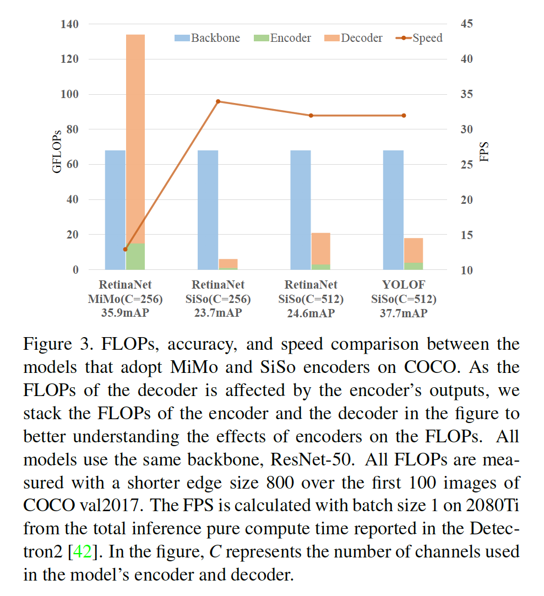

### 4. 方法

​		出于上述目的，并且发现C5特征包含足以检测大量目标的上下文，因此在本节中，我们尝试用简单的SiSo编码器替换复杂的MiMo编码器。但是这种替换并不简单，因为根据图3的结果在应用SiSo编码器时性能会大大下降。在这种情况下，我们会仔细分析阻碍SiSo编码器获得与MiMo编码器可比的性能的障碍。我们发现由SiSO编码器带来两个问题对性能下降负责。第一个问题是_与C5特征感受野相匹配的尺度范围是有限的_，其妨碍不同尺度目标的检测性能。第二个是由单层特征中稀疏锚引起的_正类锚中的不平衡问题_。接着，我们详细讨论这两个问题，并提供我们的解决方案。

#### 4.1. Limited Scale Range

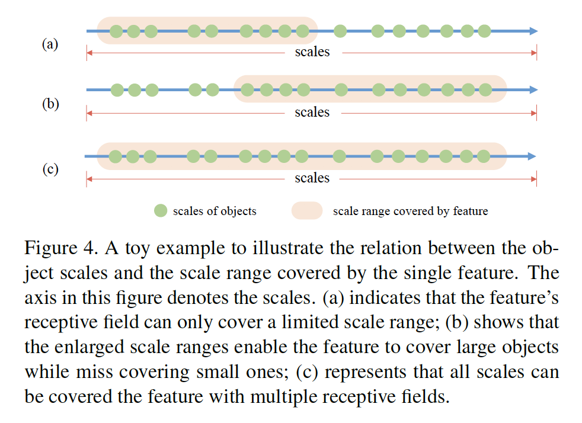

​		识别不同尺度的目标是目标检测中的基本挑战。这种挑战的一种灵活解决方案是利用多层特征。在具有MiMo或SiMo编码器的检测器中，它们构建具有不同感受野（P3-P7）的多层特征，并且在匹配它们尺度的感受野上检测目标。但是，单层特征设置改变这种游戏规则。SiSo编码器中仅有一个输出特征，它的感受野是常量。如图4（a）所示，C5特征的感受野仅能覆盖有限的尺度范围，如果目标尺度与感受野不对齐，导致较差的性能。为了获得利用SiSo编码器检测所有目标的目的，我们不得不找出一种方式来生成具有不同感受野的输出特征，其补偿多层特征的缺乏。

​		我们首先通过堆叠标准卷积和膨胀卷积来扩大C5特征的感受野[45]。尽管覆盖的尺度范围一定程度上被扩大，但是由于放大过程将所有原始覆盖尺度乘以大于1的因子，因此它仍不能覆盖所有目标尺度。我们在图4（b）中展示这种场景，其中与图4（a）相比，整体尺度范围迁移到更大的尺度。然后，我们通过添加相应的特征来组合原始尺度范围和扩大的尺度范围，产生覆盖所有目标尺度的多种感受野的特征（图4（c））。通过在中间$3\times3$卷积层上构造带有膨胀的残差块[14]，可以轻松实现上述操作。

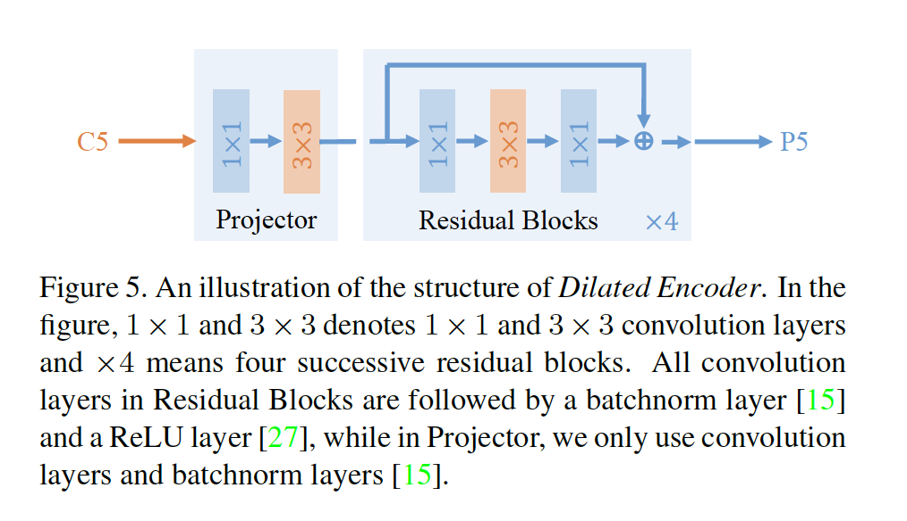

**Dilated Encoder：**基于上述设计，我们在图5中提出我们的SiSo编码器，称为Dilated Encoder。它包含两个主要组件：Projector和Residual Blocks。首先在投影层上使用$1\times1$卷积层层来减小通道维度，然后添加一个$3 \times 3$卷积层来精炼语义上下文，其与FPN中的相同。此外，我们堆叠在$3 \times 3$卷积层中有不同膨胀率的4个连续残差块来生成多种感受野的输出特征，覆盖所有目标尺度。

**讨论：**Dilated Convolution[45]是目标检测中常用于扩大特征感受野。如第2节的回顾，TridentNet[20]使用膨胀卷积来生成多尺度特征。它通过多分支结构和权重共享机制处理目标检测中的尺度变化问题，其与我们的单层特征设置不同。此外，Dilated Encoder逐一堆叠膨胀残差块，而没有权重共享。尽管DetNet[21]野成功应用膨胀残差块，但是它的目的是保持特征的空间分辨率，并保持骨干输出的更多细节，而我们的残差块是为了生成超出骨干的多种感受野的的特征。Dilated Encoder的设计保证我们可以在单层特征上检测所有目标，而不是在如TridentNet[20]和DetNet那样在多层特征上检测。

#### 4.2. Imbalance Problem on Positive Anchors

​		正类锚的定义是目标检测优化问题中的关键。基于锚的检测器中，定义正类的策略有锚与ground-truth边界框之间的IoU主导，如果锚与ground-truth边界框之间的最大IoU大于阈值0.5，这种锚将被设置为正类。我们称之为Max-IoU匹配。

​		在MiMo编码器中，这些锚点以密集铺砌的方式在多层上预定义，而ground-truth边界框会在对应于其尺度的特征层上生成正锚点。鉴于分治策略，Max-IoU匹配确保每个尺度的ground-truth边界框生成足够的正类锚量。但是，当我们采用SiSo编码器时，与MiMo编码器中的锚相比，锚的数量从100k到5k大大减少了，从而导致锚稀疏。在使用Max-IoU匹配时，稀疏锚引起检测器的不匹配问题，如图6所示。大ground-truth边界框自然而然地产生比小ground-truth边界框更多的正锚，这引起正类锚的不平衡问题。在训练时，这种不平衡问题使检测器关注大ground-truth边界框，而忽略小ground-truth框。

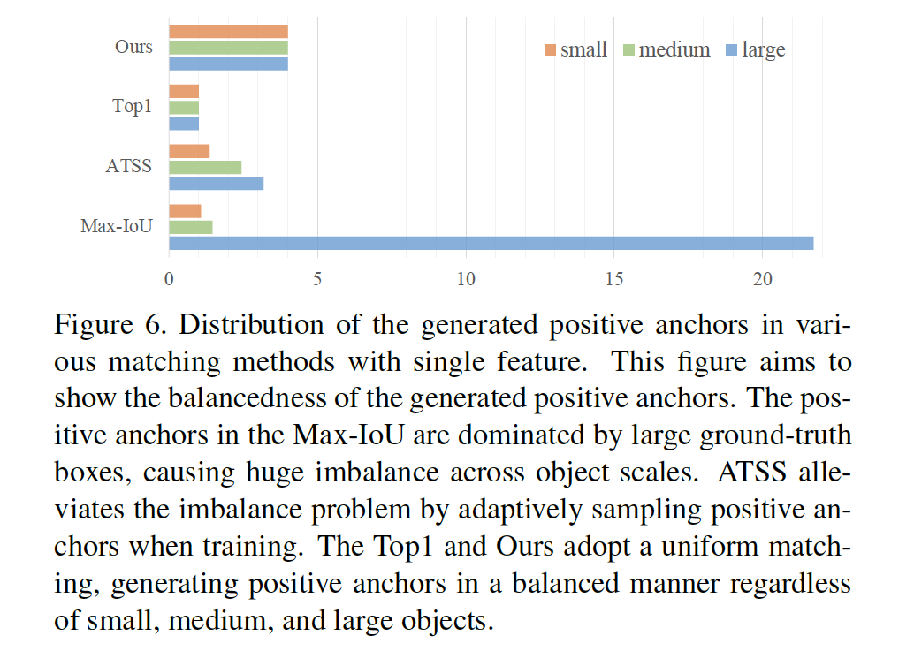

**Uniform Matching：**为了解决正锚中的不平衡问题，我们提出_Uniform Matching_策略：采用$k$个最近邻锚作为每个ground-truth的正类锚，其保证所有ground-truth边界框都可以匹配到相同数量的正锚，而不管它们的大小（图6）。正类样本中的平衡可确保所有ground-truth的参与训练并做出同等的贡献。此外，遵循Max-IoU匹配[23]，我们在Uniform Matching中设置IoU阈值以忽略大IoU（>0.7）的负锚，饱和小IoU（<0.15）的正锚。

**Discussion：relation to other matching methods**	在匹配过程中使用topk不是新技术。ATSS[48]首先在$\mathcal{L}$特征层上为每个ground-truth框选择topk个锚。然后通过动态IoU阈值在$k \times \mathcal{L}$个候选中采样正锚。但是，ATSS关注自适应地定义正负类，而我们的均匀匹配关注获得具有稀疏锚中正类样本上的平衡。尽管几种先前方法获得正样本上的平衡，它们的匹配过程没有设计用于这种不平衡问题。例如，YOLO和YOLOv2匹配与ground-truth边界框最匹配的单元或锚；DETR[4]和[36]使用匈牙利算法进行匹配。这些匹配方法可以视为top1匹配，其为我们的均匀匹配的一种特例。更重要的是，均匀匹配和学习-匹配之间的差异是：例如FreeAnchor和PAA的学习-匹配方法，根据学习状态，自适应地将锚分为正负样本，而均匀匹配是固定的，并且没有利用训练进化。提出的均匀匹配处理在SiSo设计下处理正锚的不平衡问题。图6中的比较，和表5e中的结果表明SiSo检测器中正类平衡的意义。

#### 4.3. YOLOF

​		基于上述方案，我们提出一种具有单层特征的快速而直接的框架，表示为YOLOF。我们将YOLOF公式化为三个部分：骨干、编码器和解码器。YOLOF的概览如图9所示。本节中，我们给出YOLOF主要组件的简要介绍。

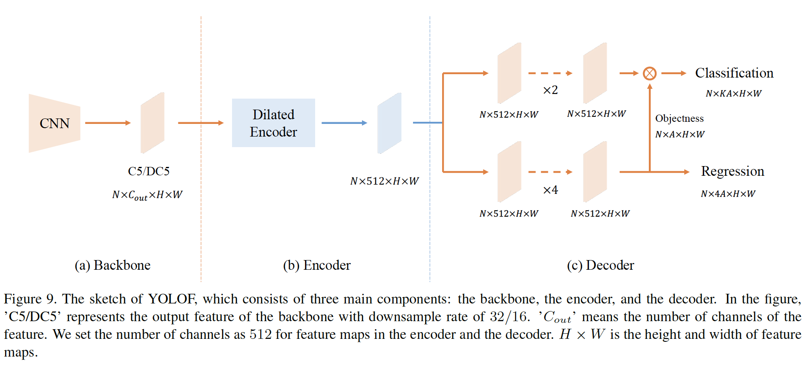

**Backbone**	在所有模型中，我们简单地采用ResNet和ResNeXt系列作为我们的骨干。在ImageNet上预训练所有模型。骨干的输出为C5特征图，其有2048个通道，下采样率为32。为了与其他检测器公平比较，默认情况下，冻结backbone中的所有batchnorm层。

**Encoder**	对于编码器（图5），我们首先遵循FPN，在骨干之后添加两个投影层（一个$1\times1$和一个$3 \times3$卷积），产生512个通道的特征图。然后，为了确保编码器中的输出特征覆盖不同尺度上的所有目标，我们提出添加残差块，其包含三个连续卷积：第一个$1\times1$卷积应用减少率为4的通道减少，然后使用具有膨胀的$3 \times 3$卷积扩大感受野，最后用一个$1\times1$卷积来恢复通道量。

**Decoder**	对于解码器，我们采用RetinaNet的主设计，其包含两个并行的任务特定的头部：分类头和回归头（图9）。我们仅添加两种最小的修改。第一个是，我们遵循DETR中的FPN的设计，并使两个头部中卷积层数量不同。回归头部中有4个后跟BN和ReLU层的卷积，而分类头部仅有两个。第二个是，我们遵循Autoassign[52]，并为回归头部中的每个锚添加隐式的objectness预测（而没有直接监督）。所有预测的最终分类得分通过将分类输出与对应的隐式objectness相乘。

**其他细节**	如前一节中提到的，YOLOF中预定义的锚是稀疏的，其降低锚与ground-truth框之间的匹配质量。我们在图像上添加了随机移位操作来规避此问题。操作在左、右、上和下四个方向上随机平移图像最大32个像素，并且旨在将噪声注入图像中的目标位置，增加ground-truth边界框与高质量锚的匹配概率。此外，我们发现，使用单级特征时，对锚点中心偏移的限制也有助于最终分类。我们添加了一个限制，即所有锚点的中心偏移应小于32像素。

#### 5. 实验

​		我们在MS COCO基准测试上评估YOLOF，并与RetinaNet和DETR进行比较。然后，我们利用量化结果和分析对每个组件的设计进行详细的消融研究。最后，为了给出单层检测上的进一步研究的洞察，我们提供错误分析，并证明与DETR相比，YOLOF的弱势。细节如下。

**实现细节**	YOLOF经过8个GPU上的同步SGD训练，每个小批量总共64张图像（每个GPU 8张图像）。利用初始学习率0.12训练所有模型。此外，尊重DETR[4]，我们为骨干设置更小的学习率，其为基学习率的1/3。为了稳定开始时的训练，我们将warmup的迭代次数从500增加大1500。对训练时间表，因为我们增加了batchsize，YOLOF上“$1\times$”的时间表设置总共有22.5k迭代，基学习率在15k和20k迭代时减小10倍。其他时间表根据Detectron2中的原则调整。对于模型推理，我们采用0.6阈值的NMS以后处理结果。对于其他超参数，我们遵循RetinaNet的设置。

#### 5.1. 与先前工作的比较

**与RetinaNet的比较：**为了进行公平比较，我们通过对框损失采用GIoU [32]，添加隐式objectness预测并在头部应用GroupNorm（因为每张GPU仅有两张图像，在RetinaNet中，BN和SyncBN给出较差结果，我们在头部中使用GN而不是BN）层[41]，从而将RetinaNet与YOLOF对齐。结果见表1。所有“$1\times$”模型利用单尺度训练，将短边设置为800像素，长边最多为1333[23]。在其一部分中，我们给出利用Detectron2训练的RetinaNet基线的结果。在中间部分中，我们介绍改进的RetinaNet基线（用“+”表示）的结果，它的设置与YOLOF对齐。最后一部分中，我们介绍多个YOLOF模型的结果。由于单层特征，YOLOF以减少57%的FLOP（YOLOF中每个组件的FLOP如图3所示）获得与RetinaNet+相当的结果，以及2.5倍的加速。由于C5特征的大步长（32），在小型目标上，YOLOF的性能比RetinaNet+差（-3.1）。但是，YOLOF在大型目标上获得更好的性能（+3.3），因为在编码器添加膨胀残差块。具有ResNet-101的RetinaNet+和YOLOF之间的比较也有相似的证据。尽管在小目标上，YOLOF的性能比RetinaNet+差，但是利用更强的骨干ResNeXt，它可以匹配小目标性能，同时以相同的速度运行。此外，为了我们的方法与目标检测中的当前技术兼容和互补，我们证明利用多尺度图像和更长时间表训练的结果见表1的最后一行。最终，在多尺度测试的帮助下，我们获得47.1mAP的最终结果，并且在小目标上获得可竞争性的结果。

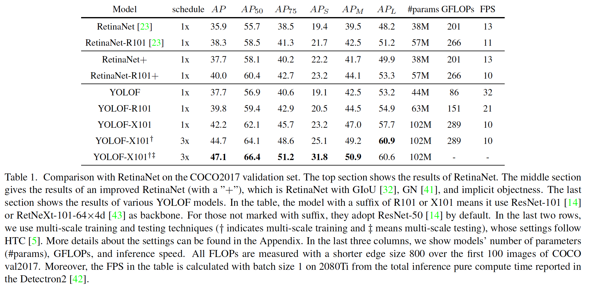

**Comparison with DETR**	DETR是最近提出的检测器，其将transformer引入到目标检测。它在COCO基准测试上获得令人吃惊的结果，并仅通过单个C5特征得到证明，它第一次获得与多层特征检测器（Faster R-CNN w/FPN）相当的结果。鉴于此，有人可能希望捕获全局依赖性的层，例如需要使用变压器层[39]才能在单层特征检测中获得有希望的结果。但是，我们证明具有局部卷积层的传统网络也可以获得这一目的。我们将具有全局层的DETR和具有局部卷积层的YOLOF进行比较，见表2。

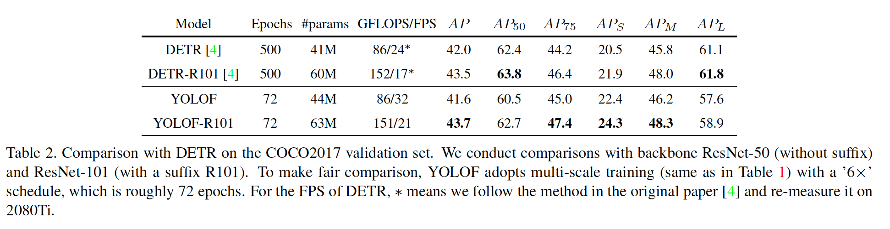

**Comparison with YOLOv4**

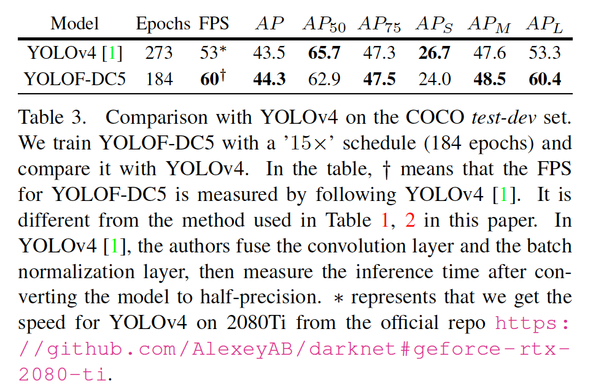

#### 5.2. 消融实验

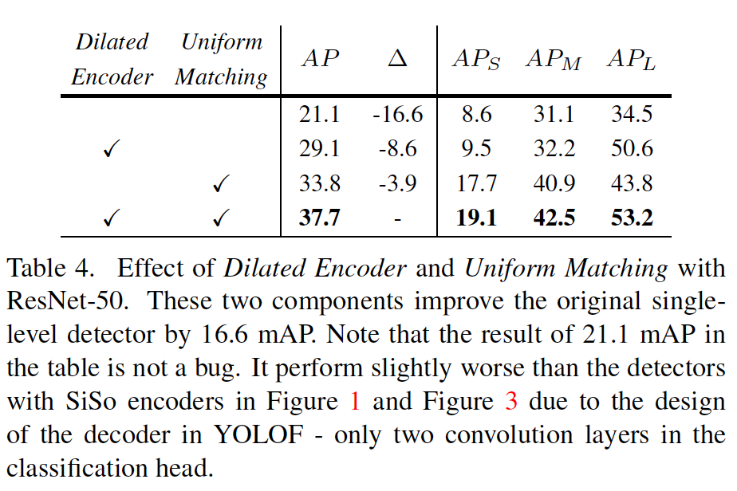

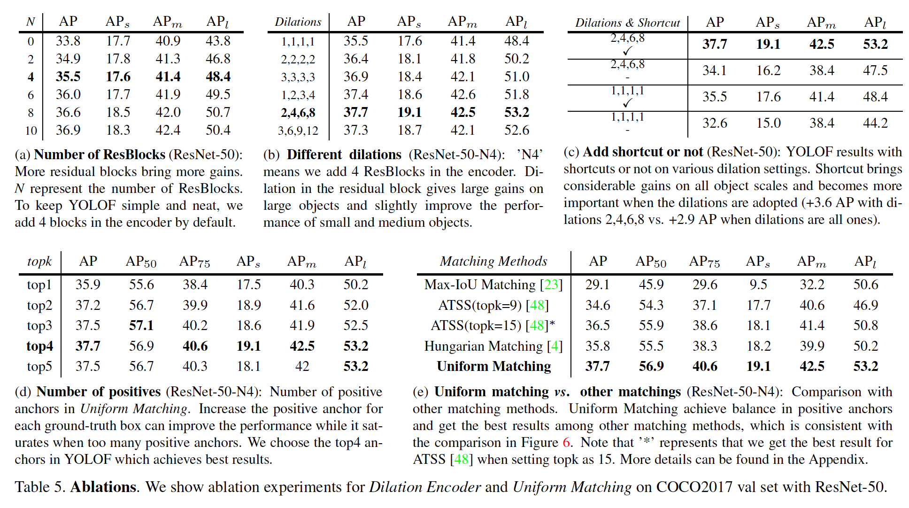

#### 5.3. 误差分析

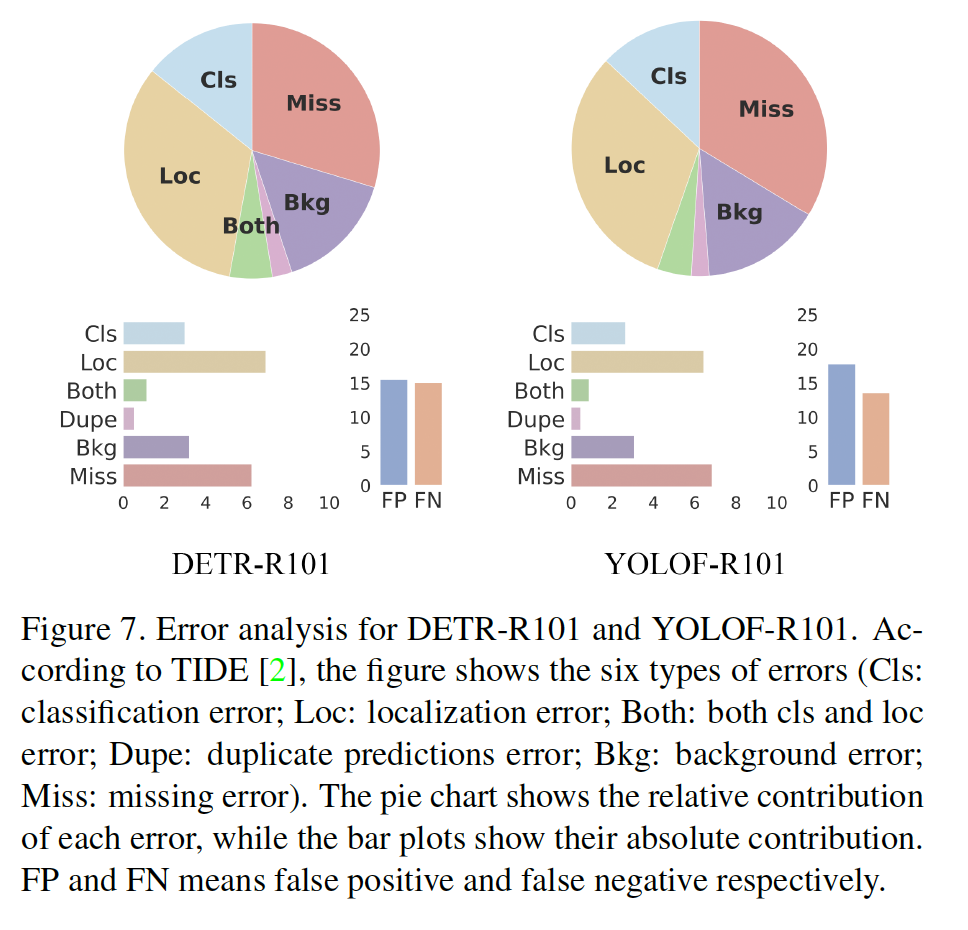

### 附录A：更多细节

**所有编码器的详细结构：**表8中，我们展示编码器中生成输出的详细过程。

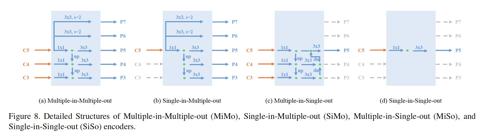

**YOLOF的网络架构**

**更多实现细节**	YOLOF的默认设置中，每个mini-batch共64张图像（每张GPU有8张图像），初始学习率为0.12。而对于ResNeXt-101[43]，每张GPU上有4张图像（batchsize为32），并遵循线性规则将学习率设置为0.06。对于多尺度训练，DETR应用随机裁剪，并加上调整大小来模拟训练期间的大图像尺寸。在YOLOF中，我们简单地将图像调整到大尺寸。对于多尺度训练，我们遵循HTC，并采用$[400,1400]$之间的图像大小的随机样本策略，并且其最大变不超过1600像素。

**与YOLOv4比较的详细设置**	为了匹配YOLOv4的性能，我们首先将膨胀编码器中膨胀残差块的数量从4增加到8。我们根据实验结果调整这些膨胀残差块的膨胀率。我们发现$[1,2,3,4,5,6,7,8]$给出最佳结果。然后。遵循YOLOv4，我们采用它的数据增强，以CSPDarknet-53作为骨干，将BN层替换为Sync-BN，并在编码器和解码器中使用LeakyReLU，而不是ReLU层。根据表9的结果，YOLOF-DC5给出比YOLOF更好的结果。因此，本节中，我们使用YOLOF-DC5作为基线。此后，我们将整个模型的初始学习率设置为0.04。为了训练最终模型，我们采用三阶段训练。首先，我们训练YOLOF-DC5 $9\times$时间表；然后，我们将负锚的忽略阈值从0.75增加到0.8，并基于先前的模型训练$3\times$时间表（这一阶段增加0.5mAP）；最后，我们通过[47]中引入的技巧训练另外“$3\times$”时间表。通过SWA模型产生表3中的最终结果，其通过平均12个checkpoints（SWA模型给出大约1mAP的提高）获得。

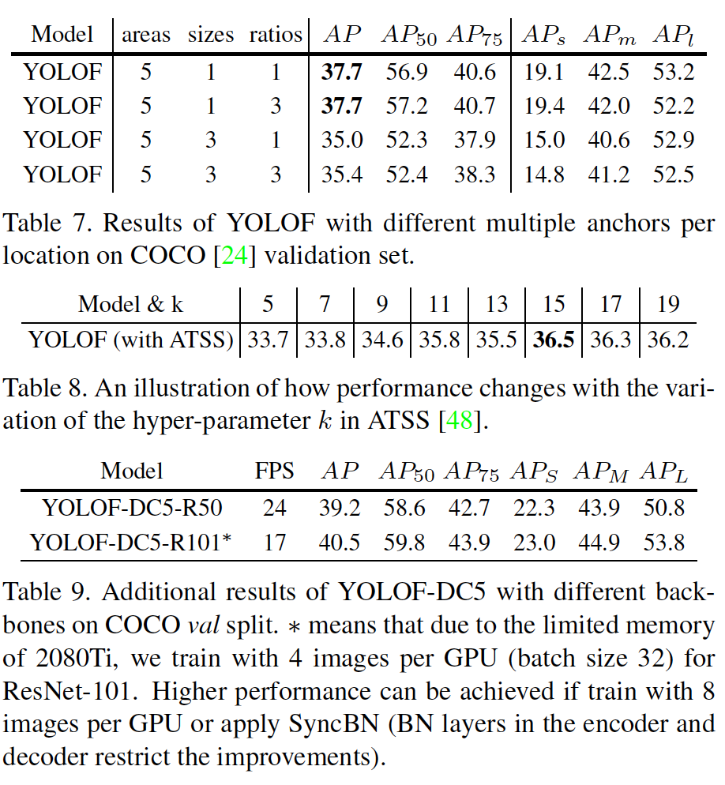

**附录B：额外的实验结果**

**锚的数量：**在RetinaNet中，多层特征（P3-P7）上生成的锚的面积从$32^2$到$512^2$。没层特征中，RetinaNet平铺大小为$\{2^0,2^{1/3},2^{2/3}\}$和纵横比为$\{0.5,1,2\}$的锚。而在YOLOF中，我们仅有一层特征来放置锚。为了覆盖所有目标尺度，我们添加面积为$\{32^2, 64^2, 128^2,256^2,512^2\}$的锚、大小为$\{1\}$、纵横比为$\{1\}$，结果在每个位置放了5个锚。此外，我们研究YOLOF中更多锚的影响。遵循RetinaNet，我们在每个位置生成不同大小（$\{2^0, 2^{1/3},2^{2/3}\}$）和更多纵横比（$\{0.5,1,2\}$）的45个锚。结果如表7所示。添加更多纵横比的结果没有改变YOLOF的性能，同时更多尺寸会降低性能。因此，我们默认选择为YOLOF添加至少五个锚点。

**ATSS的超参数：**这里，我们提供在ATSS中使用不同的$k$的结果，如表8所示。结果表明原始论文中使用的$k=9$的选择不是YOLOF中的最佳选择。根据此结果，本文中我们为ATSS选择$k=15$。

**Dilated C5的结果：**本文中，我们证明YOLOF在C5特征上表现很好。为了提升YOLOF的性能，我们在比C5特征更高分辨率的特征图上检测目标。遵循DETR，我们构建在最后阶段中具有膨胀而没有步长的骨干。骨干的输出表示为DC5，下采样率为16。在表9中，我们展示在COCO val划分上利用ResNet-50和ResNet-101作为骨干的YOLOF-DC5的结果。YOLOF-DC5获得比原始YOLOF更好的结果，但是由于该特征的分辨率大于C5，因此运行速度较慢。为了获得这个结果，我们首先添加更少的锚，每个位置产生6个锚（$\{16,32,64,128,256,512\}$），然后我们将topk从4增加到8，并将正锚的忽略阈值从0.15减小到0.1。其他超参数与之前相同。