## YOLOv4: Optimal Speed and Accuracy of Object Detection

### Abstract

​		有大量的feature据说可以提高卷积神经网络(CNN)的准确性。需要在大型数据集上对这些特性的组合进行实际测试，并对结果进行理论验证。一些特性对于某个模型和某个问题，或者小型数据集起作用，而一些特性，例如皮归一化和残差连接适用于大多数模型、任务和数据集。我们假设这样的普遍特性（包括Weighted-Residual-Connections (WRC)、Cross-Stage-Partial-connections (CSP), Cross mini-Batch Normalization (CmBN), Self-adversarial-training (SAT) 和 Mish激活）。我们使用新特性：WRC、CSP、CMBN、SAT、Mish激活、Mosaic数据增强、DropBlock正则化、CIoU损失以及他们中一些的组合获得最佳结果：MS COCO数据集上43.5%的AP（65.7% $AP_{50}$）、在Tesla V100的速度约为65FPS。

### 1. 引言

​		大多数基于CNN的目标检测器只适用于推荐系统。例如通过城市摄像机寻找免费停车位是由慢速准确的模型执行，而汽车碰撞预警与快速不准确的模型相关。提高实时目标探测器的准确性不仅可以用于提示生成推荐系统，还可以用于独立流程管理和减少人工输入。传统图形处理单元(GPU)上的实时目标检测操作允许它们以可承受的价格大量使用。大多数准确的现代神经网络不能实时运行，并需要大量的GPU以大型mini-batch训练。我们通过创建在传统GPU上运行的CNN来处理这样的问题，对于训练仅需一张传统的GPU。

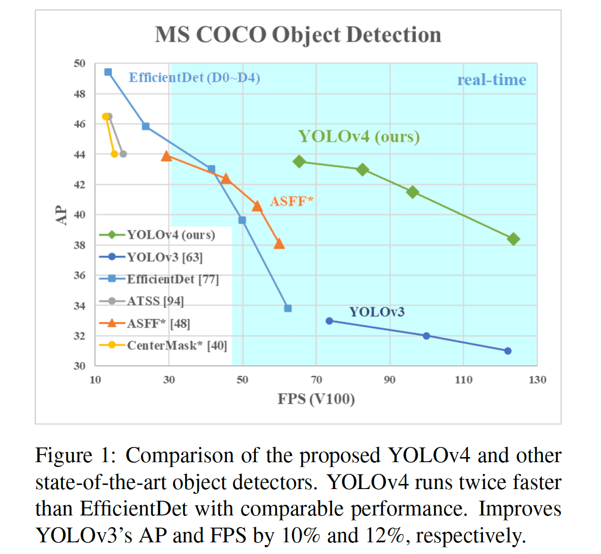

​		这项工作的主要目标是在生产系统中设计一个快速运行的目标探测器，并对并行计算进行优化，而不是设计一个低计算量的理论指示器(BFLOP)。我们希望设计的对象可以易于训练和使用。例如，使用传统GPU的任何训练和测试都可以获得实时、高质量以及令人信服的目标检测结果，如图1所示的YOLOv4结果。我们的贡献总结如下：

1. 我们开发了高效而强力的目标检测模型。它可以让任何人使用一张1080Ti或者2080Ti GPU来练超级快速而准确的目标检测器。
2. 我们验证训练期间最佳目标检测的Bag-of-Freebies和Bag-of-Specials方法的影响。
3. 我们修改最佳方法，并使它们更高效，更适合单GPU训练（包括CBN、PAN、SAM等。）

### 2. 相关工作

#### 2.1. 目标检测模型

​		现代检测器通常包含两个部分：ImageNet上预训练的backbone和用于预测目标类和边界框的头部。对于那些GPU平台上运行的检测器，它们的backbone可以VGG、ResNet、ResNeXt或DenseNet。对于运行在CPU平台的家测器，它们的backbone可以使SqueezeNet、MobileNet或者ShuffleNet。至于头部，它通常分类两类，即一阶段的目标检测器和两阶段的目标检测器。最具代表性的两阶段检测器是R-CNN系列，包括fast R-CNN、faster R-CNN、R-FCN和Libra R-CNN。还可能让两阶段检测器成为无锚检测器，例如RepPoints。对于一阶段目标检测器，最具代表的是YOLO、SSD和RetinaNet。最近几年，相继开发了无锚一阶段检测器。这类检测器包括CenterNet、CorneNet、FCOS等。最近几年开发的目标检测器通常在backbone和头部插入几层，并且这些层通常用于从不同层收集特征图。通常，颈部包含几个自下而上的路径和几个自下而上的路径。具有这种机制的网络包括FPN、PAN、BiFPN和NAS-FPN。除了上述模型，一些研究人员关注直接构建新的骨干（DetNet、DetNAS）或者新的整体模型（SpineNet、HitDetector）进行目标检测。

​		总之，普通的目标检测器包含几个部分：

- **Input：**图像、Patch、图像金字塔
- **Backbone：**VGG16、ResNet-50、SpineNet、EfficientNet-B0/B7、CSPResNeXt50、CSPDarknet53。
- **Neck：**
  - **Additional blocks：**SPP、ASPP、RFB、SAM。
  - **Path-aggregation blocks：**FPN、PAN、NAS-FPN、Fully-connected FPN、BiFPN、ASFF、SFAM。

- **Heads：**
  - **Dense Prediction（one-stage）：**
    - RPN、SSD、YOLO、RetinaNet（基于锚）
    - CornerNet、CenterNet、MatrixNet、FCOS（无锚）
  - **Sparse Prediction（two-stage）：**
    - Faster R-CNN、F-FCN、Mask R-CNN（基于锚）
    - RepPoints（无锚）

#### 2.2. Bag of freebies

​		通常，传统的目标检测器是离线训练的。因此，研究人员始终似乎利用这种优势，并开发更好的训练方法，其可使目标检测器更准确，而没有增加推理成本。我们称这些仅改变训练策略或仅增加训练成本的方法为“bag of freebies”。目标检测方法常用的，并且符合bag-of-freebies定义的是数据增强。数据增强的目的是增加输入图像的变化，使得设计的目标检测模型对于不同环境获得的图像更具鲁棒性。例如，光度失真和几何扭曲是常用的数据增强方法，它们对于目标检测任务收益是有限的。在处理光度失真时，我们调整亮度、对比度、hue、饱和度和图像的噪声。对于几何扭曲，我们添加随机缩放、裁剪、翻转和旋转。

​		上述的数据增强是全部像素的调整，调整区域中的所有原始像素信息得到保留。此外，一些专注于数据增强的研究人员将重点放在模拟目标遮挡问题。它们在图像分类和目标检测上获得良好的结果。例如，随机擦除和cutOut可以随机选择图像中的矩形，并填充随机值或者零。对于head-and-seek和grid mask，它们随机或者均匀地旋转图像中的多个矩形区域，并将它们的值替换为0。如果将相似的概念用语特征图，那么有DropOut、DropConnect和DropBlock方法。此外，一些研究人员提出一起使用多个图像的方法来执行数据增强。例如，MixUp使用不同的系数比例将两幅图像相乘和叠加，然后利用叠加比例调整标签。对于CutMix，它将裁剪的图像覆盖到其他图像的矩形区域，并根据其他图像的矩形区域的大小调整标签。除了上述方法，style transfer GAN还用于数据增强，如此使用可以有效地减小通过CNN学习的纹理偏差。

​		与上面提到的多个方法不同，一些其他的bag-of-freebies方法致力于解决数据集中语义分布具有偏差的问题。在处理语义分布偏差时，一些非常重要的问题是，不同类之间存在数据不平衡问题，这个问题通常在两阶段目标检测器中采用难负样本挖掘或OHEM。但是样本挖掘方法不适用一阶段目标检测器，因为这类检测器属于密集预测架构。因此，Lin等提出focal loss来处理不同类之间存在的数据不平衡问题。其他非常重要的问题是难以表达one-hot硬表示的不同类之间关联度的关系。在执行标签时，通常使用这个表示方案。[73]提出标签平滑，将硬标签转换为软标签用于训练，Islam等[33]引入知识蒸馏的概念来设计标签细化网络。

​		最后的bag-of-freebies是BBox回归目标函数。传统的目标检测器通常使用Mean Square Error（MSR）来直接在BBoxde中心点坐标和宽高（即$\{x_{center},y_{center},w,h\}$）上进行回归。对于基于锚的方法，它估计相应的偏移，例如$\{x_{center\_offset},y_{center\_offset},w_{offset},h_{offset}\}$和$\{x_{top\_left\_offset},y_{top\_left\_offset},w_{bottom\_right\_offset},h_{bottom\_right\_offset}\}$。然而，为了直接估计BBox的每个点的坐标值，将这些点视为独立的变量，但是事实上，没有考虑目标本身的完整性。为了让这个问题得到更好的处理，最近一些研究人员提出IoU损失，其同时考虑预测到的BBox面积和ground-truth BBox面积。IoU损失的计算过程通过执行与ground-truth之间的IoU触发BBox的四个坐标点，然后将生成的结果连接到整个代码。因为IoU时尺度不变的表示，所以它可以解决传统方法计算$\{x,y,w,h\}$的$l_1$或$l_2$损失时，损失降随尺度增加的问题。最近，一些研究人员继续改进IoU损失。例如，GIoU损失在包含目标形状和方向的前提下，还加入了覆盖区域。它们提出找到同时覆盖预测BBox和ground-truth BBox的最小面积的BBox，并使用这个BBox作为分母，从热替换IoU损失中使用的原始分母。至于DIoU损失，它额外考虑目标中心的距离，而CIoU损失同时考虑了重叠面积、中心点之间的距离和纵横比。在回归问题上，CIoU可以获得更好的收敛速度和准确率。

#### 2.3. Bag of specials

​		对于那些仅增加少量推理成本的插件模块和后处理方法可以显著提高目标减的准确率，我们将它们称为“bag of specials”。一般而言，这些插件模块是针对目标检测中特定特性的，例如扩大感受野、引入注意力机制或者增强特征集成能力等，并且后处理是针对筛选模型预测结果的方法。

​		用于增强感受野的常用模块是SPP、ASPP和RFB。SSP模块源自Spatial Pyramid Matching（SPM）[39]，最初的SPM方法将特征图划分为几个$d\times d$的相等模块，其中$d$可以为$\{1,2,3,\cdots\}$，因此构成空间金字塔，然后提取bag-of-word特征。SPP将SPM集成到CNN中，并使用最大池化替换bag-of-word。因为He等[25]提出的SPP模块输出一维特征向量，所以它可用于FCN。因此，在YOLOv3的设计中，Redmon和Farhadi改进SPP模块以拼接核大小为$k \times k$（$k = \{1,5,9,13\}$）和步长为1的最大池化的输出。在这种设计之下，相对较大的$k \times k$最大池化有效增加了骨干特征的感受野。在添加改进的SPP模块之后，YOLOv3-608以0.5%的计算成本增江将MS COCO目标检测任务的$AP_{50}$ 提高2.7%。ASPP模块和改进的SPP模块之间的差异主要来自原始的$k \times k$核大小和步长等于1的最大池化与几个$3\times3$、膨胀率为$k$和步长等于1的膨胀卷积。RFB模块使用几个核大小为$k \times k$、膨胀率等于$k$以及步长等于1的卷积获得比ASPP更大的空间覆盖。RFN仅花费7%的额外推理时间，但将SSD在MS COCO上的$AP_{50}$增加了5.7%。

​		常用语目标检测的注意力模块主要分为通道注意力和点注意力，这两个注意力模块的代表性工作分别是Squeeze-and-Excitation（SE）和Spatial Attention Module（SAM）。尽管SE模块可以将ResNet-50在ImageNet图像分类任务的top-1准确率提高1%，而仅增加2%的计算成本，但是在GPU上，它通常会增加2%的推理时间，因此它更适合用于移动设备。但是对于SAM，它仅需要付出0.1%的额外计算，并可以将ResNet50-SE的top-1准确率增加0.5%。更好的是，它不会影响GPU上的推理时间。

​		在特征集成方面，早期的实践是使用skip连接或hyper-column来将低级物理特征集成到高级语义特征。因为诸如FPN的多尺度预测方法越来越流行，研究人员提出许多集成不同特征金字塔的轻量模块。这类模块包括SFAM、ASFF和BiFPN。SFAM的主要思想是使用SE模块来执行多尺度拼接特征图上的通道级重加权。至于ASFF，它使用softmax作为点级重加权，然后添加不同尺度的特征图。在BiFPN中，提出多输入加权残差连接来执行尺度级重加权，然后将不同尺度的特征图相加。

​		在深度学习的研究中，一些人关注好的激活函数。一个好激活函数可以是梯度更高效的传播，同时，它不会引起过多的额外计算成本。2010年，Nair和Hinton[56]提出ReLU来实质上解决梯度消失问题，而在传统tanh和sigmoid激活函数中常遇到这个问题。接着，还提出了LReLU [54]、PReLU [24]、ReLU6 [28]、Scaled Exponential Linear Unit (SELU) [35]、Swish [59]、hard-Swish [27]和Mish [55]用于解决梯度消失问题。LReLU和PReLU的主要目的是解决，当输出小于0时，ReLU的梯度为0。对于ReLU6和hard-Swish，它们专门设计用于量化网络。为了实现神经网络的自归一化，提出了SELU激活函数。需要注意的一点是，Swish和Mish都是连续可微的激活函数。

​		基于深度学习的目标检测常用的后处理是NMS，其可以用于过滤那些相同目标的坏预测，并仅保留更高响应的候选BBox。NMS改进的方法与优化目标函数的方法是一致的。NMS提出的原始方法没有考虑上下文信息，所以Girshick等人[19]在R-CNN中加入了分类置信度评分作为参考，按照置信度评分的顺序，从高到低依次进行贪心NMS。对于soft NMS[1]，考虑了在IoU的分的贪心NMS中，目标的遮挡可能会导致置信度得分下降的问题。DIoU NMS[99]开发人员的思路是在soft-NMS的基础上，将中心点距离信息加入到BBox筛选过程中。值得一提的是，由于以上的后处理方法都不直接引用捕获的图像特征，因此在后续的无锚方法开发中不再需要后处理。

### 3. Methodology

​		本文的基本目标是在生产系统中提高神经网络的运行速度和并行计算的优化速度，而不是低计算量理论指标(BFLOP)。我们提出实时神经网络的两个选项：

- 对于GPU，我们在卷积层中使用少量分组（1-8）：CSPResNeXt50/CSPDarknet53。
- 对于VPU，我们使用分组卷积，，但是我们不使用squeeze -and- exciting (SE)块——具体来说，它包括以下模型：EfficientNet-lite / MixNet [76] / GhostNet [21] / MobileNetV3。

#### 3.1. 架构选择

​		我们的目标是找出输入网络分辨率、卷积层数、参数（$\mbox{filter_size}^2 \ast \mbox{filters} \ast \mbox{channel}/\mbox{groups}$）和层输出（filters）的数量之间的最优平衡。例如，我们的大量研究表明，在ILSVRC2012 (ImageNet)数据集[10]上的目标分类方面，CSPResNext50要比CSPDarknet53好得多。然而，相反，在MS COCO数据集上的目标检测方法，CSPDarknet53比CSPResNext50好。

​		下一个目标是为增加感受野和不同骨干层的参数聚合的最佳方法选择额外的块，如FPN、PAN、ASFF、BiFPN。

​		对分类最优的参考模型不一定对检测器最优。与分类器相比，检测器需要满足以下条件:

- 更高的输入网络大小（分辨率）-- 检测多个小型目标。
- 更多层 -- 更高感受野以覆盖输入网络增加的大小。
- 更多参数 -- 更大的模型容量以在单个图像中检测多个不同大小的目标。

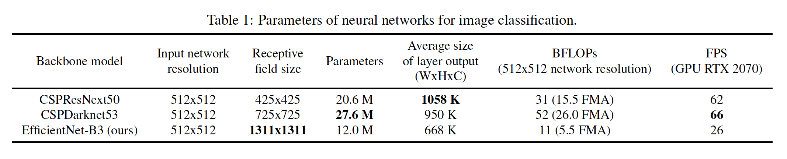

​         假设说，我们可以假设更大感受野（大量$3 \times 3$卷积层）和更多参数的模型应当作为骨干。表1给出CSPResNeXt50、CSPDarknet53和EfficientNet-B3的信息。CSPResNext50仅包含16个$3 \times 3$卷积、$425 \times 425$的感受野和20.6M参数，而CSPDarknet53包含29个$3\times3$卷积层、$725 \times 725$的感受野和27.6M参数。这一理论证明，以及我们的大量实验，表明CSPDarknet53神经网络是作为检测器主干的两者的最佳模型。

​		不同大小感受野的影响总结如：

- 达到目标大小 -- 运行查看整个目标。
- 达到网络大小 -- 运行查看目标周围的上下文。
- 超过网络大小 -- 增加图像点和最终激活之间的连接数。

​        我们在CSPDarknet53上添加SPP，因为它显著增加感受野，分离出了最重要的上下文特性，并且几乎不会降低网络的运行速度。我们使用PANet作为模型不同检测的不同骨干层的参数聚合方法，而不是使用YOLOv3中的FPN。

​		最后，我们选择CSPDarknet53骨干、SPP、PANet和YOLOv3头部（基于锚）作为YOLOv4的架构。

​		未来，我们计划扩展检测的Bag-of-Freebie（BoF）中的内容，其理论上可以处理一些问题，并提高检测器的准确率，以及以实验的形式依次检查每个特性的影响。

​		我们没有使用Cross-GPU Batch Normalization（CGBN或SyncBN）或昂贵的特定设备。这允许任何人都可以在一张传统图像处理器（例如GTX 1080Ti或RTX 2080Ti）复现我们的最佳结果。

#### 3.2. BoF和BoS的选择

​		为了改进目标检测的训练，CNN通常使用如下的组件：

- **激活：**ReLU、leaky-ReLU、parametric-ReLU、ReLU6、SELU、Swish或Mish。
- **边界框回归损失：**MSE、IoU、GIoU、CIoU、DIoU。
- **数据增强：**CutOut、MixUp、CutMix。
- **正则化方法：**DropOut、DropPath[36]、Spatial DropOut[79]或DropBlock。
- **通过均值和方差的网络激活归一化：**BN、Cross-GPU Batch Normalization（CGBN或SyncBN）、Filter Response Normalization（FRN）或Cross-Iteration Batch Normalization（CBN）[89]。
- **Skip-connections：**残差连接、加权残差连接、多输入加权残差连接或Cross partial connections（CSP）。

​        对于激活函数，因为PReLU和SELU更难以训练，而ReLU6专门为量化网络设计，因此，我们从候选列表中删除上述激活函数。在reqularization方法中，发表Drop-Block的人将其方法与其他方法进行了详细的比较，其正则化方法取得了很大的成果。因此，我们毫不犹豫地选择了DropBlock作为我们的正则化方法。 至于标准化方法的选择，由于我们专注于仅使用一个GPU的训练策略，因此不考虑syncBN。

#### 3.3. 额外改进

​		为了使设计的检测更适合在单个GPU上训练，我们作出如下的额外设计和改进：

- 我们引入一种新的数据增强方法Mosaic和Self-Adversarial Training（SAT）。
- 我们选择最优的超参数，同时使用通用的算法。
- 我们修改一些已有的方法使我们的实际适合高效训练和检测——修改的SAM、修改的PAN和Cross mini-Batch Normalization（CmBN）。

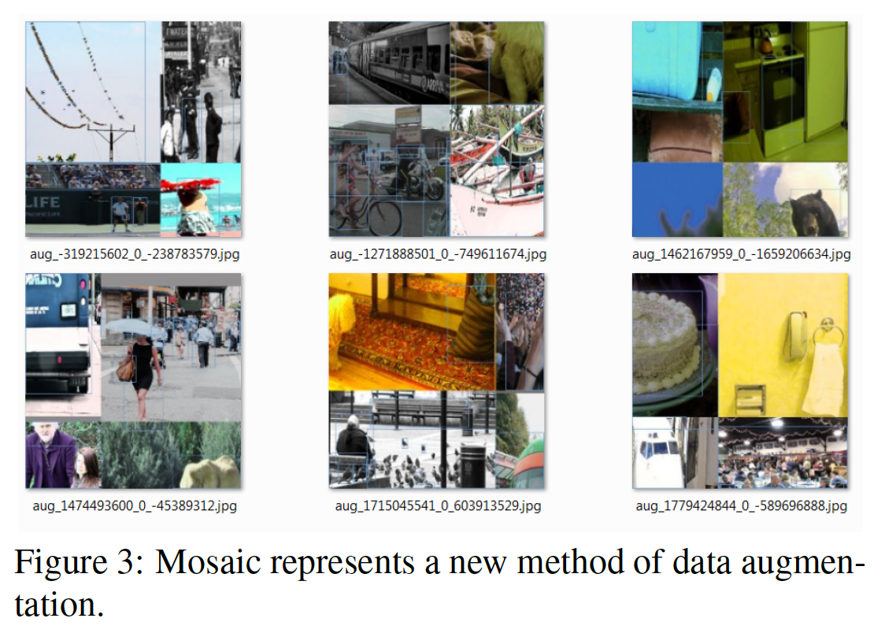

​		Mosaic表示一种新的数据增强方法，其混合4张训练图像。 因此，混合了4个不同的上下文，而CutMix仅混合了2个输入图像。此外，每层中，BN计算4幅不同图像的激活统计量。这明显减小大mini-batch的需要。

​		Self-Adversarial Training（SAT）还表示一种新的数据增强技术，其在两个前向后向阶段运行。第一个阶段修改原始图像，而不是网络权重。以这种方式，神经网络对其自身执行对抗攻击，从而改变原始图像以产生对图像上没有所需物体的欺骗。第二阶段中，训练神经网络以以规范的方式在这个修改的图像上检测目标。

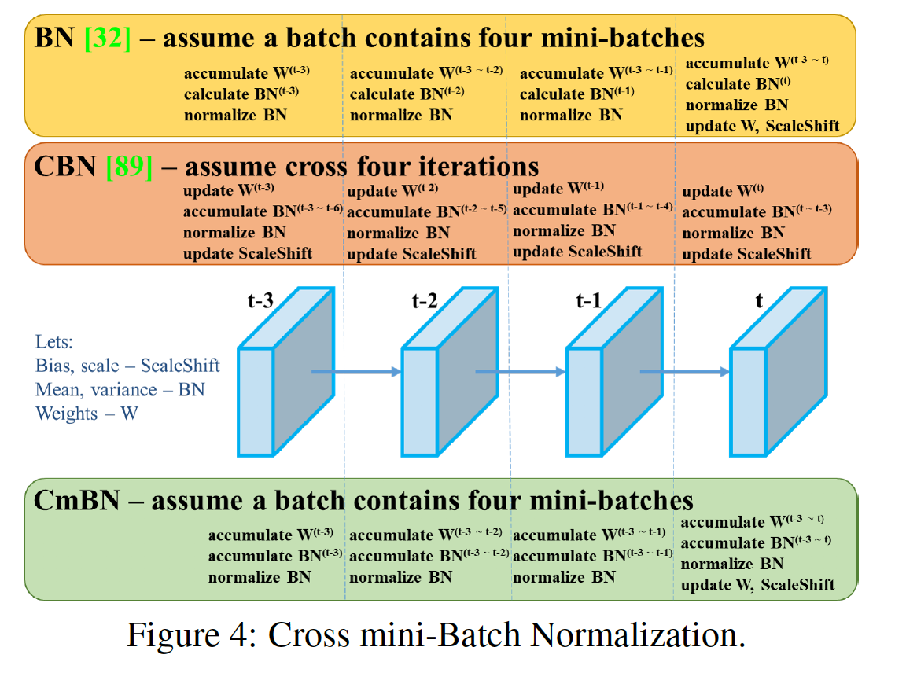

​		CmBN表示CBN的修改版，如图4所示，定义为Cross mini-Batch Normalization（CmBN）。这仅收集单个batch中mini-batch之间的统计量。

​		我们将SAM从空间注意力改为点注意力，并将PAN的快捷连接替换为串联（concatenation），分别如图5和图6所示。

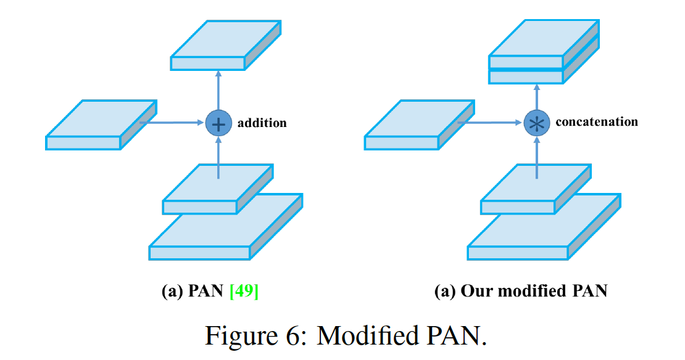

#### 3.4. YOLOv4

​		本节中，我们将介绍YOLOv4的细节。

​		**YOLOv4 包含：**

- Backbone：CSPDarknet53

- Neck： SPP、PAN

- Head：YOLOv3

  **YOLOv4使用：**

- Backbone的bag-of-freebies（BoF）：CutMix和Mosaic数据增强、DropBlock正则化、类标签平滑
- Backbone的bag-of-specials（BoS）：Mish、Cross-stage partial connections（CSP）、Multi-input weighted residual connections（MiWRC）
- 检测器的bag-of-freebies（BoF）：CIoU-loss、CmBN、DropBlock正则化、Mosaic数据增强、Self-Adversarial Training、Eliminate grid sensitivity、为单个ground-truth使用多个锚、Cosine退火学习率调度器、Optimal hyper-parameter、随机训练形状
- 检测器的bag-of-specials（BoS）：Mish、SPP-block、SAM-block、PAN、DIoU-NMS。

### 4. 实验

​		我们测试了不同训练改进技术对ImageNet（ILSVRC 2012 val）数据集上分类器准确性的影响，然后对MS COCO（test-dev 2017）数据集上检测器的准确性进行了影响。

#### 4.1. 实验设置

​		在ImageNet图像分类实验中，默认的超参数如下：训练步数为8000000、batch-size和mini-batch size分别为128和32、采用初始学习率为0.1的多项式学习率衰减策略、warm-up步数为1000、momentum和权重衰减分别设置为0.9和0.0005。对于BoS实验，使用与默认相同的超参数，而在BoF实验中，我们增加50%的训练步数。在BoF实验中，我们验证MixUp、CutMix、Mosaic、Bluring数据增强和标签平滑正则化。在BoS实验中，我们比较LReLU、Swish和Mish激活函数的影响。利用一个1080Ti或2080Ti GPU训练所有实验。

​		在MS COCO目标检测实验中，默认超参数如下：训练步数为500500；初始学习率为0.01，并在400000步和450000步时乘以0.1；momentum和权重衰减分别设置为0.9和0.0005。所有架构使用单个GPU，以64的batch-size（而mini-batch大小为8或4）进行多尺度训练。除了使用遗传算法进行超参数搜索实验外，所有其他实验均使用默认设置。YOLOv3-SPP使用的遗传算法利用GIoU损失训练，并在min-val 5k数据集上搜索300个周期。我们采用遗传搜索算法实验搜索到的学习率0.00261、动量0.949、分配ground-truth的IoU阈值为0.213以及损失规范化算子为0.07。我们验证大量BoF，包括grid sensitivity elimination、mosaic数据增强、IoU阈值、遗传算法、类标签平滑、cross mini-batch归一化、self-adversarial训练、余玄退火调度器、动态mini-batch大小、DropBlock、优化的锚、不同种类的IoU损失。我们还进行多种BoS实验，包括Mish、SPP、SAM、RFB、BiFPN和Gaussian YOLO。对于所有实验，我们仅使用一个GPU进行训练，因此不适用诸如syncBN的多GPU优化。

#### 4.2. 不同特性对分类器训练的影响

​		首先，我们研究不同特性对分类器训练的影响，具体包括来标签平滑的影响、不同数据增强技术（bilateral blurring、MixUp、CutMix和Mosaic），如图7所示，以及不同激活（例如Leaky-ReLU（默认）、Swish和Mish）。

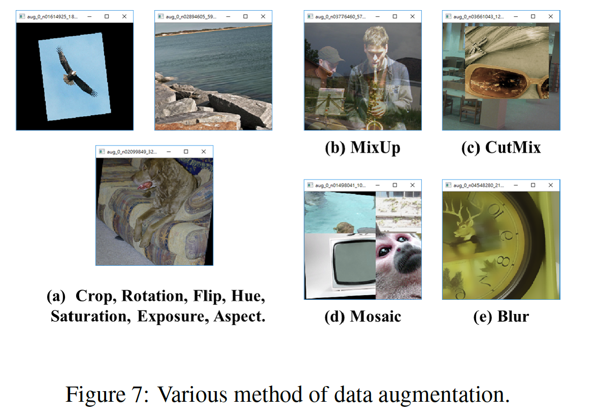

​		在我们的实验中，如表2所示，提高分类器准确率的的特性，例如CutMix和Mosaic数据增强、类标签平滑以及Mish激活。因此，分类器训练的BoF包括：CutMix和Mosaic数据增强以及类标签平滑。此外，我们使用Mish激活作为补充选项，如表2和表3所示。

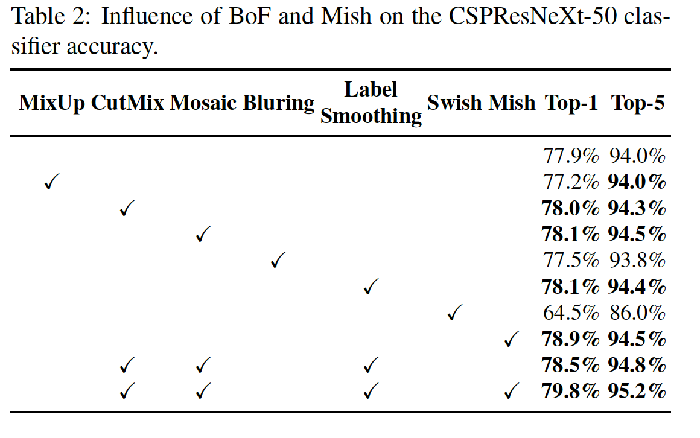

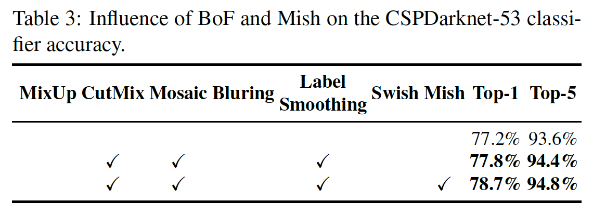

#### 4.3. 不同特性对检测器训练的影响

​		进一步研究关心不同BoF对于检测器训练准确率的影响，如表4所示。通过研究在不影响FPS的情况下提高检测器精度的各种功能，我们大大扩展了BoF列表：

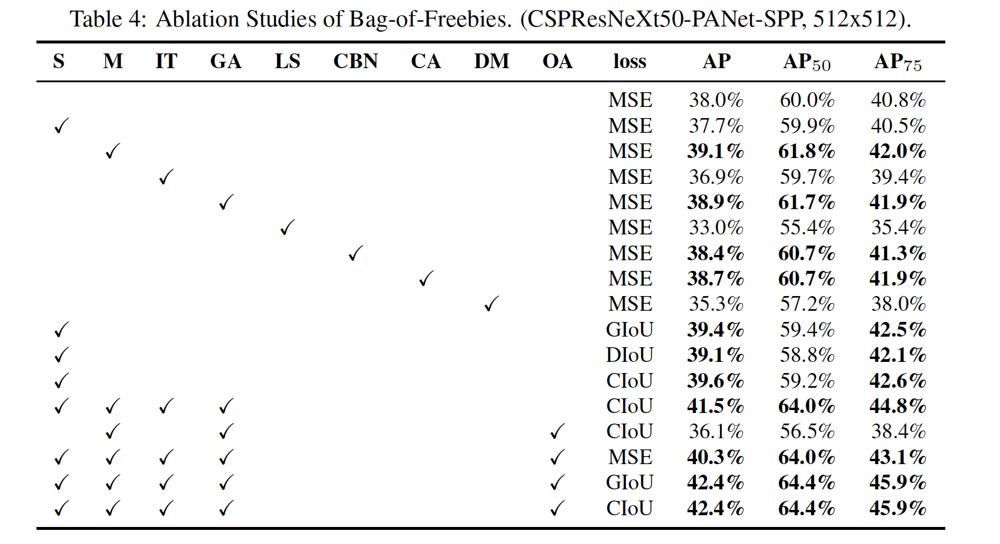

- S：Eliminate grid sensitivity  等式$b_x = \sigma(t_x) + c_x, b_y =\sigma(t_y) + c_y$，其中$c_x$和$c_y$，其中$c_x$和$c_y$始终是整数，在YOLOv3中用于评估目标坐标，因此，对于接近$c_x$或$c_x + 1$值的$b_x$值，需要非常高的$t_x$绝对值。我们通过将sigmoid乘以超过1.0的因子来解决此问题，从而消除了不可检测目标的网格的影响。
- M：Mosaic数据增强 —— 训练中使用4张图像的mosaic，而不是单张图像
- IT：IoU阈值——为IoU（truth，anchor）> IoU_threshold的单个groun-truth 使用多个anchor。
- GA：Genetic algorithms——使用遗传算法在网络训练的前10％的时间段中选择最佳超参数
- LS：Class label smoothing——为sigmoid激活使用类标签平滑
- CBN：CmBN——为手机整个batch内部的统计量使用Cross mini-Batch Normalization，而不是收集单个mini-batch中的统计量
- CA：Cosine annealing scheduler——在正弦曲线训练中改变学习率
- DM：Dynamic mini-batch size——使用随机训练形状在小分辨率训练过程中自动增加小批量大小
- OA：Optimized Anchors——使用优化的锚以512x512网络分辨率进行训练
- GIoU、CIoU、DIoU、MSE——为边界框回归使用不同的损失算法

​         进一步的研究涉及不同的Bag-of-Specials（BoS-detector）对检测器训练精度的影响，包括PAN、RFB、SAM、高斯YOLO（G）和ASFF，如表5所示。在我们的实验中，当使用SPP、PAN和SAM时，检测获得最佳性能。

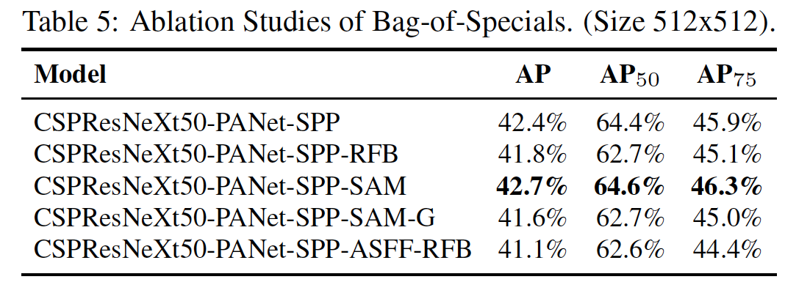

#### 4.4. 不同backbone和预训练权重对检测器训练的影响

​		我们进一步研究不同骨干模型对检测器准确率的影响，如表6所示。我们注意到，就检测器精度而言，具有最佳分类精度的模型并不总是最佳的。

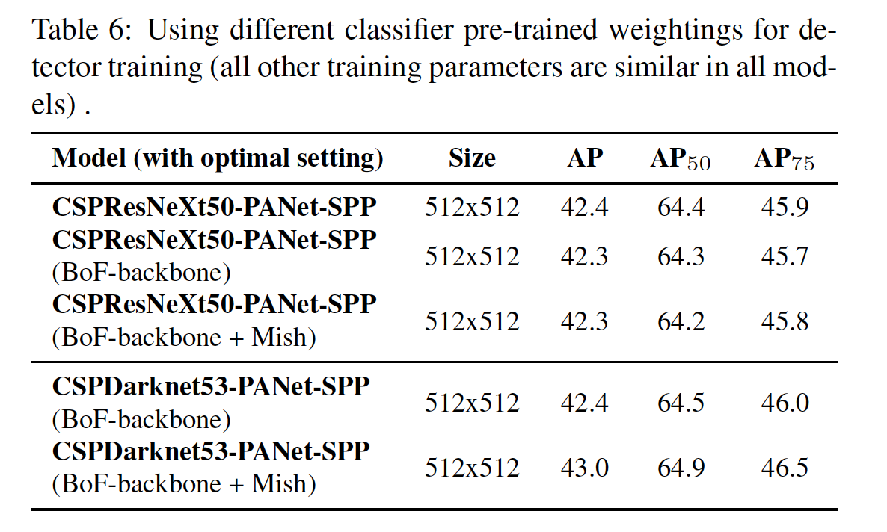

​		首先，尽管离哟哦那个不同特性训练的CSPResNeXt-50模型的分类准确率比CSPDarknet53模型高，但是，在目标检测方面，CSPDarknet53模型表现出更高的准确率。

​		其次，为CSPResNeXt50分类器训练使用BoF和Mish增加其分类准确率，但是将这些预训练的权重进一步用于检测器训练时，减小了检测器的准确率。但是，将BoF和Mish用于CSPDarknet53分类器训练会提高分类器和使用该分类器预训练权重的检测器的准确性。最终结果是，骨干CSPDarknet53比CSPResNeXt50更适合于检测器。

​		我们观察到，由于各种改进，CSPDarknet53模型显示出提高检测器精度的更大能力。

#### 4.5. 不同mini-batch大小对检测器性能的影响

​		最后，我们分析利用不同mini-batch大小训练的模型获得的结果，如表7所示。根据表7的结果，我们发现，在添加BoF和BoS训练策略后，mini-batch大小对检测器的性能几乎没有影响。这个结果表明，在引入BoF和BoS之后，不在需要使用昂贵的GPU进行训练。换句话说，任何人都可以仅使用一个传统的GPU来训练优秀的检测器。

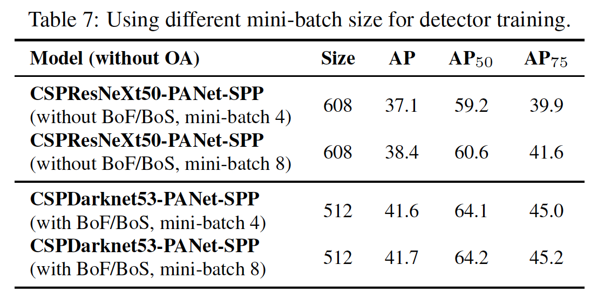

### 5. 结果

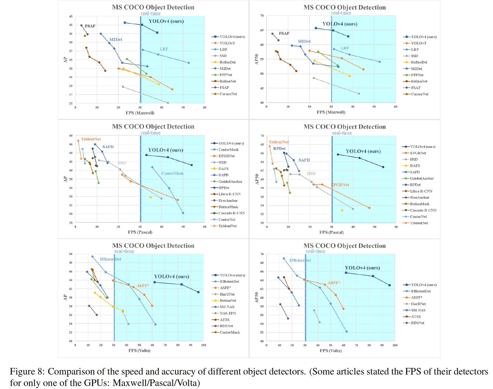

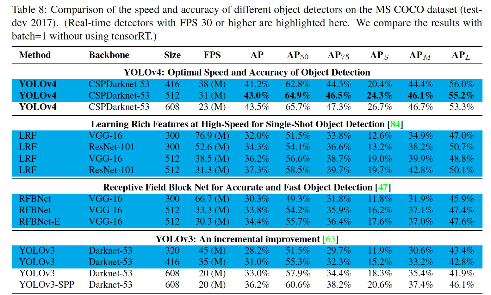

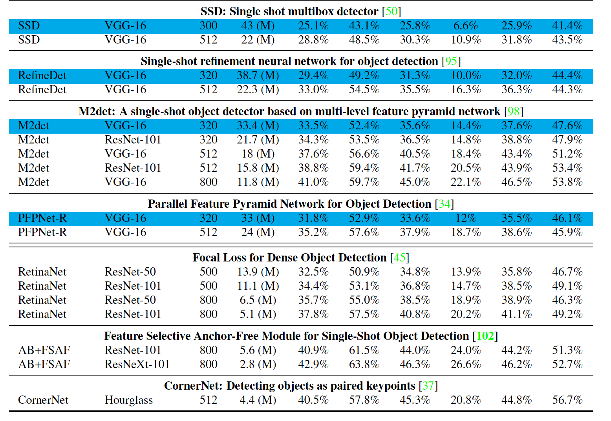

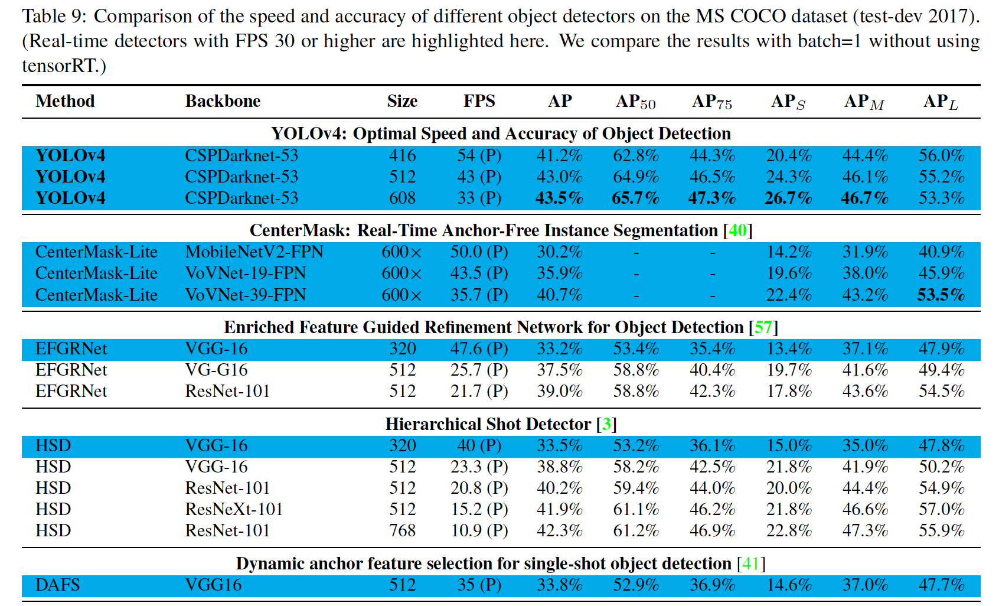

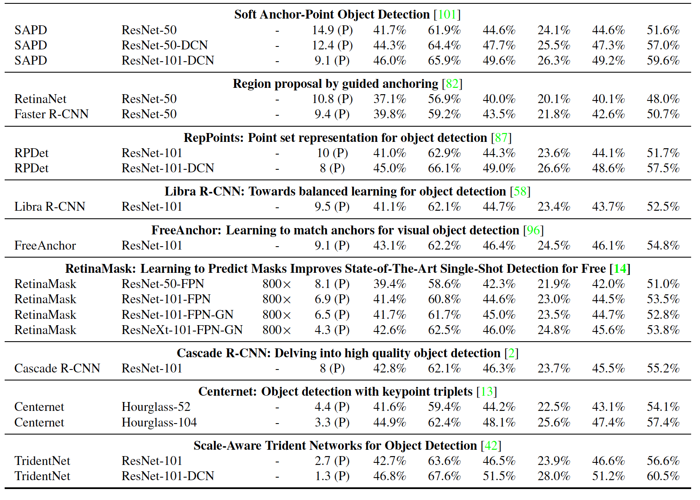

