### Learning Data Augmentation Strategies for Object Detection

#### 摘要

​		数据增强是训练深度学习模型的重要组成部分。尽管已经证明数据增强可以显着改善图像分类，但是尚未充分研究其潜力以用于物体检测。考虑目标检测标注图像的额外成本，数据增强对于这项计算机视觉任务甚至可能更为重要。本文中，作者研究数据增强在目标检测上的影响。作者首先论证借助图像分类的数据增强操作可能有助于训练检测模型，但是改进有限。因此，作者研究学习到的特定的数据增强策略是如何提高检测模型的泛化性能的。重要的是，这些增强策略仅影响训练，而评估期间离开训练模型也不会发生改变。COCO数据集上的实验表明一个优化的数据增强策略提高的检测准确率超过2.3mAP，并且允许单个推理模型获得50.7mAP的检测最佳检测性能。重要的是，在COCO上发现的最佳策略可以没有改变地迁移到其他检测数据集和模型以获得预测准确率的提高。例如，利用COCO确定的最贱增强策略将PASCAL-VOC最强基线提高了2.7mAP。本文的结果还表明学习到的增强策略优于目标检测的最佳架构的正则化方法，甚至与最强的基线比较时也是如此。

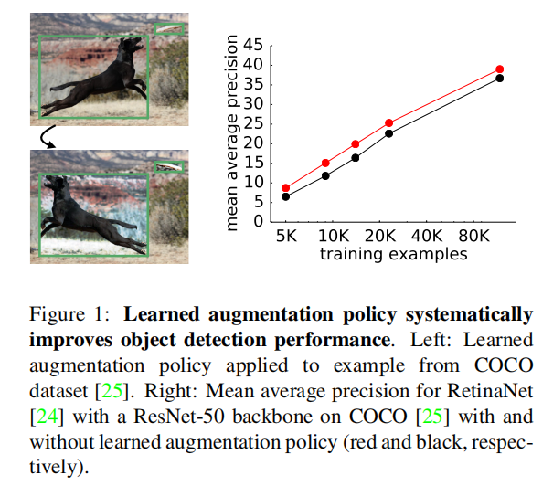

#### 1. 引言

​		常用的数据增强策略包括**平移图像少量像素或者水平翻转图像**。数据增强对于目标检测来说更加重要，因为目标检测的数据标准成本更高，并且常规的检测数据集远少于图像分类数据集。然而，如何增强数据是不清楚的：**是否应当直接重用图像分类的数据增强策略？我们应该如何处理边界框和边界框的内容？**

​		本文中，作者创建了一组可能用于目标检测数据集的变换，然后将这些变换迁移到其他检测数据集和架构。这些变换仅在训练期间使用，测试期间则不需要。本文的变换包括用于整幅图像而影响边界框位置的的变换（如来自图像分类模型的颜色变换）、影响整幅图像同时改变边界框位置的变换（例如整幅图形的平移或shearing），以及仅用于边界框中目标的变换。随着变换的增多，将它们高效地组合变得不那么容易。因此，需要搜索为检测算法专门设计的策略。实验表明在不同数据集、数据大小、骨干架构和检测算法上，该方法都获得了非常好的性能。此外，作者研究了数据增强策略的性能是如何依赖搜索空间中操作的数量，以及检测的有效性是如何随数据集的大小而改变的。

​		本文的主要贡献如下：

- 通过组合特定于边界框标注的新颖操作，设计并实现一种搜索方法，以组合和优化针对目标检测问题的数据增强策略。

- 在一系列检测架构和数据集上，证明了在交叉验证准确性上的一致提高。特别是，这种方法超过了COCO上单个模型的最佳结果，并并在PASCAL VOC目标检测方面获得了有竞争力的结果。

- 通过提供强大的正则化避免在小对象上过拟合，突出学习到的数据增强策略对于小型数据集如何特别有利。

  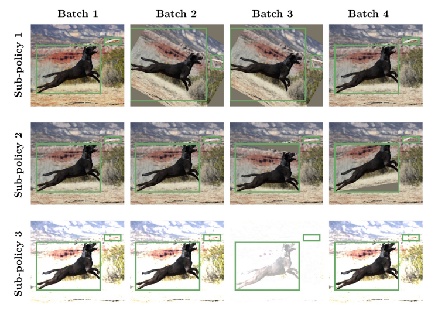

  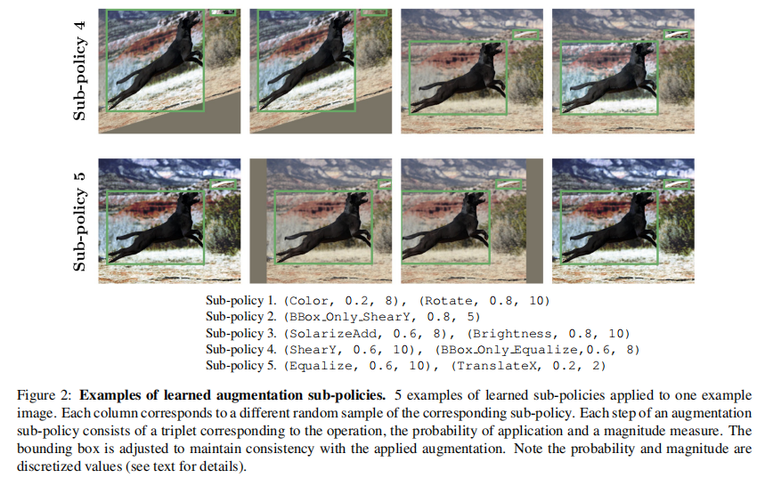

  #### 3. 方法

  ​		作者将数据增强搜索视为离散问题，并针对泛化性能优化。这项工作是将“AutoAugment”的工作扩展到目标检测的增强策略。目标检测引入了另一种复杂性，即维持边界框位置和扭曲图像之间的一致性。边界框标注打开了引入增强操作的可能性，这些操作唯一地作用于每个边界框内的内容。此外，作者探索了当将几何变换用于图像时，如何改变边界框的位置。

  ​		作者将增强策略定义为$K$个子策略的无序集合。训练期间，随机选择$K$个子策略中的一个，然后将它用于当前图像。每个子策略有$N$个图像变换，它们将依次使用。通过创建搜索空间，作者将搜索学习的数据增强策略的问题转变为离散的优化问题[5]。**搜索空间包含$K=5$个子策略，每个子策略包含$N=2$个依次用于单幅图像的操作。此外，每个操作也与描述应用操作的概率和操作的程度的两个超参数相关。**图2（底部文字）展示了学习到的子策略中的5个。概率参数将随机概念引入到增强策略中，从而将选定的增强操作以指定的概率应用于图像。

  ​		在几个初步实验中，作者为搜索空间确定了22个看起来有益于目标检测的操作。这些操作见表6。

  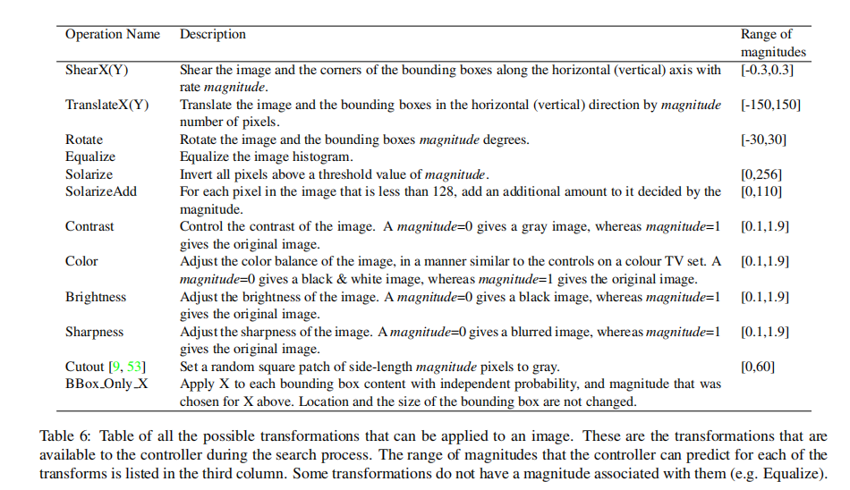

  ​		注意，对于任何影响图像几何性质的操作，同样会修改边界框的大小和位置以保持一致性。
  
  ​		作者将每个操作与一个参数值的自定义范围关联，并将这个范围映射到0到10的标准范围。作者将幅度范围离散为$L$个均匀间隔的值，使得这些参数适合离散优化。相似地，作者将用于操作的概率离散化为$M$个均匀间隔的值。在初步实验中，作者发现设置$L=6$和$M=6$可以在RL算法的计算可处理性和学习性能之间取得良好的平衡。因此，找到一个好的子策略就成为了在一个包含$(22LM)^2$基数的离散空间中的搜索。特别是，要搜索5个字策略，搜索空间大约包含$(22\times6\times6)^{2\times5}\approx 9.6×10^{28}$个可能性，并且需要一种有效的搜索技术来导航该空间。
  
  ​		存在许多方法来处理离散优化问题，包括强化学习、进化方法和基于序列模型的优化。本文选择通过构建离散优化问题作为RNN的输出空间来构建先前的工作，并采用强化学习来更新模型的权重[55]。RNN的训练设置与[55、56、6、5]相似。本文采用proximal policy optimization（PPO）作为搜索算法。RNN展开了30个步，以预测单个增强策略。展开步骤的数量30对应于枚举5个子策略必须进行的离散预测的数量。每个子策略包含两个操作，每个操作包含3个预测，预测对应选择的图像变换、应用的概率和变换的幅度。
  
  ​		为了训练每个子模型，作者从COCO训练集上选择5K图像，因为直接在完整的COCO数据集上搜索尤其昂贵。作者发现，以此数据子集确定的策略可以推广到整个数据集，同时可以节省大量计算量。简而言之，在COCO图像上，使用ResNet-50骨干和RetinaNet检测器从头训练每个子模型，并使用余弦学习率衰减。控制器的奖励信号是根据从COCO训练集的子集创建的7392个图像的定制保留验证集上的mAP。
  
  ​		RNN控制器20K增强策略训练。该搜索在48小时内使用了400个TPU [20]，控制器的超参数与[56]相同。可以使用基于population的训练[17]或密度匹配[23]的最新开发的更有效的搜索方法来加快搜索速度。学习到的策略如表7。
  
  #### 4. 结果
  
  ​		使用带有Restina-50 [16]骨干的RetinaNet [24]的COCO数据集应用了自动增强方法，以便找到良好的增强策略以推广到其他检测数据集。使用基学习率0.08训练150epoch，图像大小为$640\times640$，focal损失参数为$\alpha=0.25$、$\gamma=1.5$，权重衰减为$1e-5$，批大小为64。使用COCO上发现的top策略，并将它用于不同的数据集、数据集大学和架构配置以检验泛化能力，以及该策略在有限的数据中表现如何。
  
  ##### 4.1. 学习数据增强策略
  
  ​		在5K COCO训练图像上搜索学习的增强策略，得出最终的增强策略，该策略将用于本文的所有结果。经过检查，良好策略中最常用的操作是“_旋转_”，它会旋转整个图像和边框。旋转后，边界框最终会变大，以包含所有旋转的对象。尽管_旋转_操作有这种影响，但它似乎非常有用：它是良好策略中最常用的操作。其他两个常用的操作是_Equalize_和_BBox_Only_TranslateY_。_Equalize_均衡会展平像素值的直方图，并且不会修改每个边界框的位置或大小。_BBox_Only_TranslateY_仅垂直平移边界框中的目标，即以相同概率向上或向下平移。
  
  ##### 4.2. 学习到的增强策略系统地改善目标检测
  
  ​		作者评估了COCO数据集[25]上不同骨干架构和检测算法的最高增强策略的质量。作者从具有竞争力的RetinaNet对象检测器开始，该检测器采用与[13]相同的训练协议。简而言之，使用64的batch size从头训练，图像被调整至 $640\times640$，学习率为0.08，权重衰减为$1e-4$，focal loss的参数为$\alpha=0.25$，$\gamma=1.5$，训练150个epoch，训练120和140个epochs后学习率减少10倍。
  
  ​		在本节及其后各节中使用的基线RetinaNet架构采用了标准的数据增强技术，这些技术主要是针对图像分类训练而定制的[24]。包括以50%概率进行水平翻转以及多尺度扰动（在训练期间，将图像随机调整到512和786之间的值，然后裁剪为$640\times 640$）。
  
  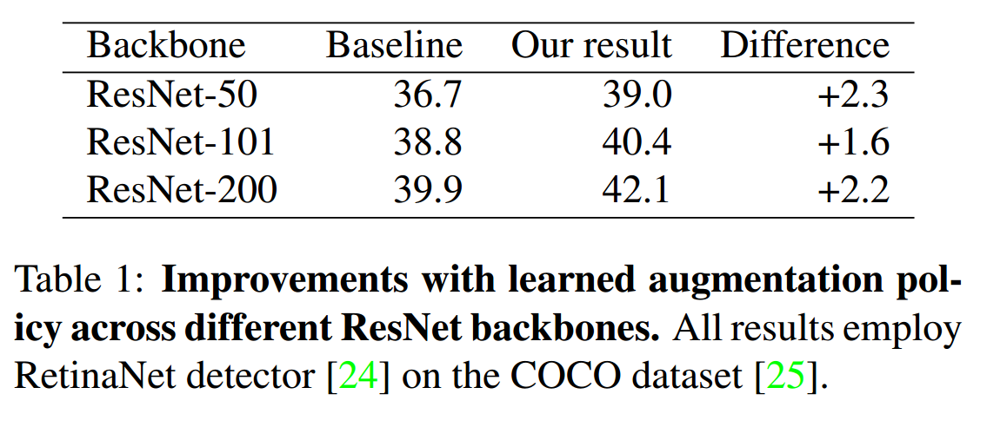
  
  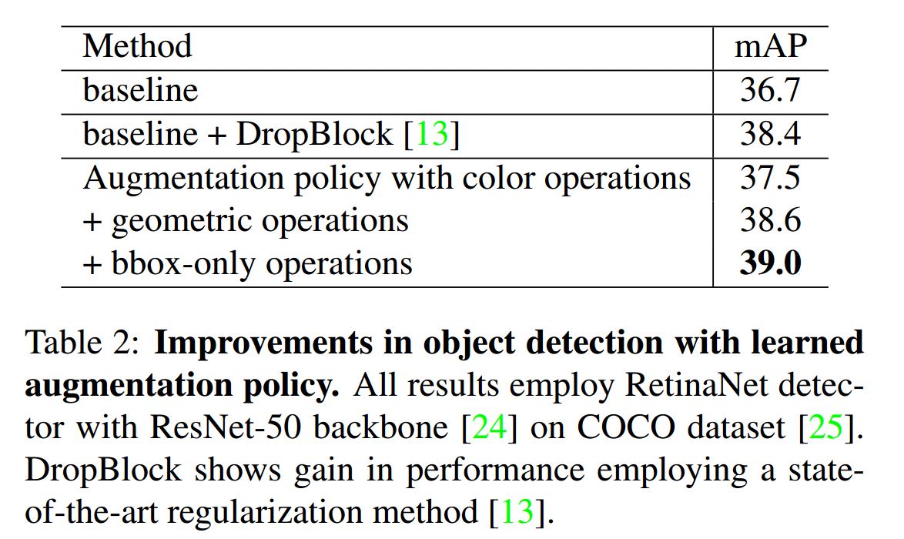
  
  ​		表1和表2显示了使用上述步骤的扩充策略得出的结果。在表1中，学习到的增强策略在几种骨干架构上实现了系统性增益，改进范围从+1.6 mAP到+2.3 mAP。相比之下，之前用于ResNet-50的最佳正则化技术获得1.7%的mAP增加（表2）。
  
  ​		为了更好的理解这些增益来自哪里，作者将用于ResNet-50数据增强策略氛围三个部分：颜色操作、几何操作和仅包含bbox操作（表2）。仅采用颜色操作将性能提升0.8mAP。结合集合变换搜索将性能提高了1.9mAP。最后，与先前的操作结合使用时，添加特定于边界框的操作可产生最佳结果，并且在基线上可提供$+ 2.3 ％$的mAP改善。请注意，仅使用5K COCO训练样本搜索找到的策略，并且在完整的COCO数据集上进行训练时，仍能很好地泛化。
  
  ##### 4.3. 利用学习的增强策略可实现最新的目标检测
  
  ​		一个好的数据增强策略可以在模型之间、数据之间迁移，并且在不同的图像大小上良好训练模型。这里，作者在不同的骨干架构和检测模型上使用学习到的增强策略。为了测试如何将学习到的策略迁移到最佳检测模型，作者使用AmoebaNet-D架构替换ResNet-50骨干。检测算法由ResNet-50改为NAS-FPN。此外，作者使用ImageNet与训练的AmoebaNet-D骨干，因为作者发现从头训练不能获得竞争性结果。使用余弦学习速率衰减（学习速率为0.08）对模型进行了150个时期的训练。除了将图像大小从$640\times640$增加到$1280\times1280$外，其余设置与ResNet-50骨干相同。
  
  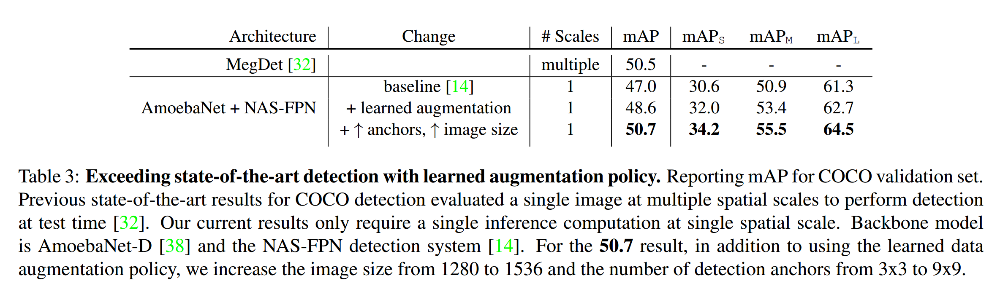
  
  ​		表3表明，在竞争性检测体系结构和设置的基础上，学习的增强策略将mAP提高了1.5％。这些实验还证明增强策略可以良好地跨骨干架构、检测算法、图像尺寸（即$640\rarr1280$像素）以及训练过程（从头训练$\rarr$使用ImageNet与训练）迁移。还可以通过将图像分辨率从1280像素增加到1536像素，并根据[49]同样增加检测锚点的数量来进一步扩展这些结果。由于此模型比以前的模型大得多，因此我们通过组合搜索中的前4个策略来增加学习策略中的子策略数量，从而导致20个子策略学习增强。
  
  ​		这些简单修改的结果是第一个在COCO上达到50.7 mAP的最新单模型结果的一阶段检测系统。注意，该结果仅需要图像的一次通过，而先前的结果则需要在测试时以不同的空间尺度对同一图像进行多次评估[32]。此外，这些结果是通过增加图像分辨率和增加锚的数量（二者都是简单而著名用于提高目标检测性能的技术）达到的。相反，以前的最新技术结果依赖于模型体系结构和正则化方法的粗糙的多个自定义修改才能获得这些结果[32]。本文的方法在很大程度上依赖于更现代的网络体系结构以及学习到的数据增强策略。
  
  ##### 4.4. 学习到的增强策略迁移到其他检测数据集
  
  ​		为了评估学习到的策略到完全不同的数据集和另一种不同的检测算法的可传递性，作者在PASCAL VOC数据集上训练了带有ResNet-101主干的Faster R-CNN [39]模型。本文组合PASCAL VOC 2007和PASCAL VOC 2012训练集，并在PASCAL VOC 2007测试集上（4952）测试本文的模型。本文的评估度量是0.5IoU阈值时的mAP。对于基线模型，作者使用默认超参数的Tensorflow Object Detection API：9个GPU用于异步巡览，其中每个GPU处理的批处理大小为1。初始学习率设置为$3\times10^{-4}$，其在500K步后耍贱0.1。训练从COCO检测模型的checkpoint开始，没有改变任何训练细节，仅仅将本文在COCO上发现的策略添加到预处理中。这导致mAP50提高2.7%（表4）。
  
  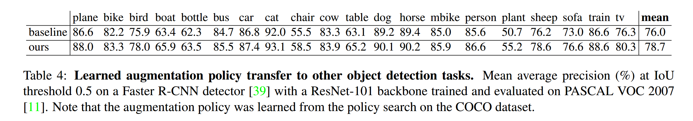

##### 4.5. 学习的增强策略模拟更大的带标注的数据集的性能

​		在本节中，我们进行了实验以确定如果有更多或更少的训练数据，那么学习的增强策略将如何执行。为了执行这些实验，作者采用了COCO数据集的子集来制作具有以下图像数量的数据集：5000、9000、14000、23000（请参见表5）。所有模型使用具有ResNet-50骨干的RentingNet训练，并且训练150个epoch，而不使用ImageNet与训练。

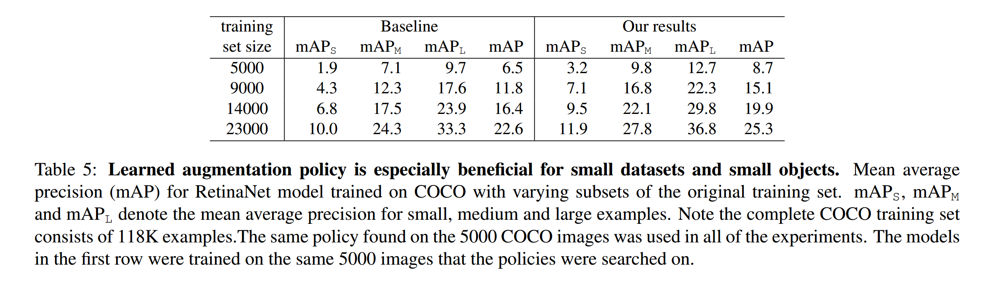

​		如本文期望的，当在较小的数据集上训练模型时，由于学习的增强策略而导致的改进会更大，如图3和表5所示。作者证明对于5000个训练样本上训练的模型，相对于基线，学习到的增强策略可将mAP提高70%。随着训练集的增加，尽管性能提升仍然明显，但是学习到的增强策略的影响却减小。有趣的是，利用学习到的增强策略似乎检测更小的目标尤其好，特别是当训练数据集中有更少的图像时。例如，**对于小型目标，应用学习到的增强策略比增加数据集大小提高了50%**，如表5。对于小型目标，**使用9000个样本对学习的增强策略进行训练后，与使用15000张图像相的基线相比，性能更好。**在这种场景下，使用本文的增强策略几乎与加倍数据大小一样好。

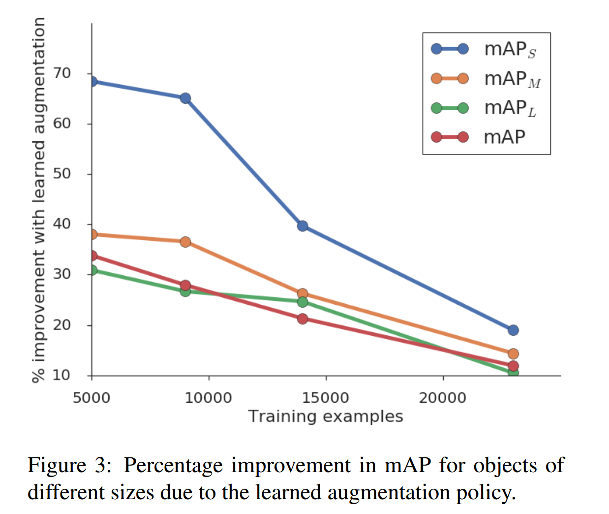

​		利用学习到的增强策略训练的模型的另一个有趣行为是，它们在更难的AP75任务上相对更好。在图4中，作者绘制了利用学习到的增强策略训练的模型的mAP、AP50和AP75上增加的百分比（相对基线增强）。对于所有训练集大小，AP75的相对提升比AP50更大。学习到的数据增强对AP75特别有益，这表明增强策略有助于更准确的对齐边界框预测。这表明增强策略特别有助于在边界框位置上学习到精细的空间细节，这与在小物体上观察到的增益一致。

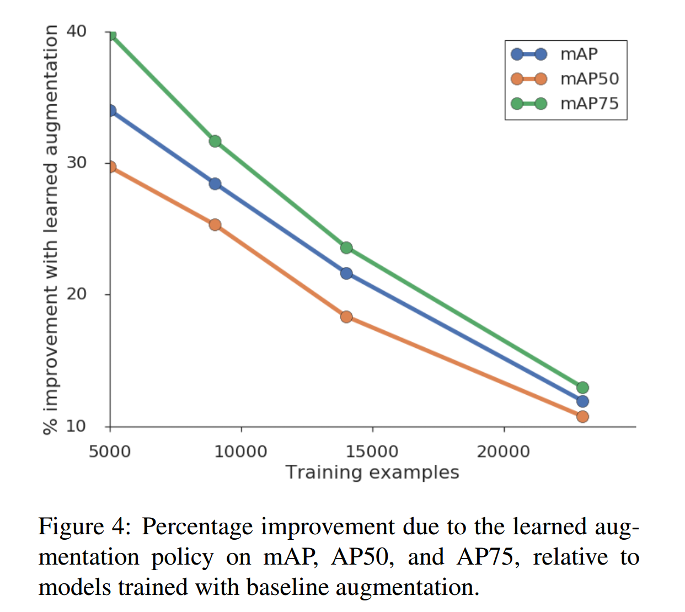

##### 4.6. 学习到的增强策略提升模型正则化能力

​		本节研究学习到的增强策略的正则化影响。首先，作者注意到，当在更大的训练集上时，检测模型的最终训练损失更低（见图5的黑色曲线）。当应用学习到的数据增强时，对于所有数据集大小，训练损失明显增加（红色曲线）。通过查看训练模型权重的 $L_2$ 范数，也可以看到正则化效果。对于更大数据集上训练的模型，权重的$L_2$范数更小，并且利用学习到的增强策略训练的模型比利用基线增强训练的模型的$L_2$范数更低（见图6）。

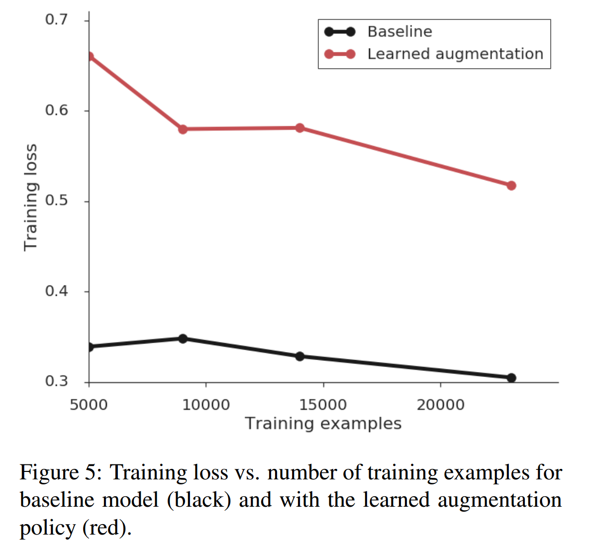

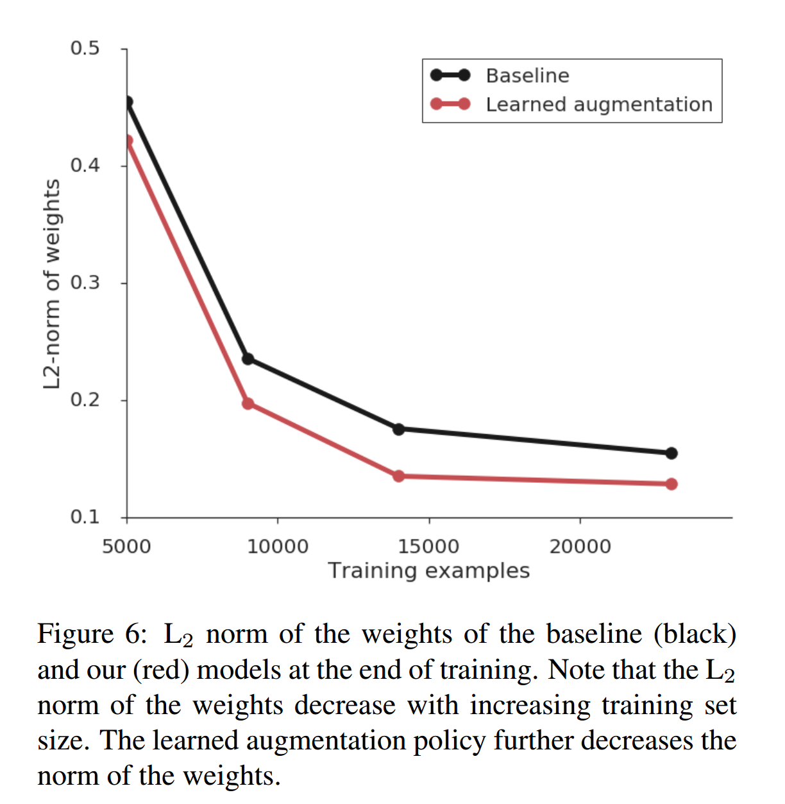

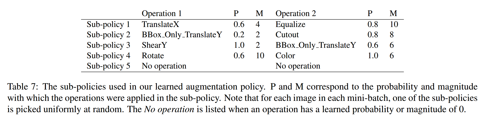