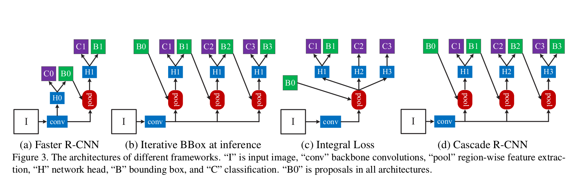
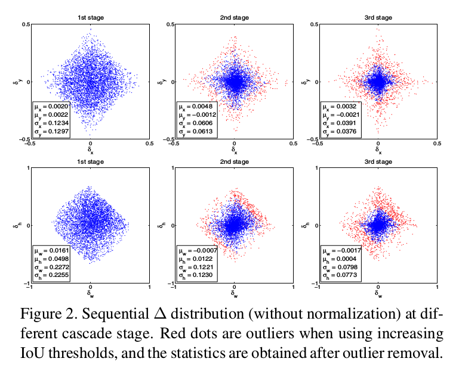
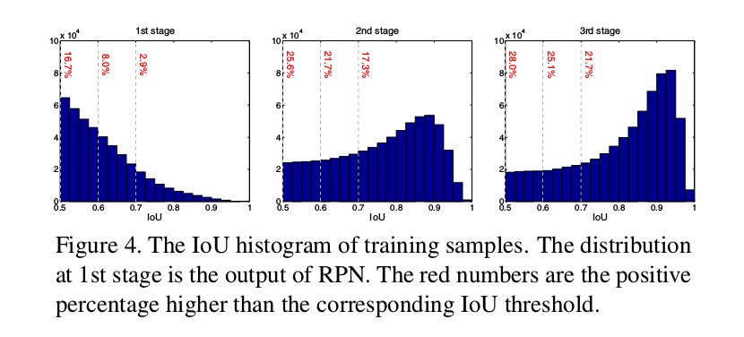
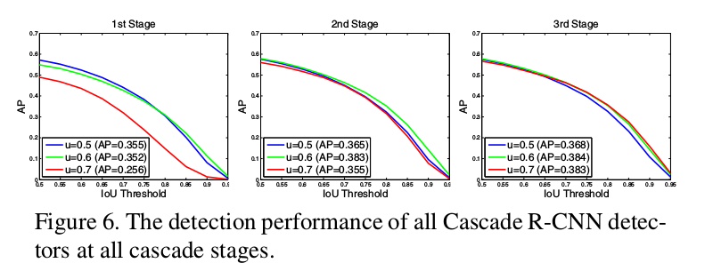
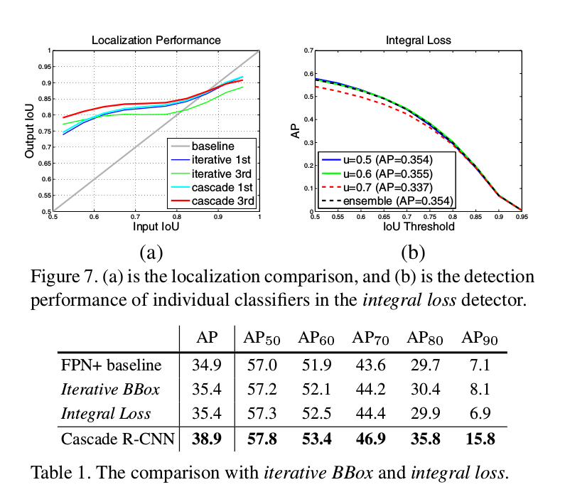
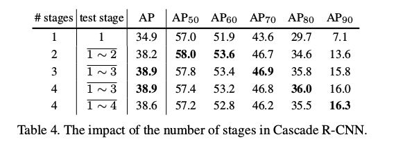
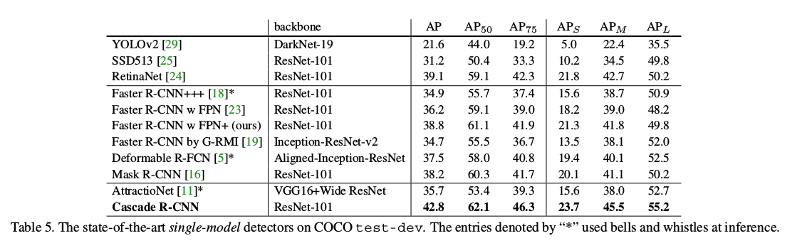
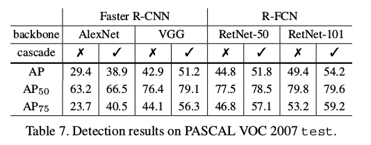

Cascade R-CNN: Delving into High Quality Object Detection
=

# 1. Introduction
对象检测是一个复杂的问题，需要两个主要方面的解决方案。一是，检测器必须解决识别问题，以从背景中区分前景对象，并给它们分配正确的类标签。二是，检测器必须解决定位问题，以将准确的边界框分配给不同的对象。这两者都特别困难，因为检测器面临许多“接近”false positive，对应于“接近但不正确”的边界框。检测器必须找出true positive，同时抑制这些接近false positive的边界框。

许多最近提出的对象检测器是基于两阶段的R-CNN框架，其中检测是由分类和边界框回归组成的多任务损失。不同对象识别，检测需要IoU来定义正/负。然而，通常的阈值 $u$ （$u=0.5$）为正类建立了相对宽松的需求。这导致检测器常产生噪声边界框，如图1（a）所示。大多数人认为接近假阳性（false positive）的假设经常能通过 $IoU \ge 0.5$ 的测试。虽然在 $u = 0.5$ 标准下聚集的样本丰富且多样化，但是它们使得难以训练能够有效地拒绝接近假阳性的检测器。

本文中，我们假设（hypothesis）的质量（quality）定义为假设与ground-truth的IoU，并检测器的质量定义为训练检测器的IoU阈值 $u$ 。目标是调查迄今为止学习高质量对象检测器的研究不足的问题，其输出包含接近假阳性，如图1（b）所示。基本思想是单一的检测器仅能在单一的质量级别优化。这在成本敏感学习（receiver operating characteristic）的文献[7,26]中是已知的，其中在ROC的不同点的优化需要不同的损失函数。这主要的不同是我们考虑对给定IoU阈值进行优化，而不是false positive rate。

这思想在表1（c）和（d）中显示，其分别表示以IoU阈值 $u=0.5,0.6,0.7$ 训练的三个检测器的定位和检测的性能。定位性能根据输入提议的IoU的函数评估，而检测性能根据IoU阈值函数评估，如COCO。注意，如图1（c），每个边界框回归器在接近检测器训练阈值的IoU的样本中表现最佳。这也适用于检测性能，直至过度拟合。图1（d）表明，对于低IoU样本， $u=0.5$ 的检测器优于 $u=0.6$ 的检测器，在更高的IoU级别表现更不佳。通常，在单一IoU级别优化的检测器不需要在其他级别优化。**这些观察结果表明，更高质量的检测需要检测器与其处理的假设之间更接近的质量匹配。** 一般而言，如果提供高质量的建议，检测器只能具有高质量。

然而，为了产生高质量的检测器，在训练期间简单地增加 $u$ 是不够的。实际上，如图1（d）的 $u=0.7$的检测，这可能降低检测的性能。问题在于，提议检测器中的假设分布通常严重偏向于低质量。通常强制使用更大IoU阈值导致正类训练样本的数量呈指数级减小。这对于神经网络尤其成问题，已知神经网络是非常示例性密集的，并且使得“高$u$”训练策略非常容易过度拟合。另一个困难是，检测器质量和推理阶段测试假设的质量之间的不匹配。如图1，**高质量检测器仅需要优化高质量假设。**

本文中，我们提出一种新的处理这些问题检测器架构（Cascade R-CNN）。它是R-CNN的多阶段扩展，其中探测器阶段更深入顺序的更具选择性的级联中，以防止接近误报。R-CNN的级联阶段依次训练，使用一个阶段的输出来训练下一个阶段。这是由于观察到回归器的输出IoU几乎总是优于输入IoU，如图1（c）所示，其中几乎所有的线都高于灰线。**它表明，使用某个IoU阈值训练的检测器的输出是一个良好的分布，足以训练下一个更高的IoU阈值的检测器。** 这类似于常用于在对象检测文献中集成数据集的增强捕获方法[34,9]。主要不同在于Cascade R-CNN的重采样过程不是针对挖掘hard negative 。当以这种方式操作时，适合于越来越高的IoU的一系列检测器可以击败过度拟合问题，并因此被有效地训练。逐步改进的假设更好地匹配每个阶段的检测器质量的增加。这确保更高的检测准确率，如图1（c）和（d）。

# 3. Object Detection

本文中，我扩展了Faster R-CNN的两阶段架构，如图3（a）。其第一阶段是提议子网络（“H0”），应用到整个图像，以产生主要的检测假设，即熟知的对象提议。在第二个阶段，这些假设被一个兴趣区域（region-of-interest）检测子网络（“H1”）处理，表示为检测头部。最终将分类得分（“C”）和边界框（“B”）分配给每个假设。我们专注于对多阶段检测子网络进行建模，并采用（但不限于）用于提案检测的RPN [30]。

## 3.1. Bounding Box Regression
边界框 $b=(b_x, b_y, b_w, b_h)$ 包含一个图像patch $x$ 的四个坐标。边界回归的任务是使用回归器 $f(x,b)$ 将候选边界框 $b$ 回归到目标边界框 $g$ 。这从训练样本 $(g_i, b_i)$ 中学习以最小化边界框 $L_1$ 损失函数 $L_{loc}(f(x_i, b_i), g_i)$ 。为了鼓励尺度和位置的回归不变， $L_{loc}$ 对距离向量 $\Delta = (\delta_x, \delta_y, \delta_w, \delta_h)$ 的计算定义为：
$$
\begin{cases}
\delta_x = (g_x - b_x) / b_w, & \delta_y = (g_y - b_y) / b_h \\
\delta_w = \log(g_w/b_w), & \delta_h = \log(g_h/b_h)
\end{cases}  \tag 1
$$
由于边界框回归通常对 $b$ 进行微调，因此（1）的数值可能非常小。因此，回归损失通常远小于分类损失。为了改善多任务学习的效率， $\Delta$ 通常使用它的均值和方差标准化，即 $\delta_x$ 替换为 $\delta_x' = (\delta_x - \mu_x) / \delta_x$ 。这在文献 [30,1,4,23,16]中广泛使用。

一些工作[10,11,18]认为单一的回归步骤 $f$ 不能满足准确的定位。相反，$f$ 被迭代地用作一个后处理步骤
$$f'(x,b) = f \circ f\circ \cdots \circ f(x, b) \tag 2$$
以精炼边界框 $b$ 。这称为迭代边界框回归（iterative bounding box regression），表示为 iterative BBox 。它使用图3（b）的推理架构实现，其中所有头部是相同的。然而，这种思想忽略了两个问题。第一，如图1所示，回归器 $f$ 以 $u=0.5$ 的阈值训练，对于更高阈值的假设是次优的。它实际上降低了IoU大于0.85的边界框。第二，如图2所示，在每次迭代后，边界框的分布发生明显改变。虽然回归器对于初始分布是最佳的，但在此之后它可能是非常不理想的。由于这些问题，迭代BBox需要相当数量的人工工程，如提案积累、边界框投票等形式。**通常，应用 $f$ 超过两次，就不会再有增益。**

## 3.2. Detection Quality
分类器 $h(x)$ 给图像patch $x$ 分配 $M+1$ 类中的一个，其中 0 表示背景，剩下的表示检测的对象。给定训练集 $(x_i, y_i)$ ，通过最小化交叉熵损失 $L_{cls}(h(x_i), y_i)$来学习，其中 $y_i$ 是patch $x_i$ 的标签。

由于边界框通常包含对象和一些量的背景，所以很难确定一个检测是否是正类或负类。这通常通过IoU度量处理。如果 IoU 大于阈值 $u$ ，这个patch被视为类的一个示例。因此，假设 $x$ 的类标签是 $u$ 的函数：
$$
y = \begin{cases}
g_y, & IoU(x, g) \ge u  \\
0, & \mbox{ otherwise}
\end{cases}  \tag 3
$$
其中 $g_y$ 是ground-truth 对象 $g$ 的类标签。这个IoU阈值 $u$ 定义检测器的质量。

检测器是有挑战性的，因为，无论阈值如何，检测器设置是高度对抗的。当 $u$ 较高时，正类包含少量背景，但是收集足够的正类训练样本是困难的。当 $u$ 较低时，有更丰富且更多样的正类训练集可用，但是训练的检测器通常不能很好地拒绝false positive 。通常，很难要求单一检测器在所有IoU级别上都统一地执行很好。在推理时，由于通过提议检测器（如RPN或selective search）产生的大多数假设的质量较低，所以检测器必须对于更低质量的假设更具辨别性。这些相互矛盾的要求之间的标准折衷是确定 $u = 0.5$ 。然而，这是一个相对较低的阈值，导致大多数人认为接近假阳性的低质量检测，如图1（a）所示。

一种朴素的解决方案是使用图3（c）的架构开发一种集成的分类器，以针对各种质量水平的损失进行优化：
$$L_{cls}(h(x), y) = \sum_{u \in U}L_{cls}(h_u(x), y_u) \tag 4$$
其中 $U$ 是IoU阈值集合。这与[38]的 _integral loss_ 密切相关，其中 $U = \{0.5,0.55，⋅··，0.75\}$ ，旨在符合COCO挑战的评估指标。根据定义，在推理阶段也需要集成分类器。该解决方案未能解决（4）的不同损失对不同数量的正类进行操作的问题。如图4的第一幅图像所示，正类样本集合随着 $u$ 快速减少。这特别成问题，因为高质量的分类器易于过拟合。此外，这些高质量的分类器需要处理推理时低质量占主导的提议。由于所有这些，（4）的集成未能获得在更多质量级别未能获得更高的准确率，并且该架构与图3（a）相比收益甚微。

# 4. Cascade R-CNN
## 4.1. Cascaded Bounding Box Regression
如图1（c）所示，要求单个回归量在所有质量水平上均匀地执行是非常困难的。这种困难的回归任务可以分解成一系列更简单的步骤，这受级联姿态回归[6]和人脸对齐[2,35]工作的启发。在Cascade R-CNN中，它被构造为级联回归问题，具有图3（d）的架构。这依赖于一级联专门的回归器：
$$f(x, b) = f_T \circ f_{T-1} \circ \cdots \circ f_1(x, b) \tag 5$$
其中 $T$ 是级联阶段的总数。注意，级联中的每个回归器 $f_t$ 都是经过相应的阶段样本分布 $\{b^t\}$ 优化的，而不是 $\{b^1\}$ 的初始分布。这种级联渐进地改善假设。

它在几个方面不同于图3（b）的 _iterative BBox_ 架构。第一，虽然 _iterative BBox_ 是用于改善边界框的后处理过程，级联回归是重采样过程（resampling procedure），该过程改变了用于不同阶段处理的假设的分布。第二，因为级联回归被用于训练和推理，所以训练和推理之间没有差异。第三，多个专门的回归器 $\{f_T, f_{T-1}, \cdots, f_1\}$ 使用不同阶段的重采样分布（ _resampled distribution_ ）优化。这与（2）中的单一 $f$ 相反，其仅对初始分布是最优的。这些差异确保比 _iterative BBox_ 更准确，而且没有进一步的人工工程。

如3.1节讨论的，（1）中的 $\Delta=(\delta_x, \delta_y, \delta_w, \delta_h)$ 需要被标准化以进行有效地多任务学习。在每个回归阶段之后，它们的统计量将依次进化，如图2所示。在训练期间，相应的统计量用于在每个阶段标准化 $\Delta$ 。

## 4.2. Cascaded Detection
如图4左所示，初始假设（如RPN提议）的分布严重倾向低质量。这不可避免地导致对更高质量分类器的无效学习。Cascade R-CNN依赖将级联回归作为重采样机制（resampling mechanism）来处理这个问题。这受由于在图1（c）中几乎所有曲线都在灰色对角线上方，即为某一 $u$ 训练的边界框回归量倾向于产生更高IoU的边界框。因此，从样本集 $(x_i, b_i)$ 开始，级联回归连续地采样具有更高IoU的样本分布 $(x_i', b_i')$ 。以这种方式，即使检测器质量（IoU阈值）增加，也可以将连续阶段的正样本集保持在大致恒定的大小。这在图4中示出，其中在每个重采样步骤之后，分布更倾向于高质量样本。随之而来的是两个后果，第一，没有过拟合，因为正类样本在所有水平都是丰富的；第二，更深阶段的检测器以更高IoU阈值优化。注意，一些异常点通过增加的IoU阈值依次移除，如图2所示，这确保更好地训练一些专门的检测器。

在每个阶段 $t$ ，R-CNN包含用IoU阈值 $u^t$ 优化的分类器 $h_t$ 和回归器 $f_t$ ，其中 $u^t > u^{t-1}$ 。这通过最小化损失学习：
$$
\begin{alignat}{2}
L(x^t, g) =& L_{cls}(h_t(x^t), y^t)  \\
& + \lambda[y^t \ge 1] L_{loc}(f_t(x^t, b^t), g)
\end{alignat} \tag 6
$$
其中 $b^t = f_{t-1}(x^{t-1}, b^{t-1})$ ， $g$ 是 $x^t$ 测ground-truth对象， $\lambda = 1$ 是平衡系数， $[\cdot]$ 为指示函数， $y^t$ 是（3）中给定 $u^t$ 下 $x^t$ 的标签。不同于（4）的 _integral loss_ ，这保证了一系列经过有效训练的质量提高的检测器。在推理期间，通过应用相同的级联过程，假设的质量被逐渐提高，并且更高质量的检测器仅需在更高质量的假设上运算。这保证了更高质量的检测器，如图1（c）和（d）所建议的。

# 5. Experimental Results
## 5.1 Implementation Details
设置级联阶段的IoU阈值 $U=\{0.5, 0.6, 0.7\}$ 。数据增强为标准的水平图像翻转。

### 5.1.1. Baseline Networks
**Faster R-CNN：** 网络头部有两个全连接层。为了减少参数，我们使用[15]修剪不太重要的连接。每个全连接层保留2048个单元，并去除dropout层。初始学习率为0.002，在60k和90k时减小10倍，在100k时停止训练。2个GPU，每次迭代使用4张图像。每幅图像使用128个RoI。

**R-FCN：** R-FCN将卷积、边界框回归和分类层添加到ResNet。Cascade R-CNN的所有头使用这种结构。未使用OHEM。初始学习率为0.003，在160k和240k迭代时减小10倍，280K时停止。4个GPU，每次迭代每个GPU输入1张图像。每幅图像使用256个RoI。

**FPN：** 使用RoIAlign，表示为FPN+ 。ResNet-50用于消融研究，ResNet-101用于最终检测。使用初始学习率为0.005训练120K，接下来60K学习率为0.0005，8个GPU，每个GPU输入1张图像。每幅图像256个RoI。

## 5.2. Quality Mismatch

图6表示检测的性能在使用更准确的假设时获得的改善。

## 5.3. Comparison with Iterative BBox and Integral Loss

## 5.4. Ablation Experiments

## 5.5. Comparison with the state-of-the-art

## 5.7 Results on PASCAL VOC

