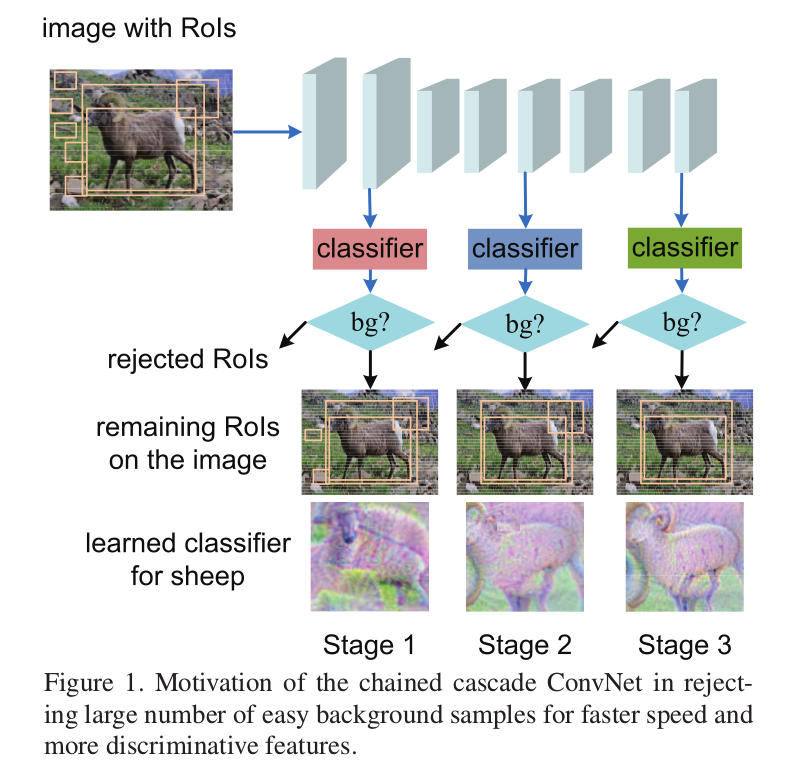

Chained Cascade Network for Object Detection
=

# 1 Introduction
级联分类是分类器在早期丢弃大量易分的负样本，使得分类器后面的阶段能关注处理更加困难的样本。受这些方法的启发，本文提出chained cascade（CC-Net）网络使用多阶段学习特征和分类器。随着网络更深或更宽，更具辨别性的特征和分类其用于处理更加困难的样本。

本文的贡献：
- 在训练和测试时都使用级联以节约计算。在CC-Net中，当在浅层中拒绝样本后，在深层中计算和内存可以忽略。
- 在网络中，早期的级联阶段和上下文级联阶段被用于学习越来越多的辨别性特征。通过在网络的早期拒绝容易的样本，更深层或者额外分支学习的特征和分类器关注更困难的样本。以这种方式，学习到的特征在处理更难的样本时更好，如图1所示，当第一个分类器发现对象应该只是一个哺乳动物时，第二阶段的特征和分类器可以更多地集中于区分特定类别的哺乳动物，如马、羊和牛。然后，第三阶段的分类器学习有助于区分具有角的哺乳动物的特征，例如羊和牛。
- 所有的级联分类器和它们相应的特征通过一个卷积网络联合学习。
