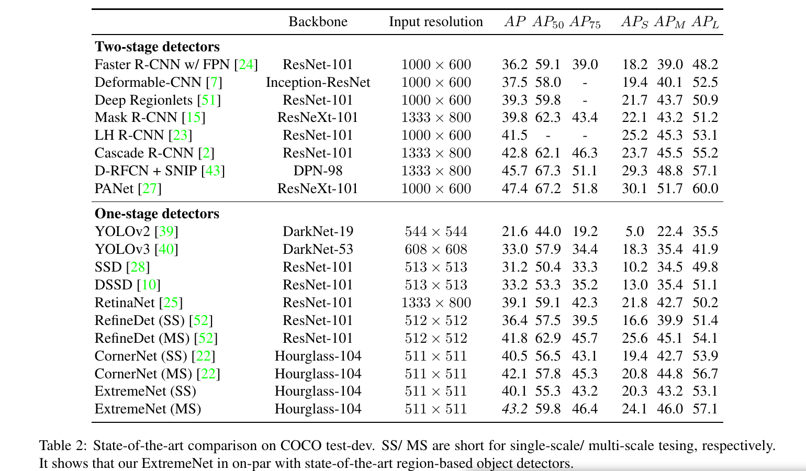
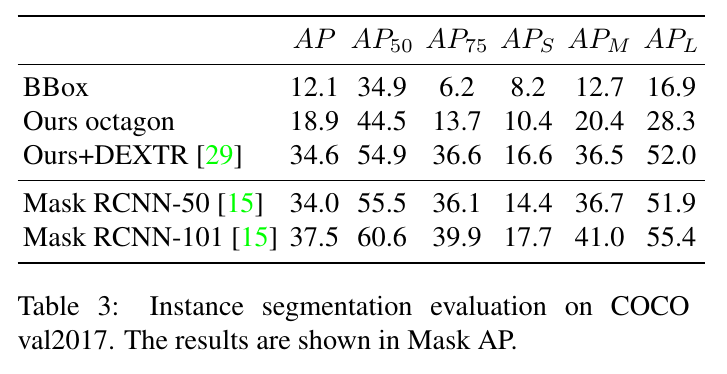

Bottom-up Object Detection by Grouping Extreme and Center Points
=

# 1. Introduction

Top-down 方法多年来一直主导对象检测。流行的检测器通过显式裁剪区域[12]或区域特征[11,41](两阶段对象检测)或隐式设置区域代理的固定大小锚点[25,28,38](一阶段对象检测)，将对象检测转换为矩形区域分类。然而，top-down检测不是没有局限。矩形边界框不是自然对象的表示。大多数对象不是轴向对齐的框，将它们放入一个框中包含许多分散注意力的背景像素(图1)。此外，自顶向下的对象检测器枚举了大量可能的边界框位置，而没有真正理解对象本身的组合视觉语法[9,13]。这在计算上是昂贵的。最后，对于对象本身，边界框是一个不好的代理。它们传达的对象细节信息很少，例如对象的形状和姿态。

本文中，我们提出 ExtremeNet，一种自下而上的对象检测框架，其检测对象的四个极点（top-most， left-most， bottom-most， right-most）。我们使用最先进的关键点估计框架[3,5,30,31,49]，通过预测每个对象类别的4个多峰热图来找到极值点。此外，我们使用每个类别一个热图来预测对象中心，作为 $x$ 和 $y$ 维度上两个边界框边缘的平均值。我们使用纯粹基于几何的方法将极值点分组到对象中。我们将四个极值点分组，每个极值点对应一个极值点，当且仅当它们的几何中心在中心热图中被预测且得分高于预先定义的阈值时。我们枚举了极点预测的所有 $O(n^4)$ 组合，并选择有效的一个。极点预测的数量 $n$ 通常相当的小，对于 COCOC 为 $n \le 40$ ，并且在 GPU 上的暴力实现是有效的。图2展示所提出方法的概览。

我们并不是第一个使用深度关键点进行对象检测。CornerNet预测一个边界框的相对的角。它们使用一个关联嵌入特征将角点分组到边界框。我们的方法不同之处在于两个方面：关键点定义和分组。角是边界框的另一种形式，并且遭遇top-down检测遭遇的问题。角通常位于对象之外，没有强力的外观特征。另一方面，极点位于对象中，在视觉上可区分的，并且有一致的局部外观特征。例如，人体的 top-most 通常是头部，而汽车或飞机的 bottom-most 通常是轮子。这使得极点的检测更加容易。与 CornerNet 的第二个差异是几何分组。我们的检测框架完全基于外观，而没有任何的显示特征学习。在我们的试验中，基于外观的分组工作明显更好。

我们的想法是受到Papadopoulos等人[33]的启发，他们提出通过单击四个极点来注释边界框。这个注释收集信息的速度大约是边框的四倍，并且提供了比边框更丰富的信息。极点也与对象掩膜有紧密的联系。与边界框相比，直接连接膨胀的极点提供了更细粒度的对象掩码。在我们的实验中，我们证明了将一个简单的八边形拟合到极点可以得到一个很好的目标掩码估计。我们的方法可以进一步与 DeepExtremeCut 结合，其将极点注释转换到分割掩膜以指示对象。直接将我们的极点预测作为对DeepExtremeCut[29]的指导，可以得到接近最先进的实例分割结果。

# 3. Preliminaries
**Extreme and center points** 令 $(x^{(tl)}, y^{(tl)}, x^{(br)}, y^{(br)})$ 表示边界框的四条边。为了注释一个边界框，用户通常点击左上角 $(x^{(tl), y^{(tl)}})$ 和 右下角 $(x^{(br)}, y^{(br)})$ 。由于这两个点通常位于对象外部，因此这些单击通常是不准确的，需要调整几次。整个过程平均花费34.5秒。Papadopoulos等人[33]提出通过点解四个极点 $(x^{(t), y{(t)}})$ 、$(x^{(l), y^{(l)}})$ 、$(x^{(b)}, y^{(b)})$ 、 $(x^{(r), y^{(r)}})$ ，其中边界框为 $(x^{(l)}, y^{(t)}, x^{(r)}, y^{(b)})$ 。极点是指沿着四个基方向（上、下、左、右）没有比点 $(x^{(a)}, y^{(a)})$ 更靠前的点。极点点击注释的时间平均为 7.2 秒。生成的注释与耗时更长的box注释相当。在这里，我们直接使用extreme click annotation并绕过边界框。此外，我们使用的每个对象的中心为 $(\frac{x^{(l)} + x^{(r)}}{x}, \frac{y^{(t)} + y^{(b)}}{2})$ 。

**Keypoint detection** 关键点估计，例如人体关节估计或者椅子角点估计，通常使用全卷积的编码器-解码器网络来预测每个关节类型（例如，一个是人体头部热图，另一个是人腕部热图）。该网络以完全监督的方式进行训练，要么对呈现的高斯图进行L2损失[3,5,30,49]，要么对每个像素进行逻辑回归损失[22,34,35]。最佳的关键点估计网络，例如104层的 HourglassNetwork[22,31]以全卷积的方式训练。它们为每个输出通道回归一个宽为 $W$ 、高为 $H$ 的热图 $\hat{Y}\in (0, 1)^{H \times W}$ 。训练受多峰高斯热图 $Y \in (0, 1)^{H \times W}$ ，其中每个关键点顶一个为高斯核的均值。标准差要么是固定的，要么按照对象大小的比例设置。在L2损失情况下，以高斯热图作为回归目标;在logistic回归情况[22]中，以权值图作为减少惩罚的权重。

**CornerNet** CornerNet 使用具有 HourglassNetwork 的关键点估计器作为对象检测器。它们为边界框相对的角预测两组热图。为了平衡正负位置，它们使用修正的 focal loss 进行训练：

$$L_{det} = 
\begin{cases}
-\frac{1}{N} \sum_{i=1}^{H}\sum_{j=1}^{W} (1 - \hat{Y}_{ij})^\alpha \log(\hat{Y}_{ij}) & \mbox{ if } Y_{ij} = 1 \\
-\frac{1}{N} \sum_{i=1}^{H}\sum_{j=1}^{W}(1 - Y_{ij})^{\beta}(\hat{Y_{ij}})^{\alpha} \log(1 - \hat{Y}_{ij}) & \mbox{otherwise}
\end{cases} \tag 1
$$
其中 $\alpha$ 和 $\beta$ 为超参数，并且训练期间设置 $\alpha = 2$ 和 $\beta = 4$ 。$N$ 为图像中对象数量。

对于极点的子像素的准确性，CornerNet 为每个角额外回归了类别无关的关键点偏移 $\Delta^{(a)}$ 。该回归恢复了沙漏网络的下采样中丢失的部分信息。利用平滑L1损耗[11] $SL_1$ 对 ground-truth 极值点位置进行偏移热图训练：

$$L_{off} = \frac{1}{N}\sum_{k=1}^{N} SL_1(\Delta^{(a)}, \vec{x}/s - \lfloor\vec{x}/s\rfloor) \tag 2$$

其中 $s$ 是下采样因子（对于 HourglassNetwork ， $s=4$）， $\vec{x}$ 为关键点的坐标。

然后 CornerNet 使用关联嵌入将相对的角分组到检测中。我们的极点估计使用 CornerNet 架构和损失，但是没有关联嵌入。

**Deep Extreme Cut** DeepExtremeCut（DEXTRE）是极点指导的图像分割方法。它取4个极值点，并将这些极点所围成的边界框的裁剪图像区域作为输入。利用Chen et al.[4]等人的语义分割网络，对所指示的对象进行类别无关的前景分割。网络学习生成匹配输入极值点的分割掩码。

# 4 ExtremeNet for Object Detection
ExtremeNet 使用 HourglassNetwork 来检测每个类的五个关键点（四个极点和一个中心）。我们遵循 CornerNet 的训练设置、损失和偏移预测。偏移预测是类无关的，但是是极点特定的。中心热图每个偏移预测。因此，我们的网络输出为 $5 \times C$ 的热图和 $4 \times 2$ 的偏移热图，其中 $C$ 为类的数量（对于 MS COCO， $C = 80$）。图 3 展示了概览。一旦极点被提取，我们便以纯几何的方式将它们分组到检测。

## 4.1 Center Grouping
极点位于对象的不同边。这使得分组变得复杂。例如，关联嵌入可能没有足够的全局视角来分组这些关键点。这里，我们采用一种不同的方法来利用极点的扩散特性。

输入到分组算法的是每个类五个热图：一个中心热图 $\hat{Y}^{(c)} \in (0, 1)^{H \times W}$ 和四个极点热图 $\hat{Y}^{(t)}$ 、 $\hat{Y}^{(l)}$ 、 $\hat{Y}^{(b)}$ 和 $\hat{Y}^{(r)}$ ，对应上、左、下和右。给定热图，我们通过检测所以的峰来提取相应的关键点。峰是值大于 $\tau_p$ 的任意像素位置，其是像素周围在的 $3 \times 3$ 窗口中的局部最大。我们称这一个过程为 _ExtrectPeak_ 。

给定从热图 $\hat{Y}^{(t)}$ 、 $\hat{Y}^{(l)}$ 、 $\hat{Y}^{(b)}$ 和 $\hat{Y}^{(r)}$ 上提取的极点 $t$、 $l$ 、 $b$ 和 $r$ ，我们计算它们的几何中心 $c = (\frac{l_x + t_x}{2}, \frac{t_y + b_y}{2})$ 。如果在中心图 $\hat{Y}^{(c)}$ 中预测该中心具有高响应，则我们将极值点作为有效检测： $\hat{Y}_{c_x, c_y} \ge \tau_c$, $\tau_c$ 为阈值。然后，我们以爆力方式对所有关键点 $t，b，r，l$ 的四倍进行枚举。我们独立地提取每个类的检测。算法1总结了这一过程。我们设置 $\tau_p=0.1$ ， $\tau_c = 0.1$ 。

暴力分组算法的运行时为 $O(n^4)$ ，其中 $n$ 为每个基方向提取的极点数量。补充材料中提出一种 $O(n^2)$ 的更快算法。然而，对于MS COCO数据集而言，更难在GPU上加速并且在实践中更慢，其中 $n\le40$ 。

## 4.2. Ghost box suppression
中心分组可以对相同大小的三个等间距共线对象给出高可信度的假阳性（false-positive）检测。这里，中心对象有两个选项，提交正确的小边界框，或预测一个包含其邻居极点的更大的边界框。我们称这些false-positive检测为“ghost”边界框。正如我们将在实验中展示的那样，这些鬼盒很少见，但仍然是我们分组的一致错误模式。

我们提出一种简单的后处理步骤来移除ghost边界框。通过定义，ghost包含许多其他更小的检测。为了阻止ghost边界框，我们使用soft non-max suppression[1]。**如果某个边界框中包含的所有框的分数总和超过其自身分数的3倍，我们将其分数除以2。** 这种非极大值抑制与标准的基于重叠的非极大值抑制相似，但是是惩罚ghost边界框而不是多个重叠的边界框。

## 4.3 Edge aggregation
极值点并不总是唯一定义的。如果对象的垂直或水平边缘形成极值点（例如，汽车的顶部），沿着该边缘的任何点都可以被认为是极值点。因此，我们的网络沿着对象边缘产生弱响应，而不是单一的强峰响应。这种若响应有两个问题：第一，更弱的响应可以处于峰选择阈值 $\tau_p$ 之下，而我们将完全丢失这些极点。第二，即使检测到关键点，其得分也会低于具有强烈峰值响应的轻微旋转对象。

我们使用边缘聚类来处理这个问题。对于每个极点，提取为局部最大值，对于左右极点，我们在垂直方向上聚类其得分，或对顶部和底部关键点，我们在水平方向上聚类其得分。我们聚合所有单调递减分数，并沿聚合方向停止聚合于局部最小值。具体而言，令 $m$ 为极点，$N_i^{(m)} = \hat{Y}_{m_x + i, m_y}$ 为那一点的垂直和水平分割线。令 $i_0 < 0$ 和 $0 < i_1$ 为两个最接近的局部最小 $N_{i_0 - 1}^{(m)} > N_{i_0}^{(m)}$ 和 $N_{i_1}^{(m)} < N_{i_1+1}^{(m)}$ 。边缘聚合将关键点得分更新为 $\bar{Y}_m = \hat{Y}_m + \lambda_{aggr}\sum_{i=i_0}^{i_1}N_i^{(m)}$ ，其中 $\lambda_{aggr}$ 为聚合权重。在我们的实验中设置 $\lambda_{aggr} = 0.1$ 。如图4.

## 4.4. Extreme Instance Segmentation
与简单的边界框相比，极值点携带有关对象的更多信息，其注释值至少为两倍（8比4）。我们提出了一种简单的方法，通过创建一个边缘以极值点为中心的八边形来使用极值点逼近对象掩膜。具体而言，对于一个极点，我们将其在相应边缘上的两个方向上延伸到整个边缘长度的 $1/4$ 的区段。该段在遇到角落时会被截断。然后，我们连接四个段的端点以形成八边形。 有关示例，请参见图1。

为了进一步精炼边界框分割，我们使用 DeepExtremeCut[29]，它是一种训练来将手动提供的极点转换为实例分割掩膜。这些工作中，我们简单滴讲DeepExtremeCut的手动输入替换为我们的极点预测，以形成两阶段的实例分割。具体而言，对于每个我们预测的边界框，我们裁剪边界框区域，用我们预测的极点渲染高斯图，然后讲联结图像馈入预训练的 DeepExtremeCut 模型。DeepExtremeCut是类无关的，因此，我们直接使用ExtremeNet检测到的类和得分。没有使用进一步的后处理。

# 5. Experiments
我们在 MS COCO 数据集上评估我们的方法。

## 5.1. Extreme point annotations
在COCO中没有直接的极点注释。然而，有完整的对象分割掩膜。因此，我们发现极端点是多边形掩模注释中的极值。在边缘平行于轴或在角度为 $3 ^ \circ$内的情况下，我们将极值点放在边缘的中心。尽管我们的训练数据从更加昂贵的分割注释上推导，但是极点数据本身比收集标准的边界框便宜4倍。

## 5.2. Training details
我们的实现是基于公开的CornerNet的实现。我们严格遵循CornerNet的超参数：我们设置输入分辨率为 $511 \times 511$ ，输出分辨率为 $128 \times 128$ 。数据增强包括翻转、0.6到1.3之间的随机缩放、随机裁剪和随机颜色扰动。网络使用Adam以学习 $2.5e-4$优化。CornerNet最初在10个GPU上训练500k次迭代。我们从预先训练好的CornerNet模型中对我们的网络进行微调，在5个GPU上随机初始化头层，进行250k次迭代，批量大小为24。学习率在200k迭代后减小10倍。

## 5.3. Testing details
对于每幅输入图像，我们的网络为极点产生4个 C 通道的热图，为中心点产生一个 C 通道的热图，以及4个两通道的偏移热图。我们将边缘聚合应用到每个极点热图，并将中心热图乘以2以校正整体尺度变化。然后，我们将中心分组算法应用到热图。在ExtrectPeak中最多提取前40个点以保持枚举效率。通过在offsetmaps的相应位置处添加偏移来细化预测的边界框坐标。

遵循CornerNet，我们保持原始的图像分辨率，而不是调整到固定大小。我们使用翻转增强进行测试。在我们的主要比较中，我们使用5种额外的的多尺度（0.5、 0.75、 1.、 1.25、 1.5）增强。最后，使用 Soft-NMS来过滤所以增强的检测结果。测试衣服图像花费322ms（3.1FPS），网络前馈花费13ms，分组和余下的后处理（NMS）需要150ms。

## 5.4. Ablation studies
**Center Grouping vs. Assiciative Embdedding** 我们的 ExtremeNet 也可以使用于 CornerNet 相似的 Associative Embedding 训练。我们尝试了这个想法，并用一个用铰链损失训练的四通道关联嵌入特征图替换了中心图[22]。表1展示了这种结果。

## 5.5. State-of-the-art comparisons

## 5.6. Instance Segmentation
