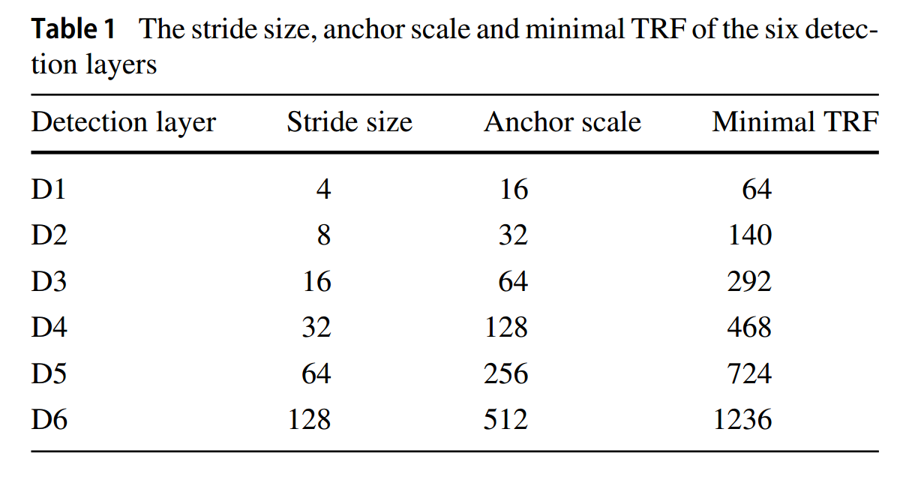
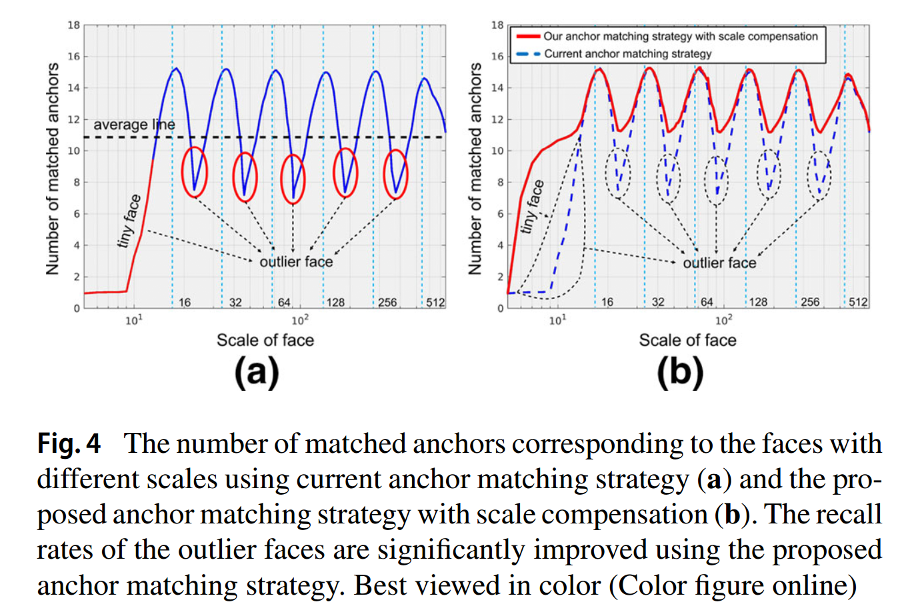
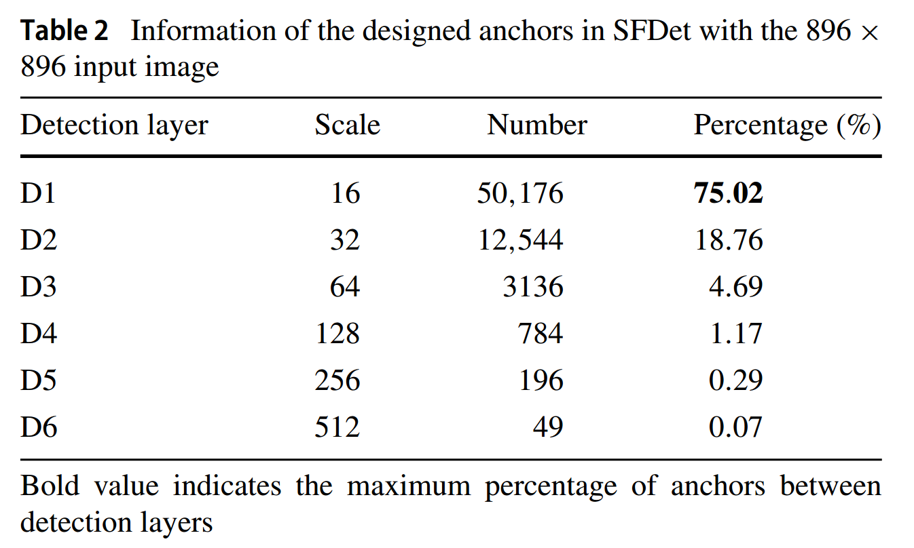
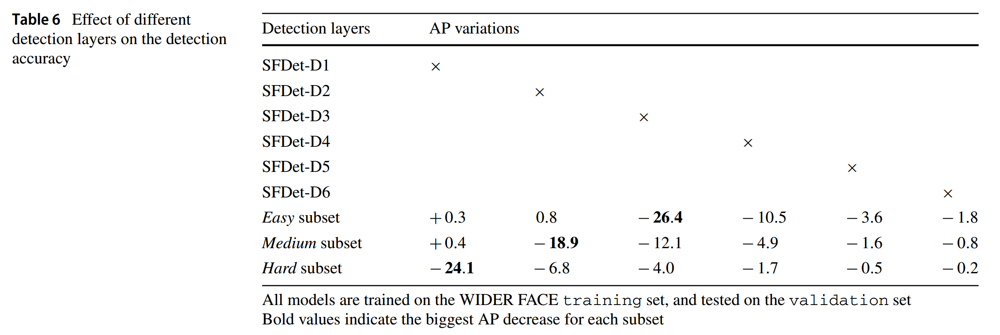
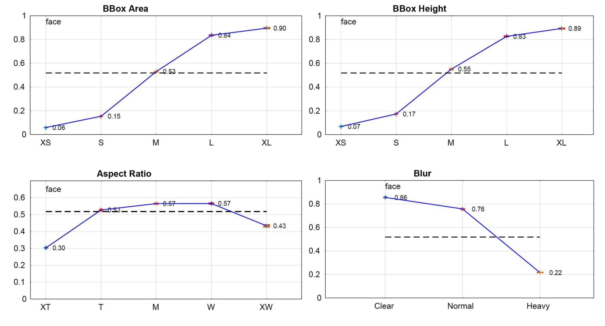

## Single-Shot Scale-Aware Network for Real-Time Face Detection

### Abstract

​		本文中，我们描述基于单发尺度感知卷积神经网络的人脸检测器（SFDet）。与最佳的基于锚的人脸检测方法相比，我们的方法的主要优势总结为四个方面：（1）我们提出使用与恰当锚尺度相关的广泛范围的层的尺度感知检测网络，以处理各种尺度的人脸，并且描述了一个新的密集原则来确保不同尺度的锚可以在图像上均匀分布；（2）为了提高特定尺度（例如人脸的尺度与设计的锚完全不同）人脸的召回率，我们设计了与尺度补充的锚匹配策略；（3）我们为分类损失计算中的每个训练样本引入 IoU-aware 的加权方案，从而在训练过程准确地编码样本；（4）考虑到类不平衡问题，使用 max-out 背景策略来降低假阳性。在公开的挑战性人脸检测数据集（WIDER FACE、AFW、PASCAL Face、FDDB 和 MAFA）上的几个实验表明所提出的方法获得最佳结果，并在 VGA 分辨率图像上以 82.1 FPS 的速度运行。

### 1	Introduction

​		人脸检测是大量计算机视觉应用（包括人脸识别、动画、表情分析和人机交互等）中的代表性工作。遵循 Viola 和 Jones （2004）的先驱工作，大多数早期人脸检测方法关注设计高效的手工特征 [例如，Haar（Viola 和 Jones 2004）和  HOG（Dalal 和 Triggs 2005）] 和分类器 [例如，Adaboost（Freund 和 Schapire 1997），以及在全局模型中组合局部特征（例如 deformable parts model：DPM）（Felzenszwalb 等 2010）]。然而，这些方法通常单独优化检测器的每个组件，当它们部署到真实的复杂场景中时，这限制了这些方法的性能。

​		在最近几年中，随着深度卷积神经网络的到来，新一代基于 CNN 的更高效人脸检测方法显著提高了最佳性能，并且逐渐成为工具选项。当前基于 CNN 的人脸检测方法可以分为两类。第一类方法使用 CNN 作为传统人脸检测框架中的特征提取器来提高性能。第二类方法（称之为基于锚的方法）将人脸检测视为通用对象检测的特例，并且在图像中使用依赖相同锚的基于 CNN 的对象检测算法来解决这个问题。具体而言，这些方法通过分类和回归一系列预设的锚来检测对象，预设的锚通过在图像上规则地平铺不同尺度和纵横比的锚集合生成，并且预设的锚与一个或几个卷积层的这些边界框关联。

​		基于锚的方法以端到端的形式优化整个检测管道，与第一类方法相比，展现出惊人的准确率提高。受 SSD 检测器的启发，我们使用基于锚的单发策略来追求准确的人脸检测结果及高效率。然而，如 Huang 等指出的，随着对象大小减小，基于锚的对象检测器的性能急剧衰减。对于人脸检测，性能衰退更严重，并且我们相信，这个问题背后存在四个主要议题，描述如下：

- **Detection Architecture**	直接使用当前的基于锚的通用对象检测方法来检测小型和中型人脸是困难的，因为最底层的关联锚的步长太大而不足以检测小型人脸 [例如，Liu 等 （2016）中的 8 个像素，Ren 等（2017）中的 16 个像素]，使得与那些小脸相对应的区域在卷积层上的尺寸很小，几乎没有检测特征。同时，人脸大小、锚尺度和相应的感受野是不匹配的，导致人脸检测使用低效的特征。
- **Anchor Matching Strategy**   基于锚检测方法中的锚尺度是离散的（例如我们在所提出的 SFDet 方法中使用锚尺度为 16、32、64、128、256、512），而真实场景中人脸尺度是连续的。使用这种方式，一些人脸的大小（特别是针对异常人脸，见图 4a）与所设计的锚不匹配，使得锚与这些人脸不能充分匹配，从而引起错误检测。
- **Training Sample Encoding**   当前的人脸检测方法使用硬 Jaccard 重叠阈值（hard Jaccard overlap）$\theta$ 来分割正类和负类样本。因此，在训练过程中，同等地对待 Jaccard 重叠在间隔 $[\theta, 1.0]$ 的正类训练样本。相同的策略也用 $[0, \theta)$ 间隔中负样本。
- **Class Imbalance**    如 Kong 等（2017）、Lin 等（2017b）指出的，类不同平衡问题显著影响单发检测方法的准确率。在人脸检测任务中，类不平衡问题主要由微小人脸的检测引起的。例如，如表 2 所示，超过 75% 的负锚来自最低的 D1 层，这主要设计用于检测小型人脸。

​		为了解决当前的基于锚的 CNN 人脸检测方法的上述问题，我们提出新的 _single-shot scale-aware face detector_（SFDet）。具体而言，我们将锚与跨度范围从 4 到 128 像素步长的宽尺度范围的卷积层层关联。同时，我们将锚的尺度设置为 16 到 512 个像素的值，从而匹配对应的有效感受野尺寸（Luo et al. 2016），并设计新的相等密度原则（equal density principle）来确保不同尺度的锚在图像上均匀分布的。为了提高特定尺度人脸的召回率，我们设计了新的具有尺度补偿的锚匹配策略。即，我们首先使用具有合适匹配阈值的当前匹配策略（Liu et al. 2016），然后将更多的锚添加到缺少匹配的人脸，从而确保每个人脸都能匹配到足够多的锚。**为了准确编码训练样本以获得更好的性能，在基于 Jaccard 与 ground-truth 重叠计算分类损失中，我们对训练样本使用 IoU 感知的权重**。为了确保小型人脸的召回率，同时抑制假阳性，我们引入 max-out background 策略，特别是针对最低的检测层。在几个挑战性人脸检测数据（即 WIDER Face、AFW、PASCAL Face 和 MAFA）上进行实验以论证所提出的方法可以获得最佳结果。

​		本文的主要贡献总结如下：

- 我们提出单发尺度感知的人脸检测器（single-shot scale-aware face detector），其使用与恰当的锚尺度关联的宽尺度范围的层来处理不同尺度的人脸。
- 为了提高异常人脸的召回率（特鄙视微型人脸的召回率），我们设计具有尺度补偿的锚匹配策略。
- 在基于与 ground-truth Jaccard 重叠的分类损失计算中，我们为训练样本使用 IoU 感知的权重来准确地编码样本。
- 引入 max-out background 策略来减小假阳性，特别是小型人脸。
- 我们的方法在几个人脸检测数据集（即 IDER Face、AFW、PASCAL Face 和 MAFA）上获得最佳结果，并在 VGA 分辨率图像上以 82.1 FPS 的速度运行。

​    这项工作的初步结果已在 Zhang 等人（2017d）中发表。当前的工作已经在几个重要方面进行了改进，并扩展到了会议版本。（1）在分类损失计算中，我们为训练样本引入了 IoU 感知的权重，而不是同等地对待它们。（2）受 Fu 等人（2017）、Kong 等人（2017）、Lin 等人（2017a）的启发，我们将高级特征图添加到低级层以继承大尺度的上下文信息，从而提高整体性能。（3）在我们之前的工作中，我们明显提高的检测器的准确率和速度，即在几个人来呢检测数据集上获得最佳结果，并在 VGA 分辨率图像上以 82.1 FPS 速度运行。（4）增加一些额外实验来证明所提出的方法的有效性，并分析不同组件对性能的影响。

### 2	Related Work

#### 2.1	Generic Object Detection

​		早期的通用对象检测器是基于滑动窗口范式，其使用手工特征和分类器来找出感兴趣的对象。最近，在对象检测领域，基于 CNN 的检测器获得令人吃惊的性能，这些检测器可以大致分为两个类别，即两阶段方法和一阶段方法。

​		两阶段方法首先通过独立的提议生成器 [例如，Selective Search、EdgenBoxes、RPN] 生成对象提议，然后分类每个提议得到类标签，并估计准确的大小和位置。随着 R-CNN、SPPNet、Fast R-CNN 到 Faster R-CNN 的累积进步，两阶段方法在几个挑战性数据集上获得顶级性能。最近两阶段方法的改进关注重新设计的架构和训练策略、使用上下文理解和利用多个层进行预测。

​		一阶段方法消除了提议生成步骤，并直接在密集网格上检测对象。具体而言，它将对象检测视为单发问题，即从规则的预平铺的锚框上使用深度 CNN 直接预测和回归对象边界框和类标签。与两阶段方法相比，一阶段方法的主要优势器极高的计算效率，但是其检测准确率通常比两阶段方法差。OverFeat 是第一个一阶段检测器之一，从那之后，研究人员提出了几个更有效的一阶段方法，最值得注意的是 YOLO 和 SSD。由于一阶段方法有极高的运行时效率，所以它吸引人们关注从头训练检测器、丰富特征用于检测、设计不同架构以及处理类不平衡问题。

#### 2.2	Face Detection

​		即使作为计算机视觉领域长期存在的问题之一，尽管文献丰富，但人脸检测由于其广泛的实际应用而在当今仍引起了很多关注。Viola 和 Jones（2004）的开创性工作是第一个重大突破，它利用具有 Haar 特征的 Adaboost 训练了一系列级联分类器，以高效地检测人脸并获得令人满意的准确性。从那之后，几种方法关注设计更加鲁棒性的特征和更强的分类器。DPM（Felzenszwalb等人，2010）是另一种流行的人脸检测方法（Zhu等人，2012； Mathias等人，2014；Yan等人，2014a），通过使用多尺度可变形组件模型的混合来表示多视图人脸 。然而，前面的方法依赖手工特征和分类器，从而使它们在复杂的场景中不可靠。

​		最近几年，基于 CNN 的人脸检测器在几个挑战性数据集上（例如 AFW、FDDB、WIDER FACE 等）上获得顶级性能，Li 等（2015）设计具有强大辨别能力的基于 CNN 的级联架构来快速拒绝低分辨率阶段中的背景区域，并关注高分辨率阶段中的少量挑战性候选区域。Qin 等（2016）提出联合训练级联神经网络的两个阶段（Li等人2015），以实现端到端优化。Yang等人（2015b）将人脸检测公式化为通过其空间结构和排列来对人脸部分响应进行评分，这使网络能够检测到严重遮挡和不受约束的姿势变化的人脸。Zhang 等（2016b）提出使用统一的多任务学习的级联 CNN 来联合人脸检测和对齐的方法。Yu 等（2016）为边界框损失引入 IoU 损失，并且他们的方法将预测边界框的大小和位置直接预测整个单元，从而获得准确和高效的检测。

​		其他人脸检测算法受通用对象检测方法的启发。Jiang 和 Learned-Miller（2017）使用 Faster R-CNN 算法（Ren 等 2017）来检测人脸，并获得有希望的结果。Zhu 等（2016）将基于人体解剖结构的上下文推理集成到 Faster R-CNN 算法中，以帮助减少综合检测误差。Li 等（2016）将 ConvNet 模型与 3D 均值人脸模型结合到端到端的多任务判别学习框架中，与最新方法相比，该模型产生了竞争性结果。为了处理检测器训练过程中类不平衡问题，Wan 等（2016）使用难负样本挖掘技术来提高性能。Chen 等（2016）设计了基于端到端学习的监督迁移网络来处理人脸检测中的大型姿态变化，其中监督的转换器层可以学习最佳规范姿势，以最佳地区分人脸/非人脸图像。与前面提到的方法相比，我们旨在改进当前基于锚方法以实时监测多种尺度的人脸。

### 3	Single-Shot Scale-Aware Face Detector

​		本节中，我们将介绍我们的 single-shot scale-aware face detector（SFDet），包括尺度感知的网络（3.1节）、具有尺度补偿的锚匹配策略（3.2节）、训练样本编码（3.3节）、max-out background 策略（3.4节）以及检测器的训练和推理过程（3.5节）。

#### 3.1 Scale-Aware Network

​		如上所述，受 SSD（Lin 等 2016）的启发，我们使用基于锚的单发策略来检测人脸。然而，当将其用于人脸检测时，随着人脸尺寸的减小，SSD 的准确率急剧下降。为了适应比例尺的这种变化，我们构建了一个网络，该网络具有与不同大小的锚点关联的宽尺度层。具体而言，我们将锚与 6 个卷积层关联，这个 6 层的步长设置为 $2^k$ 像素（$k=2, \cdots, 7$）。在这种方法中，网络确保多种尺度的人脸具有恰当的特征进行检测。此外，我们使用 16 到 512 像素的锚尺度来匹配对应有效感受野的最小尺寸，并且设计了新的相等密度原则，从而使不同尺度的锚在图像中均匀分布。

##### 3.1.1	Architecture

​		我们使用 VGG16 作为我们的检测器的骨干网络（在分类层之前截断）。具体而言，我们重新训练 VGG-16 网络中的 Conv1_1 到 Pool5 层，并移除所有的其他层。然后，我们几个辅助结构，即额外的卷积层、归一化层、翻卷积层和检测层，从而为人脸检测适应骨干网络。我们的 SFDet 方法的架构如图 1 所示。

**Additional Convolution Layers**	我们通过下采样参数将 VGG-16 中的全连接层 fc6 和 fc7 转换为卷积层 Conv_fc6 和 Conv_fc7，然后在它们之后添加 4 个额外的卷积层，即 Conv6_1、 Conv6_2、 Conv7_ 1 和 Conv7_2 。具体而言， Conv6_1 是步长为 1 的 $1 \times 1 \times 256$ 卷积层（即 $1 \times 1 \times 256-s1$）， Conv6_2 为步长为 2 的 $3 \times 3 \times 512$ 卷积层（即 $3 \times 3 \times 512-s2$）， Conv7_1 为步长为 1 的 $1 \times 1 \times 128$ 卷积层（即 $1 \times 1 \times 128-s1$），以及 Conv7_2 为步长为 2 的 $3 \times 3 \times 256$ 卷积层（即 $3 \times 3 \times 256-s2$）。

**Normalization Layers**	由于卷积层 Conv3_3、Conv4_3 和 Conv5_3 有不同的特征尺度，因此，我们使用 L2 归一化（Liu 等 2015）来将特征范数缩放到 20，然后在反向传播过程中学习尺度。

**Deconvolution Layers**	受 Fu 等（2017）、Kong 等（2017）和 Lin 等（2017a）的启发，我们将高级特征图添加到低级层来集成大尺度上下文信息，从而提高检测准确率。为了匹配它们之间的维度，我们使用反卷积运算将高级特征的维度膨胀到低级特征图相同的大小，并以逐元素将它们相加。翻卷积层的架构如图 2 所示。

**Detection Layers**	如图 1 所示，我们使用反卷积后的六个特征层作为检测层来预测人脸的位置和大小，即 D1、D2、D3、D4、D5 和 D6 ，并且将这些不同尺度的锚与这些检测层关联，从而产生检测结果。所选的检测层的大小逐渐减小以构成多尺度的特征图。每个反卷积层后跟一个核大小为 $3 \times 3$ 的卷积层，从而组成检测层。对于每个锚，我们预测与其坐标相关的 4 个偏移和 $C+1$ 个分类得分，其中 $C \ge 1$ 表示 D1 检测层的 max-out 背景策略中的标签数，而其他检测层 $C = 1$ 。

 

##### 3.1.2	Anchor Scales Designing

​		我们将特定尺度的锚与每个检测层关联，以检测特定尺度的人脸，如表 1 所示。因为人脸可以近似地表示为正方形边界框，所以我们将锚的纵横比设置为 $1:1$ ，即正方形锚。在表 1 中，我们介绍了 SFDet 的每个检测层的步长和对应的最小理论感受野，并基于锚的尺度设计了如下两个方面：

**Effective Receptive Field**	如 Luo 等（2016）解释的，CNN 模型的每个单元有两种类型的感受野，即理论感受野（theoretical receptive field：TRF）和有效感受野（effective receptive field：ERF）。TRF 表示理论上会影响单元输出的输入区域。TRF 中的像素对最终输出的贡献不相等：中心位置的像素的影响比边界像素大。TRF 中对输出值有影响的像素部分对应 ERF（见图 3a）。尽管我们将高级特征添加到低级层，来丰富检测的感受野，但是检测层中的最小 TRF 是没有变化的。因此，基于 Luo 等（2016）的理论，我们应该将锚大小设置为小于最小 TRF，以匹配相应的 ERF（见图 3b），以获得更好的性能。

**Equal Density Principle**	检测层的步长决定图像上平铺锚的间隔。例如，SFDet 中的 D1 检测层的步长为 4 ，而相应的锚尺度为 $16 \times 16$ ，即我们在图像上以每 4 个像素的间隔平铺大小为 $16 \times 16$ 的锚。如表 1 的第二和第三列和表 3c 所示，我们将锚的大小设置为相应间隔的 4 倍，这保证了以相同密度在图像上平铺不同尺度的锚，并且具有不同尺度的人脸可以与相同数量的锚点近似关联。以这种方式，SFDet 方法可以准确检测不同尺度的人脸，特别是微小人脸。

#### 3.2	Scale Compensation

​		在训练阶段，我们将 ground-truth 边界框与平铺的锚匹配。当前的锚匹配策略（Liu 等 2016；Ren 等 2017）首先将锚与最大 Jaccard 重叠的人脸匹配，然后将锚与任何 Jaccard 重叠大于预设阈值 $\theta$ 的人脸匹配。然而，在真实世界的应用中，**锚的尺度是离散的，而人脸的大小是连续的**。因此，一些异常尺度的人脸（见图4）匹配不了所设计的锚，换句话说，没有足够的锚来匹配这些人脸。这如图 4a 所示，其中，我们计算不同尺度的人脸匹配上的锚的数量。如图所示，匹配锚的数量与锚的尺度高度独立，即异常人脸匹配不到足够的锚，导致低召回率。为了解决这个问题，我们设计了如下的具有尺度补偿的新锚匹配策略：

1. 我们首先使用当前阈值为 $\theta$ 的锚匹配策略（Liu 等 2016；Ren 等 2017）来决定哪个锚对应人脸边界框。将所匹配的锚的数量设置为 $K^\ast$ 。
2. 我们进一步设计了一种补偿机制，用于匹配锚点匹配不足的人脸（例如，图 4b 中的灰色虚线表示的异常（outlier）人脸）。具体而言，对于锚点匹配不足的每个人脸（即所匹配锚的数量 $K$ 小于 $K^\ast$，$K < K^\ast$），我们首先选择与人脸的 Jaccard 重叠大于 0.15 的锚。然后，我们基于 Jaccard 重叠以降序排列它们，并且将 $K^\ast - K$ 个锚匹配给人脸。

​        在这种方式中，新设计的锚匹配策略极大增加了异常人脸所匹配的锚的数量，从而确保这些人脸的召回率，见表 4b 。

#### 3.3	Training Sample Encoding

​		为了准确编码训练样本以获得更好的性能，我们基于锚与 ground-truth 的 Jaccard 重叠来给训练样本添加 IoU 感知的权重，并且将 RPN 中使用的多任务损失重构以联合优化模型参数：

$$\begin{align}L(p_i, t_i) &= \frac{\lambda}{N_{cls}}\sum_i\psi(p_i^\ast) \cdot L_{cls}(p_i, p_i^\ast) \\ &+ \frac{1}{N_{reg}}\sum_i p_i^\ast \cdot L_{reg}(t_i, t_i^\ast).\end{align} \tag{1}$$

式（1）中，$i$ 为锚的索引，$p_i$ 为第 $i$ 个锚为人脸的预测得分，$t_i$ 为表示预测人脸边界框的四个坐标，$t_i^\ast$ 为与第 $i$ 个锚匹配的 ground-truth 边界框，$N_{cls}$ 为用于规范化分类损失项的正类和负类锚的数量，$N_{reg}$ 为用于规范化回归损失项的正类锚数量，$\lambda$ 为平衡两个任务损失的超参数（由于正负锚的比例设置为 $1:3$ ，所以我们使用 $\lambda = 4$ 来平衡分类和回归损失），而 $\psi(p_i^\ast)$ 为用于编码第 $i$ 个训练样本的 IoU 感知的权重。分类损失 $L_{cls}(p_i,p_i^\ast)$ 是正确类 $p_i^\ast$ （即人脸和非人脸）的对数损失，而回归损失 $L_{reg}(t_i, t_i^\ast)$ 为 Girshick（2015）定义的 smooth L1 损失。

​		我们将 $\mu_i$ 设为第 $i$ 个锚与 ground-truth 之间的 Jaccard 重叠，而 $\theta$ 为用于划分正负锚的预设阈值，即如果 $\mu_i \ge \theta$ ，则锚为正类，并且我们将 ground-truth 标签设置为 $p_i^\ast = 1$ ，否则，锚为负，设置 $p_i^\ast = 0$ 。在训练阶段，我们使用 IoU 感知的权重来控制不同样本的贡献，而不是同等地对待不同的训练样本。具体而言，我们使用更多的前景区域来增加正类锚的贡献，

$$\psi(p_i^\ast) = \exp(\mu_i - \alpha), \tag{2}$$

其中 $\alpha$ 是用于在训练阶段调整网络焦点的预设参数。同时，我们还会增加几乎全由背景区域构成的负锚的损失（即，$\mu_i \le 0.1$），从而减少具有小部分人脸区域的负锚的贡献，即

$$\psi(p_i^\ast) = \begin{cases} 1, & 0.1 < \mu_i < \theta \\ \exp(1 - \alpha), & \mu_i \le 0.1 \end{cases} \tag{3}$$

以这种方式，我们是网络关注准确的正类锚和“真实（real）”的负锚（即几乎全由背景区域组成），同时丢弃“模糊”锚（即包含人脸和背景区域的锚）以提高检测结果的准确率。$\psi(\cdot)$ 对应 $\mu$ 的函数曲线见图 5 。 

#### 3.4	Max-Out Background Strategy

​		训练期间的类不平衡是阻碍一阶段检测器获得准确结果的主要障碍之一。根据我们的统计结果，超过 99.8% 的平铺锚是负锚（即背景区域），并且仅超过 0.2 % 的锚是正锚（即人脸区域）。如图 6 所示，极端不平衡背后的原因是由小型人脸的目标引起的。即，我们不得不平铺大量的小锚来检测小型人脸，这引起负锚的数量急剧增加。例如，如表2所示，在 $896 \times 896$ 的输入图像平铺了 66885 个锚。大约 75% 的锚与具有最小尺寸 $16 \times 16$ 的检测层 D1 关联。因此，平铺小锚来改进小型人脸的检测将不可避免地导致人脸假阳性率（false positive rate）的增加。

​		两阶段方法通过两阶段级联和启发式采样来处理不平衡问题，并且一些最近的一阶段方法重新设计检测器的损失函数和网络架构来解决这些问题。与这些方法相比，我们设计了 max-out background 策略来抑制小型人脸的假阳性，如图 7 所示。对于非限制场景的人脸检测任务，背景区域的外观变化剧烈。仅用一个类来描述背景是不充分的，因此，我们引入 $C$ 个潜在子类来表示背景（本文的实验中，设置 $C = 3$）。然后，我们使用 $C$ 个输出的最大值来表示锚属于背景的置信度。值得注意的是，在分类层中使用更多的输出节点将改进背景类的分类准确率。以这种方式，人脸的假阳性率显著减小，而保持了召回率。

#### 3.5 Training and Inference

**Data Augmentation**	为了构建鲁棒性的模型和阻止过拟合，我们使用几种数据增强策略来适应人脸的辩护，描述如下：

- 我们首先随机选择光度失真算法（Howard 2013）以更改原始训练图像的亮度、对比度、色相或饱和度。
- 然后，我们以间隔 $[1, 2]$ 中因子随机扩展图像。
- 接着，我们从扩展的图像上随机裁剪两个正方形补丁，并选择其中一个进行训练。一个补丁的尺寸是图片的较短边的大小，而另一个补丁的尺寸是通过将间隔 $[0.5,1.0]$ 中的随机数乘以图片的较短边而确定的。
- 最后，我们随机翻转所选择的补丁，并将其调整到 $896 \times 896$ 以得到最终的训练样本。

**Hard Negative Mining**   由于大多数锚在匹配步骤之后是负的（即锚没有匹配到任何人脸），这导致训练样本的极端类不平衡。使用所有的负锚或者随机选择其中的一些将使训练过程变得缓慢和不稳定。为了缓解这个问题，与 Liu 等（2016）相似，在训练阶段，我们使用 hard negative mining ，即选择一些具有最高损失值的负锚，并使负锚与正锚之间的比例低于 $3:1$ 。

**Initialization**	基本的卷积层由预训练的 VGG-16 网络初始化。Conv_fc6 和 Conv_fc7 的参数通过子采样 VGG-16 中的 fc6 和 fc7 层的参数初始化。同时，新添加的卷积层中的所有参数使用“Xavier”方法初始化。

**Optimization**	我们使用 momentum 为 0.9、weight decay 为 0.0005 和批大小为 12 的 SGD 微调 SFDet 模型。前 80K 迭代中设置学习率为 $10^{-3}$ ，在另外两个 20k 迭代中学习率分别衰减到 $10^{-4}$ 和 $10^{-5}$ 。

**Inference**	在推理阶段中，SFDet 方法输出大量检测框。例如，它在大小为 $640 \times 480$ 像素的 VGA 分辨图像上产生 25600 个边界框。我们首先以置信度阈值 0.01 过滤掉大多数边界框，并仅仅保留具有最高置信度得分的 400 个边界框。之后，我们使用 0.3 的 Jaccard 重叠的 NMS 来生成每个图像最终的 200 个高置信度检测结果。

### 4	Experiments

​		我们基于五个挑战性的人脸检测基准测试上进行几个实验，这几个数据集包括 WIDER FACE、AFW、PASCAL Face、FDDB 和 MAFA。我们使用 Caffe 库重新实现 SFDet 。

#### 4.1 WIDER FACE Dataset

​		WIDER Face 数据集在 32203 幅图像中包含 393703 个标注人脸边界框，这些人脸包含姿态、尺度、人脸表情、遮挡和光照条件都不同。将数据集划分为 training（40%）、validation（10%）和 testing（50%），并且基于 EdgeBox 的检测率定义三个难度等级：Easy、Medium、Hard 。遵循 WIDER FACE 的评估协议，我们在 training 集上训练 SFDet 方法，并在 validation 和 testing 集上测试 SFDet 。为了获得 testing 集上的评估结果，我们提交 SFDet 的检测结果个作者进行评估。

​		我们将 SFDet 与 12 个最佳的人脸检测方法比较。如图 8 所示，我们发现，基于三个子集的平均精度（AP），SFDet 优于最新技术，尤其是在包含大量小脸的Hard 子集上。具体而言，在验证集和测试集上产生最佳的 AP，即 验证集上产生 95.4%（Easy）、94.5%（Medium）和 88.8%（Hard），测试集上产生 94.8% （Easy）、 94.0% （Medium） 和 88.3% （Hard），比所有其他方法好，这展示出了 SFDet 人脸检测器的优势。WIDER FACE 数据集的量化结果见图 19 。我们在图 20 中展示了 World Largest Selfie 的另一个量化结果。我们的 SFDet 检测器成功找到报告的 1000 个人脸中的 883 个。与（Hu 和 Ramanan 2017）的方法相比，SFDet 检测器多找出 83 张人脸，这证明了我们的检测器的有效性，特别是检测小尺度的人脸。

##### 4.1.1	Ablation Study

​		为了证明 SFDet 中不同组件的有效性，我们构建了五个变体（即 SFDet-o、SFDet-b、SFDet-s、SFDet-sc 和 SFDet-scw），并在 WIDER FACE 验证集上评估它们，图表 3 所示。具体而言，为了公平比较，在训练中，我们使用相同的参数配置和输入大小（ $896 \times 896$ ）。

**Feature Pyramid Network**	我们使用 FPN 将高级特征添加到低级层以集成大尺度上下文信息。我们构建了两个检测器来证明 FPN 结构在检测性能上的影响。如表 3 所示，在使用 FPN 结构后，我们发现检测器将 Easy、Medium 和 Hard 子集上的 AP 得分从93.3%、 91.4% 和 73.2% 提高到 93.8%、92.2% 和 74.8% 。值得注意的是，Hard 子集上的改进是最明显的（即 1.6 %），因为大尺度上下文信息对检测 Hard 子集上的挑战性小型人脸更有效。

**Scale-Aware Network**	我们构建两个检测器来证明尺度感知网络设计的有效性。一个是使用默认锚设计策略下的 SSD 对象检测框架的特征金字塔，这个称为 SFDet-b，另一个使用所提出的尺度感知的架构和锚设计，而不是 SFDet-b 的架构和锚设计，称之为 SFDet-s 。如表 3 所示，我们发现 SFDet-b 在 Easy、Medium 和 Hard 上产生竞争性 AP 得分（即 93.8%、92.2% 和 74.8%），这比当前的大多数人脸检测器（例如 CMS-RCNN 和 LDCF+）更好。SFDet-s 使用所提出的尺度感知架构和锚设计，通过将精心设计的锚关联到广泛的层级范围，从而产生比 SFDet-b 更好的结果，在 Easy、Medium 和 Hard 子集上，AP分别提高了 0.3％、0.4％和10.9％ 。值得注意的是，Hard 子集包含比 Easy 子集更多的挑战性小型人脸。Hard 和 Easy 子集提高之间的巨大差异（即 10.9% vs. 0.3%）证明了所提出的尺度感知架构和锚设计在处理多种尺度的人脸方面的有效性。

**Scale Compensation**	为了验证尺度补偿的有效性，我们设计了具有尺度补偿的锚匹配策略的检测器，而不是 SFDet-s 方法中的策略，称这个方法为 SFDet-sc 。SFDet-s 和 SFDet-sc 的比较结果见表 3 。我们注意到，使用尺度补偿的锚匹配策可以一致性地提高不同子集的 AP 得分，即在 Easy、Medium 和 Hard 子集上分别为 0.7%、0.9% 和 1.4% 。这些提高主要归功于尺度补偿，器提高异常人脸的召回率（例如，微小的人脸或一些尺度位于两个设计锚中间的尺度的人脸），从而得到更好的检测准确率。

**Training Sample Encoding**	为了证明训练样本编码的重要性，我们比较 SFDet-scw 和 SFDet-sc 方法，如表 3 。SFDet-scw 方法增加了一个 IoU 感知权重，以基于与 ground-truth 的 Jaccard 重叠来控制训练中样本的贡献，而不是在 SFDet-sc 中将其等同对待所有样本。SFDet-scw 和 SFDet-sc 检测器的其他部分相同，见表 3 ，我们注意到，训练中使用 IoU 感知的权重将 Easy、Medium 和 Hard 子集上的 AP 得分分别提高了 0.5%、0.8% 和 1.2% 。因为 IoU 感知的权重更关注正类样本和“真实”负样本（即几乎全由背景区域组成的）中不正确的预测，所以它将驱动检测器产生准确的对象定位和大小，以实现更好的性能。

​		此外，我们还证明了 IoU 感知的权重对于产生更准确检测结果是有效的。我们在 WIDER FAC E验证 Hard子集上绘制了 SFDet-sc 和 SFDet-scw 方法的 AP 得分与 IoU 阈值的关系曲线。如图 9 所示，我们发现，我们发现，在 $[0.5,0.95]$ 的 IoU 阈值之上，SFDet-scw 方法产生的检测结果始终比 SFDet-sc 方法准确。SFDet-sc 和 SFDet-scw 的 AP 得分之间的差距随着 IoU 阈值增加而增加，其在 $[0.75, 0.8]$ 中的 IoU 阈值达到最大值。这些结果进一步证明了 IoU 感知的权重对于帮助提高检测性能是很重要的。

**Max-Out Background Strategy**	我们比较 SFDet-scw 和完整的 SFDet 方法来研究 max-out background 策略的影响。如表 3 所示，SFDet 在三个子集上的 AP 得分比 SFDet-scw 高，即在 Easy、Medium 和 Hard 子集上分别为 0.1%、0.2% 和 0.5% 。SFDet 中的 Max-Out Background 策略通过在分类层中引入多个输出节点来缓解类不平衡，从而提高背景类的分类准确率。以这种方式，它可以显着减少误报，同时保持召回率，以确保准确性。

##### 4.1.2	Hyper-parameter Analysis

**Effect of $\theta$**	我们进行几个实验来研究超参数 $\theta$ 的影响，其用于区分正类和负类锚（见 3.2 节）。受 Wang 等（2018）的启发，我们在 WIDER FACE 训练集上训练 $[0.25:0.05:0.5]$ 之间阈值的 SFDet-sc ，并在验证集上测试。如表 4 所示，我们发现将 $\theta$ 从 0.5 降到 0.35 可以始终提高 AP，例如在 Hard 子集上将 AP 从 86.1% 提高到 87.1%，由于使用更小的 $\theta$ 可以生成更多的正类锚，这有助于提高人嗯脸的召回率，特别是 Hard 子集上的小型人脸。然而，随着 $\theta$ 从 0.35 降低到 0.25 ，会利用大量“噪声”正类锚（即由大量背景区域构成的锚）训练网络，这影响检测准确率。因此，我们在实验中根据经验将 $\theta$ 设置为 0.35 。

**Effect of $\alpha$**	我们还研究了超参数 $\alpha$ 在训练样本编码对检测准确率的影响。在训练阶段，$\alpha$ 是用于调整网络关注点的预设参数。我们在 WIDER FACE 训练集上使用 $[0.2:0.05:0.5]$ 中不同 $\alpha$ 来训练 SFDet-scw，并在验证集上测试。如表5 所示，我们观察到我们的检测器对于 $\alpha$ 的变化相对不敏感。因为因为要么错过一些正锚，要么过度加权一些“模糊”负锚会影响检测器的性能，太小（例如 $\alpha=0.20$）或太大（例如 $\alpha=0.50$）的 $\alpha$ 引起准确率略微下降。因此，我们在实验中根据经验将 $\alpha$ 设置为 0.35 。

##### 4.1.3	Detection Layer Analysis

​		为了研究每个检测层在准确率方面的影响，我们逐步移除每个检测层，并评估对应模型在 WIDER FACE 验证集上的影响，见表 6 。移除 D1 层（SFDet-D1）后，Easy 子集上的 AP 得分增加了 0.3%，Hard 子集上的 AP 不可思议的降低了 24.1%，这表明 D1 检测层对检测小型人脸至关重要，但是平铺大量的小型锚会略微影响 Easy 和 Medium 子集上的检测准确率。同时，检测层 D2（SFDet-D2）和 D3（SFDet-D3）对 Medium 子集的准确率作出了最重要的贡献，即如果我们移除 D2 和 D3 ，AP 得分减少 18.9% 和 12.1% 。对于 Easy 子集，D3 和 D4 检测层对性能很关键，即如果移除 D3 和 D4 ，AP 得分将下降 26.4% 和 10.5% 。我们还注意到检测层 D5 和 D6 对这三个子集上的检测性能影响很小（即，在 Easy 上为 -3.6% 和 -1.8%，Medium 上为 -1.6% 和 -0.8%，以及 Hard 上为 -0.5% 和 -0.2%），这是因为 WIDER FACE 数据集上大尺度人脸非常小。

##### 4.1.4	Error and Sensitivity Analysis

​		我们使用检测分析工具（http://web.engr.illinois.edu/~dhoiem/projects/detectionAnalysis）来分析 SFDet  在 WIDER FACE 验证 Hard 子集上的误差和敏感度。人脸检测器中存在假阳性的两种错误模式，即 LOC 和 BG 。 LOC 指示当使用未对齐的边界框检测到人脸时发生的定位错误，而 BG 指示将背景区域错误地检测为人脸。图 10 展示了两类假阳性的分布，而图 16 展示了 WIDER FACE 验证 Hard 子集上的前 20 个评分。BG 似乎是图 10 中得分最高的检测方法中的主要错误模式，但是，得分最高的 20 个假阳性结果中有 14 个实际上是由于缺少注释（即， 在图16中，预测的边界框将人脸围住了，而 “ ov” 等于零）。 

​		此外，我们还分析了 WIDER FACE 验证 Hard 子集上的 SFDet 的敏感度。图17 显示了针对每个人来呢特征的标准化 AP（Hoiem等人，2012）。我们注意到，在极小尺度、极高的宽高比、严重的模糊、严重的遮挡和非典型的姿态的情况下，我们的检测器的性能要低于平均水平。令人惊讶的是，夸张的表情和极端的照明与更好的性能相关。图 11 绘制了 图 17 中标准化 AP 的最大值和最小值来总结每个人脸特征的影响。如图 11 所示，我们的人脸检测器主要受人脸面积（从 0.059 到 0.896）、模糊（从 0.216 到 0.856）和遮挡（从 0.180 到 0.646）影响，而几乎不受人脸纵横比、表情、光照和姿势的影响。

#### 4.2 AFW Dataset

​		SFDet 上的比较结果见图 12 

#### 4.3 PASCAL Face Dataset

​		比较结果见图 13 。

#### 4.4 FDDB Dataset

​		FDDB 数据集在 2845 幅图像中包含 5171 个人脸标注，具有很大的困难，例如遮挡、困难的姿势和低图像分辨率。在评估方面有两个问题：（1）FDDB 使用椭圆来表示人脸，而 SFDet 产生举行边界框。这种不一致对评估的连续预测分数有很大的影响。为了公平地比较，我们训练一个椭圆回归器，将预测的边界框转换为椭圆。（2）FDDB 包含许多未标注的人脸，这造成几个正确的人脸被视为假阳性。为此，我们会手动检查 ground-truth 并注释 474 张其他人脸。离散和连续的评估结果如图 14 所示。

#### 4.5 MAFA Dataset

#### 4.6 Run Time Analysis

​		我们在具有 CUDA 8.0 和 cuDNN v6.0 的单个 NVIDIA GTX 1080-Ti 分析 SFDet 的推理速度。使用 FPS 衡量速度。如图 8 所示。

