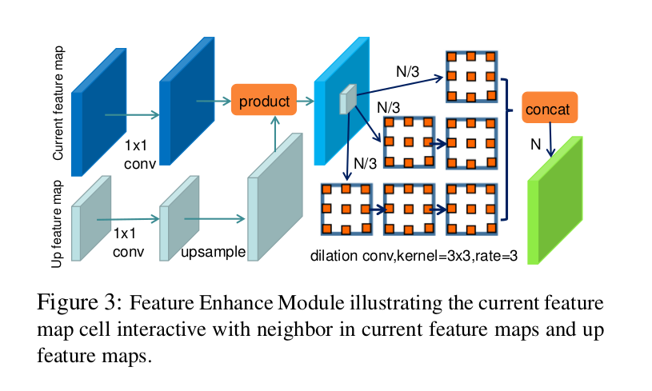
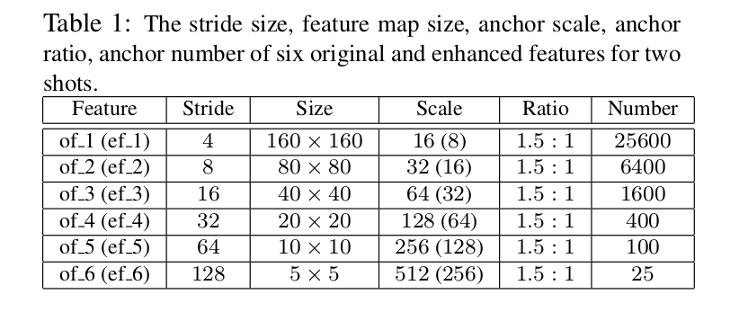
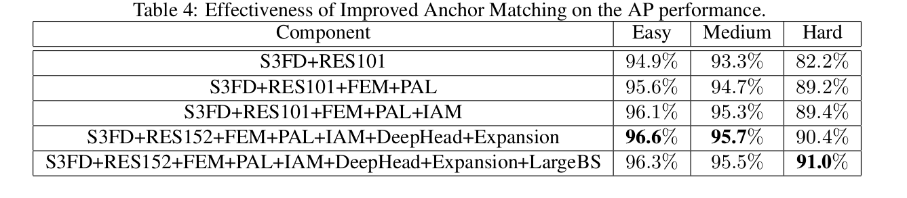
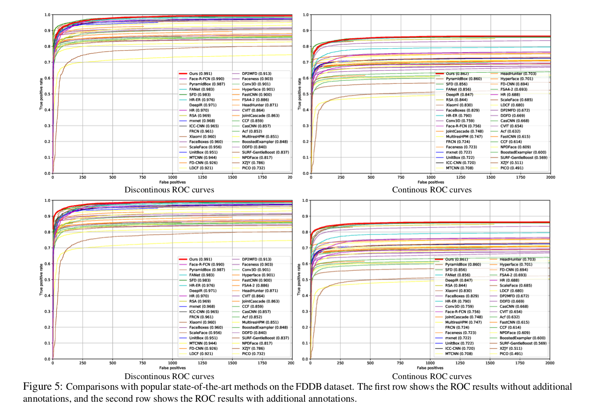

DSFD: Dual Shot Face Detector
=

# 1. Introduction
人脸检测是不同人脸应用的基础步骤，例如人脸对齐、解析、识别和验证。作为人脸检测的先驱，Viola-Jones 采用手工设计特征的 AdaBoost 算法，其现在被使用CNN深度学习的特征替换。尽管基于 CNN 的人脸检测器已被广泛研究，检测在真实世界场景中尺度、姿态、遮挡、表情、外观和光照高度变化的人脸仍然是一个挑战。

先前的最佳人脸检测器可以大致分为两种类型。第一种主要基于Faster RCNN采用的 RPN，并且使用两阶段检测方案[24,27,29]。RPN 端到端的训练，并生成高质量的区域提议，其进一步通过Fast R-CNN 检测器细化。另一种是基于 SSD 的一阶段方法，其摆脱 RPN，并直接预测边界框和置信度。最近，由于一阶段人脸检测框架更高的推理效率和更直接的系统部署，其吸引了更多的注意力。

尽管通过上述人脸检测器获得了进步，但是仍存在如下三个方面的问题：
- **Feature Learning** 特征提取部分对于人脸检测器至关重要。最近，特征金字塔（FPN）广泛用于富特征的最优人脸检测器。然而，FPN仅聚合高低级别输出层之间的特征图，其没有考虑当前层的信息，并且 _锚之间的上下文关系_ 被忽略了。

- **Loss Design** 用于对象检测的常用损失函数包含用于人脸区域的回归损失和用于确定是否检测到人脸的分类损失。为了进一步处理类别不平衡问题，Lin等人[14]提出 Focal Loss 以关注难样本系数集上的训练。为了使用所有的原始和增加的特征，Zhang等人提出 Hierarchy Loss 以有效地学习网络[30]。然而，上述损失函数没有考虑不同水平特征图的 _渐进式学习能力（progressive learning ability）_ 。

- **Anchor matching** 基本上，每个特征图的预设 anchor 是通过在图像上规则地平铺一组具有不同尺度和纵横比的边界框而生成的。先前的工作[21][32]分析了一系列合理的 anchor 尺度和 anchor 补偿策略来增加正类 anchor 的数量。然而，如此的策略了数据增强中的 _random sampling_ 。连续的人脸尺度和大量离散的 anchor 尺度仍然造成了负类和正类 anchor 之间的巨大比例差异。

为了处理上述三个问题，我们提出一种基于SSD管道的新颖网络，称为 Dual Shot Face Detection（DSFD）。首先，结合 PyramidBox中的 low-level FPN 和 RFBNet 中的Receptive Field Block（RFB），我们引入 Feature Enhance Module（FEM）来增强特征的辨别性和鲁棒性。其次，受 hierarchical 损失[30]和PyramidBox中 Pyramid Anchor [21] 的启发，我们提出 Progressive Anchor Loss （PAL），其通过一组更小的锚来计算辅助损失以有效地促进特征，由于更少的锚平铺到更高级的特征图单元，则可能有更多的语义信息进行分类，以及更高分辨率的位置信息进行检测。最后但同样重要，我们提出 Improved Anchor Matching（IAM）方法，其集成 anchor 分区策略和基于 anchor 的数据增强策略到我们的 DSFD 以尽可能地匹配 anchor 与 ground-truth 人脸，从而更好地对回归器进行初始化。图2表明，我们更少的锚点平铺和改进的锚点与 ground-truth 人脸的匹配可以消除尺度和遮挡的障碍以提高人脸检测的性能。

总之，本文主要的贡献包括：
- 一种新颖的 Feature Enhance Module 以利用不同水平的信息，因此，获得更具辨别性和鲁棒性的特征。
- 在早期层中，通过一组更小的 anchor 引入辅助监督以有效地促进特征。
- 一种改进的anchor匹配策略以尽可能地匹配anchor和ground-truth人脸，从而为回归器提供更好地初始化。
- 在流行基准测试 FDDB 和 WIDER FACE 上执行综合实验以证明我们所提出的 DSFD 网络比历史最优方法更优越。

# 2. Related Work
**Feature Learning** 人脸检测的早期工作主要依赖手工制作的特征，例如类似 HARR 特征[23]、 control point set[1]、edge orientation histograms[10] 。然而，手工特征设计缺乏指导性。随着深度学习的极大进步，手工特征被CNN代替。例如，Overfeat、Cascade-CNN、MTCNN在图像金字塔上采用CNN作为滑动窗口检测器来构建特征金字塔。然而，使用图像金字塔很慢，且不是内存有效的。因此，多数两阶段检测期在单一尺度上提取特征。R-CNN通过选择性搜索获得区域提议，然后将标准化的图像区域传入CNN进行分类。Faster R-CNN、 R-FCN采用RPN生成初始区域提议。此外，RoI池化和位置敏感 RoIR 池化用于从每个区域提取特征。

最近，一些研究表明多尺度特征对小对象有更好性能。具体地，SSD、MS-CNN、SSH、S3FD在特征层次的多层上预测边界框。FCN、Hyper-Column、ParseNet在分割中融合多层特征。FPN，一种top-down架构，将高层语义信息集成到所有尺度。基于FPN的方法，例如FAN、PyramidBox在检测上获得显著的性能提高。然而，这些方法没有考虑当前层的信息。不同于上述提到的方法忽略了 anchor 之间的上下文关系，我们提出一个特征增强模块，其包含多个级别的膨胀卷积层来增强特征语义。

**Loss Design** 通常，检测的目标损失为分类损失（例如softmax 损失）和边界框损失（例如 $L_2$ 损失）的加权和。Girshick等人[5]提出 smooth $L_1$ 损失以阻止爆炸的梯度。Lin等人[13]发现类别不平衡是一阶段检测器获得更好性能的一个障碍，因此他们提出 focal loss ，其为一种动态缩放的交叉熵损失。此外，Wang等[26]设计 RepLoss 损失进行行人检测，其提高了遮挡场景中的性能。FANet[30]创建的一种层次特征金字塔，并提出用于他们架构的层次损失。然而，FANet 中使用的锚在不同阶段保持相同的大小。在我们的工作中，我们在不同阶段自适应地选择不同锚大小以促进特征。

**Anchor Matching** 为了使模型更具鲁棒性，大多数检测方法[15][28][32]使用数据增强，例如颜色扭曲、水平翻转、随机剪裁和多尺度训练。Zhang等[32]提出一张锚补偿策略以使小脸在训练期间匹配足够的锚。Wang等[28]提出随机剪裁策略以生成大量遮挡人脸用于训练。然而，这些方法忽略数据增强中的随机采样，而我们组合锚分配策略以为锚匹配提供更好的初始化。

# 3. Dual Shot Face Detector
## 3.1. Pipeline of DSFD

DSFD 的框架如图2所示。我们的架构使用如 PyramidBox 和 S3FD 中一样的扩展的 VGG16 骨干，其在分类层前截断，并添加一些辅助结构。我们选择 conv3_2 、 conv4_3 、 conv5_3 、 conv_fc7 、 conv6_2 和 conv7_2 作为第一发（first shot）检测层以生成 6 个原始的特征图，称为 $of_1$ 、 $of_2$ 、 $of_3$ 、 $of_4$ 、 $of_5$ 、 $of_6$ 。然后，所提出的 FEM 将这些原始特征图转换为 6 个增强的特征图，称为 $ef_1$ 、 $ef_2$ 、 $ef_3$ 、 $ef_4$ 、 $ef_5$ 、 $ef_6$ ，其与原始的特征图有相同的大小，并被馈入类似 SSD 的头部已构成第二发检测层。注意，训练图像的输入大小是 640 ，这意味着最低水平层到最高水平层的特征图的大小为从 160 到 5 。不同于 S3FD 和 PyramidBox ，在 FEM 中实现感受野扩大和新的锚设计策略后，步长、锚和感受野的三个大小没有必要满足等比例间隔原则。因此，我们的 DSFD 更加灵活，以及更具鲁棒性。此外，原始和增强的检测有不同的损失，分别称为 First Shot progressive anchor Loss（FSL）和 Second Shot progressive anchor Loss（SSL）。

## 3.2. Feature Enhance Module
所提出的特征增强模块旨在增强原始特征以使它们更具辨别性和鲁棒性。对于当前的锚 $a(i,j,l)$ ， FEM 利用包含当前层锚 $a(i-1,j-1,l)$ 、 $a(i-1,j,l)$ 、 $\cdots$
$a(i,j+1, l)$ 、 $a(i+1, j+1, l)$ 和更高层锚 $a(i, j, l+1)$ 的不同维度信息。具体地，特征图单元关联的锚 $a(i,j,l)$ 可以定义如下：
$$
\begin{alignat}{2}
c_{i,j,l} &= f(\gamma(c_{i,j,l}), \delta(c_{i,j,l}))  \\
\gamma(c_{i,j,l}) &= f(c_{i,j,l}, c_{i,j,l+1}) \\
\delta(c_{i,j,l}) &= f(c_{i-\varepsilon, j-\varepsilon, l}, c_{i - \varepsilon, j, l}, \cdots, c_{i,j+\varepsilon,l}, c_{i-\varepsilon, j+\varepsilon,l})
\end{alignat}  \tag 1
$$
其中 $c_{i,j,l}$ 位于第 $l$ 层的特征图 $(i,j)$ 坐标的单元， $f$ 表示膨胀卷积、逐元素乘积和上采样操作的组合。图3展示了 FEM 的思想，其受 FPN 和 RFB 的启发。这里，我们首先使用 $1 \times 1$ 卷积以规范特征图。然后，上采样高层特征图以与当前层进行逐元素乘积。最后，我们将特征图分为三个部分，接着是包含不同数量卷积层的三个子网络。

## 3.3. Progressive Anchor Loss
我们采用多任务损失，由于它有助于促进两个shot中的原始和增强特征图的训练人途。首先，我们的 Second Shot anchor-based 多任务损失定义为：
$$
\begin{alignat}{2}
L_{SSL}(p_i, p_i^\ast, t_i, g_i, a_i) &= \frac{1}{N}(\sum_i L_{conf}(p_i, p_i^\ast) \\
&+\beta \sum_i p_i^\ast L_{loc}(t_i, g_i, a_i))
\end{alignat} \tag 2
$$
其中 $N$ 为匹配的密集边界框的数量， $L_{conf}$ 为两个类（人脸 vs. 背景）上 softmax 损失， $L_{loc}$ 为使用锚 $a_i$ 参数化的预测边界框 $t_i$ 和 ground-truth 边界框 $g_i$ 之间的 smooth $L_1$ 损失。当 $p_i^\ast = 1(p_i^\ast = \{0, 1\})$ 时，锚 $a_i$ 为正类，并且位置损失被激活。 $\beta$ 为平衡两项影响的权重。相比相同级别的加强特征图，原始特征图用于分类的语义信息更少，但有更高分辨率的位置信息用于检测。因此，我们相信原始特征图能够检测和分类更小的人脸。因此，我们提出一组具有更小人脸的 First Shot multi-task Loss 如下：
$$
\begin{alignat}{2}
L_{FSL}(p_i, sp_i^\ast, t_i, g_i, sa_i) &= \frac{1}{N}(\sum_i L_{conf}(p_i, sp_i^\ast) \\
&+ \beta \sum_i p_i^\ast L_{loc}(t_i, g_i, sa_i))
\end{alignat}  \tag 3
$$
并且，两种 shot 损失能够权重相加为完整的 Progressive Anchor Loss 如下：
$$L_{PAL} = L_{FSL}(a) + L_{SSL}(sa)  \tag 4$$
注意，在 first shot 中锚的大小是 second shot 中锚的一半。详细的锚大小分配如3.4节所描述。在预测阶段，我们仅使用 second shot 的输出，其意味着没有额外的计算成本被引入。

## 3.4. Improved Anchor Matching
在训练期间，我们需要计算正类和负类锚，并确定锚对应的人脸边界框。当前锚匹配方法在锚和 ground-truth 人脸之间是双向的。因此，锚定设计和增强期间的面部采样是协同的以尽可能的匹配锚和人脸从而为回归量提供更好的初始化。

表1展示了如何将每个特征图单元与固定形状的锚关联的锚设计细节。我们基于人脸尺度的统计设置锚的纵横比为 $1.5:1$ 。原始特征的锚大小是加强特征中锚大小的一半。 此外，以概率 $1/5$ ，我们使用如 PyramidBox 中的 data-anchor-sampling 的基于锚的采样，其从图像中随机采样一张人脸，裁剪包含人脸的子图，并将子图和所选人脸的大小比例设置为 $640/rand(16,32,64,128,256,512)$ 。对于剩余的  $3/5$ 概率，我们采用SSD的数据增强。

# 4. Experiments
## 4.1. Analysis on DSFD
在 WIDER FACE 上执行一组消融实验。在所有试验中，使用相同的参数设置，除非特别说明。所有模型使用 WIDER FACE 训练集训练，而使用验证集评估。为了更好地理解 DSFD ，我们选择基线以消融每个组件是如何影响最终弄个性能的。首先，我们使用没有锚补偿的 VGG16-based S3FD 作为基线。表 2 展示了我们的特征增强模块可以提高S3FD的准确率。然后，我们使用没有锚补偿的尺度可比的基于 ResNet50 的S3FD作为基线，表3表明我们的渐进式锚损失可以提高使用 FEM 的基于 ResNet50 的 S3FD的准确率。为了验证所提出的锚匹配策略，我们使用没有锚补偿的基于 ResNet101 的 S3FD 作为基线，表4表明我们的 IAM 可以提高使用 FEM 和 PAL 的基于 ResNet101 的 S3FD 的准确率。

## 4.2. Comparisons with State-of-the-Art Methods

**WIDER FACE Dataset**  

**FDDB dataset**

