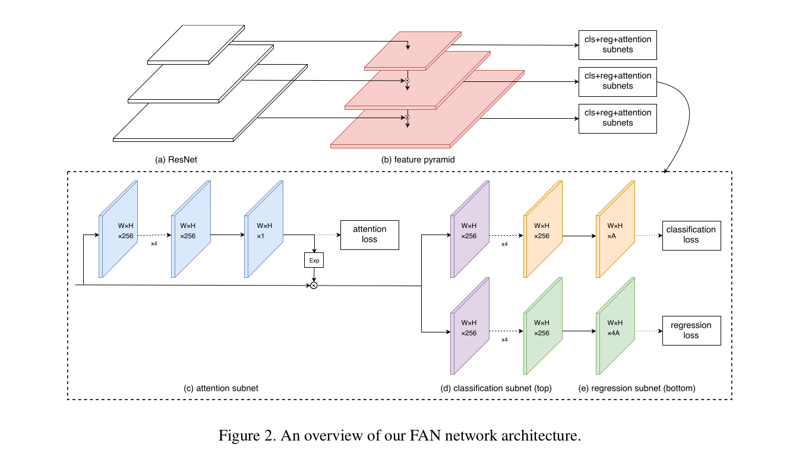
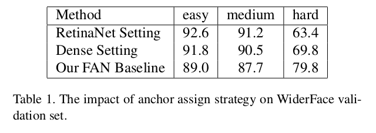
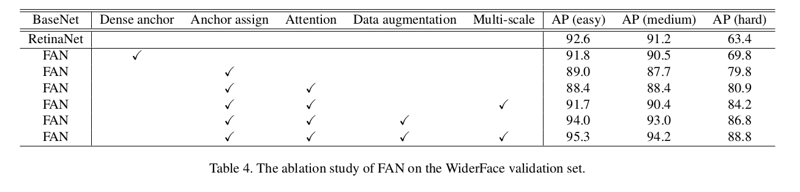

Face Attention Network: An Effective Face Detector for the Occluded Faces
=

# 1. Introduction
解决遮挡问题的困难在于存在潜在False Positive问题的风险。考虑到检测被太阳镜遮挡的面部的情况，仅人脸的下部是可用的。仅基于下部分识别人脸，在如人脸这种肤色相近的位置容易被误分。如何成功地处理遮挡问题，同时阻止False Positive问题，仍然是富有挑战的研究主题。

本文提出基于one-shot检测管道的高效人脸检测器，称为Face Attention Network（FAN），其能够很好的处理遮挡和False Positive问题。更具体地，遵循RetinaNet相似的设置，我们利用特征金字塔和网络不同层以解决不同尺度的人脸。我们的anchor设置专门设计用于人脸检测，并且引入anchor-level注意力，其为不同特征层提供不同的注意力区域。注意力基于特定的anchor热图进行有监督的训练。除此之外，如随机剪裁的数据增强被引入以生成更多的剪裁（遮挡）训练数据。

本文的贡献如下：
- 我们提出anchor-level注意力，其能够很好地处理人脸检测任务中遮挡问题。
- 基于one-shot RetinaNet探测器引入了实用的基线设置，该探测器获得了与快速计算速度相当的性能。
- 我们的FAN，其集成one-shot RetinaNet和anchor-level注意力，在流行的人脸检测基准测试（如WiderFace和MAFA，特别是MAFA的遮挡案例）上由于历史最优性能。

# 2. Related Work
# 3. Face Attention Network（FAN）
## 3.1. Base Framework
卷积神经网络在不同的特征层具有不同的语义信息和空间分辨率。浅层通常有高空间分辨率，其有利于小对象的空间定位。另一方面，深层能够获得更多的语义信息，但是空间分辨率被损害。最近的工作，如特征金字塔网络（FPN）[16]提出了分而治之的原则。U形结构以保持高空间分辨率和语义信息。不同尺度的对象被划分，并在不同特征层处理。

遵循这种设计原则，RetinaNet作为一阶段检测器，在COCO通用对象检测任务上获得最佳性能。使用ReNet为骨干的FPN能够生成丰富语义信息的金字塔层级。基于这个骨干，RetinaNet附加了两个分支：一个用于分类，而另一个用于回归。我们借助RetinaNet的主要网络结构，并将其用于人脸检测任务。

分类子网络使用四个 $3 \times 3$ 卷积层，每层有256个滤波器。接着是 $KA$ 个滤波器的 $3 \times 3$ 卷积层，其中 $K$ 为类别数， $A$ 为每个位置的anchor数。对于人脸检测， $K = 1$ ，因为我们使用sigmoid激活，而我们使用 $A = 6$ 。该子网络的所有卷积层在所有金字塔级共享参数，这与原始的RetinaNet一样。回归子网络与除了最后的卷积层输出 $4A$ 个值外，其他的与分类子网络相同。
图2给出我们的算法的概貌。注意，我们只绘制三层金字塔用于说明目的。

## 3.2. Attention Network

相较于原始的RetinaNet，我们设计了锚点设置和注意力函数。有三个设计原则：
- 在不同特征层处理不同尺度的人脸，
- 突出来自人脸区域的特征，并减小没有人脸区域的特征，
- 生成更多遮挡人脸用于训练。

### 3.2.1 Anchor Assign Strategy

FAN包含5个检测层，每层关联一个特定尺度的anchor。除此之外，四层anchor的纵横比设置为1和1.5，因为大多数正面人脸是近似正方形的，而轮廓面可以被认为是 $1:1.5$ 的矩形。此外，我们计算WiderFace上基于ground-truth人脸大小的统计量。如图3所示，超过80%的人脸的尺度在16到406个像素之间。小尺寸的人脸缺乏足够的分辨率，因此，将其纳入训练数据可能不是一个好的选择。所以，我们将anchor在金字塔层级上设置为 $16^2$ 到 $406^2$ 。我们设置锚尺度的步长为 $2^{1/3}$ ，其确保每个ground-truth边界框都有 $IoU \ge 0.6$ 的锚。具体地，锚被分配到最高IoU大于0.5的ground-truth框，如果最高IoU小于0.4，则锚被分配为背景。没有分配的锚被忽略。

### 3.2.2. Attention Function

为了处理遮挡问题，我们提出一种新颖的anchor-level注意力。具体地，我们使用如图6的类似分割的侧分支。这种注意力监督信息通过填充ground-truth框获得。同时，如图4所示，监督的热图与分配给当前层中的锚点的ground-truth相关联。这些分层注意力图可以减少它们之间的相关性。不同于传统注意力图的使用，其简单地将注意力图与特征图相乘，我们的注意力图首先馈入一个指数操作，然后将结果与特征图进行点乘。它能够保留更多的上下文信息，同时突出检测信息。考虑遮挡人脸的样例，大多数不可见的部分是无用的，并且可能对检测有害。图5给出一些注意力结果。我们的注意力掩模可以加强人脸区域的特征图，并且减小非人脸区域的特征图。

### 3.2.3 Data Augmentation
我们发现训练集（如WiderFace）中被遮挡的人脸数量是有限的，并且不能满足CNN训练。仅16%的标注人脸是被遮挡的。因此，我们提出一张随机剪裁策略，其能生成大量的遮挡人脸用于训练。更具体地，基于训练集，我们从原始图像中随机剪裁正方形patch，其范围为原始图像短边的 $[0.3, 1]$ 之间。此外，如果ground-truth框的中心在采样patch中，则保留ground-truth的重叠部分。除了随机剪裁数据集增强外，我们也采用随机翻转和颜色扰动增强。

## 3.3. Loss Function
我们采用多任务损失函数来联合优化模型参数：
$$
\begin{alignat*}{2}
L = &\sum_k\frac{1}{N_k^c} \sum_{i \in A_k} L_c(p_i, p_i^\ast) +  \\
& \lambda_1 \sum_k \frac{1}{N_k^r} \sum_{i \in A_k} I(p_i^\ast = 1) L_r(t_i, t_i^\ast) +  \\
& \lambda_2 \sum_k L_a(m_k, m_k^\ast)
\end{alignat*} \tag 1
$$
其中 $k$ 是金字塔级（$k \in [3, 7]$）中的索引， $A_k$ 表示定义在金字塔级 $P_k$ 上的anchor集合。如果锚为正，则ground-truth标签 $p_i^\ast = 1$ ； 反之， $p_i^\ast = 0$ 。$p_i$ 是模型的预测分类结果， $t_i$ 是一个向量，其表示预测边界框的4个参数化坐标， $t_i^\ast$ 是ground-truth关联的正类锚。

分类损失 $L_c(p_i, p_i^\ast)$ 为RetinaNet的focal loss。$N_k^c$ 是 $P_k$ 中参与分类损失计算的锚的数量。回归损失 $L_r(t_i, t_i^\ast)$ 为smooth L1损失 。 $I(p_i^\ast = 1)$ 为仅将回归损失限制到分配为正类的anchor的指示函数，并且 $N_k^r = \sum_{i\in A_k} I(p_i^\ast = 1)$ 。注意力损失 $L_a(m_k, m_k^\ast)$ 为逐像素sigmoid交叉熵。$m_k$ 为每个金字塔级生成的注意力图，并且 $m_k^\ast$ 为3.3.3节描述的ground-truth 。 $\lambda_1$ 和 $\lambda_2$ 用于损失项的平衡，本文设置 $\lambda_1 = \lambda_2 = 1$ 。

# 4. Experiments
我们使用ResNet-50作为基本模型。所有模型在8个GPU上以每个小批量32张图像进行训练。附加到FPN的四个卷积层使用偏差 $b=0$ 和高斯权重方差 $\sigma = 0.01$ 进行初始化。对于最终的分类子网络的卷积层，我们使用偏差 $b=\log((1-\pi)/ pi)$ （$\pi = 0.01$）进行初始化。同时，初始学习率为 $3e-3$ 。每个epoch采样10k图像。没有数据增强的模型训练30轮。使用数据增强时，模型训练130轮，其学习率在100轮和120轮时除以10 。weight decay = $1e-5$ ，momentum = 0.9 。与ground-truth边界框的$IoU \ge 0.5$ 的anchor分配到正类， $IoU < 0.4$ 的分配到背景类。

## 4.1. Datasets
### 4.1.1 Anchor setting and assign

表1为三种锚设置。对于RetinaNet设置，我们遵循RetinaNet的设置。对于我们的FAN基线，我们在金字塔等级上设置了 $16^2$ 到 $406^2$ 区域的锚点。此外，纵横比设置 1 和 1.5 。同时，受 $S^3fd$ 的启发，我们选择更多覆盖率的锚分配规则。我们每个位置使用8个锚点，跨越4个尺度（间隔仍然固定为 $2^{1/3}$ 使得面积为 $8^2$ 到 $645^2$ ）和2个比例 $1,1.5$ 。对于密集设置，除了从 $8^2$ 到 $645 ^ 2$ 的更密集的尺度外，它的设置与FAN基线一样。各种不同的设置结果如表1 。

### 4.1.2 Attention mechanism

### 4.1.3 Data augmentation

### 4.1.4 WiderFace Dataset

多尺度（600、 800、 1000、 1200、 1400）测试，与历史最佳结果的比较如表5 。
