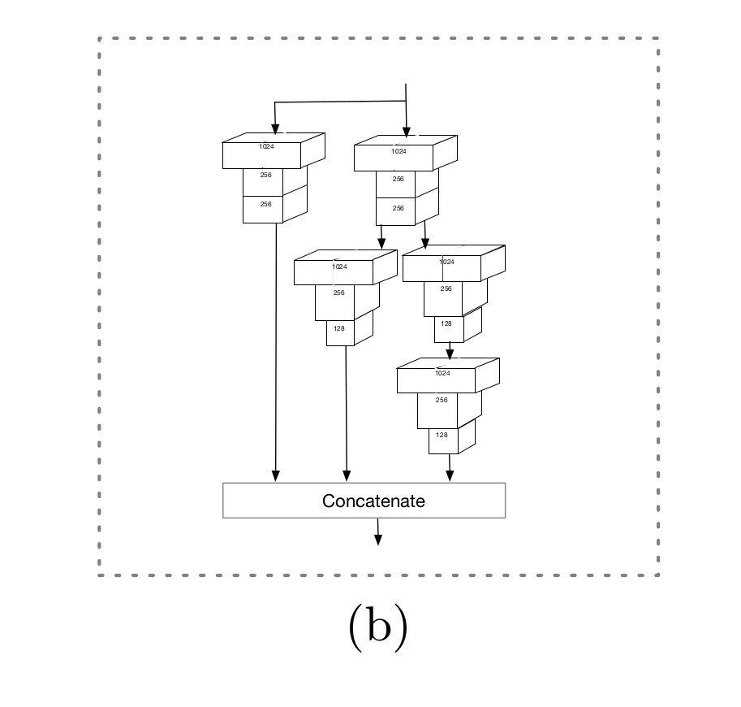

PyramidBox: A Context-assisted Single Shot Face Detector
=
# 1. Introduction
尽管如SSH、 $S^3FD$ 、Face R-FCN和FAN等的工作给出类设计锚和相关用于检测不同尺度人脸的网络的有效方式，但是如何使用人脸检测中的上下文信息没有受到足够的关注，它应该在检测困难人脸的过程起着重要的作用。实际上，人脸不会单独出现在真实世界中，通常有肩膀或身体，这提供了一个可以利用的丰富的上下文源，特别是当人脸上下文不能区分低分辨率、模糊和遮挡的人脸时。我通过引入一个新颖的关联上下文网络的框架，以在后面的步骤中充分利用上下文信号。

第一，网络不仅能学习人脸特征，还要能学习如头和身体的上下文部分。为了达到这个目的，需要额外的标签，以及设计匹配这些部分的锚。本文中，我们提出一种半监督解决方案来为关联人脸的上下文部分生成近似标签，以及发明了一系列名为PyramidAnchors的锚以很容易地添加到基于锚的一般架构中。

第二，高层上下文特征应当与低层特征以恰当的方式结合。困难和容易人脸的外观可能轻微地不同，其隐含着并非所有的高层语义特征真地有助于更小的目标。我们研究FPN的性能，并修改 _Low-level Feature Pyramid Network(LFPN)_ 以将有用的特征相互联合在一起。

第三，预测分支网络应该充分利用联合特征。我们引入 _Context-sensitive prediction module(CPM)_ 以处理目更宽且更深网络中目标人脸周围的上下文信息。同时，我们为预测模块提出max-in-out层以进一步提升分类网络的能力。

此外，我们提出一种叫 _Data-anchor-sampling_ 的训练策略以对训练数据集的分布作出调整。为了学习更具代表性的特征，硬集（hard-set）样本的多样性很重要，并可以通过样本间的数据增加来获得。

为清楚起见，这项工作的主要贡献可归纳为五个方面：  
1. 我们提出了一种基于锚的上下文辅助方法（称为PyramidAnchors）以在学习小、模糊和部分遮挡人脸的上下文特征上引入监督信息；

2. 我们设计低层特征金字塔（LFPN）以更好地融合上下文特征和人脸特征。同时，所提出的方法可以在单发中很好地处理不同尺度的人脸；

3. 我们引入上下文敏感（context-sensitive）预测模块，它由混合网络结构和max-in-out层组成，用于从合并的特征中学习准确的位置和分类;

4. 我们提出尺度感知的Data-anchor-sampling策略以改变训练样本的分布，从而强调更小的人脸；

5. 我们在常用人脸检测基准FDDB和WIDER FACE上获得比历史最佳的人脸检测器更优的结果。

# 3 PyramidBox
## 3.1 Network Architecture
当在不同特征层进行预测时，具有复杂锚设计的基于锚的对象检测框架有效的处理不同尺度的人脸。同时，FPN结构表明增强了高层特征和低层特征的融合。PyramidBox的架构（图1）使用与 $S^3FD$ 相同扩展的VGG16骨干和锚尺度设计，其能够在不同层生成特征图和等比例间隔锚。在该主干上添加低级FPN，并且将来自每个金字塔检测层的上下文敏感预测模块用作分支网络以获得最终输出。关键是我们设计一种新颖的金字塔锚方法，其为不同层级的每个人脸生成一系列锚。在这个架构中的每个部分的详细设计如下：

- **Scale-equitable Backbone Layers.** 我们使用基本的卷积层和 $S^3FD$ 中额外的卷积层作为骨干层，它保留了VGG16从 _conv1_1_ 到 _pool5_ 的层，然后将VGG16的 _fc6_ 和 _fc7_ 转换为 _conv_fc_ 层，然后添加更多的卷积层以使其变得更深。

- **Low-level Feature Pyramid Layers.** 为了提高人脸检测器处理不同尺度人脸的性能，具有高分辨率的低层特征起着关键作用。因此，许多历史最优方法的工作在相同的框架下构架了不同的结构来检测变化尺寸的人脸，其中高层特征设计用于检测大型人脸，而低层特征检测小型人脸。为了将高层语义特征集成到更高分辨率的低层，FPN提出top-down架构以在所有尺度使用高层语义特征图。最近，FPN风格的框架在对象检测和人脸检测上都获得极大的性能。

据我们所知，所有构建FPN的工作都是从顶（top）层开始，这应该认为并非所有的高层特征都对检测小型人脸有帮助。首先，相对大型、清晰和完整的人脸，小型、模糊和遮挡的人脸有不同的纹理特征，所以直接使用所有高层特征来加强检测小型人脸的性能是粗鲁的。其次，高层特征从具有少量上下文的区域提取，并且可能引入噪声信息，例如，在我们的PyramidBox中，顶部两层 $conv7_2$ 和 $conv6_2$ 的感受野为724和468 ，注意，输入图像的大小是640，这意味着顶部两层包含大尺寸人脸的少量上下文特征，因此对检测中型和小型人脸没有帮助。

作为替代方法，我们构建 _Low-level Feature Pyramid Network(LFPN)_ ，其从中间层（而不是顶层）开始一个top-down结构，它的感受野可以接近输入大小的一半。此外，LFPN的每个块的结构与FPN一样，如图2（a）。

**Pyramid Detection Layers** 我们选择 _lfpn_2_、_lfpn_1_、_lfpn_0_、_conv_fc7_、_conv6_2_ 和 _conv7_2_ 作为检测层，其锚的大小分别为16、32、64、128、256 和512 。这里 _lfpn_2_、_lfpn_1_、_lfpn_0_ 分别是基于 _conv3_3_、 _conv4_3_ 和 _conv5_3_ 的输出层。此外，与其他的SSD风格方法相似，我们使用L2规范化来缩放LFPN层的范数。

**Predict Layers.** 每个检测层位于 _Context-sensitive Predict Module(CPM)_ 之后。注意，CPM的输出用于监督金字塔锚，其近似覆盖人脸、头部和身体区域。第 $l$ 个CPM的输出大小为 $w_l \times h_l \times c_l$ ，其中 $w_l=h_l=640 / 2^{2+l}$ 是相应的特征尺寸，并且对于 $l = 0,1,\cdots, 5$通道大小 $c_l$等于2。这里，特征的每个通道用于人脸、头部以及身体的分类和回归，其中人脸分类需要4（$=cp_l + cn_l$）个通道，其中 $cp_l$ 和 $cn_l$ 分别为前景的max-in-out和背景标签，满足
$$cp_l = \begin{cases} 1, & \mbox{ if } l = 0,  \\3, & \mbox{ otherwise} \end{cases}$$
此外，头部和身体的分类需要两个通道，同时每个人脸、头部和身体需要四个通道用于定位。

**PyramidBox loss layers.** 对于每个目标人脸，我们通过一系列的金字塔锚以同时监督分类和回归任务（见3.3节）。我们设计 _PyramidBox Loss_ （见3.4节），其使用softmax损失进行分类，smooth L1损失进行回归。

## 3.2 Context-sensitive Predict Module
**Predict Module.** 在最初的基于锚的检测器中，例如SSD和YOLO，目标函数直接用于被选择的特征图。如MS-CNN提出的，扩大每个任务的子网络可以提高准确率。最近，SSH通过放置一个更宽的卷积预测模块到具有不同歩幅的层的顶部来增加感受野，而DSSD给每个预测模块添加残差块。实际上，实际上，SSH和DSSD都使预测模块分别更深和更宽，以便预测模块获得更好的分类和定位特征。

受Inception-ResNet启发，很明显，我们可以联合使用更宽、更深的网络。我们设计 _Context-sensitive Predict Module(CPM)_ （见图2（b）），其中我们将SSH中上下文模块的卷积层替换为DSSD的残差预测模块。这将使我们的CPM能够获得DSSD模块方法的所有好处，同时保留来自SSH上下文模块的丰富上下文信息。

**Max-in-out.** Maxout的概念由Goodfellow在《Maxout Network》中首次提出。最近，$S^3FD$ 使用max-out背景标签以减小小型负类的false positive率。本文中，我们在正类和负类样本上都是用这种策略。称之为max-in-out，见图2（c）。首先每个预测模块预测 $c_p + c_n$ 个得分，然后选择最大的 $c_p$ 作为正类得分，由于小锚有更复杂的背景，所有我们为第一个预测模块设置 $c_p = 1$ ， $c_n=3$ ，为其他预测模块设置 $c_p = 3$ 和 $c_n = 1$ 以召回更多的人脸。

## 3.3 Context-reinforced PyramidAnchors
最近，基于锚的对象检测器和人脸检测器取得了显著的进步。已经证明，每个尺度的平衡锚对于检测小面很重要[20]（$S^3FD$）。但是，它仍然忽略每个尺度的上下文特征，因为锚全部为人脸区域设计。为了处理这个问题，我们提出一种新颖的替代锚方法，称为 _PyramidAnchors_ 。

PyramidAnchors会生成一系列锚点，这些锚点对应于与脸部相关的较大区域，这些区域包含更多的上下文信息，例如头部、肩部和身体。我们通过将区域大小与锚点大小相匹配来选择层以设置此类锚点，这将监督更高级别的层以学习更低级别尺度人脸的更多可表示特征。给定头部、肩部或身体的标签，我们能够准确地将锚匹配到ground-truth以生成损失。由于添加额外标签是不公平的，我们在假设与人脸具有相同比例和偏移的区域拥有相似的上下文特征的情况下，以半监督的方式实现它。即，我们能够使用均匀的边界框集合来近似头部、肩部和身体的实际区域，只要这些框中的特征在不同人脸之间是相似的。对于原始图像中定位在 $region_{target}$ 的人脸，考虑 $anchor_{i,j}$ （代表在步长为 $s_i$ 的第 $i$ 个特征层的第 $j$ 个锚），我们定义第 $k$ 个金字塔锚（pyramid-anchor）为
$$
label_k(anchor_{i,j}) =
\begin{cases}
1, & \mbox{ if } iou(anchor_{i, j} \cdot s_i / s_{pa}^k, region_{target}) > threshold ,  \\
0, & \mbox{ otherwise},
\end{cases}  \tag 1
$$
其中 $k=0,1,\cdots,K$ ， $s_{pa}$ 为金字塔锚的步长， $anchor_{i, j} \cdot s_i$ 表示 $anchor_{i,j}$ 为在原始图像中对应的区域，$anchor_{i, j} \cdot s_i / s_{pa}^k$ 表示与歩幅 $s_{pa}$ 对应的下采样区域， $threshold$ 为与其他基于锚的检测器相似的阈值。

在我们的实验中，我们设置超参数 $s_{pa} = 2$ ，因为相邻预测模块的歩幅为2 。进一步地，令 $threshold = 0.35$ ， $K = 2$ 。然后 $label_0$ 、 $label_1$ 和 $label_2$ 分别是人脸、头部和身体的标签。可以看出，一个人脸将在三个连续预测模块中生成3个目标，这三个连续预测模块表示人脸本身、对应于面部的头部和身体。 图3显示了一个例子。

得益于PyramidBox，我们的人脸检测器可以更好地处理小型、模糊和部分遮挡人脸。注意，金字塔锚是自动生成的，而不需任何额外的标签，并且这种半监督学习有助于PyramidAnchors提取近似的上下文特征。在预测过程中，我们仅使用人脸分支的输出，因此，相比于标准的基于锚的人脸检测器，不会增加运行时的计算成本。

## 3.4 Training
**Training dataset.** 我们使用WIDER FACE的12880张图像训练PyramidBox，并使用颜色扭曲、随机裁剪和水平翻转。

**Data-anchor-sampling** 数据采样是统计学、机器学习和模式识别的经典主题，在最近几年获得极大提高。对于对象检测，Focal Loss通过重塑标准的交叉熵损失来处理类不平衡问题。

这里，我们使用称为Data-anchor-sampling的数据增强采样方法。简而言之，简而言之，data-anchor-sampling通过将该图像中随机的人脸重塑为随机的较小的锚点大小来调整训练图像的大小。具体地，首先，在样本中，随机地选择大小为 $s_{face}$ 的人脸，如前面提到的，我们的PyramidBox中的锚的尺度为
$$s_i = 2^{4+i}, \mbox{ for } i = 0, 1, \cdots 5,$$
令
$$i_{anchor} = \arg \min_i abs(s_{anchor_i} - s_{face})$$  
为与选择的人脸最近的锚尺度的索引。然后，我们在集合 $\{0, 1, \cdots, \max(5, i_{anchor + i})\}$ 中选择一个随机索引 $i_{target}$ 。最后，我们将大小为 $s_{face}$ 的人脸的大小调整为
$$s_{target} = random(s_{i_{target}} / 2, s_{i_{target}} \ast 2)$$
因此，我们得到图像的调整尺度
$$s^\ast = s_{target} / s_{face}$$

通过使用尺度 $s^\ast$ 调整原始图像的大小并随机裁剪包含所选人脸的标准尺寸600×600 的子图，我们获得了anchor-sampled训练数据。**例如，首先，随机选择一个人脸，假设他的大小为140，且与它最接近的锚的大小为128。接着，我们需要从16、32、64、128 和 256 中选择一个目标大小，假设我们选择了32 。然后，我们使用尺度 $32/140 = 0.2285$ 调整原始图像。最后，通过从最后调整的图像上裁剪包含选中人脸的子图，便得到采样训练数据。**

如图4所示，data-anchor-sampling改变了训练数据的分布：1）小脸的比例比大脸大；2）通过较大的样本生成较小的人脸样本，以增加较小尺度的面部样本的多样性。

**PyramidBox loss.** 作为[13]中多框（multi-box）损失的推广，我们采用PyramidBox Loss函数将图像定义为
$$L(\{p_{k, i}\}, \{t_{k, i}\})=\sum_k \lambda_k L_k(\{p_{k, i}\}, \{t_{k, i}\}) \tag 2$$
其中第 $k$ 个pyramid-anchor损失为
$$
\begin{alignat}{2}
L_k(\{p_{k, i}\}, \{t_{k, i}\}) = & \frac{\lambda}{N_{k, cls}} \sum_{i_k}L_{k,cls}(p_{k,i}, p_{k,i}^\ast) \\
& + \frac{1}{N_{k,reg}}\sum_{i_k}p_{k,i}^\ast L_{k,reg}(t_{k,i}, t_{k,i}^\ast)
\end{alignat}  \tag 3
$$
这里， $k$ 是金字塔锚的索引（$k=0,1,2$ 分布表示人脸、头部和身体），$i$ 为锚的索引， $p_{k,i}$ 为锚 $i$ 为第 $k$ 个对象（人脸、头部和身体）的概率。ground-truth标签定义为
$$
p_{k,i}^\ast =
\begin{cases}
1, & \mbox{ if the anchor down-sampled by stride }  s_{pa}^k \mbox{ is positive}  \\
0, & \mbox{ otherwise}
\end{cases} \tag 4
$$
例如，当 $k=0$ 时，ground-truth标签等于Fast RCNN中的标签，否则，当 $k\ge1$ 时，可以通过在down-sampled锚和ground-truth人脸之间进行匹配来确定相应的标签。此外，$t_{k,i}$ 是表示预测边界框的4个参数化坐标， $t_{k,i}^\ast$ 是与正类锚相关的ground-truth边界框，我们定义为
$$t_{k,i}^\ast=(t_x^\ast - \frac{1-2^k}{2} t_w^\ast, t_y^\ast - \frac{1-2^k}{2}t_h^\ast, 2^k t_w^\ast, 2^kt_h^\ast)  \tag 5$$
这是Fast R-CNN的自然推广。分类损失 $L_{k,cls}$ 是两个类（face vs. not face）上的对数损失，回归损失 $L_{k,reg}$ 是smooth $L_1$ 损失。 $p_{k,i}^\ast L_{k,reg}$ 为仅在正类锚处的回归损失。这两项使用 $N_{k, cls}$ 、$N_{k,reg}$ 规范化，平衡权重为 $\lambda$ 和 $\lambda_k$ （$k=0,1,2$） 。

**Optimization.** 对于参数初始化，我们的PyramidBox使用VGG6预训练的参数。_conv_fc6_ 和 _conv_fc7_ 的参数通过来自VGG16的 _fc_6_ 和 _fc_7_ 的子采样参数初始化，而其他附加层在[35]中用“xavier”随机初始化。前80k迭代中学习率为 $10^{-3}$ ，接下来20k迭代中学习率为 $10^{-4}$ ，最后20k 迭代中学习率为 $10^{-5}$ 。使用WIDER FACE训练集训练，批大小为16 。momentum=0.9，weight decay=0.0005 。

# 4 Experiments
## 4.1 Model Analysis

**Baseline** ：使用 $S^3FD$ 为基线。

