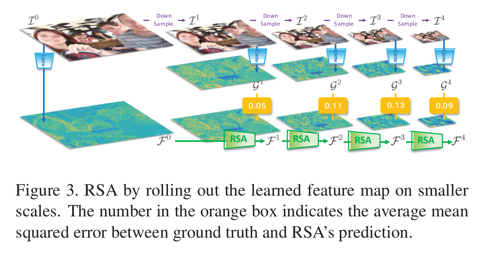

Recurrent Scale Approximation for Object Detection in CNN
=

# 1 Introduction
在检测中需要处理形状、位置和尺度引起的变化。由于卷积和池化的不变性，CNN能够很好地处理形状变化。位置变化可以通过滑动窗口自然地解决，滑动窗口可以以全卷积的方式有效地并入CNN。然而，CNN本身没有处理尺度变化的固有机制。

尺度问题常通过两种方式处理：单尺度检测器的多发（multi-shot）处理和多尺度检测器的单发（single-shot）处理。图1（a）就是第一种方式，首先将输入图像调整到不同的尺度，然后多次独立地检测这些调整后的图像。只要尺度的采样足够密集，这种模型可以具有最高的召回率，但是它们的计算成本很高，并且假阳性高。图1（b）是第二种方式，仅需馈入图像一次，然后直接回归多尺度对象。这种方案将尺度变化视为一个黑盒模型。尽管更多参数和更复杂的结构可以提升性能，但是直接回归仍然在实时应用上存在局限，因为人脸的尺寸是在 $20 \times 20$ 到 $1920 \times 1080$ 之间变化。

为此，我们设计优雅检测系统的理念是，我们只计算一次特征金字塔，只有通过该金字塔才能在其他尺度上近似其余特征金字塔，如图1（c）。使用循环尺度近似（RSA）单元来达到上述目标，RSA单元设计用于插入网络中的某些特定深度，并以最大尺度提供初始特征图。该单元以循环方式对输入进行卷积，以生成特征图的预测，该预测是输入的一半大小。这样的方案可以仅在一个尺度上为网络提供输入，并通过可学习的RSA单元在较小尺度上近似其余特征 - 考虑效率和准确性的平衡。

我们提出了另外两种方案来进一步节省计算预算并提高RSA框架下的检测性能。_第一种是尺度预测网络，用于全局预测新图像的潜在尺度，我们基于预测计算特定尺度的特征金字塔。_ 图像中只出现少量对象，因此大多数特征金字塔对应于背景，如果计算了所有级别的特征图，则表明存在冗余。_第二中是landmark回溯网络，用于回溯先前层中的回归landmark的位置，并基于landmark特征集生成每个地标的置信度得分。_ 最终，LRN网络修改了识别锚内的人脸的最终得分。

网络的架构如图2 。

贡献：
1. 使用便携式循环单元（RSA）证明了图像的深度CNN特征可以从不同的尺度近似，这充分利用了效率和准确性。
2. 提出了一个尺度预测网络来预测输入的有效尺度，这进一步加速了检测流水线。
3. 设计了一个标志（landmark）回溯网络，以利用标志信息来提高人脸检测的准确性。

# 2 Related work
**Multi-shot by single-scale detector.** 单尺度检测在一个特定尺度检测目标，而不能处理其他尺度的特征。因此制定了图像金字塔，并且金字塔中的每个级别被馈送到检测器中。这样的框架出现在前深度学习时代[3,9]，并且通常涉及手工制作的特征，例如HOG [5]或SIFT [24]，以及像Adaboost [30]这样的分类器，以验证是否在每个尺度的上下文中都包含一个目标对象。一些CNN方法也这样处理[16, 28] 。

**Single-shot by multi-scale detector.** 多尺度检测器使用图像一次，并生成所有尺度的检测结果。RPN [27]和YOLO [26]具有固定的输入尺度大小，并且通过使用多个分类器在最终层中生成所有尺度的提议。SSD通过来自不同尺度特征图的多层预测的组合解决问题。其他一些工作（《Zoom out-and-in network with recursive training for object proposal》和FPN）提出使用conv/deconv融合生层和浅层特征，并合并来自不同尺度的对象框。这些方法通常比单一尺度探测器更快，因为它只需要使用一次图像，但是大规模的不变性必须通过昂贵的特征分类器来学习，这种分类器是不稳定和繁重的。

**Face detection.**
《Supervised transformer network for efficient face detection》提出了一种有监督的空间变换层来利用landmark信息，从而大大提高了探测器的质量。

# 3 Our Algorithm
## 3.1 Scale-forecast Network
图2（a）是提出的尺度预测网络，其预测给定固定大小的输入图像中的人脸测尺度。该网络是ResNet-18的半通道版本，最后有一个全局池化。该网络的输出是一个 $B$ 维概率向量，其中 $B = 60$ 是预定义的尺度数量。令 $\cal{B} = \{0, 1, ,\cdots, B\}$ 表示尺度集合，在被调整大小的图像的上下文中定义从人脸大小 $x$ 到更长维度2048的映射， $\cal{B}$ 中的索引 $b$ 为：
$$b = 10(\log_2 x - 5)  \tag 1$$
例如，如果人脸的大小为64，其对应的索引 $b=10$ 。在被送入网络之前，首先调整图像的大小，其中较长的维度等于224.在训练期间，尺度预测网络的损失是二元多类交叉熵损失：
$$\cal{F}^{SF} = -\frac{1}{B} \sum_b p_b\log \hat{p}_b + (1 - p_b)\log(1 - \hat{p}_b)  \tag 2$$
其中 $p_b$ 和 $\hat{p}_b$ 分别是ground truth标签和预测的第 $b$ 个尺度。注意，一个发生（occuring）尺度 $b\ast(p_b\ast = 1)$ 的相邻尺度 $b_i$ 的ground-truth标签不为零，并且定义为高斯采样得分：
$$p_{b_i} = Gaussian(b_i, \mu, \sigma), b_i \in \Bbb{N}(b\ast)$$
其中， $\mu,\sigma$ 是高斯分别的超参数， $\Bbb{N}(\cdot)$ 表示其邻域集合。本文使用 $\pm 2$ 作为邻域大小，设置 $\mu,\sigma$ 分别为 $b\ast, 1/\sqrt{2\pi}$ 。这种实践可以减轻发生尺度（1）和非发生尺度（0）之间的离散分布中的特征学习的难度。

对于推力，我们使用高斯混合模型来确定局部最大值，从而确定潜在的发生尺度。给定观测值 $x$ 并用 $\theta$ 参数化，可以将分布分解为 $K$ 个混合分量：
$$p(\theta | x) = \sum_{i=1}^K \phi_i \cal{N}(\mu_i, \sum_i)  \tag 4$$
其中第 $i$ 个分量被权重为 $\phi_i$ 、均值为 $\mu_i$ 以及协方差矩阵为 $\sum_i$ 的高斯分布特征化。这里使用 $K = \{1, 2, ..., 6\}$ 表示选择的从 $2^5$ 到 $2^11$ 的6个主要尺度的尺度数量，并且尺度的选择取决于每个分量的阈值 $\phi_i$ 。最终，使用具有特定 $K$ 的最佳拟合模型。

## 3.2 Recurrent Scale Approximation(RSA) Unit
设计循环尺度近似（RSA）单元以在给定最大尺度的特征图的情况下，在较小尺度上预测特征图。图2描述了RSA单元。网络架构遵循类似的残差网络构建[13]，其中将每个卷积层中的通道数量减少到原始版本的一半，以利用时间效率。给定输入图像 $\cal{I}$ ，用 $\cal{I}^m$ 表示按比例 $1/2^m$ 下采样图像的结果，其中 $m\in\{0, ..., M\}$ ，并且 $M = 5$ 。注意 $\cal{I}^0$ 是原始图像。因此，总共有6个尺度，对应尺度预测网络中定义的6个主要尺度范围。给定输入图像 $\cal{I}^m$ ，定义 $res2b$ 的输出特征图为：
$$f(\cal{I}^m) = \cal{G}^m  \tag 5$$
其中 $f(\cdot)$ 表示从输入图像到输出特征图的共计8种步长的卷积集合。不同尺度上的特征图 $\cal{G}^m$ 用作循环单元的ground-truth监督。

RSA模块 $RSA(\cdot)$ 首先将最大尺度特征图 $\cal{g}^0$ 作为输入，并且重复地输出特征图，该特征图的大小是输入特征图的一半：
$$
h^{(0)} = \cal{F}^0 = \cal{G}^0   \\
h^{(m)} = RSA(h^{(m-1)}|w) = \cal{F}^m   \tag 6
$$
其中 $\cal{F}^m$ 是滚动 $m$ 次后的结果图，$w$ 是RSA单元中的权重。RSA模块共有四个卷积，它们的步长为 $(1, 2, 1, 1)$ ，并且核大小是 $(1, 3, 3, 1)$ 。损失函数是所有尺度上预测 $\cal{F}^m$ 和监督 $\cal{G}^m$ 之间的 $l_2$ 范数：
$$\cal{F}^{RSA} = \frac{1}{M}\sum_{m=1}^M \left||\cal{F}^m - \cal{G}^m\right||^2  \tag 7$$
RSA单元中的梯度计算为：
$$
\begin{align}
\frac{\partial \cal{L}^{RSA}}{\partial w_{xy}} = \sum_m \frac{\partial \cal{L}^{RSA}}{\partial h^{m}}\cdot \frac{\partial h^{(m)}}{\partial w_{xy}}  \\
= \frac{1}{M} \sum_m(\cal{F}^m - \cal{G}^m) \cdot \cal{F}_{xy}^{m-1}
\end{align}  \\ \tag 8
$$
其中 $x, y$ 是特征图中的空间索引。

RSA单元背后的本质是导出映射 $RSA(\cdot) \rightarrow f(\cdot)$ 以基于当前特征图不断地预测较低尺度的特征，而不是多次转发具有不同规模输入的网络。不严格地数学表达为：
$$\lim_{0\rightarrow m} RSA(h^{(m-1)}) = f(\cal{I}^m) = \cal{G}^m$$
其表明RSA的函数性：从最大标度0的输入到其所需的水平 $m$ 的 $f(\cdot)$ 近似值。生成特征图 $\cal{F}^m$ 的计算成本比通过调整图像，并传图网络（即 $f(\cal{I}^m)$ ，它从conv1到res2b）要少得多。

在推理阶段，首先由尺度预测网络预测的输入的可能尺度。然后，相应地调整图像的大小，使得最小尺度（对应于最大特征图）被调整到 $[64,128]$ 的范围。因此，通过式（6），RSA单元的输出预测其他尺度上的特征图。图3描绘了RSA的推出版本，用于预测与ground-truth相比较小尺度的特征图。可以从每个级别的错误率和预测的特征图中观察到RSA能够在较小的尺度上近似特征图。

## 3.3 Landmark Retracing Network
在人脸检测任务中，如图2所示，landmark回溯网络（LRN）被设计为通过学习每个回归landmark的个体置信度来调整识别人脸的置信度和处置假阳性。我们不是直接使用landmark的ground-truth位置，而是根据最终RPN层中landmark的回归输出来制定landmark的特征学习。

具体来说，给定RSA特定尺度的特征图 $\cal F$（为简洁起见为 $m$ ），首先将其输入res3a层。输出有两个分支：一个是landmark特征集 $\cal P$ 用于空间上下文中每个landmark的个体得分。集合中通道数等于landmark的数量。另一个分支是一个标准的RPN管道（res3b-3c），它在最后的RPN层中生成anchor集合。令 $p_i = [p_{i0}, p_{i1}, \cdots, p_{ik}, \cdots]$ 表示最后的RPN层的分类概率，其中 $k$ 是类索引， $i$ 是特征图中的空间位置索引； $t_{ij}$ 表示第 $i$ 个anchor中的第 $j$ 个landmark，其中 $j = \{1, 2, ..., 5\}$ 是landmark索引。注意，在人脸检测任务中，仅有一个anchor，因此 $p_i$ 包含一个元素。在传统的detection-to-landmark形式中，优化下面的损失（由分类和回归组成）：
$$\sum_i -\log p_{ik^\ast} + \delta(k^\ast) \cal{S}(t_i - t_i^\ast)$$
其中 $\delta(\cdot)$ 是指示函数； $k^\ast$ 表示anchor $i$ 的正确标签（本文中仅有两个类别，0为背景，1为正类）； $t_i^\ast$ 是ground-truth回归目标， $\cal{S}(\cdot)$ 是smooth $l_1$ 损失。

然而，如表2（c）所示，单独使用anchor $p_{ik^\ast}$ 的置信度会在某些尺度产生False positive ，这促使使用基于回归输出的landmark特征。修订后的分类输出 $p_{ik^\ast}^{trace}(t_{ij})$ 同时考虑最后的RPN层中的特征和landmark特征集中的特征：
$$
p_{ik^\ast}^{trace}(t_{ij}) =
\begin{cases}
p_{i0}, & k^\ast = 0  \\
\mbox{max_pool}(p_{i1}, p_{ij}^{land}), & k^\ast = 1
\end{cases}  \tag 9
$$
其中 $p_{ij}^{land}$ 是landmark特征集 $\cal{P}$ 中点 $j$ 的分类输出，并且它由回归输出确定：
$$p_{ij}^{land} = \cal{P}(r(t_{ij})),  \tag {10} $$
其中 $r(\cdot)$ 代表特征图 $\cal{P}$ 中从回归目标到空间位置的映射。最后，landmark retracing network的修正损失为：
$$\cal{L}^{LRN} = \sum_i\left[-\log p_{ik^\ast}^{trace}(t_{ij}) + \delta(k^\ast \sum_j \cal{S}(t_{ij} - t_{ij}^\ast))\right]  \tag {11}$$
除了之前的工作所采用的detection-to-landmark设计之外，retracing网络还充分利用了lanmark的特征集来帮助纠正识别人脸的置信度。这是通过利用回归输出 $t_{ij}$ 来找到前一特征图 $\cal{P}$ 上的每个landmark的个体得分来实现的。

请注意，landmark retracing网络采用先前所述的RSA单元进行端到端的培训。每个位置 $i$ 关联的anchor是一个正方形边界框，并且有固定的大小 $64\sqrt2$ 。仅当anchor是正样本时，landmark retracing才执行。anchor对应的基本landmark位置由训练集中所有脸的平均位置确定。在测试期间，LRN馈入不同尺度的特征图，并单独地对待每个尺度。最终的检测在NMS后生成。

## 3.4 Discussion
**Comparison to RPN.** 区域提议网络（RPN）使用预定义的不同大小的anchor作为输入，并且进行类似的检测管道。RPN中的锚点大小不同，以满足多尺度训练约束。在一次更新迭代期间，它必须从网络的开始到最末端提供不同大小（尺度）的整个图像。本文中，调整图像一次，以确保至少有一个人脸尺寸落入 $[64, 128]$ ，从而迫使网络以某个尺度范围进行训练。多尺度通过RSA单元嵌入，直接预测更小尺度上的特征图。这样的方案显著节省参数，并能够视为“semi”（半）多尺度训练和“fully”多尺度测试。

**Prediction-supervised or GT-supervised in landmark feature set.** 本文框架中的另一个评论是用于训练landmark特征 $\cal P$ 的监督知识。特征使用回归目标 $t_{ij}$ 预测输出学习，而不是ground-truth 目标 $t_{ij}^\ast$ 。在初步试验中，如果 $p_i^{land} \sim t_i^\ast$ ，由于 $t_{ij}$ 的误导性回归输出，可能会严重禁止landmark特征中的激活；如果放宽学习限制，并容忍误导位置的某个范围的激活，即 $p_i^{land} \sim t_i$ ，性能可以在极大范围得到提升。使用回归预测作为landmark特征学习的监督是有道理的，因为：（a）我们关心每个位置的激活（分类概率），而不是每个准确的位置；（b） $t_i$ 和 $p_i^{land}$ 共享相似的学习流程，因此 $t_i$ 的位置能更好地匹配 $\cal P$ 中 $p_i^{land}$ 的激活。

# 4 Experiments
## 4.1 Setup and Implementation Details
我们首先训练尺度预测网络，然后使用预测尺度的输出来启动RSA单元和LRN。注意，整个网络（RSA+LRN）都是端到端训练，并且模型是从头训练的，并非预训练（因为通道数减半）。平衡正负之比为 $1:1$ 。batch size = 4 ，基学习率为 0.001 ，每10000次迭代时减少6% 。共训练1000000 。
