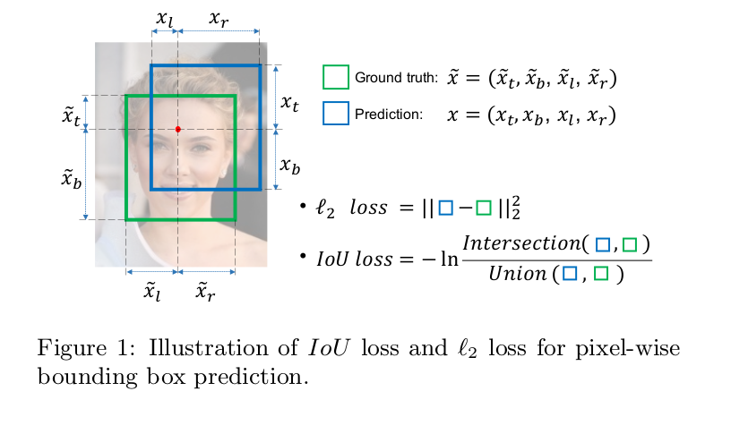
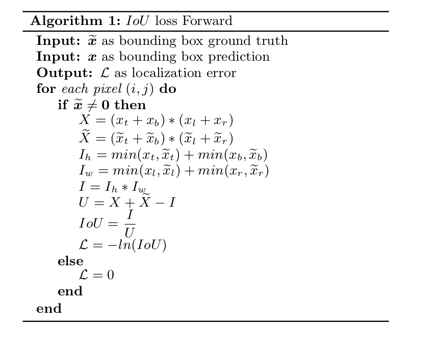
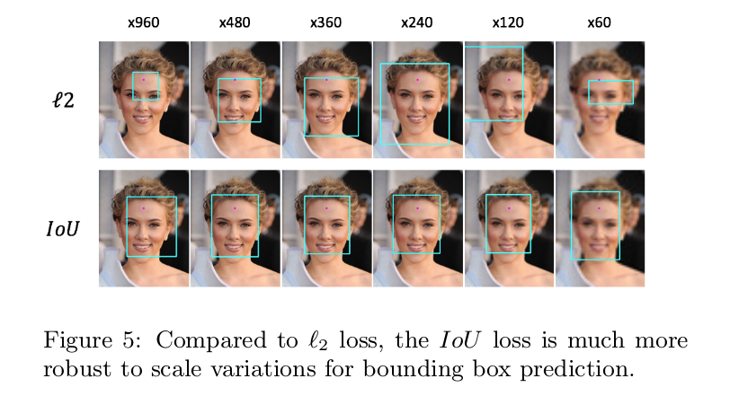
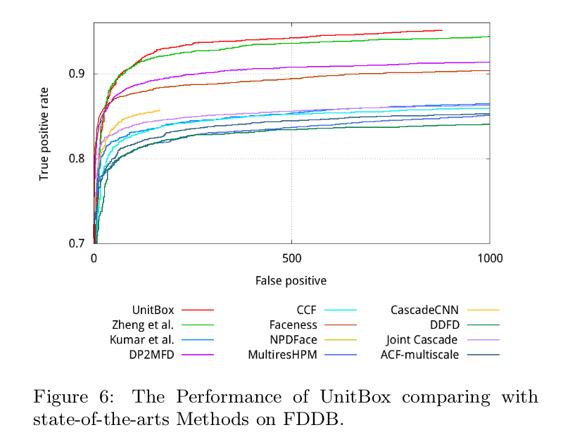

UnitBox: An Advanced Object Detection Network
=

# 1. Introduction
这里省略对基于区域方法的介绍。

DenseBox利用特征图的每个像素来回归一个 4-D 距离向量（当前像素与包含该像素的对象候选的四边的距离）。然而，DenseBox 使用简单的 $l_2$ 损失，将四条边的距离优化为四个独立的变量， 如图1所示。这与变量相关并且应该联合回归的直觉背道而驰。

此外，为了平衡不同尺度的边界框，DenseBox 需要将训练图像块调整到固定尺度。因此，DenseBox 在图像金字塔上执行检测，其不能避免框架效率的影响。本文提出了一种高效的基于CNN的物体检测网络，称为UnitBox。它采用全卷积网络架构，以直接预测特征图上的对象边界和分类得分。特别地，UnitBox使用IoU损失函数进行边界框预测。IoU损失直接强制预测边界框与地面实况之间的最大重叠，并将所有边界变量共同回归为整个单元（参见图1）。UnitBox不仅展示了更精确的边界框预测，还展示了更快的收敛速度。它意味着能够以任意形状和尺度对象定位，并且只需一次通过单一尺度即可执行更有效的测试。

# 2. IoU Loss Layer
在引入UnitBox之前，我们首先介绍所提出的IoU损失层，并在本节中与广泛使用的 $l2$ 损失进行比较。在这里声明了一些重要的符号：对于图像中的每个像素 $(i, j)$ ，ground-truth边界框可以定义为 4 维向量：
$$\tilde{x}_{i,j} = (\tilde{x}_{t_{i,j}}, \tilde{x}_{b_{i,j}}, \tilde{x}_{l_{i,j}}, \tilde{x}_{r_{i,j}}) \tag 1$$
其中 $\tilde{x}_{t}, \tilde{x}_{b}, \tilde{x}_{l}, \tilde{x}_{r}$ 分别表示当前像素为 $(i, j)$ 与顶边、底边、左边界和右边界之间的距离。为了简单期间，我们在论文的余下部分中，省略下表 $i,j$ 。因此，预测边界框定义为 $x = (x_t, x_b, x_l, x_r)$ ，如图1所示。

## 2.1 L2 Loss Layer
$l_2$ 损失在优化中广泛使用。$l_2$ 损失也用于通过CNN回归对象边界框，其定义为：
$$\cal{L}(x, \tilde{x}) = \sum_{i \in \{t, b, l, r\}}(x_i - \tilde{x}_i)^2  \tag 2$$
其中 $\cal{L}$ 是定位误差。

然而，用于边界框预测的 $l_2$ 损失有两个主要的缺点。第一是，在 $l_2$ 损失中，边界框坐标（形式为 $x_t, x_b, x_l, x_r$）优化为四个独立的变量，这种假设脱离对象边界框是高度相关的事实。它产生大量的错误案例，其中预测边界框的一条或两条边非常接近ground-truth，但是整个边界框是不可接受的；此外，由公式（2），我们可以看出，给定两个像素，一个位于更大的边界框，而另一个位于更小的边界框，前者在惩罚上比后者更大，这是由于 $l_2$ 损失不是标准化的。这种不平衡导致CNN更加关注更大的对象，而忽略更小的对象。为了处理这个问题，在先前的工作[5]中，训练阶段CNN传入固定尺度的图像块，同时在测试阶段应用图像金字塔。以这种方式，$l_2$损失被规范化，但是检测效率产生负影响。

## 2.2 IoU Loss Layer: Forward
给定预测边界框 $x$ （在ReLU层之后，我们有 $x_t, x_b, x_r \ge 0$）和相应的ground-truth $\tilde{x}$ ，IoU损失计算为：

在算法1中， $\tilde x \ne 0$ 表示像素 $(i, j)$ 落入一个有效的对象边界框中， $X$ 是预测边界框的面积， $\tilde X$ 是ground-truth 边界框的面积， $I_h, I_w$ 是交集面积 $I$ 的高和宽，$U$ 是并集面积。

注意，当 $0 \le IoU \le 1$ 时， $\cal L = -\ln(IoU)$ 基本上是输入IoU的交叉熵损失： 我们将 IoU 视为一种从伯努利分布中采样的随机变量， 由于$p(IoU = 1) = 1$ ，变量 IoU 的交叉熵损失 $\cal L$ 为 $-p \ln(IoU) - (1 - p) \ln (1 - IoU) = \ln(IoU)$ 。相比 $l_2$ 损失，我们可以看到，IoU损失不是独立地优化四个坐标，而是将边界框视为一个单元。因此，IoU损失能够提供比 $l_2$ 损失更加准确的边界框预测。此外，这种定义自然地将 IoU 规范到 [0, 1] 之间，而无视边界框的尺度。这一优势使UnitBox能够使用多尺度对象进行训练，并且仅在单尺度图像上进行测试。

## 2.3 IoU Loss Layer: Backward
为了推导 $IoU$ 损失的后向算法，首先我们需要计算 $X$ 相对于 $x$ 的偏导数，标记为 $\bigtriangledown_x X$（为简单起见，如果缺少 $x_t,x_b,x_l,x_r$ 中的任何一个，则表示 $x$ ）：
$$\frac{\partial X}{\partial x_t(\mbox{or } \partial x_b)} = x_l + x_r  \tag 3$$
$$\frac{\partial X}{\partial x_l(\mbox{or } \partial x_l)} = x_t + x_b  \tag 4$$
为了计算 $I$ 相对于 $x$ 的偏导数，记为 $\bigtriangledown_x I$ ：
$$
\frac{\partial I}{\partial x_t (\mbox {or } \partial x_b)} =
\begin{cases}
I_w, & \mbox{ if } x_t < \tilde{x}_t (\mbox{or } x_b < \tilde{x}_b) \\
0, & \mbox{otherwise}
\end{cases} \tag 5
$$

$$
\frac{\partial I}{\partial x_l (\mbox {or } \partial x_r)} =
\begin{cases}
I_h, & \mbox{ if } x_l < \tilde{x}_l (\mbox{or } x_r < \tilde{x}_r) \\
0, & \mbox{otherwise}
\end{cases} \tag 6
$$
最后计算位置损失 $\cal L$ 相对于 $x$ 的梯度为：
$$
\begin{alignat}{2}
\frac{\partial \cal{L}}{\partial x} & = \frac{I(\bigtriangledown_x X - \bigtriangledown_x I) - U\bigtriangledown_x I}{U^2 IoU} \\
&=\frac{1}{U} \bigtriangledown_x X - \frac{U + I}{UI} \bigtriangledown_x I
\end{alignat} \tag 7
$$
由公式（7），我们能够更好地理解 $IoU$ 损失层： $\bigtriangledown_x X$ 是预测边界框的惩罚，它与损失梯度成正比；$\bigtriangledown_x I$ 是交集面积的惩罚，其与损失的梯度成反比。 总的来说，尽量减少IoU损失，式7 有利于交叉区域尽可能大，而预测的框尽可能小。极限情况是交叉区域等于预测的框，意味着完美匹配。

# 3. UnitBox Network

基于 $IoU$ 损失层，我们提出逐像素的对象检测网络，称为 UnitBox 。如图2所示，UnitBox 的架构由VGG16模型推导，其中我们移除全连接层，并添加连个全卷积分支以分别预测逐像素边界框和分类得分。在训练期间，UnitBox 传入三个相同大小的输入： 原始图像、推断像素落在（正）或未落在（负）目标对象中的置信度热图，并且边界框热图在所有正像素处推断 ground-truth 边界框。

为了预测置信度，在 VGG 的 stage-4 末尾添加三层： 步长为 1 ，核大小为 $512 \times 3 \times 3 \times 1$ ； 直接执行线性插值的上采样层以将特征图大小调整到原始图像的大小；剪裁层（crop layer）用来将特征图与输入图像对齐。此后，我们获得与输入图像相同大小的 1 通道特征图，其中，我们使用 sigmoid 交叉熵损失来回归以生成置信度热图；另一个分支中，为了预测边界框热图，我们使用在 VGG stage-5 末端添加相似的三个堆叠层——卷积核大小为 $512 \times 3 \times 3 \times 4$ 。此外，我们插入 ReLU 层以使边界框预测非负。预测边界使用 IoU 损失联合优化。最终的损失计算为两个分支损失的加权平均。

关于UnitBox架构设计的一些解释如下： 1）在 UnitBox中，我们在 VGG stage-4 的末端连接（concatenate）置信度分支，同时在 stage-5 的末端插入边界框分支。理由是，为了将边界框回归为一个单元，边界框分支需要比置信度热图更大的感受野。并且，直观上，对象的边界框可以从置信度热图上预测。以这种功能方式，边界框分支可以视为 bottom-up 策略，从置信度热图中抽象边界框； 2）为了保持 UnitBox的有效性，我们尽可能少的添加额外层。相比 DenseBox ，其插入三个卷积层用于边界框预测，UnitBox 仅使用一个卷积层。因此，UnitBox 可以每秒处理超过 10 张图像，而 DenseBox 需要几秒来处理一张图像； 3）如图2，边界框分支和置信度分支在共享网络早期层，它们可以以非共享权重的方式单独地训练，从而提高效率。

有了置信度和边界框热图，现在，我们可以准确地定位对象。以人脸检测为例，为了生成人脸边界框，首先，我们在阈值的置信热图上用椭圆拟合人脸。由于人脸椭圆太粗糙以至于不能定位对象，我们进一步选择这些粗糙人脸椭圆的中心像素，并从这些选择的像素中提取相应的边界框。尽管很简单，但是这种定位策略证明有能力提供高精度的人脸边界框，如图3所示。

# 4. Experiments
我们报告了 FDDB 基准测试上实验结果。UnitBox 的权重由 ImageNet 预训练的 VGG-16 模型初始化，并在公共人脸数据集 WiderFace上微调。在微调中使用 mini-batch SGD，并将批大小设置为 10 。momentum和weight decay 分别设置为 0.9 和 0.0002 。学习率设置为 $10^{-8}$ ，气味最大的可训练值。微调极端不使用数据增强。

## 4.1 Effectiveness of IoU Loss
首先，我们研究所提出的 $IoU$ 损失的有效性。为了使用 $l_2$ 损失训练 UnitBox，我们简单使用 $IoU$ 损失层替换 $l_2$ 损失层，并将学习率减小到 $10^{-13}$ （因为 $l_2$ 损失通常更大，$10^{-13}$ 是最大的可训练值），保持其他参数和网络架构不变。

图4（a）比较了两种损失的收敛性。图4（b）比较了最佳的UnitBox 模型（大约16K迭代）和 UnitBox-$l_2$ （大约19k迭代）之间的 ROC 曲线。

此外，我们研究了 $IoU$ 损失和 $l_2$ 损失对于尺度变化的鲁棒性。

## 4.2 Performance of UnitBox

