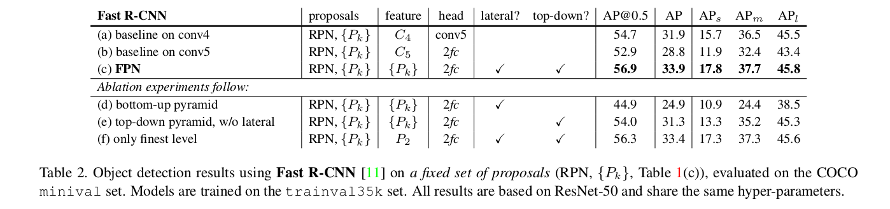
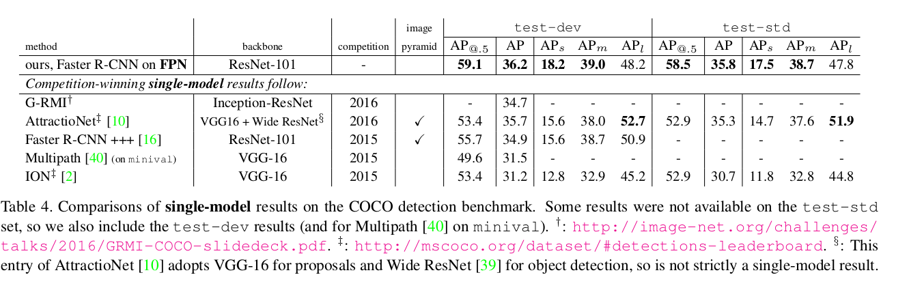

Feature Pyramid Networks for Object Detection
=

# 1 Introduction
识别不同尺度图像的一种基本方法是 *feature pyramids built upon image pyramids* （简称“ *featurized image pyramids* ”）。这些金字塔在尺度上是不变的，因为物体的尺度变化通过在金字塔中移动其level来抵消。直观地，该属性使模型能够通过在两个位置和金字塔等级上扫描模型来检测大范围尺度的对象。

特征化图像金字塔在手工设计特征的时代被大量使用。它们非常关键，像DPM这样的物体探测器[7]需要进行密集的采样以获得良好的结果。CNN进行分类或者对象检测时，也是用特征化图像金字塔，例如使用多尺度训练或推理，通过金字塔图像来产生多尺度的特征表示。

然而，对图像金字塔的每个级别进行特征化具有明显的局限性。推理时间显著增加，而且，端到端的训练图像金字塔上在内存上是不灵活的，并且，只能在测试时使用图像金字塔，这造成训练和测试之间的不一致。所以，Fast 和 Faster R-CNN在默认情况下并没有选择使用图像金字塔。

然而，图像金字塔不是仅有的用于计算多尺度特征表示的方式。深度CNN计算一个层到层的特征层级（feature hierarchy），其使用子采样层产生固有的多尺度、金字塔形状的特征图。但是，具有高分辨率的低级别特征图对于对象检测的表达能力有害。

表1（c） 是SSD使用特征金字塔的形式，为了避免使用低级特征，SSD放弃重用已计算的层，而是从网络中的高位开始构建金字塔（例如，VGG网络的conv4_3 [36]），然后再添加几个新层。因此，SSD错过使用高分辨率的特征图的机会，但是这部分特征图对小对象检测十分重要。

本文的目标是自然地平衡卷积神经网络特征层级的金字塔形状，同时创建一个在所有尺度都具有强壮语义的金字塔。为了实现这一目标，需要一种架构，该架构将语义强大的低分辨率特征与丰富细节的高分辨率特征（语义上较弱）相结合，其通过自上而下的路径和横向连接（图1（d））实现。本文实现的方法可以在不牺牲表达能力、速度或者内存的情况下，替换特征化图像金字塔。

# 2 Related Work
**Hand-engineered features and early neural networks.** SIFT特征[25]最初是在尺度空间极值（scale-space extrema）下提取的，用于特征点匹配。HOG在整个图像金字塔上密集计算。早期的人脸检测，使用浅层网络在图像金字塔上进行检测。

**Deep ConvNet object detectors.**

**Methods using multiple layers.** FCN [24]对多个尺度上每个类别的部分得分进行求和，以计算语义分割。Hypercolumns使用相似的方法进行对象实例分割。HyperNet、ParseNet和ION在计算预测之前拼接多层特征，这等价与求和变换的特征。SSD和MS-CNN在特征层级的多个层预测对象，但是没有结合特征或者得分。

# 3 Feature Pyramid Networks

**Bottom-up pathway。** 自下而上的路径是骨干ConvNet的前馈计算，它计算由几个尺度的特征图组成的特征层次结构，特征图的缩放步长为2。对于ResNet，使用每个阶段最后一个残差块的激活输出，表示为 $\{C_2, C_3, C_4, C_5\}$ ，其步长分别为 $\{4, 8, 16, 32\}$ 。

**Top-down pathway and lateral connections.** 自上而下的路径通过从较高的金字塔等级上采样空间上较为粗糙但在语义上更强的特征图来幻化更高分辨率的特征。这些特征通过侧连接来自自下而上路径的特征得到增强。每个侧连接融合自下而上路径和自上而下路径中相同空间尺寸的特征图。自下而上的特征图具有更低级别的语义，但是其激活有更准确的定位，因为它被下采样更少次。

图3展示top-down构建过程。将高层特征上采样2倍空间尺寸（最近邻）。低层特征使用 $1 \times 1$ 卷积来减少特征，然后使用逐元素加法结合高低层特征。 $C_5$ 上直接使用 $1 \times 1$ 卷积产生最低分辨率的特征图。最后，在融合的特征图上使用 $3 \times 3$ 卷积来产生最终特征图，这是为了减小上采样的副作用。最终的特征图称为 $\{P_2, P_3, P_4, P_5\}$ ， 对应 $\{C_2, C_3, C_4, C_5\}$ 。因为所有的金字塔层级共享分类器和回归器（与传统的特征化金字塔一样），所以固定所有特征图的维度为 $d$ ，本文设置 $d = 256$ ，因此所有额外添加的卷积层都有256个通道的输出。这些额外层中没有非线性函数。

本文也尝试更复杂的块（如残差块）作为侧连接，并仅观察到轻微的性能提升。

# 4 Applications
## 4.1 Feature Pyramid Networks for RPN
RPN是滑动窗口式的类别无关的对象检测器。本文实现方式为，$3 \times 3$ 卷积后跟两个 $1 \times 1$ 的兄弟卷积用于分类和回归，这称之为网络头（head）。将Head附加到特征金字塔的每个层级。因为头部在所有金字塔等级的所有位置上密集地滑动，所以不必在特定层级上具有多尺度anchor。因此，在 $\{P_2, P_3, P_4, P_5\}$ 上定义anchor的尺度为 ${32 ^ 2, 64 ^ 2, 128 ^ 2, 256 ^ 2, 512 ^ 2}$ ，纵横比为 ${1:2, 1:1, 2:1}$ ，在金字塔上共有15个anchor。
IoU大于0.5的anchor为正类，小于0.3的为负类。*该优点类似于使用特征化图像金字塔的优点，其中公共头部分类器可以应用于以任何图像尺度计算的特征。*

## 4.2 Feature Pyramid Networks for Fast R-CNN
我们将特征金字塔看作是从图像金字塔中生成的。因此，我们可以在图像金字塔上运行时调整基于区域的探测器[15,11]的分配策略。 在形式上，我们将宽度为w和高度为h的RoI（在输入图像上为网络）分配给我们的特征金字塔的等级 $P_k$ :
$$k=\lfloor{k_0 + \log_2(\sqrt{(wh)} / 224)} \rfloor  \tag 1$$
这里，224是ImageN的预训练尺寸，并且 $k_0$ 是 $w \times h$ 的RoI应该映射到的目标层级。与基于ResNet的Faster R-CNN系统类似，使用 $C_4$ 作为单尺度特征图，设置 $k_0$ 为4 。直觉上，式（1）意味着，如果RoI的尺度变得更小（如224的 $1/2$ ），那么它应该映射到更精细分辨率的层级（如 $k=3$ ）。

Fast R-CNN中的预测头部也共享参数。本文采用RoI池化提取 $7 \times 7$ 的特征，然后跟两个1024维的全连接层（每个全连接层后是ReLU），最后是分类和边界框回归。

# 5 Experiments on Object Detection
## 5.1 Region Proposal with RPN

评估COCO风格的平均召回率（AR： Average Recall）和在小、中和大对象上的AR（ $AR_s, AR_m, AR_l$ ） 。同时报告了每幅图像100和1000个提议的结果（ $AR^{100}, AR^{1000}$ ）。

**Implementation details.** 表1为所有的端到端训练架构。输入图像短边调整为800个像素。8 GPU。每个GPU两张图像，同步（synchronized）SGD，weight decay = 0.0001， momentum = 0.9 。前30k学习率为0.02， 后10k学习率为0.002 。排除掉超出图像边界的anchor 。

## 5.2 Object Detection with Fast/Faster R-CNN

**Implementation details** 以COCO风格的 Average Precision（AP）和PASCAL风格的AP（单一IoU阈值0.5）评估对象检测.同时，报告 $AP_s$、 $AP_m$ 和 $AP_l$ 。

输入图像短边为 800 像素。在8个GPU上同步训练。每个GPU输入两张图像以及每幅图像512个RoI。weigh decay = 0.0001， momentum = 0.9 。前60k迭代，学习率为0.02， 后20k迭代学习率为0.002 。训练时，使用2000个RoI，测试时，使用1000个RoI。

### 5.2.1 Fast R-CNN(on fixed proposals)
为了更好地研究FPN对基于区域的检测器的影响，在一组固定的提议上进行了Fast R-CNN的消融实验。选择RPN（表1（c））计算的固定提议，因为这些提议对小对象检测有较好的性能。各种消融实验结果如表2 。

### 5.2.2 Faster R-CNN(on consistent proposals)

在Faster R-CNN中，RPN和Fast R-CNN为了特征共享，必须使用相同的骨干网络。

表3展示本文方法和两种基线方法之间的比较，它们都使用一致的骨干架构。以下实现有助于缩小差距：（i）使用800像素的图像尺度而不是600像素（[11, 16]）；（ii）每幅图像使用512个RoI训练以加速收敛，而[11, 16] 中使用64个。（iii）测试每幅图像使用1000个提议，而不是300（[16]）。

表5是RPN和Fast R-CNN共享特征的消融实验。

### 5.2.3 Comparing with COCO Competition Winners

