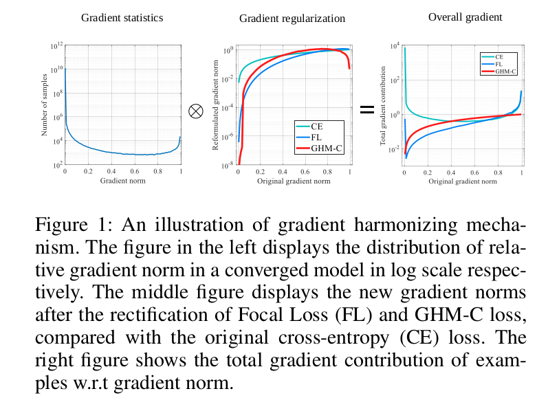
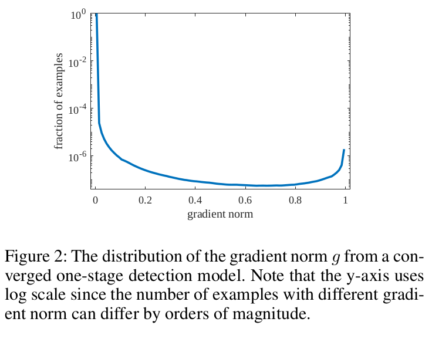

Gradient Harmonized Single-stage Detector
==

# Introduction
一阶段方法是对象检测最有效和优雅的框架。但是长期以来，一阶段检测器的性能与两阶段检测器相比，有较大的差距。一阶段检测器训练的最大挑战是易分样本和难分样本之间以及正类和负类之间的严重不平衡。大量的易分和背景样本倾向于压倒训练。但是这些并不存在于两阶段检测器，这是由于提议驱动机制。为了处理前一个不平衡问题，基于样本挖掘的方法（例如OHEM）经常被使用，它们直接丢弃多数样本，并且训练是不充足的。对于后一个不平衡问题，Focal Loss试图通过修改交叉熵损失函数来处理。然而，Focal Loss采用两个超参数，其需要大量工作来调优。并且它是一个静态损失，不能适应数据分布的变化，其随训练过程而变化。

在这项工作中，我们首先指出类别不平衡可以归结为难度不平衡，而难度不平衡可以归结为梯度范数分布（gradient norm distribution）的不平衡。如果正类样本可以良好分类，它就是易分样本，并且模型不会从它获益，即该样本仅产生很少的梯度量。一个误分样本可以吸引模型的注意力，而不管它属于哪一个类。因此，如果从全局的角度看，大量的负样本倾向于容易分类，而难分样本通常是正类。因此，两种不平衡可以概括为属性不平衡。

此外，我们还认为梯度范数的分布可以反映出不同属性(hard/easy和pos/neg)的样本的不平衡。与梯度范数对应的样本密度，我们一般称为 _gradient density_ ，其极大地变化如图1左所示。具有非常小梯度范数的样本有较大的密度，其对应大量的易分样本。尽管易分样本对全局梯度的贡献小于难分样本，但是大量易分样本的总贡献会超过少数难分样本的贡献，训练过程将是低效的。此外，我们也发现具有非常大梯度范数（非常难分的样本）的样本密度略大于中间样本的密度。并且，由于非常难分的样本即使在模型收敛时也是稳定存在的，所以我们视这些样本为异常点。异常点可能影响模型的稳定性，因为它们的梯度可能有于其他常见样本有很大的差异。

受梯度范数分布的启发，我们提出一种梯度协调机制（gradient harmonizing mechanism： GHM）来训练高效地训练一阶段对象检测，其关注不同样本的梯度分布的协调。GHM首先执行与梯度密度对应的相似属性的样本量的统计，然后根据密度给每个样本的梯度附加一个协调参数（harmonizing parameter）。GHM与CE、FL的对比效果如图1所示。使用GHM训练，易分样本产生的大量累积梯度可以极大地降权（down-weighted），并且异常点也可以相应的降权。最后，平衡各类样本的贡献，使训练更加高效、稳定。

实践中，梯度的修改可以重构损失函数来等价地实现，我们讲GHM嵌入到分类损失，其表示为GHM-C 损失。这个损失函数的构造非常优雅，没有太多需要调优的超参数。由于梯度密度是依赖mini-batch中样本分布的统计变量，GHM-C是可以适应每个批中数据分布变化以及模型更新的动态损失。为了展示GHM的一般性，我们也在边界框回归分支中采用GHM-R损失。

在具有挑战性的COCO基准测试的边界框检测轨迹上的实验表明，GHM-C损失与传统的交叉熵损失相比具有较大的增益，略高于目前最先进的Focal Loss 。并且，GHM-R的性能比通常使用的smooth $L_1$ 损失好。GHM-C和GHM-R的结合在COCO test-dev上获得新的最佳性能。

我们的主要贡献如下：
1. 我们从梯度范数分布的角度揭示了一阶段检测器背后样本严重不平衡的基本原理，并提出一种新的梯度协调机制来处理这种不平衡。
2. 我们将GHM分别嵌入到分类和回归中，以称为GHM-C和GHM-R，其修改了具有不同属性的样本的梯度分布，并对超参数是鲁棒的。
3. 与GHM合作，我们可以轻松地训练一个单级检测器，而不需要任何数据采样策略，并在COCO基准测试上实现最先进的结果。

# Related Work
**Object Detection:** 略

**Object Functions for Object Detection:** 略

# Gradient Harmonizing Mechanism
## Problem Description
与Focal Loss相似，我们的工作关注一阶段对象检测器的分类，其中样本的类（前景/背景）严重不平衡。对于一个候选边界框，令 $p \in [0, 1]$ 为模型的预测概率， $p^\ast$ 为某个特定类的ground-truth标签。考虑二值交叉熵损失：

$$
L_{CE}(p, p^\ast) = 
\begin{cases}
-\log(p)  & \mbox{if } p^\ast = 1 \\
-\log(1 - p) & \mbox{if } p^\ast = 0
\end{cases} \tag 1
$$

令 $x$ 为模型的直接输出， $p = \mbox{sigmoid}(x)$ ,对于 $x$ 的梯度为：

$$
\begin{alignat}{2}
\frac{\partial L_{CE}}{\partial x} &= 
\begin{cases}
p - 1 & \mbox{if } p^\ast = 1  \\
p & \mbox{if } p^\ast = 0
\end{cases}  \\
& = p - p^\ast 
\end{alignat} \tag 2
$$

我们定义 $g$ 如下：

$$
g = |p - p^\ast| = \begin{cases}
1 - p & \mbox{if } p^\ast = 1 \\
p & \mbox{if } p^\ast = 0
\end{cases}  \tag 3
$$

$g$ 等于与 $x$ 对应梯度的范数。$g$ 的值表示样本的属性（例如易分或者难分），并意味着全局梯度上样本的影响。虽然梯度的严格定义是在整个参数空间上，即 $g$ 是一个样本的梯度的关联范数，但为了方便起见，本文将 $g$ 称为梯度范数。

图2展示一个收敛的一阶段检测模型的 $g$ 的分布。由于易分的负样本占主导地位，我们使用log轴来显示样本的比例，以演示具有不同属性的样本的方差的细节。可以看出非常易分的样本极大，其对全局梯度有极大的影响。此外，我们可以看到，收敛的模型仍然不能处理非常难分的样本，这种样本的数量远大于中间难度的样本数量。这些非常困难的样本可以被视为离群值，因为它们的梯度方向往往与其他大量样本的梯度方向相差很大。即，如果迫使收敛的模型更好地学习分类这些离群点，大量其他样本的分类往往不那么准确。

## Gradient Density
为了处理梯度范数分布不协调的问题，我们引入一种关于梯度密度的调和方法。训练样本的梯度密度函数如式4所示:

$$GD(g) = \frac{1}{l_{\epsilon}(g)}\sum_{k=1}^N \delta_{\epsilon}(g_k, g) \tag 4$$

其中，$g_k$ 是第 $k$ 个样本的梯度范数。并且

$$\delta_{\epsilon}(x, y) = \begin{cases}
1 & \mbox{if } y - \frac{\epsilon}{2} \le x < y + \frac{\epsilon}{2}  \\
0 & \mbox{otherwise}  
\end{cases} \tag 5
$$

$$l_{\epsilon} = \min(g + \frac{\epsilon}{2}, 1) - \max(g - \frac{\epsilon}{2}, 0) \tag 5$$

$g$ 的梯度密度表示位于以 $g$ 为中心、半径为 $\epsilon$ 的圆内的样本数量，并通过有效区域长度标准化。

现在，我们定义梯度密度调和参数为：

$$\beta_i = \frac{N}{GD(g_i)} \tag 7$$

其中 $N$ 为样本的总数。为了更好的理解梯度密度调和参数，我们可以将其重写为 $\beta_i = \frac{1}{GD(g_i) / N}$ 。分母 $GD(g_i) / N$ 为规范化子，表明第 $i$ 个样本的梯度领域内的样本比例。如果样本是关于梯度的均匀分布，对于任意的 $g_i$, $GD(g_i) = N$ ,并且每个样本有相同的 $\beta_i = 1$ ，器意味的没有任何改变。否则，对于密度较大的样本，归一化器的权重相对较低。

## GHM-C Loss
我们通过将 $\beta_i$ 视为第 $i$ 个样本的损失权重以将 GHM 嵌入分类损失，而损失函数的梯度密度调和形式为：

$$
\begin{alignat}{2}
L_{GHM-C} & = \frac{1}{N} \sum_{i=1}^{N} \beta_i L_{CE}(p_i, p_i^\ast) \\
& =\sum_{i=1}^{N} \frac{L_{CE}(p_i, p_i^\ast)}{GD(g_i)}
\end{alignat} \tag 8
$$

图3为不同损失的梯度范数的重新表述。这里，我们采用原始的CE梯度范数，即 $|p - p^\ast|$ ，以方便查看 $x$ 轴根据 $g$ 计算的密度。我们可以看出，Focal Loss 和 GHM-C 损失的曲线有相似的倾向，这意味着具有最佳超参数的 Focal Loss 与统一的梯度调和相似。此外，GHM-C还有一个有点被 FocalLoss 忽略：减小了异常点梯度分布的权重。

利用GHM-C损失，大量非常易分的样本极大地减小了权重，而异常点的权重也略微减小，其同时处理属性的不平衡问题和异常点问题。由图1的右边，我们可以更好地看到，GHM-C调整了样本的不同组的总体梯度分布。由于梯度密度在每次迭代中计算，样本的权重相对于 $g$ （或者 $x$ ）不像 Focal Loss 一样是固定的，但是能够适应模型的当前状态和数据mini-batch 。GHM-C的动态属性使训练更有效和更加鲁棒。

## Unit Region Approximation
**Complexity Analysis:** 计算所有样本的梯度密度值的朴素算法有 $O(N^2)$ 的时间复杂度，其可以通过式4和式8轻松获取。即使并行计算，每个计算单元仍然承担 $N$ 的计算。并且，据我们所知，最好的算法是先用复杂度为 $O(N \log N)$ 的梯度范数对样本进行排序然后用一个队列扫描样本得到 $O(N)$ 的密度。这种排序方法不能从并行计算中获得太多的好处。由于一阶段检测器中图像的 $N$ 可以是 $10^5$ 甚至 $10^6$ ，直接计算梯度密度非常耗时。因此，我们引入替代方法来近似获取样本的梯度密度。

**Unit Region：** 我们讲 $g$ 的范围空间划分为长度 $\epsilon$ 的单位区域 ，并且有 $M = \frac{1}{\epsilon}$ 个单位区域。令 $r_j$ 为索引 $j$ 处的单位区域，使得 $r_j = [(j - 1) \epsilon , j\epsilon)$ 。令 $R_j$ 表示位于区域 $r_j$ 的样本量。我们定义 $ind(g) = t$ ，使得 $(t-1)\epsilon \le g < t\epsilon$ ，它是 $g$ 所处的单元区域中的索引函数。

然后，我们定义近似梯度密度函数为：

$\hat{GD}(g) = \frac{R_{ind(g)}}{\epsilon} = R_{ind(g)} M \tag 9$

然后，我们获得近似梯度密度调和参数：

$$\hat{\beta}_i = \frac{N}{\hat{GD}(g_i)} \tag{10}$$

考虑到 $\epsilon = 1$ 的特例： 仅有一个单位区域，并且所有的样本位于其中，因此，显然地，每个 $\beta_i = 1$ ，且每个样本保持它们原始的梯度分布。最后，我们的损失函数为：

$$
\begin{alignat}{2}
\hat{L}_{GHM-C} &= \frac{1}{N} \sum_{i=1}^{N} \hat{\beta}_i L_{CE}(p_i, p_i^\ast)  \\
&= \sum_{i=1}^{N} \frac{L_{CE}(p_i, p_i^\ast)}{\hat{GD}(g_i)}
\end{alignat}  \tag {11}
$$

由式9，我们可以看出位于相同单位区域的样本共享相同的梯度密度。因此，我们可以使用正方图统计算法，并且所有梯度密度值具有 $O(MN)$ 的时间复杂度。并且，并行计算可以同于每个有 $M$ 计算量的计算单元。实践中，我们可以使用少量的单位区域获得良好的性能。也就是 $M$ 很小，损失的计算很有效。

**EMA:** 基于mini-batch统计的方法通常面临一个问题： 当许多极端的数据尽在一个mini-batch中采样时，统计结果面临严重的噪声，并且训练会不稳定。指数滑动平局（Exponential Moving Average： EMA）是常用于处理这个问题的方法，例如具有momentum的SGD和皮归一化。因为在近似算法中梯度密度来自于单位区域内的样本个数，我们可以在每个单元区域应用EMA以获得更稳定的样本梯度密度。令 $R_j^{(t)}$ 为第 $i$ 次迭代中第 $j$ 个单元区域样本数，$S_j^{(t)}$ 为滑动平均量。我们有：

$$S_j^{(t)} = \alpha S_j^{(t-1)} + (1 - \alpha) R_j^{(t)} \tag{12}$$

其中 $\alpha$ 为momentum参数。我们使用平均量 $S_j$ 来计算梯度密，而不是 $R_j$ ：

$$\hat{GD}(g) = \frac{S_{ind(g)}}{\epsilon} = S_{ind(g)}M \tag{13}$$

使用EMA，梯度密度讲更加平滑，并且对阶段数据不敏感。

## GHM-R Loss
考虑到参数化偏移， $t = (t_x, t_y, t_w, t_h)$ 通过边界框回归分支预测，而目标偏移 $t^\ast = (t_x^\ast, t_y^\ast, t_w^\ast, t_h^\ast)$ 由ground-truth计算。回归损失通常采用 smooth $L_1$ 损失函数：

$$L_{reg} = \sum_{i \in \{x, y, w, h\}} SL_1(t_i - t_i^\ast)  \tag{14}$$

其中

$$
SL_1(d) = \begin{cases}
\frac{d^2}{2\delta} & \mbox{if } |d| < \delta \\
|d| - \frac{\delta}{2} & \mbox{otherwise}
\end{cases} \tag{15}
$$

其中 $\delta$ 为二次曲线和线性部分之间的分割点，在实践中，通常设置为 $1/9$ 。

由于 $d = t_i - t_i^\ast$ ，与 $t_i$ 对应的 smooth $L_1$ 损失的梯度表示为：

$$\frac{\partial SL_1}{\partial t_i} = \frac{\partial SL_1}{\partial d} 
= \begin{cases}
\frac{d}{\delta} & \mbox{if } |d| \le \delta \\
sgn(d)  & \mbox{otherwise}
\end{cases} \tag{16}
$$

其中 $sgm$ 为符号函数。

注意所有的样本 $|d|$ 大于分割点有相同的梯度范数 $|\frac{\partial SL_1}{\partial t_i}| = 1$ ,这使得如果依赖梯度范数，具有不同属性的样本的区别是不可能的。一个替代选项是直接使用 $|d|$ 作为不同属性的测量，但是新问题是 $d$ 可以达到无限，并且单位区域近似不能被实现。

为了方便在回归损失上应用 GHM ，我们首先修改传统的 $SL_1$ 损失为更优雅的形式：

$$ASL_1(d) = \sqrt{d^2 +\mu^2} - \mu \tag{17}$$

该损失与 $SL_1$ 损失具有相似的性质： 当 $d$ 很小时，它近似于一个二次函数( $L_2$ 损失)，当 $d$ 很大时，它近似于一个线性函数( $L_1$ 损失)。我们将修改的损失函数表示为 Authentic Smooth $L_1$ （$ASL_1$）损失，因为它具有良好的真实光滑性（authentic smoothness），即所有阶导数都是连续存在的。相比之下，smooth $L_1$ 损失的二阶导数在点 $d = \delta$ 时不存在。此外，$ASL_1$ 相对于 $d$ 有优雅的梯度形式：

$$\frac{\partial ASL_1}{\partial d} = \frac{d}{\sqrt{d^2 + \mu^2}} \tag{18}$$

 