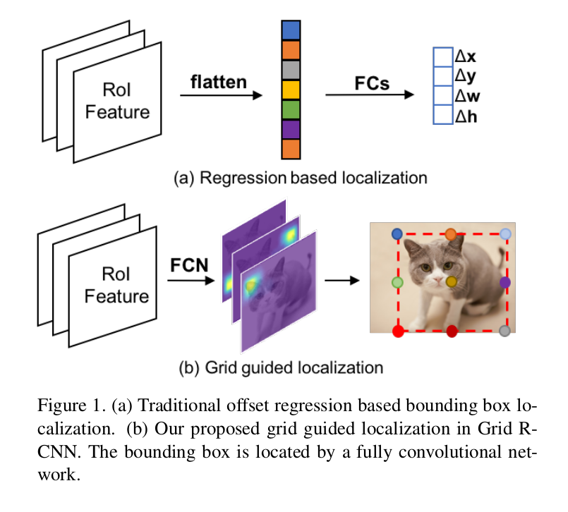
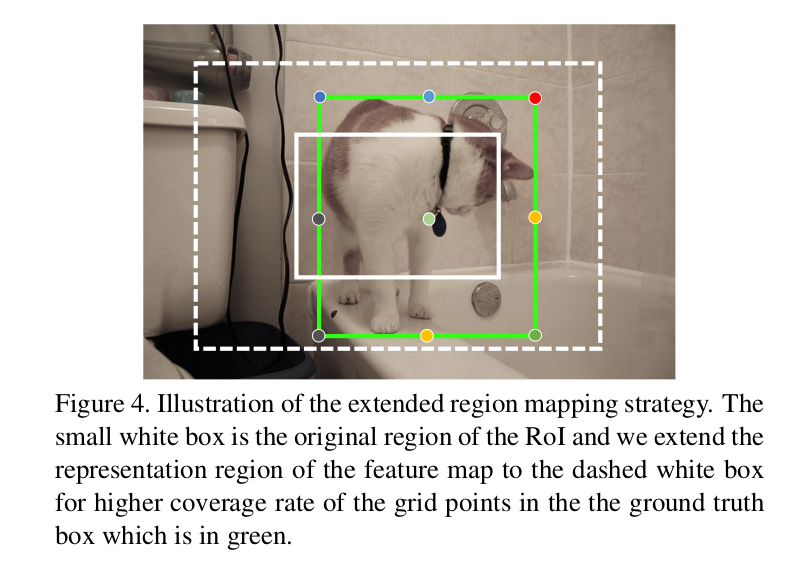
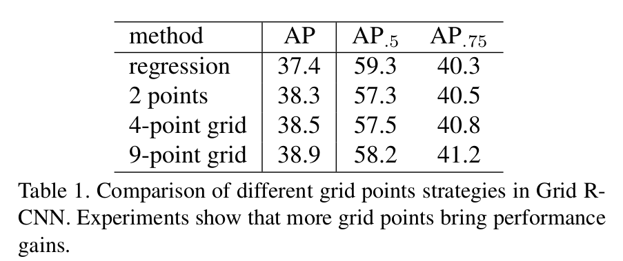
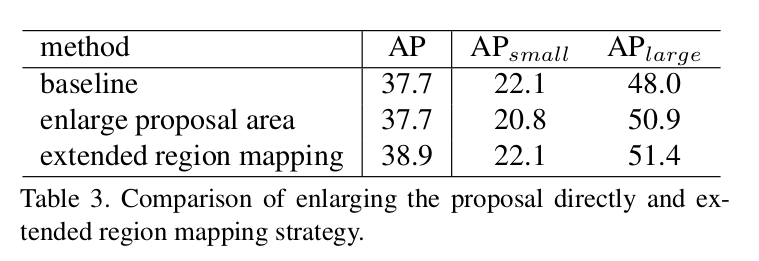
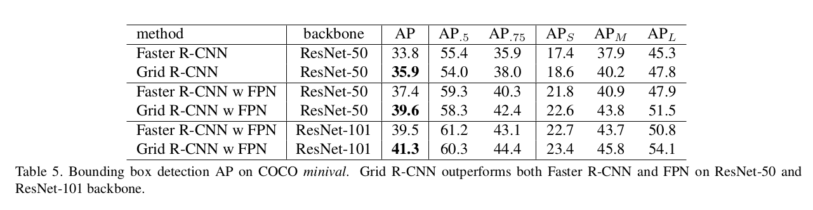
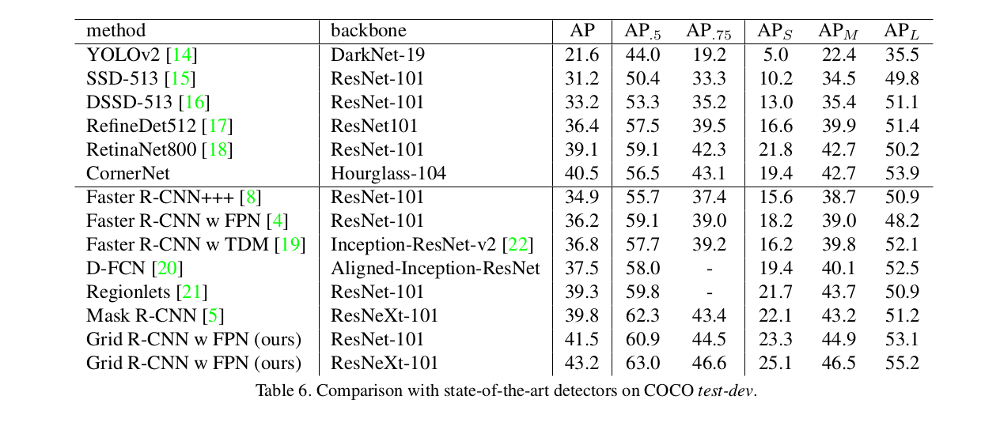

Grid R-CNN
=

# 1. Introduction
对象检测任务可以分解为对象分类和位置。最近几年，许多基于 CNN 的检测框架被提出，并获得最佳结果。尽管这些方法在多个方面提高了检测性能，但是它们的边界框定位模块是相似的。典型的边界框模块是一个回归分支，其设计为几个全连接层，并且使用高级特征图来预测候选边界框（提议或者预定义的锚）的偏移。

我们引入 Grid R-CNN ，一种新的对象检测框架，其中传统的回归形式被 grid point guided localization mechanism 替换。并且显式空间表征被有效地用于高质量定位。与通过全连接层将特征图折叠成矢量的回归方法相比，Grid R-CNN 将对象边界框区域划分为网格，并采用全卷积网络（FCN）[7]来预测网格点的位置。归功于全卷积架构的位置敏感属性， Grid R-CNN 保留了显示的空间信息，并且可以在像素级别获得网格点位置。如图1b所示，当特定位置的一定数量的网格点是已知时，相应的边界框可以明确确定。受网格点指导，Grid R-CNN 能够确定比回归方法更准确的对象边界框，而回归方法缺乏显示空间信息指导。

由于边界框有四个自由度，两个独立的点（例如左上角和右下角）足够用于某个对象的定位。然而，因为点的位置与局部特征不是直接相关的，所以预测并不是轻松的。例如，图1b中猫的右上角点位于对象身体外部，并且其在图像中的相邻区域仅包含背景，而且它可能与附近的像素共享非常相似的局部特征。为了克服这个问题，我们设计多点监督的形式。通过定义网格中的目标点，我们有更多的线索来减小某些点的不准确预测的影响。例如，在典型的 $3\times3$ 网格点监督案例中，右上角的可能不准确的 $y$ 轴坐标可以通过位于对象边界上的 top-middle 点的坐标来校准。网格点是是用于减小综合偏差的有效设计。

此外，为了充分利用网格中点的相关性，我们提出一种信息融合方法。具体来说，我们为每个网格点设计单独的特征图组。对于一个网格点，收集相邻网格点的特征图并将其融合到集成特征图中。集成特征图用于对应网格点的位置预测。因此，结合来自空间相关网格点的补充信息以使预测更加准确率。

我们展示了Grid R-CNN框架在具有挑战性的COCO基准的目标检测轨道上的有效性[10]。我们的方法在很大程度上优于传统的基于回归的最先进方法。例如，我们超越了 Faster R-CNN [3]、ResNet-50 [8]和FPN [4]架构的骨干了 2.2％ AP 。对不同IoU阈值标准的进一步比较表明，我们的方法在高质量物体定位方面具有压倒性的优势，在 $IoU = 0.8$ 时， AP 增益为 4.1％，在 $IoU = 0.9$ 时， AP 增益为 10.0％。

我们的工作主要贡献如下：
1. 我们提出一种新颖的定位框架，称为 Grid R-CNN ，其通过全卷积网络取代传统的回归网络，有效地保留了空间信息。据我们所知，Grid R-CNN 是首次提出的基于区域（两阶段）的检测框架，其通过预测像素级网格点来定位目标。

2. 我们设计多点监督组成预测网格中的点来减小某些不准确点的影响。我们进一步提出了一种特征图级别信息融合机制，该机制使得空间相关的网格点能够获得合并的特征，从而可以很好地校准它们的位置。

3. 我们进行了大量实验，证明Grid R-CNN框架可广泛应用于不同的检测框架和网络架构，并具有一致的收益。Grid R-CNN 在更严格的定位标准（例如，IoU阈值 = 0.75）中表现更好。因此，我们相信我们的网格引导定位机制是基于回归的定位方法的更好替代。

# 2. Related Works
。。。
CornerNet 是一种一阶段对象检测器，其石红成对的关键点来定位对象的边界框。它是通过一个沙漏网络检测所有可能的边界框关键点（角点）的 bottom-up 检测器。与此同时，设计了一个嵌入网络来尽可能地映射成对的关键点。对于上述的嵌入机制，检测到的角点可以分组为对，并定位边界框。

值得注意的是，我们的方法不同于 CornerNet 。 CornerNet 是一阶段的 bottom-up 方法，其意味着直接从整幅图像中生成关键点，而无需定义关键点。因此，CornerNet 的关键步骤是识别哪些关键点属于相同的实例，并正确地分组它们。相比之下，我们的方法是 top-down 的两阶段检测器，其在第一个阶段定义实例。我们所关注的是如何更准确地的定位边界框的关键点。我们设计了网格点特征融合模块，以利用相关网格点的特征，并校准比两个角点更精确的网格点定位。

# 3. Grid R-CNN

Grid R-CNN 的框架如图2所示。基于区域提议，每个 RoI 特征从 CNN 获得的特征图上单独地提取。然后，RoI 特征用于执行对相应提议的分类和定位。相比之前的工作，例如 Faster R-CNN，我们使用网格指导机制进行定位，而不是偏移回归。网格预测分支采用全卷积网络。它输出精细的空间布局（概率热图），我们可以从中找到与对象对齐的边界框的网格点。有了网格点，我们最终通过特征图级信息融合方法确定准确的对象边界框。

## 3.1. Grid Guided Localization
许多先前的方法使用几个全连接层作为回归器来预测为对象定位预测边界框偏移。而我们采用全卷积网络来预测预定义的网格点的位置，然后利用它们确定准确的对象边界框。

我们设计了在对象的边界框中对齐的 $N \times N$ 网格形式的目标点。一种 $3 \times 3$ 的案例如图1b所示，这里的网格点为四个角点、四条边的中间点和中心点。每个提议的特征通过空间大小为 $14 \times 14$ 的 RoIAlign 操作提取。之后，两个 $2\times$ 的反卷积层用于获得 $56 \times 56$ 的分辨率。网格预测分支输出具有 $56 \times 56$ 分辨率的 $N \times N$ 热图，并在每个热图上应用一个逐像素的 sigmoid 函数以获取概率图。并且，每个热图都有一个对应的监督图，其中十字形（cross shape）中的 5 个像素被标记为目标网格点的正类位置。二值交叉熵损失用于优化。

在推理期间，在每个热图上，我们选择具有最高置信度的像素，并在原始图像上计算相应的位置作为网格点。形式上，热图中的点 $(H_x, H_y)$ 通过如下公式映射到原始图像中的点 $(I_x, I_y)$ ：
$$
\begin{align}
I_x = P_x + \frac{H_x}{w_o} w_p \\
I_y = P_x + \frac{H_y}{h_o} h_p
\end{align} \tag 1
$$
其中 $(P_x, P_y)$ 为输入图像中的提议的左上角，$w_p$ 和 $h_p$ 为提议的宽和高，$w_o$ 和 $h_o$ 为输出热图的宽和高。

然后，我们确定预测到的网格点的对象的边界框的四条边。具体地，我们将四条边的坐标表示为 $B = (x_l, y_u, x_r, y_b)$ ，其分别表示左、上、右和下边。令 $g_j$ 表示坐标 $(x_j, y_j)$ 的第 $j$ 个网格点，并且其预测概率为 $p_j$ 。然后我们将 $E_i$ 定义为位于第 $i$ 条边的网格点的索引集合，即，如果 $g_j$ 位于边界框的第 $i$ 条边，则 $j \in E_i$ 。我们通过如下的公式来计算具有集合 $g$ 的 $B$：
$$
\begin{alignat}{2}
x_l = \frac{1}{N} \sum_{j \in E_1} x_j p_j & \mbox{  , } y_u = \frac{1}{N} \sum_{j \in E_2} y_j p_j  \\
x_r = \frac{1}{N} \sum_{j \in E_3} x_j p_j & \mbox{  , } y_b = \frac{1}{N} \sum_{j \in E_4} y_j p_j
\end{alignat} \tag 2
$$
以上边界 $y_u$ 为例，它是三个上边界网格点的 $y$ 坐标的概率加权平均。

## 3.2. Grid Points Feature Fusion
网格点具有内部空间相关性，并且它们的位置可以彼此校准以减少总体偏差。因此，设计了空间信息融合模块。

一种直观的实现是坐标集平均，但是这样一来特征图中的丰富信息将被丢弃。另一个想法是提取与每个特征图上的网格点相对应的局部特征以进行融合操作。然而，这也丢弃了不同特征图中潜在的有效信息。以 $3 \times 3$ 的网格为例，为例校准左上角点，其他相邻点的特征图（例如，顶部中间点）的左上区域中的特征可以提供有效信息，却没有被使用。因此，我们设计特征图级信息融合机制以充分利用每个网格点的特征图。

为了区分不同点的特征图，我们使用 $N \times N$ 组滤波器为它们单独提取特征（从最后一个特征图），并给予它们对应网格点的中间监督。因此，每个特征图与某个网格点具有特定关系，并且我们将对应于第 $i$ 个点的特征图表示为 $F_i$ 。

对于每个网格点，$L_1$ 距离为 1 （单位网格长度）的点将有助于融合，其被称为 source point（源点）。我们定义与第 $i$ 个网格点相关的源点为 $S_i$ 。对于 $S_i$ 中第 $j$ 个源点，$F_j$ 将由三个连续的 $5 \times 5$ 卷积层处理以用于信息传递，并且该处理表示为函数 $T_{j \rightarrow i}$ 。然后所有所有源点中被处理的特征与 $F_i$ 融合以获得融合特征图 $F_i'$ 。图 3(a) 中显示了 $3 \times 3$ 情况下左上角网格点的图示。我们采用简单求和运算实现融合，信息融合的公式如下：

$$F_i' = F_i + \sum_{j\in S_i} T_{j \rightarrow i}(F_j) \tag 3$$

基于每个网格点的 $F_i'$ ，然后利用新卷积层 $T_{j \rightarrow i}^+$ 执行二阶融合，其不与一阶融合的参数共享参数。并且二阶融合特征图 $F_i^{''}$ 用于输出网格点位置预测的最终热图。二阶融合确保在范围 2 （$L_1$ 距离）内的信息转移。以 $3 \times 3$ 网格中的左上角网格点为例（如图3b），它合成来自其他五个网格点的信息，以进行可靠的校准。

## 3.3. Extended Region Mapping
网格预测模块输出具有固定大小的热图，其表示网格点位置的置信度分布。由于采用全卷积架构，并且一直保留空间信息，因此输出热图自然对应于原始图像中输入提议的空间区域。然而，区域提议可能没有覆盖完整的对象，这意味着一些 ground-truth 网格点中的一些点可能位于提议区域的外部，并且没能在监督图中标注或者推理期间预测。

在训练期间，缺少一些网格点标签会导致训练样本的使用效率低下。而在推理阶段，通过简单选择热图中最大的像素，我们可能获得其 ground-truth 位置在相应区域之外的网格点的完全不正确的位置。在许多情况下，超过一半的网格点未被覆盖，例如，在图4中，提议（小白框）小于 ground-truth 边界框，输出热图不能覆盖 9 个网格点中的 7 个。

一种自然的想法是扩大提议区域。这种方法可以确保大多数网格点在体育区域之中，但是它会映入冗余的背景特征，甚至其他对象。实验表明简单地扩大提议区域不会带来增益，并且对小对象检测的准确率是有害的。

为了处理这个问题，我们通过扩展区域映射方法修改输出热图和原始图像中的区域的关系。具体而言，在获取提议时，RoI 特征仍然从特征图的相同区域提取，而不需要扩大提议区域。我们将输出热图的表征区域重新定义为图像中对应区域的两倍，以便在大多数情况下覆盖所有网格点，如图4（虚线框）所示。

扩展区域映射将公式1的修改为：

$$
\begin{align}
I_x' = P_x + \frac{4H_x - w_o}{2w_o} w_p \\
I_y' = P_y + \frac{4H_y - h_o}{2h_o} h_p
\end{align}
$$

在新映射之后，正类提议（与 ground-truth 边界框的重叠区域大于 0.5）的所有目标网格点将被热图的对应区域覆盖。

## 3.4. Implementation Details
**Network Configuration:** 我们采用深度为50或101 ResNets [8] w/o FPN [4] 构建在顶部作为模型的主干。RPN 用于提取候选区域。通常，在COCO数据集中，我们设置输入图像的短边为 800 像素，在 Pascal VOC 数据集中设短边为 600 像素。在 RPN 中，每幅图像采样 256 个锚，其中正负锚的比例为 $1:1$ 。RPN 的锚点跨越 5 个尺度和 3 个纵横比，正类和负类锚的 IoU 阈值分别为 0.7 和 0.3 。在分类分支中，与 ground-truth 重叠大于 0.5 的 RoI 被视为正样本。在基于 Faster R-CNN 的模型中，我们采样 128 个 RoI ，在基于 FPN 的模型中，我们采样 512 个 RoI ，其中正负比为 $1:3$ 。在所有试验中，使用 RoIAlign ，并且在分类分支中池化大小为 $7$ ，而在网格分支中，池化大小为 $14$ 。网预测分支每幅图像最多采样 96 个 RoI，仅正类 RoI 用于训练。

**Optimization:** 我们使用 SGD 以 0.9 动量和 0.0001 权重衰减来优化训练损失。骨干参数通过在 ImageNet 数据集上预训练的分类网络初始化，其他新参数通过 MSRA 初始化方法初始化。数据增强仅有水平翻转。我们的模型在 32 张 NVIDIA XP GPU 上训练，每个 GPU 输入一张图像，以初始学习率 0.02 训练 20 个时期，并在 13 epoch 和 18 epoch 时减小 10 倍。我们使用学习率 warmup，和 Synchronized BatchNorm 机制以使多 GPU 训练更加稳定。

**Inference:** 在推理阶段，RPN 每幅图像生成 300/1000（Faster R-CNN/FPN）个 RoI 。然后，这些 RoI 的特征通过 RoIAlign 层处理，并通过分类分支生成类别得分，接着是 IoU 阈值为 0.5 的 NMS 。之后，我们选择前 125 的最高得分的 RoI，并将它们的 RoIAlign 特征送入网格分支以进一步进行位置预测。最终，使用 IoU 阈值为 0.5 的 NMS 来消除重复检测的边界框。

# 4. Experiments
实验数据为 Pascal VOC 和 COCO ，对于 Pascal VOC，使用 VOC07+12 trainval 集，并在 VOC2007 test 集上评估。COCO 包含 80 个类，在 80k 训练图像和 35k 验证图像上训练模型，在 5k 验证子集和 20k test-dev 上测试。

## 4.1. Ablation Study
**Multi-point Supervision:** 表 1 表明网格点选择对检测准确率的影响。

**Grid Points Feature Fusion:** 表 2 的结果表明了特征融合的有效性。

**Extended Region Mapping:** 表 3 展示了我们的扩展区域映射策略与原始的区域表征和直接扩大提议边界框的比价结果。

## 4.2. Comparison with State-of-the-art Method
**Experiments on Pascal VOC:** 我们在 Pascal VOC 数据集上以学习率在 15 和 17 epoch 时减小 10 倍来训练 Grid R-CNN 。并将 PASCAL VOC 的以 0.5 IoU 阈值的评估方式扩展为 COCO 风格的标准，其计算 0.5 到 0.95 （间隔为 0.05）的 IoU 阈值的 mAP 。结果见表 4 。

**Experiments on COCO：** 表 5 表明我们的方法带来可以跨越多个骨干和框架的一致性和实质上的改进。

**Results on COCO test-dev Set:**

