### Imbalance Problems in Object Detection: A Review

#### 1. 引言
本文将深度学习时代目标检测中的不平衡问题分为8中不同的不平衡问题，并将这些问题分为具有四个类型的分类树：类别不平衡、尺度不平衡、优化目标不平衡和边界框不平衡（表1）。当属于不同类别的样本之间严重不等时，发生 **类别不平衡** 。虽然这一不平衡的经典案例是前景-背景的不平衡，但是前景（正类）类别之间也存在类别不平衡。当目标有不同尺度以及有不同数量属于不同尺度的样本时，发生 **尺度不平衡** 。**空间不平衡** 是指与边界框的空间属性相关的一组因素，例如回归罚分、位置和IoU 。当需要最小化多个损失函数时，发生 **优化目标不平衡** 。

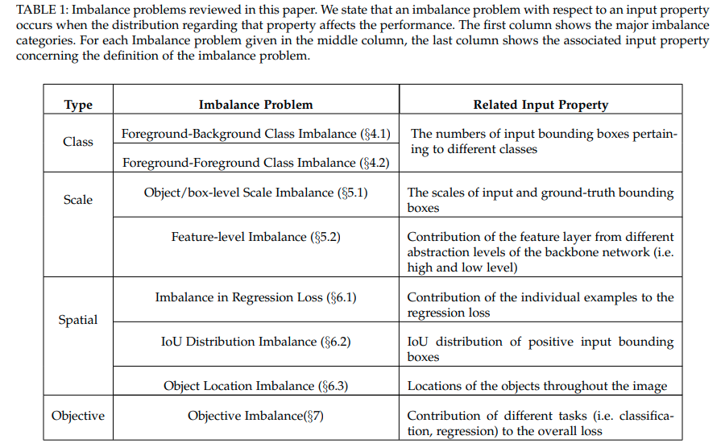

#### 2. 背景、定义和符号
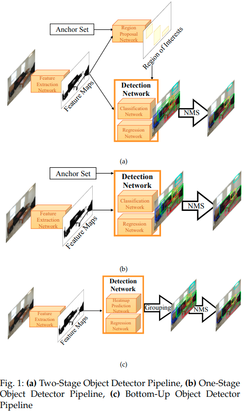

##### 2.1 State of the Art in Object Detection
今天，存在两种主要的目标检测方法：top-down和bottom-up（图1）。top-down和bottom-up方法主要区别是，在top-down方法中，全部对象假设（即锚、ROI、目标提议）在检测流程的早期生成并评估，而在bottom-up方法中，全部目标在处理流程的后期通过分组如关键点或部件的实体而合并。

遵循top-down的方法分为两类：两阶段和一阶段方法。两阶段方法的架构如图1（a）所示，它的目标是通过使用提议机制将由预定义的滑动窗口（称为锚）产生的大量负样本减少到可控的范围，这种提议机制目标最可能出现的区域（称为感兴趣区域ROI）。这些RoI通过输出边界框及相关类别概率的检测结果的检测网络进一步处理。最后使用NMS消除重复或高度重叠的检测结果。

一阶段方法（包括SSD及其变体、YOLO及其变体和RetinaNet）从输入图像上提取特征之后，直接从锚上预测检测结果，而没有任何的提议消除阶段。

Bottom-up目标检测方法将该问题视为关键点估计任务，并使用类别特定的热图来预测目标角点（要么是边界框，要么是极点（extreme points）），这通过回归网络进一步改善。检测到的关键点或角通过使用分组方法（如关联嵌入和暴力搜索）分组一组成完整的目标实例。

##### 2.2 Frequently Used Terms and Notation
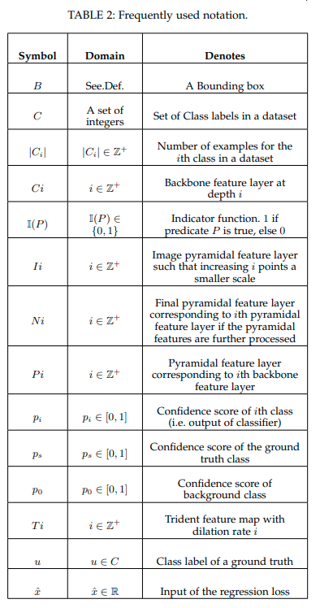

#### 3 TAXONOMY OF THE IMBALANCE PROBLEMS AND THEIR SOLUTIONS IN OBJECT DETECTION

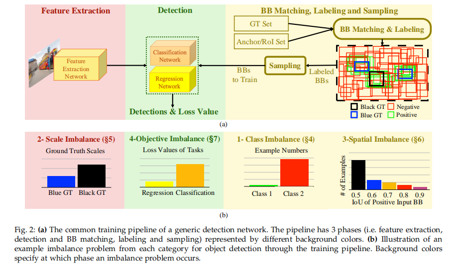

##### 3.1 A Taxonomy of Imbalance Problems
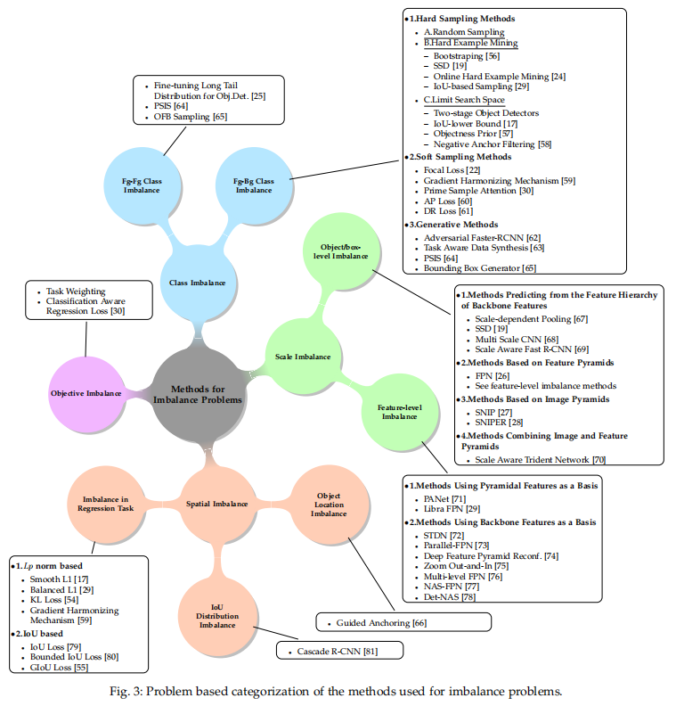

##### 3.2 A Taxonomy of Solutions
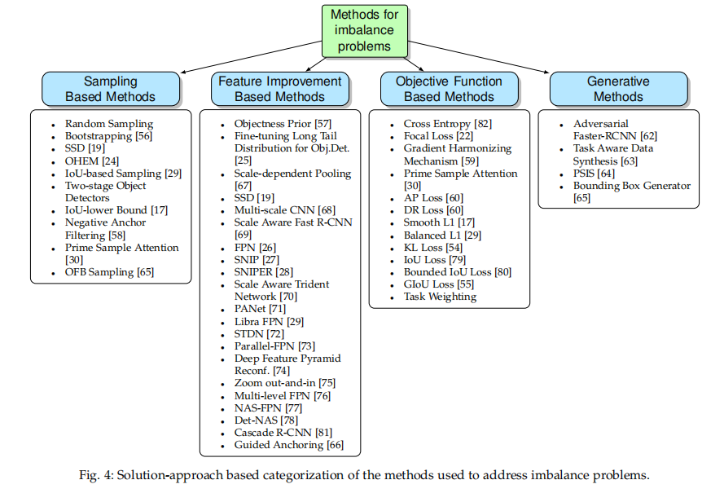

#### 4 IMBALANCE 1: CLASS IMBALANCE
当类别被过度表示时，会观察到类别不平衡问题，它表现为数据集中有比其他类更多的样本。从目标检测角度，它有两种形式：前景-背景的不平衡和前景-前景的不平衡。

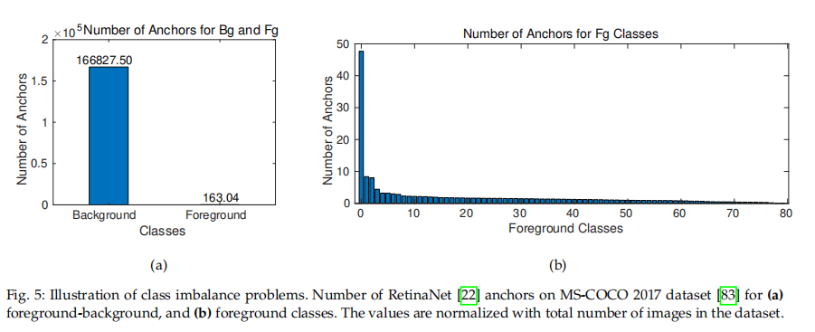

图5展示了类别不平衡。为了生成该图，我们将RetinaNet[22]的默认锚集应用于MS-COCO数据集[83]的训练图像，并计算前景类与锚的IoU超过0.5的情况或者没有超过0.5（即它是一个背景框）的频率，并且当锚与前景类重叠时，我们分别为每个类保留一个计数，并使用数据集中的图像数量对结果频率进行归一化。

##### 4.1 Forground-Background Class Imbalance
_定义：_   在前景-背景类别不平衡问题中，前景和背景类分布被欠表示和国表示。因为通过边界框匹配后，多数边界框被标记为背景（也称为负样本），如如5（a）所示。前景-背景不平衡问题在训练时发生，并且由于数据集中没有包含背景的标注，所以该问题不依赖每个类的样本数。

_解决方案：_  可将前景和背景不平衡问题分为三组：（i）硬采样法（hard sampling method），（ii）软采样法（soft sampling method），（iii）生成法（generative method）。采样法依赖从一组边界框中选择样本，而生成法旨在生成样本（即图像和边界框）。在采样法中，边界框（$BB_i$）对损失函数的贡献（$w_i$）调整为：
$$w_i CE(p_s)  \tag{2}$$
其中 $CE()$ 是交叉熵损失。硬和软采样方法有不同可能的 $w_i$ 值。对于硬采样方法，$w_i \in \{0, 1\}$ ，所以 $BB$ 要么选择，要么丢弃。对于软采样方法，$w_i \in [0, 1]$ ，即一个样本的贡献是加权的，并且每个 $BB$ 在训练中都涉及。

###### 4.1.1 Hard Sampling Methods
硬采样是目标检测中常用的处理不平衡的方法。它将 $w_i$ 限制为二值（即0和1）。换句话说，它通过从给定的一组标签边界框中选择正负样本的子集。使用启发式方法进行选择，未选择的边界框在训练时忽略。因此，每个采样样本对损失的贡献相等（即 $w_i = 1$），而为选择的样本（$w_i=0$）不会对当前迭代作出贡献。主要方法总结在表3中。

**随机采样（random sampling）** 是一种直接的硬采样方法，均匀的随机采样不会有任何偏差，并保持前景和背景类的原始分布。R-CNN系列便采用这种方法，Fast R-CNN在每次训练RPN时，随机采样128个正负锚，以及32个正RoI和96个负RoI用于训练检测网络。如果正类边界框少于期望值，那么随机采样负类进行补充。另一方面，也有报告当考虑输入框的特zing（例如损失值或IoU）时，可能有更好的性能。

**Hard-example mining methods** 考虑采样的样本的特性，而不是随机采样。这种方法依赖一个假设——使用难样本（即高损失样本）训练检测会产生更好的性能。这一假设的本质可以追溯到人脸检测、人体检测和目标检测早期工作中的 _boostrapping_ 思想。这种思想基于使用负样本的一个子集训练一个初始模型，然后使用分类器分类失败的负样本（即难样本）训练一个新的分类器。通过迭代这一相同过程获得多个分类器。尽管最初开发boostrapping是由于计算资源的限制（即内存），但是现在计算资源富足的情况仍采用boostrapping：为了采用样本损失值来挖掘更难的样本，研究采用了“难样本”挖掘的某些版本。第一个在训练中使用难样本的检测器是SSD，其仅选择具有最高损失的负样本。一种更加系统的考虑正负样本损失值的方法是 _Online Hard Example Mining(OHEM)_ 。然而OHEM需要额外的内存，并减缓训练速度。考虑到OHEM的效率和内存问题，研究人员提出 _IoU-based Sampling_ ，其将样本的难度与它们的IoU关联，并仅在负样本上使用采样方法，而不用计算整个样本的损失值。在基于IoU的采样中，将负样本的IoU间隔划分为 $K$ 个区间，并在每个区间内随机抽取相等数量的负样本，以促进具有更高IoU的样本，这些样本的损失值将更高。

为了提高挖掘性能，几个研究提出 _限制搜索空间_ 以使得难样本更容易挖掘。两阶段检测器就是这类方法，因为它们旨在找出最可能的边界框（jiRoI），然后选择具有最高对象性分数的前 $N$ 个RoI。Fast R-CNN将负RoI的IoU下界设置为0.1，而不是0，从而促进难负样本，然后使用随机采样。RON中提出端到端的学习 _Objectness Priors_ ，使得其可以指导去何处搜索目标。训练时选择Objectness先验大于阈值的样本作为正样本，而选择的负样本使得正负样本之间能够维持期望的平衡（即1:3）。RefineDet利用锚精炼模块来确定锚的置信度分数，并采样阈值来消除容易的负锚，作者称他们的方法为 _negative anchor filtering_ 。

###### 4.1.2 Soft Sampling Methods
软采样根据每个样本对训练过程的相对重要性来衡量它的贡献。与硬采样不同，这种方法没有样本丢弃，并且利用整个数据集更新参数。表3作出了该方法的总结。

一种直接的方法是为前景和背景类采用常系数。YOLO（锚比其他一阶段检测器（如SSD和RetinaNet）少）将来自背景的样本的损失值减半（即 $w_i = 0.5$）。

_Focal Loss_ 是动态分配更多权重给难样本的开拓者：

$$w_i = (1 - p_s) ^ {\gamma}  \tag{3}$$

其中 $p_s$ 是groun-truth类的估计概率。由于更低的 $p_s$ 意味着更大的误差，所以公式（3）促进更难的样本。注意，当 $\gamma = 0$ 时，focal loss退化为原始的交叉熵损失。

与focal loss[22]相似，_Gradient Harmonizing Mechanism（GHM）_[59]抑制了来自正负样本的梯度。作者首先观察到小梯度范数的样本有很多，中间梯度范数的样本有限，而较大梯度范数的样本也很多。与focal loss不同，GHM是基于基于计数的方法，其计算具有相似梯度范数的样本，并且如果相似梯度的样本很多，便惩罚该样本的损失：
$$w_i = \frac{1}{G(BB_i)/m}  \tag{4}$$
其中 $G(BB_i)$ 梯度范数接近 $BB_i$ 梯度范数的样本的数量；而 $m$ 是批中输入边界框的数量。GHM隐式假设了容易样本是具有太多相似梯度的样本。与其他方法不同，GHM不仅对分类任务有用，对回归任务也有好处。另外，由于目的是平衡每个任务中的梯度，因此该方法也与第6.1节中讨论的“回归损失不平衡”有关。

与后面的软采样方法不同，_PrIme Sample Attetion(PISA)_ 仅对那些具有更高IoU的正类样本分配权重。PISA首先基于正类样本与其ground-truth之间的IoU进行排序，并为每个样本 $i$ 计算一个归一化排名 $u_i$ ：
$$u_i = \frac{n_j - r_i}{n_j}  \tag{5}$$
其中 $r_i (0 \le r_i \le N_j)$ 是第 $i$ 个样本的排名， $n_j$ 是批中类 $j$ 的全部样本数。基于归一化的排名，每个样本的权重定义为：
$$w_i = ((1 - \beta)u_i + \beta)^{\gamma} \tag{6}$$
其中 $\beta$ 用于调整归一化排名的贡献，并且最小化采样权重；$\gamma$ 为修正因子。注意，公式（5）和公式（6）中的损失增加了高IoU样本对损失的贡献。

我们注意几个有关主要（prime）采样的关键点。首先，与普遍的难样本比容易样本更可取的主流观点相反，PISA证明通过恰当的平衡，具有更高IoU的正样本（产生更小的损失值）比将OHEM应用到正样本更有用。此外，它还证明，当与负样本的OHEM结合时，该方法性能更好（见4.1.1）。最后，PISA的结果表明，该方法主要贡献在于定位，因为在 $AP@0.5$ 时没有性能改进（实际上，某些情况下，在 $AP@0.5$ 时性能下降了1%），对于具有更高IoU的AP，有明显的性能提高（即 $AP@0.75$时，提高了2.7%）。因此，这种改进可以归因于IoU分布的变化性质，而不是向分类器提供更多描述性样本，因为分类器的性能较差，但回归器有所改善（请参见6.2节）。

另一种可选的软采样方法是直接对最终性能指标进行建模，并根据此模型对样本进行加权。AP Loss采用这种方法，其将损失的分类部分建模为排名任务（也可以参考DR Loss，它基于Hinge Loss，也使用一个排名方法来定义一个分类损失函数），并使用平均准确率（AP）作为该任务的损失函数。具体而言，为了提高 $AP$ ，使用 $1-AP$ 作为损失函数。然而，使用 $AP$ 作为损失有两个挑战。第一，给定边界框置信度得分，如何处理最终的 $AP$ 不明显。第二，$AP$ 不可微。为了处理最终的损失值，作者提出首先将置信度分数变换为： $x_{ij} = -(p^i - p^j)$ 使得 $p^i$ 是第 $i$ 个边界框的置信度得分。然后，基于变换后的值，AP损失的主要项计算为（这里是简要形式）：
$$U_{ij}=\frac{\mathbb{I}(x_{ij} > 0)}{1 + \sum_{k\in\cal{P} \cup \cal{N}}\mathbb{I}(x_{ik}>0)} \tag{7}$$
其中 $\cal{P}，\cal{N}$ 分别是标记为正类和负类样本集。如果 $p_i < p_j$ 以及正类正小于另一个， $U_{ij}$ 则为 $0$ 。使用这种量化，AP损失定义如下：
$$L_{AP} = \frac{1}{|\cal{P}|}\sum_{i,j}U_{ij}y_{ij} \tag{8}$$
其中 $y_{ij}$ 为排名标签，当且仅当第 $i$ 个边界框为前景以及第 $j$ 个边界框为背景边界框时，设置为 1 。

为了使AP损失可微，作者提出一种新颖的误差驱动更新规则，其其优于前面的旨在将平均准确率作为训练目标的工作。

Oksuz等人[89] 表明最佳的置信度得分阈值随类别而变化。这可能会引起基于排名的损失（例如AP损失）的问题。 因此，训练期间，在使用基于排名的损失时，必须确定置信度分数是否也均衡。

###### 4.1.3 Generative Methods
。。。

##### 4.2 Foreground-Foreground Class Imbalance
_定义：_ 在前景-前景类别不平衡中，过表示和欠表示的类都是前景类。前景类之间的不平衡不如前景背景不平衡吸引人。

与前景-背景不平衡问题不同，前景-前景类别不平衡问题与数据和小批量中的采样有关。它与数据集有关，因为每小批处理均应反映数据集的分布，我们称此数据集级不平衡（dataset-level imbalance）。他与小批量有关，因为批采样机制选择一个输入边界框的子集以在训练期间使用，我们称职位小批量集不平衡（mini-batch-level imbalance）。

###### 4.2.1 Foreground-Foreground Imbalance Owing to the Dataset
_定义：_ 在自然界中对象以不同的频率存在，因此，自然地，数据集中的对象类别之间存在不平衡–参见图6（a），其中数据集在类别样本中存在明显的差距。因此，在如此数据集上，对于普通方法来说，过度拟合过表示的类可能无法避免。

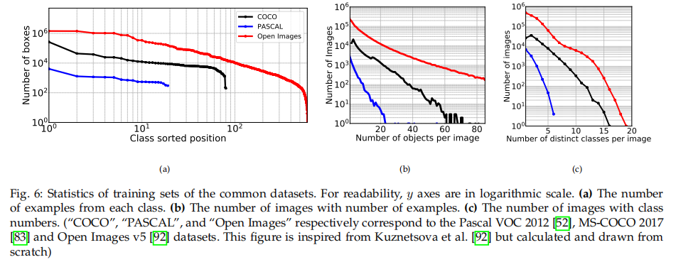

_解决方案：_ 生成模型设计用于产生额外的训练样本，可以用于避免前景-前景的不平衡问题。另一种方法从目标检测的角度处理这类不平衡问题[25]。它们“微调目标检测长尾分布（finetuning long-tail distribution for object detection）”的方法提供了对该级别问题训练过程的影响的分析，并从视觉的角度对相似的类进行聚类。在他们的分析中，影响训练的两个因素是相同的：（i）预测准确率和（ii）样本数量。基于这一观察，他们基于预训练骨干网络（即GooLeNet）的最后一层的内积精心设计了类别之间的相似性度量，并层次地分组类以补偿数据集级前景类不平衡。

###### 4.2.2 Foreground-Foreground Imbalance Owing to the Batch
_定义：_ 批中的类分布可能是不均匀的，在学习中引入偏差。图5（b）展示了MS-COCO数据集中分配给每个类的平均的锚数量。随机采样方法期望分配不平衡数量的正类样本，并偏向与具有更多锚的样本，这可能导致模型在训练期间偏向与过表示的类。图6（b）和（c）展示了图像中明显变化的目标数量和类别数。

_解决方案：_ _Online Foreground Balanced (OFB) sampling_ [65]证明通过将概率分配到每个采样的边界框可以避免批量级的前景-前景类不平衡问题，它使得批中不同类的分布是均匀的。换句话说，该方法旨在在采样过程中促进具有少量正样本的类。虽然该方法有效，但是性能提升不明显。然而，[65]并没有分析是否是批级不平衡导致学习中偏差，我们将在第9节中讨论。

#### 5 IMBALANCE 2: SCALE IMBALANCE
我们从两个部分讨论尺度不平衡问题：(1) Object/Box-Level Scale Imbalance，(2) 特征不平衡。

##### 5.1 Object/Box-Level Scale Imbalance
_定义：_ 当数据集中目标/输入边界框过度表示时，会发生尺度不平衡。图7呈现了MS-COCO数据集中目标的相对宽、高和面积；我们观察到分布偏斜，有利于较小的对象。

多数深度目标检测器依赖骨干卷积神经网络（通过图像分类任务预训练），从而提取输入图像的视觉特征。DetNet[98]讨论了采用实际用于分类任务的网络的优势，并提出专门为目标检测任务设计的骨干网络，该网络为高级特征限制了空间下采样率。

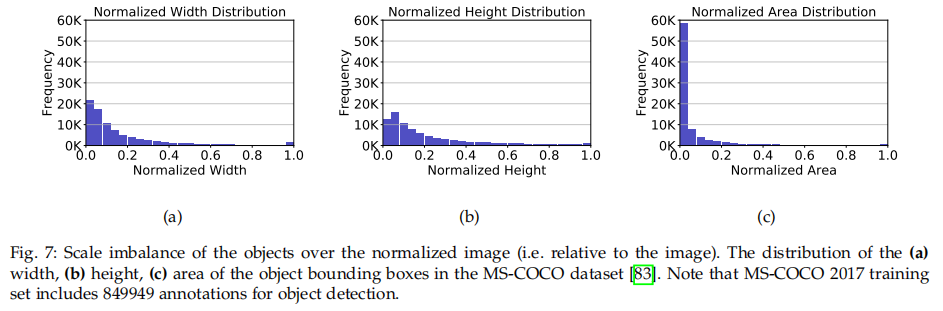

_解决方案：_ 最开始的深度目标检测在骨干网络的最后一层预测（见[16],[17]和图8（a）），因此缺乏边界框的尺度变化。解决尺度不平衡问题的方法可以分为四中（图8）：直接从骨干特征层次结构上预测（图8（b））、基于特征金字塔（图8（c））、基于图像金字塔（图8（c））和图像金字塔与特征金字塔结合（图8（d））。

###### 5.1.1 Methods Predicting from the Feature Hierarchy of Backbone Features
该类方法直接考虑骨干网络的层次结构，SSD便是最典型的应用。两阶段检测器可以在估计区域的同时（第一阶段）利用不同尺度的特征，或者从这些区域提取特征（第二阶段）。例如MSCNN在第一阶段中使用骨干网络的不同层，同时估计区域，而Yang等人[67]基于估计的RoI选择合适的层来池化（称为Scale Dependent Pooling（SDP））
，如果RoI的高度较小，便从早期层池化特征。_Scale Aware Fast R-CNN_ [69]学习两个分类器的集成，一个用于小尺度目标，另一个用于大尺度目标，并组合它们的预测。

###### 5.1.2 Methods Based on Feature Pyramids
使用骨干网络固有的层次结构特征的方法没有集成低级和高级特征。然而，不同层的信息的抽象（语义内容）是不同的，因此直接从骨干网络的不同层（特别是底层）作出预测是不可靠的。为此，FPN在预测之前结合了不同层的特征。FPN利用一条附加的自上而下的途径，使用横向连接使较高层次的特征得到较低层次的特征的支持，以使这些特征得到均衡融合（见图8（c））。top-down路径包含上采样（确保尺寸一致）和 $1 \times 1$ 卷积层的侧连接，RoI池化考虑RoI的尺度来选择从哪一层池化。这种改进允许预测网络应用到所有层，其提高检测性能，特别是小型和中型尺寸的对象。

尽管可以从FPN获益，但是由于从骨干网络中融合特征的直接组，FPN存在一个主要缺点——特征不平衡问题（在5.2节讨论）。

###### 5.1.3 Methods Based on Image Pyramids
使用多尺度图像金字塔的思想在深度学校之前便已流行。SNIP[27]详细分析了尺度不平衡问题，并得出重要结论。他们还提出缓解内存限制的方法。他们研究了由于内存限制而提出的在较小尺度上训练目标检测器，在更大尺度上进行测试的方法，并证明测试和训练时的不一致会影响性能。在他们的控制实验中，上采样图像两倍比减少两倍步长更有效。根据他们的分析，作者提出称为SNIP的新颖方法，该方法基于图像金字塔而不是特征金字塔。它们认为，通过向适当的检测器提供输入来训练特定于尺度的检测器将丢失大量数据，通过保持数据的不变形而在单个检测器上使用多尺度训练将增加尺度不平衡。**因此，SNIP利用不同尺寸的图像训练多个提议和检测器网络，然而，对于每个网络，仅将合适的输入边界框标记为有效，通过如此操作确保多尺度训练而没有数据损失。** GPU内存限制的问题通过图像裁剪方法克服，图像裁剪方法更加有效，并称为SNIPER。

###### 5.1.4 Methods Combining Image and Feature Pyramids
_Scale Aware Trident Networks_ [70]集合了基于特征金字塔方法和图像金字塔方法的优势。特别地，基于图像金字塔的方法由于基于特征金字塔的方法，因为基于特征金字塔的方法是基于图像金字塔方法的近似。因此，**为了生成尺度特定的特征图，作者在并行分支中使用具有不同膨胀率的膨胀卷积，使得该方法比基于特征金字塔的方法更加准确。图8（e）中，三个分支的膨胀率分布为1、2和3 。为了保证每个分支专门用于特定的尺度，该方法根据输入包围框的尺寸将框输入到合适的分支。** 它们对不同尺度目标的有效感受野大小的分析证明更大尺度的目标更适合更大的膨胀率。另外由于增加使用多分支增加了操作数量，从而使其效率衰减，所以它们提出 **利用单一参数共享分支来近似这一分支**，而保证最小（不明显）的性能损失。

##### 5.2 Feature-level Imbalance
_定义：_ 骨干网络的特征集成在高低层特征方面是平衡的，使其可以遵循一致的预测。为了更加具体，如果我们分析图9中的常用的FPN架构，我们会注意到，从具有低级特征的bottom-up路径的C2层到特征金字塔的P5层中，C2层直接集成到P2层，这意味着P2和P5层中高级和低级特征的影响是不同的。

_解决方案：_ 存在几种方法来处理PFN架构中国的不平衡问题，它们的范围从设计改进的top-down连接到完全新颖的架构。这里，我们认为这些方法使用新颖的架构缓解了特征级不平衡问题，我们根据它们使用的基础，分为两类：金字塔特征或者骨干特征。

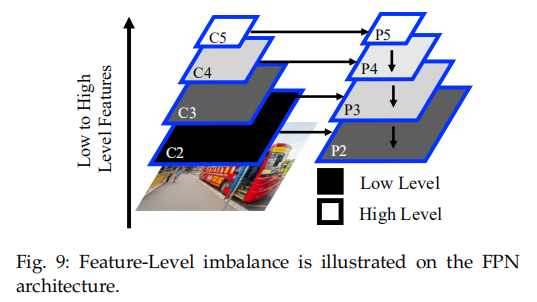

###### 5.2.1 Methods Using Pyramidal Features as a Basis
这些方法旨在使用额外的操作和步骤来改善金字塔特征（见图10（a，b）。

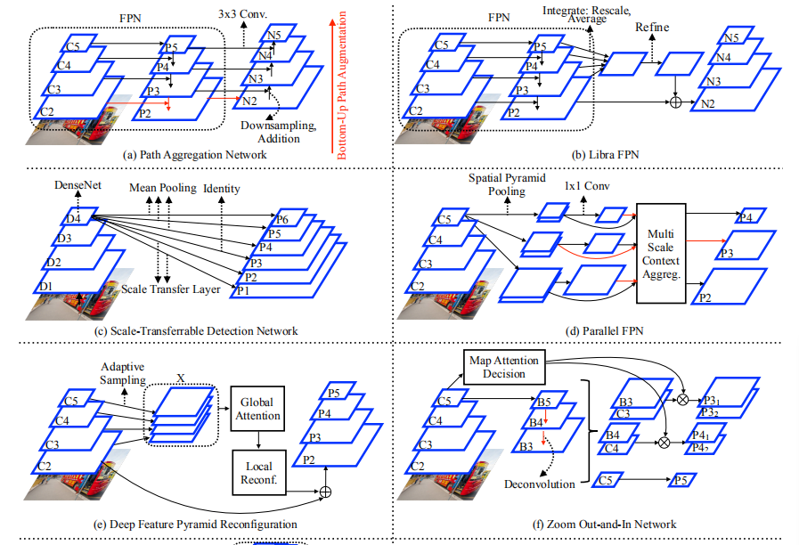

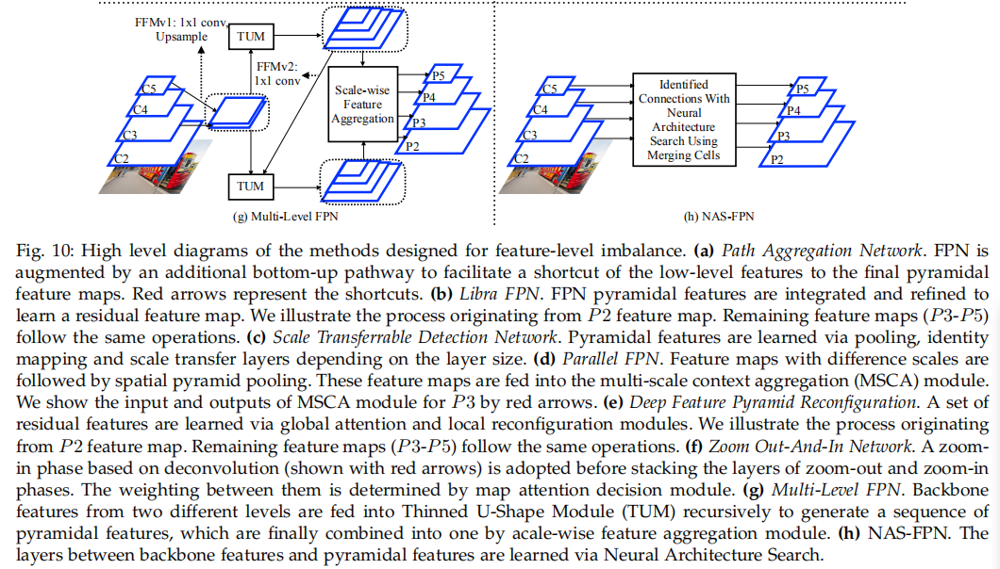

_Path Aggregation Network (PANet)_ [71] 首先证明FPN融合的特征可以进一步增强，RoI可以映射到金字塔的每一层，而不是将它与某一层单独关联。作者认为低级特征（如线）有助于定位目标，然而FPN架构不能有效地利用这些特征。受此启发，PANet从两方面改进FPN：
- 1）_Bottom-up path augmentation_ 为了允许低级特征以更短的步长到达预测发生的层，扩展了特征金字塔。因此，在初始层中为特征创建了快捷连接（shortcut）。由于这些特征有关于位置的丰富信息（这是由于边缘或这实例部分），这显得非常重要。
- 2）虽然在RoI中，每个RoI根据它的尺寸与单一的特征层关联，PANet将每个RoI关联到每一层，然后应用RoI池化，并使用逐元素最大或加法运算融合，最后将固定尺寸的特征网格传入检测器网络。这一过程称为自适应特征池化（Adaptive Feature Pooling）。

尽管有这些贡献，PANet仍然使用有序的路径提取特征。

与PANet有序的增强路径不同，Libra FPN通过一次使用所以的FPN层特征来学习残差特征（见图10（b））。残差特征层的计算有两步：
- 1) _Integrate:_ 不同层的所有特征图通过缩放或平均变换为一个单一的特征图。因此，这一步中没有可学习的参数。
- 2）_Refine:_ 通过卷积层的均值或非局部网络[105]来细化集成的特征图。

最后，细化的特征加到金字塔特征的每一层。作者认为，除了FPN，他们的方法还可以作为其他基于金字塔特征（如PANet）方法的补充。

###### 5.2.2 Methods Using Backbone Features as a Basis
这些方法在骨干特征上构建它们的架构，通过采用不同的特征集成机制来忽略FPN的top-down路径，如图10（c-h）所示。

_Scale-Transferrable Detection Network(STDN)_ 从使用DenseNet块提取的骨干特征的最后一层生成金字塔特征（图10（c））。在DenseNet块中，所有的更低级特征传入块中的每个下一层。在图10（c）中，DenseNet块的数量为四，并将第 $i$ 个块表示为 $D_i$ 。受更低级特征层直接传入后续层也能携带更低级信息的启发，**STDN使用DenseNet的最后一个块构建了六层的金字塔特征** 。为了将特征图映射到更低的尺寸，该方法使用具有不同感受野的平均池化。对于第四个特征图，使用了恒定映射。为了将最后两层中DenseNet的特征图被映射到更高维度，作者提出了 _scale transfer layer_ 的方法。该层没有任何可学习的参数，并且给定 $r$ （期望特征图增大的倍数），特征图的宽和高通过减少特征图的总数（也称为通道）来扩大特征图的宽和高 $n$ 倍。STDN **在 DenseNet 块的帮助下包含了高级和低级特征，而不能轻松适应其他骨干网络。此外，没有采取办法来平衡DenseNet最后一块中的高级和低级特征。**

与STDN相似，**_Paralle FPN_ [73]也采用骨干网络的最后一层，并通过利用空间金字塔池化（SPP）生成多尺度特征（图10（d））。不同地是，它通过以不同的大小多次池化骨干网的最后D个特征图来增加网络的宽度，从而获得具有不同尺度的特征图。** 如图10（e），特征图被池化三次，$D=2$ 。**通过使用 $1 \times 1$ 的卷积将特征图减小到1。然后，这些特征图别传入 _multi-scale context aggregation（MSCA）module_ ，其从其他层为相应层集成上下文信息。** 因此，MSCA（以基于尺度的方式运行）有如下输入： **空间金字塔池化的 $D$ 个特征图和从其他尺度推到的特征图**。MSCA首先确保特征图相等，并应用 $3 \times 3$ 卷积。

_Deep Feature Pyramid Reconfiguration_[74] 与前面的仅使用骨干网络最后层不同，它 **将骨干特征的不同层组成单一张量（图10（e）中的 $X$），然后从这个张量中学习一组残差特征** 。为了将学习到的残差特征图添加到骨干网络的每一层，将两个模块的序列添加到张量 $X$ 。这两个模块是：
- 1）_Global Attetion Module_ 旨在为张量 $X$ 学习不同特征图之间的相互依赖。作者采用“Squeeze and Excitation Block” ，其将最初的每个特征图压缩到更低维特征（即squeeze），单后基于可学习的函数（包括非线性层）为每个特征图学习权重（即excitation）。
- 2）_Local Configuration Module_ 旨在通过使用卷积层在全局注意模块之后改善特征。该模块的输出显示了要从骨干网络为特征层添加的剩残差特征。

相似地，_Zoom Out-and-In Network_ 也结合了骨干网络的低级和高级特征。此外，它包含基于反卷积的zoom-in阶段，其学习中间步骤金字塔特征，表示为 $Bis$ （如图10（f））。注意，在zoom-in阶段，与FPN不同，没有连接到骨干网络的侧连接，其为反卷积层序列（见zoom-in阶段中的红色箭头）。通过在zoom-in阶段之后堆叠zoom-out阶段和zoom-in阶段中相同尺寸的特征图（例如 $B3$ 和 $C3$）来获得高级和低级特征的集成。另一方面，由于 $B3$ 和 $C3$ （或者 $B4$ 和 $C4$）在特征层次中彼此相距很远，因此要特别针对 $B3-C3$ 和 $B4 - C4$ 平衡这些串联的特征，这使得它们具有数据的不同表示。为了获得这种表示，提出的 _map attention decision module_ 学习这些层上的权重分布。注意这种思想与的Squeeze-and-Excitation模块相似，但是作者证明它们的设计更适合它们的架构。该方法的缺点是构建在Inception v3（也称为Inception BN），并在整个模型中采用相应的Inception模块，这可能使得该方法难以适应其他骨干网络。

与 _Deep Feature Pyramid Reconfiguration_ 和 _Zoom out-and-In Network_ 不同，_Neural Architecture Search FPN(NAS-FPN)_ 旨在在给定骨干特征的情况下使用神经架构搜索方法搜索最佳的架构以生成金字塔特征（图10（h））。这种思想之前是用于图像分类任务，并被证明性能良好。该方法基于融合单元（merging cell），它是输入特征之间的连接的构建块。每个merging cell的设计通过控制器RNN作出决策来寻找最佳配置。训练该RNN使得它在四点作出预测：（1）组合的第一层，（2）组合的第二层，（3）组合的输出大小（例如分辨率）以及（4）组合的二值运算，其要么为求和要么为最大池化。当选择的特征图与输出分辨率不同时，输入特征使用最近邻采用或上采样来调整特征，然后将操作用到输入上。注意，顺序也通过控制器确定。最后，其余不产生任何输出的特征图被添加到相应的具有相同尺寸的特征图。Det-NAS是在目标检测器设计中也采用NAS的另一个案例。考虑到在其他任务（如EfficientNet）上的性能，以及搜索空间的不同定义，使用NAS方法可能产生更好的性能。

#### 6 IMBALANCE 3： SPATIAL IMBALANCE
_定义：_ 大小、形状、位置——都与图像或另一个框有关——以及IoU是包围框的空间属性。如此属性中的任何失衡问题都可能影响训练和泛化性能。例如，如果没有采用合适的损失函数，位置上的轻微平移可能导致回归（定位）损失剧烈变化，引起损失的不平衡。本节中，我们讨论这些特定于空间属性和回归损失的问题。

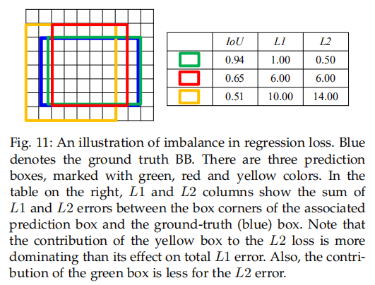

##### 6.1 Imbalance in Regression Loss
_定义：_ 这个失衡问题与不同个体实例对回归损失的不均衡贡献有关。图11展示了使用 $L1$ 和 $L2$ 损失的问题，其中难样本（即具有较低IOU的黄色框）主导 $L2$ 损失，而 $L1$ 损失分配了相对更多的平衡误差到所有样本。

_解决方案：_ 目标检测的回归损失主要在一下两个方面革新：第一个是基于 $Lp$ 范数（例如 $L1$ 和 $L2$）的损失函数，第二个是基于IOU的损失函数。表5表示广泛使用的BB回归损失的比较。

_Smoothing L1 Loss_ 是第一个专门用于深度目标检测器的损失函数，由于它减小了离群点影响（相比 $L2$ 损失）以及对于较小误差更稳定（相比 $L1$ 损失）。Smooth $L1$ 损失，其是Huber损失的特例，定义为：
$$
L1_{smooth}(\hat{x}) =
\begin{cases}
0.5 \hat{x}^2 , & \mbox{if } \hat{x} < 1 \\
|\hat{x} - 0.5|, & \mbox{otherwise }
\end{cases}  \tag{9}
$$
其中 $\hat{x}$ 为估计和目标BB坐标之差。Smooth L1损失现在已称为目标检测中回归的标准损失函数。

受离群点的梯度仍对Smooth L1损失中具有更小梯度的内部点的学习有负影响，_balanced L1 Loss_增加了内部点的梯度对全部损失值的贡献。作者首先得出了损失函数的定义，该函数的定义来自于各个内在点和离群点的理想平衡梯度：
$$\frac{\partial{L1_{balanced}}}{\partial{\hat{x}}}=
\begin{cases}
\alpha \ln(b|\hat{x}|+1), &\mbox{if } \hat{x} < 1 \\
\theta, &mbox{otherwise},
\end{cases} \tag{10}
$$
其中 $\alpha$ 控制提升了多少内部点（较小的 $\alpha$ 增加了内部点的贡献）；$\theta$ 是帮助任务间平衡的误差的上界。公式（10）求积分，$L1_{balanced}$ 推导如下：
$$
L1_{balamced}(\hat{x}) =
\begin{cases}
\frac{\alpha}{b}(b|\hat{x}|+1)\ln(b|\hat{x}|+1)) - \alpha|\hat{x}|, \mbox{if } |\hat{x} < 1| \\
\gamma|\hat{x}| + C, \mbox{otherwise}
\end{cases} \tag{11}
$$
其中 $b$ 用于确保 $L1_{balanced}(\hat{x}=1)$ 是一个连续函数，而超参数之前的关系为：
$$\alpha\ln(b+1) = \gamma. \tag{12}$$
由于更加注重内部点，Balanced $L1$ 损失改善了性能，特别是对于更大的IoU（即将AP@0.75提高了1.1%）。

_Kullback-Leibler Loss(KL Loss)_ 是受ground-truth框在某些情况下是模糊不清（由于遮挡、ground-truth的形状或者不准确的标签）的这一事实驱动。为此，作者旨在预测每个BB坐标的概率分布，而不是直接的BB预测。这种思想与IoU-Net相似，IoU-Net旨在预测当前的IoU。不同的是，KL Loss假设每个框的坐标是独立的，并服从均值为 $\hat{x}$ 标准差为 $\sigma$ 的高斯分布。因此，除了传统的框，添加了一个分支来预测标准差，即 $\sigma$ ，并使用预测和ground-truth之间的KL散度来反向传播损失使得ground-truth是通过中心为框坐标的Dirac delta分布。利用这种假设，作者证明KL损失有如下比例关系：
$$L_{KL}(\hat{x}, \sigma) \propto \frac{\hat{x}^2}{2\sigma^2} + \frac{1}{2}\log \sigma^2 \tag{13}$$
它们也采用与smooth $L1$ 相似的梯度剪裁以减小异常点的影响。在NMS期间，还提出一个投票方案来组合具有基于每个框的确定性的不同概率的边界框；然而，该方法超出了我们文章的范畴。注意，边界框的概率分布的选择至关重要，因为损失函数的定义受该选择的影响。力图，在式（13）的例子中，当 $\sigma = 1$ 时退化为欧式距离。

除了基于 $Lp$ 范数的损失函数，也有基于IoU的损失函数[79]，其利用了IoU可微的本质。IoU损失直接公式化基于IoU的损失成功地训练了目标检测器：
$L_{IoU} = -\ln(IoU). \tag{14}$

另一种利用 $1 - IoU$ 的度量本质是的方法是 _Bounded IoU_ 损失[80]。该损失将 $1 - IoU$ 的修改版封装到smooth $L1$ 函数中。修改涉及通过固定除要计算的参数以外的所有参数来限制IoU，这意味着计算一个参数的最大可达到IoU：
$$L_{BIoU}(x,\hat{x}) = 2L1_{smooth}(1 - IoU_B(x, \hat{x})), \tag{15}$$
其中边界框通过中心坐标、宽和高表示为 $[c_x, c_y, w, h]$ 。这里，我们用 $c_x$ 表示ground-truth，$\bar{c}_x$ 表示检测。$IoU_B$ 定义如下：
$$IoU_B(c_x,\hat{x})=\max(0, \frac{w-2|\bar{c}_x-c_x|}{w+2|\bar{c}_x-c_x|}), \tag{16}$$
$$IoU_b(w, \bar{w})=\min(\frac{\bar{w}}{w}), \frac{w}{\bar{w}}. \tag{17}$$
在如此的设置下， $IoU_B \ge IoU$ 。同时，为了使分类和定位任务范围的一致和减小离群点的影响，将基于IoU的损失函数封装到smooth $L1$ 函数。

受最佳的损失函数是性能度量本身，在 _Gerneralized Intersection over Union(GIoU)_ 证明IoU可以直接优化，并且IoU和所提出的GIoU可以用作损失函数。GIoU被提出用作性能度量和损失函数，同时通过引入额外的最小的包围框 $E$ 来改进IoU的主要缺点（即当 $IoU=0$时变得平坦）。以如此的方式，即使两个框不重叠，GIoU值可以设计用于它们，并且这允许贯穿整个输入域都有非零的梯度，而不是限制 $IoU > 0$ 。与IoU不同， $GIoU(B,\bar{B}) \in [-1, 1]$ 。有了计算出的 $E$，GIoU定义为：
$$L_{GIoU}(B,\bar{B})=IoU(B,\bar{B})-\frac{A(E)-A(B\cup\bar{B})}{A(E)} \tag{18}$$
其中 GIoU 是IoU的下界，并且当 $A(B\cup\bar{B})=A(E)$ 时，它收敛到 IoU 。GIoU维持了IoU的优势，并且在 $IoU=0$ 时，可微。另一方面，因为根据定义，正类标签的BB的IoU大于0.5，函数的这一部分永远不会在实际中被访问到，但是GIoU损失仍然优于直接将IoU作为损失函数。

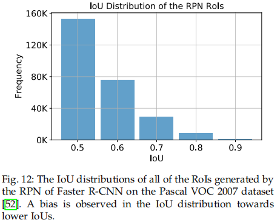

##### 6.2 IoU Distribution Imbalance
_定义：_ 当输入边界框有倾斜的IoU分布时，可以观察到BB IoU不平衡，如图12。我们观察到该分布倾向更低的IoU，并且与更低的IoU相比，更高IoU的样本量较少。考虑到RPN回归器改善RoI的位置，我们预计预定义的锚（例如RetinaNet使用的）有更加倾斜的分布。

_解决方案：_ _Cascade R-CNN_ 首次用于处理IoU不平衡问题。有如下观点：（i）对于单个IoU阈值，单个检测器可以最优的，（ii）对于单个阈值，倾斜的IoU分布使回归器过拟合。受这两个观点启发，Cascade R-CNN正类样本的IoU分布影响回归分支，为了缓解这个问题，作者针对正样本，训练了三个IoU阈值分别为0.5、0.6和0.7的级联检测器。后续的级联阶段使用前一个阶段的预测，而不是使用新的采样方案。以这种方式，分布的倾斜度可以从左倾转移到近似均匀，甚至是右倾，因此，针对模型训练的最优的IoU阈值，有了足够的样本。作者证明这样的级联方案比前面迭代应用相同网络到边界框的方案（如Multi-Region CNN和AttractionNet）更好。

其他研究中，Oksuz等人[65]更加详细的分析了IoU分布，它们针对不同的IoU分布，使用正类RoI生成器执行一系列实验。它们总结了如下有趣的发现：（i）输入边界框的IoU分布不仅影响回归，还影响分类的性能。（ii）与Pang等人[29]的发现相似，样本的IoU与它们的难度相关。然而，与Cao等人[30]的观点冲突，Cao等人认为OHEM仅用于正类样本时，会产生负影响，而Oksuz等人[65]证明OHEM的影响依赖正类输入框的IoU分布。当右倾的IoU分布与OHEM使用时，观察到显著的性能增加。（iii）当IoU分布均匀时获得最佳性能。

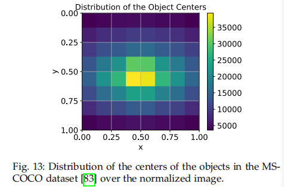

##### 6.3 Object Location Imbalance
_定义：_ 为了确定关注图像哪里，当前的深度目标检测器采用锚作为滑动窗口，因此整个图像中的目标的分布很重要。对于大多数方法，锚在图像中都是均匀分布的，使得图像中的每个部分都被视为同等重要。另一方面，图像中的目标不服从均匀分布（见图13）。

_解决方案：_ 受目标在图像上不是均匀分布的启发，Wang等人[66]（Region proposal by guided anchoring）目标是同时学习锚的属性。相比Tong等[119]的工作，为了减少锚的数量并同时提高召回率，作者除了学习锚的尺度和纵横比外，还学习锚的位置。具体而言，给定骨干特征图，预测分支设计用于为这些任务中的每一个生成锚：（i）锚的位置预测分支为每个位置预测一个概率以确定是否在该位置包含一个目标，并基于输出概率采用硬（hard）阈值法来确定这个锚，（ii）锚形状预测分支为每个位置生成锚的形状。由于锚在图像中变化，与在特征图上使用全卷积的分类器（即一阶段生成器和RPN）不同，为了有一个依赖锚大小的平衡的特征表示，作者提出基于可变形卷积的锚引导特征适应（anchor-guided feature adaptation）。以这种方式，作者减少了90%的锚，却增加了9.1%的平均召回率。

##### 6.4 Other Spatial Imbalance Problems
目标检测器的分析和减小不平衡的方法反应了如下的不平衡问题仍没有识别或解决（作者将在第9节更详细的讨论）：（i）正类输入边界框与其相应的ground-truth的相对空间分布，（ii）图像中重叠的输入边界框的数量的不平衡，（iii）目标方向的不平衡。

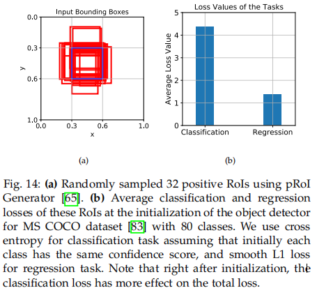

#### 7 IMBALANCE 4: OBJECTIVE IMBALANCE
_定义：_ 目标不平衡属于训练中最小化的目标（损失）函数。根据定义，为了同时解决分类和回归任务，目标检测需要多任务损失。然而，由于如下问题，不同的任务可能导致不同恒：（i）任务中的梯度的范数可能不同，并且一个任务可能在训练中占据主导（见图14）；（ii）不同任务的损失函数的范围可能不同，这妨碍了任务的一致性和平衡优化；（iii）任务的难度可能不同，其影响学习的任务的速度，并因此阻碍训练过程。图14给出了分类损失占据整个梯度的案例。

_解决方案：_ 最常用的解决方案是 _Task Weighting_ ，其通过附加的作为权重因子的超参数平衡损失项。使用验证集来选择超参数。显然，如在两阶段检测器的案例中，增加任务的数量会增加权重因子的数量和（超参数）搜索空间的维度（注意在两阶段检测器中有4个任务，在一阶段检测器中有2个任务）。

从多任务的本质抛出了不同损失函数之间可能的范围不一致问题。例如， _AP Loss_ 、smooth L1处于对数范围 $[0, \infty]$ 中（由于损失的输入通常在对数变换之后），它们用于回归，而 $L_{AP} \in [0, 1]$ 。里一个例子是GIOU Loss，其范围为 $[-1, 1]$ ，并与交叉熵损失一起使用。作者将GIOU Loss的权重因子设置为10，并使用正则化来平衡法范围差距，以及确保平衡训练。

由于平衡不同范围的项更具挑战，因此更好的策略是首先使范围可相比。一种更杰出的组合分类和回归任务的方法是 _Classification-Aware Regression Loss(CARL)_ [30]，其假设分类和回归任务是相关的。为了组合损失项，回归任务通过一个由边界框（分类）置信度分数确定的系统缩放：
$$L_{CARL}(x) = c_i' L1_{smooth}(x), \tag{19}$$
其中 $c_i'$ 是基于 $p_i$ 的因子，即由分类任务估计。以这种方式，回归损失还将梯度信号贡献给了分类分支，并因此，这个公式允许促进高质量（prime）样本的定位质量。

CARL的贡献是采用了分类和回归任务之间的关系。然而，如作者在9.5节讨论的，这种关系应当被更广泛的研究和利用。

#### 8 IMBALANCE PROBLEMS IN OTHER DOMAINS

#### 9 OPEN PROBLEMS AND RESEARCH DIRECTIONS
