### Libra R-CNN: Towards Balanced Learning for Object Detection

#### 摘要

​		在目标检测中，与模型架构相比，训练过程（对检测器的成功来说也很关键）受到相对较少的关注。本文中，作者仔细回顾了目标检测器的标准训练实践，并发现检测性能受限于训练过程中的不平衡，这种不平衡通常包含3个级别——样本级、特征级和目标函数级。为了减轻由此引起的不利影响，我们提出了Libra R-CNN，这是一种简单而有效的框架，旨在实现针对目标检测的平衡学习。它集成了三种新颖的组件：IoU-balanced sampling、balanced feature pyramid和balanced L1 loss，这三个组件分别用于减小样本、特征和目标函数级的不平衡。受益于整体平衡的设计，Libra R-CNN显著提高了检测性能，在MSCOSO数据集上，它比FPN Faster R-CNN和RetinaNet分别高了2.5点和2.0点的AP。

#### 1. 引言

​		现代检测框架遵循常用的训练范式，即对区域进行采样、提取特征，然后在标准的多任务目标函数的指导下联合识别类别并细化位置。

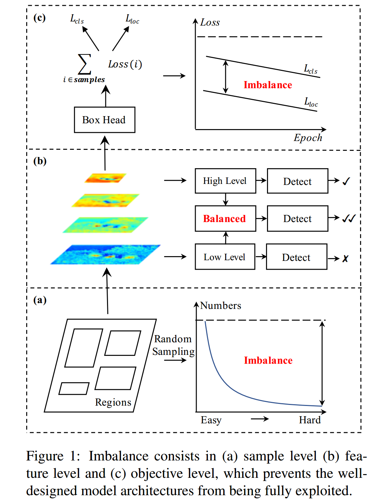

​		基于这种范式，目标检测器的成功训练依赖三个关键方面：（1）选择的区域样本是否具有代表性，（2）是否完整地利用提取的视觉特征，（3）设计的目标函数是否是最优的。然而，作者的研究表明常用的训练过程在这些方面是明显不平衡的。这种不平衡问题阻碍完整利用良好设计的模型架构的能力，因此限制了整体性能（如图1所示）。接下来作者依次描述了这些问题：

**1）Sample level imbalance：** 在训练目标检测器时，由于难样本对于提高检测性能更有效，所有它们尤为重要。然而，随机采样方案通常导致选择的样本以简单样本为主。流行的硬挖掘方法（例如OHEM）可以帮助将重点放在难样本。但是，它们通常对噪声标签很敏感，并导致相当大的内存和计算成本。Focal Loss也减轻了单级检测器中的这个问题，但是当扩展到R-CNN时发现改善不大，因为大多数简单的负样本都通过两阶段程序进行了过滤。因此，这个问题需要更加优雅的解决方案。

**2）Feature level imbalance：** 骨干网络中的深度高级特征具有更多的语义信息，而浅层的低级特征具有更多的内容描述。FPN、PANet告诉我们目标检测低级和高级特征信息是相互补充的。然而，**哪个方法才是将它们集成在一起的最佳方法？**作者的研究表明**集成的特征应当具有每个分辨率的平衡信息**。但是**前面提到的方法中顺序方式会使集成的特征更加关注相邻的分辨率，而其他分辨率较少**。**在信息流期间，每次融合将对不相邻级别中包含的语义信息进行一次稀释。**

**3）Objective level imbalance：** 检测器需要携带两个任务，即分类和定位。因此，这两个不同的目标要在训练目标中处理。如果没有适当的平衡，那么一个目标可能受到损害，从而导致次优整体性能。这种情况与训练过程涉及的样本相同。如果没有恰当的平衡，简单样本产生的小梯度可能淹没在困难样本产生的大梯度中，因此限制了进一步精炼。所以，需要重新平衡设计的任务和样本，以实现最佳收敛。

​		为了缓解这些问题引起的副作用，作者提出Libra R-CNN，这是一个简单而有效的目标检测框架，显示地在上述讨论的三个级别实现平衡。该框架集成三个新颖的组件：（1）_IoU-balanced sampling_，其根据它们与其分配的ground-truth之间的IoU挖掘困难样本；（2）_balanced feature pyramid_，其使用相同的深度集成的平衡语义特征来增强多级特征；（3）_balanced L1 loss_，其可以提升关键梯度，从而重新平衡所涉及的分类，整体定位和准确的定位。

​		Libra R-CNN在MS-COCO上分别比FPN Faster R-CNN和RetinaNet提高了2.5点和2.0点的平均准确率。使用$1 \times$的计划，Libra R-CNN利用基于ResNet-50和ResNeXt-101-64x4d的FPN Faster R-CNN可以获得38.7和43.0的AP。

​		本文的主要贡献：（1）作者系统地回顾了检测器的训练过程，本文的研究揭示了三个级别的不平衡问题，它们限制了检测性能；（2）作者提出Libra R-CNN通过组合三个新的组件（IoU-balanced sampling、balanced feature pyramid和balanced L1 loss）来重新平衡训练过程。（3）作者在MS COCO上测试所提出的框架，在包括一阶段和两阶段的最佳检测器上获得明显的提上。

#### 2. 相关工作

​		**样本级不平衡。** 常用的OHEM根据它们的置信度自动选择困难样本。然而，这一过程会引起**额外的内存和速度成本**，使得训练过程膨胀。此外，OHEM还带有**噪声标签**，因此无法在所有情况下均正常工作。焦点损失通过优雅的损失公式解决了一阶段检测器中额外的前景-背景类不平衡问题，但由于不平衡情况的不同，它通常给两阶段检测器带来很少或没有收益。

#### 3. 方法

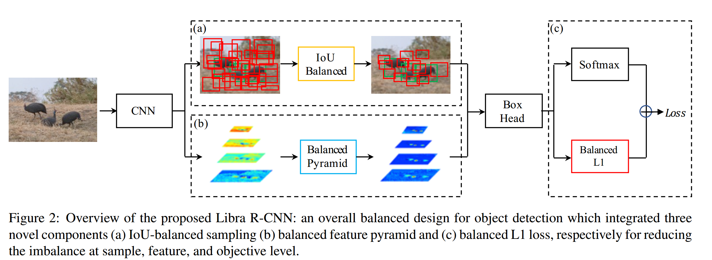

​		Libra R-CNN的整体管道如图2所示。本文的目标是使用整体平衡的设计来缓解检测器训练过程中存在的不平衡，因此要尽可能的利用模型架构的潜力。

##### 3.1. IoU-balanced Sampling

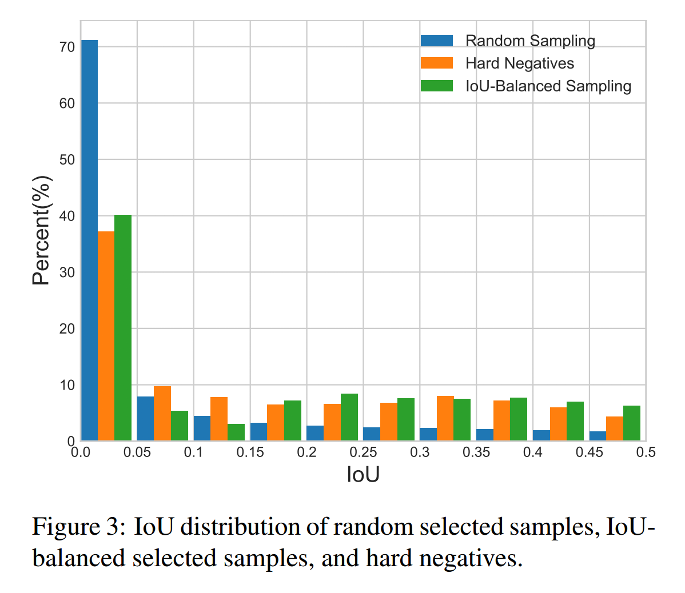

​		作者从一个基本问题开始：**训练样本与其对应的ground-truth之间的重叠是否与其难度相关？**为了回答这个问题，作者执行实验以找出这背后的事实。结果如图3所示。本文主要考虑困难的负样本，这是已知的主要问题。作者**发现超过60%的困难负样本的重叠大于0.05，但是随机采样仅提供了超过这一阈值的30%的训练样本**。这种极端的样本不平衡将大量困难样本埋葬到成千上万的简单样本中。

​		受这种观察启发，作者提出IoU-balanced采样：一种简单而有效的难样本挖掘方法，而没有额外的成本。假设需要从$M$个相关候选中采样$N$个负样本。在随机采样下每个样本被选中的概率为

$$p=\frac{N}{M}. \tag{1}$$

​		为了提高困难负样本被选中的概率，作者根据IoU均匀地将采样间隔划分为$K$个bin。将$N$个负样本平均分配到每个bin。然后，从它们中均匀地选择样本。因此，得到IoU-balanced采样下被选中的概率：

$$p_k=\frac{N}{K}*\frac{1}{M_k},k\in[0,K), \tag{2}$$

其中$M_k$为对应区间（表示为$k$）中采样候选的数量。本文实验中，默认设置$K$为3。

​		IoU-balanced采样的采样直方图如图3中绿色直方图。可以看出本文的IoU-balanced采样可以引导训练样本的分布接近困难负样本之一。实验还表明，只要尽可能选择更高IoU的样本，该性能对$K$不敏感。

​		此外，值得注意的是这种方法也适合困难的正样本。然而，大多数情况下，没有足够的采样候选将这一过程扩展到正类样本。为了使平衡采样过程更加全面，作者为**每个ground-truth采样相等的正类样本**。

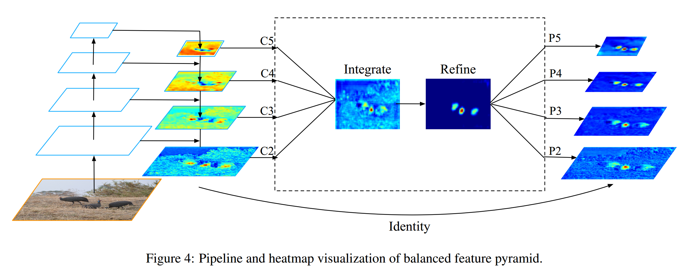

##### 3.2. Balanced Feature Pyramid

​		与前面使用侧连接集成多级特征的方法不同，本文的关键思想是使用相同的深度集成的平衡语义特征来增强多级特征。该管道如图4所示。它包含4个步骤、缩放、集成、精炼和增强。

​		**获取平衡的语义特征。** 分辨率级$l$的特征表示为$C_l$。多级特征的数量表示为$L$。涉及最低级和最高级的索引表示为$l_{min}$和$l_{max}$。为了同时集成多级特征并保留它们的语义层次，作者首先使用插值和最大池化将多级特征$\{C_2,C_3,C_4,C_5\}$缩放到中间尺寸，即$C_4$相同的尺寸。一旦特征被缩放，_平衡的语义特征_通过简单平均获得：

$$C=\frac{1}{L}\sum_{l=l_{min}}^{l_{max}}C_l.\tag{3}$$

​		然后使用相同但相反的步骤重新缩放获得的特征，以增强原始特征。这一过程中，每个分辨率从其他分辨中获得相等的信息。注意，这一过程没有包含任何参数。作者观察到这种非参数化方法的改进，证明了信息流的有效性。

​		**精炼平衡的语义特征。** 平衡的语义特征可以进一步精炼使其更具辨别性。作者发现使用卷积和非局部模块[32]效果都很好。因此，作者默认使用嵌入Gaussian非局部注意力。精炼步骤有助于增强集成特征，并进一步提高结果。

​		使用这种方法，从低级到高级的特征同时得到聚合。输出$P_2,P_3,P_4,P_5$用于目标检测，该检测方法遵循FPN中相同的管道。还值得一提的是，本文的平衡特征金字塔可以与FPN和PAFPN等最新解决方案互补，而不会产生任何冲突。

##### 3.3. Balanced L1 Loss

​		自Faster R-CNN [7]以来，在多任务丢失的指导下，分类和定位问题可以同时解决，其定义为

$$L_{p,u,t^u,v}=L_{cls}(p,u)+\lambda[u\ge1]L_{loc}(t^u,v).\tag{4}$$

$L_{cls}$和$L_{loc}$是分别与识别和定位对应的目标函数。$L_{cls}$的预测和目标表示为$p$和$u$。$t^u$是类$u$对应的回归结果。$\lambda$用于调整多任务学习下的损失权重。作者称损失大于等于1.0的样本为离群点。其他样本称为内部点（inlier）。

​		平衡所涉及的任务的一种自然的解决方案是调整它们的损失权重。然而，由于无界的回归目标，直接提高定位损失的权重使得模型对离群点更加敏感。这些离群点（其可视为困难样本）将产生有害于训练过程的过度大的梯度。内部点（其可视为简单样本）相比离群点，将少量梯度贡献给整体梯度。更具体的，与离群点相比，内部点对每个样本的平均梯度贡献仅为30%。考虑到这些问题，作者提出平衡的L1损失，其表示为$L_b$。

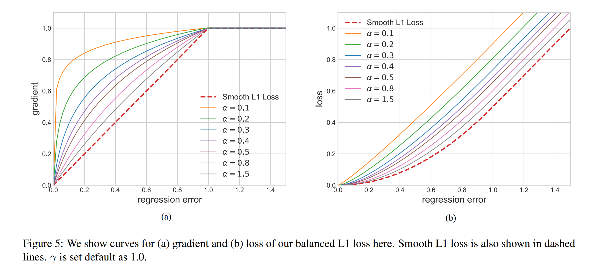

​		平衡的L1损失推导至传统的smooth L1损失，传统的smooth L1损失中，设置拐点将内部点从离群点中分离，并使用最大值1.0裁剪离群点产生的大梯度，如图5-(a)中的虚线所示。平衡的L1损失的关键思想是促进关键回归梯度（即内部点（准确样本）的梯度）以重新平衡涉及的样本和任务，因此在分类、整体定位和准确定位中获得更平衡的训练。定位损失$L_{loc}$使用的平衡L1损失定义为

$$L_{loc}=\sum_{i\in\{x,y,w,h\}}L_b(t_i^u - v_i), \tag{5}$$

并且与其对应的梯度公式遵循

$$\frac{\partial L_{loc}}{\partial w}\propto \frac{\partial L_b}{\partial t_i^u} \propto \frac{\partial L_b}{\partial x}, \tag{6}$$

基于上述公式，作者设计了一种促进梯度公式为

$$\frac{\partial L_b}{\partial x}=\begin{cases}\alpha \ln(b|x| + 1) &\mbox{ if } |x| < 1 \\ \gamma & \mbox{otherwise}\end{cases}, \tag{7}$$

​		图5-(a)表明，在一个由$\alpha$表示的因子的控制下，本文的平衡的L1损失增加了内部点的梯度。一个小的$\alpha$会增加更多的内部点的梯度，而离群点的梯度不受影响。此外，还引入了由$\gamma$控制的整体提升倍率来调整回归误差的上限，这可以帮助目标函数更好地平衡所涉及的任务。控制不同方面的两个因素相互增强，以实现更均衡的培训。$b$用以确保在公式（8）中的两个形式中$L_b(x=1)$有相同的值。

​		通过集成上述的梯度公式，作者可以得到平衡的L1损失

$$L_b(x)=\begin{cases}\frac{\alpha}{b}(b|x|+1)\ln(b|x|+1)-\alpha|x| &\mbox{ if } |x| < 1 \\ \gamma|x|+C &\mbox{otherwise}\end{cases}, \tag{8}$$

其中参数$\gamma$、$\alpha$和$b$有如下限制

$$\alpha \ln(b+1) = \gamma. \tag{9}$$

本文实验中，默认参数设置为$\alpha=0.5$、$\gamma=1.5$。

#### 4. 实验

##### 4.1. 数据和评估度量

所有的实验在挑战性的MS COCO数据集上实现。

##### 4.2. 实现细节

为了公平比较，所有实验使用PyTorch和mmdetection实现。使用8个GPU（每个GPU包含2张图像）训练检测器12个epoch，初始学习率为0.02，在8个和11个epoch后减小10倍（如果没有特别提到）。其他超参数遵循mmdetection的设置。

##### 4.3. 主要结果

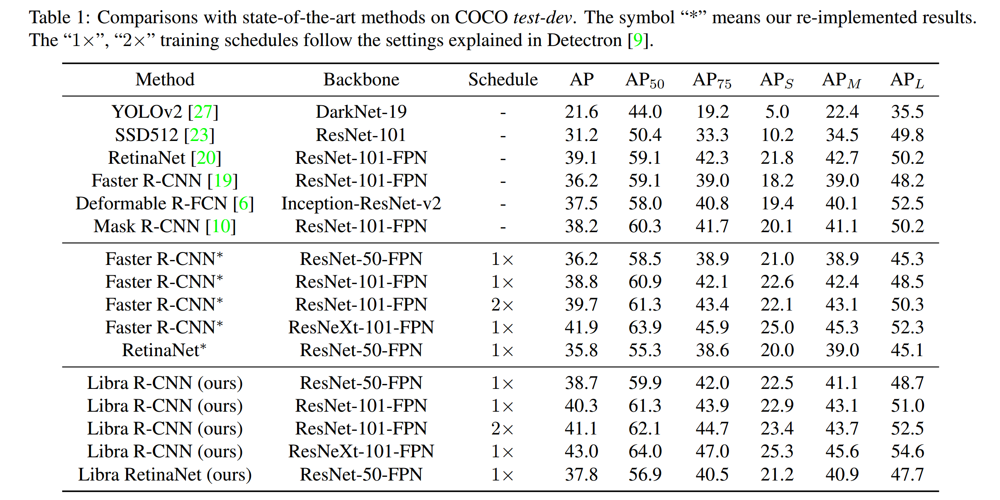

​		表1中，使用COCO _test-dev_ 对Libra R-CNN与最佳的目标检测方法进行比较。使用ResNet-50，Libra R-CNN获得38.7的AP，比FPN Faster R-CNN高2.5点。使用ResNeXt-101-64x4d，Libra R-CNN获得43.0 AP。

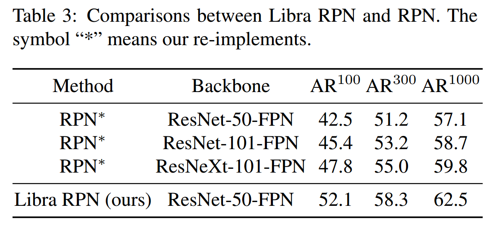

​		表3为本文方法增强提议的平均召回率的结果。

##### 4.4. 消融实验

**综合消融研究。** 见表2。

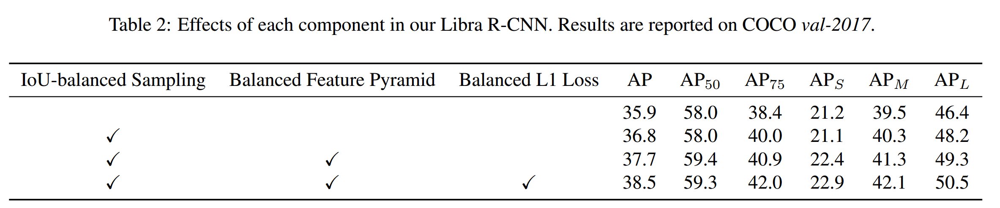

**1) IoU-balanced Sampling** 比ResNet-50 FPN Faster R-CNN极限高0.9点的AP。图6为随机采样和IoU-balanced采样下的训练样本。

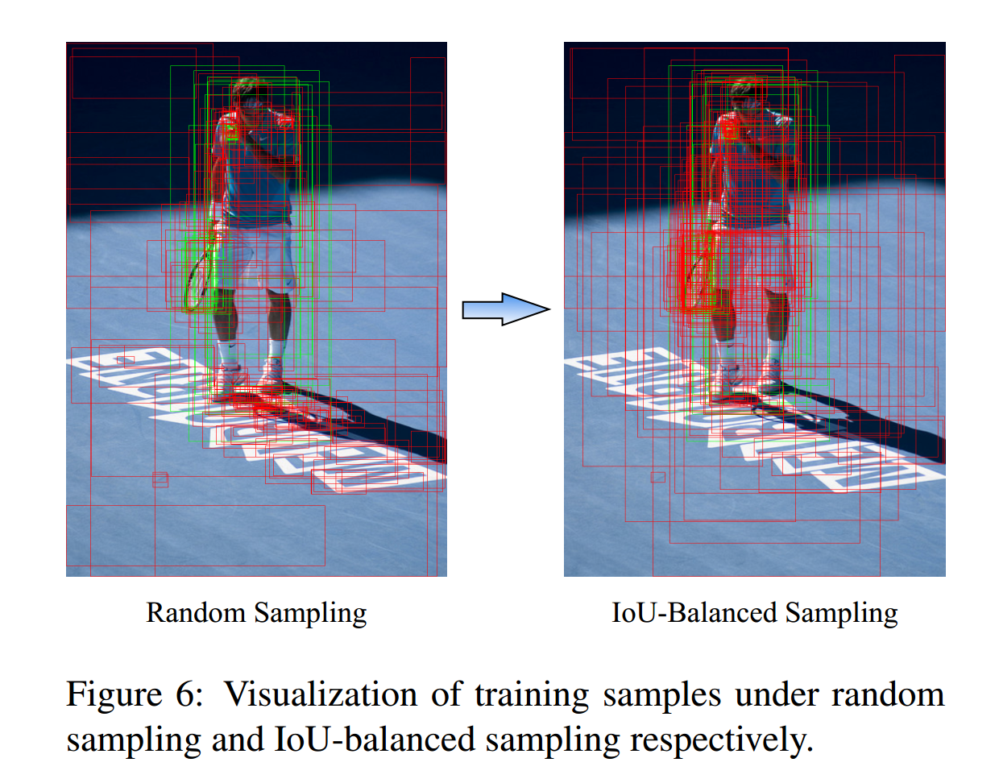

**2) Balanced Feature Pyramid**将AP从36.8提高到37.7。小型、中型和大型尺度上获得一致提升。

**3) Balanced L1 Loss**将AP从37.7提高到38.5。具体而言，最大的提升来自$AP_{75}$，其产生的AP比相应的基线高1.1个点。

**IoU平衡采样的消融演技。**见表4，_Pos Balance_表示对正样本采用IoU平衡采样，但是正样本太少不足以探索该方法的潜力（仅获得0.2的AP提高）。

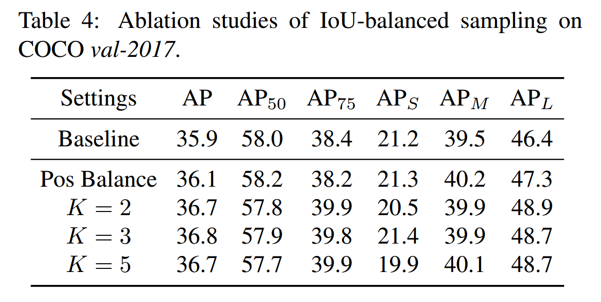

**平衡特征金字塔上消融研究。** 如表5。

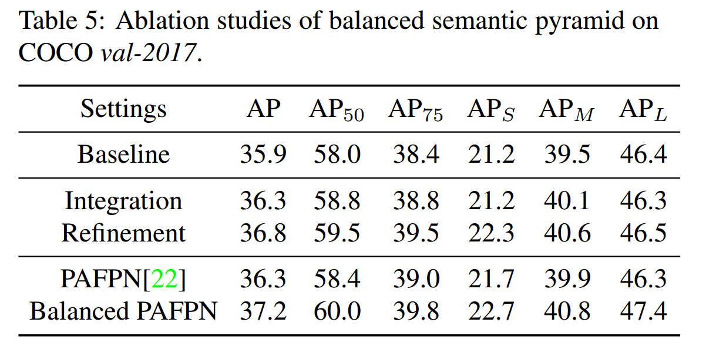

**平衡的L1损失的消融研究。**见表6。

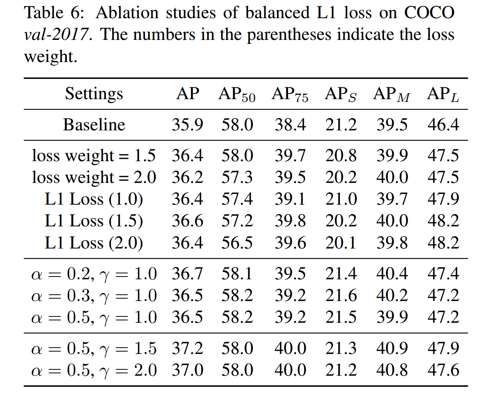