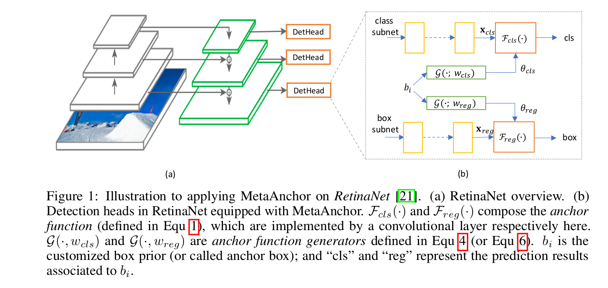
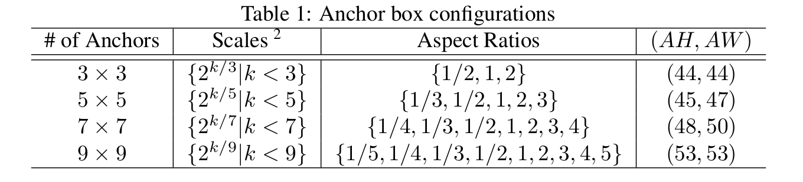
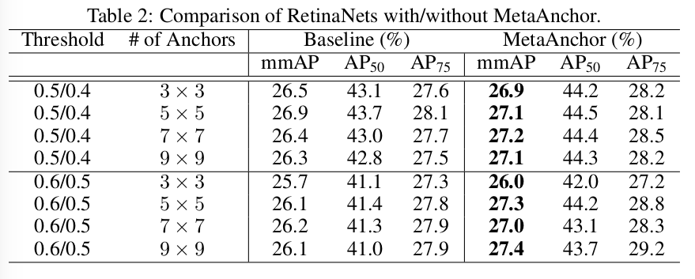
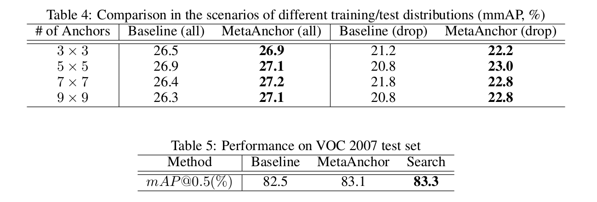
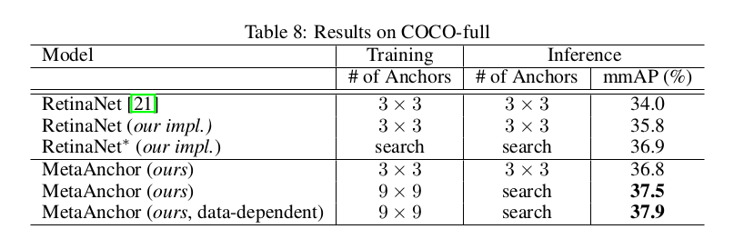
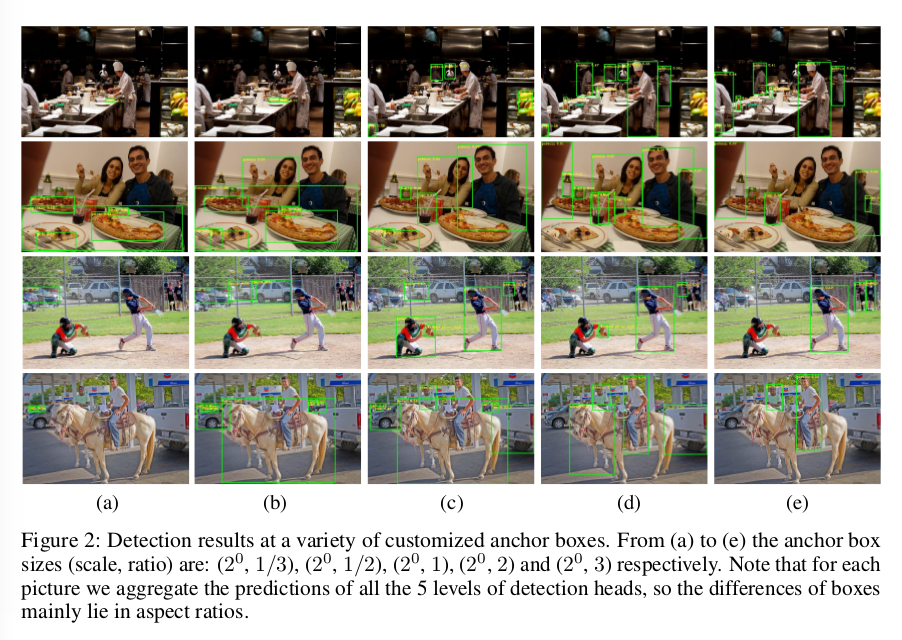
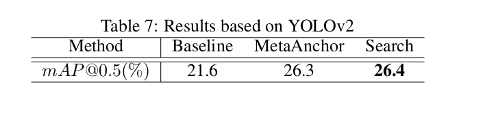

MetaAnchor: Learning to Detect Objects with Customized Anchors
=

# 1 Introduction
最近几年，深度神经网络在对象检测任务中取得了成功。事实上，对象检测通常需要生成一组边界框以及与给定图像中的每个对象相关联的分类标签。然而，卷积神经网络(CNNs)直接预测任意基数的无序集并非易事。一个广泛使用的解决方案是 anchor ，它采用分而治之（divide-and-conquer）的思想，并在历史最佳检测框架中得到证明。简单而言，锚点方法建议将边界框空间（包括位置、大小、类等）划分为离散的箱（bin）（无需相交），并通过在相应箱中定义的 _anchor function_ 生成每个对象框。使用 $x$ 表示从输入图像提取的特征，然后第 $i$ 个箱的 _anchor function_ 可以公式化如下：

$$\cal{F}_{b_i}(x;\theta_i) = (\cal{F}_{b_i}^{cls}(x;\theta_i^{cls}), \cal{F}_{b_i}^{reg}(x;\theta_i^{reg})) \tag 1$$

其中 $b_i\in\cal{B}$ 为 _proir_ （ 也称为 _anchor box_ ），其描述与第 $i$ 个箱关联的对象边界框的一般属性（例如，平均位置/大小和分类标签）；而 $\cal{F}_{b_i}^{cls}(\cdot)$ 辨别与第 $i$ 个箱是否存在对象边界框，$\cal{F}_{b_i}^{reg}(\cdot)$ 回归与先验 $b_i$ 关联的对象边界框的位置； $\theta_i$ 表示锚点函数的参数。

为了利用深度神经网络对锚点进行建模，一种直接的策略是通过枚举，这是前人的大部分工作 [30,37,23,28,29,21,10,20] 所采用的方法。首先，大量预定义的先验（或者锚点框） $\cal{B}$ 通过手工或者统计方法（如聚类）选择。然后，对于每个 $b_i \in \cal{B}$ ，锚点函数 $\cal{F}_{b_i}$ 通常通过一个或几个神经网络层实现。不同锚点函数的权重是独立的，或者部分共享的。显然，在这个框架中，锚点策略(即锚点框的选择和相应锚函数的定义)在训练和推理中都是固定的。此外，可用锚的数量受预定义 $\cal B$ 的限制。

本文提出一种灵活的替代方案来建模锚点： 与其枚举每个可能的边界框先验 $b_i$ 以及分别建模相应的锚点函数，我们的锚点函数由 $b_i$ 动态生成。它通过引入一个新颖的 _MetaAnchor_ 模块来完成，其定义如下：

$$\cal F_{b_i} = G(b_i, w) \tag 2$$

其中 $\cal G(\cdot)$ 称为 _anchor function generator_ ，其将任何边界框先验 $b_i$ 映射到相应的锚点函数 $\cal F_{b_i}$ ；并且 $w$ 表示参数。注意，在 MetaAnchor 中，先验集 $\cal B$ 不需要预定义；相反，它的工作方式是自定义的——在推理过程中，用户可以指定任何锚框，生成相应的锚函数，并使用后者来预测对象框。

在第 3 节中，我们提出 _weight prediction_ 机制可以优雅地实现[9]锚函数生成器，并将其嵌入到现有的对象检测框架中进行联合优化。

总之，相比传统的预定义锚点策略，我们发现我们所提出的 MetaAnchor 有以下潜在的好处(详细的实验见第4节):

- **MetaAnchor 对于锚点设置和边界框分布更加鲁邦。** 在传统的方法中，预定义的锚框集 $\cal B$ 通常需要仔细设计——太少的锚点不足以覆盖稀疏的边界框，或产生粗糙的预测；然而，过多的锚点通常隐含着更多的参数，其可能遭遇过拟合。此外，许多传统的策略使用独立的权重来建模不同的锚点函数，因此，与少量 ground-truth 边界框关联的锚很可能产生糟糕的结果。相比之下，任意形状的 MetaAnchor 锚点框可以在训练期间随机采样以致覆盖不同类型的边界框，同时，参数量保持常数。此外，根据公式（2），不同的锚点函数由相同权重 $w$ 生成，因此，所有的训练数据都能对所有的模型参数作出贡献，其暗示对于训练边界框分布更具鲁棒性。

- **MetaAnchor 有助于弥补边界框分布和数据集之间的差距。** 在传统框架中，锚框 $\cal B$ 是预定义的，并且在训练和测试期间保持不变，如果两个数据集的包围框分布不同，那么它们可能都不是最优的。而在 MetaAnchor 中，锚点可以灵活地自定义以适应目标数据集（例如通过 grid search 的样本），而不需要重新训练整个检测器。

# 2 Related Work
**Anchor methodology in object detection.** 锚（在 SSD 中称为“默认框”，在 YOLO 中称为 “先验”， 在[37]中称为 “grid cell”）被用于大多数历史最佳检测系统。的本质包括位置、尺寸、类标签等。当前的大多数检测器通过枚举建模锚点，即预定义大量所有类型位置、尺寸和类标签的锚框，其导致如下问题。第一，锚框需要仔细设计，例如通过距离，这对于特定的检测任务（例如基于锚的人脸检测和行人检测）是至关重要的。具体而言，一些论文建议使用多尺度锚来处理不同大小的对象。第二，预定义的锚可能产生过多的参数。大多数工作通过权重共享来处理这个问题。例如，与[5,28]等早期工作不同，[30,23,29]等检测器及其后续[6,20,2,10,21]采用全卷积网络产生的平移不变（translation-invariant）的锚，这可以跨不同位置共享参数。两阶段框架（如[30,2]）在不同类之间共享参数，并且为多个检测头部共享权重。相比之下，我们的方法没有这些问题，因为锚函数是自定义的，并且是动态生成的。

**Weight prediction.** 权重预测表示神经网络的一种机制，其中权重通过另一种结构预测，而不是直接学习，主要应用于学习学习（learning to learn）[9,1,40]、少/零次学习[4,40]和迁移学习[25]等领域。对于对象检测，有少量的工作，如，[14]（Mask X R-CNN） 提出由边界框权重预测掩模权重。主要有两个地方不同我们的方法：第一，在 MetaAnchor 中，权重预测的目的是生成锚点函数，而[14]是用于域适应（从对象边界框到分割掩模）；第二，在 MetaAnchor 中，权重几乎是“从头”生成，而[14]中，源（source）是学习到的边界框权重。

# 3 Approach
## 3.1 Anchor Function Generator
在 MetaAnchor 框架中，_anchor function_ 是有自定义的边界框先验（或者锚框）$b_i$ 动态生成，而不是与预定义锚框关联的固定函数。因此，锚框函数生成器 $\cal G(\cdot)$ （见公式（2）），其将 $b_i$ 映射到相应的锚函数 $\cal F_{b_i}$ ，在框架中起着关键作用。为了使用神经网络建模 $\cal G(\cdot)$ ，受[14][9]的启发，首先，我们假设对于不同 $b_i$ 的锚函数 $\cal F_{b_i}$ 共享相同的公式 $\cal F(\cdot)$ ，但有不同的参数，这意味着：

$$\cal F_{b_i}(x;\theta_i) = \cal F(x; \theta_{b_i})  \tag 3$$

然后，由于每个锚函数仅通过其参数 $\theta_{b_i}$ 区分， 锚函数生成器可以公式化为预测 $\theta_{b_i}$ ：

$$
\begin{alignat}{2}
\theta_{b_i} &= \cal G(b_i, w) \\
&=\theta^\ast + R(b_i;w)
\end{alignat} \tag 4
$$

其中 $\theta^\ast$ 表示共享参数（与 $b_i$ 独立，并且也是可学习的），残差项 $\cal R(b_i, w)$ 依赖锚框 $b_i$ 。

本文中，我们使用两层网络实验 $\cal R(\cdot)$ ：

$$\cal R(b_i, w) = W_2 \sigma (W_1 b_i) \tag 5$$

这里，$W_1$ 和 $W_2$ 为可学习的参数，$\sigma(\cdot)$ 为激活函数（我们使用 ReLU）。用 $m$ 表示隐藏神经元的数量。实践中，$m$ 通常远小于 $\theta_{b_i}$ 的维度，这使得 $\cal R(\cdot)$ 预测的权值位于一个显著的低秩子空间中。这就是为什么我们将 $\cal G(\cdot)$ 公式化为公式（4）中的残差，而不是直接使用 $\cal R(\cdot)$ 。我们也研究了更复杂设计的 $\cal G(\cdot)$ ，然而，这导致了可比较的基准测试结果。

此外，此外，我们还介绍了锚函数生成器的一个数据相关的变体，其将输入特征 $x$ 带入式中:

$$
\begin{alignat}{2}
\theta_{b_i} &= \cal G(b_i;x,w) \\
&=\theta^\ast + W_2 \sigma (W_{11}b_i + W_{12}r(x))
\end{alignat} \tag 6
$$

其中 $r(\cdot)$ 用于减小特征 $x$ 的维度；我们实证发现，对于卷积特征 $x$ ，对 $r (\cdot)$ 使用全局平均池[12,36]操作通常会产生良好的效果。

## 3.2 Architecture Details
理论上，MetaAnchor可以与大多数现有的基于anchor的对象检测框架一起工作。其中，对于两级检测器，锚点通常用于建模“objectness”并生成边界框提议，而在第二阶段，精细结果由类似 rcnn 模块预测[8,7]。我们尝试在这些框架中使用 MetaAnchor ，并观察到边界框提议的一些改进（例如提高召回率），然而，它似乎对最终预测没有作用，我们认为其质量主要由第二阶段确定。因此，本文中，我们主要研究单阶段检测器的情况。

例如，我们选择最先进的单级检测器 RetinaNet [21]来应用 _MetaAnchor_ 。注意，我们的方法也适用于其他单级框架，如 SSD、 YOLOv2、 DSOD 和 DSSD 。图1a给出 RetinaNet 的概览。简而言之，从 “U” 形骨干网络提取 5 个级别的特征 $\{P_l | l \in \{3,4,5,6,7\}\}$ ，其中 $P_3$ 代表最精细的特征图（即具有最大分辨率），而 $P_7$ 是最粗糙的。对于每个级别的特征，图1中称为 “Detection Head” 的子网络附加用于生成检测结果。锚点函数在每个检测头部定义。参考 RetinaNet 的设置，锚点函数通过 $3 \times 3$ 卷积层实现；对于每一个检测头,有 $3 \times 3 \times 80$ 种锚框(3个尺度,3个纵横比和80类)是预定义的。因此，对于每个锚函数，有 720 个滤波器用于分类，36 个滤波器用于回归（$3 \times 3 \times 4$ ，作为类无关的回归项）。

为了应用 MetaAnchor ，我们需要重新设计原始的锚函数使得它们的参数由自定义的锚框 $b_i$ 生成。首先，我们考虑如何对 $b_i$ 进行编码。根据第 1 节的定义，$b_i$ 应当是一个向量，其包含如位置、大小、类标签等信息。在 RetinaNet 中，由于全卷积结构，位置可以自然地通过特征图坐标编码，而不需要在 $b_i$ 中涉及。对于类标签，有两种方案：A）直接在 $b_i$ 中编码，B）令 $\cal G(\cdot)$ 预测每个类的权重。根据经验，我们发现选项B比选项A更容易优化，通常会得到更好的性能。因此，在我们的实验中，$b_i$ 主要与锚大小有关。受[8][30]（R-CNN、Faster R-CNN）中引入的边界框编码方法的启发，$b_i$ 表示如下：

$$b_i = (\log\frac{ah_i}{AH}, \log\frac{aw_i}{AW}) \tag 7$$

其中 $ah_i$ 和 $aw_i$ 是相应锚框的高和宽； $(AH,AW)$ 为“标准锚框（standard anchor box）”的大小，其用作标准化项。我们也研究了一些其他替代方案，使用尺度和纵横比来表示锚框的大小，这产生与公式（7）可比较的结果。

图1(b)说明 MetaAnchor 在 RetinaNet 各检测头中的应用。在 RetinaNet 的原始设计中，锚函数的分类和边界框部分分别附在分离的特征图（ $x_{cls}$ 和 $x_{reg}$ ）上；因此，在 MetaAnchor 中，我们也使用两个独立的 _anchor function generator_ $\cal G(\cdot,w_{cls})$ 和 $\cal G(\cdot, w_{reg})$ 以分别预测它们的权重。遵循公式（4）（数据独立的变体）或公式（6）（数据依赖的变体）的 $\cal(\cdot)$ ，其中隐藏神经元的数量 $m$ 设置为 128 。此外，回忆在 MetaAnchor 中的锚函数是从 $b_i$ 动态推导的，而不是通过枚举预定义的；因此，$\cal F_{cls}(\cdot)$ 的滤波器数量减少到 80 （例如，80个类），$\cal F_{reg}(\cdot)$ 的滤波器数量减少到 4 。

值得注意的是，在RetinaNet[21]中，各级检测头对应的各层具有相同的权重，甚至包括代表锚函数的最后一层。然而，锚的定义因层而异: 在第 $l$ 层中，假设锚函数与大小为 $(ah,aw)$ 的锚框相关；而在第 $(l+1)$ 层（比第 $l$ 层小50%的分辨率）中，相同的锚函数应该检测 2 倍大的锚框，即 $(2ah,2aw)$ 。因此，为了保持与原始设计的一致性，在 MetaAnchor 中，我们为每个级别的检测头部使用相同的锚函数生成器 $\cal G(\cdot, w_{cls})$ 和 $\cal G(\cdot, w_{reg})$ ；而公式（7）中的“standard boxes” $(AH, AW)$ 在层级之间是不同的： 假设第 $l$ 级中的标准框大小为 $(AH_l, AW_l)$ ，然后，对于 $(l+1)$ 级，我们设置 $(AH_{l+1}, AW_{l+1}) = (2AH_l, 2AW_l)$ 。在我们的试验中，最低级（即 $P_3$ ，其有最大分辨率）中标准框大小设置为所有锚框大小的均值（图表1中的最后一列）。

# 4 Experiments
本节中，我们在 COCO 对象检测任务上评估所提出的 MetaAnchor 。基本检测框架如3.2节中介绍的 RetinaNet ，其骨干特征提取器为 ResNet-50 ，其使用 ImageNet 分类数据集预训练。除非特别提到，对于 MetaAnchor，我们使用锚函数生成器的数据独立变体（公式4）。训练期间，MetaAnchor 与骨干检测器联合优化。我们在 MetaAnchor 中不使用批归一化。

**Dataset.** 根据 COCO 检测任务中常见的[21]实践，我们在训练中使用了两种不同的数据集分割: COCO-all 和 COCO-mini；而对于测试，所有结果在包含 5000 张图像的 minival 集上评估。COCO-all 包含原始训练集中所有图像和验证集中除去 minival 的图像，而 COCO-mini 是大约 20000 张图像的子集。结果主要使用COCO标准度量(如mmAP)进行评估。

**Training and evaluation configuration.** 为了公平比较，我们遵循 RetinaNet 的大多数设置（图像大小、学习率等），但有几个不同之处。在 RetinaNet 中，$3 \times 3$ 锚框(例如 3 个尺度和 3 个纵横比)为每个级别的预定义的检测头部。表 1 列出了特征级 $P_3$ 锚框配置，其中 $3 \times 3$ 的情况与 RetinaNet 相同。其他特征级的设置也可以推导（见3.2节）。对于 MetaAnchor ，由于预定义锚不是必须的，我们建议使用如下的策略。在训练中，首先，我们选择表1中的一种锚框配置（例如 $5 \times 5$），然后根据公式7生成 $25$ 个 $b_i$ ，对于每次迭代，我们使用 $\pm 0.5$ 来随机增强每个 $b_i$ ，计算相应的 ground-truth，并使用它们进行优化。我们称这种方法为 “training with $5 \times 5$ anchors” 。而在测试时，$b_i$ 也通过一个特定的锚框配置设置，而不需要增强（与训练期间不同）。我们认为使用这种训练/推理方案，MetaAnchor 与对应基线之间的比较是可能的。

在下一节中，我们首先通过COCO-mini上的一系列可控实验研究 MetaAnchor 的性能。然后我们在 COCO0-full 上报告完全装备的结果。

## 4.1 Ablation Study
### 4.1.1 Comparison with RetinaNet baseline
表 2 比较了在 COCO-mini 数据集上 MetaAnchor 和 RetinaNet 基线的性能。这里，我们为训练和测试使用相同的锚框设置。在“阈值”一栏 $t_1 / t_2$ 分别表示训练中正/负锚框的IoU（具体定义见[30,21]）。

### 4.1.2 Comparison of various anchor configurations in inference
表 3 比较用于推理的不同锚框配置（参考表1；注意标准化系数 $(AH,AW)$ 应当与训练时使用的一致）。

表 3 暗示随着锚框的增加，性能提高很快达到饱和，例如 $\ge 7 \times 7$ 的锚仅带来很小的提高，这也在表 2 中观察到。我们回顾表 1 中的锚配置，并发现 $7 \times 7$ 和 $9 \times 9$ 情况倾向于过于“密集”的锚框，因此预测高度重叠的结果可能对最终结果没有贡献。受此启发，我们提出了一种通过贪心搜索进行推理的方法: 每步中，我们随机选择一个锚框 $b_i$ ，生成预测，并评估与上一步的组合结果（在一个训练子集上执行）；如果得分提高，我们使用组合结果更新当前预测，否则丢弃当前步骤中的预测。最终的锚配置在几步后获得。改善的结果如表 3 最后一列所示（称为 “search”）。

### 4.1.3 Cross evaluation between datasets of different distributions
虽然域适应或转移学习[27]（A survey of transfer learning）并不是 MetaAnchor 的设计目的，但本文也采用了最近使用的权值预测[9]（HyperNetworks）技术，成功地应用于这些任务[14,13]。因此，对于MetaAnchor来说，评估它是否能够弥合两个数据集之间的分布差距是非常有趣的。更具体地说，如果使用另一个数据集对检测模型进行训练，该数据集具有相同的类标签，但是对象框大小的分布不同，那么性能将会如何呢?

我们在 COCO-mini 上执行实验，其中我们“丢弃”训练集中的一些框。然然而，直接擦除图像中的物体似乎不是一件小事;相反,在训练期间,一旦我们使用的 ground-truth 边界框落在一定范围(在我们的实验中,范围是 ${(h, w) | 50 < \sqrt{hw} < 100, −1 < \log \frac{w}{h} < 1 }$ ，整个边界框的 $1/6$ )， 那么我们手动分配相应的损失为 0 。对于测试，我们使用验证集中的所有数据。因此，训练和测试中使用的边界框分布是完全不同的。表 4 展示了评估结果。显然，一些 ground-truth 边界框被擦除之后，所有的得分显著下降；然而，相比 RetinaNet 基线，MetaAnchor 遭遇更小的衰退，并生成更好的预测，这证明了迁移任务的潜能。

此外，我们仅使用 COCO-full 训练模型，并评估在 VOC2007 测试集上的性能。我们使用两个模型： Baseline（RetinaNet）和 MetaAnchor，其以不同架构在 COCO-full 上获得最佳性能。在这项实验中，我们在 VOC2007 测试集上获得 83.3% 的 mAP ，与基线相比有 0.8% 的提高 ，比 MetaAnchor 好 0.2% ，如表 5 所示。因此，在这项任务中，MetaAnchor 表现出比 RetinaNet 基线更好的迁移能力。

### 4.1.4 Data-independent vs. data-dependent anchor function generators
在 3.2 节中，我们介绍了锚函数生成器的两种变体： data-independent（公式4）和 data-dependent （公式6）。在上一节中我们主要评估了 data-independent 。表 6 比较了两个替代方案的性功能。为了简明起见，我们使用相同的训练和测试锚配置；IoU 阈值为 $0.6/0.5$ 。结果表明 data-dependent 变体性能略好，但是，差距很小。

## 4.2 Results on COCO Object Detection
最后，我们在COCO-full数据集(在[21]中也称为 trainval35k )上，将装备齐全的 MetaAnchor 模型与 RetinaNet[21] 基线进行比较。我们遵循以 RetinaNet 相同的评估协议。训练和测试的输入分辨率都为 $600 \times$ 。骨干特征提取器为 _ResNet-50_ 。在 _minival_ 数据集中使用COCO标准mmAP对性能进行基准测试。

表 8 列出了结果。有趣的是，我们重新实现的 RetinaModel 模型的性能比 [21] 的对应版本好 1.8% 。为了更好地理解，我们进一步研究多种锚框配置（包扩表 1 中的配置），并重新训练基线模型，其中最好的模型称为 “RetinaNet*” ， 并在表 8 中标记为 “search” 。对比之下，我们的 MetaAnchor 在 COCO minival 上获得 37.5% 的 mmAP，其比原始的 RetinaNet 好 1.7% ，比 RetinaNet 最佳的搜索好0.6% 。我们的 data-dependent 将性能进一步提升 0.4% 。此外，我们认为，对于 MetaAnchor ，在不需要再训练的情况下，通过引入4.1.2节中的贪心搜索可以很容易地得到推理配置。具体而言，贪心搜索的锚的尺度和纵横比分别为 $\{2^{k/5} | -2 < k < 6\}$ 和 $\{1/3, 1/t, 1, t, 3 | t=1.1, 1.2, ..., 2\}$ 。图2显示了MetaAnchor预测的一些检测结果。很明显，检测到的 box 的形状会根据定制的 anchor box $b_i$ 而变化。

为了进一步评估我们的方法，我们在 YOLOv2 上实现 MetaAnchor ，企业使用两层网络来预测检测器参数。对于 YOLOv2 基线，我们使用开放源码项目（darknet）中以证明的锚来检测对象。在 MetaAnchor 中，“standard boxes” $(AH,AW)$ 为 $(4.18, 4.69)$ 。对于训练，我们遵循 YOLOv2 使用的策略，并使用 COCO-mini 数据集。对于结果，我们报告 COCO minival 上的 mAP@0.5 。表 7 展示了结果。显然，MetaAnchor比YOLOv2基线提高4.7%，并且通过贪心搜索方法将性能提升0.1% 。

