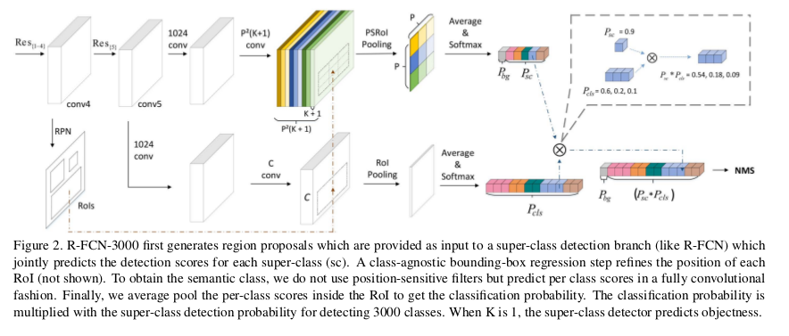
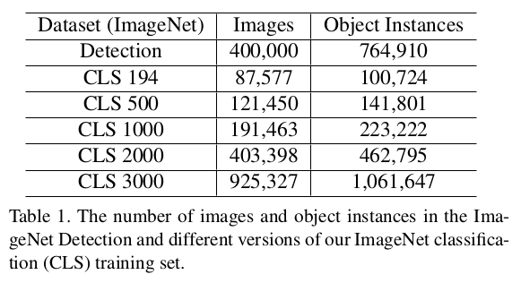
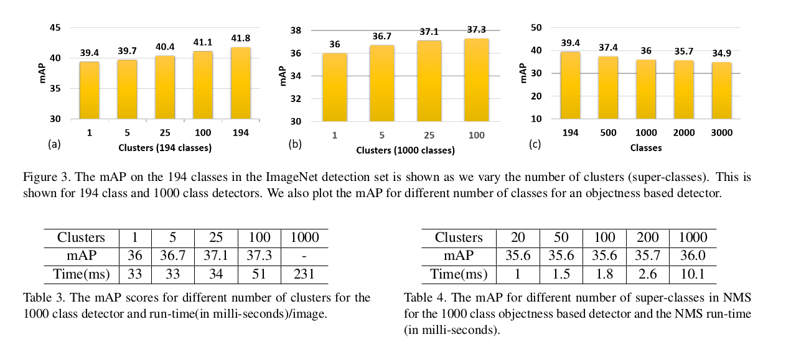

R-FCN-3000 at 30fps: Decoupling Detection and Classification
=

# 1. Introduction
本文之前取得最优性能的检测器针对每个类的特定类的需要一组滤波器，这些滤波器禁止它们应用于大量类。 例如，R-FCN/Deformable-R-FCN针对每个类别需要49/197个位置特征的滤波器，RetinaNet的针对每个卷积特征图的每个类别需要9个滤波器，因此，这些架构需要成千上万个滤波器来检测3000个类，这使得它们在应用中变得很慢。

提出的R-FCN-3000架构背后的关键见解是解耦对象检测和检测到的对象的分类，以便随着类的数量增加，位置的计算要求保持不变，如图1.

R-FCN-3000利用了许多对象类别在视觉上相似并共享部分的事实。例如，不同品种的狗都有共同的身体部位；因此，学习一组不同的过滤器来检测每个品种是过度的。因此，R-FCN-3000对固定数量的超类进行对象检测（使用位置敏感滤波器），然后在每个超类中进行细粒度分类（没有位置敏感滤波器）。通过聚类图像的深层语义特征（本文为ResNet-101的2048维特征）来获得超类; 因此，不需要语义层次结构。给定位置的细粒度类别概率由超类概率和超类中细粒度类别的分类概率相乘获得。

本文实验了从1到100的超类数量，令人吃惊的发现是，即使超类数为1，检测器仍能很好地执行。该观察结果表明位置敏感滤波器可能学习检测通用对象性。它还重申了过去[1,2,39]中经过深入研究的概念，即对象性是一般概念，可以学习通用对象检测器。因此，为了执行对象检测，将RoI的对象性得分与给定类的分类概率相乘就足够了。

# 2 Related Work
Deformable-R-FCN [6], R-FCN
[5], RetinaNet [23] 在最终的分类层不会共享滤波器，因此，当检测成百上千个类时，它们的推理速度是非常慢的。受到先前工作中在对象类别上共享滤波器的启发，为大尺度对象检测提出可以在某些类别上共享滤波器的架构。

终极版本的共享部分是对象性，其中假设所有对象都有共同之处。最近十年中，研究人员提出对象性是一个一般性概念，并且强调仅使用少量类别无关的提议可以获得很高的召回率[39,3,2,1]。R-CNN为了对象检测，使用了一些提议，但是也使用了逐类别的边界框回归来精炼这些提议的位置。随后，在[5]（R-FCN）中观察到不需要按类别回归，并且类别不可知的回归步骤足以改进提议位置。因此，如果回归步骤是类别无关的，并且可以获得合理的对象性得分，则简单的分类层应该足以执行检测。

# 3 Background

Deformable-R-FCN 中用deformable卷积替换了atrous卷积，deformable卷积使用一个单独的分支预测特征图中每个采样位置的偏移，卷积核在应用偏移后进行采样。

# 4 Large Scale Fully-Convolutional Detector
## 4.1 Super-class Discovery
卷积对象检测器基于尺度和纵横比[23]或以每个类别的位置敏感滤波器[5,6]的形式学习特定类别的滤波器。因此，当类别的数量增加时，应用这些检测器器在计算上变得不可行。因此，提出问题：“是否有必要为每个类设置一组过滤器，或者可以在视觉上相似的类中共享一组滤波器？”为了获得可以共享位置敏感滤波器的视觉上相似的对象集，对象应具有相似的视觉外观。**对于ImageNet分类数据集中输入第 $j$ 个对象类别的所有样本, 通过平均来自ResNet-101最后一层的2048为特征向量 $(x_j^i)$ 获得第 $j$ 个对象类别的表征 $x_j$ 通过在 $\{x_j: j \in {1, 2, ..., C} \}$ 上使用K-means聚类来获得 $K$ 个超类簇，其中 $C$ 是类别数目 。**

## 4.2 Architecture

首先， RPN用于生成提议。令正在训练的探测器的各个对象类的集合为 $\cal{C}, |\cal{C}|$ = $C$，令超类（SC）集合为 $\cal{K}, |\cal{K}|$ = $K$。对于每个超类 $k$ ，假设有 $P \times P$ 个位置敏感滤波器如图2。在conv5特征上，首先应用两个独立的卷积层，如R-FCN，以获得检测分数和边界框回归偏移。在这些分支的分线性函数之后，为每个分类和边界框回归应用位置敏感滤波器。因为有 $K$ 个超类，并且每个超类有 $P \times P$ 个滤波器，因此，在分类分支中有 $(K+1) \times P \times P$ 个滤波器，在回归分支中有 $P \times \times$ 个滤波器（因为该分支是类别无关的）。在执行位置敏感的RoI池化并对每个箱中的预测求平均之后，获得用于分类和定位的网络预测。在 $K$ 个超类上使用softmax函数获得超类概率。定位分支直接获得最终的检测位置。这两个分支检测每个聚类簇。为了获得细粒度信息，在conv5特征图上应用两层CNN（如图2）。softmax函数用于该层的输出，以获得最终的类概率。将检测和分类概率相乘以获得每个对象类的最终检测分数。

## 4.3 Label Assignment

对于执行检测的K超类，标签的分配方式与fast-RCNN完全相同。令 $C$ 为对象类别的总数， $k_i$ 和 $c_j$ 分别表示第 $i$ 个超类和 $k_i$ 中的第 $j$ 个子类， $k_i = \{c_1, c_2, ..., c_j\}$ ， $\sum_{i=1}^{K} = C$ 。为了检测超类 $k_i$ ，如果与ground-truth 的IoU大于0.5的RoI分配为超类 $k_i$ 的正类，其他的则标记为背景。对于分类分支（最终有3000个类），仅使用正类 RoI 用于训练，即与ground-truth的IoU大于0.5的RoI，该分支中用欧冠与分类的标签数为 $C$ 。

## 4.5 Loss Function

使用Deformable-R-CNN相同的OHEM和smooth $L_1$ 损失进行边界框回归。对于细粒度分类，仅使用softmax函数在 $C$ 个类上对正类边界框进行分类。由于与提案数量相比，正RoI的数量通常较小，因此该分支的损失加权0.05，因此这些梯度不会主导网络训练。

# 5 Experiments
# 5.1 Training Data

# 5.2 Implementation Details

对于快速训练和推理，输入图像分辨率为 $375 \times 500$ 。anchor尺度为 $(64, 128, 256)$ ， 纵横比为 $(1:2, 1:1, 2:1)$ 。训练 7 个epoch，前1000次迭代使用warm-up策略，学习率从0.00002增加到0.0002 。在5.33 epoch后学习率除以10 。表1给出了不同类别数时，图像和实例的情况。对于快速训练和推断，没有使用Deformable position-sensitive RoI pooling，仅使用双线性插值。

# 5.3 Results

