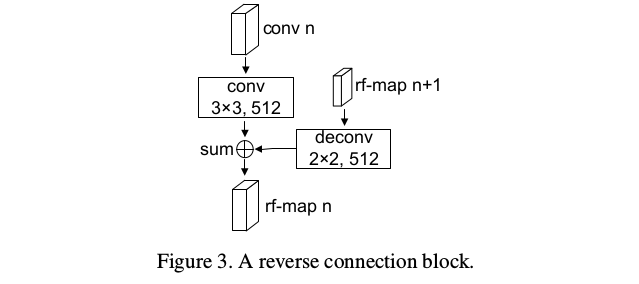
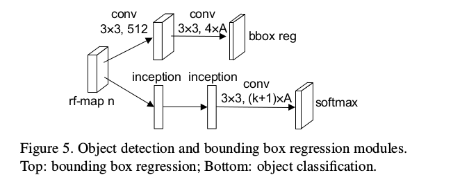
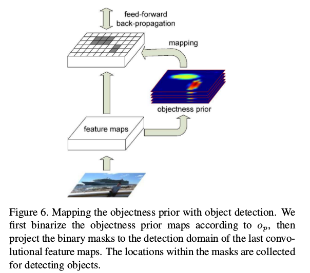

RON: Reverse Connection with Objectness Prior Networks for Object Detection
=

# 1 Introduction
两阶段方法通过第一阶段的区域提议生成过程极大地减少区域搜索空间，从而有效地抑制类别不平衡问题。而一阶段方法（a）在没有区域提议的情况下，检测器必须仅在检测模块处抑制所有负候选框；（b）YOLO使用CNN对顶部层检测对象，而没有深层探索不同层检测能力，同时，虽然SSD使用了多尺度特征图，但是由于中间层的有限信息，使得其检测小实例时效果不佳。

因此，有这样的问题，_是否有可能开发一个优雅的框架，可以巧妙地将两种方法中的最佳方法联系起来并消除它们的主要缺点？_ 作者通过试图弥补基于区域和无区域的方法之间的差距来回答这个问题：（a）多尺度对象定位。利用所提出的反向连接，在相应的网络尺度上检测对象，这更优雅且更容易优化。（b）负空间挖掘。对象和非对象样本之间的比例严重不平衡。为了减小对象的搜索空间，作者在卷积特征图上创建对象性先验（图1），并联合优化。

贡献：
1. 提出RON，它是一种用于端到端检测的全卷积框架。首先，反向连接为前一层CNN提供了更多的语义信息。其次，对象性先验给出了对象搜索的明确指导。最后，多任务损失函数能够针对检测性能端到端地优化整个网络。
2. 为了获得高检测准确率，高效的训练策略如负样本挖掘和数据增强被采用。使用低分辨率输入 $384 \times 384$ ，RON在PASCAL VOC上获得最佳检测结果。
3. RON是时间和资源高效的。使用1.5G GPU内存，总共的前馈速度是15FPS，比Faster R-CNN快三倍。

# 3 Network Architecture

**Network preparation** 使用VGG-16作为测试用例参考模型，该模型使用ImageNet数据集预先训练[27]。VGG-16包含13个卷积层和3个全连接层，将FC6（第14层）和FC7（第15层）转换为卷积层，并使用步长为2的 $2 \times 2$ 卷积核将FC7的分辨率减半。现在，用于对象检测的特征图的分辨率是输入大小的 $1/8$ （conv4_3）、 $1/16$ （conv5_3）、$1/32$ （conv6）、 $1/64$ （conv7）。

## 3.1 Reverse Connection
细粒度细节信息和高度抽象信息的结合有助于不同尺度对象的检测。

## 3.2 Reference Boxes
设计参考边界框的分布使得特定特征图位置可以学习相应的特定对象尺度。最小尺度表示为 $s_{min}$ ，每个特征图 $k$ 上边界框的尺度 $S_k$ 为：
$$
S_k = \{(2k-1) \cdot s_{min} , 2k \cdot s_{min}\}, k \in {1, 2, 3, 4}  \tag 1
$$
同时为每个默认框分配纵横比 $\{ \frac{1}{3}, \frac{1}{2}, 1, 2, 3\}$ 。因此，特征图的每个位置包含2个尺度和5个纵横比。最小尺度 $s_{min}$ 是输入大小的 $\frac{1}{10}$ （例如，输入 $320 \times 320$ 时为32个像素）。

## 3.3 Objectness Prior
虽然使用了不同尺度和纵横比的默认框，但是存在着严重的对象和非对象样本之间的不平衡问题。基于区域的方法通过区域提议网络克服了这个问题。Fast R-CNN使用逐区域网络进行检测，这带来重复计算。相比之下，添加对象性先验来指导对象搜索，而没有生成区域提议。具体地，添加一个 $3 \times 3 \times 2$ 的卷积层，后跟一个softmax函数来指示每个边界框中是否存在对象。对象性先验图的通道数为10，这是因为每个位置有10个默认框。

图1展示了从特定图像中多尺度对象性先验的生成。为了可视化，将对象性先验图沿着通道维度平均。对象性先验图可以明显反映对象的存在。因此对象的搜索空间能够极大地减少。不同尺度的对象对应相应的特征图，并且能够近视匹配和端到端训练。

## 3.4 Detection and Bounding Box Regression
不同于对象性先验，检测模块需要将区域分类成 $K + 1$ 个类别（1为背景）。采用Inception模块在特征图上执行检测。具体地，添加两个Inception块（如图4）到特征图，并且分类最终的Inception输出。

使用Softmax，子网络输出每类分数，表示存在特定于类的实例。对于边界框回归，预测单元中相对默认框的偏移（如图5）。

## 3.5 Combining Objectness Prior with Detection
在训练和测试阶段协助物体检测与对象性先验。对于训练网络，首先分配二值类标签给每个候选区域。然后，如果区域包含对象，便分配一个特定的类别标签给它。对于每个ground-truth框，（i）匹配具有最大jaccard重叠的候选区域，（ii）匹配与任意ground-truth框的jaccard重叠大于0.5的候选区域。这种匹配策略使得每个ground-truth框至少一个候选区域与之匹配。如果与ground-truth框的jaccard重叠小于0.3， 则给该候选区域分配负标签。

现在，每个框都有其对象性标签和类别特定的标签。网络网络将动态更新特定于类的标签，以便在训练阶段使用对象性先验协助对象检测。对于每个mini-batch的前馈时间，网络运行对象性先验和类别特定的检测。但是在反向传播阶段，网络首先生成对象性先验，然后，对于检测，对象性得分高于阈值 $o_p$ 的样本被选择（如图6）。额外的计算仅来自用于反向传播的样本的选择。使用合适的 $o_p$ （本文中 $o_p = 0.03$ ），仅少量的样本被选择用于更新检测分支，因此，反向传播的复杂度显著减小。

# 4 Training and Testing
## 4.1 Loss Function
对于每个位置，网络有三个兄弟输出分支。第一个输出是对象置信度得分 $p^{obj} = \{p_0^{obj}, p_1^{obj}\}$ ，通过softmax在 $2 \times A$ （ $A = 10$　）计算。将对象性损失表示为 $L_{obj}$ 。第二个损失是边界框损失 $L_{loc}$ ，它在预测位置偏移 $t=(t_x, t_y, t_w, t_h)$ 和目标偏移 $t^\ast = (t_x^\ast, t_y^\ast, t_w^\ast, t_h^\ast)$ 之间使用smooth $L_1$ 损失。不同于Fast R-CNN为 $K$ 个类都回归偏移，RON只是回归一次该位置而没有特定于类的信息。第三个分支输出分类损失 $L_{cls|obj}$ ，给定对象性置信度得分 $p^{obj}$ ，分支首先排除那些得分小于阈值 $o_p$ 的区域，然后与 $L_{obj}$ 一样， $L_{cls|obj}$ 实际softmax计算每个位置的输出 $p^{cls|obj} = \{p_0^{cls|obj}, p_1^{cls|obj}, ..., p_K^{cls|obj}\}$ 。为对象性先验、分类和边界框回归使用多任务损失端到端地联合训练网络：
$$
L=\alpha\frac{1}{N_{obj}}L_{obj} + \beta\frac{1}{N_{loc}}L_{loc} + (1 - \alpha - \beta)\frac{1}{N_{cls|obj}}L_{cls|obj}  \tag 2
$$

本文中 $\alpha = \beta = \frac{1}{3}$ 。

## 4.2 Joint Training and Testing
每个mini-batch中，（a）对于对象性先验，所有的正类样本都用于训练，负样本从负标签区域中随机选择使得正负样本比例为 $1:3$ ；（b）对于检测，首先根据对象性得分减少样本数量，然后选择所有正样本，随机选择负样本使得正负样本比例为 $1:3$ 。

**Data augmentation** 随机选择如下选项中的一种：（i）使用原始/翻转的输入图像；（ii）随机选择一个补丁，其边长是原始图像的 $\{\frac{4}{10}, \frac{5}{10}, \frac{6}{10}, \frac{7}{10}, \frac{8}{10}, \frac{9}{10}\}$ ，并且确保至少有一个对象的中心位于patch中。作者注意到这样的数据增强会增加大对象的数量，而对小对象的优化是有限的。为了克服这个问题，添加小尺度用于训练。一个尺度的大物体在较小尺度下将更小。 该培训策略可以有效地避免特定尺寸的物体过度拟合。一个尺度的大物体在较小尺度下将更小。 该训练策略可以有效地避免特定尺寸的物体过度拟合。

**Inference** 在推理阶段，将类条件概率和单个边界框置信度预测相乘。每个边界框的每个特定类的置信度为：
$$
p^{cls} = p^{obj} \cdot p^{cls|obj}  \tag 3
$$

分数编码了出现在框中的类的概率以及预测框与对象的拟合程度。

# 5 Results
## 5.1 PASCAL VOC 2007
We use the $10 ^ {−3}$ learning rate for the first 90k iterations, then we decay it to $10^{−4}$ and continue training for next 30k iterations. The batch size is 18 for $320\times320$ model according to the GPU capacity. We use a momentum of 0.9 and a weight decay of 0.0005.
结果如表1 。

## 5.2 PASCAL VOC 2012

## 5.3 MS COCO
We use the $5\times10^{−4}$ learning rate for 400k iterations, then we decay it to $5\times10^{−5}$ and continue training for another 150k iterations. $s_{min}$ 为24 。

## From MS COCO to PASCAL VOC

