### Is Sampling Heuristics Necessary in Training Deep Object Detectors?

#### Abstract
​		为了解决前景与背景之间的不平衡问题，已提出了各种启发式方法，例如OHEM，Focal Loss，GHM，用于训练深度目标检测器时进行有偏采样或加权。作者通过放弃启发式采样并聚焦在其他训练设置上来挑战这种范例。作者的实验研究表明分类损失的权重和初始化策略对训练稳定性和最终准确率有较大影响。因此，作者针对深度检测训练提出Sampling-Free机制，而没有启发式采样，该机制包含三个关键部分：最优的偏置项初始化策略、损失引导权重（guided loss weights）和类自适应阈值。与采样试探法相比，作者的免采样机制是完全数据诊断，因此避免了对采样超参数进行费力的调整。作者广泛的实验结果表明，无采样机制可用于一级、二级和无锚目标检测器，在这种情况下，它始终可以在具有挑战性的COCO基准上实现更高的精度。这种机制也可以用于实例分割任务。

#### 1. Introduction
​		作者认为，前景-背景的不平衡与有偏数据集引入的类别不平衡不同，前景-背景的不平衡应归因于检测器的巨大搜索空间，这意味着这种不平衡在具有相同分布的训练和推理中都存在。然而启发式采样会破坏这种分布，因此导致训练和推理不对齐。此外，启发式还需要费力 的超参数调整。

​		考虑到启发式采样的缺点，自然而然的出现一个问题： _没有启发式采样的模型能够获得基于采样的模型的准确率吗？_

​		本文中，作者成功抛弃了不同类型的目标检测器的采样启发式方法，获得了比其原始模型更好的正确率。根据作者的观察，妨碍没有采样的检测器获得高正确率的的障碍应归咎于训练期间的不稳定。作者提出的Sampling-Free机制从初始化和检测器的损失的角度来维持训练的稳定性。该机制包含三个方案：（1）最优的偏置项初始化方案确保检测器在不平衡时快速收敛；（2）损失引导方案避免大量背景样本主导分类损失；（3）类适应阈值方案缓解不平衡引起的置信度偏移问题（confidence shifting problem）。与启发式采样相比，所提出的免采样机制给出一种处理前景-背景不平衡问题的新观点。

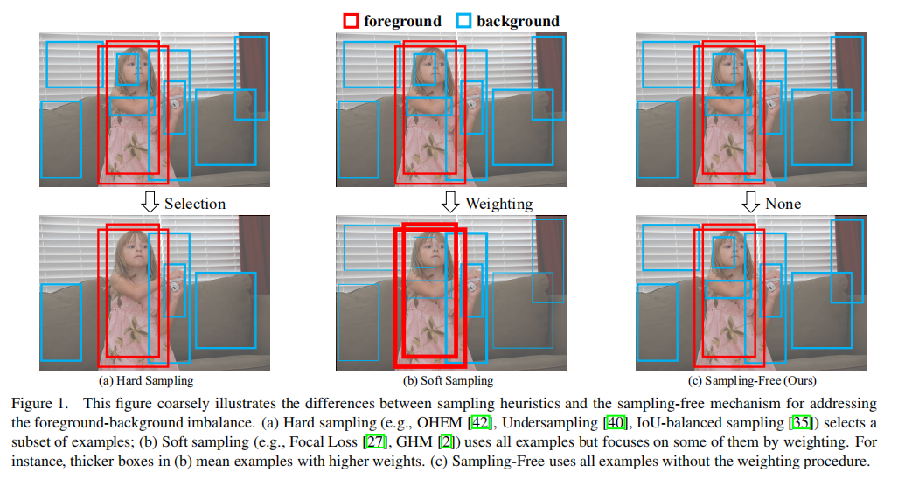

#### 3.  Methodology
​		前景和背景的不平衡问题在训练和推理过程都同等地存在，因此这种不平衡可能不会降低检测精度。然而，如图1（a）和（b）所示，**启发式采样为训练样本采用有偏选择或加权策略，这在训练中改变了不平衡分布，并导致训练和推理之间的不对齐。** 因此，图1（c）的免采样方法可能获得比基于采样的模型更好的准确率。然而，如果没有采样策略，目标检测器的性能会大幅下降，作者接下来分析引起这种现象的原因，并引入了免采样机制。

##### 3.1. Investigation for RetinaNet without Focal Loss
​		作者以maskrcnn-benchmark为基础进行实验，并保持默认参数，例如在COCO数据集上，初始学习率为0.01、12个epoch的训练、批大小为16和 $1333 \times 800$ 的输入尺度。将具有Focal Loss的RetinaNet简记为RetinaNet-FL，将没有Focal Loss简记为RetinaNet-None。对于RetinaNet-None，使用标准的交叉熵损失。它们的损失分布表示为：
$$
\begin{alignat}{2}
L^{FL}=\frac{1}{N_f}\sum_{i=1}^A\sum_{j=1}^C&[\textbf{1}_{y^i>0}\alpha(1-p_{ij})^\gamma L_{ij}^{FG} \\
&+\textbf{1}_{y^i=0}(1-\alpha)p_{ij}^\gamma L_{ij}^{BG}],  \tag{1}
\end{alignat}
$$

$$
L^{CE}=\frac{1}{N_f}\sum_{i=1}^A\sum_{j=1}^C[\textbf{1}_{y^i=j}L_{ij}^{FG}+\textbf{1}_{y^i\ne j}L_{ij}^{BG}], \tag{2}
$$

其中对于前景， $L_{ij}^{FG} = -\log(p_{ij})$ ，对于背景，$L_{ij}^{BG}=-\log{1-p_{ij}}$ 。对于Focal Loss，$\alpha=0.25$， $\gamma=2$ 。

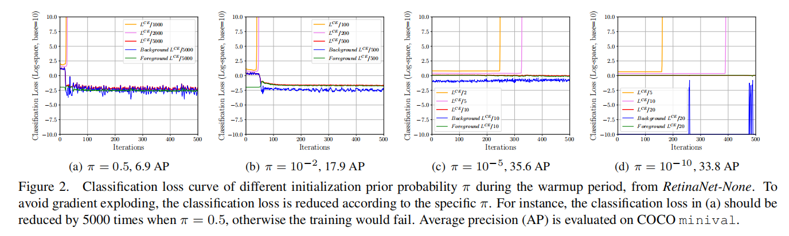

**梯度爆炸和背景主导：** 作者首先尝试训练没有修改初始化或者损失的RetinaNet-None。在训练期间很快便出现梯度爆炸。为了解决这个问题，作者减小了分类损失 $L^{CE}$ 的权重，并重新训练模型。如图2（a）所示，直到 $L^{CE}$ 减小了5000倍，在阻止了梯度爆炸。然而，这种设置下，模型仅获得6.9的AP。

​		图2（a）中分类损失过早地降到非常低的级别（ $\approx10^{-2.5}$ ），这可能限制其获得高准确率。这可能是由压倒性数量的背景样本占据主导引起的。在训练开始时，它们会产生大量的、不稳定的损失值，这就需要降低分类损失的权重来避免梯度爆炸。但是在降低加权之后，模型可能会在训练期间“利用”不平衡的分布，即模型倾向于估计所有样本，因为背景样本获得极低的损失值。这就是为什么图2中背景损失曲线（Background $L^{CE}/5000$）突然降低。解决这个问题的一个直观思路是向上加权分类损失，但是这又会产生梯度爆炸问题。

​		为了缓解梯度爆炸问题，并加速模型学习，作者与Focal Loss和GHM相似的偏差初始化方法以在训练的开始处见效来自背景样本的大损失。它利用先验概率 $\pi=0.01$来初始化分类分支最后一层中的偏置项 $b$ ，因此在sigmoid激活之后分类分数大约为$0.01$。不幸的是，这仍然会发生梯度爆炸，并且作者不得不将分类损失的权重减小500倍（见图2（b））。尽管将准确率提高到17.9的AP，但是分类损失仍会突然下降，这表明模型仍然“利用”不平衡的分布来获得更低的损失值。

​		因此，作者继续将初始化先验概率 $\pi$降到$\pi=10^{-5}$和$\pi=10^{-10}$，并减小分类损失权重以避免梯度爆炸。令人惊奇之处是，如图2（C）和图2（d）所示，这两种设置分别产生了35.6和33.8的AP。作者注意到$\pi=10^{-5}$的RetinaNet-None的35.6AP与RetinaNet-FL的36.4AP性能相当。这种结果表明通过初始化和检测器损失的调整可以获得与Focal Loss相似的作用。

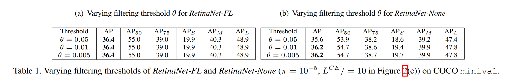

**Confidence Shifting：** 为了进一步提高RetinaNet-None的准确率，作者分子器平均输出分数，并发现它们远低于RetinaNet-FL。为了保留更多的前景，可以在推理期间设置更低的过滤阈值。如表1所示，RetinaNet-None最多产生36.2AP，而RetinaNet-FL没有明显增加。

**Conclusions of Investigation:** 通过仔细的调查，作者发现了极端不平衡所引起的问题。令人吃惊的是，利用一些经验上引入的技术，RetinaNet-None获得与RetinaNet-FL相似的准确率，这启发了作者开发一种优雅的免采样机制，该机制确保无需启发式采样而训练目标检测器。

#### 3.2. Sampling-Free Mechanism

​		受调查的启发，作者提出免采样机制，其从初始化、损失和推理上处理前景-背景不平衡。本文的原则是追求简单而有效的解决方案，并没有引入超参数。

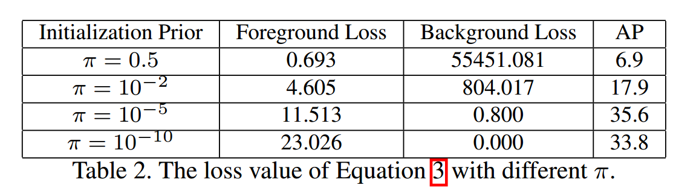

**最优的偏差初始化：** 3.1节证明了初始化的重要性，但是似乎很难发现合适的初始先验值。		假设数据集中具有$C$个目标类的$N$个样本中有$N_f$个前景。训练开始时，样本的置信度得分与初始先验概率 $\pi$ 相似。基于公式2，可以将$L^{CE}$重新表示为:

$$L^{CE}=\underbrace{-\log(\pi)}_{foreground}-\underbrace{(\frac{N}{N
_f}\cdot C-1)\log(1-\pi)}_{background},\tag{3}$$

其中 $C=80$、$\frac{N}{N_F}\approx1000$。在$\pi=0.5,0.01,10^{-5},10^{-10}$中，设置$\pi=10^{-5}$产生最高的准确率，如图2所示。表2给出它们的量化分析结果。

​		作者认为$\pi=10^{-5}$带来比其他设置更好的稳定性，这可能是它具有最高准确率的原因。**一方面，这种设置产生最低的综合损失，其使梯度爆炸的概率最低。另一方面，它阻止模型利用不平衡分布获得更低损失。** 具体而言，仅当$\pi=0.5$和$\pi=10^{-2}$时背景分类损失突然下降（见图2（a）和图2（b）），这说明模型倾向将所有样本预测为背景样本以减小较大、不稳定的背景损失。但是这不会在$\pi=10^{-5}$时发生，因为它已经产生较低的背景损失值。如果继续降低$\pi$（例如$\pi=10^{-10}$），背景损失将会极大地提高，这不利于稳定的训练。

​		基于这种分析，作者提出初始化最后一层卷积层的偏置项以获得损失值的最小值。公式3推导为：

$$\frac{\partial{L^{CE}}}{\partial\pi}=-\frac{1}{\pi}+(\frac{N}{N_f}\cdot C-1)\frac{1}{1-\pi}.\tag{4}$$

​		基于公式4，当 $\pi=\frac{N_f}{N}$时，$\frac{\partial{L^{CE}}}{\partial\pi}$等于0，并且$L^{CE}$获得最小值。由于具有sigmoid激活的偏置项$b$与训练开始时的$\pi$相似，即$\sigma{(b)}\approx\pi$，便可以获得初始值$b=-\log(\frac{N}{N_f}\cdot C-1)$。$\frac{N}{N_f}$在训练之前根据样本计算，由于不需要网络的前传播，所以这会很高效。

​		在初始化损失的最小值后，**模型不再“利用”不平衡的分布以获得更低的损失，这加速了模型的收敛**。上述分析基于具有sigmoid激活的多个独立的分类器，其通常用于一阶段和无锚检测器。免采样的softmax版见补充材料。

**Guided Loss：** 图2展示了减少分类损失的重要性。但是减小的比例难以确定。作者提出一种简单方式来确定减小的比例。**因为回归损失仅用于计算前景，其不会受前景-背景不平衡的影响，作者提出利用回归损失** $L^{reg}$ **来引导损失函数** $L^{cls}$ **的减小**：

$$r=\frac{w^{reg}L^{reg}}{L^{cls}} \tag{5}$$

其中$w^{reg}$为分类损失的权重。注意，公式5时mini-batch中没有反向传播的情况下计算的。全部损失$L$可以写为：

$$L=w^{reg}L^{reg} + w^{cls}L^{cls}\cdot r, \tag{6}$$

其中$w^{cls}$为分类损失的权重。因为回归损失不会受不平衡的影响，所以作者在实验中，简单地使用默认设置$w^{reg}=1$。$w^{cls}$需要通过调整以找到最优值，但是会比前面的工作更容易调整。因为$w^{reg}$和$w^{cls}$是模型固有的参数，实际上没有引入超参数。

**Class-Adaptive Treshold：** 如表1（b）所示，移动过滤值时解决置信度偏移的简单而有效的方式。然而，每个类可能有其最优的过滤阈值，并且对它们进行调整通常是耗时的。作者提出一种类适应阈值方案，其根据训练数据确定过滤阈值：

$$\theta_j=\frac{N_f}{N}\cdot\frac{N_j}{\sum_{j=1}^C N_j}\tag{7}$$

其中$\theta_j$表示为第$j$个类的过滤阈值，而前景与所有样本之间的比例$\frac{N_f}{N}$可以重用最优的偏差初始化方案。$\frac{N_j}{\sum_{j=1}^CN_j}$表示数据集中第$j$个类样本占所有类的比例。因此，类适应阈值可以在训练之前计算。

#### 4. Experiments

##### 4.1. Implementation Details

**Datasets and Metrics：** 使用COCO数据集评估本文的面采样机制。并报告$AP$、$AP_{50}$、$AP_{75}$、$AP_S$、$AP_M$和$AP_L$结果。

**Baselines and Platforms:** 在6个著名的使用启发式采样的目标检测器上执行实验：

- YOLOv3（一阶段）是使用objectness分支来解决不平衡问题的搞笑目标检测器。作者将objectness替换为面采样机制来改进它，输入为$608\times608$。
- RetinaNet（一阶段）。
- Faster R-CNN（两阶段）。
- FoveaBox（无锚）。
- Mask R-CNN（两阶段）。
- Cascade R-CNN（多阶段）。

除YOLOv3外，其他模型的输入为$1333\times800$，使用ResNet-50-FPN作为，训练12个epoch，其他超参数与公开配置保持一致。

##### 4.2. Ablation Studies

**Optimal Bias Initialization：** 见表3（a）。

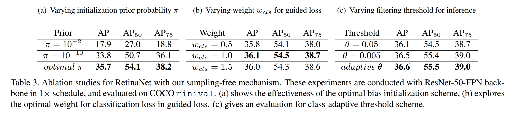

**Guided Loss：** 见表3（b）。

**Class-Adaptive Threshold：** 见表3（c）。

**Without Bias Initialization：** 

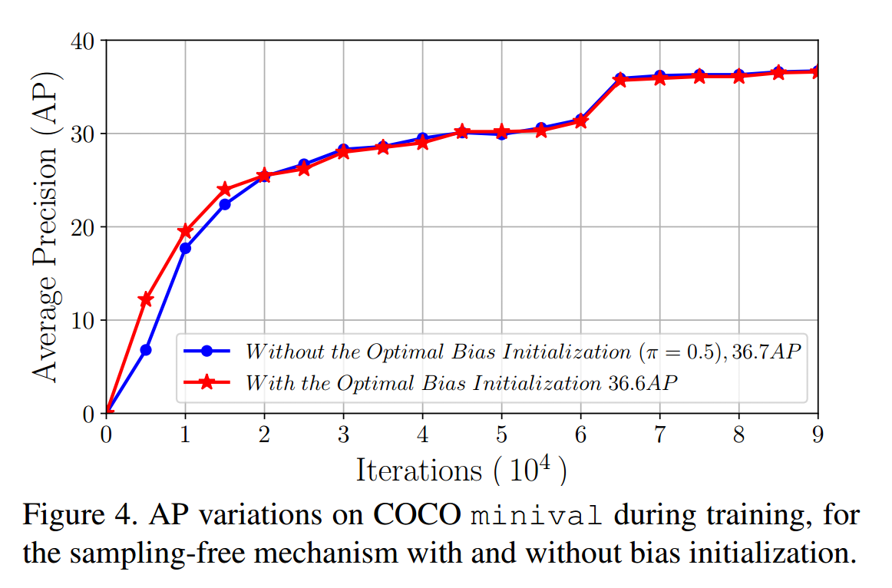

**Sampling-Free for Proposal and Per-Region Stages:** 

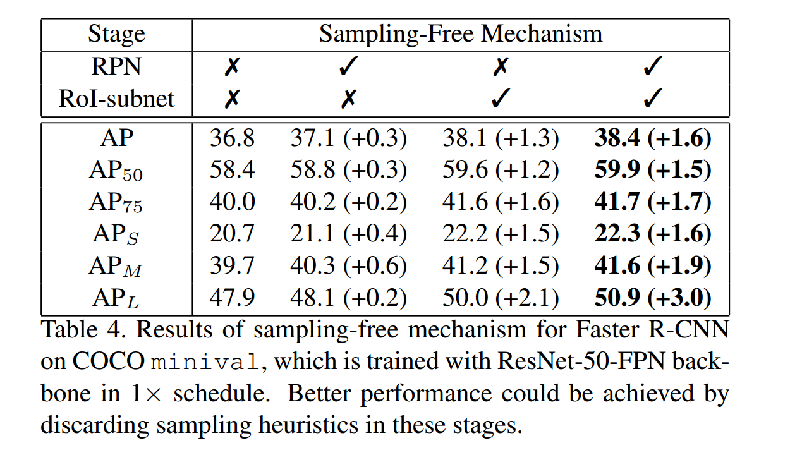

**Training Speed and Memory Cost:**

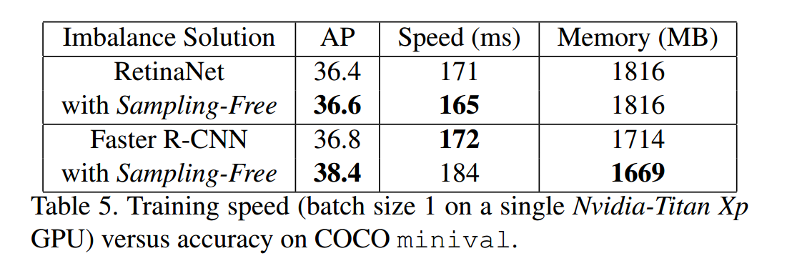

##### 4.3. Results

**Sampling-Free for Various Object Detectors:**

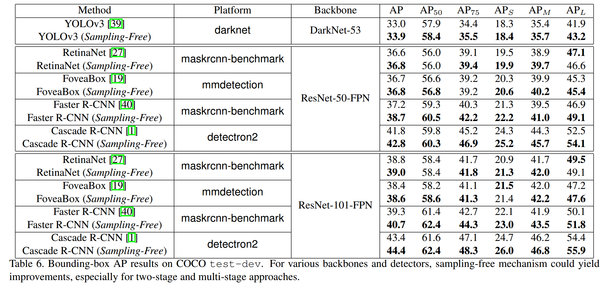

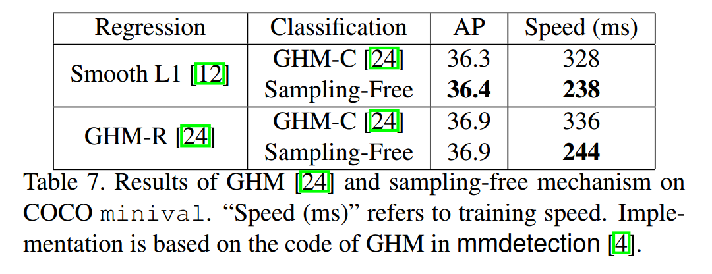

**Sampling-Free for Instance Segmentation:**

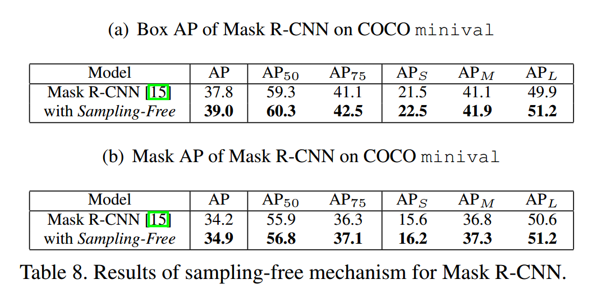