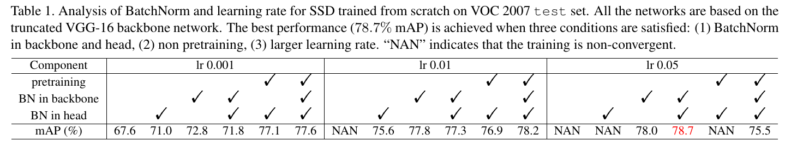
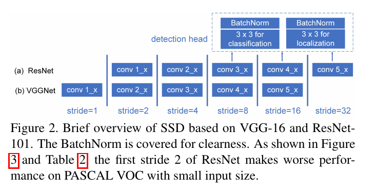
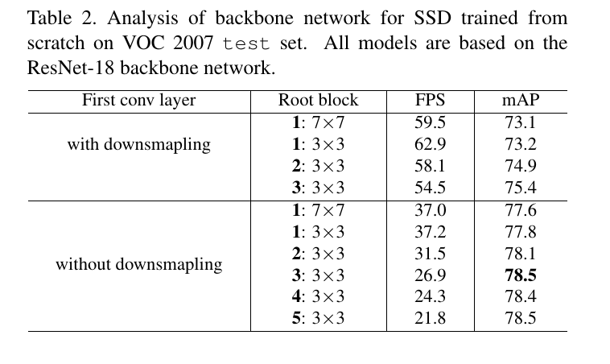
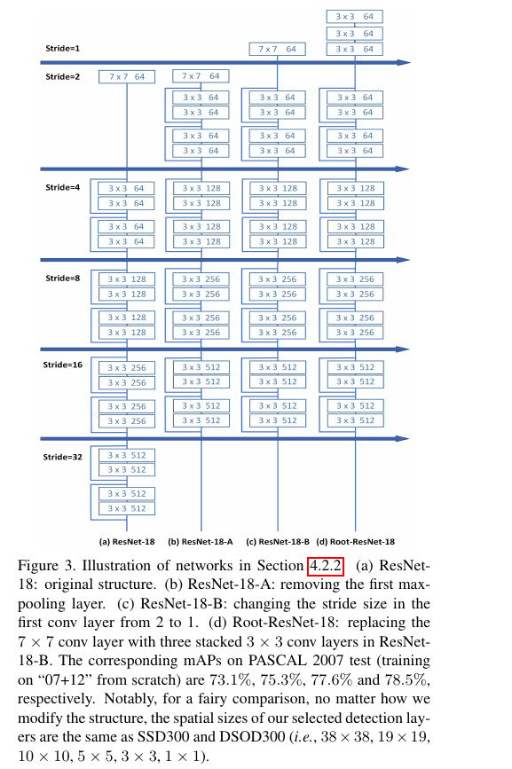

ScratchDet: Training Single-Shot Object Detectors from Scratch
=

# 1. Introduction
对象检测在卷积神经网络框架下做出了巨大进步。当前最佳检测通常是微调在ImageNet数据集上预训练的高度准确的分类网络，例如VGGNet、ResNet和GoogLeNet。微调是将分类知识学习从源域迁移到处理对象检测任务。一般而言，从预训练网络微调可以获得比从头训练更好的性能。

然而，世界上没有免费午餐。微调预训练网络到对象检测有一些严重局限。一方面，分类和检测任务有不同程度的平移敏感性。分类任务更倾向于平移不变，因此需要下采样操作（例如步长为2的max-pooling和卷积）以得到更好的性能。相比之下，局部纹理信息对于对象检测至关重要，需要小心使用平移不变操作。另一方面，在微调过程中改变网络架构是不方便的（即使是很小的改变）。如果我采用一个新的架构，需要在大规模数据集（例如ImageNet）上重新执行预训练，需要很高的计算成本。

幸运的是，从头训练检测其可以消除前面提到的局限。DSOD第一次从头训练CNN检测器，其中深度监督扮演着关键角色。深度监督是在DenseNet中引入的密集逐层连接。然而，DSOD也受预定义的DenseNet架构的限制。如果DSOD采用其他类型的网络（如VGGNet和ResNet），它的性能则会剧烈降低（有时可能在训练中崩溃）。此外，与预训练检测其相比，当前从头训练检测器的最佳性能仍处于较低位置。因此，如果我们希望利用从头训练检测器的优势，那么需要获得两个方面的提高：（1）对于任何类型的架构都是自由的，同时保证训练收敛，（2）给出的性能于预训练网络一样好（甚至更好）。

为此，我们研究影响随机初始化检测器优化的因素。如[29]指出，BatchNorm重新参数化优化问题，使得其解空间变得更加平滑，而不是减小内部协方差转移。 基于这种理论，我们假设从头训练的检测中缺乏BatchNorm是较差收敛的主要原因。因此，我们我们将BatchNorm集成到骨干和检测头部子网络中（图2），并发现BatchNorm在任何形式的网络中（包括VGGNet和ResNet）都有助于良好收敛，而没有预训练并且在准确率上胜过预训练的基线。因此，我们可以自由修改架构，而没有预训练模型的限制。利用这种优势，我们分析基于ResNet和VGGNet的SSD的不同配置的检测器的性能，并发现第一个卷积层中的步长极大地影响检测性能。基于这一点，我们通过引入新的root块来重新设计检测器的架构，这保留了检测特征图中的丰富信息，并实质上提高检测准确率，特别是小对象。

本文的主要贡献总结如下。（1）我们提出一种新的从头训练的单发对象检测器，称为 ScratchDet，其集成BatchNorm来帮助从头训练的检测很好的收敛。（2）我们基于新设计的Root块引入一种新的Root-ResNet骨干网络，其显著提高检测性能，特别是小对象。（3）ScratchDet优于最佳的从头训练检测器以及一些基于预训练的检测器。

# 3. ScratchDet
本节中，我们首先研究从头训练SSD中BatchNorm的有效性。然后，我们通过分析基于ResNet和VGGNet的SSD的检测性能而重新设计了骨干网络。

## 3.1. BatchNorm for Train-from-Scratch
不失一般性，我们考虑在SSD（最常用的一阶段框架）应用BatchNorm。SSD由骨干网络（例如具有几个额外的卷积块的截断VGGNet-16）和检测头部子网络（即每个检测层之后的预测块，其由一个 $3 \times 3$ 的边界框回归卷积层和一个 $3 \times 3$ 的类标签预测卷积层组成）构成。注意，原始的SSD框架中没有BatchNorm。受最近工作[29]的启发，我们认为使用BatchNorm有助于从头训练SSD。BatchNorm使得优化空间更加平滑，导致更加可预测和稳定的梯度行为，以允许更大的搜索空间和更快收敛。DSOD成功地从头训练检测器，然而，它将结果归功于DenseNet的深度监督，而没有强调BatchNorm的影响。我们认为有必要研究BatchNorm在从头训练检测器中的影响。为了验证我们的增强，我们使用128的批大小而没有BatchNorm从头训练SSD以作为我们的基线。如表1的第一列中展示的。我们基线在VOC2007测试集上产生67.6%的 mAP 。

**BatchNorm in the backbone subnetwork.** 我们将BatchNorm添加到骨干子网络的每个卷积层中，然后从头训练。图表1所示，在骨干网络中使用BatchNorm提高了5.2%的mAP。更重要的是，在骨干网络中添加BatchNorm使优化空间更加平滑。因此，我们可以使用更大的学习率（0.01和0.05）以进一步提高性能（即mAP从72.8%提高到77.8%和78.0%）。二者都优于从预训练的VGG-16模型（77.2%）微调的SSD。这些结果表明在骨干子网络中添加BatchNorm是从头训练SSD的关键问题。在附录中，我们绘制在骨干子网络中添加BatchNorm的优化landscape分析曲线，与图1相似。

**BatchNorm in the detection head** 为了分析BatchNorm在检测头部子网络中的影响，我们绘制了训练损失值、梯度的 L2 Norm和梯度的L2 Norm v.s. 训练步的波动。如图1（b）和1（c）的蓝色曲线所示，使用默认学习率0.001从头训练SSD具有较大的梯度L2范数波动，特鄙视在训练的初始阶段，它使损失值突然变化，并收敛到一个坏的局部最小（即图1（a）中，在训练结束时，相对较高的损失和较差的检测结果，67.6% mAP）。这些结果对于解释使用较大的学习率来从头训练具有原始架构或具有训练预先网络的SSD长导致梯度爆炸、较差的稳定性和较弱的梯度预测（见表1）是有用的。

相比之下，在检测头部子网络中集成BatchNorm是损失landscape更加平滑（见图1的曲线），它将mAP从67.6%提高到71.0%（如表1）。平滑的landscape使我们能够设置更大的学习率，从而带来更大的搜索空间和更快的收敛（见图1（a）和1（c））。因此，mAP从71.0%提高到75.6%。此外，使用BatchNorm，更大的学习率有助于跳过较坏的局部最小，并产生稳定的梯度（图1（b）和1（c）的绿色曲线）。

**BatchNorm in the whole network.** 我们还研究了在骨干和检测头部子网络中都使用BatchNorm的检测器的性能。在检测器的全部网络中使用BatchNorm后，我们能使用更大的学习率（0.05）来从头荀兰检测器，其产生的mAP比使用预训练的骨干子网络初始化的检测器高1.5%（78.7% v.s. 77.2%）。详情参见表1 。

## 3.2. Backbone Network
综上所述，我们从头训练带BatchNorm的SSD，并获得比预训练SSD更好的准确率。这鼓励我们从头训练检测器，同事保持网络架构的性能独立。通过利用这些优势，我们能够用于对象检测任务的不同的网络类型。

**Performance analysis of ResNet and VGGNet.** 截断的VGG-16和ResNet-101是两种在SSD（图2中的简明结构概览）中使用的流行骨干网络。一般而言，ResNet-101比VGG-16产生更好的分类结果（ImageNet的top-5分类误差为5.99% v.s. 8.68%）。然而，如DSSD指出的，在PASCAL VOC 中，对于相对较小的输入尺寸（例如，$300 \times 300$），基于VGG-16的SSD优于基于ResNet-101的SSD。我们认为这种现象是由于ResNet-101的第一个卷积层中的下采样（即）造成的。该操作明显影响检测准确率，特别是小型对象（见表2）。在移除ResNet-18的conv1_x中的下采样构成图3（a）中ResNet-18-B之后，检测性能从73.1%提高到77.6% 。我们还移除了第二下采样操作以构成图3（b）中的ResNet-17-A ，其也取得较小程度上提高。总之，第一个卷积层中下采样对检测准确率有较坏的影响，特别是对小型对象。

**Backbone network redesign for object detection.** 为了解决用于对象检测的基于ResNet的骨干网络的劣势，同时保留其分类能力，我们重新设计了一种新的架构，称为 Root-ResNet，它是原始SSD检测器中截断ResNet的改进，如图3（d）所示。我们移除第一个卷积层中下采样操作，并将 $7\times7$卷积核替换为堆叠的 $3 \times 3$ 卷积滤波器（表示为root块）。利用丰富输入，Root-ResNet能够利用更多的图像中的局部信息，以及提取用于小型对象检测的更强力特征。此外，我们将4个卷积块（添加到SSD以提取不同尺度特征图）替换为4个残差块，如附录所示。每个残差块由2个分支组成。一个分支为步长为2的 $1 \times 1$ 卷积层，另一个为步长为1的 $3 \times 3$ 卷积层。每个卷积层中的输出通道数设置为 128 。这些残差块在参数上带来了有效性，而计算上没有性能丢失。

# 4. Experiment
## 4.1. Training Details
所有模型使用0.0005的权重衰减和0.9的动量的SGD在四个NVIDIA Tesla P40 GPU 上从头训练。为了公平比较，我们使用与原始SSD相同的训练设置，包括数据增强、锚尺度和纵横比以及损失函数。我们移除L2规范化。注意，所有实验选择与SSD300和DSOD300的固定空间尺寸的检测层，即没有更大尺寸的特征图用于训练。遵循DSOD，我们使用相对较大的批大小128来从头训练我们的ScratchDet，为了确保训练阶段稳定的统计结果。与此同时，我们为基于预训练的SSD使用默认批大小32（我们还尝试为预训练模型使用批大小128，但是性能没有提高）。

注意，考虑到实验中计算成本，我们使用由ResNet-18重新设计的“Root-ResNet-18”作为模型分析的骨干网络。然而，与最佳的检测器相比，我们使用更深的骨干网络“Root-ResNet-34”以获得更好的性能。ScratchDet的所有实验都使用“Xavier”方法初始化。此外，使用 $300 \times 300$ 的输入尺寸训练所有模型，我们认为使用更大的输入尺寸，ScratchDet可以进一步提高。

## 4.2. PASCAL VOC 2007
### 4.2.1 Analysis of BatchNorm

### 4.2.2 Analysis of the backbone subnetwork.
