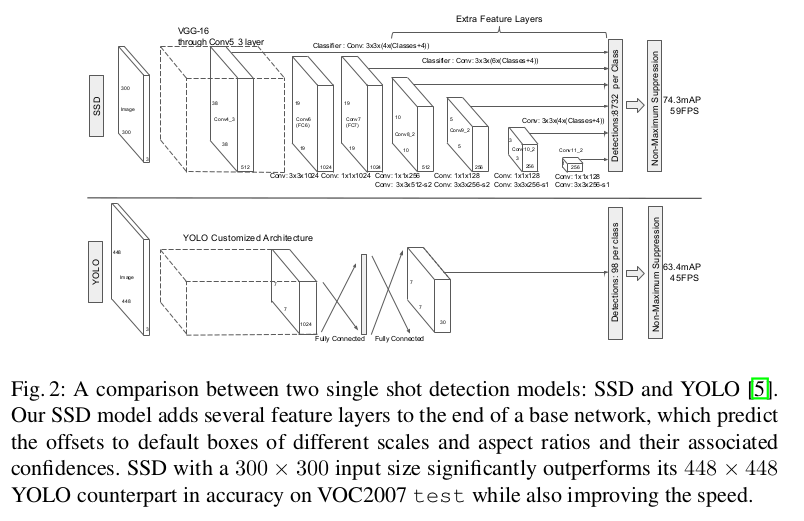
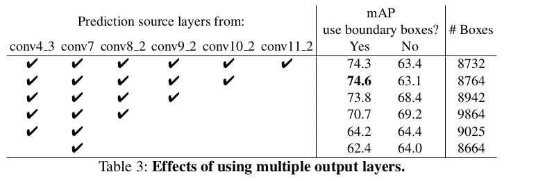
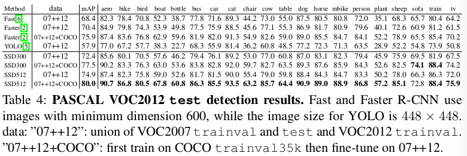

SSD: Single Shot MultiBox Detector
=

# 1 Introduction
本文第一次提出无需为边界框假设重采样像素或特征，并且与这样做的方法有相同准确率。使得高准确率检测器在速度方面有显著提升（在VOC2007 测试集上mAP为74.3% 且59FPS vs Faster RCNN 7FPS 73.2%的mAP 或者 YOLO的45FPS 63.4%的mAP）。在速度方面的基本改善来源于消除边界框提议和后续的像素或特征重采样。本文的改进包括： 使用小卷积滤波器来预测对象类别和偏移，并且将这些滤波器应用到网络后面的多个特征图，以便践行多尺度检测。使用这些修改——特别是使用多层用于不同尺度预测——SSD使用低分辨率输入获得高准确率。

本文的贡献：
- 引入SSD，用于多的类别的单发检测器，它比之前的最优单发检测器（YOLO）更快，并且更加准确，实际上，它与执行显式区域提议和池化的较慢技术一样准确（包括更快的R-CNN）。
- SSD的核心是使用应用到特征的小卷积滤波器来为一组固定的默认边界框（default bounding boxes）预测类别得分和边界框偏移。
- 为了获得高准确率，来自不同尺度的特征图产生不同尺度的预测，并且通过总弄更比明确地分离预测。
- 这些设计的特征可以简单的端到端训练和高准确率，即使对低分辨率输入图像，进一步改善速度和准确率的平衡。
- state-of-the-art

# 2 The Single Shot Detector（SSD）
## 2.1 Model

**Multi-scale feature maps for detection** 将卷积特征层添加到截断的基础网络的末尾。这些层逐渐减小尺寸，并且允许多尺度的检测预测。用于预测检测的卷积模型对于每个特征层是不同的（参见Overfeat [4]和YOLO [5]，其在单个尺度特征图上操作）。

**Convolutional predictors for detection** 每个添加的特征层（或者基础网络中可选的已存在的特征层）使用一组卷积滤波器可以产生一组固定的检测预测。网络架构如图2，对于尺寸为 $m \times n$ 的 $p$ 通道特征层，用于预测潜在检测参数的基本元素是 $3 \times 3 \times p$ 小内核，其产生类别的分数或相对于默认框坐标的形状偏移。

**Default boxes and aspect ratios** 每个特征图单元关联一组default bounding boxes，默认狂以卷积方式在特征图上平铺，使得每个边界框位置对应的单元是固定的。在每个特征图单元，预测单元中关联默认框的偏移，同时预测每个类别的得分，得分指示这些边界框中类实例存在的概率。具体地，具体来说，对于给定位置的k中的每个框，我们计算 $c$ 类别分数和相对于原始默认框形状的4个偏移。这导致在特征图中的每个位置周围应用总共 $(c + 4)k$ 个滤波器，产生 $m \times n$ 特征图的 $(c + 4)kmn$ 输出。如图1 。

## 2.2 Training
**Matching stragety** yaccard 重叠高于 0.5，则该默认框为正类，否则为负类。

**Training objective** 令 $x_{ij}^p = \{0, 1\}$ 是第 $i$ 个默认框匹配第 $j$ 个类为 $p$ 的ground-truth框的指示器。如上述的匹配策略，有 $\sum_i {x_{ij}^p} \ge 1$ 。综合目标损失函数是定位损失（ $loc$ ）和置信度损失 （ $conf$ ）的权重和：
$$L(x, c, l, g) = \frac{1}{N}(L{conf}(x, c) + \alpha L_{loc}(x, l, g))  \tag 1$$
其中 $N$ 是匹配上的默认框数量。如果 $N = 0$ ，设置损失为 0 。定位损失是预测边界框（ $l$ ）和ground-truth边界框（ $g$ ）之间的 Smooth L1损失。与Faster R-CNN相似，回归默认框（$d$）的中心 $(cx, cy)$ 与它的宽（$w$）和高（$h$）的偏移。
$$
\begin{alignat}{0}
L_{loc}(x, l, g) = \sum_{i\in Pos}^N \sum_{m\in \{cx, cy, w, h\}} x_{ij}^k smooth_{L1}(l_i^m - \hat{g}_i^m)   \\
\hat{g}_j^{cx} = (g_j^{cx} - d_i^{cx}) / d_i^w   \\
\hat{g}_j^{cy} = (g_j^{cy} - d_i^{cy}) / d_i^y   \\
\hat{g}_j^w = \log(\frac{g_j^w}{d_i^w})  \\
\hat{g}_j^h = \log(\frac{g_j^h}{d_i^h})
\end{alignat}  \tag 2
$$
置信度损失是多个类别置信度（$c$）的softmax损失。
$$L_{conf}(x, c) = -\sum_{i\in Pos}^N x_{ij}^p \log(\hat{c}_i^- ) - \sum_{i \in Neg} \log(\hat{c}_i^0) \\
 \mbox{ where }  \hat{c}_i^p = \frac{\exp(c_i^p)}{\sum_p \exp(c_i^p)}  \tag 3$$

 **Choosing scales and aspect ratios for default boxes** 假设存在 $m$ 个特征图用于预测，每个特征图的默认框尺度为：
 $$s_k = s_{min} + \frac{s_{max} - s_{min}}{m - 1} (k - 1), k \in [1, m]  \tag 4$$
 其中 $s_{min} = 0.2$ ， $s_{max} = 0.9$ ，使用不同的纵横比 $1, 2, 3, \frac{1}{2}, \frac{1}{3}$ ，则宽度为 $w_k^a = s_k \sqrt{a_r}$ ，高为 $h_k^a = s_k / \sqrt{a_r}$ ，结果每个特征图位置产生6个默认框。每个默认框的中心为 $(\frac{1 + 0.5}{|f_k|}, \frac{j + 0.5}{|f_k|})$ ，其中 $|f_k|$ 是第 $k$ 个正方形特征图的大小， $i, j \in [0, |f_k|]$ 。

 **Hard negative mining** 在进行匹配步骤后，大多数默认框是负类，特别是当默认框的数量很大时。这导致严重的正类和负类的不平很。**与使用所有负样本相反，我们使用最高置信度损失排序每个默认框，并且选择默认框使得正负样本之比为 $1:3$** 这可以更快地优化和更稳定的训练。

 **Data augmentation** 为了是模型在不同输入对象大小和形状上具有更好的鲁棒性，每幅训练图像通过如下方法随机采样：
 - 使用整幅输入图像。
 - 采样一个补丁（patch）使得与其与对象的最小yaccard重叠为0.1、 0.3、 0.5、 0.7 或 0.9 。
 - 随机采样一个补丁。
 每个采样补丁的大小是原始图像的 $[0.1, 1]$，并且纵横比在 $frac{1}{2}$ 和 2 之间。在进行上述操作后，每个采样补丁调整到固定尺寸，并以0.5的概率随机水平翻转，此外，还使用颜色扭曲。

# 3 Experimental Results
**Base network** 以VGG16为基础，其在ILSRVC CLS-LOC数据上预训练。与DeepLab-LargeFOV相似，将 $fc6$ 和 $fc7$ 转换成卷积层，下采样参数来自 $fc6$ 和 $fc7$ ，将 $pool5$ 由 $2 \times 2 - s2$ 改为 $3 \times 3 - s1$ ，并使用atrous算法填补感受野。移除所有dropout层和 $fc8$ 层。初始学习率为 $10^{-3}$ ，momentum = 0.9 ，weight decay = 0.0005 ，batch size = 32 。

## 3.1 PASCAL VOC2007
VOC2007数据上训练60k，前40k学习率为 $10^{-3}$ ，后面10K学习率降为 $10^{-4}$ 和 $10^{-5}$ 。

## 3.2 Model analysis

- Data augmentation is crucial.
- More default box shapes is better.
- Atrous is faster. 使用atrous版本的子采样VGG16 。如果使用全部的VGG16，保持 $2 \times 2 - s2$ 的pool5，并且没有来自fc6和fc7的子采样参数，以及添加conv5_3用于预测，结果大致相同，但是速度降慢大约20% 。
- Multiple output layers at different resolutions is better.

## 3.3 PASCAL VOC2012
前60k学习率为 $10^{-3}$ ，然后20k为 $10^{-4}$ 。

## 3.4 COCO
默认框的最小尺度由0.2变为0.15， conv4_3上的尺度为0.07（即$300 \times 300$ 图像的21个像素）。前160k迭代学习率为 $10^{-3}$，然后40k为 $10^{-4}$ ，最后40k为 $10^{-5}$ 。

