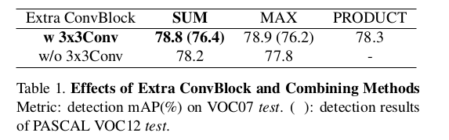

StairNet: Top-Down Semantic Aggregation for Accurate One Shot Detection
=

# 1 Introduction
CNN时代，大多数研究集中在网络工程，而不是特征工程。设计更好的网络架构成为广泛视觉问题的关键问题，其中对象检测是最快速发展的领域之一。当前的工作主要集中在两类方法，一种是基于区域提议的两阶段方法，第一阶段是生成稀疏的提议，第二阶段精炼这些提议，这类方法虽然获得了高准确率，但是却不满足实时性，这是由于其需要高内存和大量计算。另一种是一阶段方法，如SSD或YOLO，它们直接预测输出，而不需要区域提议模块。但是产生了较低质量的边界框，导致小对象或遮挡对象的错误定位。

检测不同尺度的对象已成为一项巨大挑战。在CNN之前，图像金字塔作为一种解决方案。例如，可变形组件模型（DPM）[7]使用多尺度图像来生成多尺度特征，然后过滤器在特征金字塔顶部密集滑动。基准测试中最近排名靠前的探测器[6,20]也使用多尺度图像进行训练和测试。尽管图像金字塔的结果很有希望，但计算时间大大增加并且内存使用率也很高。相反，我们借鉴了最近的方法[21]，尤其是采用SSD风格的金字塔。多尺度特征已经通过CNN的子采样构建。然而，原始SSD的金字塔错过研究对于小对象检测的语义强壮的信息。同时使用特征组合模块提升性能。

已经广泛认识到，上下文信息对于检测视觉上贫困的对象（例如，小的、截断的和被遮挡的对象）是决定性的。FPN采用最近邻上采样和侧连接来组合高层特征和低层特征。相反，本文采用不同的组件和精心设计的top-down特征组合模块，它显著改善SSD的弱处。本文的贡献：
- 提出StairNet框架，它有效地统一多尺度表征和语义分布。
- 进行了大量的消融实验，并为特征组合引入了一套有效的设计选择。
- 在PASCAL VOC 2007 和 2012 上获得state-of-the-art性能。

# 2 Related works
有效的结合强壮的语义（例如：全局上下文信息）和精细的局部细节可以改善判别性能。本文提出top-down特征组合模型来有效地扩散语义。

# 3 StairNet
## 3.1 A weak spot of current detectors
虽然最近设计用于物体检测的CNN模型已经显示出解决多类问题的出色能力，但是对于各种尺度的物体的检测已经几乎没有改进。例如，Faster R-CNN处理提议机制到单个网络。然而，对于对象提议，这种方法仅依靠大感受野的特征图（例如conv5）。由于滤波器的感受野是固定的，但是自然场景中对象尺度是变化的，所以这会造成不一致（discordance）并影响性能。可以总结为一个简单的数学表达式：
$$
\begin{alignat}{0}
f_n = C_n(f_{n-1} = C_n(C_{n-1}(...C_1(I)))),   \tag 1  \\
\mbox{Object Proposals} = P(f_n)  \tag 2  
\end{alignat}
$$
其中 $I$ 是输入图像， $C_n$ 是第 $n$ 个卷积块，其包含卷积层、池化层、ReLU层等。 $f_n$ 是第 $n$ 层特征图， $P$ 是转换某个特征图到检测输出（类别置信度和边界框位置）的预测层。

最近为了解决式（2）的问题，SSD和MS-CNN关注深度CNN的内部特征度已经是多尺度、金字塔形状的事实。它们利用低分辨率的特征图检测大对象，高分辨率的特征图检测小对象。这两种方法可以表示如下：
$$
\begin{align}
\mbox{Detection Outputs} = \{P_{n - k}(f_{n - k}), ..., P_n(f_n)\}, \\
 \mbox{where  } n > k > 0  
\end{align}   \tag 3
$$
由于它们直接强制每个层负责某个尺度，因此用于预测的每个层必须在语义上很强。  

众所周知，SSD型检测器在小物体上的性能较差，而它们与大型物体上最先进的两阶段检测器相比具有竞争力。这是由于其低层特征图不包含强壮语义（例如，纹理信息）。由于每个特征图的感受野不同，所以它们包含不同语义级别的语义。换句话说，随着特征图级别下降，语义水平逐渐降低 $(n \rightarrow n - k)$ 。最底层包含若语义、局部特征。Couplenet发现实际感受野（actual receptive field: arf）的尺寸远小于理论感受野（theoretical receptive field: trf）大小。《Understanding the effective receptive field in deep convolutional neural networks》发现感受野中心附近的像素具有比外部像素大得多的影响，导致2D高斯形状也占据比trf更小的部分。这些发现表明trf大小设置了一个arf的上界。由于小对象响应的 $f_{n-k}$ 的arf大小为58.6 ，可以推断出 $f_{n-k}$ 严重缺乏全局上下文信息，并且仅能看见300或512大小图像的局部部分。式（3）中，并没有考虑这个问题，并且直接使用 $f_{n-k}$ 检测小对象，这导致了较差的性能。因此，本文提出一种新的有效表达式来处理这个问题：
$$
\begin{alignat}{0}
\mbox{Detection Outputs} = \{P_{n-k}(f_{n-k}'), ..., P_n(f_n')\}  \\
f_n' = f_n  \\
f_{n-1}' = f_n + f_{n-1}  \\
.  \\
.  \\
.  \\
f_{n-k}' = f_n + f_{n-1} + ... + f_{n-k}  \\
\mbox{where} n > k > 0
\end{alignat}   \tag 4
$$

## 3.2 Network Architecture

图2是StairNet的框架。

### 3.2.1 Meta-architecture of StairNet
*第一个设计原则是利用网络自身的特征金字塔，因此采用SSD框架作为StairNet的meta-architecture。* 使用5中尺度的特征图，它们的步长为 $\{8, 16, 32, 64, 100\}$ 。前两个特征图来源于 conv4_3 和 conv5_2。然后维持三个特征图来自步长为的2的子采样层。默认框尺度分别为 $\{0.1, 0.2, 0.37, 0.54, 0.71\}$ ，在所有尺度，使用纵横比为 $\{2, 3\}$ 的默认框。

### 3.2.2 Feature Combing Module
*第二个设计原则是事所有特征图在语义上是强壮的。* 使用特征组合模块，可以将顶层的高级抽象特征传递到低层（图2的虚线框里的结构）。该模块包含两三个部分： $1 \times 1$ 卷积层、反卷积层和 $3 \times 3$ 卷积层 。

为了结合上层的传播信息和相应低层的原始特征，引入了1x1卷积层。在所有特征图中采用256通道，而原始的通道数为 $\{512, 1024, 512, 256, 256\}$ 。为了组合不同尺度的特征图，添加反卷积层，其上采样因子为2 。上层特征相对于低层有更强的语义。在组合它们之前，需要标准化特征，因为不同层的特征有不同尺度的分布。最后使用逐元素加法组合特征。组合后的特征直接用于下一次的特征组合。高低层的特征有着不同的语义，为了高效的混合这些信息，使用一个 $3\times3$ 卷积来构建最后的增强特征图用于分类和回归。

### 3.2.3 Unified Prediction Layer
采用统一的预测层有如下好处：
1. 可以减小预测的参数量。
2. 类似语义表示相对于分层和统一分类器的潜在优点是减轻了对象尺度上的训练数据不平衡问题。例如：由于大型奶牛和小型奶牛的最终特征表征相似，用大型奶牛训练的分类器也适用于小型奶牛。

统一预测层预测对象存在的概率和边界框偏移，使用特征组合模块的输出作为输入，该层使用 $(c+4) k$ 个滤波器的 $3 \times 3$ 卷积层。

# 4 Experiments
## 4.1 Ablation studies on VOC 2007

