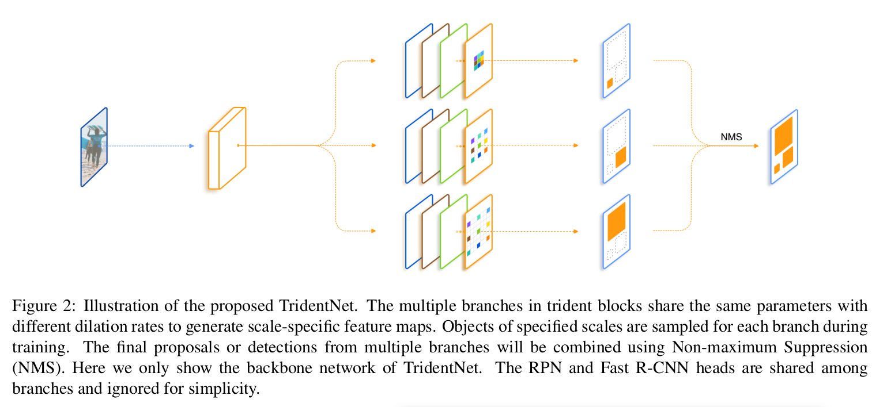
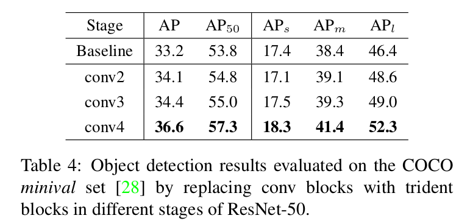
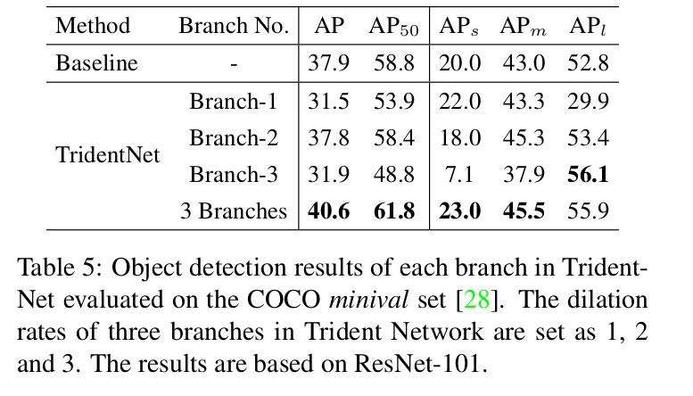

Scale-Aware Trident Networks for Object Detection
==

# 1. Introduction
最近几年，深度卷积神经网络（CNN）在对象检测上获得极大成功。通常，这种基于CNN的方法可以大致分为两种类型：一阶段方法，如YOLO或SSD，其直接使用前向CNN来预测兴趣区域的边界框；而两阶段方法，如Faster R-CNN或R-FCN首先生成提议，然后利用CNN提取的区域特征进行进一步精炼。然而，两种方法的核心问题在于处理尺度变化。对象实例尺度在较宽范围变化是非常常见的，其妨碍了检测其的性能，特别是非常小或者非常大的对象。

为了解决尺度变化问题，一个直接的方式是使用多尺度图像金字塔[1]，它基于手工设计特征的方法中很流行（表1（a））。强力证据表明当前标准的深度检测器可以从多尺度训练和测试获益。为了避免训练对象具有极端的尺度（更小/更大尺度上的小型/大型对象），SNIP提出尺度规范化方法，器选择性地训练每个图像尺度中合适尺寸的对象。然而，推理时间使得图像金字塔在实际应用中不是灵活的。

另一种方法是使用网络内特征金字塔来近似图像金字塔，从而减少计算成本。这种思想最先出现在[13]中，其中通过插值相邻尺度层的一些特征通道构造快速特征金字塔进行目标检测。在深度学习时代，这种近似更加容易。SSD利用不同层的多尺度特征图，并在每个特征层上检测不同尺度的对象。为了补偿低级特征语义缺失，FPN（图1（b））进一步增加一个自上而下的路径和侧连接来合并高层特征的强语义信息。然而，不同尺度的对象的表示能力仍然不同，因为它们的特征是在FPN中的不同层提取的。

图像金字塔法和特征金字塔法都有相同的动机，即模型对于不同尺度的物体应该具有不同的接受域。尽管图像金字塔的效率很低，但它充分利用了模型的表征能力，平等地对所有尺度的物体进行了变换。相比之下，特征金字塔则生成多层特征，从而牺牲了不同尺度下的特征一致性。这项工作的目标是通过高效地为所有尺度创建具有统一表示能力的特征，从而充分利用两种方法。

本文中，我们不是如图像金字塔一样馈入不同尺度的输入，而是提出一种新颖的网络结构以适应不同尺度的网络。特别地，我们使用所提出的trident block创建多个尺度特定的特征图，如图1（c）所示。在扩张卷积[43]的帮助下，三叉戟块的不同分支具有相同的网络结构和相同的参数权重，但感受野不同。此外，为了避免使用极端尺度训练，我们利用一个尺度感知的训练方案，使每个分支特定于给定的尺度范围，匹配其感受野。最后，由于整个多分支网络权重共享，在推理期间，仅使用一个主分支来估计全部 TridentNet 。这种估计仅代理很小的性能衰减。因此，它可以在不影响推理速度的情况下，比单尺度基线取得显著的改进。这个特性使得TridentNet在实际应用中比其他方法更受欢迎。

综上所述，我们的贡献如下:
- 我们展示了感受野对不同尺度对象的影响的调查结果。据我们所知，我们是第一个设计控制实验来探索对象检测任务中的感受野。
- 我们提出一种新颖的 Trident Network 来处理对像检测中的尺度变化问题。通过多分支结构和尺度感知训练，TridentNet可以生成具有统一表示能力的尺度特定的特征图。
- 在三叉分块设计的帮助下，我们提出了一种通过一个主要分支的快速逼近方法，从而在推理过程中不引入额外的参数和计算成本。
- 我们通过彻底的消融研究，验证了我们的方法在标准COCO基准上的有效性。与目前最先进的方法相比，我们提出的方法在以ResNet-101为骨架的单模型下，以48.4的mAP取得了显著的效果。

# 2. Related Work
**Deep Object Detectors.** 最近，基于深度学习的对象检测方法已被证明在准确率和速度方面有极大的提高。两阶段检测方法[17,16,37,10,5,24]是最主要的检测器之一，首先生成一组区域提议，然后由CNN网络进行细化。在[17]中，R-CNN通过选择性搜索生成区域提议，然后通过一个标准的CNN独立并依次地对从原始图像裁剪的提议区域分类。为了减少R-CNN中特征提取的冗余计算，SPPNet和Fast R-CNN只提取整个图像的特征一次，然后分别通过空间金字塔池化和RoI池化层生成区域特征。RoI池化层进一步被RoIAlign改进以处理粗超的空间量化问题。Faster R-CNN最先提出一个统一的端到端的对象检测框架。它引入区域提议网络（RPN），器于检测网络共享相同的骨干网络，从而替换原始的独立耗时的区域提议方法。为了进一步提高Faster R-CNN的效率，R-FCN通过全卷积网络构建一个位置敏感得分图，从而避免逐RoI的头部网络。为了避免R-FCN中额外的大得分图，Light-Head R-CNN设计通过使用一个薄特征图和一个便宜的R-CNN子网络，从而更高效地构建两阶段检测器。

另一方面，由YOLO和SSD推广的一阶段方法，旨在通过预定义的锚点直接进行分类，并使用CNN进一步细化，而不需要提议生成步骤，从而具有更高的检测效率。基于SSD中的多层预测模块，DSSD使用deconvolution操作引入额外的上下文信息，从而提高准确率。RetinaNet提出一种新的焦点损失（focal loss）来处理极端的前景-背景类不平衡，类别不平衡问题是一阶段检测的关键问题。继承两阶段的优点，RefineDet提出一种anchor精炼模块，器首先过滤负类anchor框，并粗超的调整锚框以用于下一个检测模块。

**Method for handling scale variation.** 作为对象检测中的最具挑战的问题，对象实例上的大尺度变化妨碍了检测准确率。多尺度图像金字塔是改善检测方法的常用方案，特别是对小和大尺度的对象。基于图像金字塔策略，SNIP提出一种尺度规范化方法，对于多尺度训练期间的每个分辨率，该方法训练位于期望尺度范围的对象。为了更高效地执行多尺度训练，在训练期间，SNIPER仅选择ground-truth实例周围的上下文区域，并在每个尺度上采样背景区域。然而，SNIP和SNIPER仍然遭遇不可避免的推理时间增加。

一些方法不适用多个图像作为输入，而是通过使用CNN的不同层产生的多层特征避免由尺度变化引起的问题。如HyperNet和ION的方法拼接底层和高层特征图用于预测。由于不同层的特征通常具有不同的分辨率，在融合多层特征之前需要设计特定的标准化或者变换操作。相反，SSD和MS-CNN在不同尺度对象的多层上执行检测时没有使用特征融合。TDM和FPN进一步引入自上而下的路径和侧连接来加强底层中低级特征的语义表示。PANet通过额外的自下而上的路径增强来强化FPN中的特征层次，并提出自适应特征池化以聚合所以级别的特征以进行更好的预测。我们所提出的TridentNet不使用不同层的特征，而是通过多个并行分支生成尺度特定的特征，因此，我们的网络为不同尺度的所有对象赋予相同的表示能力。

**Dilated convolution.** 膨胀卷积（也叫atrous卷积）通过在稀疏采样位置执行卷积扩大原始权重的卷积核，因此，增加了感受野而没有额外的参数成本。膨胀卷积被广泛用于语义分割已处理大尺度上下文信息。在对象检测领域，DetNet设计设计一种特定的检测骨干网络来维持空间分辨率，并使用膨胀卷积来扩大感受野。可变形卷积通过自适应地学习2D偏移，从而提出更一般的卷积操作。我们的工作中，我们在对分支中采用具有不同膨胀率的膨胀卷积架构以适应不同尺度对象的感受野。

# Investigation of Receptive Field
存在几种影响对象检测性能的骨干网络设计因素，包括下采样率、网络深度和感受野。[4,25]已讨论了它们的影响。前两个因素的影响是直接的：具有低采样率的更深网络可能增加复杂度，但是通常对检测任务有好处。然而，据我们所知，目前还没有单独研究感受野的影响的工作。

为了调查不同尺度对象检测的感受野上的影响，我们使用膨胀变体替换骨干网络中的一些卷积操作。我们使用不同的膨胀率来控制网络的感受野。膨胀率为 $d_s$ 的膨胀率在连续的滤波器值之间插入 $d_s-1$ 个零，从而扩大核大小，而没有增加参数量和计算。具体而言，膨胀的 $3 \times 3$ 卷积与核大小为 $3 + 2(d_s-1)$ 的卷积有相同的感受野。假设当前特征图与输入图像的下采样率为 $s$ ，然后膨胀率为 $d_s$ 的膨胀卷积使网络的感受野增加 $2(d_s-1)s$ 。因此，如果我们使用膨胀率 $d_S$ 修改 $n$ 个卷积层，感受野可以增加 $2(d_s-1)sn$ 。

我们使用一个Faster R-CNN[37]检测器在COCO基准[28]上进行了这个试点实验。结果以COCO-style Average Precision (AP)对所有对象和大小为小、中、大的对象分别进行分别报道[28]。我们使用ResNet-50和ResNet-101作为骨干网络，并在conv4阶段变化残差块中的 $3 \times 3$ 卷积中的膨胀率 $d_s$ 。

表1总结了不同膨胀率的检测结果。我们可以发现，随着感受野的增加（更大的膨胀率），在ResNet-50和ResNet-101上，检测器对小对象的探测性能持续下降。而对于大型对象，检测器从增加的感受野中获益。上述发现认为：

1. 对尺度对象的性能受网络感受野的影响。最合适的感受野与对象尺度强力相关。
2. 尽管ResNet-101有足够大的理论感受野覆盖COCO中的大尺度对象（大于 $96 \times 96$ 分辨率），但是大型对象的性能仍能在扩大膨胀率后得到改善。这个发现与[32]中的有效感受野小于实际感受野有相同的思想。我们假设检测网络的有效感受野需要小尺度和大尺度之间的平衡。增大膨胀率通过强调大的对象来扩大有效的感受野，从而影响小物体的检测结果。

前面提到的实验激励我们去适应不同尺度对象的感受野，具体内容将在下一节中详细介绍。

# 4. Trident Network
在这一节中，我们描述我们的 scale-ware Trident Network 。所提出的 TridentNet 由权重共享的 trident 块和精心设计的尺度感知训练方案组成。最后，我们介绍TridentNet的推理细节，包括一个快速推理估计方法。

## 4.1. Network Structure
我们的目标是继承不同感受野大小的优点，避免它们在检测网络中的缺点。我们提出新颖的Trident架构来获得这种能力，如图2所示。特别地，我们的方法采用单一尺度图像作为输入，然后通过具有相同参数不同膨胀率的卷积的并行分支来创建尺度特定的特征图。

以ResNet为例，对于瓶颈风格的单一残差块，其由核大小为 $1 \times 1$ 、 $3 \times 3$ 和 $1 \times 1$ 三个卷积组成，相应的三叉戟块被构造为具有用于 $3×3$ 卷积的不同扩张率的多个并行残余块。三叉戟块的堆叠使我们能够像第3节的中试实验那样有效地调节不同分支的感受野。通常，我们使用trident块替换骨干网络最后一个阶段中的块，因为更大的步长导致所需感受野的更大差异。详细设计选项见5.3节。

**Weight sharing among braches.** 我们的多分支三叉戟系统面临的一个紧迫问题是它的引入了几倍的参数，这可能导致过拟合。幸运地是，不同的分支共享相同的结构（除了膨胀率），因此使权重共享更直接。在这项工作中，我们共享所有分支的权重以及他们关联的RPN和R-CNN头部，并且在个分支中仅变化膨胀率。

权重共享有三个方面的好处。它减少参数量，并使网络与原始的检测器相比没有额外的参数。这也与我们的动机相呼应，不同尺度的对象应该经历一个具有相同表征能力的统一变换。最后一点是，可以在所有分支的更多对象样本上训练变换参数。换句话说，在不同的感受野下，对相同的参数进行不同尺度范围的训练。

## 4.2. Scale-aware Training SCheme
所提出的三叉戟架构根据预定义的膨胀率生成尺度特定的特征图。然而，表1中由尺度不匹配（例如，分支上的小型对象具有太大的膨胀率）引起的衰减仍存在于每个分支。因此，在不同分支检测不同尺度的对象是很自然的。这里，我们提出尺度感知训练方案来改善每个分支中的尺度感知，并避免不匹配分支中的极端尺度的训练对象。

与SNIP相似，我们为每个分支 $i$ 定义一个有效范围 $[l_i, u_i]$ 。在训练期间，我们仅选择尺度位于每个分支相应的有效范围中的提议和ground-truth边界框。具体而言，对于宽 $w$ 、高 $h$ 的RoI，如果它满足如下条件，则这个RoI是有效的：

$$l_i \le \sqrt{wh} \le u_i \tag 1$$

这种尺度感知训练方案可以用在 RPN 和 R-CNN 分支。在原始的 RPN 设计中，RPN执行对象/非对象的二值分类和边界框回归。分类和回归的目标根据一组参考框（即anchor）定义。在我们的尺度感知训练中，我们在RPN的锚标签赋值过程中，根据公式选择了对这个分支有效的ground-truth 边界框。相似地，我们在 R-CNN 的训练中，为每个分支采样有效的提议。

## 4.3. Inference and Approximation
在推理期间，我们为每个分支生成检测结果，然后过滤掉每个分支中位于有效范围之外的边界框。然后，使用NMS或者Soft-NMS来组合多个分支的检测结果以获得最终结果。

**Fast Inference Approximation.** 为了进一步加速我们的网络，在推理期间，我们可以仅使用一个主分支作为TridentNet的近似。特别地，我们设置它的有效范围为 $[0, \infty]$ 来预测所以尺度的对象。对于图2中的三分支网络，我们使用中间分支作为我们的主分支，因为它的有效范围覆盖大型和小型对象。以这种方式，我们的快速TridentNet相比标准的Faster R-CNN检测器，不会发生额外的时间成本。令人吃惊的是，我们发现这种近似相比原始的TridentNet仅有略微的性能衰减。推理近似的膨胀消融分析见5.2节。

# 5. Experiments
在本节中，我们在COCO数据集上执行实验

## 5.1. Implementation Details
我们使用MXNet重新实现了 Faster R-CNN。遵循其他标准的检测器，网络骨在ImageNet上预训练，然后在检测数据集上微调。输入图像被调整为短边具有800像素的。基线和TridentNet都以端到端方式训练。默认情况下，我们在8个GPU上以16的批量大小训练。总共训练12的时期，学习率分别在8和10个时期后减小10倍，初始学习率为0.02 。基线和TridentNet都采用ResNet的conv4阶段作为骨干特征图，conv5阶段作为rcnn头部。对于每幅图像，我们在TridentNet中的每个分支上采样128个 RoI 。如果没有其他说明，我们使用三分支作为默认的TridentNet结构。3个分支中的膨胀率分别设置为1、 2 和 3 。当采用尺度感知训练方案时，我们设置三个分支的有效范围为 $[0, 90]$ 、 $[30, 160]$ 和 $[90, \infty]$ 。

对于评估，我们报告标准的COCO的AP度量以及 $\mbox{AP}_{50}/\mbox{AP}_{75}$ 。我们报告了COCO风格的 $\mbox{AP}_s,\mbox{AP}_m, \mbox{AP}_l$ ，对应的对象大小为小型（小于 $32 \times 32$） 、中型（从 $32 \times 32$ 到 $96 \times 96$）和大型（大于 $96 \times 96$）。

## 5.2. Ablation Sudies
**Components of TridentNet.** 首先，我们分析TridentNet中的每个部件的重要性。基线方法（表2（a））使用 ResNet-101 和 ResNet-101-Deformable 骨干。然后，我们逐渐地应用我们的多分支架构、权重共享设计和尺度感知训练方案。

1. **Multi-branch.** 基于试点实验，表2(b)给出了一种直接合并不同膨胀率的多个分支的方法。这种多分支变体将AP提高了ResNet-101（从37.9到39.0）和ResNet-101-Deformable（从39.9到40.5），特别是大型对象（增加2.3/1.2）。它表明即使最简单的多分支设计也能从不同感受野受益。
2. **Scale-aware.** 表2（d）表明基于多分支（表2（b））添加尺度感知训练的消融结果。它对小型对象带来改进（ResNet-101/ResNet-101-Deformable分别带来0.8/1.0增加），但是大型对象的性能发生衰减。我们推测是尺度感知训练设计阻止每个分支的极端尺度的训练对象，但是，由有效样本的减少而引起每个分支中的过拟合。
3. **Weight-sharing.** 在多分支（表2（c））和TridentNet（表2（e））上应用权重共享，我们可以在两个基网络上获得一致的改善。它强调权重共享的影响，不仅减少参数量，而且提高检测器的性能。有了权重共享的帮助（表2（e）），因此，所有尺度对象的训练可以避免尺度感知训练的过拟合问题（表2（d））。

最后，TridentNet在两个基网络上获得显著的提高。研究还表明，该结构与形变卷积[11]等自适应调节感受野的方法是一致的。

**Number of branches.** 我们研究TridentNet中分支数量的选择。表3展示了使用四个分支的结果。注意，注意，我们没有在这里添加尺度感知的训练方案，以避免为不同数量的分支精心调整有效范围。表3中的结果表明，TridentNets在单分支方法(基线)的基础上持续改进，AP增加2.7到3.4。因此，考虑到复杂性和性能，我们选择三个分支作为缺省TridentNet设置。

**Stage of Trident blocks.** 我们对TridentNet进行消融研究，寻找在ResNet中放置trident block的最佳阶段。表4展示了在conv2、conv3和conv4阶段使用trident block的结果。对应的特征图步长分别为4、 8 和 16 。相比conv4阶段，在conv2和conv3阶段的TridentNet在基线基础之上获得很小的增加。

**Number of trident blocks.** 由于ResNet的conv4阶段有多个残差块，所以我们也执行消融分析来探索对于TridentNet需要多少trident block 。这里在ResNet-101的conv4上使用Trident block替换不同数量的残差块。图3的结果展示了，当trident block超过10时，TridentNet的性能变得稳定。说明当分支间感受野差异足够大时，TridentNet对三叉戟块的数量具有鲁棒性。

**Performance of each branch.** 我们的TridentNet有多个分支架构，这里，我们研究每个分支的性能。具体而言，我们独立地评估每个分支的性能，而没有尺度范围的限制。表5展示了三个单独分支和三分支方法的结果。正如预期的那样，通过我们的尺度感知训练，感受野最小的branch-1在小对象上取得了良好的效果，而感受野较大的branch-2在中等尺度的对象上效果较好，而感受最大的branch-3在大对象上效果较好。最后，三分支方法继承了单分支方法的优点，取得了最好的效果。

为了进一步减少TridentNet的推理时间，我们希望使用一个主要的分支来近似三个分支的结果。我们将branch-2作为主要的分支，并在表6的scale-aware方案中研究scale范围的影响。表6(c)改进了主分支，在默认的尺度感知范围设置上增加了1.5 AP(表6(b))，其通过扩大其尺度感知范围来训练所有尺度的对象。此外，扩大三个分支的scale-aware 范围以40.0 AP达到最佳性能，这已经接近于三个分支的结果40.6 AP。我们假设这可能是由于权重共享策略。由于主分支的权值在其他分支上是共享的，所以最好在所有分支的所有标度对象上对这些权值进行一致的训练。

## 5.3. Comparison with State-of-the-Arts
在本节中，我们将在COCO测试开发集上评估TridentNet，并与其他最先进的方法进行比较。在本部分中,我们利用resnet-101作为骨干网络和增加培训时期两倍（多尺度训练增加3倍)。由于不同的检测方法在骨干网和训练/测试设置上可能存在差异，因此很难直接比较不同的检测器，包括图像金字塔方案[40,41]、变形卷积[11]、大批批归一化[33]和 soft-nms[3]。因此，我们在表7中报告了两种类型的方法的结果。TridentNet将我们的方法应用在以ResNet-101为骨干的Faster R-CNN上，TridentNet*就具备了这些常用的技术。对于多尺度的训练/测试，图像的短边设置为 $[600,800,1000,1200]$ 。

**Fast approximation** 我们也在使用主分支进行推理的设置下对我们的方法进行了评估。主要分支TridentNet和TridentNet*的AP分别为42.2/47.6，与三分支方法(42.7/48.4)相比仅略有下降。请注意，使用major分支执行推断所引入的参数或计算成本并不比标准的更快的R-CNN检测器多。

**Compare with FPN.** 为了与目前最先进的特征金字塔方法FPN[26]进行比较，我们为基线和TridentNet使用 $2fc$ 头代替conv5头部。表8比较了相同训练设置下这些方法的结果。

