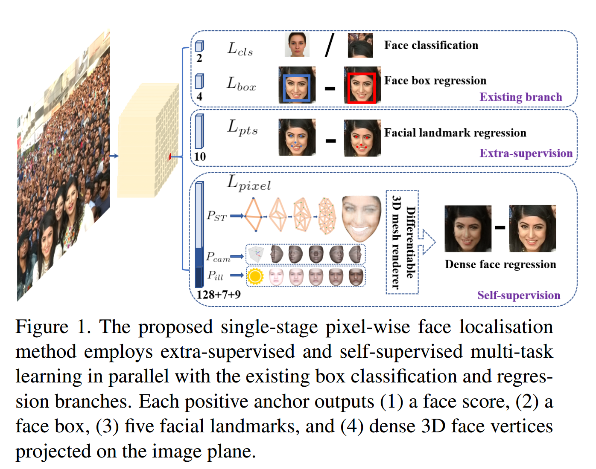
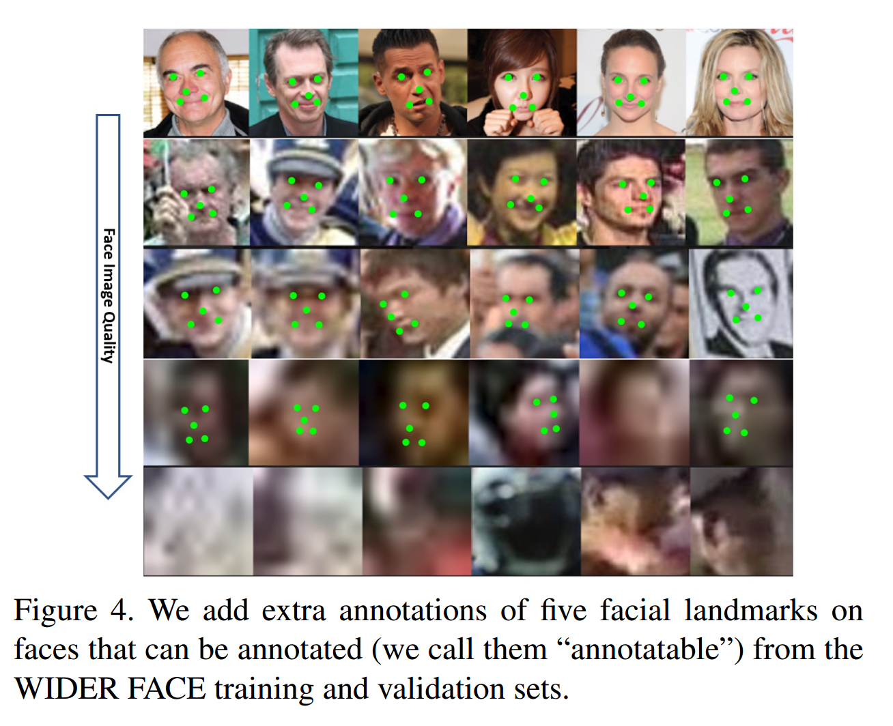
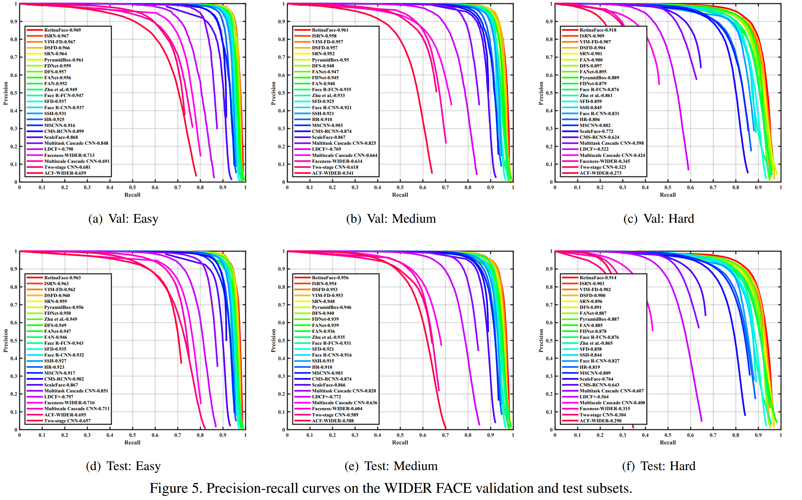
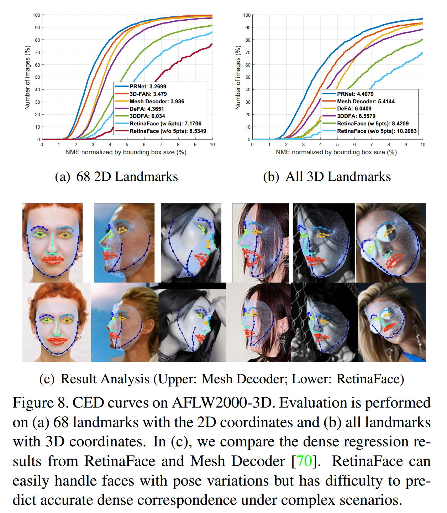

## RetinaFace: Single-stage Dense Face Localisation in the Wild

### Abstract

​		尽管在不受控制的人脸检测方面已取得了长足的进步，但是在自然环境中进行准确有效的人脸定位仍然是一个开放的挑战。本文提出一种鲁棒性的单阶段人脸检测器（称为 RetinaFace），其可以利用联合 extra-supervised 和自监督多任务学习的优势，在各种规模的人脸上执行像素级人脸定位。具体而言，我们作出了如下五个方面的攻心啊：（1）我们在 WIDER FACE 数据集上手工标注了 5 个人脸关键点，并在此额外的监督信号的辅助下，观察到困难人脸检测方面的显着改进。（2）我们还添加了一个自监督网格（mesh）解码器分支，用于与现有的监督分支并行地预测像素级 3D 形状人脸信息。（3）在 WIDER FACE 困难测试集上，RetinaFace 比最好的平均精确率（average precision：AP）高 $1.1 %$（获得的 AP 等于 $91.4 %$ ）。（4）在 IJB-C 测试集上，RetinaFace 使最先进的方法（ArcFace）能够改进其在人脸验证中的结果（对于 $FAR = 1e-6$，$TAR = 89.59％$ ）。（5）通过利用轻量的骨干网络，RetinaFace 可以在单个 GPU 上以 VGA 分辨率图像实时运行。额外的标注和代码见 https://github.com/deepinsight/insightface/tree/master/RetinaFace 。

### 1. Introduction

​		自动人脸定位是许多应用程序（例如面部属性（例如表情[64]和年龄[38]）和面部身份识别 [45、31、55、11] ）进行人流图像分析的预备步骤。人脸定位的狭义定义可以参考传统的人脸检测[53、62]，其目的是在没有任何尺度和位置先验的情况下估计人脸边界框。然而，本文参考更广义的人脸定位定义，这包含人脸检测、人脸对齐、逐像素人脸解析和 3D 密集相关回归（dense correspondence regression）。这种密集的人脸定位可为所有不同尺度提供准确的人脸位置信息。

​		受通用对象检测方法 [16、43、30、41、42、28、29] 涵盖了深度学习的所有最新进展）的启发，人脸检测最近获得显著进步 [23、36、68、8、49] 。与通用对象检测不同，人脸检测特征的纵横比变化更小（从 $1:1$ 到 $1:1.5$），但有更大的尺度变化（从几个像素到几千个像素）。最新的技术[36，68，49]专注于单阶段[30，29]设计，该设计在特征金字塔 [28] 上密集地采样了人脸位置和尺度，证明了有前途的性能并且与两阶段方法[43，63，8]相比产生更快的速度。遵循这一路线，我们改进单阶段人脸检测框架，并通过利用多任务损失提出最佳的密集人脸定位方法，这个损失来自强力的监督和自监督信号。我们的思想如图 1 所示。

​		通常来说，人脸检测的训练过程包含分类和边界框回归损失 [16] 。Chen 等 [6] 基于人脸对齐的形状提供更好的人脸分类特征的观察，提出在联合的级联框架中结合人脸检测和对齐。受 [6] 的启发，MTCNN [66] 和 STN [5] 同时检测人脸和五个人脸标志点。由于训练数据有限，JDA [6]、MTCNN [66] 和 STN [5] 没有验证小型人脸检测是否可以从五个人脸标志点的额外监督中获益。我们要回答的问题之一是，通过五个人脸标志点上构建的额外监督信号将 WIDER FACE 上当前最佳性能（ $90.3 %$ [67]）进一步推向前。

​		在 Mask R-CNN [20] 中，添加一个与已有的边界框识别和回归分支来预测对象掩膜明显提高了检测性能。这便确认了密集的逐像素标注也对提高检测有益。不幸的是，对于 WIDER FACE 中的挑战行人脸，执行密集人脸标注（更多标志点或语义分割的形式）是不可能的。由于监督信号不容易获得，所以问题是，我们是否可以应用无监督方法来进一步提高人脸检测。

​		在 FAN [56] 中，提出锚级注意力图来改进遮挡人脸检测。然而，所提出的注意力图非常粗糙，并且不包含语义信息。最近，自监督 3D 可变形（morphable）模型[14、51、52、70]在自然环境中实现了有希望的3D人脸建模。尤其是，Mesh Decoder [70] 通过利用关于关节形状和纹理的图卷积 [10，40] 实现了实时速度。然而，将 mesh decoder 用于单阶段检测器的主要是：（1）相机参数难以准确估计，（2）从单个特征向量（特征金字塔上的1×1 Conv）而不是 RoI 池化特征预测联合隐形状和纹理表示，这表明存在特征偏移的风险。本文中，我们通过自监督学习来使用 mesh decoder [70] 分支，与现有的监督分支并行地预测逐像素 3D 人脸形状。

​		我们的关键贡献总结如下：

- 基于单阶段设计，我们提出新颖的逐像素人脸定位方法（称为 RetinaFace），其采用多任务学习策略来同时预测人脸得分、人脸边界框、五个人脸标志点和 3D 位置及每个人脸像素的 correspondence。
- 在 WIDER FACE 的困难子集中，RetinaFace 的 AP 比最佳的两阶段方法（ISRN [67]）的 AP 好 $1.1 %$ （ 其 AP 等于 $91.4%$ ）。
- 在 IJB-C 数据集上，RetinaFace 有助于提高 ArcFace [11] 的验证准确率（当 $\mbox{FAR} = 1e-6$ 时，TAR 等于 89.59% ）。这表明更好的定位可以显著提高人脸识别。
- 通过利用轻量权重的骨干网络，RetinaFace 可以在单个 GPU 上以 VGA 分辨率的图上实时运行。
- 已经发布了额外的注释和代码，以方便将来的研究。

### 2. Related Work

**Image pyramid v.s. feature pyramid：**将分类器应用于密集图像网格的滑动窗口范例可以追溯到过去的几十年。Viola-Jones [53] 的里程碑式工作探索了级联链以实时高效的方式拒绝来自图像金字塔的负类人脸区域，从而导致了这种尺度不变的人脸检测框架的广泛采用 [66、5] 。尽管图像金字塔中滑动窗口是领导性的检测范式[19、32]，但随着特征金字塔 [28] 的出现，多尺度特征图 [68、49] 上的滑动锚 [43] 快速主导人脸检测。

**Two-stage v.s. single-stage：**当前人脸检测方法继承了通用对象检测方法的成就，并且可以分为两个类：两阶段方法（例如 Faster R-CNN [43、63、72]）和一阶段方法（例如 SSD [30、68] 和 RetinaNet [29、49]）。两阶段方法采用了具有较高定位精度的“提议和精炼”机制。通过对比，单阶段方法秘籍采样人脸位置和尺度，这在训练期间产生极端不平衡的正负样本。为了处理这种不平衡，广泛采用采样 [47] 和重新加权 [29] 方法。对比两阶段方法，单阶段方法更加有效率和更高的召回率，但是存在更高假阳性率（false positive rate）和损害定位精度的风险。

**Context Modeling：**为了增强模型捕获小型人脸 [23] 的上下文理解能力，SSH [36] 和 PyramidBox [49] 在特征图上应用上下文模块来增强欧式空间网格的感受野。为了增强 CNN 的非严格变换建模的能力，可变形卷积（deformable convolution network：DCN）采用新颖的可变形层来建模几何变换。WIDER Face Challenge 2018 [33] 的冠军解决方案指出刚性（扩展）（rigid（expansion））和非刚性（变形）（non-rigid（deformation））上下文建模是互补且正交的，以提高人脸检测的性能。

**Multi-task Learning：**联合的人脸检测和对齐被广泛使用[6、66、5]，因为对齐的人脸形状为人脸分类提供了更好的特征。在 Mask R-CNN [20] 中，检测性能通过添加与已有分支并行的预测对象掩膜的分支得到提高。Denspose [1] 在用 Mask-RCNN 的架构来获得每个选择区域的密集关节标签和坐标。然而，[20、1] 中的密集回归分支通过监督学习获得。此外，密集分支是一个小型的 FCN，其应用到每个 RoI 以预测像素到像素的密集映射。

### 3. RetinaFace

#### 3.1. Multi-task Loss

​		对于任意训练锚 $i$ ，我们最小化如下的多任务损失：

$$\begin{align}L &= L_{cls}(p_i, p_i^\ast) + \lambda_1 p_i^\ast L_{box}(t_i, t_i^\ast) \\ &+ \lambda_2 p_i^\ast L_{pts}(l_i, l_i^\ast) + \lambda_i p_i^\ast L_{pixel}.\end{align} \tag{1}$$

式（1）中的人脸分类损失为 $L_{cls}(p_i,p_i^\ast)$ ，其中 $p_i$ 为锚 $i$ 是人脸的预测概率，而 对于正类锚，$p_i^\ast$ 为 1 ；对于负类锚，$p_i^\ast$ 为 0 。分类损失 $L_{cls}$ 是二分类（人脸/非人脸）的 softmax 损失。（2）人脸边界框回归损失 $L_{box}(t_i, t_i^\ast)$ ，其中 $t_i = \{t_x, t_y, t_w, t_h\}$ 和 $t_i^\ast = \{t_x^\ast, t_y^\ast, t_w^\ast, t_h^\ast\}$ 表示与正类锚相关的预测边界框和 ground-truth 的坐标。我们遵循 [16] 来规范化边界框回归目标（即中心位置、宽和高），并且使用 $L_{box}(t_i, t_i^\ast) = R(t_i - t_i^\ast)$ ，其中 $R$  是 [16] 中定义的鲁棒损失函数（$\mbox{smooth}-L_1$）。（3）人脸标志点回归损失 $L_{pts}(l_i,l_i^\ast)$ ，其中 $\{l_{x_1}, l_{y_1}, \cdots, l_{x_5}, l_{y_5}\}$ 和 $\{l_{x_1}^\ast, l_{y_1}^\ast, \cdots, l_{x_5}^\ast, l_{y_5}^\ast\}$ 表示与正类锚相关的五个预测人脸标志点和 ground-truth 标志点。与边界框中心回归相似，五个人脸标志点回归还采用基于锚中心的目标规范化。（4）密集回归损失 $L_{pixel}$ （参考式（3））。损失平衡参数 $\lambda_1 - \lambda_3$ 分别设置为 0.25、0.1 和 0.001 ，这意味着我们从监督信号中提高了更好的边界框和标志点位置的重要性。

#### 3.2. Dense Regression Branch

**Mesh Decoder.**	我们直接使用 [70、40] 中的 mesh decoder （mesh 卷积和 mesh 上采样），这是一种基于快速局部频谱滤波（fast localised spectral filtering）的图卷积方法 [10]。为了获得进一步的加速，我们还使用与 [70] 相似的联合形状和纹理的解码器，与 [40] 中仅解码形状的方法相反。

​		下面，我们简要介绍图卷积的概念，以及它们为什么可以用于快速解码的轮廓。如图3（a）所示，二维卷积运算是欧几里德网格感受野中的“核加权相邻和”（“kernel-weighted neighbour sum”）。相似地，图卷积也采用如图3（b）所示的相同概念。然而，相邻距离是通过计算连接两个顶点的最小边数来计算的。我们遵循 [70] 来定义彩色的人脸 mesh $\mathcal{G=(V, \varepsilon)}$ ，其中 $\mathcal{V} \in \mathbb{R}^{n \times 6}$ 是包含联合形状和纹理信息的人脸顶点的集合，而 $\varepsilon \in \{0, 1\}^{n \times n}$ 是一个编码顶点之间连接状态的 **稀疏** 邻接矩阵。Graph Laplacian 定义为 $L = D - \varepsilon \in \mathbb{R}^{5 \times 5}$ ，其中 $D \in \mathbb{R}^{n \times n}$ 是对角矩阵，$D_{ii} = \sum_j \varepsilon_{ij}$ 。 

 		遵循 [10、40、70] ，具有核 $g_\theta$ 的图卷积公式化为以 $K$ 阶截断的递归 Chebyshev 多项式，

$$y=g_\theta(L)x = \sum_{k=0}^{K-1}\theta_k T_k(\tilde{L})x, \tag{2}$$

其中 $\theta \in \mathbb{R}^K$ 为 Chebyshev 系数向量，而 $T(\tilde{L}) \in \mathbb{R}^{n \times n}$ 为在缩放的 Laplacian $\tilde{L}$ 上评估的 $k$ 阶 Chebyshev 多项式。表示 $\bar{x}_k = T_k(\tilde{L})x \in \mathbb{R}^n$ ，我们可以递归的计算 $\bar{x}_k = 2 L \bar{x}_{k-1} - \bar{x}_{k-2}$ ，以及 $\bar{x}_0 = x$ 和 $\bar{x}_1 = \tilde{L}x$。整个滤波操作非常有效，包括 $K$ 个稀疏矩阵-向量乘法和一个密集矩阵-向量乘法 $y = g_{\theta}(L)x = [\bar{x}_0; \cdots; \bar{x}_{K-1}]θ$ 。 

**Differentiable Renderer.**	在我们预测形状和纹理参数 $P_{ST} \in \mathbb{R}^{128}$，我们使用高效的可微分3D网格渲染器（3D mesh renderer）[14] 将彩色网格 DPST 投影到具有相机参数 $P_{cam} = [x_c; y_c; z_c; x_c'; y_c'; z_c'; f_c]$ 的2D图像平面上（即相机位置、相机姿态和焦距）和光照参数 $P_{ill} = [x_l; y_l; z_l; r_l; g_l; b_l; r_a; g_a; b+a]$（即点光源的位置、颜色值和环境照明的颜色）。

**Dense Regression Loss.**	一旦我们得到渲染的 2D 人脸 $\mathcal{R}(\mathcal{D}_{P_{ST}}, P_{cam}, P_{ill})$ ，我可以使用如下函数比较渲染和原始 2D 人脸的逐像素差距：

$$L_{pixel} = \frac{1}{W \ast H} \sum_i^W \sum_j^H ||\mathcal{R}(\mathcal{D}_{P_{ST}}, P_{cam}, P_{ill})_{i,j} - I_{i,j}^\ast||_1, \tag{3}$$

其中 $W$ 和 $H$ 分别是锚裁剪 $I_{i,j}^\ast$ 的宽和高。

### 4. Experiments

#### 4.1. Dataset

​		WIDER FACE 数据集 [60] 由 32203 张图像和 393703 个人脸边界框组成，它们在尺度、姿势、表情、遮挡和照明方面具有高度的变化。通过从 61 个场景类别中随机采样将 WIDER FACE 数据集划分为训练（40%）、验证（10%）和测试（50%）子集。基于 EdgeBox [76] 的检测率，通过逐步合并困难样本来定义三个难度级别（即“简单（Easy）”、“中等（Medium）”和“困难（Hard）”）。

**Extra Annotations.**	如图 4 和表 1 所示，我们定义了五个级别的人脸图像质量（根据对脸部标志点进行标注的难度）并对五个人脸标志（即眼中心、鼻尖和嘴角）进行标注， 可以在 WIDER FACE 训练和验证子集中标注。总之，我们在训练集上标注 $84.6k$ 个人脸，并在验证集上标注 $18.5k$ 个人脸。

#### 4.2. Implementation details

**Feature Pyramid.**	RetinaFace 采用从 $P_2$ 到 $P_6$ 的特征金字塔级，其中 $P_2$ 到 $P_5$ 是使用 [28、29] 中的自上而下和侧连接从相应 ResNet 残差阶段（ $C_2$ 到 $C_5$ ）的输出中计算的。$P_6$ 通过步长为 2 的 $3 \times 3$ 卷积在 $C_5$ 上计算。$C_1$ 到 $C_5$ 为在  ImageNet-11k 数据集上预训练的 ResNet-152 [21] 分类网络，而 $P_6$ 使用 “Xavier” 方法 [17] 随机初始化。

**Context Module.**	受 SSH [36] 和 PyramidBox [49] 的启发，我们还在五个特征金字塔级中应用独立的上下文模块来增加感受野，并增强刚性上下文建模能力。借鉴 WIDER Face Challenge 2018 冠军 [33] 的经验，我们还用可变形卷积网络（Deformable Convolution Network：DCN）[9，74] 替换了侧连接和上下文模块中的所有 $3 \times3$ 卷积层，这进一步加强了非刚性上下文建模能力。

**Loss Head.**	对于负锚，仅使用回归损失。对于正类锚，计算所提出的多任务损失。我们在不同的特征图 $H_n \times W_n \times 256$ 上使用共享的损失头部（$1 \times 1$ 卷积）。对于 mesh decoder，我们使用预训练的模型 [70] ，这是一个小的计算开销，可以进行高效推理。

**Anchor Settings.**	如表 2 所示，我们在 $P_2$ 到 $P_6$ 的特征金字塔级上使用尺度特定的锚，这与 FAN [56] 相同。这里，$P_2$ 设计用于通过平铺小锚来捕获微小的人脸，但要花费更多的计算时间，并且要冒更多的误报风险。我们将缩放步长设置为 $2^{1/3}$ ，将长宽比设置为 $1:1$。输入图像大小为 $640 \times 640$ 时，锚点可以覆盖特征金字塔级别上从 $16 \times 16$ 到 $406 \times 406$ 的尺度。总之，共有 102300 个锚，其中 75% 的锚来自 $P_2$ 。

​		训练期间，当 IoU 大于 0.5 时，锚匹配上 ground-truth 边界框，并且当 IoU 小于 0.3 时，匹配上背景。训练期间忽略未匹配的锚。由于在匹配步骤之后，大多数锚（$> 99$ %）的锚时负样本，我们采用标准的 OHEM [47、68] 来缓解正负训练样本之间明显的不平衡。更具体地，我们通过损失值排序负锚，并选择靠前的锚，使得负类和正类样本之间的比例至少为 $3:1$ 。

**Data Augmentation.**	由于 WIDER FACE 训练集中，大于存在 20% 的小型人脸，我们遵循 [68、49]，并从原始图像上随机裁剪正方形补丁，并将这些补丁调整到 $640 \times 640$ 以生成更大的训练人脸。更具体地说，以原始图像的短边的 $[0：3,1]$ 之间的随机大小从原始图像裁剪出正方形补丁。对于裁剪边界上的人脸，如果它的中心在裁剪补丁中，那么我们保留人脸的重叠部分。除了随机裁剪外，我们还通过概率为 0.5 的随机水平翻转来增强训练数据，以及photo-metric 色彩扭曲 [68] 。

**Training Details.**	我们在 4 个 NVIDIA Tesla P40（24GB）GPU上使用 SGD 优化器（momentum 为 0.9 ，权重衰减为 0.0005，批大小为 $8 \times 4$）训练 RetinaFace。学习率从 $10^{-3}$ 开始，在 5 个周期后增加到 $10^{-2}$ ，然后在 55 和 68 个周期中除以 10 。训练过程在 80 周期后终止。

**Testing Details.**	对于 WIDER FACE 上的测试，我们遵循 [36、68] 的标准实践，并采用翻转以及多尺度（图像的短边为 $[500,800,1100,1400,1700]$）策略。使用 0.4 的 IoU 阈值对预测的人脸边界框的并集应用边界框投票 [15] 。

#### 4.3. Ablation Study

​		为了更好地理解所提出的 RetinaFace，我们进行了广泛的消融实验，以检查带标注的五个人脸标志点，以及所提出的密集回归分支是如何定量地影响人脸检测的性能。除了在 Easy、Medium 和 Hard 子集上的 $\mbox{IoU} = 0.5$ 时的标准度量—平均精确率 AP，我们还充分利用 WIDER Face Chanllenge 2018 [33] 开发服务，其采用更严格的 mAP，即 $\mbox{IoU}=0.5:0.05:0.95$ 上的平均 AP。

​		如表 3 所示，我们在 WIDER FACE 验证集上评估几种不同设置的性能，并关注在Hard 子集上的 AP 和 mAP 。通过应用最新技术（即 FPN、上下文模块和可变形卷积）的实践，我们建立了一个强大的基准（91.286％），略优于ISRN [67]（90.9％）。添加五个人脸标志点回归分支显著提高了 Hard 子集上的人脸边界框 的 AP（0.408 %）和 mAP（0.775 %），这认为标志点定位对于提高人脸检测准确至关重要。通过比较，添加密集回归分支提高了 Easy 和 Medium 子集上人脸边界框的 AP，但是略微退化了 Hard 子集的结果，这表明挑战性场景下密集回归的难度。然而，与仅添加标志点回归相比，联合学习标志点和密集回归确保进一步的性能提升。这表明标志点回归有助于密集回归，从而进一步提高了人脸检测性能。

#### 4.4. Face box Accuracy

​		遵循WIDER FACE数据集的标准评估协议，我们仅在训练集上训练模型，并在验证集和测试集上进行测试。为了在测试集上评估结果，我们将检测结果提交给组织者进行评估。如图5所示，我们比较 RetinaFace 和其他 24 个最佳人脸检测算法（即 Multi-scale Cascade CNN [60]、Two-stage CNN [60]、ACF-WIDER [58]、Faceness-WIDER [59]、Multitask Cascade CNN [66]、CMS-RCNN [72]、LDCF+ [37]、HR [23]、Face R-CNN [54]、ScaleFace [61]、SSH [36]、SFD [68]、Face R-FCN [57]、MSCNN [4]、FAN [56]、Zhu 等 [71]、PyramidBox [49]、FDNet [65]、SRN [8]、FANet [65]、DSFD [27]、DFS [50]、VIM-FD [69]、ISRN [67]）。在 AP 方面，我们的方法比这些最佳方法好。更具体地说，RetinaFace 验证集和测试集的所有子集上都产生最佳的 AP ，即验证集上为 96.9 % （Easy）、96.1 % （Medium）和 91.4 %（Hard），测试集上为 96.3 %（Easy）、95.6 %（Medium）和 91.4 %（Hard）。与最近最佳的方法 [67] 相比，RetinaFace 在包含大量小脸的 Hard 子集上创造了新的令人印象深刻的记录（91.4％ v.s. 90.3％）。 

​		在图 6 中，我们展示了人脸密集的自拍照的定量结果。RetinaFace 成功找出了报告的 1151 个人脸中的大约 900 个人脸（阈值为 0.5）。除了准确的边界框外，RetinaFace 预测的五个人脸标志点在姿态、遮挡和分辨率下也具有鲁棒性。尽管在严重遮挡的情况下，密集人脸定位存在一些失败案例，但是在一些清楚和大型人脸上密集回归结果很好，甚至表现出表情变化的情况下。

#### 4.5. Five Facial Landmark Accuracy

​		为了评估五个人脸标志点的定位准确率，我们在 AFLW 数据集 [26] （24386 张人脸）和 WIDER FACE 验证集（18.5k 张人脸）上比较 RetinaFace 和 MTCNN 。这里，我们采用人脸大小（$\sqrt{W \times H}$ ）作为规范化距离。如图 7（a）所示，我们给出 AFLW 数据集 [73] 上每个人脸平均误差。与 MTCNN 比较时，RetinaFace 将归一化误差（Normalised Mean Errors：NME）从 2.72 % 减小至 2.21 %。在图 7（b）中，我们展示了 WIDER FACE 验证集上的累积误差分布（Cumulative Error Distribution：CED）曲线。与 MTCNN 相比，RetinaFace 将失败率从 26.31 % 减小至 9.37 % （NME 阈值为 10 %）。

#### 4.6. Dense Facial Landmark Accuracy

​		除了边界框和五个人脸标志点外，RetinaFace 还输出密集人脸响应，但是密集回归分支仅通过自监督学习训练。遵循 [12、70] ，我们考虑（1）68 个具有 2D 投影坐标的标志点和（2）所有3D坐标的标志点，评估 AFLW2000-3D 数据集上密集人脸标志点的定位准确性 [75] 。这里，平均误差仍通过边界框大小 [75] 归一化。在图 8（a）和 8（b）中，我们给出最佳方法[12、70、75、25、3] 和 RetinaFace 的 CED 曲线。尽管监督方法和无监督方法之间存在性能差距，但是 RetinaFace 的密集回归结果与这些方法相当。更具体地说，我们观察到（1）五个人脸标志点回归可以缓解密集回归分支的训练难度，并显著提高密集回归结果；（2）使用一阶段特征（如 RetinaFace）来预测密集响应参数远比使用 RoI 特征（如 Mesh Decoder [70]）难。如图 8（c）所示，RetinaFace 可以轻易处理具有姿态变化的人脸，但是在复杂场景下有困难。这表明未对齐和过于紧凑的特征表示（RetinaFace中为 $1 \times 1 \times 256$ ）阻碍了单阶段框架实现高精度密集回归输出。然而，如在消融研究部分所证实的那样，在密集的回归分支中投影的人脸区域仍然具有注意力 [56] 的作用，这可以帮助改善人脸检测。

#### 4.7. Face Recognition Accuracy

​		人脸检测在鲁棒性人脸识别上起着重要作用，但是其效率鲜有显示测量。本文中，我们证明我们的人脸检测方法是如何提上最佳的公开可用人脸识别算法（即 ArcFace [11]）的性能。ArcFace [11]  研究深度神经网络的训练过程（即训练集的选择、网络和损失函数）是如何影响大尺度人脸识别的性能。然而，ArcFace 论文没有研究仅使用 MTCNN [66] 对检测和对齐对人脸检测的影响。本文中，我们将 MTCNN 替换为 RetinaFace 来检测和对齐所有训练数据（即 MS1M [18]）和测试数据（即 LFW [24]、CFP-FP [46]、AgeDB-30 [35] 和 IJBC [34]），并保持嵌入网络（即 ResNet100 [21]）和损失函数（即 additive angular margin）与 ArcFace 相同。

​		表 4 中，我们通过比较广泛使用的 MTCNN [66] 和所提出的 RetinaFace 来证明深度人脸识别中人脸检测和对齐的影响。CFP-FP 上的结果证明，RetinaFace 将 ArcFace 的验证准确率从 98.37 % 提高到 99.49 % 。该结果表明，正面-侧面（frontal-profile）人脸验证的性能现在已接近正面-正面人脸验证的性能（例如，LFW上为 99.86％）。

​		在图 9 中，我们展示了 IJB-C 数据集上的 ROC 曲线以及 在每个图例的末尾为$\mbox{FAR} = 1e-6 $ 的TAR。我们采用两个策略（即翻转测试和人脸检测得分来权衡模板中的样本）来渐进式提高人脸验证准确率。在公平比较的情况下，通过将 MTCNN 替换为 RetinaFace，$\mbox{TAR}$ （$\mbox{FAR} = 1e-6$ 时）从 88.29 % 提高到 89.59% 。这表明（1）人脸检测和对齐明显影响人脸识别性能，以及（2）与人脸识别应用程序相比，RetinaFace 是一个比 MTCNN 强得多的基线。

#### 4.8. Inference Efficiency

​		在测试期间，RetinaFace在单个阶段中执行人脸定位，这既灵活又高效。除了上面探索的重量级模型（在 WIDER FACE Hard 上的 ResNet-152，大小为 262MB，AP 为 91.8％）之外，我们还采用了轻量模型（MobileNet-0.25 [22]，大小 1MB，在WIDER FACE Hard 上 AP 为 78.2％）以加快推理速度。

​		对于轻量模型，我们在输入图像上使用 $\mbox{stride} = 4$ 的  $7 \times 7$ 卷积可以快速降低数据大小，如 [36] ，在 $P_3$、$P_4$ 和 $P_5$ 上平铺密集锚，并移除可变形层。此外，前两个卷积使用 ImageNet 预训练的模型初始化，并固定它们以获得更高的准确率。

​		表 5 给出了与不同输入对应的两个模型的推理时间。我们忽略了密集回归分支上的时间成本，因此时间统计信息与输入图像的人脸密度无关。我们利用 TVM [7] 来加速模型推理，并分别在 NVIDIA Tesla P40 GPU、Intel i7-6700K CPU 和ARM-RK3399 上执行时间测试。RetinaFace-ResNet-152 设计用于高度准确的人脸定位，VGA 图像（$640 \times 480$）上以 13 FPS 运行。通过比较，RetinaFace-MobileNet-0.25 设计用于高度有效的人脸定位，其展示相当可观的实时速度，对于 4K 图像（$4096 \times 2160$），在 GPU 上的测试速度为 40 FPS；对于 HD 图像（$1920 \times 1080$）图像，在多线程 CPU 上速度为 20 FPS；对于 VGA 图像（$640 \times 480$），多线程 CPU 上速度为 60 FPS。更令人印象深刻的是，在 ARM 上以 16 FPS 的速度处理 VGA 图像（ $640 \times 480$ ），这允许在移动设备上实现快速系统。

