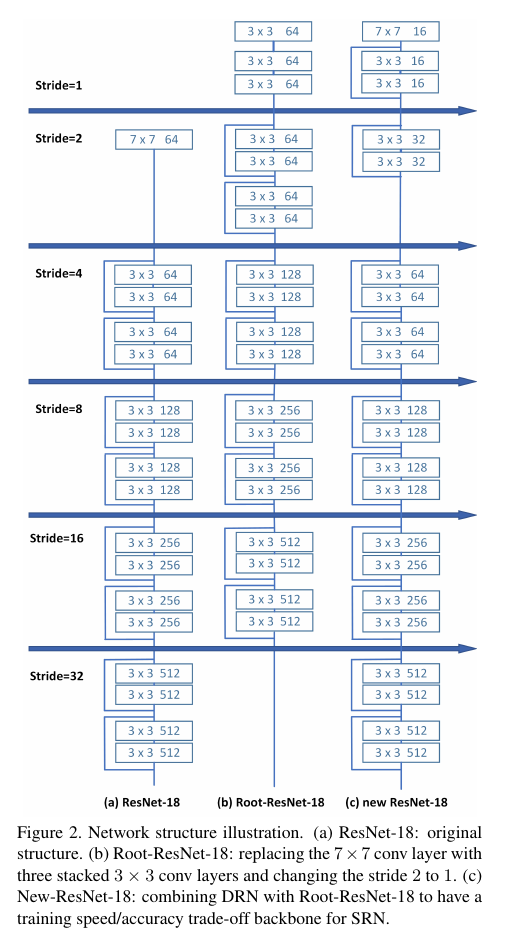

Improved Selective Refinement Network for Face Detection
=

# 1. Introduction
人脸检测是其他人脸相关任务（包括人脸对齐、人脸识别、人脸动画、人脸属性分析和人机交互等）的基本过程。人脸检测系统的准确性直接影响这些任务，因此人脸检测的成功至关重要。给定任意图像，人脸检测目标是确定图像中是否存在任意人脸，并且如果存在，则返会每个人脸在图像中的位置和范围。最近几年，由于深度卷积神经网络的发展和WIDER FACE基准测试数据集的收集，人脸检测取得巨大的进步。这一挑战性数据集具有尺度、姿势和遮挡的高度变化以及多种复杂场景中的大量小型人脸，其启发了大量鲁棒性的基于CNN的算法。

...

本文中，我们利用分类和检测任务中已存在的技术来进一步改进SRN的性能，包括数据增强策略、改进骨干网络、MS COCO 预训练、解耦分类模块、分割分支和SE 块。通过大量实验，我们分享了一些有用的技术，使SRN在WIDER FACE上重新获得最先进的性能。与此同时，我们罗列出一些在我们的模型中没有作用的技术，可能是因为（1）我们有一个强力的基线，该基线导致它们不能很好工作，（2）这些思想的组合并非微不足道，（3）它们不够强大，无法实现普遍性，以及（4）我们的实现方式是错误的。这不意味着它们不适合其他模型或数据集。

# 2. Review of Baseline
## 2.1 Selective Two-step Classification
对于一阶段检测器，大量具有极端正负样本比（例如，在SRN中，大约300k的锚，以及正负比大约为0.006%）导致大量false positive。因此，需要如RPN的另一个阶段来过滤一些负样本。Selective Two-step Classification，继承自 RefineDet，有效地拒绝了大量负锚，并且避免了类不平衡问题。

具体而言，大多数锚（即88.9%）平铺于前3个低级特征图，它们没有包含合适的上下文信息。因此，需要在这三个低级特征上使用STC。其他三个高级特征图仅处理 11.1% 的具有丰富语义信息的锚，其不适用于STC。总而言之，在三个低级特征上STC的应用带来了先进结果，而在三个高级特征上的使用带来无效的结果以及更多的计算成本。STC模块抑制了大量的负锚，导致正负样本之比增加大约38倍（即从大约 $1:15441$ 到 $1:404$）。共享分类卷积模块和相同的二值 Focal Loss 用于两步分类，因为二者的目标都是从背景中辨别人脸。

## 2.2. Selective Two-step Regression
如Cascade R-CNN的多步回归可以提高边界框定位的准确率，特别是在一些挑战性场景中，例如MS COCO风格的评估准则。然而，在没有仔细考虑的情况下将多步回归应用于人脸检测任务可能会损害检测结果。

对于SRN，来自三个低级特征图的众多小锚将导致损失偏向于回归问题并且阻碍基本分类问题。然而，用于小型人脸的三个较低金字塔级的特征表示是粗超的，从而产生执行两步回归的障碍。在对三个高级特征进行两步回归时，这些问题不会发生，其具有大锚尺度的大型人脸的详细特征有助于回归到更准确的位置。总之，选择性两步分类和回归是RefineDet在面部检测任务中的一种特定且有效的变体，特别是对于小脸和一些false positive。

## 2.3. Receptive Field Enhancement
当前网络通常具有方形感受域，其影响具有不同宽高比的对象的检测。为了处理这个问题，SRN设计了 Receptive Field Enhancement（RFE）以在预测类和位置之前多样化感受野，其有助于捕获某些极端姿势的人脸。

# 3. Description of Improvement
在这里，我们分享一些现有技术，使SRN重新获得WIDER FACE数据集的最佳性能，包括数据增强、特征提取器和训练策略。

## 3.1.Data Augmentation
我们使用SRN的原始数据增强策略，包括光度失真，通过零填充操作随机扩展，从图像中随机裁剪补丁并将补丁大小调整为 $1024 \times 1024$ 。另外，在概率为1/2的情况下，我们利用PyramidBox [33]中的数据锚点采样（data-anchor-sampling），它随机选择图像中的面部并裁剪基于子图像的锚点。这些数据增强方法对于阻止过拟合和构建鲁棒性模型至关重要。

## 3.2. Feature Extractor
WIDER FACE最大的挑战是准确地检测大量的小型人脸。我们相信SRN的ResNet-50-FPN骨干仍有客观的空间来提高准确率，特别是针对小型人脸。ScratchDet的Root-ResNet旨在提高小对象的检测性能，但是其训练速度比ResNet慢。为了平衡训练效率和检测准确率，我们利用Root-ResNet和DRN的优势来改进ResNet-50 。

具体而言，对ResNet的第一个 $7 \times 7$ 卷积层中的图像进行下采样操作（$stride = 2$）将导致重要信息的丢失，特别是对于小脸。在考虑Root-ResNet和DRN的动机之后，我们将第一个conv层的步幅从2改为1，将通道号从64改为16，并添加两个残差块（参见图2）。一个残差块是为了丰富表示信息，而另一个是为了下采样，它们的通道数量减小为16和32以平衡参数。这种配置可以保持小型人脸的关键信息而没有额外的开销。

## 3.3. Training Strategy
因为我们的 ResNet-50-FPN 已被修改，所以我们不能使用ImageNet预训练模型。一个解决方案是如DRN在ImageNet数据上训练修改的骨干，然后在WIDER FACE上微调。然而，He等人[9]和ScratchDet已证明ImageNet预训练不是必须的。因此，我们将训练epoch加倍到260 epoch，并从头训练具有修改骨干的模型。从头训练的一个关键因素是规范化。由于大输入尺寸（$1024 \times 1024$），一个24G的GPU仅能输入5张图像，导致批量归一化[14]在从头开始训练期间无法正常工作。为此，我们利用group = 16的Group Normalization [38]来从头开始训练这个修改过的ResNet-50骨干。

此外，最近的工作FA-RPN [23]表明，在MS COCO数据集[20]上预训练模型有助于提高WIDER FACE数据集上人脸检测器的性能。我们将此归因于人类类别中的一些样本以及MS COCO数据集中具有相似小尺度（即地面实况区域<32）的对象。 所以我们也应用这种预训练策略。

## 3.4. Implementation Detail
**Anchor Setting and Matching.** 两个锚尺度（即 $2S$ 和 $2\sqrt2S$ ，其中 $S$ 表示每个金字塔等级的总步幅大小）和一个纵横比（即1.25）覆盖输入图像（即1024×1024），锚尺度范围从8到362像素。我们将 $IOU > \theta_p$ 的锚分配为正类，将IOU在$[0, \theta_n)$ 的锚分配为负类，而其他锚视为忽略样本。根据经验，我们在第一个步设置 $\theta_n = 0.3$ 、 $\theta_p = 0.7$ ，而第二步设置 $\theta_n = 0.4$ 、 $\theta_p$ = 0.5 。

**Optimization.** 在训练过程中，我们仅将STC损失和STR损失相加。我们在MS COCO上预训练具有GroupNorm的新设计的骨干网络，并在WIDER FACE上使用动量0.9、权重衰减为0.0001以及批大小为32的SGD微调.在5个epoch的热启动后，在前230个epoch中，设置学习率为$10^{-2}$ ，在另外20和10个epoch中衰减为 $10^{-3}$ 和 $10^{-4}$ 。我们的方法使用PyTorch库实现。

**Inference.** 在推理阶段，STC首先过滤前三个特征图上的锚点，其中正置信度得分小于阈值 $\theta = 0.01$，然后STR调整最后三个特征图上的锚点。第二步是在这些精炼的锚点中保持前2000个高检测。最后，我们应用具有0.4的Jaccard重叠的NMS以为每幅图像生成750个高置信度结果。多尺度测试策略在推理阶段使用。

# 4. Result on WIDER FACE
  
  

# 5. Things We Tried That Did Not Work Well
我们罗列出一些在我们的模型中没有作用的技术，可能是因为（1）我们有一个强力的基线，该基线导致它们不能很好工作，（2）这些思想的组合并非微不足道，（3）它们不够强大，无法实现普遍性，以及（4）我们的实现方式是错误的。这不意味着它们不适合其他模型或数据集。

**Decoupled Classification Refinement(DCR).** 它是分类细化的额外阶段分类器。在训练过程中，DCR从基础Faster R-CNN检测器中采集具有高强度分数的硬假阳性，然后训练更强的分类器。在推理时，它简单地将来自基础检测器的得分与来自DCR的另一得分相乘以重新检测检测结果。使用DCR的Faster R-CNN在MS COCO [20]和PASCAL VOC [7]数据集上得到了很大的改进。因此，我们尝试使用DCR在开始阶段抑制false positive，并根据我们的SRN基线进行一些探究实验。然而，然而，在RPN提案和ROI的帮助下，两级探测器的DCR采样策略比单级方法更容易设计。由于SRN人脸检测器产生太多的边界框，所以我们尝试了大量的采样启发式算法。此外，由于WIDER FACE上的大尺度变化和众多小脸，我们尝试了一些不同的裁剪尺寸的训练样例。考虑到训练集的规模（从WIDER FACE训练集中裁剪的正和负类人脸样本）和网络过度拟合，我们还尝试了具有不同数量级的DCR骨干。通过设定裁剪大小等于20，DRN-22骨干和采样策略（正例：$0.5 <IOU <0.8$ 且负例：$IOU <0.3$），我们的最佳结果也略低于我们的基线检测器。需要在WIDER FACE上进行关于DCR的进一步实验以进行面部检测任务。

**Segmentation Branch[53].** 在DES中的SSD上添加了分割分支，其应用于低级特征图并由弱边界级分割ground-truth监督。通过分割分支的输出 $H \times W \times 1$ 图重新加权低级特征图。这种增强可以视为逐元素注意力机制。如图5所示，我们将分割分支应用于SRN的第一个低级特征图，但最终结果在三个度量上略有下降。

**Squeeze-and-Excitation (SE) Block.** 它通过使用全局信息有选择地强调信息特征并抑制无用特征，自适应地重新加权通道特征。它可以被视为具有 squeeze-and-excitation 的 $1 \times 1 \times C$ 特征图的通道方式注意机制，并且将重新加权原始特征以生成更具代表性的特征。如图6所示，我们将SE块用于SRN最后的检测特征图，但是最终结果在Easy、Medium和Hard度量上分别减小0.2%、 0.2% 和 0.4% 。

