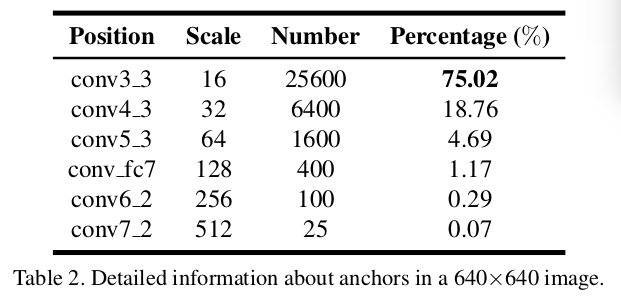
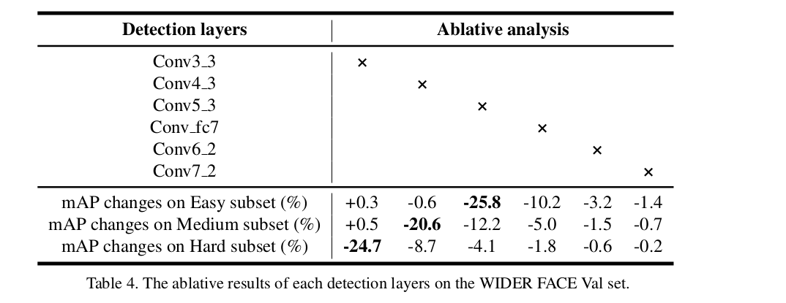

$S^3FD$: Single Shot Scale-invariant Face Detector
=

# 1 Introduction
《Speed/accuracy trade-offs for modern convolutional object detectors》指出基于anchor的检测器的性能随对象的变小，会急剧下降。为了呈现尺度不变的基于锚的人脸检测器，综合分析了上述问题背后的原因如下：

**Biased framework.** 基于anchor的检测框架倾向于错过小和中等的人脸。首先，与最低anchor关联的层的歩幅非常大（例如，SSD为8个像素，Faster R-CNN为16个像素），因此，小和中型人脸在这些层有高度的压缩和很少的特征用于检测，如图1（a）。其次，小脸、anchor尺度和感受野相互不匹配：anchor尺度与感受野不匹配，并且两者都太大以至于不匹配小脸，如图1（b）。为了处理上述问题，本文提出尺度等价人脸检测框架。将anchor平铺到宽范围的层，其步长从4到128个像素，这使得不同人脸的尺度有足够的特征用于检测。除此之外，根据有效感受野和一种新的等比例间距原则，将anchor的尺度设计为从16到512个像素，这确保不同层的anchor匹配其相应的感受野和不同尺度的锚均匀分步在图像上。

**Anchor matching strategy.** 在基于anchor检测框架中，anchor的尺度是离散的（即本文为16,32,64,128,256,512），而人脸的尺度是连续的。因此，那些尺度远离锚尺度的人脸无法匹配足够的锚，例如图1（c）中小和outer人脸，导致较低的召回率。为了改善这些被忽略人脸的召回率，提出两阶段的尺度补偿anchor匹配策略。第一阶段遵循当前的anchor匹配方法，但要调整到一个合理的阈值。第二阶段通过尺度补偿，确保每个尺度的人脸都匹配足够的anchor。

**Background from small anchor.** 为了很好地检测小面孔，必须在图像上密集地铺设大量小锚。如图1（d）所示，这些小锚导致背景上的负锚数量急剧增加，带来许多假阳性（false positive）人脸。例如，在本文的scale-equitable中，超过75%的负anchor来自最底层conv3_3层，该层用于检测小脸。本文为最低检测层提出max-out背景标签，以减少小脸的false positive 率。

本文的贡献：
- 提出一个具有尺度公平（scale-equitable）的人脸检测框架，该框架具有广泛的锚相关层和一系列合理的锚尺度，以便很好地处理不同尺度的面部。
- 提出尺度补偿锚匹配策略以改善小脸的召回率。
- 引入max-out背景标签以减少小脸的false positive rate。
- 在AFW、PASCAL face、FDDB和WINDER FACE上获得具有实时速度的最佳结果。

# 3 Single shot scale-invariant face detector
## 3.1 Scale-equitable framework
关联anchor的层的步长从4个像素到128个像素，anchor的尺度从16个像素到512个像素。前者保证每个锚的尺度与相应的有效感受野相匹配，后者使不同尺度的锚在图像上具有相同的密度。

**Constructing architecture.** 本文的架构基于VGG16（截断其所有分类层），并具有如下辅助结构：
- Base Convolutional Layers: 保持VGG16从conv1_1 到 pool5 的层，并移除所有其他层。
- Extra Convolutional Layers: 通过子采样将VGG16的fc6和fc7转换为卷积层。
- Detection Convolutional Layers: 选择conv3_3, conv4_3, conv5_3, conv_fc7, conv6_2 和 conv7_2作为检测层，这将不同尺度的anchor关联到预测检测。
- Normalization Layers: 相比其他检测层，conv3_3、 conv4_3和conv5_3有不同的尺度。因此，使用L2 normalization将它们的范数调整到10,8和5，然后在反向传播期间学习尺度。
- Predicted Convolutional Layers: 每个检测层后跟一个 $p \times 3 \times 3 \times q$ 卷积层，其中 $p$ 和$q$ 是输入和输出的通道数。对于每个anchor，预测与其坐标关联的4个偏移和用于分类的 $N_s$ 个得分，其中，对于conv3_3， $N_s = N_m + 1$ （$N_m$ 是max-out背景标签），其它层则为 $N_s = 2$ 。
- Multi-task Loss Layer: 使用softmax 损失来分类，smooth L1损失来回归。

**Designing scales for anchors.** 六个检测层都关联到一个特定尺度的anchor（即表1的第三列）以检测相应尺度的人脸。anchor是 $1:1$ 的纵横比（即正方形anchor），因为人脸边界框近似正方形。表1的第二列和第四列是固定，当设计anchor的尺度时有两个基本点：
- Effective receptive field: 如《Understanding the effective receptive field in deep convolutional neural networks》指出，CNN中的单元有两种类型的感受野。一种是理论感受野（theoretical receptive field），其表明理论上可以影响该单元值的输入区域。然而，并非理论感受野中的每个像素都相对最终弄个输出作出相等的贡献。通常，中间像素的影响远大于外部（outer）像素，如图3（a）。换句话说，仅有小部分区域有效地影响输出值，这是另一种感受野的类型，称为有效感受野（effective receptive field）。根据这种理论，为了匹配有效感受野（如图3（b）的特例），anchor应该明显地小于理论感受野。
- Equal-proportion interval principle: 检测层的步长决定输入图像上anchor的间隔。例如，conv3_3的步长是4个像素，并且其anchor是 $16 \times 16$ ，表明在输入图像上每4个像素有一个 $16 \times 16$ 的anchor。如表1的第2列和第3列，anchor的尺度是其间隔的四倍。称它为等比例间隔原则（如图3（c）），它保证了不同尺度的锚在图像上具有相同的密度，因此各种尺度的人脸可以大致匹配相同数量的锚。

## 3.2 Scale compensation anchor matching strategy

在训练中，需要确定哪个anchor对应一个人脸边界框。当前的anchor匹配方法，首先将每个人脸匹配到最佳jaccard重叠，然后，匹配任何与人脸的jaccard重叠大于阈值（通常为0.5）的anchor。然而，**anchor的尺度是离散的，而人脸尺度是连续的，** 这些尺度远离锚尺度的任丽娜不能匹配足够的锚，导致较低的召回率。如图1（c）计算量不同人脸的平均匹配的anchor数。有两个观察结果：1）平均匹配anchor数大约为3，这不足以召回高得分的人脸；2）匹配的anchor数与anchor尺度高度相关。远离anchor尺度的人脸倾向于被忽略，导致地召回率。为了解决这个问题，提出两阶段的尺度补偿anchor匹配策略：
- Stage one: 遵循当前的anchor匹配方法，但将阈值从0.5降低到0.35，这为了增加平均匹配的anchor数。
- Stage two: 在阶段1后，某些人脸仍然不能匹配足够的anchor，例如图4（a）中灰色虚线标记的小脸和outer脸。按如下方法处理这种人脸： 首先，挑选出与人脸的jaccard重叠大于0.1的anchor，然后将它们排序以选择top-N个anchor作为这个人脸匹配的anchor。设置N为阶段1的平均匹配的anchor数。

## 3.3 Max-out background label
基于anchor的人脸检测方法可以视为二值分类问题，其确定一个anchor是人脸还是背景。本文中，这是一个极端不平衡的二值分类问题：根据作者的统计，超过99.8%的预设anchor属于负anchor（即背景），并且仅有少量anchor是正类（即人脸）。这种极端的不平衡主要由小脸检测引起，这引起负anchor的数量急剧增加。例如，如表2， $640 \times 640$ 的图像中总共有34125的anchor，同时大于75%的anchor来自conv3_3检测层，该层与最小的anchor（$16\times16$）关联。这些最小的锚点对假阳性面部贡献最大。结果，通过平铺小锚来提高小脸的检测率将不可避免地导致小脸的假阳性。

为了处理这个问题，在最底层应用一种更加复杂的分类策略以处理来自小anchor的复杂背景。为conv3_3检测层应用max-out背景标签。对于最小的anchor，预测 $N_m$ 个背景标签得分，然后选择最高的作为最终得分，如图4（b）。Max-out操作将一些局部最优解集成到我们的 $S^3FD$模型中，以减少小脸的假阳性。

## 3.4 Training
**Training dataset and data augmentation.** 使用WINDER FACE训练集的12880张图像训练，使用如下的数据增强策略：
- 颜色扭曲（distort）：应用一些类似于《Some improvements on deep convolutional neural network based image classification》的光度失真。
- 随机裁剪：应用放大操作来生成更大的面部，因为WIDER FACE训练集中有太多小脸。具体地，每幅图像从五个正方形patch中随机选择，这些patch从原始图像随机剪裁：一个是最大的正方形patch，并且其他四个正方形patch的尺寸处于原始图像短边的 $[0.3, 1]$之间。如果人脸边界框的中心位于采样patch中，会保留人脸边界框的重叠部分。
- 水平翻转：随机剪裁之后，被选中的正方形patch调整到 $640\times640$，并以0.5的概率水平翻转。

**Loss function.** 使用多任务损失联合优化模型参数：
$$L(\{p_i\}, \{t_i\}) = \frac{\lambda}{N_{cls}} \sum_i L_{cls}(p_i, p_i^\ast) + \frac{1}{N_{reg}} \sum_i p_i^\ast L_{reg}(t_i, t_i^\ast) $$

**Hard negative mining.** anchor匹配步骤之后，大多数anchor负类，这在正类和负类训练样本中引入了明显的不平衡。为了更快的优化和稳定的训练，**根据损失值排序**，并选择最高得分的anchor，使得正负之间的比例为 $1:3$ 。使用hard negative mining，守则背景标签数 $N_m = 3$， $\lambda =4$ 以平衡分类和回归损失。

**Other implementation details.** 使用预训练的VGG16初始化权重，额外添加的层使用“Xavier”方法初始化。使用momentum=0.9， weight decay = 0.0005微调，batch size = 32 。训练120k，在前80k迭代中学习率为 $10^{-3}$ ，然后使用 $10^{-4}$ 和 $10^{-5}$ 训练20k迭代。

# 4 Experiments
**Ablative Setting.** 评估了三种不同设置：（i）$S^3FD(F)$ ：及使用scale-equitable框架（即构建的架构和设计的anchor），（ii）$S^3FD(F + S)$ ：引用Scale-equitable框架和尺度补偿anchor匹配策略，（iii）$S^3FD(F + S + M)$ ：完整的模型，有Scale-equitable框架、尺度补偿anchor匹配策略和max-out背景标签。结果如表3 。

