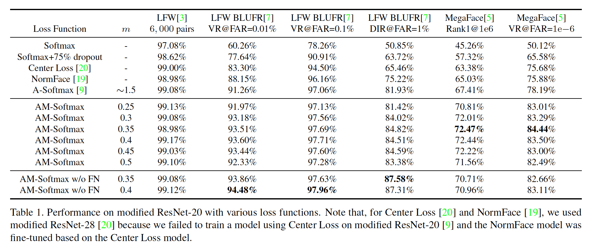

## Additive Margin Softmax for Face Verification

### 摘要

​		本文中，我们提出一种概念上简单、几何上可解释的模板函数（即additive margin Softmax（AM-Softmax））来进行人脸验证。一般而言，人脸验证可以视为一种度量学习问题，所以为了获得更好的性能，学习使类内变化小、类间变化大的大间隔（large-margin）人脸特征极其重要。最近，提出Large-margin Softmax和Angular Softmax来以乘法的方式处理角间隔。本文中，我们为softmax损失引入新颖的加法角间隔（additive angular margin），其直觉上比已有工作更吸引人和更具解释性。本文中，我们还强调并讨论特征归一化的重要性。最重要的是，我们在LFW和MegaFace上的实验表明，我们的加法间隔softmax损失始终比使用相同网络架构和训练数据集的当前最佳方法好。代码见https://github.com/happynear/AMSoftmax。

### 1. 引言

​		人脸验证在金融、军事、公共安全等大量领域中广泛用于身份认证。如今，大多数人脸验证模型都是基于深度卷积神经网络构建的，并由分类损失函数[18、20、19、9]、度量学习损失函数[16]或两者兼有的损失函数[17、13]监督。诸如对比损失[17]或三元损失[16]的度量sunhis函数通常需要仔细设计样本挖掘策略，并且最终的性能对于这些策略非常敏感，所以，有趣的是，更多研究人员关注基于改进的分类损失函数[20、19、9]构建深度人脸验证模型。

​		当前用于深度人脸识别的主要分类损失函数主要基于广泛使用的softmax损失。Softmax损失通常善于优化类间差异（即分离不同的类），但是不善于减少类内变化（即是同一类的特征紧凑）。为了处理这个问题，提出许多新损失函数来最小化类内变化。[20]提出添加正则化项来惩罚特征到中心的距离。在[19、12、15]中，研究人员提出使用缩放参数来控制softmax损失的“temperature”，其对分离良好的样本产生更高的梯度，以进一步缩小类内方差。在[9、10]中，作者引入一种概念上吸引人的角间隔，以将分类边界推向更接近每个类别的权重向量。[9]也提供了使用分类损失函数训练度量学习任务的深度模型的理论指导。[6、12、15]也通过纳入不同的间隔改进softmax损失。

​		在这项工作，我们提出一种新颖而更加可解释的方法来将角间隔插入softmax损失。我们通过$\cos\theta - m$构建加法间隔，其比[9]更简单，并产生更好的性能。根据式（3），在[9]中我们可以看到$m$与目标角度$\theta_{yi}$相乘，因此以乘法的方式纳入了这种类型的间隔。因为我们的间隔为从$\cos\theta$减去一个标量，所以称我们的损失函数为Additive Margin Softmax（AM-Softmax）。

​		在LFW BLUR协议[7]和MegaFace[5]上的实验表明，我们的损失函数在相同的网络架构下获得比当前SOTA方法更好的结果。

### 2. PReliminaries

​		为了更好的理解所提出的AM-Softmax损失，我们首先给出原始Softmax损失和A-Softmax损失[9]的简要回顾。原始Softmax损失的公式为：

$$\begin{align}\mathcal{L}_S &= -\frac{1}{n}\sum_{i=1}^n \log\frac{e^{W_{y_i}^T\mathbf{f}_i}}{\sum_{j=1}^ce^{W_j^T}\mathbf{f}_i} \\&=-\frac{1}{n}\sum_{i=1}^n\log\frac{e^{\|W_{y_i}\|\|\mathbf{f}_i\|\cos(\theta_{y_i})}}{\sum_{j=1}^ce^{\|W_j\|\|\mathbf{f}_i\|\cos(\theta_{j})}},\end{align}\tag{1}$$

其中$\mathbf{f}$为最后的全连接层的输入（$\mathbf{f}_i$为表示第$i$个样本），$W_j$为最后的全连接层的第$j$列。$W_{y_i}^T\mathbf{f}_i$也称为第$i$个样本的目标logit[14]。

​		在A-Softmax损失中，作者提出归一化权重向量（使$\|W_i\|$为1），并将目标logit从$\|\mathbf{f}_i\|\cos(\theta_{y+i})$推广到$\|\mathbf{f}_i\|\psi(\theta_{y_i})$：

$$\mathcal{L}_{AS} = -\frac{1}{n}\sum_{i=1}^n\log\frac{e^{\|\mathbf{f}_i\|\psi(\theta_{y_i})}}{e^{\|\mathbf{f}_i\|\psi(\theta_{y_i})}+\sum_{j=1,j\ne y_i}^ce^{\|\mathbf{f}_i\|\cos(\theta_j)}},\tag{2}$$

其中$\psi(\theta)$通常为一个piece-wise函数，定义为

$$\begin{align}\psi(\theta) =\frac{(-1)^k\cos(m\theta) - 2k +\lambda \cos(\theta)}{1 +\lambda}&,\\\theta\in[\frac{k\pi}{m},\frac{(k+1)\pi}{m}]&,\end{align}\tag{3}$$

其中$m$通常为大于1的整数，$\lambda$为控制推动的分类边界的困难程度的超参数。训练期间，$\lambda$从1000退火到较小的值，以使每个类别的角间隔变得越来越紧凑。在他们的实验中，他们将$\lambda$的最小值设置为5，$m=4$，其大约等价于$m=1.5$（图2）。

### 3. Additive Margin Softmax

​		本节中，我们首先描述所提出的损失函数的定义。然后，我们讨论损失函数的意图和解释。

#### 3.1. 定义

​		[10]定义一个通用函数$\psi(\theta)$来介绍大间隔属性。受其启发，我们进一步提出一个特别的$\psi(\theta)$，其将加法间隔引入softmax损失函数。公式为：

$$\psi(\theta) = \cos\theta - m.\tag{4}$$

与L-Softmax[10]和A-Softmax[9]（式（3））中定义的$\psi(\theta)$，我们的定义更加简单和直观。实现期间，归一化特征和权重之后的输入实际上为$x = \cos\theta_{y_i}=\frac{W_{y_i}^Tf_i}{\|W_{y_i}\|\|f_i\|}$，所以，在前向传播中，我们仅需要计算

$$\Psi(x) = x - m.\tag{5}$$

在这种间隔方案中，我们不需要计算梯度进行反向传播，因为$\Psi'(x)=1$。与SphereFace[9]相比，它更容易实现。

​		因为我们使用余弦作为相似性来比较两个人脸特征，我们遵循[19、11、12]来将特征归一化和权重归一化用于内积层以构建余弦层。然后，如[19、11、12]建议的，我们使用超参数$s$来缩放余弦值。最终，损失函数变为：

$$\begin{align}\mathcal{L}_{AMS} &=-\frac{1}{n}\sum_{i=1}^n\log\frac{e^{s \cdot (\cos\theta_{y_i}-m)}}{e^{s \cdot(\cos\theta_{y_i}-m}) + \sum_{j=1,j\ne y_i}^c e^{s\cos\theta_j}}\\&=-\frac{1}{n}\sum_{i=1}^n\log\frac{e^{s\cdot(W_{y_i}^T\mathbf{f}_i -m)}}{e^{s\cdot(W_{y_i}^T\mathbf{f}_i -m) + \sum_{j=1,j\ne y_i}^c e^{sW_j^T\mathbf{f}_i}}}.\end{align}\tag{6}$$

本文中，如果没有特别索命，我们假设$W_i$和$\mathbf{f}$的范数都被归一化到1。在[19]中，作者提出通过反向传播学习缩放因子$s$。但是，在将间隔引入损失函数后，我们发现$s$没有增加，并且如果学习$s$，网络收敛非常慢。因此，我们将$s$固定为足够大的值（例如30）以加速和稳定训练。

​		如第2节所述，[20、9]提出使用退货策略来设置超参数$\lambda$以避免网络发散。但是，为了设置$\lambda$的退火曲线，将引入大量参数，其对于初学者来说，或多或少有些令人迷惑。尽管为$\lambda$适当调整那些超参数可能会产生令人印象深刻的结果，但是超参数仍然很难调整。利用我们的间隔方案，我们发现我们不再需要退货策略的帮助。即使我们从头开始固定超参数$m$，网络也可以灵活收敛。与SphereFace[9]相比，对于不熟悉超参数效果的用户，我们的加法间隔方案更加友好。在[6]中也描述了另一个最近提出的加法间隔。我们的AM-Softmax与[6]有所不同，因为我们的特征和权重已归一化为预定义的常数$s$。归一化是角间隔特性的关键。没有归一化，间隔$m$不会产生大角间隔。

#### 3.2. 讨论

##### 3.2.1  几何解释

​		我们的加法方案在超球面流行上有清楚的几何解释。在图3中，我们绘制了一个示意图以展示常规softmax损失和AM-Softmax的决策边界。例如，在图3中，特征为2维的。在归一化后，圆上的特征和传统softmax损失的决策边界表示为向量$P_0$。在这种情况下，在决策边界上有$W_1^TP_0=W_2^TP_0$。

​		对于AM-Softmax，边界变为边界区域，而不是单个向量。在类1的新边界$P_1$上，我们有$W_1^TP_1 - m = W_2^TP_1$，其给出$m = (W_1 - W_2)^TP_1=\cos(\theta_{w_1,P_1})-\cos(\theta_{W_2,P_1})$。如果我们进一步假设所有类有相同的类内变化，以及类2的边界位于$P_2$，我们可以得到$\cos(\theta_{W_2,P_1})=\cos(\theta_{W_1,P_2})$（图3）。因此，$m = (W_1 - W_2)^TP_1=\cos(\theta_{w_1,P_1})-\cos(\theta_{W_2,P_2})$，其为间隔区域两条边之间类1的余弦得分之差。

##### 3.2.2	Angular Margin or Cosine Margin

​		在SphereFace[9]中，间隔$m$乘以$\theta$，所以以乘法的方式将间隔纳入损失。在我们提出的损失函数中，通过从$\cos\theta$中减去$m$来施加间隔，所以我们的间隔以加法的形式纳入损失，其为与[9]最显著的差异。值得一提的是，尽管施加间隔的差异，这两种间隔公式在基本价值上也有差异。具体而言，一个是$\theta$，另一个是$\cos\theta$。尽管通常余弦间隔与角间隔具有一对一的映射关系，但由于余弦函数引起的非线性，在优化它们时仍会存在一些差异。

​		是否应使用余弦间隔取决于最终损失函数正在优化哪个相似性度量（或距离）。显然，我们修改的softmax损失函数优化余弦相似性，而不是夹角。如果我们使用传统的softmax损失，这可能不是问题，因为决策边界在这两种形式上是相同的（$\cos\theta_1 = \cos\theta_2 \Rightarrow \theta_1 = \theta_2$）。但是，当我们尝试将这两个边界推开时，我们将面临一个问题，即这两个相似性（距离）具有不同的密度。当夹角接近0或$\pi$时，余弦值更密。如果我们想要优化夹角，在获得内积$W^T\mathbf{f}$之后，可能需要$\mbox{arccos}$操作。这将可能在计算上更加昂贵。

​		一般而言，角间隔概念上好于余弦间隔，但是考虑到计算成本，余弦间隔在某种程度上更吸引人，其在少量努力下获得相同目的。

##### 3.2.3	特征归一化

​		在SphereFace模型[9]中，作者基于Large Margin Softmax[10]添加权重归一化，而特征仍没有归一化。我们的损失函数（遵循[19、12、15]）使用特征归一化，并使用权重缩放因子$s$来替换SphereFace[9]中的样本独立的特征范数。引起一个问题：什么时候添加特征归一化？

​		我们的回答是，它依赖图像质量。在[15]的图1中，我们可以看出，图像范数与图像质量高度相关。值得注意的是，反向传播有一个特性：

$$y = \frac{x}{\alpha} \Rightarrow\frac{dy}{dx}=\frac{1}{\alpha}.\tag{7}$$

因此，在归一化后，与大范数的特征相比，小范数的特征有更大的梯度（图5）。通过反向传播，网络更加关注低质量的人脸图像，其通常有小范数。它的影响与难样本挖掘[16、8]非常相似。在[11]中也揭示了特征归一化的优点。结论是，特征归一化最适合图像质量非常低的任务。

​		根据图5，我们可以看出，当特征范数非常低时，梯度范数可能极大。即使我们可能不会遇到很多特征范数很小的样本，这也可能增加梯度爆炸的风险。也许某些位于图5中的两条曲线之间的特征权重范数曲线的重新加权策略可能会更好地工作。这是需要在未来研究的有趣主题。

##### 3.2.4	特征分布的可视化

​		为了更好理解我们的损失函数的效果，我们设计一个玩具实验来可视化由几种损失函数训练的特征分布。我们使用Fashion MNIST[21]（10个类）来训练几个具有3维特征的七层CNN模型。这些网络受不同损失函数监督。在获得3维特征之后，我们在3位维空间的超球面（球）归一化并绘制它们（图4）。

​		根据可视化，我们可以经验上证明，当我们设置$s=10,m=0.2$时，我们的AM-Softmax与最佳的SphereFace[9]（A-Softmax）表现相似。此外，通过设置更大的$m$，我们的损失可以进一步缩小类内变化。与A-Softmax[9]相比，利用恰当的缩放因子$s$，AM-Softmax损失也更易收敛。可视化的3D特征很好地证明，AM-Softmax可以给特征带来大间隔特性，而没有调整太多超参数。

### 4. 实验

​		本节中，我们将首先描述实验设置。然后，我们将讨论现代in-the-wild人脸数据集的重叠问题。最后，我们比较我们的损失函数与几种先前最佳的损失函数。

#### 4.1. 实现细节

​		我们的损失函数使用Caffe框架[4]实现。我们遵循[9]的所有实验设置，包括图像分辨率、预处理方法和网络结构。具体地讲，我们使用MTCNN[24]来检测图像中的人脸和人脸标志点。然后，根据检测标志点对齐人脸。对齐的人脸为$112 \times 96$的大小，并通过减去128、除以128归一化。我们的网络结构遵循[9]，其为具有20层的修改ResNet[1]，适用于人脸识别。

​		所有网络都从头训练。我们将权重衰减参数设置为$5e-4$。批量大小为256，学习率从0.1开始，并在16K、24K和28K迭代时分别除以10。训练期间，我们家用图像镜像来增强数据集。

​		测试阶段，我们馈入正脸图像和镜像人脸图像，并从第一个内积层的输出提取特征。然后，将两个特征相加作为人脸图像的表示。当比较两幅人脸图像时，余弦相似性用作测量。

#### 4.2. Dataset Overlap Removal

​		我们用于训练的数据集为CASIA-Webface[22]，其包含来自10575个身份的494414张训练图像。为了进行开放集评估，我们仔细移除训练集（CASIA-Webface）和测试数据集（LFW和MegaFace）之间的重叠身份。最后，我们在CASIA-Webface和LFW之间找出17个重叠身份，在CASIA-Webface和MegaFace set1之间找出42个重叠身份。值得注意的是，MegaFace set1中仅有80个身份，即训练数据集中已有超过一半的身份。对于MegaFace，重叠去除的效果非常显着（表4.2）。为严格起见，本文中的所有实验均基于清理后的数据集。我们已经公开了重叠检查代码，以鼓励研究人员在实验前清理他们的训练数据集。

​		在我们的文章中，我们在清洗的数据集上重新训练先前的损失函数，以进行比较。值得注意的是，我们通过对每种比较方法使用相同的网络架构和训练数据集来使实验公平。

#### 4.3. 超参数$m$的影响

​		我们提出的损失函数中有两个超参数，一个是尺度$s$，另一个是间隔$m$。在几项先前工作[19、12、15]中已充分讨论尺度$s$。本文中，我们直接将其固定为30，并不再讨论其影响。

​		我们的损失函数的主要超参数为间隔$m$。在表1中，我们列出所提出的从0.25到0.5变化的AM-Softmax损失函数的性能。根据表1，我们可以看出，从$m=0.25$到$m=0.5$，性能明显增加，并且当$m=0.35$到$m=0.4$，性能最佳。

​		我们还提供没有特征归一化（表示为w/o FN）和尺度$s$的的损失函数的结果。如之前解释的，特征归一化在低质量图像（如MegaFace[5]）上表现更好，并且使用原始的特征范数载高质量图像（如LFW）上表现更好。

​		在图6中，我们绘制CMC曲线来评估识别性能、ROC曲线来评估验证性能。根据此图，我们可以证明，当rank或false positive rate非常低时，我们的损失函数表现远好于其他损失函数。

​	

