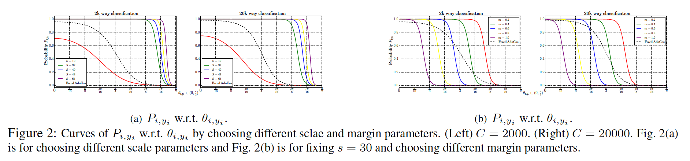

## AdaCos: Adaptively Scaling Cosine Logits for Effectively Learning Deep Face Representations

### 摘要

​		基于余弦softmax损失[21、28、39、8]及其变体[40、38、S7]在基于深度学习的人脸识别中获得巨大成功。但是，这些损失中超参数设置显著影响优化路径以及最终的识别性能。手工调整这些超参数严重依赖用户的经验，并需要许多训练技巧。

​		本文中，我们通过分析基于余弦softmax损失的两个重要超参数（缩放参数和角间隔参数）如何调节预测到分类概率以深入研究它们的影响。基于这些分析，我们提出一种新颖的基于余弦的softmax损失——AdaCos，其为无超参数和自适应缩放参数来自动强化训练过程中的训练监督。我们将提出的AdaCos损失用于大规模人脸验证和识别数据集，包括LFW、MegaFace和IJB-C上的1:1验证。我们的结果表明利用AdaCos损失训练深度神经网络是稳定的，并能获得高人脸识别准确率。我们的方法在这三个数据集上比SOTA softmax损失[28、40、7]好。

### 1. 引言

​		最近几年，深度卷积神经网络[17、12、25、35]在一对一（$1:1$）人脸验证和一对多（$1:N$）人脸识别上获得巨大突破。深度人脸CNN的成主要来自三个方面：巨量的人脸数据集、深度神经网络架构和高效的损失函数。现代人脸数据集（如LFW、CASIA-WebFace、MS1M和MegaFace）包含大量身份，其保证深度网络的训练。最大量最近的研究（如DeepFace [36]、DeepID2 [31]、DeepID3 [32]、VGGFace [25]和FaceNet [29]）合适的网络架构也能产生改进的性能。

​		除了大规模训练数据和深度结构外，在学习准确的人脸识别模型中，训练损失也起着关键作用。与图像分类任务不同，人脸识别本质上是一个开放集识别问题，其中测试类别（身份）一般与训练中使用的不同。为了处理这个挑战，大多数基于深度学习的人脸识别方法利用CNN来从人脸图像提取特征表示，并且推理期间，采用度量（通常为余弦距离）来估计人脸对之间的相似性。

​		但是，如此的推理评估度量在利用softmax交叉熵损失函数的方法中没有很好考虑，其利用softmax交叉上损失训练网络，但是使用余弦相似性进行推理。为了缓解训练和测试之间的差异，最近的工作[21、28、39、8]直接优化基于余弦的softmax损失。此外，基于角间隔项[19、18、40、38、7]通常被集成到基于余弦的损失以最大化不同身份之间的角间隔。这些方法在开放集设置上提高人脸识别性能。尽管它们取得成功，基于余弦损失的训练过程（以及它们引入间隔的变体）通常很棘手和不稳定。收敛和性能高度依赖损失的超参数设置，其通过大量实验实证确定。此外，这些超参数的细微变化可能会使整个训练过程失败。

​		本文中，我们研究基于余弦的softmax损失的SOTA（特别是最大化角间隔）以理解它们是如何为训练深度神经网络提供监督。这些函数中的每一个通常包含介个超参数，这在最终性能上有很大的影响，并且通常难以调整。人们不得不利用不同设置重复训练多次以获得最优性能。我们的分析证明这些基于余弦损失中的不同超参数实际上在控制样本预测类概率上有相似的影响。超参数设置不正确会导致损失函数无法提供足够的监督来优化网络。

​		基于上述观察，我们提出一种基于余弦的自适应损失函数（adaptive cosine-based loss：AdaCos），其在训练期间自动调整超参数，并生成更有效的监督。提出的AdaCos动态缩放样本和相应类中心向量（softmax之前的全连接向量）之间的余弦相似性，使它们的预测类别匹配这些余弦相似性的语义意义。此外，AdaCos可以使用流行深度学习库[26、1、5、15]中的内部函数轻松实现。提出的AdaCos损失导致训练更快、更稳定的收敛，而不会引入额外的计算开销。

​		为了证明所提出的AdaCos损失函数的有效性，我们在几种人脸基准测试上评估她它，基准测试包括LFW人脸验证、MegaFace百万识别和IJB-C。在所有这些基准上，我们的方法均优于基于余弦的最新损失。

### 2. 相关工作

​		**Cosine similarities for inference**	对于深度学习人脸表示，通常采用特征归一化的损失来提高识别准确率Coco损失和NormFace研究归一化的影响，并通过重建softmax损失和度量学习而提出两种策略。相似地，Ranjan等[28]也讨论了这个问题，并在特征向量上使用归一化来将它们限制到超球面。此外，与这些硬归一化相比，ring loss[45]提出了一种采用凸公式的软特征归一化方法。

​		**Margin-based softmax loss**	早些时候，大多数人脸识别方法都使用针对指标的损失函数，例如三元组[41]和对比损失[6]，它们利用欧几里得距离来度量特征之间的相似性。利用这些工作的优势，提出了中心损失[42]和距离损失[44]通过最小化每个类别内的距离[2]来减少类别内的变化。利用这些工作的优势，提出了中心损失[42]和距离损失[44]通过最小化每个类别内的距离[2]来减少类别内的变化。遵循这种方式，研究人员发现限制欧式空间中的间隔不足以获得最优泛化。然后，提出基于间隔的损失函数来处理这个问题。将角约束集成到softmax损失函数以提高L-Softmax和A-Softmax学习到的人脸表示。与前面提到的方法相比，CosFace、AM-softmax和ArcFace直接最大化角间隔，并采用更简单、更直观的损失函数。

​		**Automatic hyperparameter tuning**	算法的性能高度依赖超参数设置。网格和随机搜索是最广泛使用的策略。为了更自动化的调整，基于顺序模型的全局优化[14]是主流选择。通常，利用几种超参数设置进行推理，并根据推断结果选择下一轮测试的设置。贝叶斯优化[30]和树结构的parzen估计器方法[4]是两种著名的基于顺序模型的方法。 但是，这些算法实际上需要进行多次试验才能预测出优化的超参数设置。

### 3. 基于余弦softmax损失的超参数研究

​		近年来，最先进的基于余弦的softmax损失，包括L2-softmax [28]、CosFace [40]、ArcFace [7]，极大地改善了深度人脸识别的性能。但是，这些损失的最终性能受它们的超参数设置的影响，其一般难以调整，并需要在实践中进行多次尝试。我们分析基于余弦损失的两个重要超参数，缩放参数$s$和间隔参数$m$。具体而言，我们深入研究它们在softmax之后的预测概率的影响，其作为更新整个神经网络的监督信号。

​		令$\vec{x}_i$表示当前大小为$N$的mini-batch中第$i$张人脸图像的深度表示（特征），并且$y_i$为相应的标签。mini-batch中所有$N$个样本的预测分类概率$P_{i,j}$可以通过softmax函数估计为：

$$P_{i,j} = \frac{e^{f_{i,j}}}{\sum_{k=1}^C e^{f_{i,k}}},\tag{1}$$

其中$f_{i,j}$为用作softmax输入的logit，$P_{i,j}$表示将$\vec{x}_i$分配给类$j$的softmax-normalized概率，$C$为类的数量。与当前mini-batch关联的交叉熵损失为：

$$\mathcal{L}_{CE} = -\frac{1}{N}\sum_{i=1}^N \log P_{i,y_i} = -\frac{1}{N}\sum_{i=1}^N \log\frac{e^{f_{i,y_i}}}{\sum_{k=1}^Ce^{f_{i,k}}}.\tag{2}$$

​		传统softmax损失和基于余弦softmax损失的以不同方式计算logits $f_{i,j}$。在传统的softmax损失中，获得logits $f_{i,j}$作为特征$\vec{x}_i$和第$j$个类权重$\vec{W}_j$，即$f_{i,j} = \vec{W}_j^T \vec{x}_i$。在基于余弦的softmax损失[28、40、7]中，通过$\cos \theta_{i,j} = \langle\vec{x}_i, \vec{W}_j\rangle/\|\vec{x}_i\|\|\vec{W}_j\|$计算余弦相似性。logits $f_{i,j}$计算为$f_{i,j} = s \cdot \cos\theta_{i,j}$，其中$s$为缩放超参数。为了在表示上施加角间隔，ArcFace[7]修改损失以构成

$$f_{i,j} = s \cdot \cos(\theta_{i,j} + \mathbb{1}\{j=y_i\} \cdot m),\tag{3}$$

而CosFace[40]使用

$$f_{i,j} = s\cdot(\cos \theta_{i,j} - \mathbb{1}\{j=y_i\}\cdot m),\tag{4}$$

其中$m$为间隔。当$j = y_i$时，指示器函数$\mathbb{1}\{j=y_i\}$返回1；否则返回0。所有基于间隔的变体通过减去间隔$m$来减小与正确类关联的$f_{i,y_i}$。与没有间隔的损失相比，通过特定的$m$，基于间隔的变体要求$f_{i,y_i}$大于其他$f_{i,j}, j \ne y_i$。

​		直观上，一方面，参数$s$缩小了余弦距离的狭窄范围，使logits具有更大的判别力。另一方面，参数$m$放大不同类之间的间隔以增强分类能力。这些超参数最终会影响$P_{i,y_i}$。经验上，一种理想的超参数设置应当帮助$P_{i,j}$满足遵循如下两个特性：（1）每个类（身份）的预测概率$P_{i,y_i}$应当在$[0,1]$之间：$P_{i,y_i}$的下界应当接近0，而上界应当接近1；（2）$P_{i,y_i}$的变化曲线应当在$\theta_{i,y_i}$周围有较大的绝对梯度以使训练高效。

#### 3.1. Effects of the scale parameter $s$

​		缩放参数$s$可以显著影响$P_{i,y_i}$。直觉上，随着$\theta_{i,y_i}$从$\frac{\pi}{2}$减小到$0^2$，$P_{i,y_i}$应当从0逐渐增加到1，即$\vec{x}_i$与其对应类权重$\vec{W}_{y_i}$之间的夹角越小，概率应当越大。与$\theta_{i,y_i}$对应的不合适概率范围和概率曲线都对训练过程产生负影响，因此也对识别性能也产生负面影响。

​		我们首先研究分类概率$P_{i,j}$的范围。给定缩放参数$s$，在所有基于余弦的softmax损失的概率范围为

$$\frac{1}{1 + (C-1)\cdot e^s} \le P_{i,j} \le \frac{e^s}{e^s + (C-1)},\tag{5}$$

其中，当式（1）中$f_{i,j}=s\cdot0=0$和$f_{i,k} =s \cdot 1 =s(k\ne j)$时，获得下界。相似地，当$f_{i,j}=s$和$f_{i,k}=0$（$k \ne j$）时，获得上界。当$s\rarr \infin$时，$P_{i,j}$的范围接近1，即

$$\lim_{s \rarr +\infin}\Big(\frac{e^s}{e^s + (C-1)}-\frac{1}{1+(C-1)\cdot e^s}\Big)=1,\tag{6}$$

其意味着较大的$s$可以满足范围跨越$[0,1]$的要求。但是，不意味着缩放参数越大，选择越好。事实上，概率范围可以轻易达到较高的值，例如当累的数量$C=10$和缩放参数$s=5.0$时，类概率为0.94。但是，尺度过大将导致不良的概率分布，这将在以下段落中进行讨论。

​		我们通过将$P_{i,y_i}$作为$s$和夹角$\theta_{i,y_i}$的函数来研究参数$s$的影响，其中$y_i$表示$\vec{x}_i$的标签。形式上，我们有

$$P_{i,y_i}=\frac{e^{f_{i,y_i}}}{e^{f_{i,y_i}}+B_i} = \frac{e^{s\cdot\cos\theta_{i,y_i}}}{e^{s\cdot\cos\theta_{i,y_i}}+B_i},\tag{7}$$

其中$B_i = \sum_{k \ne y_i}e^{f_{i,k}}=\sum_{k\ne y_i}e^{s\cdot\cos\theta_{i,k}}$为特征$\vec{x}_i$的所有非对应类的logits之和。训练过程中，我们观察到$B_i$的值几乎没有变化。这是因为非对应类$k \ne y_i$的夹角$\theta_{i,k}$始终停留在$\frac{\pi}{2}$周围（见图1的红色曲线）。

​		因此，我们可以假设$B_i$为常量，即$B_i \approx \sum_{k \ne y_i}e^{s\cdot \cos(\pi/2)}=C-1$。然后，我们绘制不同参数设置下与$\theta_{i,y_i}$对应的概率$P_{i,y_i}$的曲线，见图2（a）。当$s$过小（例如，对于类/身份数量$C=2000$和$C=20000$，$s=100$）时，$P_{i,y_i}$的最大值不能达到1。这是不期望的，因为即使当网络对样本$\vec{x}_i$对应的类标签$y_i$非常自信（例如$\theta_{i,y_i}=0$)，损失函数仍会惩罚分类结果，并更新网络。

​		另一方面，当$s$过大（例如$s=64$）时，与$\theta_{i,y_i}$对应的概率曲线$P_{i,y_i}$也是问题。当$\theta_{i,y_i}$接近$\pi/2$时，它会输出非常高的概率，这意味着具有较大$s$的损失函数可能没有惩罚误分类的样本，并且不能有效地更新网络来纠正错误。

​		总之，缩放参数$s$对概率$P_{i,y_i}$的范围及曲线有实质上的影响，这对于高效训练深度网络至关重要。

#### 3.2. Effects of the margin parameter $m$

​		本节中，我们研究基于余弦softmax损失（式（3）和（4））重的间隔参数$m$的影响，以及它们在特征$\vec{x}_i$的预测类概率$P_{i,y_i}$上的影响。为了简化，这里，我们研究ArcFace（式（3））的间隔参数$m$；同时相似的结论也适用于CosFace（式（4））中的参数$m$。

​		首先，我们将式（7）中侧分类概率$P_{i,y_i}$重写为

$$P_{i,y_i} = \frac{e^{f_{i,y_i}}}{e^{f_{i,y_i}} + B_i} = \frac{e^{s \cdot \cos(\theta_{i,y_i} + m)}}{e^{s\cdot \cos(\theta_{i,y_i} + m)} +B_i}.\tag{8}$$

为了研究参数$m$对概率$P_{i,y_i}$的影响，我们假设$s$和$B_i$都是固定的。遵循3.1节的讨论，我们设置$B_i \approx C-1$，并且$S = 30$。不同$m$下，与$\theta_{i,y_i}$对应的概率曲线$P_{i,y_i}$如图2（b）所示。

​		根据图2（b），间隔参数的增加会将概率$P_{i,y_i}$的曲线向左平移。因此，相同的$\theta_{i,y_i}$下，更大的检测参数导致更低的概率$P_{i,y_i}$，因此，即使在较小的夹角$\theta_{i,y_i}$下，也有更大的损失。换句话说，对于样本$i$被正确分类，特征$\vec{x}_i$及其对应类权重$\vec{W}_{y_i}$之间的夹角$\theta_{i,y_i}$不得不非常小。这就是为什么与传统的基于余弦的损失相比，基于角度的损失对相同的$θ_{i,y_i}$提供更强的监督的原因。在[40、7]中，适当的边距设置已显示出可以提高最终识别性能。

​		尽管更大的间隔$m$提供更大的监督，它也不应该太大。当$m$过大（例如，$m ＝ 1.0$）时，概率$P_{i,y_i}$变得不可靠。即使样本与类之间的夹角很小,这导致几乎所有样本的损失都很大，训练也难以收敛。在先前的方法中，间隔参数的选择是一个临时过程，在大多数情况下没有理论指导。

#### 3.3. 超参数研究的总结

​		根据我们的分析，我们可以作出如下总结：

​		（1）超参数尺度$s$和间隔$m$可以显著影响ground-truth身份/类别$y_i$的特征$\vec{x}_i$的预测概率$P_{i,y_i}$。对于尺度参数$s$，过小的$s$会使最大预测概率$P_{i,y_i}$为1，其使得训练损失对$\theta_{i,y_i}$的正确性不敏感。对于间隔参数$m$，太小的间隔不足以正则化最终的角度间隔，而间隔太大则使训练难以收敛。

​		（2）尺度$s$和间隔$m$的影响可以统一起来，以调节从余弦距离$\cos\theta_{i,y_i}$到预测概率$P_{i,y_i}$的映射。如图2（a）和图2（b）所示，对于加强监督，小尺度和大间隔对$\theta_{i,y_i}$有相似的影响，而大尺度和小间隔都会减弱监督。因此，使用一个单一的超参数$s$或$m$控制概率$P_{i,y_i}$是可行且有希望的。考虑到$s$与需要跨越$[0,1]$的$P_{i,y_i}$的范围更相关的事实，在余下的文章中，我们将关注自动调整尺度参数$s$。

### 4. The cosine-based softmax loss with adaptive  scaling

​		本节中，基于我们先前对基于余弦的softmax损失函数的超参数的研究，我们提出了一种具有自适应缩放方案的新型损失（即AdaCos）它不需要即时且费时的手动参数调整。利用提出的损失训练不仅促进收敛，还产生更高的识别准确率。

​		先前图1中的研究表明，训练过程中，特征及其非对应权重$\vec{W}_{k\ne y_i}$之间的夹角$\theta_{i,k}, (k\ne y_i)$几乎始终接近$\frac{\pi}{2}$。换句话说，我们可以安全的假设式（7）中的$B_i \approx \sum_{k \ne y_i}e^{s \cdot \cos(\pi / 2)} = C-1$。显然，特征$x_i$属于它对应类$y_i$的概率$P_{i,y_i}$对网络训练的监督影响最大。因此，我们关注设计控制概率$P_{i,y_i}$的自适应尺度参数。

​		根据与$\theta_{i,y_i}$相应的$P_{i,y_i}$的曲线（图2（a）），我们观察到尺度参数$s$不仅仅影响确定正确/不正确的$P_{i,y_i}$的边界，还会挤压/拉伸（squeeze/stretch）$P_{i,y_i}$的曲率。与尺度$s$相比，间隔参数$m$仅平移曲线。因此，我们提出自动调整尺度参数$s$，并从我们的损失函数中消除间隔参数$m$，这使得我们提出的AdaCos损失与最新的带角间隔的softmax损失变体不同。利用softmax函数，预测的概率可以定义为：

$$P_{i,j} = \frac{e^{\tilde{s}\cdot \cos\theta_{i,j}}}{\sum_{k=1}^C e^{\tilde{s}\cdot\cos\theta_{i,k}}},\tag{9}$$

其中$\tilde{s}$为自动调整的尺度参数。

​		我们首先重新将$P_{i,y_i}$（式（7））作为$\theta_{i,y_i}$的函数。注意，$\theta_{i,y_i}$表示样本$\vec{x}_i$与其ground-truth类别$y_i$的权重向量之间的夹角。对于网络训练，我们希望利用来自损失函数$L_{CE}$的监督最小化$\theta_{i,y_i}$。数学上，我们发现当$P_{i,y_i}$的二阶导数在$\theta_0$处等于0时，绝对梯度值$\|\frac{\partial P_{i,y_i}(\theta)}{\partial \theta}\|$达到最大值的点，即

$$\frac{\partial P_{i,y_i}(\theta_0)}{\partial \theta_0^2} = 0,\tag{10}$$

其中$\theta_0 \in [0, \frac{\pi}{2}]$。结合式（7）和（10），我们尺度参数$s$和点$(\theta_0, P(\theta_0))$之间的关系为：

$$s_0 = \frac{\log B_i}{\cos \theta_0},\tag{11}$$

其中，由于训练过程中的夹角$\theta_{i,k}$的分布在$\pi/2$周围，所以$B_i$可以很好地近似为$B_i = \sum_{k\ne y_i} e^{s \cdot \cos\theta_{i,k}}\approx C-1$（见式（7）和图1）。然后，自动确定$\tilde{s}$的任务简化为在$[0, \pi/2]$中选择合理的中心夹角$\tilde{\theta}$。

#### 4.1. 自动选择固定的尺度参数

​		由于$\frac{\pi}{4}$位于$[0, \frac{\pi}{2}]$的中心，所以自然而然地将$\pi/3$视为点，即为指出从夹角$\theta_{i,y_i}$到概率$P_{i,y_i}$的有效映射，设置$\theta_0 = \pi/4$。然后，反向传播由$P_{i,y_i}$确定的监督来更新$\theta_{i,y_i}$，并进一步更新网络参数。根据式（11），我们可以估计相应的尺度参数$s_f$：

$$\begin{align}\tilde{s}_f = \frac{\log B_i}{\cos \frac{\pi}{4}} &= \frac{\log \sum_{k \ne y_i} e^{s \cdot \cos\theta_{i,k}}}{\cos\frac{\pi}{4}} \\&\approx \sqrt{2}\cdot\log(C-1)\end{align}\tag{12}$$

其中$B_i$由$C-1$近似。

​		对于如此自动选择固定的尺度参数$\tilde{s}_f$（见图2（a）和2（b）），它依赖训练集中的类数量$C$，并为已有的基于余弦距离的softmax损失提供良好的指南。相比之下，已有方法中的缩放参数根据人类经验手工设计。在下一节中，它作为四种动态调整的尺度参数$\tilde{s}_d$的良好极限。

#### 4.2. Dynamically adaptive scale parameter

​		如图1所示，特征$\vec{x}_i$和它们ground-truth类权重$\vec{W}_{y_i}$之间的夹角$\theta_{i,y_i}$随着训练跌倒的增加而增加；而特征$\vec{x}_i$与非相应类$\vec{W}_{j\ne y_i}$之间的夹角稳定在$\frac{\pi}{2}$附近，如图1所示。

​		尽管我们先前固定尺度参数$\tilde{s}_f$随着$\theta_{i,y_i}$在$[0,\frac{\pi}{2}]$之间变化表现合适，但是它没有考虑训练过程中$\theta_{i,y_i}$逐渐增加的事实。由于随着训练过程的深入，更小的$\theta_{i,y_i}$获得更高的概率$P_{i,y_i}$，因此逐渐获得更弱的监督，所以我们提出一种动态自适应缩放参数$\tilde{s}_d$来渐进地对$\theta_0$的位置应用更严格的要求，这可以在整个训练过程逐步增强监督。

​		形式上，我们引入调节指示器变量$\theta_{\mbox{med}}^{(t)}$，其为所相应类夹角$\theta_{i,y_i}^{(t)}$的中值，这些夹角来自第$t$次迭代中大小为$N$的mini-batch。$\theta_{\mbox{med}}^{(t)}$大致表示mini-batch中当前网络的优化程度。当中值夹角很大时，它表示网络参数远非最佳，应该应用不太严格的监督来使训练更稳定地收敛；当中值夹角$\theta_{\mbox{med}}^{(t)}$很小时，它表示网络接近最优，并且应当使用更严格的监督来使类内夹角$\theta_{i,y_i}$变得更小。基于这种观察，我们设置中心夹角$\tilde{\theta}_0^{(t)} = \theta_{\mbox{med}}^{(t)}$。我们还引入$B_{\mbox{avg}}^{(t)}$作为$B_i^{(t)}$的平均：

$$B_{\mbox{avg}}^{(t)} = \frac{1}{N}\sum_{i \in \mathcal{N}^{(t)}}B_i^{(t)}=\frac{1}{N}\sum_{i \in \mathcal{N}^{(t)}}\sum_{k \ne y_i}e^{\tilde{s}_d^{(t-1)}\cdot\cos\theta_{i,k}},\tag{13}$$

其中$\mathcal{N}^{(t)}$表示第$i$次迭代的mini-batch中的人脸身份索引。与为固定自适应缩放参数$\tilde{s}_f$近似$B_i \approx C-1$不同，这里，我们使用先前迭代的缩放参数$\tilde{s}_d^{(t-1)}$估计$B_i^{(t)}$，其提供更准确的近似。请注意，$B_i^{(t)}$还包括动态尺度$\tilde{s}_d^{(t)}$。我们可以通过求解上述方程给出的非线性函数来获得它。事实上，我们注意到，$\tilde{s}_d^{(t)}$在接下来的迭代中变化非常小。所以，我们仅使用$\tilde{s}_d^{(t-1)}$来计算式（7）中的$B_i^{(t)}$。然后，我们利用式（11）直接获得动态尺度$\tilde{s}_d^{(t)}$。所以，我们有：

$$\tilde{s}_d^{(t)} = \frac{\log B_{\mbox{avg}}^{(t)}}{\cos \theta_{\mbox{med}}^{(t)}},\tag{14}$$

其中$B_{\mbox{avg}}^{(t)}$与动态尺度参数相关。我们使用先前的迭代的尺度参数$\tilde{s}_d^{(t-1)}$来估计它。

​		在训练过程的开始时，每个mini-batch中的中值夹角$\theta_{\mbox{med}}^{(t)}$可能过大而不能为训练施加足够的监督。因此，我们迫使中心夹角$\theta_{\mbox{med}}^{(t)}$小于$\frac{\pi}{4}$。我们的第$t$次迭代的动态尺度参数可以表示为：

$$\tilde{s}_d^{(t)}=\begin{cases}\sqrt{2} \cdot \log(C-1) & t = 0, \\\frac{\log B_{\mbox{avg}^{(t)}}}{\cos \big(\min(\frac{\pi}{4}, \theta_{\mbox{med}}^{(t)})\big)} & t\ge1,\end{cases}\tag{15}$$

其中当$t=0$时，$\tilde{s}_d^{(0)}$初始化为我们的固定尺度参数$\tilde{s}_f$。

​		将$\tilde{s}_d^{(t)}$带入$f_{i,j} = \tilde{s}_d^{(t)} \cdot \cos\theta_{i,j}$，相应的梯度可以计算如下：

$$\begin{align}\frac{\partial \mathcal{L}(\vec{x}_i)}{\partial \vec{x}_i}&=\sum_{j=1}^C(P_{i,j}^{(t)} - \mathbb{1}(y_i = j))\cdot\tilde{s}_d^{(t)}\frac{\partial \cos \theta_{i,j}}{\partial \vec{x}_i},\\ \frac{\partial\mathcal{L}(\vec{W}_j)}{\partial \vec{W}_j} &=(P_{i,j}^{(t)} - \mathbb{1}(y_i = j)) \cdot \tilde{s}_d^{(t)}\frac{\partial\cos \theta_{i,j}}{\partial \vec{W}_j},\end{align}\tag{16}$$

其中$\mathbb{1}$为指示器函数，并且

$$P_{i,j}^{(t)} = \frac{e^{\tilde{s}_d^{(t)}\cdot \cos\theta_{i,j}}}{\sum_{k=1}^C e^{\tilde{s}_d^{(t)}\cdot\cos\theta_{i,k}}}.\tag{17}$$

式（17）展示表明动态自适应尺度参数 $\tilde{s}^{(t)}_d$ 在每次迭代中对分类概率的影响不同，并且还有效地影响用于更新网络参数的梯度（等式（16））。动态AdaCos的好处是，它可以通过感知当前迭代中的模型的训练收敛程度而产生合理的尺度参数。

### 5. 实验

​		我们在几个公共人脸识别基准上检查了提出的AdaCos损失函数，并将其与最先进的基于余弦的 softmax 损失进行比较。比较的损失包括$l2-\mbox{softmax}$、CosFace和ArcFace。我们介绍LFW、MegaFace 1M Challenge和IJB-C数据上的评估结果。我们还展示了一些探索性实验的结果，以展示收敛速度和对低分辨率图像的鲁棒性。

​		**预处理**	我们使用两种公开训练的数据集（CASIA-WebFace和MS1M）来训练具有我们提出的损失函数的CNN模型我们仔细从数据集中清洗噪声和低质量图像。清洗后的WebFace和MS1M包含大约0.45M和2.35M人脸图像。基于这些训练数据训练所有模型，并直接在三个数据集的测试划分上测试。将RSA用于图像来提取人脸区域。然后，根据检测的人脸标志点，通过相似性变换对其人脸，并将图像缩放到大小$144 \times 144$。所有图像的像素值减去均值127.5，并除以128。

#### 5.1. LFW上的结果

#### 5.2. MegaFace上的结果

