## ArcFace: Additive Angular Margin Loss for Deep Face Recognition

### 摘要

​		对于大规模人脸识别使用DCNN特征学习中的主要挑战之一是设计合适的损失函数，该函数增强辨别能力。中心损失在欧式空间中惩罚深度特征和它们相应类中心之间的距离以获得类内紧凑性。SphereFace假设最后的全连接层中的线性变换矩阵可以用作角空间中类中心的表示，并以乘法方式惩罚深度特征和它们相应权重之间的夹角。最近，最流行的研究线路是将间隔纳入损失函数以最大化人脸类的可分离性。本文中，我们提出Additive Angular Margin Loss（ArcFace）来获得高度辨别性的特征进行人脸识别。由于与超球面上的测地距离精确对应，因此拟议的ArcFace具有清晰的几何解释。可以说，我们可以在10多个人脸识别基准上对所有最新的最新人脸识别方法进行最广泛的实验评估，其中包括具有万亿对的新大型图像数据库和大型视频数据集。我们证明ArcFace一致好于SOTA，并能以忽略不计的开销轻松实现。我们释放所有的训练数据、训练代码、预训练模型和训练日志（https://github.com/deepinsight/insightface），其将有助于复现本文的结果。

### 1. 引言

​		使用深度卷积神经网络（DCNN）嵌入的人脸表示是人脸识别的首选方法[32、33、29、24]。DCNN将人脸图像（通常在姿态标准化步骤[45]后）映射到特征，该特征有小类内和大类间距离。

​		训练DCNN进行人脸识别有两条研究主线。那些通过使用softmax分类器[33、24、6]来训练可以在训练集中分离不同身份的多分类器的人，以及那些直接学习嵌入的人（例如三元组损失）[29]的人。基于大规模训练数据和优秀的DCNN架构，基于Softmax损失和基于三元损失的的方法都可以在人脸识别上获得优秀性能。但是softmax损失和三元损失都有一些缺点。对于softmax损失：（1）线性变换矩阵$W\in\mathbb{R}^{d \times n}$的大小随身份数量$m$而线性增加；（2）对于closed-set分类问题，学习的特征是可分离的，但是对于open-set人脸识别问题，辨别性是不足的。对于三元损失：（1）特别是对于大型数据集，人脸三元组的数量呈组合爆炸式增长，导致迭代步骤数显着增加；（2）对于有效的模型训练，半难样本挖掘是非常困难的问题。

​		已提出几种变体[38、9、46、18、37、35、7、34、27]来增强softmax损失的辨别能力。Wen等[38]率先提出了中心损失，即每个特征向量与其类中心之间的欧几里得距离，以获得类内部的紧凑性，同时通过联合惩罚softmax损失来保证类间禅意。然而，训练期间更新实际中心是极难的，因为训练可用的人脸类的数量已经急剧增长。

​		通过观察来自类别DCNN的最后一个完全连接层的权重，该权重经过softmax损失训练后，在概念上与每个人脸类别的中心具有相似性，[18、19]中的工作提出惩罚角间隔惩罚以同时迫使额外的类内紧凑性和类间差异，导致训练模型的更好辨别能力。尽管SphereFace[18]引入角间隔的重要思想，但是它们的损失需要一系列近似值才能计算，其导致网络的不稳定训练。为了稳定训练，它们提出一种混合损失，其包含标准的softmax损失。经验上，softmax损失主导训练过程，因为基于整数乘法的角间隔使目标logit曲线非常陡峭，并因此妨碍收敛。CosFace[37、35]直接将余弦间隔惩罚添加到目标logit，其获得比SphereFace更好的性能，但承认实施起来容易得多，并且免除了softmax损失所需的联合监管。

​		本文中，我们提出Additive Angular Margin Loss（ArcFace）来进一步提高人脸识别模型的辨别能力，并且稳定训练过程。如图2所示，DCNN特征和最后全连接层之间的点乘等于特征和权重归一化之后的余弦距离。我们利用arc-cosine函数来计算当前特征和目标权重之间的夹角。之后，我们将加法角间隔添加到目标夹角，并且我们通过余弦函数再次获得目标logit。然后，我们通过固定的特征范数重新缩放所有的logit，并且后续步骤与softmax损失完全相同。所提出的ArcFace的优势可以总结如下：

**Engaging**	ArcFace通过归一化超球面中角度和arc之间的精确对应关系直接优化了测地距离夹角。通过分析特征和权重之间的夹角统计量，我们直观上展示512维空间中发生了什么。

**Effective**	ArcFace在10个包含大规模图像和视频数据集的人脸识别基准测试上获得最佳性能。

**Easy**	ArcFace仅需要如算法1的几行代码，并且在基于计算图的深度学习框架（例如MxNet、PyTorch和TensorFlow）上非常容易实现。此外，与[18、19]的工作相反，为了稳定性能，ArcFace不需要与其他损失函数组合，并可在任意训练数据集上轻松收敛。

**Efficient**	ArcFace仅在训练期间添加可忽略的计算复杂度。当前的GPU可以轻松支持百万身份进行训练，并且模型并行策略可以轻松支持更多的身份。

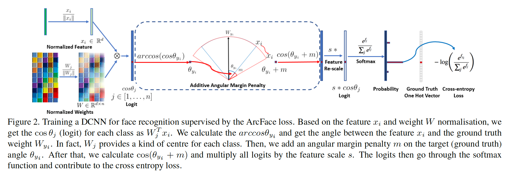

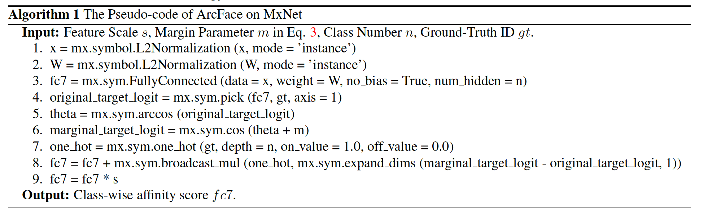

### 2. 所提出的方法

#### 2.1. ArcFace

​		最广泛使用的分类损失函数（softmax损失）如下：

$$L_1 = -\frac{1}{N}\sum_{i=1}^N\log\frac{e^{W_{y_i}^Tx_i + b_{y_i}}}{\sum_{j=1}^ne^{W_j^Tx_i +b_j}},\tag{1}$$

其中$x_i \in \mathbb{R}^d$表示第$i$个样本的深度特征，其属于第$y_i$个类。本文与[38、46、18、37]相同，嵌入特征维度$d$设置为512。$W_j \in \mathbb{R}^d$表示权重$W \in \mathbb{R}^{d \times n}$的第$j$列，$b_j \in \mathbb{R}^n$维偏置项。批大小和类数量分别为$N$和$n$。传统softmax损失广泛用于深度人脸识别[24、6]。但是softmax损失函数并未明确优化特征嵌入，以使类别内样本具有更高的相似性，而类别间样本却具有多样性，这会导致在类别间内部外观变化较大（例如姿势变化[30、48]和年龄差距[22、49]）和大规模测试场景（例如百万[15、39、21]或万亿对[2]）下的性能差距。

​		为了简单起见，如[18]，我们将偏置设置为$b_j=0$。然后，我们将logit转换为$W_j^Tx_i=\|W_j\|\|x_i\|\cos\theta_j$，其中$\theta_j$为权重$W_j$和特征$x_i$之间的夹角。遵循[18、37、36]，我们通过$l_2$归一化固定单个权重$\|W_j\|=1$。遵循[28、37、36、35]，我们还通过$l_2$归一化固定嵌入特征$\|x_i\|$，并将它重新缩放为$s$。特征和权重上的归一化步骤使预测仅依赖特征和权重之间的夹角。因此，学习到的嵌入特征分布在半径为$s$的超球面。

$$L_2 = -\frac{1}{N}\sum_{i=1}^N \log\frac{e^{s \cos\theta_{y_i}}}{e^{s \cos\theta_{y_i}} + \sum_{j=1,j\ne y_i}^ne^{s \cos\theta_j}}.\tag{2}$$

​		由于嵌入特征分布在超球面每个特征中心周围，所以我们在$x_i$和$W_{y_i}$之间添加加法角间隔惩罚$m$以同时增强类内紧凑性和类间差异行。因为所提出的加法角间隔惩罚等价于归一化超球面中的测地距离间隔惩罚，所以我们称我们的方法为ArcFace：

$$L_3 = -\frac{1}{N}\sum_{i=1}^N \log\frac{e^{s \cos(\theta_{y_i}+m)}}{e^{s \cos(\theta_{y_i}+m)} + \sum_{j=1,j\ne y_i}^ne^{s \cos\theta_j}}.\tag{2}$$

​		我们选择包含足够样本（大约1500张图像/类）的8个不同身份的人脸图像来训练具有softmax和ArcFace损失的2D特征嵌入网络。如图3所示，softmax损失提供粗糙的可分离特征嵌入，但是在决策边界上产生显著的模糊，而ArcFace损失显然可以使最近的类之间的差距更加明显。

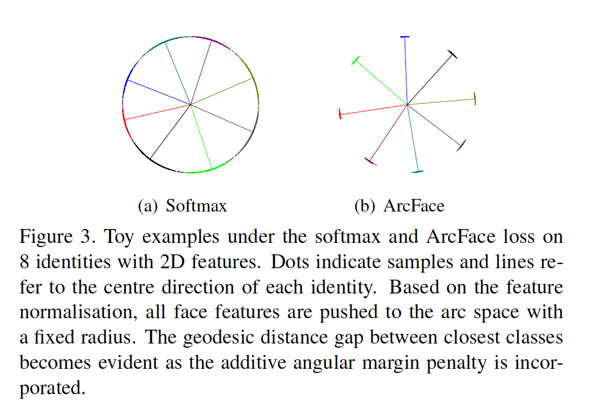

#### 2.2. 与SphereFace和CosFace的比较

**Numerical Similarity**	在SphereFace[18、19]、ArcFace和CosFace[37、35]中，提出三种不同间隔的惩罚，例如惩罚角间隔$m_1$、加法角间隔$m_2$和加法余弦间隔$m_3$。从数值分析的角度，不同间隔惩罚，无论添加到间隔，还是余弦空间[37]，都是想要通过惩罚目标logit[26]来迫使类内紧凑性和类间多样性。在图4（b）中，我们绘制SphereFace、ArcFace和CosFace在它们的最佳间隔设置下的目标logit曲线。我们仅展示$[20^\circ,100^\circ]$中的这些目标logit曲线，因为ArcFace的训练期间，$W_{y_i}$和$x_i$之间的夹角从大约$90^\circ$开始（随机初始化），并在大约$30^\circ$结束，如图4（a）所示。直觉上，目标logit曲线中有三个影响性能的因素，即起点、终点和斜率。

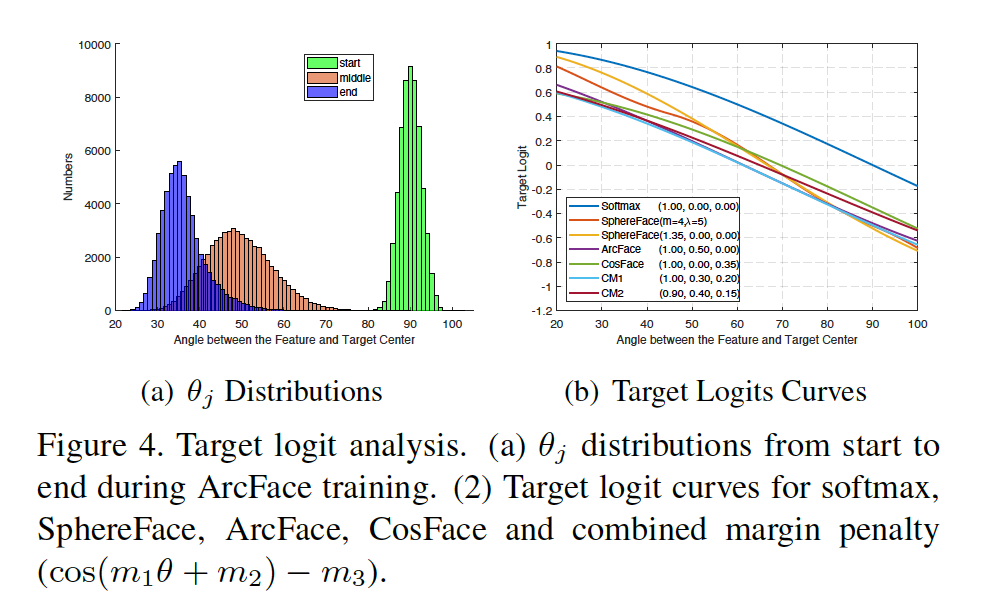

​		通过组合所有间隔惩罚，我们在以$m_1$、$m_2$和$m_3$为超参数的统一框架中实现SphereFace、ArcFace和CosFace：

$$L_4 = -\frac{1}{N}\sum_{i=1}^N\log\frac{e^{s(\cos(m_1\theta_{y_i} + m_2) - m_3)}}{e^{s(\cos(m_1\theta_{y_i} + m_2) - m_3)} + \sum_{j=1,j\ne y_i}e^{s\cos\theta_j}}.\tag{4}$$

如图4（b）所示，通过组合上述所有间隔$(\cos(m_1\theta + m_2) - m_3)$，我们可以轻松地获得其他目标logit曲线，其也有高性能。

**几何差异**	尽管ArcFace与前面工作之间有数值相似性，但是所提出的加法角间隔有更好的几何特性，因为角间隔与测地距离具有精确的对应关系。如图5所示，在二分类情况下计算比较决策边界。所提出的ArcFace在整个时间间隔内具有恒定的线性角间隔。 相比之下，SphereFace和CosFace仅具有非线性角度间隔。

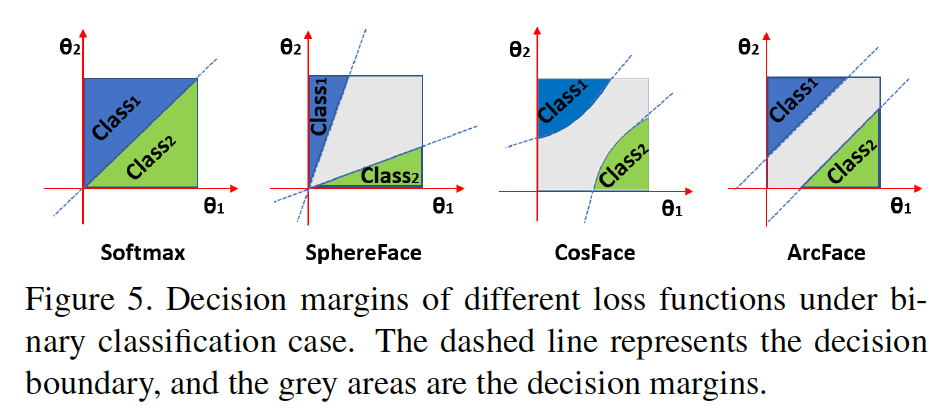

​		间隔设计中的主要差异在模型训练上可能产生“蝴蝶效应”。例如，原始的SphereFace采用退火优化策略。为了避免训练开始时发散，来自softmax的联合监督用于SphereFace以减弱惩罚间隔的惩罚。我们通过使用反余弦函数而不是使用复杂的倍角公式来实现新版本的SphereFace，而对间隔没有整数要求。在我们的实现中，我们发现$m=1.35$可以获得与原始SphereFace相当的性能，而没有任何收敛难度。

#### 2.3. 与其他损失的比较

​		可以基于特征和权重向量的角度表示来设计其他损失函数。例如，我们可以设计一种损失来在超球面上施加类内紧凑性和类间差异。如图1所示，本文中，我们与其他三种损失进行比较。

**Intra-Loss**被设计来通过减小样本和ground-truth中心之间的angle/arc来提高类内紧凑性。

$$L_5 = L_2 + \frac{1}{\pi N}\sum_{i=1}^N\theta_{y_i}.\tag{5}$$

**Inter-Loss**目的是通过增加不同中心之间的angle/arc来增强类间差异。

$$L_6 = L_2 - \frac{1}{\pi N(n-1)}\sum_{i=1}^N\sum_{j=1,j\ne y_i}^n \arccos(W_{y_j}^TW_j).\tag{6}$$

这里，Inter-Loss是Minimum Hyper-spherical Energy（MHE）方法[17]。在[17]，隐藏层和输出层通过MHE正则化。在MHE论文中，通过结合SphereFace损失和网络最后一层的MHE损失，提出了损失函数的一种特殊情况。

**Triple-loss**目标是增大三元样本之间的angle/arc。在FaceNet[29]中，在归一化特征上使用欧式间隔。这里，我们通过特征的角度表示采用三重损失，即$\arccos(x_i^{pos}x_i) + m \le \arccos(x_i^{neg}x_i)$。

### 3. 实验

#### 3.1. 实现细节

**数据集**	如表1给出的，我们单独使用CASIA、VGGFace2、MS1MV2和DeepGlint-Face（包含MS1M-DeepGlint和Asian-DeepGlint）作为训练数据，从而进行与其他方法的公平比较。请注意，提出的MS1MV2是MS-Celeb-1M数据集的半自动改进版本[10]。 据我们所知，我们是第一个使用针对种族的注释器来进行大规模人脸图像注释的方法，因为如果注释器对身份不熟悉，则很难区分边界情况（例如，困难样本和噪声样本） 。训练期间，我们探索有效的人脸验证数据集（例如LFW、CFP-FP、AgeDB-30）来检查不同的改建。除了广泛使用的LFW和YTF数据集外，我们还报告在最近的大型姿态和大年龄数据集（例如CPLFW和CALFW）上ArcFace的性能。我们还在大规模图像数据集（例如MegaFace、IJB-B、IJB-C和Trillions-Pairs）和视频数据集（iQIYI-VID）上测试所提出的ArcFace。

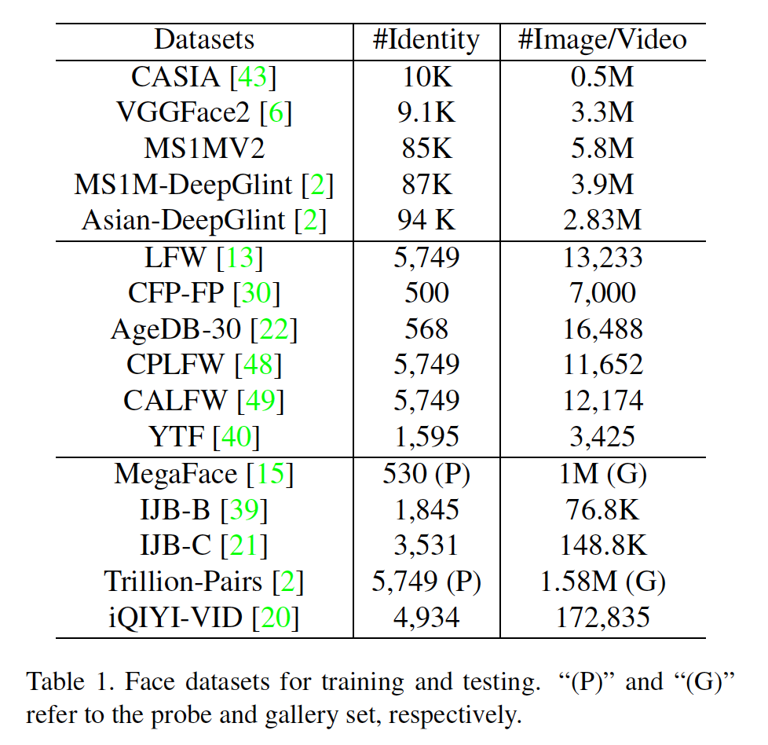

**实验设置**	对于数据预处理，我们遵循最近的论文[18、37]，使用五个人脸关键点来生成规范化的人脸裁剪（$112 \times 112$）。对于嵌入网络，我们采用广泛使用的CNN架构（ResNet50和ResNet100）。在最后的卷积层之后，我们使用BN-Dropout-FC-BN结构来获得最终的512-D嵌入特征。本文中，我们使用（[training dataset, network, loss]）来促进实验设置的研究。

​		我们遵循[37]，将特征尺度$s$设置为64，并选择ArcFace的角间隔$m$为0.5。本文的所有实验使用MXNet实现。我们将批大小设置为512，在4张Teslat P40（24GB）GPU上训练模型。在CASIA上，学习率从0.1开始，并在20K、28K迭代时除以10。在32K迭代时，结束训练过程。在MS1MV2上，我们在100K、160K迭代时除以10，并在180K完成训练。我们将momentum设置为0.9，权重衰减设置为$5e-4$。训练期间，对于每张规范化人脸，我们仅保留特征嵌入网络，而全连接层（ResNet50位150MB、ResNet100为250MB），并提取512D特征（ResNet50位8.9ms/face、ResNet100位15.4ms/face）。为了获得模板（例如IJB-B和IJB-C）或视频（例如YTF和iQIYI-VID）的嵌入特征，我们简单计算来自模板的所有图像或来自视频的所有帧的特征中心。值得注意的是，为了严格评估，删除训练集和测试集之间的重叠身份，并且我们仅使用单个裁剪进行所有测试。

#### 3.2. 损失上消融研究

​		在表2中，我们首先使用ResNet50在CASIA数据集上探索ArcFace的角间隔设置。我们实验中观察的最佳间隔位0.5。使用式（4）中提出组合间隔框架，设置SphereFace和CosFace的间隔比较容易，我们发现分别设置为1.35和0.35时具有最佳性能。我们对SphereFace和CosFace的实现都可以带来出色的性能，而不会出现任何收敛困难。所提出的ArcFace在三个测试集上获得最高验证准确率。此外，我们在图4（b）中的目标logit曲线的指导下，对组合间隔框架（在CM1（1，0.3，0.2）和CM2（0.9，0.4，0.15）观察到一些最佳性能）观察到的一些最佳性能进行了广泛的实验 。组合间隔框架带来的性能要比单个SphereFace和CosFace更好，但在ArcFace的性能上却更高。

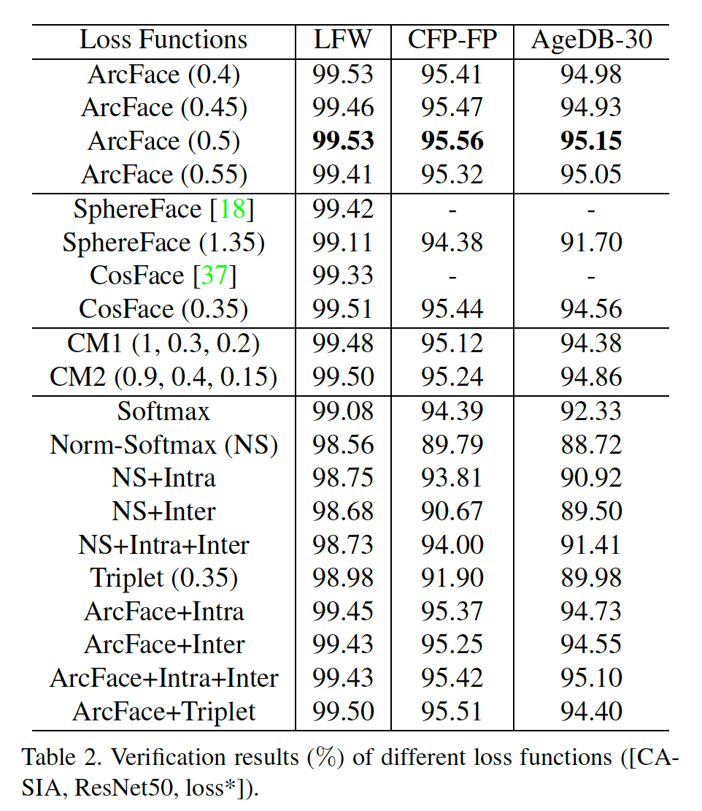

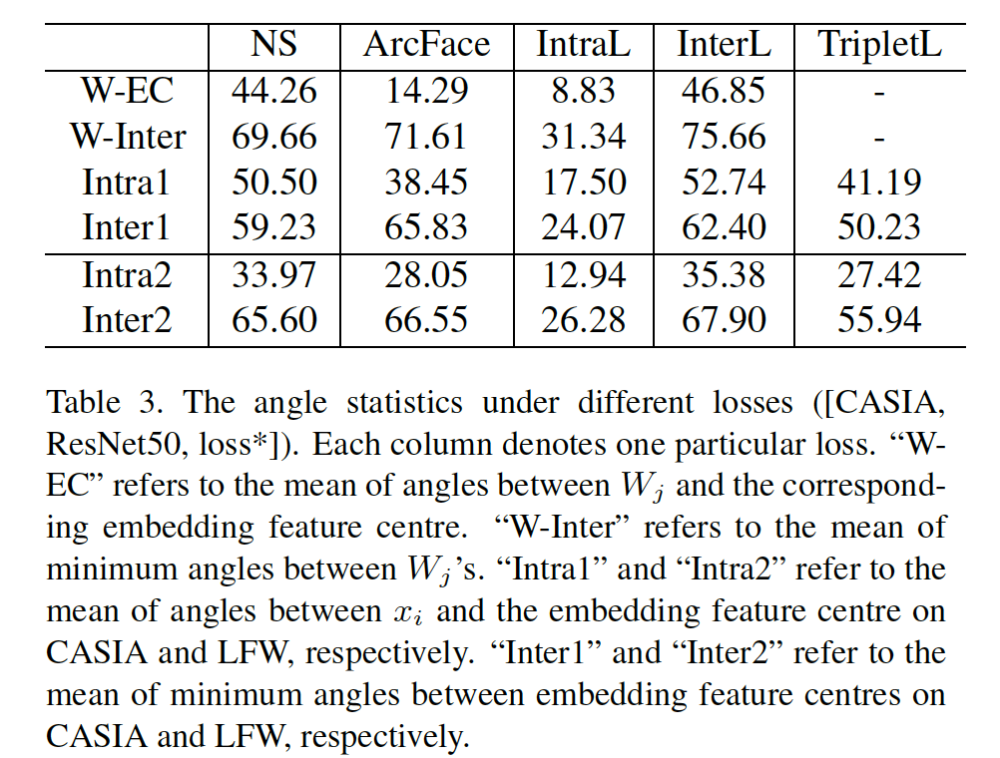

#### 3.3. 评估结果

**LFW、YTF、CALFW和CPLFW上的结果**

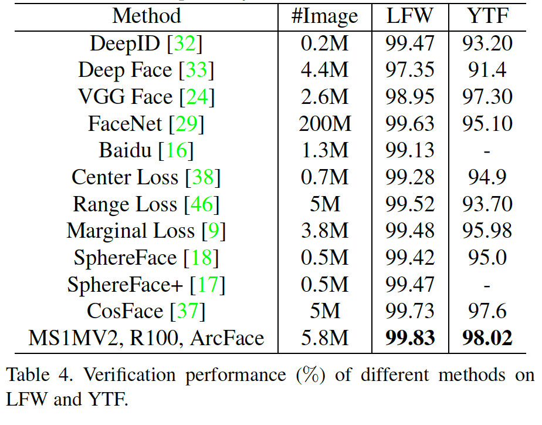

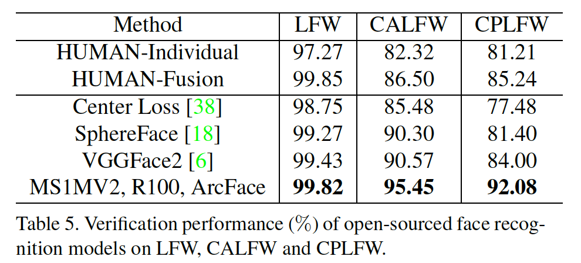

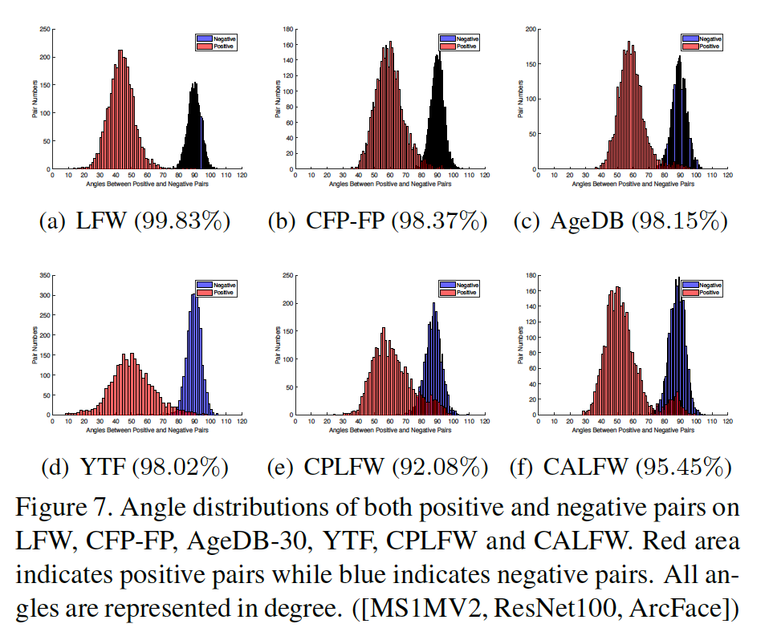

**MegaFace的结果**

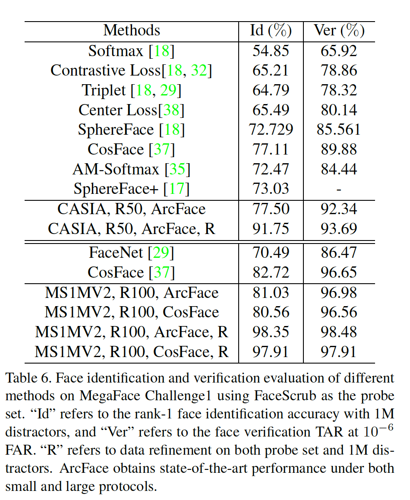

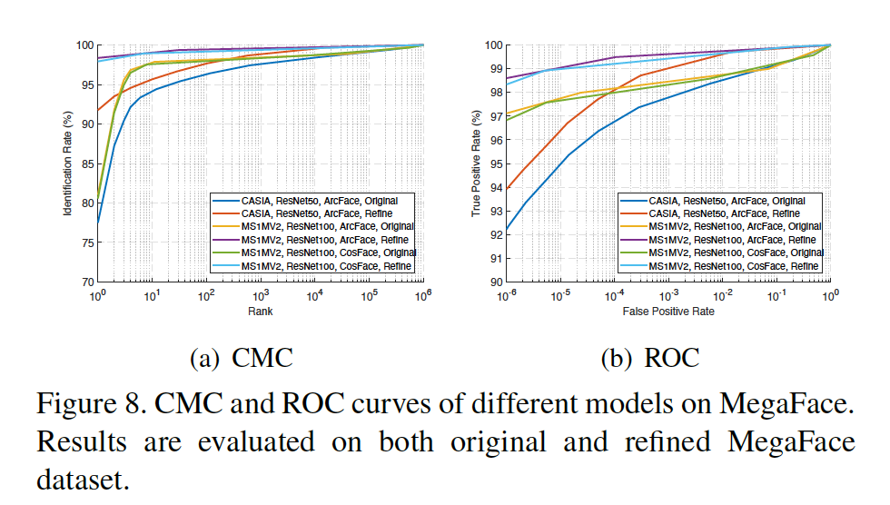

**IJB-B和IJB-C的结果**

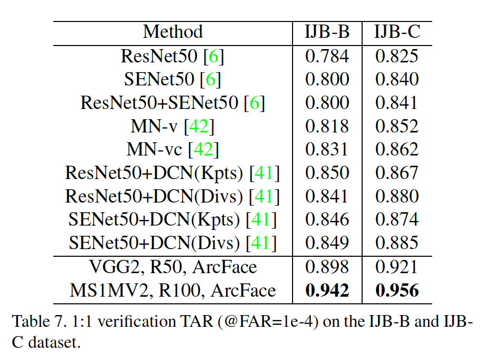

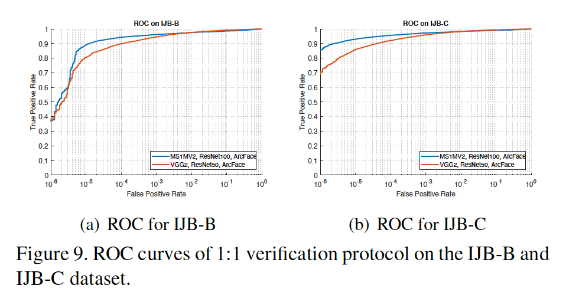

**Trillion-Pairs上的结果**

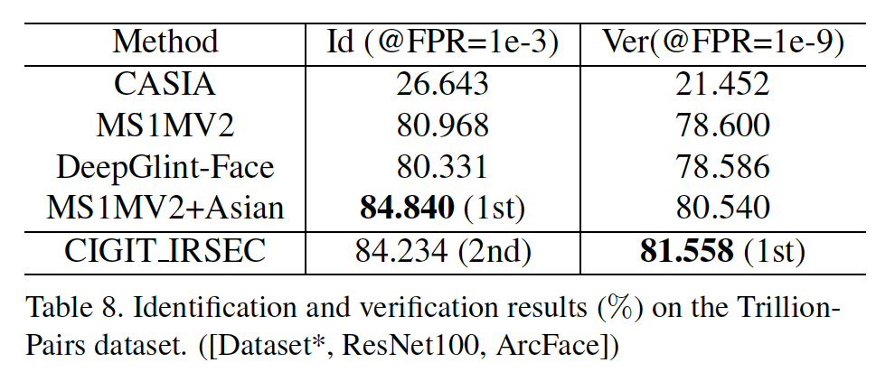

**iQIYI-VID上的结果**

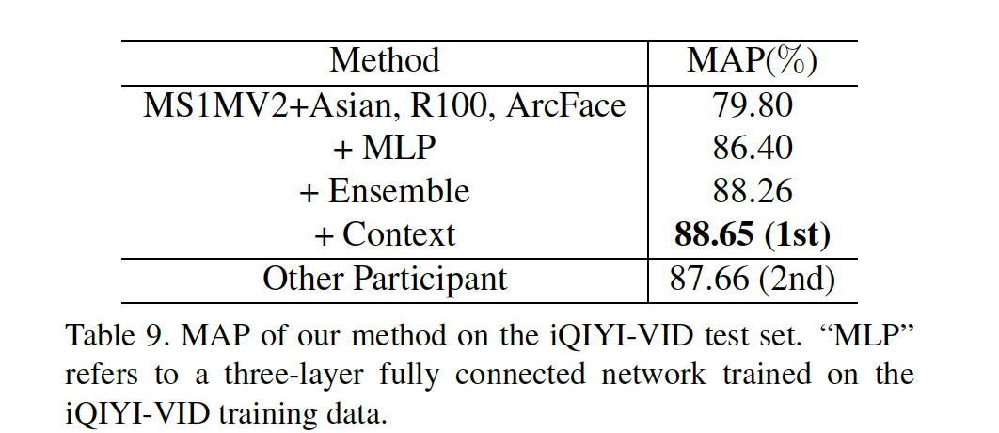

### 5. 附录

#### 5.1. 并行加速

​		**我们能在大规模身份上使用ArcFace吗？**	答案是肯定的，上百万的身份都不是问题。

​		$\mbox{Centre}(W)$的概念在ArcFace是必不可少的，但是$\mbox{Centre}(W)$的参数量与类的数量成正比。当训练数据中有上百万身份时，即使在较高的层面，所提出的ArcFace面临巨大训练困难，例如大量GPU内存消耗和大计算成本。

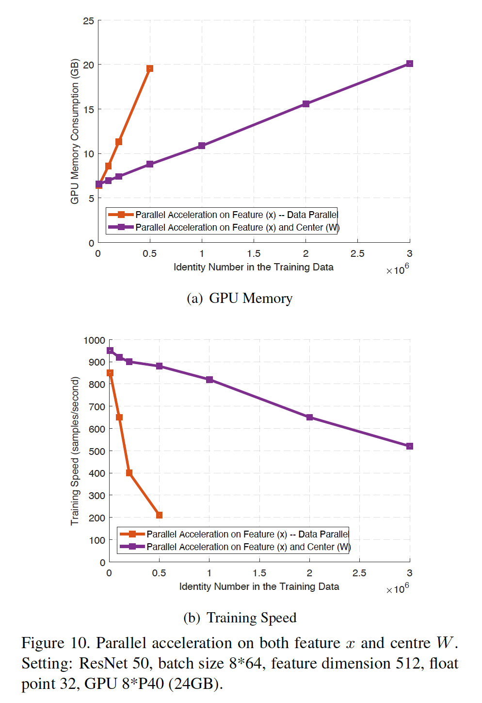

​		在我们的实现中，我们采用并行加速策略来缓解这个问题。我们优化训练代码，以通过在特征$x$（称为通用数据并行策略）和中心$W$（称为中心并行策略）上并行加速，轻松有效地在一台机器上支持百万级别的身份。如图10所示，特征$x$和中心$W$上的并行策略可以明显减少内存消耗，并提高训练速度。即使在$8 \times 1080\mbox{ti}$（11GB）上训练一百万身份，我们的实现（ResNet50、批大小$8 \times 64$、特征维度512和FP32）仍可以每秒800个样本的速度运行。与[47]中提出的近似加速相比，我们的实现没有任何性能丢失。

​		在图11中，我们通过简单的矩阵划分来说明并行加速的主要计算步骤，初学者可以很容易地掌握和重现这些加速度[3]。

​		（1）获取特征（$x$）。人脸嵌入特征从8张GPU上聚合到一个特征矩阵（批大小8*64 $\times$ 特征维度512）。聚合的特征矩阵大小仅为1MB，并且，当迁移特征矩阵时，通信成本可忽略不计。

​		（2）获取得分矩阵（$score = x W$）。我们将特征矩阵复制到每张GPU，并且同时将特征矩阵乘以中心子矩阵（特征维度512 $\times$ 身份数1M/8），以获取每个GPU上的相似度得分子矩阵（批大小512 $\times$ 身份数1M/8）。前向传播相似性得分矩阵以计算ArcFace损失和梯度。这里，我们在中心矩阵和相似性得分矩阵上沿着身份维度进行简单的矩阵划分，并且在中心和相似性得分矩阵上没有通信成本。每张GPU上，中心子矩阵和相似性得分子矩阵仅为256MB。

​		（3）获取中心（$dW$）的梯度。我们将每张GPU上的特征均值进行转置，并且同时将转置后的特征矩阵乘以相似性得分的梯度子矩阵。

​		（4）获取特征（$x$）的特征。我们将相似性得分的子矩阵乘以转置后的中心子矩阵，并将8张GPU上的输出相加以获得特征$x$的梯度。

​		考虑到通信成本（MB级），可以轻松实现ArcFace，并通过集群高效训练百万个身份。

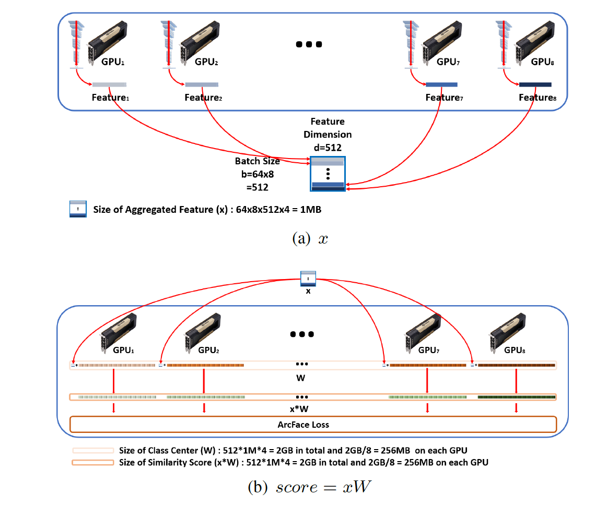

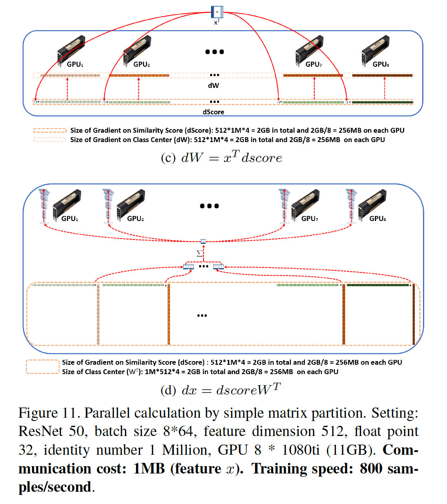

#### 5.2. 特征空间分析

​		**512维超球面空间是否足够大以容纳大规模身份？ **从理论上讲，是的

​		我们假设身份中心$W_j$遵循现实的球形均匀分布，对最近邻居的期望为[5]为

$$\mathbb{E}[\theta(W_j)] \rightarrow n^{-\frac{2}{d-1}}\Gamma(1 + \frac{1}{d-1})(\frac{\Gamma(\frac{d}{2})}{2\sqrt{\pi}(d-1)\Gamma(\frac{d-1}{2})})^{-\frac{1}{d-1}},\tag{7}$$

其中$d$为空间维度，$n$为身份数量，并且$\theta(W_j)=\min_{1\le i,j\le n,i\ne j}\arccos(W_i, W_j), \forall i, j$。图12中，我们给出128d、256d和512d空间中、类数量从10K到100M变化的$\mathbb{E}(\theta(W_j))$。高维空间很大，以致当类数呈指数增长时，$\mathbb{E}(\theta(W_j))$缓慢减小。

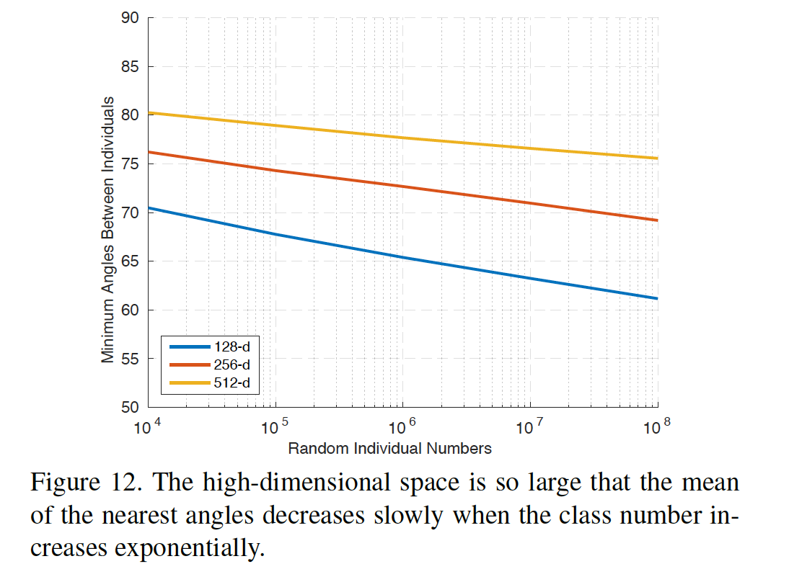