## A Discriminative Feature Learning Approach for Deep Face Recognition

### 摘要

​		卷积神经网络（CNN）已在计算机视觉社区中得到广泛使用，从而大大改善了最新技术。在大多数可用的CNN中，softmax损失函数用作监督信号来训练深度模型。为了增强深度学习特征的辨别能力，本文提出一种新的监督信号（称为center loss）进行人脸识别任务。具体而言，中心损失同时学习每个类的深度特征的中心及其相应类中心的距离。更重要的是，我们证明所提出的中心损失是可训练的，并且可以在CNN中轻松优化。利用softmax损失和中心损失的联合监督，我们可以训练鲁棒CNN来获得具有两个关键目标性的深度特征，即尽可能多的类间差异和类内紧凑，这对于人脸识别至关重要 。令人鼓舞的是，（具有如此联合监督的）CNN在几个重要人脸识别基准测试（LFW、YouTube Faces和MegaFace Challenge）上获得最佳准确率。尤其是，我们的新方法在小型训练集（包含500,000张以下图像和20000人以下）的协议下，在MegaFace（最大的公共领域面部基准）上取得了最佳效果，大大改善了先前的结果并设定了最新的 用于人脸识别和人脸验证任务的SOTA。

### 1	引言

​		CNN在视觉社区获得极大成功，其显著提高分类问题中的SOTA，例如目标、场景、行为等。它主要得益于大规模训练数据和端到端学习框架。最常用的CNN进行特征学习和标签预测，其将输入数据映射到深度特征（最后隐藏层的输出），然后预测标签，如图1所示。

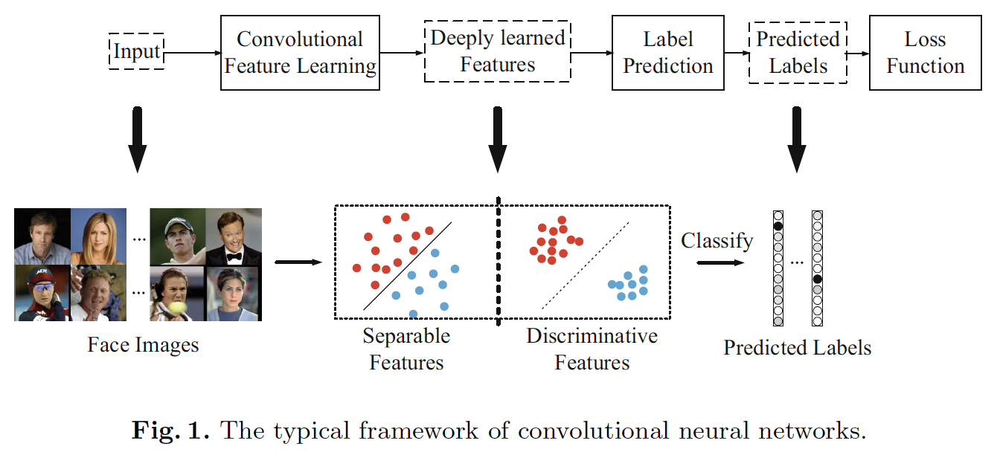

​		在通用目标、场景或动作识别中，可能测试样本的类在训练集中，其也称之为封闭识别（close-set identification）。因此，预测标签主导性能，并且softmax损失能够直接处理分类问题。以这种方式，标签预测（最后一个完全连接的层）的作用就像线性分类器，而且深度学习的特征很容易分离。

​		对于人脸识别任务，深度学习到的特征不仅需要可以分离，还需要辨别性。由于预先收集所有可能的测试身份以进行训练是不切实际的，因此CNN中的标签预测并不总是适用。深度学习的特征必须具有辨别性，并且必须具有足够的泛化能力，以在不进行标签预测的情况下识别新的未见类别。辨别能力表征了紧凑的类内变化和可分离的类间差异的特征，如图1所示。辨别性特征可以通过最近邻（Nearest Neighbor：NN）或k-NN算法很好的分类，其没有必要依赖标签预测。但是，softmax损失仅鼓励特征的可分离性。所产生的特征对于人脸识别而言不够有效。

​		为CNN中的辨别特征学习构建高效的损失函数并非易事。因为SGD基于mini-batch优化CNN，其不能非常好地反映深度特征的全局分布。由于训练集的巨大尺度，在每次迭代中输入所有训练样本是不实际的。作为一种替代方法，contrastive loss[10、29]和triplet loss[27]分别为图像对和三元组构建损失函数。但是，与图像样本相比，训练对或triplet的数量急剧增长。不可避免地导致收敛速度慢和不稳定。通过仔细选择图像对或triplets，这个问题可以得到部分缓解。但是，它显著增加计算复杂度，并且训练过程变得不方便。

​		本文中，我们提出一种新的损失（称为center loss）来高效地增强神经网络中深度学习特征的辨别能力。具体而言，我们学习每个类深度特征的中心（与特征具有相同维度的向量）。在训练中，我们同时更新中心和最小化深度特征及其对应类中心之间的距离。CNN在softmax损失和中心损失的联合监督下训练，并利用超参数来平衡两个监督信号。直观上，softmax损失迫使不同类的深度特征保持远离。中心损失高效地将相同类的深度拉向它们的中心。利用这种联合监督，不仅类间的特征差异被放大，类内的特征变化得到减少。因此，深度学习特征的辨别能力可以被高度增强。我们的主要贡献总结如下：

- 我们提出新的损失函数（称为中心损失）来最小化深度特征的类内距离。据我们所知，这是首次尝试使用如此的损失函数来帮助监督CNN的学习。利用中戏损失和softmax损失的联合监督，可以获得高度辨别性特征进行人脸识别，如我们的实验结果所支持的。
- 我们证明所提出的损失函数在CNN中能非常轻松地实现。我们的CNN是可训练的，并且可以直接通过标准的SGD优化。
- 我们在MegaFace Challenge [23]（最大的公共领域人脸数据库，可识别100万张人脸）的数据集上进行广泛的实验，并根据小型训练集的评估协议设置了最新的技术。我们还验证我们的新方法在LFW和YTF上的优雅性能。

### 2    相关工作

​		通过深度学习的人脸识别在这些年中获得一系列突破。将人脸图像映射到一定距离的想法始于[6]。 他们训练用于驱动相似性度量的Siamese网络，对于正类对来说较小，而对负类对则较大。Hu等[13]学习一个非线性变换，并产生具有正负人脸图像对之间margin的辨别性深度度量。这些方法需要图像对作为输入。最近，[31、34]通过挑战性的识别信号（softmax损失函数）来监督学习过程，其给深度学习特征带来更丰富的身份相关的信号。之后，[29、37]中采用联合身份和验证的监督信号，产生更具辨别性的特征。[32]通过将全连接层和损失函数添加到每个卷积层来增强监督。[21、25、27]中已证明三元损失的有效性。利用深度嵌入，一个锚和一个正类之间的距离被最小化，而一个锚和一个负类之间的距离被最大化，直到复合margin。它们在LFW和YTF数据集上获得最佳性能。

### 3	所提出的方法

​		本节中，我们介绍我们的方法。我们首先使用一个玩具示例（toy example）直观地显示深度学习特征的分布。受分布的启发，我们提出中心损失来提高深度学习特征的辨别能力，接着是一些讨论。

#### 3.1	A Toy Example

​		本节中，在MNIST数据集展示一个toy示例。我们将LeNets[19]修改到一个更深、更宽的网络，但是将最后隐藏层的输出数量减少到2（它表示深度特征的维度为2）。因此，我们可以直接在2D平面绘制特征以进行可视化。网络架构的更多袭击在表1中给出。Softmax损失函数为：

$$\mathcal{L}_S = -\sum_{i=1}^m \log\frac{e^{W_{y_i}^T\mathbf{x}_i + b_{y_i}}}{\sum_{j=1}^n e^{W_j^T\mathbf{x}_i + b_j}} \tag{1}$$

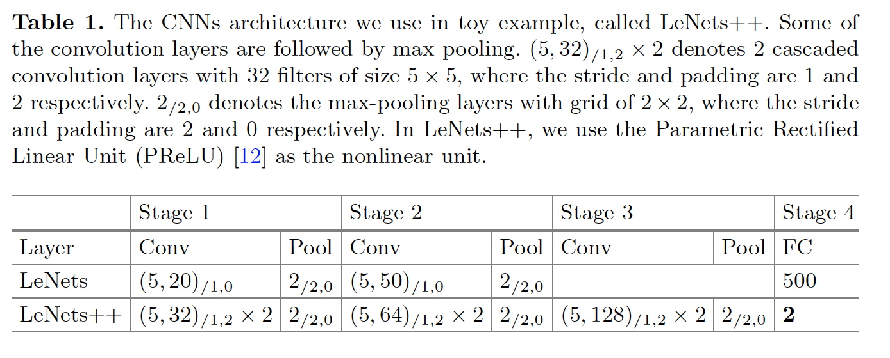

​		在式（1）中，$\mathbf{x}_i \in \mathbb{R}^d$表示第$i$个深度特征，属于第$y_i$个类。$d$为特征维度。$W_j \in \mathbb{R}^d$表示最后一层全脸机层的第$j$列权重，$W \in \mathbb{R}^{d \times n}$，$\mathbf{b}\in\mathbb{R}^n$为偏置项。mini-batch的大和类的数量分别为$m$和$n$。为了简化分析，我们省略偏置项。（事实上，性能几乎没有差异）。

​		产生的2D深度特征见图2来展示这种分布。因为最后的全连接层像一个线性分类器，所以通过决策边界区分不同类的深度特征。根据图2，我们观察到：（i）在softmax损失的监督下，深度学习特征可以分离，（ii）深度特征辨别性不足，因为它们仍表现出明显的类内变化。因此，不适合直接使用这些特征进行人脸识别。

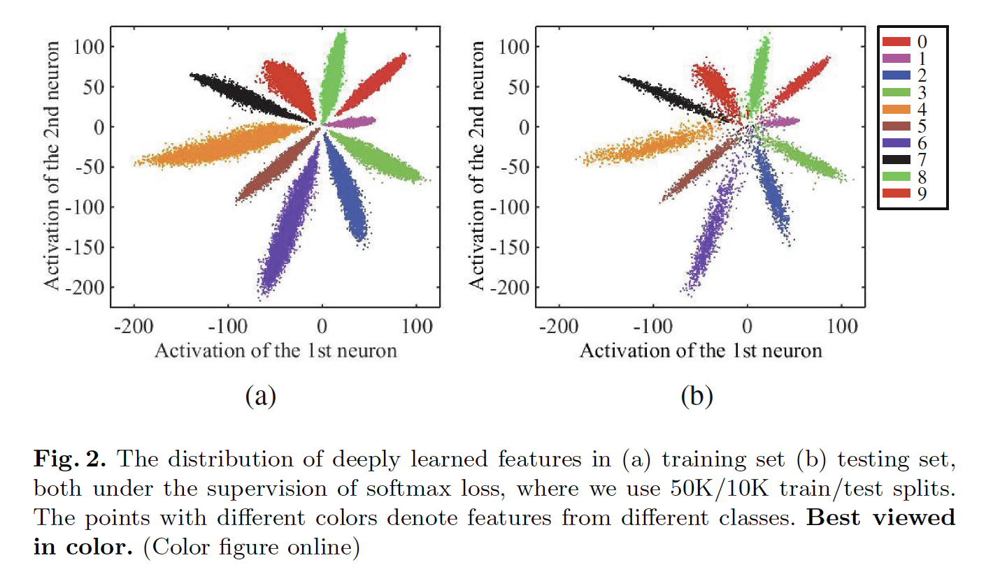

#### 3.2	The Center Loss

​		因此，如何开发一种有效的损失函数来改进深度学习特征的辨别能力？直观上，最小化类内变化，同时保持不同类的特征可分离是关键。为此，我们提出中心损失函数，如式（2）：

$$\mathcal{L}_C = \frac{1}{2}\sum_{i=1}^m \|\mathbf{x}_i - \mathbf{c}_{y_i}\|_2^2 \tag{2}$$

$\mathbf{c}_{y_i} \in \mathbb{R}^d$表示第$y_i$个类的深度特征的中心。公式有效地描述类内变化。理想上，$\mathbf{c}_{y_i}$应当随着深度特征的变换而更新。换句话说，我们需要考虑整个训练集，并平均每次迭代中每个类的特征，其不是高效的，甚至不可实践。因此，每直接使用中心损失。这可能是迄今为止至今在CNN中从未使用过这种中心损失的原因。

​		为了处理这个问题，我们作出两种必要修改。第一，我们不基于整个训练集更新中心，而是基于小批量执行更新。在每次迭代中，通过平均相应类的特征计算中心（在这种情况下，一些中心可能没有得到更新）。第二，为了避免由少量错误标签样本引起的较大干扰，我们使用标量$\alpha$来控制中心的学习率。与$\mathbf{x}_i$对应的$\mathcal{L}_C$的梯度和$\mathbf{c}_{y_i}$的更新公式为：

$$\frac{\partial \mathcal{L}_c}{\partial \mathbf{x}_i} = \mathbf{x}_i - \mathbf{c}_{y_i}\tag{3}$$

$$\Delta \mathbf{c}_j = \frac{\sum_{i=1}^m \delta(y_i = j)\cdot(\mathbf{c}_j - \mathbf{x}_i)}{1 + \sum_{i=1}^m\delta(y_i = j)}\tag{4}$$

其中如果$condition$满足，$\delta(condition)=1$，如果不满足，$\delta(condition)=0$，$\alpha$被约束到$[0,1]$。我们采用softmax损失和中心损失的联合监督来训练CNN以进行辨别性特征学习。公式为：

$$\begin{align}\mathcal{L} &= \mathcal{L}_S +\lambda\mathcal{L}_C \\&=\sum_{i=1}^m\log\frac{e^{W_{y_i}^T\mathbf{x}_i + b_{y_i}}}{\sum_{j=1}^ne^{W_j^T\mathbf{x}_i +b_j}} + \frac{\lambda}{2}\sum_{i=1}^m\|\mathbf{x}_i - \mathbf{c}_{y_i}\|_2^2 \tag{5}\end{align}$$

​		显然，受中心损失监督的CNN是可训练的，并且可以通过标准的SGD优化。标量$\lambda$用于平衡两个损失函数。如果$\lambda$设置为0，一般的softmax损失可以视为这种联合监督的一个特例。在算法1中，我们总结具有联合监督的CNN的学习细节。

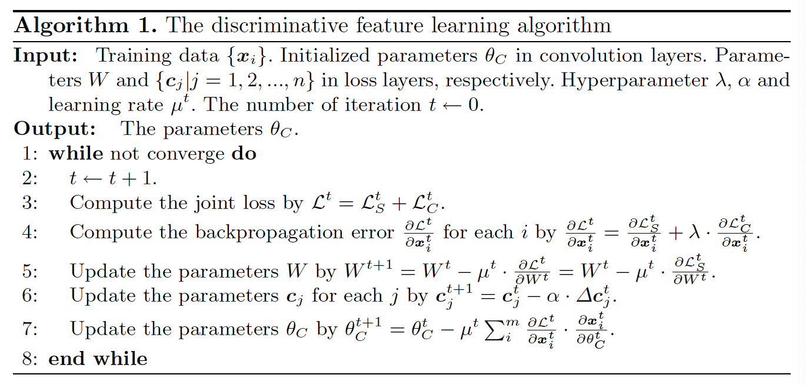

​		我们还进行实验来展示$\lambda$是如何影响分布的。图3展示不同$\lambda$导致不同的深度特征分布。利用合适的$\lambda$，深度特征的辨别能力可以明显增强。此外，宽度范围$\lambda$内的特征具有辨别性。因此，联合监督得益于深度学习特征的辨别能力，其对于人脸识别直观重要。

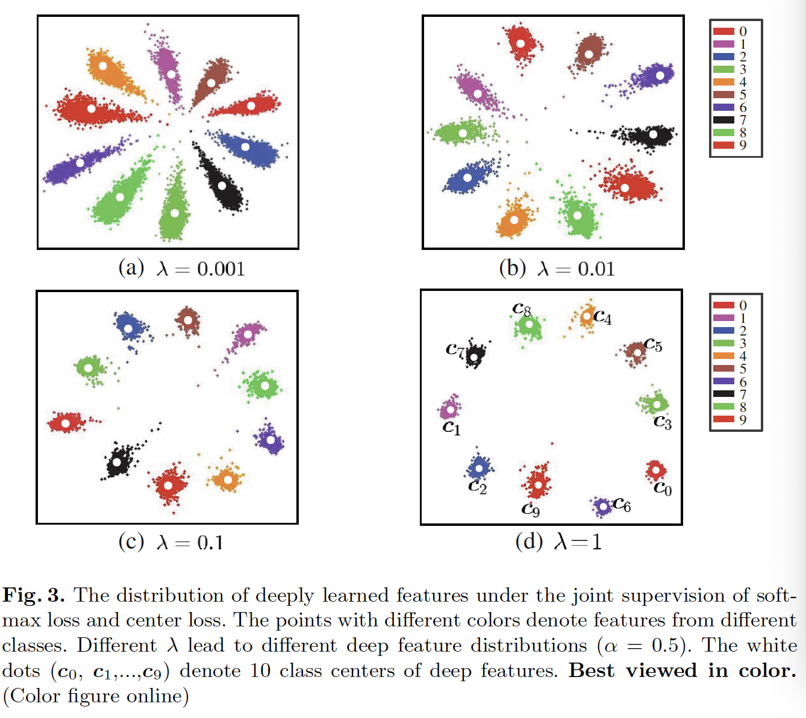

#### 3.3	讨论

- **The necessity of joint supervision**	如果我们仅使用softmax损失作为监督信号，产生的深度学习特征会包含较大的类内变化。另一方面，如果我们仅通过中心损失监督CNN，深度学习特征和中心损失衰退为零（在这一点，中心损失非常小）。简单地使用它们之一不能获得辨别特征学习。因此，组合它们以联合监督CNN是必要的，如我们的实验所确认的。
- **Compared to contrastive loss and triplet loss**  最近，还提出contrastive损失和三元损失来增强深度学习人脸特征的辨别性。但是，当构成训练集中的样本对或样本三元组时，contrastive损失和triplet损失遭遇剧烈的数据膨胀。我们的中心损失与softmax损失具有相同的要求，不需要复杂的训练样本重组。因此，我们的CNN的监督学习更有效，并且易于实现。此外，我们的损失函数更直接地针对类内紧凑性的学习目标，这对于区分特征学习非常有益。

### 4    实验

​		必要的实现细节见4.1节。然后，在4.2节中，我们研究参数$\lambda$和$\alpha$的敏感性。在4.3节和4.4节中，在几个公开域人脸数据集（LFW、YTF和MegaFace Challenge）上进行大量实验来验证所提出的方法的有效性。

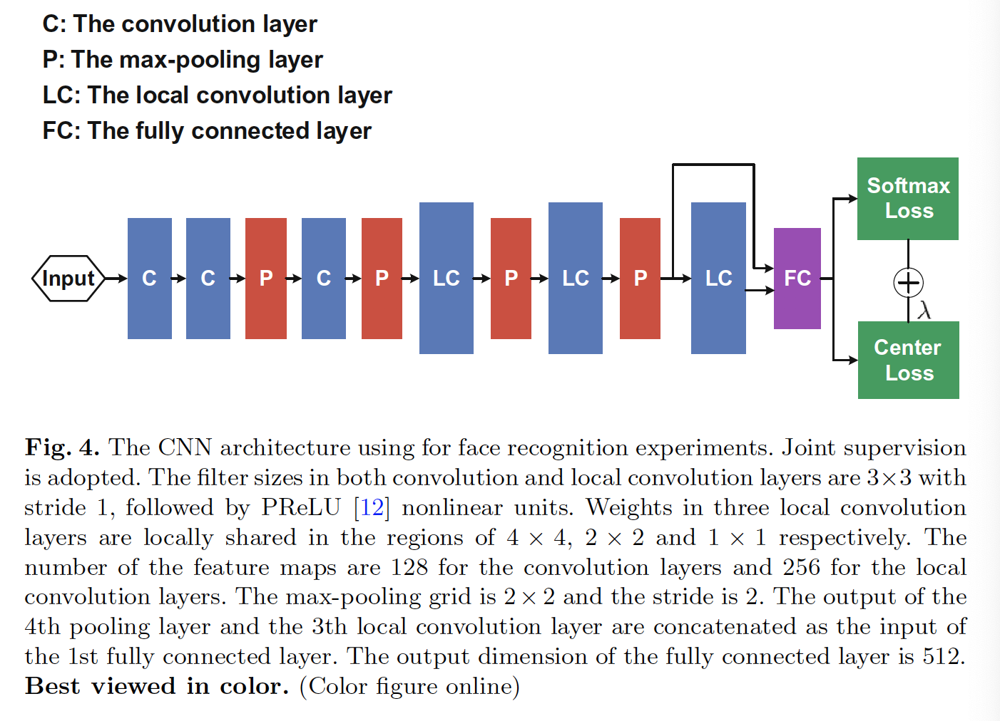

#### 4.1	实现细节

**Preprocessing**	通过最近提出的算法[40]检测图像中的人脸和它们的标志点。我们使用5个标志点（两只眼睛、鼻子和嘴角）进行相似性变换。当检测失败时，如果图像在训练集中，我们简单地丢弃这张图像，但是如果该图像时测试图像，那么使用提供的标志点。将人脸裁剪为$112 \times 96$的RGB图像。遵循先前的传统，RGB图像中的每个像素（[0,255]）通过减去127.5、除以128归一化。

**训练数据**	我们使用网络收集的训练数据，包括CASIA-WebFace、CACD200、Celebrity+。在删除测试数据集中出现的相同身份图像，大致变为0.7M图像，17289个人。在4.4节中，我们仅使用0.49M训练数据，接着是小训练集协议。水平翻转图像以进行数据增强。与[27]（200M）、[34]（4M）和[25]（2M）相比，他是一个小尺度训练集。

**CNN中的详细设置**	我们使用经过修改的Caffe [17]库实现了CNN模型。在这一节中，所有CNN模型有相同的架构，细节见图4。为了公平比较，我们分别训练三种模型，在softmax损失的监督（模型A）、softmax损失和contrastive损失监督（模型B）、softmax损失和center损失监督（模型C）。在两张GPU（TitanX）上，利用256的批大小训练模型。对于模型A和模型C，学习率从0.1开始，并且在16K、24K迭代时除以10。在28K迭代时完成训练，大约花费14h。对于模型B，我们发现它收敛较慢。因此，我们将学习率初始化为0.1，并在24K、36K迭代时，除以10。共训练42K，花费22h。

**测试中的详细设置**	深度特征来自第一个FC层的输出。我们提取每幅图像的特征，并将它水平翻转，并拼接它们作为表示。通过PCA后的两个特征的余弦距离计算得分。最近邻和阈值比较都用于识别和验证任务。注意，我们仅使用但模型进行所有测试。

#### 4.2 	参数$\lambda$和$\alpha$的实验

​		超参数$\lambda$主导类内变化，$\alpha$控制模型C的中心$c$的学习率。二者对于我们的模型都是非常关键。因此，我们进行两项实验来研究两个参数的敏感性。

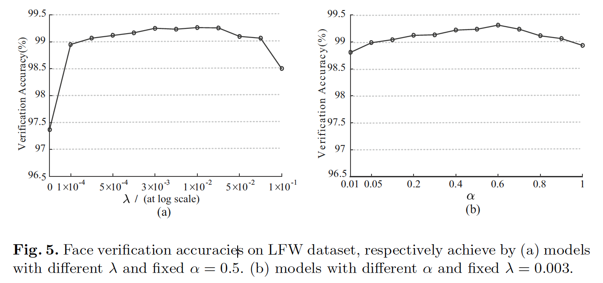

​		在第一个实验中，我们将$\alpha$固定为0.5，并从0到0.1变化$\lambda$以学习不同模型。这些模型在LFW数据集上的验证准确率见图5。仅使用softmax损失（$\lambda$为0的情况）不是好的选择是非常明显的，产生较差的验证性能。合适选择的$\lambda$值可以提高深度学习特征的验证准确率。我们还观察到，我们的模型的验证性能在较宽的$\lambda$范围上具有稳定性。在第二个实验中，我们固定$\lambda = 0.003$，并且$\alpha$从0.01到1变化以学习不同模型。这些模型在LFW上的验证准确率如图5所示。同样，我们模型的验证性能在很大的$\alpha$范围内仍保持稳定。

#### 4.3 	在LFW和YFT数据集上的实验

​		在这一部分中，我们在两个著名的非限制环境的人脸识别基准测试（LFW和YTF）上评估我们的单模型。它们是图像和视频中人脸识别的出色基准。它们中的一些示例如图6。我们的模型在0.7M外部数据上训练，与LFW和YTF没有重叠。本节中，对模型C，我们将$\lambda$固定为0.003，$\alpha$固定为0.5。

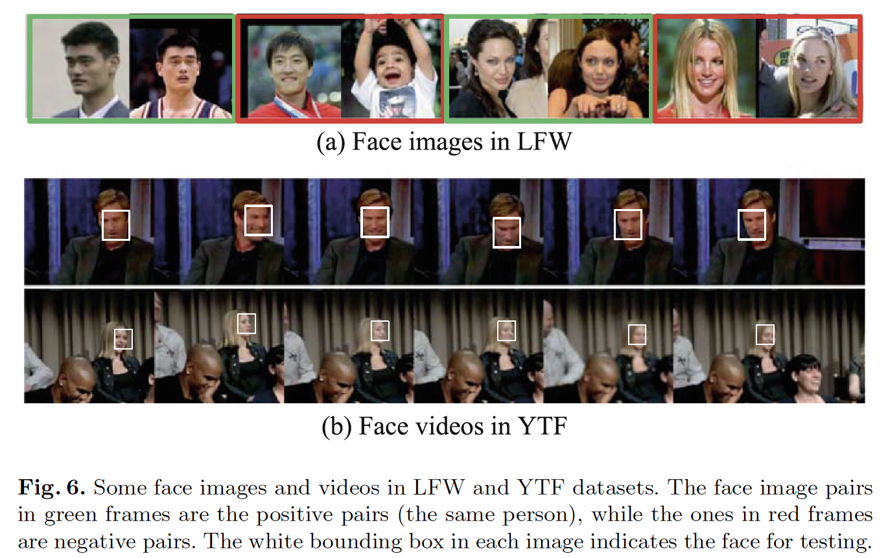

​		**LFW数据集**包含13233张来自5749个不同身份的网络收集图像，在姿态、表情和光照上具有较大变化。遵循带有标记的外部数据的不受限制的标准协议。 我们测试了6,000对人脸，并在表2中报告了实验结果。

​		**YTF数据集**包含1595个不同人的3425个视频，每个平均有2.15个视频。剪辑持续时间从48帧到6,070帧不等，平均长度为181.3帧。再次，我们遵循具有标签的外部数据的非限制协议，并在表2中报告5000个视频对上的结果。

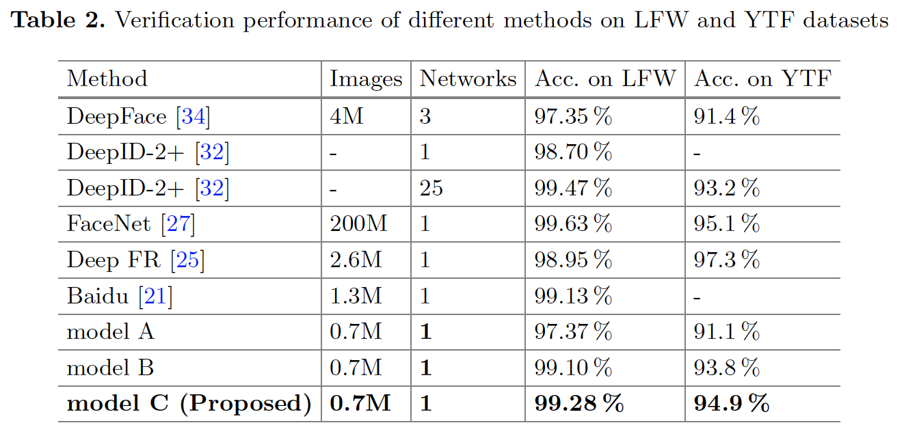

​		根据表2中的结果，我们有如下观察。第一，模型C（softmax损失和中心损失联合监督）大幅领先基线模型（模型A（仅受softmax损失监督）），其将（LFW上的97.37%和YTF上的91.1%）提高到（LFW上的99.28%和YTF上的94.9%）。这表明联合监督可以明显增强深度学习特征的辨别能力，证明中心损失的有效性。第二，与模型B（受softmax损失和contrastive损失的联合监督）相比，模型C获得更好的性能（99.10% vs 99.28%，93.9% vs 94.9%）。这表明中心损失相对于contrastive损失的优势。最后，与两个数据集上的最佳结果相比，所提出的模型C（远远更少的训练数据和更简单的网络架构）的结果在基于这两个数据库的排名最高的方法集中始终如一，优于表2中的大多数现有结果。这表明了提出模型C的优势。

#### 4.4	MagaFace Challenge上的实验

​		MegaFace数据集最近作为测试基准发布。 这是一个非常具有挑战性的数据集，旨在评估百万分之一的注意力分散器（不在测试集中的人）的人脸识别算法的性能。MegaFace数据包含gallery集和probe集。gallery集包含超过来自690K不同个体（如来自Yahoo的Flicker相册的子集）的超过百万图像。这个挑战中的probe集为两个已有数据库：Facescrub[24]和FGNet[1]。Facescrub数据集是公开可用的书用具，包含530个个体的100K照片（男性有55742张图像、女性有52076张图像）。可以通过在每个身份中添加足够的样本来减少可能的偏差。 FGNet数据集是一个人脸老化数据集，具有来自82个身份的1002张图像。 每个身份都有不同年龄（从0到69）的多张人脸图像。

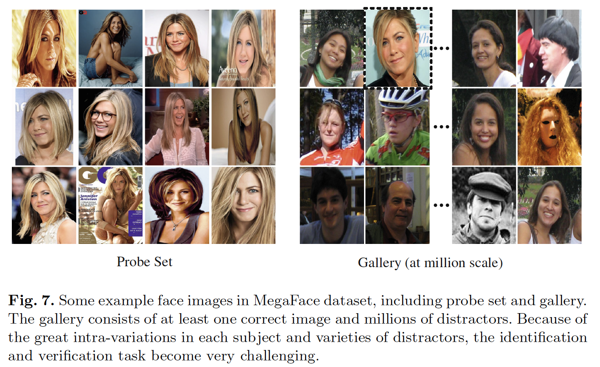

​		在两种协议（大型或小型训练集）下，存在几种测试场景（识别，验证和姿势不变）。如果训练集包含少于0.5M图像和20K主体，那么该数据集称为_small_。遵循小型训练集的协议，我们将训练图像的大小减小到0.49M，但是维持身份数量不变（集17189个主体）。丢弃与Facescrub数据集有重叠的图像。为了公平比较，我们还在小型训练集上以不同监督信号训练3种CNN模型。产生的模型称为模型A-、模型B-和模型C-。遵循4.3节中的相同设置，在模型C-中，$\lambda$设置为0.003，$\alpha$设置为0.5。我们使用提供的代码[23]进行实验，该代码仅在三个gallery之一（集合1）上测试我们的算法。

**人脸识别**

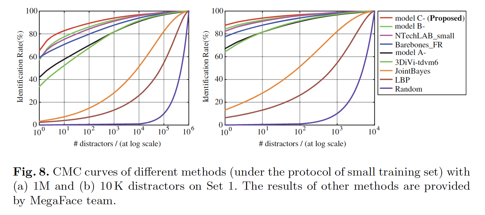

**人脸验证**

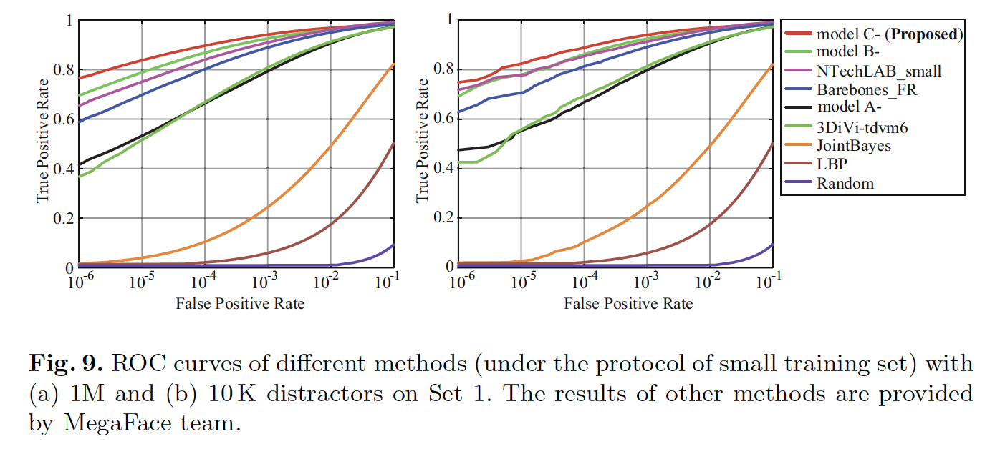

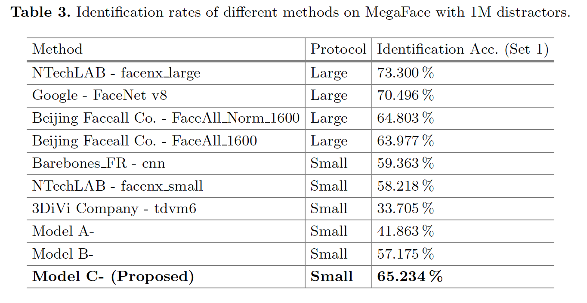

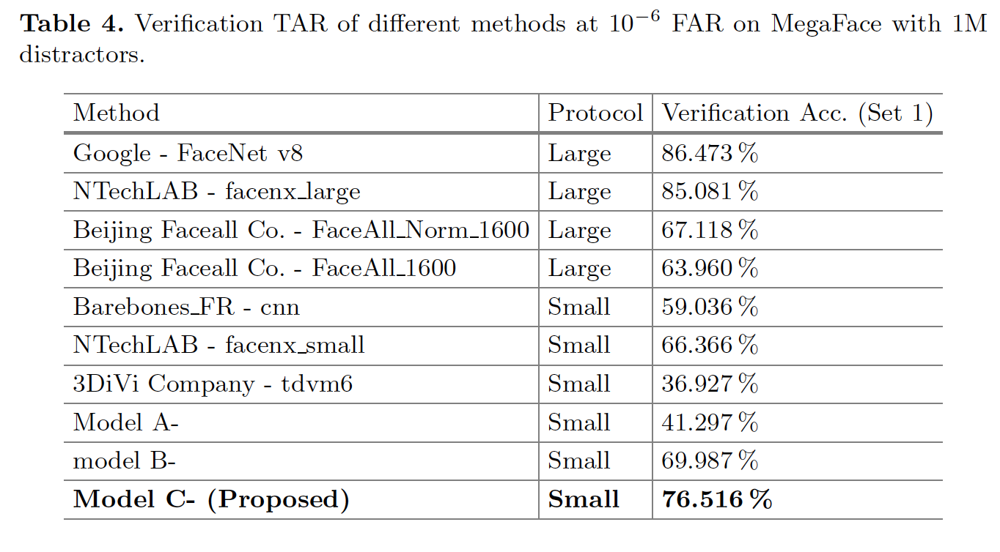